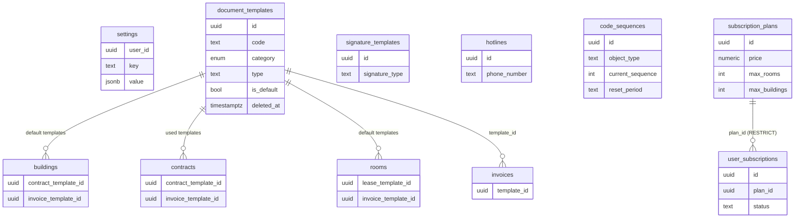
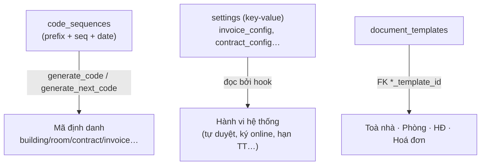
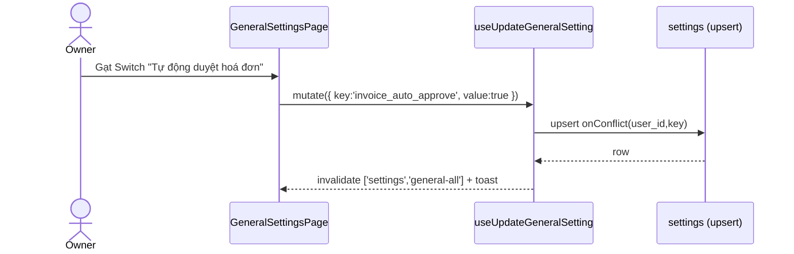
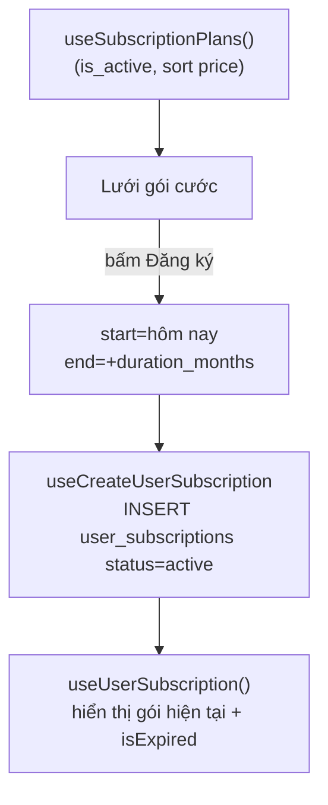

# Cài đặt · Danh mục · Tài liệu mẫu · Gói cước

> Domain "nền tảng cấu hình" của CRM: nơi mỗi owner tự định nghĩa **hành vi mặc định của hệ thống** (settings key-value), **mẫu in/biểu mẫu** (document_templates, signature_templates), **danh mục phụ trợ** (hotlines + hub điều hướng CategoriesPage), **quy tắc sinh mã** dùng xuyên hệ thống (code_sequences) và **gói cước thuê bao** (subscription_plans + user_subscriptions).
>
> Đây là domain "cài đặt một lần, dùng khắp nơi": dữ liệu ở đây không phải nghiệp vụ giao dịch mà là **tham số điều khiển** cho các domain khác (hợp đồng, hoá đơn, chỉ số, thu chi…).

---

## 1. Tổng quan & vai trò nghiệp vụ

Domain này gom 7 bảng phục vụ 4 nhóm chức năng, tất cả đều **per-owner** (`user_id` = chủ tài khoản):

| Nhóm | Bảng | Vai trò |
|------|------|---------|
| Cài đặt hệ thống | `settings` | Key-value JSONB: bật/tắt tính năng (tự duyệt hoá đơn, ký HĐ online…), thông tin công ty, cấu hình quy tắc tính tiền. |
| Tài liệu mẫu | `document_templates`, `signature_templates` | Mẫu Word/PDF để in HĐ / hoá đơn / biên bản; mẫu chữ ký điện tử. Buildings/rooms/contracts/invoices **tham chiếu** template mặc định. |
| Danh mục phụ trợ | `hotlines` | Danh bạ hotline. `CategoriesPage` là **hub điều hướng** tới mọi danh mục con của hệ thống (sổ quỹ, loại thu chi, nhà cung cấp, tầng…). |
| Sinh mã & Gói cước | `code_sequences`, `subscription_plans`, `user_subscriptions` | `code_sequences` = engine sinh mã định danh dùng chung; subscription = quản lý gói cước/giới hạn tài nguyên. |

**Đặc điểm chung về quyền (RLS):** trừ `subscription_plans` (bảng toàn cục, ai đăng nhập cũng đọc được), tất cả bảng còn lại theo mô hình **đơn giản `user_id = auth.uid()`** — tức là cấu hình thuộc về **chính owner**, KHÔNG chia sẻ qua `staff_can`/`can_access_building` như các bảng nghiệp vụ. Đây là điểm khác biệt đáng chú ý: nhân viên (staff) thao tác dữ liệu nghiệp vụ của owner được, nhưng các bảng cài đặt này (hotlines, code_sequences, settings, templates) RLS chỉ mở cho đúng `auth.uid()` của owner. (Lưu ý: admin/super_admin có thể có policy bypass riêng từ các migration RBAC sau này.)

> **Ghi chú về subsystem AI (RAG):** DB có 4 bảng `ai_conversations`, `ai_messages`, `ai_memory_embeddings`, `ai_usage_stats` — đây là **backend cho trợ lý AI dạng RAG** (Retrieval-Augmented Generation): lưu hội thoại + tin nhắn, sinh embedding (`embedding vector` + index HNSW/pgvector) để `search_similar_memories()` truy hồi "trí nhớ" theo độ tương đồng cosine, và `ai_usage_stats` theo dõi token/chi phí theo kỳ. Có sẵn trigger `auto_generate_conversation_title`, `update_conversation_stats_on_message`, RPC `get_conversation_context`. **Hiện chưa rõ UI** nào trong `src/pages` gắn vào subsystem này — coi như hạ tầng backend đã dựng sẵn, chưa lộ ra giao diện ở domain cài đặt.

---

## 2. Cấu trúc dữ liệu

### 2.1. `settings` — Cài đặt key-value JSONB

**Mục đích:** lưu mọi cấu hình hệ thống dưới dạng cặp `(key, value)` với `value` là JSONB linh hoạt (boolean / number / string / object / array).

Cột chủ chốt:
- `user_id` — chủ cấu hình.
- `key` (text) — tên khoá cấu hình. Có **2 phong cách key** cùng tồn tại:
  - **Key gộp (object)**: `company_info`, `contract_config`, `invoice_config`, `payment_config`, `notification_config`, `code_generation_config` — mỗi key chứa nguyên một object cấu hình (định nghĩa kiểu trong [useSettings.ts](src/hooks/useSettings.ts): `CompanyInfo`, `ContractConfig`…).
  - **Key đơn (scalar)**: ~20 key riêng lẻ như `invoice_auto_approve`, `contract_e_signing_enabled`, `invoice_payment_deadline_days` — mỗi key 1 giá trị boolean/number/string. Đây là nhóm mà `GeneralSettingsPage` đọc/ghi.
- `value` (jsonb, NOT NULL) — giá trị. Scalar được lưu dưới dạng JSONB literal (`'false'::jsonb`, `'5'::jsonb`, `'"monthly"'::jsonb`).
- Ràng buộc quan trọng: **UNIQUE (user_id, key)** — mỗi owner chỉ 1 bản ghi/khoá. Mọi ghi đều dùng `upsert ... onConflict: 'user_id,key'`.
- `id`, `created_at`, `updated_at` — chuẩn.

Không có FK ra/vào (bảng độc lập, tham chiếu logic qua giá trị `*_template_id` chứ không FK cứng).

### 2.2. `document_templates` — Mẫu tài liệu (HĐ/hoá đơn/biên bản)

**Mục đích:** lưu file mẫu (Word/PDF) upload lên Storage để in hợp đồng, hoá đơn, biên lai, biên bản bàn giao/thanh lý/gia hạn/chuyển nhượng.

Cột chủ chốt:
- `code` (varchar, **UNIQUE NOT NULL**) — mã mẫu tự sinh dạng `MHD000001` (sinh client-side trong hook, xem §4).
- `name`, `description` — tên + mô tả mẫu.
- `category` — enum **`template_category`** (xem §2 enum): `CONTRACT_NEW`, `CONTRACT_TERMINATION`, `CONTRACT_EXTENSION`, `CONTRACT_TRANSFER`, `INVOICE`, `RECEIPT`, `HANDOVER`.
- `type` (text, tự do) — phân loại UI thứ hai do hook quản (`signature` / `deposit_contract` / `lease_contract` / `handover_report` / `invoice` / `receipt` / `other`). **TemplatesPage lọc tab theo `type`, không phải `category`** — vì vậy hook có map `CATEGORY_TO_TYPE` để mẫu mới không "biến mất" khỏi mọi tab.
- `file_url` (NOT NULL) — URL object trong bucket private **`document-templates`**; `file_name` giữ tên gốc (có dấu) để hiển thị/tải; `file_size`, `file_type`.
- `content` (text), `variables` (jsonb, mặc định `[]`) — nội dung mẫu + danh sách biến thay thế (vd `{tenant_name}`, `{rent_price}`) để điền tự động khi in.
- `is_default` (bool) — **chỉ 1 mẫu default / category / user** (đảm bảo bởi trigger, xem §4).
- `is_active` (bool), `deleted_at` (timestamptz) — soft delete.

**Quan hệ FK (được tham chiếu vào):** đây là bảng có nhiều "khách hàng" nhất trong domain — được trỏ tới bởi:
- `buildings.contract_template_id`, `buildings.invoice_template_id`
- `contracts.contract_template_id`, `contracts.invoice_template_id`
- `rooms.lease_template_id`, `rooms.invoice_template_id`
- `invoices.template_id`

→ tức là toà nhà/phòng đặt mẫu mặc định, hợp đồng/hoá đơn ghi nhận mẫu đã dùng để in. (Sang domain **Toà nhà/Phòng**, **Hợp đồng**, **Hoá đơn**.)

### 2.3. `signature_templates` — Mẫu chữ ký điện tử

**Mục đích:** lưu chữ ký số để chèn vào HĐ/hoá đơn.

Cột chủ chốt:
- `code` (text, NOT NULL — **UNIQUE(user_id, code)**), `name`.
- `signature_type` (text, **CHECK IN ('UPLOAD','DRAW','TEXT')**) — chữ ký được tạo bằng cách: tải ảnh / vẽ tay / nhập text.
- `signature_url` — URL ảnh (khi UPLOAD), `signature_data` (jsonb) — dữ liệu nét vẽ (khi DRAW), `text_content` + `font_style` — nội dung + font (khi TEXT).
- `is_active`.

Không FK ra/vào cứng. **Lưu ý hiện trạng:** trang [SignaturesPage.tsx](src/pages/settings/SignaturesPage.tsx) hiện chỉ là **UI mock** (mảng `signatures` hardcode 2 dòng), chưa nối với bảng này — bảng đã sẵn sàng nhưng phần ghi/đọc chưa cài đặt ở frontend.

### 2.4. `hotlines` — Danh bạ hotline

**Mục đích:** quản lý danh sách số hotline (vd hỗ trợ kỹ thuật, an ninh toà nhà) hiển thị cho cư dân.

Cột: `name`, `phone_number` (cả hai CHECK không rỗng), `description`, `is_active`, `user_id`. Bảng phẳng, không FK ra/vào. RLS thuần `user_id = auth.uid()` cho cả SELECT/INSERT/UPDATE/DELETE.

### 2.5. `code_sequences` — Engine sinh mã định danh

**Mục đích:** cấu hình **bộ đếm sinh mã** cho từng loại đối tượng (`object_type`: building/room/contract/invoice/…), dùng xuyên hệ thống qua `generate_code()` / `generate_next_code()`.

Cột chủ chốt:
- `object_type` (text) — loại đối tượng cần sinh mã. **UNIQUE(user_id, object_type)**.
- `prefix` (text) — tiền tố (vd `HD`, `INV`).
- `separator` (mặc định `-`), `date_format` (text, vd `YYYY`/`YYMM`/`YYMMDD`/null) — phần ngày chèn vào mã.
- `sequence_length` (mặc định 4) — độ dài phần số (zero-pad).
- `current_sequence` (mặc định 0) — số chạy hiện tại.
- `reset_period` (text, **CHECK IN ('DAILY','MONTHLY','YEARLY','NEVER')**, mặc định `YEARLY`) — chu kỳ reset bộ đếm về 1.
- `last_reset_at` (date) — mốc reset gần nhất, dùng để quyết định có cần reset.

Không FK ra/vào. Là **bảng cấu hình thuần** được đọc/ghi bởi các hàm sinh mã.

### 2.6. `subscription_plans` — Gói cước (bảng toàn cục)

**Mục đích:** danh mục các gói thuê bao bán cho owner. **Không có `user_id`** → bảng dùng chung, RLS chỉ cho SELECT với `auth.role() = 'authenticated'`.

Cột chủ chốt: `name`, `description`, `price` (numeric, CHECK ≥0), `duration_months` (CHECK >0), `max_rooms`, `max_buildings` (giới hạn tài nguyên — nullable = không giới hạn), `features` (jsonb array các chuỗi tính năng), `is_active`.

**Được tham chiếu bởi** `user_subscriptions.plan_id`.

### 2.7. `user_subscriptions` — Đăng ký gói cước của owner

**Mục đích:** bản ghi owner đã mua gói nào, hiệu lực từ–đến.

Cột chủ chốt: `user_id`, `plan_id` (**FK → subscription_plans, ON DELETE RESTRICT** — không cho xoá gói đang được đăng ký), `start_date`, `end_date`, `status` (text, **CHECK IN ('active','expired','cancelled')**, mặc định `active`). RLS thuần `user_id = auth.uid()`.

---

## 3. Sơ đồ quan hệ dữ liệu

---

## 4. Quy tắc nghiệp vụ & tự động hoá

### 4.1. `seed_default_settings(p_user_id)` — gieo cấu hình mặc định
Hàm SQL ([20250101000012_add_settings_keys.sql](supabase/migrations/20250101000012_add_settings_keys.sql)) `INSERT` ~20 key đơn với giá trị mặc định, chia theo 4 tab (Hợp đồng 7 key, Hoá đơn 10 key, Thu chi 1 key, Thông báo 2 key), dùng `ON CONFLICT (user_id, key) DO NOTHING` để **idempotent** — gọi lại không ghi đè cấu hình người dùng đã chỉnh. Migration này còn có block backfill chạy `PERFORM seed_default_settings(...)` cho mọi user đang có settings. Comment trong migration ghi "called on user creation or first settings access" — frontend hiện không gọi RPC này (chỉ upsert từng key khi user bật/tắt), nên cấu hình mặc định chủ yếu do **DEFAULT trong hook** (`GENERAL_SETTINGS_DEFAULTS`) đảm nhận: nếu chưa có bản ghi → trả default, khi user đổi mới upsert tạo bản ghi.

**Invariant:** giá trị scalar luôn được serialize JSONB; frontend `useIndividualSetting` chỉ chấp nhận `boolean|number|string`, value không khớp → rơi về default.

### 4.2. `ensure_single_default_template()` (trigger) — 1 mẫu mặc định / category
Trigger `BEFORE INSERT OR UPDATE ON document_templates WHEN (NEW.is_default = TRUE)` ([016_document_templates.sql](supabase/migrations/016_document_templates.sql)): khi một mẫu được set `is_default = TRUE`, trigger `UPDATE` toàn bộ mẫu khác **cùng `user_id` + cùng `category`** về `is_default = FALSE` (bỏ qua bản ghi hiện tại, bỏ qua các bản đã soft-delete).
**Invariant:** tối đa 1 mẫu default/(user, category). Trong UI ([TemplatesPage.tsx](src/pages/settings/TemplatesPage.tsx)) toggle Switch "Mặc định" gọi `useUpdateDocumentTemplate({ is_default })` — trigger tự lo phần "tắt mẫu cũ".

### 4.3. Sinh mã `document_templates.code` (client-side `MHD...`)
**Không qua trigger DB.** Hook `generateTemplateCode()` trong [useDocumentTemplates.ts](src/hooks/useDocumentTemplates.ts) query mẫu mới nhất của user (chưa xoá), parse số từ `MHD000001` rồi `+1`, zero-pad 6 chữ số. Đây là sinh mã tuần tự đơn giản, không reset theo kỳ.
> Lưu ý đặt tên: RPC trigger tên `generate_template_code()` trong DB **không thuộc** bảng này — nó sinh mã `MT...` cho `income_expense_templates` (domain Thu chi). Đừng nhầm.

### 4.4. Upload file mẫu lên Storage (bucket private)
Khi tạo/sửa mẫu, hook upload file vào bucket **`document-templates`** (đã đặt `public=false` trong migration 016). Vì bucket private:
- Tên object phải **sanitize** (`sanitizeStorageFileName`): bỏ dấu tiếng Việt, thay khoảng trắng/ký tự đặc biệt bằng `_`, vì Storage từ chối key có dấu/space ("Invalid key"). Tên gốc vẫn lưu ở `file_name`.
- Xem/tải file **không dùng public URL** (sẽ 400) mà tạo **signed URL** ngắn hạn: `useViewTemplate` tạo signed URL 60s rồi `window.open`; `useDownloadTemplate` gọi `storage.download()` qua session để tải blob. Khớp với quy ước chung của dự án "bucket private + signed URL".
- Có **rollback**: nếu `INSERT` DB lỗi sau khi upload thành công → hook `storage.remove()` file vừa upload để tránh rác.

### 4.5. `generate_code()` / `generate_next_code()` — engine sinh mã dùng chung
Hai hàm trên `code_sequences`:
- **`generate_code(p_user_id, p_object_type)`** ([008_triggers_functions.sql](supabase/migrations/008_triggers_functions.sql)): đọc config theo `(user_id, object_type)`; nếu không thấy → **RAISE EXCEPTION** (yêu cầu config phải tồn tại trước). Kiểm tra `reset_period` (DAILY/MONTHLY/YEARLY) so với `last_reset_at`: nếu sang kỳ mới → reset seq về 1, ngược lại `current_sequence + 1`. Ghép `prefix + separator + date_part + LPAD(seq, sequence_length)`, rồi `UPDATE` lại `current_sequence` + `last_reset_at`.
- **`generate_next_code(p_user_id, p_object_type)`** ([029_missing_features.sql](supabase/migrations/029_missing_features.sql)): bản "an toàn hơn" — `SELECT ... FOR UPDATE` (khoá hàng tránh race), và nếu **chưa có config thì tự tạo mặc định** (`prefix = 2 ký tự đầu object_type`, `date_format='YYMM'`, `reset_period='MONTHLY'`). Hỗ trợ reset MONTHLY/YEARLY.

**Invariant:** mã sinh ra duy nhất tăng dần trong kỳ; bộ đếm reset theo `reset_period`. `code_sequences` không có UI riêng trong domain — nó được điều khiển gián tiếp qua object `code_generation_config` (settings) ở mức ý niệm, còn các trigger sinh số HĐ/hoá đơn thực tế (`generate_contract_number`, `generate_invoice_number_v2`) tự tính sequence riêng. Nói cách khác `code_sequences` là engine **có sẵn** nhưng nhiều luồng sinh mã trong hệ thống dùng cách tính riêng thay vì gọi 2 hàm này.

### 4.6. Trigger `updated_at`
`settings`, `document_templates`, `signature_templates`, `code_sequences` gắn trigger `update_updated_at_column()` (`set_*_updated_at`) để tự cập nhật `updated_at` mỗi lần UPDATE — `settings`/`signature_templates`/`code_sequences` ở [008_triggers_functions.sql](supabase/migrations/008_triggers_functions.sql), `document_templates` ở [016_document_templates.sql](supabase/migrations/016_document_templates.sql). Riêng `hotlines`, `subscription_plans`, `user_subscriptions` có cột `updated_at` nhưng **KHÔNG có trigger** — giá trị chỉ đổi khi client ghi trực tiếp (các hook không set nên thực tế giữ nguyên). (`hotlines` chỉ có trigger `hotlines_set_user_id_audit` BEFORE INSERT từ migration RBAC, không liên quan `updated_at`.)

### 4.7. RLS — tóm tắt bất biến quyền
- `settings`, `hotlines`, `code_sequences`, `signature_templates`, `document_templates`, `user_subscriptions`: **chỉ owner (`auth.uid() = user_id`)** thao tác — cấu hình mang tính cá nhân của chủ tài khoản. (Migration RBAC về sau có thể thêm bypass cho admin/super_admin.)
- `subscription_plans`: SELECT cho mọi user đăng nhập (danh mục gói toàn cục), không cho ghi từ client.
- `user_subscriptions.plan_id` **ON DELETE RESTRICT**: không thể xoá một `subscription_plan` khi còn đăng ký trỏ tới.

---

## 5. Quy trình theo từng trang (page)

### 5.1. `GeneralSettingsPage` — Cài đặt chung
**Route:** `/settings/general` · **File:** [GeneralSettingsPage.tsx](src/pages/settings/GeneralSettingsPage.tsx)

**Mục đích:** bật/tắt và chỉnh ~20 cấu hình hành vi hệ thống, gom theo 5 tab: Cài đặt cơ bản (logo) · Hợp đồng · Hoá đơn · Thu chi · Thông báo.

**Dữ liệu hiển thị:**
- `useGeneralSettings()` — query 1 lần toàn bộ key đơn (`.in('key', keys)`), merge với `GENERAL_SETTINGS_DEFAULTS` để mọi key luôn có giá trị.
- `useCompanyInfo()` — đọc key gộp `company_info` (cho logo ở tab cơ bản).

**Thao tác từng bước:**
1. User gạt Switch / chọn Select / nhập NumberInput trên một dòng cấu hình.
2. `SettingRow.onChange(key, value)` → `handleSettingChange` → `useUpdateGeneralSetting().mutate({ key, value })`.
3. Hook **upsert** vào `settings` với `onConflict: 'user_id,key'` (tạo mới nếu chưa có, ghi đè nếu đã có).
4. `onSuccess` → invalidate `['settings','general-all']` (refetch) + toast "Dữ liệu đã được CẬP NHẬT thành công".

Tab cơ bản: nút "Tải lên logo" mở file picker; hiện tại chỉ tạo `URL.createObjectURL` preview cục bộ và lưu vào `company_info.company_logo_url` (comment trong code ghi rõ "in production, upload to Supabase Storage" — chưa upload thật).

**Validate / edge case:**
- Mỗi item có kiểu (`toggle`/`select`/`number`) với `min`/`max` (vd hạn thanh toán 1–90 ngày) ở UI; không có zod riêng — giá trị được upsert thẳng dưới dạng JSONB scalar.
- Chưa đăng nhập → hook throw "User not authenticated", query `enabled: !!user?.id`.
- Giá trị JSONB lạ (object thay vì scalar) → `useIndividualSetting` trả default.

### 5.2. `TemplatesPage` — Mẫu biểu
**Route:** `/settings/templates` · **File:** [TemplatesPage.tsx](src/pages/settings/TemplatesPage.tsx) · **Hook:** [useDocumentTemplates.ts](src/hooks/useDocumentTemplates.ts)

**Mục đích:** quản lý 7 loại mẫu (theo `type`): chữ ký, HĐ đặt cọc, HĐ thuê, BB bàn giao, mẫu hoá đơn, mẫu thu chi, biểu mẫu khác.

**Dữ liệu hiển thị:** mỗi tab gọi `useDocumentTemplatesByType(type)` → query `document_templates` lọc `type = ?`, `deleted_at IS NULL`. Có ô tìm kiếm lọc theo `name`/`code` (client-side).

**Thao tác từng bước:**
1. **Thêm mẫu** (`CreateTemplateDialog`): nhập name/category/description + chọn file → `useCreateDocumentTemplate`:
   - sinh `code` (`MHD...`) → upload file vào bucket `document-templates` (sanitize tên) → lấy publicUrl → `INSERT` bản ghi (kèm `type` map từ `category`, `variables`, `content`).
   - Lỗi `23505` (trùng mã) → toast "Mã mẫu đã tồn tại"; lỗi insert → rollback xoá file.
2. **Xem** (`Eye`): `useViewTemplate` tạo signed URL 60s → mở tab mới.
3. **Tải** (`Download`): `useDownloadTemplate` tải blob qua SDK → tạo `<a download>`.
4. **Sửa** (`EditTemplateDialog`): `useUpdateDocumentTemplate` — nếu thay file thì upload file mới, cập nhật `file_url/...`, xoá file cũ (best-effort).
5. **Toggle "Mặc định"**: gọi update `is_default` → trigger `ensure_single_default_template` tắt mẫu default cũ cùng category.
6. **Xoá** (`DeleteTemplateDialog`): `useDeleteDocumentTemplate` = **soft delete** (`deleted_at = now()`), không xoá file Storage.
7. Nút **"Xem mã biến"** (`TemplateCodesDialog`): tra cứu danh sách biến `{...}` dùng trong mẫu.

**Edge case:** TemplatesPage lọc theo `type` nhưng dialog tạo chỉ thu `category` → hook bù bằng `CATEGORY_TO_TYPE` để mẫu mới hiện đúng tab. Bucket private nên tuyệt đối không nhúng public URL.

### 5.3. `SignaturesPage` — Mẫu chữ ký
**Route:** `/settings/signatures` · **File:** [SignaturesPage.tsx](src/pages/settings/SignaturesPage.tsx)

**Mục đích (thiết kế):** quản lý chữ ký điện tử (Upload ảnh / Vẽ / Nhập text) → bảng `signature_templates`.
**Hiện trạng:** **UI mock** — render mảng `signatures` hardcode, 3 nút (Tải ảnh / Vẽ / Nhập text) chưa gắn handler, **chưa đọc/ghi DB**. Bảng `signature_templates` đã sẵn (có `signature_type` CHECK `UPLOAD/DRAW/TEXT`) nhưng chưa có hook (`useSignatures` không tồn tại). Đây là phần để hoàn thiện sau.

### 5.4. `CategoriesPage` — Hub danh mục
**Route:** `/settings/categories` · **File:** [CategoriesPage.tsx](src/pages/settings/CategoriesPage.tsx)

**Mục đích:** **trang điều hướng** (không CRUD trực tiếp), gom link tới mọi danh mục con qua các nhóm:
- **Tài chính**: Sổ quỹ (`/finance/cashbooks`), Gạch nợ tự động, Loại thu chi, Định mức dịch vụ, Đồng hồ công tơ.
- **Tài sản**: Nhà cung cấp, Kho tài sản, Loại tài sản, Lịch sử di chuyển/sửa chữa.
- **Khác** (standalone): Quản lý Hotline (`/settings/categories/hotlines`), Danh mục chung, Danh sách tầng, Loại công việc.

Mỗi item là `<Link>` tĩnh; không gọi hook. Là "bản đồ" sang các domain khác (thu chi, tài sản, chỉ số…).

### 5.5. `HotlinesPage` — Quản lý Hotline
**Route:** `/settings/categories/hotlines` · **File:** [HotlinesPage.tsx](src/pages/settings/categories/HotlinesPage.tsx) · **Hook:** [useHotlines.ts](src/hooks/useHotlines.ts)

**Mục đích:** CRUD danh bạ hotline. Dùng component dùng chung `CategoryCrudPage` ([CategoryCrudPage.tsx](src/pages/settings/categories/CategoryCrudPage.tsx)) — bảng + dialog Thêm/Sửa + AlertDialog xác nhận xoá.

**Thao tác từng bước:**
1. **Thêm**: nút "Thêm mới" → dialog với fields (name*, phone_number*, description, is_active checkbox) → `useCreateHotline.mutate(values)` → `INSERT { ...values, user_id }` → invalidate `['hotlines']` + toast.
2. **Sửa**: icon bút → dialog điền sẵn `getFormValues` → `useUpdateHotline.mutate({ id, updates })`.
3. **Xoá**: icon thùng rác → AlertDialog → `useDeleteHotline.mutate(id)` (**hard delete**).

**Validate / edge case:** `name`/`phone_number` `required` ở UI + CHECK không rỗng ở DB. `useHotlines` query lỗi → trả `[]` (không throw, log console). RLS: chỉ thấy/sửa hotline của chính owner.

### 5.6. `GeneralCategoriesPage` — Danh mục chung
**Route:** `/settings/categories/general` · **File:** [GeneralCategoriesPage.tsx](src/pages/settings/categories/GeneralCategoriesPage.tsx)
Hiện chỉ là **`PlaceholderPage`** (chưa cài đặt nội dung). Để trống chờ phát triển.

### 5.7. `SubscriptionPage` — Gói cước
**Route:** `/account/subscription` · **File:** [SubscriptionPage.tsx](src/pages/account/SubscriptionPage.tsx) · **Hook:** [useSubscription.ts](src/hooks/useSubscription.ts)

**Mục đích:** xem gói cước hiện tại + danh sách gói khả dụng + đăng ký gói.

**Dữ liệu hiển thị:**
- `useSubscriptionPlans()` — gói `is_active=true`, sắp theo `price` tăng dần.
- `useUserSubscription()` — gói `status='active'` mới nhất của user, join `plan:subscription_plans(*)`. Tính `isExpired = end_date < now`.

**Thao tác từng bước:**
1. Bấm **"Đăng ký"** trên một gói → `handleSubscribe(planId, durationMonths)`: tính `start_date = hôm nay`, `end_date = +duration_months` → `useCreateUserSubscription.mutate({ plan_id, start_date, end_date, status:'active' })` → `INSERT { ...values, user_id }`.
2. (Hook cũng có `useUpdateUserSubscription`, `useCancelUserSubscription` set `status='cancelled'` — chưa nối nút trên trang này.)

**Validate / edge case:** gói đang dùng (`isCurrent`) bị disable nút. Chưa đăng ký gói nào → hiển thị "Bạn chưa đăng ký gói cước nào". `max_rooms`/`max_buildings` null = không giới hạn (ẩn dòng). **Lưu ý**: trang chỉ tạo bản ghi đăng ký, **chưa có cổng thanh toán** và **chưa enforce giới hạn** `max_rooms/max_buildings` ở tầng tạo phòng/toà — đây là dữ liệu hiển thị/đăng ký, chưa phải hàng rào chặn nghiệp vụ.

---

## 6. Liên kết sang domain khác (vào / ra)

**Ra (domain này cung cấp tham số/cấu hình cho nơi khác):**
- **`document_templates` → Toà nhà / Phòng / Hợp đồng / Hoá đơn**: qua FK `contract_template_id`, `invoice_template_id`, `lease_template_id`, `template_id`. Toà/phòng đặt mẫu in mặc định; HĐ/hoá đơn ghi nhận mẫu đã dùng. Khi in HĐ/hoá đơn, các domain đó đọc mẫu + điền `variables`.
- **`settings` → toàn hệ thống**: key như `invoice_auto_approve`, `invoice_auto_approve_meter`, `contract_e_signing_enabled`, `contract_auto_create_on_renewal`, `invoice_payment_deadline_days`, `payment_auto_approve` điều khiển hành vi của domain **Hoá đơn**, **Chỉ số (meter)**, **Hợp đồng**, **Thu chi**. (Các domain tương ứng đọc settings để quyết định auto-duyệt, hạn thanh toán, ký online…)
- **`code_sequences` → mọi domain cần sinh mã**: engine `generate_code`/`generate_next_code` cấp mã cho building/room/contract/invoice… (dù nhiều luồng dùng trigger sinh số riêng).
- **`subscription_plans.max_rooms/max_buildings` → Toà nhà / Phòng**: giới hạn tài nguyên (hiện chưa enforce cứng).

**Vào (domain này điều hướng / phụ thuộc nơi khác):**
- **`CategoriesPage` → Tài chính / Tài sản / Chỉ số / Vận hành**: hub link sang `/finance/cashbooks`, loại thu chi, định mức dịch vụ, đồng hồ công tơ, nhà cung cấp, kho/loại tài sản, tầng, loại công việc — domain Cài đặt đóng vai "cổng vào" các danh mục con thuộc domain khác.
- **`user_subscriptions.user_id` / mọi bảng `user_id` → Auth (auth.users)**: gắn cấu hình vào chủ tài khoản; `ON DELETE CASCADE` khi user bị xoá.
- **Subsystem AI (`ai_*`)**: hạ tầng RAG độc lập (pgvector), chưa nối UI ở domain này — về lâu dài có thể trở thành "trợ lý" đọc context xuyên các domain.
