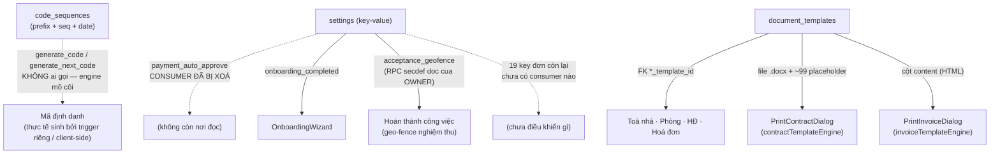
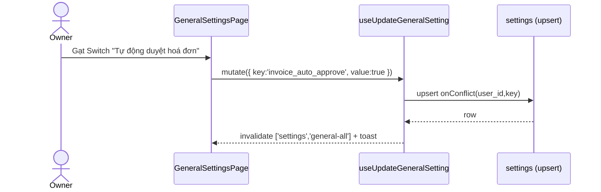
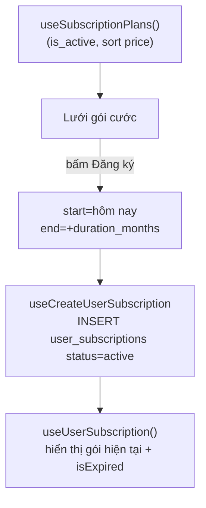

# Cài đặt · Danh mục · Tài liệu mẫu · Gói cước

> Domain "nền tảng cấu hình" của CRM: nơi mỗi owner tự định nghĩa **hành vi mặc định của hệ thống** (settings key-value), **mẫu in/biểu mẫu** (document_templates, signature_templates), **danh mục phụ trợ** (hotlines + hub điều hướng CategoriesPage), **quy tắc sinh mã** dùng xuyên hệ thống (code_sequences) và **gói cước thuê bao** (subscription_plans + user_subscriptions).
>
> Đây là domain "cài đặt một lần, dùng khắp nơi": dữ liệu ở đây không phải nghiệp vụ giao dịch mà là **tham số điều khiển** cho các domain khác (hợp đồng, hoá đơn, chỉ số, thu chi…).

---

## 1. Tổng quan & vai trò nghiệp vụ

Domain này gom 7 bảng phục vụ 4 nhóm chức năng, tất cả đều **per-owner** (`user_id` = chủ tài khoản):

| Nhóm | Bảng | Vai trò |
|------|------|---------|
| Cài đặt hệ thống | `settings` | Key-value JSONB: bật/tắt tính năng (tự duyệt hoá đơn, ký HĐ online…), thông tin công ty, cấu hình quy tắc tính tiền. |
| Tài liệu mẫu | `document_templates`, `signature_templates` | Mẫu `.docx` (file) + `content` HTML để in HĐ / hoá đơn / biên bản; mẫu chữ ký điện tử. Buildings/rooms/contracts/invoices **tham chiếu** template mặc định. |
| Danh mục phụ trợ | `hotlines` | Danh bạ hotline. `CategoriesPage` là **hub điều hướng** tới mọi danh mục con của hệ thống (sổ quỹ, loại thu chi, nhà cung cấp, tầng…). |
| Sinh mã & Gói cước | `code_sequences`, `subscription_plans`, `user_subscriptions` | `code_sequences` = engine sinh mã định danh dùng chung; subscription = quản lý gói cước/giới hạn tài nguyên. |

**Đặc điểm chung về quyền (RLS):** dữ liệu vẫn **keyed theo `user_id` owner**, nhưng sau loạt migration RBAC 2026-05 thì quyền truy cập đã tách thành 3 tầng — KHÔNG còn là "owner-only thuần" cho cả 7 bảng:

- **`hotlines`, `document_templates`, `signature_templates` — RBAC cấp tổ chức (org-wide):** policy `*_rbac` dùng helper `can_access_org_entity(_resource, _action)` ([20260527000009_rbac_phase5_misc.sql](supabase/migrations/20260527000009_rbac_phase5_misc.sql) — nhóm E "global entities", không gắn building), đối chiếu `roles.permissions` key `hotline` (hotlines) / `templates` (2 bảng mẫu) qua `staff_assignments`. Staff có quyền role tương ứng thao tác được trên dữ liệu của owner, và quyền **KHÔNG phân theo toà nhà** — staff chỉ được gán vài toà vẫn thấy/sửa toàn bộ hotline + mẫu biểu của org (chủ ý thiết kế: mẫu biểu/danh bạ dùng chung toàn tổ chức). Lưu ý kỹ thuật: helper chỉ trả boolean theo role, **không so `user_id` của dòng với owner của staff** — staff đạt điều kiện sẽ qua policy với mọi dòng trong bảng; nếu DB có nhiều org thì phạm vi thực tế rộng hơn "org của mình". Các policy owner-only cũ (`Users can manage own templates`, `hotlines_*`, `Users can manage own signature templates`) đã bị **DROP** ở [20260528000003_rbac_batch_f_drop_legacy.sql](supabase/migrations/20260528000003_rbac_batch_f_drop_legacy.sql).
- **`settings`, `code_sequences`, `user_subscriptions` — vẫn owner (`auth.uid() = user_id`):** batch F chủ ý "không động" các bảng này. Riêng `settings` có thêm bộ policy `settings_staff_insert/update/delete` ([20260510000056_staff_write_rls.sql](supabase/migrations/20260510000056_staff_write_rls.sql), mapping `('settings','settings')`) cho staff có quyền role `settings`.create/edit/delete **GHI** lên settings của owner qua `staff_can()` — nhưng **không có policy staff SELECT** → staff ghi được mà không đọc lại được dòng của owner (bất đối xứng; FE hiện cũng không dùng nhánh này, xem §6).
- **Bypass:** mọi bảng trong domain (kể cả `settings`, `code_sequences`, `user_subscriptions`, `subscription_plans`) đều có policy `*_admin_all` cho user mang role Admin (`is_admin()`) từ [20260506000002_admin_bypass_rls.sql](supabase/migrations/20260506000002_admin_bypass_rls.sql), cộng `*_super_admin_all` cho super admin ở các migration sau.

`subscription_plans` ngoài bypass trên vẫn là bảng toàn cục: SELECT cho mọi user đăng nhập, không cho ghi từ client.

**Đặc điểm "phi toà nhà":** cả 7 bảng đều **không có cột `building_id`/`area_id`** — scope duy nhất là `user_id` owner; không trang nào trong domain có ô lọc toà nhà/khu vực. Điểm chạm per-building duy nhất là chiều ngược: `buildings`/`rooms` giữ FK mẫu mặc định trỏ về `document_templates` (§2.2).

**Ranh giới với các kho cấu hình KHÁC bảng `settings`** (mọc thêm 2026-06 → 07, dễ tìm nhầm chỗ):

| Cấu hình | Nằm ở đâu | Chi tiết |
|----------|-----------|---------|
| Hiển thị trang Phòng trống công khai (`soon_days`, `show_rented`, `hotline_id`) | Bảng riêng **`public_room_settings`** (1 dòng/owner, RLS owner-only), KHÔNG phải key settings | [usePublicRoomSettings](src/hooks/usePublicRoomSettings.ts), tab Cài đặt hiển thị `/sale-phong` — xem [15-kenh-cong-khai-sale-thu-tien.md](15-kenh-cong-khai-sale-thu-tien.md) |
| Lương-thưởng v5 (chuyên cần/streak/coverage + **feature flags & kill-switch** `system_v5.feature_flags`/`stage`) | Cột jsonb **`salary_bonus_rules.rules`** (khối `attendance_v5`/`streak_v5`/`coverage_v5`/`system_v5`), đọc/ghi qua RPC `get_salary_v5_config`/`set_salary_v5_config` (owner-only, audit, key 💰 hiệu lực tháng kế) | [20260703000001_v5_foundation.sql](supabase/migrations/20260703000001_v5_foundation.sql) — xem [17-luong-thuong.md](17-luong-thuong.md) |
| Tuỳ chọn UI nhỏ per-USER (không phải per-owner) | Cột jsonb **`profiles.ui_preferences`** | §2.8 |
| Bộ lọc đang chọn của từng trang | **sessionStorage** key `flt:*` qua [usePersistedState](src/hooks/usePersistedState.ts) (per-tab, mất khi đóng tab — chủ ý, KHÔNG lưu server) | commit 7fd2d3f |

> **Ghi chú về subsystem AI:** backend RAG legacy gồm `ai_conversations`, `ai_messages`, `ai_memory_embeddings`, `ai_usage_stats` cùng `search_similar_memories()`/`get_conversation_context` và các trigger liên quan đã bị drop ở migration `20260710190000_drop_legacy_ai_assistant.sql`. Copilot hiện dùng schema riêng (`ai_chat_threads`, `ai_chat_messages`, `ai_providers`, `ai_usage_logs`, entitlement/settings); extension `vector` còn tồn tại không có nghĩa RAG cũ vẫn chạy. Xem [21-ai-copilot.md](21-ai-copilot.md).

---

## 2. Cấu trúc dữ liệu

### 2.1. `settings` — Cài đặt key-value JSONB

**Mục đích:** lưu mọi cấu hình hệ thống dưới dạng cặp `(key, value)` với `value` là JSONB linh hoạt (boolean / number / string / object / array).

Cột chủ chốt:
- `user_id` — chủ cấu hình.
- `key` (text) — tên khoá cấu hình. Có **2 phong cách key** cùng tồn tại:
  - **Key gộp (object)**: `company_info`, `contract_config`, `invoice_config`, `payment_config`, `notification_config`, `code_generation_config` + **`acceptance_geofence`** (thêm 2026-06-28 — `{enabled: boolean, radius_m: number}`, mặc định `{true, 70}`: bật/tắt kiểm tra GPS + bán kính geo-fence khi nghiệm thu công việc) — mỗi key chứa nguyên một object cấu hình (định nghĩa kiểu trong [useSettings.ts](src/hooks/useSettings.ts): `CompanyInfo`, `ContractConfig`, `AcceptanceGeofenceSetting`…).
  - **Key đơn (scalar)**: 20 key riêng lẻ như `invoice_auto_approve`, `contract_e_signing_enabled`, `invoice_payment_deadline_days` — mỗi key 1 giá trị boolean/number/string. Đây là nhóm mà `GeneralSettingsPage` đọc/ghi. **Lưu ý:** chỉ `payment_auto_approve` có consumer thật ngoài trang cài đặt (xem §5.1/§6).
  - **Key ngoài 2 nhóm trên**: `onboarding_completed` (boolean) — do [OnboardingWizard](src/components/onboarding/OnboardingWizard.tsx) đọc/ghi qua `useIndividualSetting` để đánh dấu hoàn tất luồng onboarding.
- `value` (jsonb, NOT NULL) — giá trị. Scalar được lưu dưới dạng JSONB literal (`'false'::jsonb`, `'5'::jsonb`, `'"monthly"'::jsonb`).
- Ràng buộc quan trọng: **UNIQUE (user_id, key)** — mỗi owner chỉ 1 bản ghi/khoá. Mọi ghi đều dùng `upsert ... onConflict: 'user_id,key'`.
- `id`, `created_at`, `updated_at` — chuẩn.

Không có FK ra/vào (bảng độc lập, tham chiếu logic qua giá trị `*_template_id` chứ không FK cứng).

### 2.2. `document_templates` — Mẫu tài liệu (HĐ/hoá đơn/biên bản)

**Mục đích:** lưu file mẫu upload lên Storage để in hợp đồng, hoá đơn, biên lai, biên bản bàn giao/thanh lý/gia hạn/chuyển nhượng. **UI chỉ chấp nhận `.docx`** (zod refine `endsWith('.docx')`, tối đa 5MB ở cả [CreateTemplateDialog](src/components/document-templates/CreateTemplateDialog.tsx) lẫn [EditTemplateDialog](src/components/document-templates/EditTemplateDialog.tsx)) — KHÔNG upload được PDF; cột bảng TemplatesPage ghi "Xem mẫu PDF" chỉ là text UI sai.

Cột chủ chốt:
- `code` (varchar, **UNIQUE NOT NULL** — unique **toàn cục, phủ cả bản ghi soft-deleted**) — mã mẫu tự sinh dạng `MHD000001` (sinh client-side trong hook, có retry chống trùng — xem §4.3).
- `name`, `description` — tên + mô tả mẫu.
- `category` — enum **`template_category`** (xem §2 enum): `CONTRACT_NEW`, `CONTRACT_TERMINATION`, `CONTRACT_EXTENSION`, `CONTRACT_TRANSFER`, `INVOICE`, `RECEIPT`, `HANDOVER`.
- `type` (text, **CHECK `document_templates_type_check`** giới hạn đúng 7 giá trị: `signature` / `deposit_contract` / `lease_contract` / `handover_report` / `invoice` / `receipt` / `other` — xem [20260426000009_document_templates_other_type.sql](supabase/migrations/20260426000009_document_templates_other_type.sql)) — phân loại UI thứ hai. **TemplatesPage lọc tab theo `type`, không phải `category`** — vì vậy hook có map `CATEGORY_TO_TYPE` để mẫu mới không "biến mất" khỏi mọi tab.
- `file_url` (NOT NULL) — hook lưu `getPublicUrl()` của object trong bucket private **`document-templates`** (URL này fetch trực tiếp sẽ 400 — chỉ dùng làm "định danh path", xem/tải đều parse path rồi đi qua signed URL/SDK); `file_name` giữ tên gốc (có dấu) để hiển thị/tải; `file_size`, `file_type`.
- `content` (text) — nội dung HTML của mẫu. **ĐƯỢC DÙNG thật** khi in hoá đơn: `PrintInvoiceDialog` render `selectedTemplate.content` qua `renderInvoiceTemplate` (invoiceTemplateEngine). Lưu ý: mẫu tạo từ UI không có content (dialog không thu trường này).
- `variables` (jsonb, mặc định `[]`) — danh sách biến thay thế theo thiết kế ban đầu. **Thực tế KHÔNG được engine in HĐ đọc** — `renderContractDocx` điền bộ placeholder CỐ ĐỊNH trong code (xem §4.8); `CreateTemplateDialog` cũng không gửi `variables`/`content` (payload chỉ có name/category/description/file/is_default/type) nên cột này của mẫu mới luôn rỗng. Hằng `DEFAULT_TEMPLATE_VARIABLES` (biến lowercase `tenant_name`…) export từ [useDocumentTemplates.ts](src/hooks/useDocumentTemplates.ts) nhưng không nơi nào import — dead code.
- `is_default` (bool) — **chỉ 1 mẫu default / category / user** (đảm bảo bởi trigger, xem §4).
- `is_active` (bool), `deleted_at` (timestamptz) — soft delete.

**Quan hệ FK (được tham chiếu vào):** đây là bảng có nhiều "khách hàng" nhất trong domain — được trỏ tới bởi:
- `buildings.contract_template_id`, `buildings.invoice_template_id` (ON DELETE SET NULL, có index riêng — [20260510000001_buildings_default_templates.sql](supabase/migrations/20260510000001_buildings_default_templates.sql); đặt trong `BuildingFormDialog`)
- `contracts.contract_template_id`, `contracts.invoice_template_id`
- `rooms.lease_template_id`, `rooms.invoice_template_id` (đặt trong `RoomFormDialog`)
- `invoices.template_id`

→ tức là toà nhà/phòng đặt mẫu mặc định, hợp đồng/hoá đơn ghi nhận mẫu đã dùng để in. Khi in, chỉ `PrintInvoiceDialog` ưu tiên `invoice.template_id` rồi fallback mẫu `is_default`; còn `PrintContractDialog` **KHÔNG đọc** `contracts.contract_template_id` — luôn pre-select mẫu `is_default` (hoặc mẫu đầu tiên) trong các mẫu `type='lease_contract'`, tức FK template trên contracts/buildings/rooms hiện chưa tham gia luồng in HĐ. (Sang domain **Toà nhà/Phòng**, **Hợp đồng**, **Hoá đơn** — chi tiết cơ chế in xem §4.8 và §6.)

### 2.3. `signature_templates` — Mẫu chữ ký điện tử

**Mục đích:** lưu chữ ký số để chèn vào HĐ/hoá đơn.

Cột chủ chốt:
- `code` (text, NOT NULL — **UNIQUE(user_id, code)**), `name`.
- `signature_type` (text, **CHECK IN ('UPLOAD','DRAW','TEXT')**) — chữ ký được tạo bằng cách: tải ảnh / vẽ tay / nhập text.
- `signature_url` — URL ảnh (khi UPLOAD), `signature_data` (jsonb) — dữ liệu nét vẽ (khi DRAW), `text_content` + `font_style` — nội dung + font (khi TEXT).
- `is_active`.

Không FK ra/vào cứng. **Lưu ý hiện trạng:** trang [SignaturesPage.tsx](src/pages/settings/SignaturesPage.tsx) hiện chỉ là **UI mock** (mảng `signatures` hardcode 2 dòng), chưa nối với bảng này — bảng đã sẵn sàng nhưng phần ghi/đọc chưa cài đặt ở frontend.

**Cảnh báo trùng lắp kiến trúc chữ ký:** tab đầu tiên của TemplatesPage là "Mẫu chữ ký" đọc các dòng `document_templates.type='signature'` (lưu ý: UI hiện **không tạo được** type này — `CreateTemplateDialog` chỉ thu `category` và `CATEGORY_TO_TYPE` không có category nào map sang `signature`, nên tab này gần như luôn rỗng), trong khi SignaturesPage (mock) nhắm tới bảng `signature_templates` — 2 nơi cùng nhận "chữ ký" nhưng 2 bảng khác nhau. Khi hoàn thiện cần chốt 1 nguồn sự thật để tránh làm tiếp sai chỗ.

### 2.4. `hotlines` — Danh bạ hotline

**Mục đích:** quản lý danh sách số hotline (vd hỗ trợ kỹ thuật, an ninh toà nhà) hiển thị cho cư dân.

Cột: `name`, `phone_number` (cả hai CHECK không rỗng — `hotlines_name_not_empty`/`hotlines_phone_not_empty`), `description`, `is_active`, `user_id`. Bảng phẳng, không FK ra/vào. RLS: policy `hotlines_*_rbac` dùng `can_access_org_entity('hotline', view/create/edit/delete)` — quyền org-wide, policy owner-only cũ đã drop (xem §1/§4.7).

**Consumer thực ngoài trang CRUD:** module **Sale Phòng** — [DisplaySettingsTab](src/components/sale-phong/DisplaySettingsTab.tsx) dùng `useHotlines` cho ô "Hotline hiển thị" của trang Phòng trống công khai `/r/:token`; lựa chọn được **lưu vào `public_room_settings.hotline_id`** (bảng cấu hình riêng 1 dòng/owner — xem bảng ranh giới §1 + [15-kenh-cong-khai-sale-thu-tien.md](15-kenh-cong-khai-sale-thu-tien.md)), để "Mặc định" (`hotline_id = NULL`) sẽ lấy hotline đầu tiên.

### 2.5. `code_sequences` — Engine sinh mã định danh

**Mục đích:** cấu hình **bộ đếm sinh mã** cho từng loại đối tượng (`object_type`: building/room/contract/invoice/…), dùng xuyên hệ thống qua `generate_code()` / `generate_next_code()`.

Cột chủ chốt:
- `object_type` (text) — loại đối tượng cần sinh mã. **UNIQUE(user_id, object_type)**.
- `prefix` (text) — tiền tố (vd `HD`, `INV`).
- `separator` (mặc định `-`), `date_format` (text, vd `YYYY`/`YYMM`/`YYMMDD`/null) — phần ngày chèn vào mã.
- `sequence_length` (mặc định 4) — độ dài phần số (zero-pad).
- `current_sequence` (mặc định 0) — số chạy hiện tại.
- `reset_period` (text, **CHECK IN ('DAILY','MONTHLY','YEARLY','NEVER')**, mặc định `YEARLY`) — chu kỳ reset bộ đếm về 1.
- `last_reset_at` (date) — mốc reset gần nhất, dùng để quyết định có cần reset.

Không FK ra/vào. Là **bảng cấu hình thuần** được đọc/ghi bởi các hàm sinh mã.

**Dữ liệu seed sẵn:** migration [029_missing_features.sql](supabase/migrations/029_missing_features.sql) backfill cho **mọi profile** 9 `object_type` mặc định: `CONTRACT`/HD, `INVOICE`/HD, `DEPOSIT`/DC, `PAYMENT`/PT, `ISSUE`/IS, `ASSET`/TS, `LEAD`/KH, `TENANT`/KT, `HANDOVER`/BG (đều `date_format='YYMM'`, separator `-`, length 4, reset `MONTHLY`, `ON CONFLICT DO NOTHING`). Tuy nhiên engine này hiện **mồ côi hoàn toàn** — xem §4.5.

### 2.6. `subscription_plans` — Gói cước (bảng toàn cục)

**Mục đích:** danh mục các gói thuê bao bán cho owner. **Không có `user_id`** → bảng dùng chung, RLS chỉ cho SELECT với `auth.role() = 'authenticated'`.

Cột chủ chốt: `name`, `description`, `price` (numeric, CHECK ≥0), `duration_months` (CHECK >0), `max_rooms`, `max_buildings` (giới hạn tài nguyên — nullable = không giới hạn), `features` (jsonb array các chuỗi tính năng), `is_active`.

**Được tham chiếu bởi** `user_subscriptions.plan_id`.

### 2.7. `user_subscriptions` — Đăng ký gói cước của owner

**Mục đích:** bản ghi owner đã mua gói nào, hiệu lực từ–đến.

Cột chủ chốt: `user_id`, `plan_id` (**FK → subscription_plans, ON DELETE RESTRICT** — không cho xoá gói đang được đăng ký), `start_date`, `end_date`, `status` (text, **CHECK IN ('active','expired','cancelled')**, mặc định `active`). RLS thuần `user_id = auth.uid()` (+ bypass `*_admin_all`, xem §1).

### 2.8. `profiles.ui_preferences` — Tuỳ chọn UI per-USER (2026-06-27)

Không phải bảng mới mà là **cột jsonb trên `profiles`** ([20260627000001_profiles_ui_preferences.sql](supabase/migrations/20260627000001_profiles_ui_preferences.sql), `NOT NULL DEFAULT '{}'`) — kho lưu các **toggle hiển thị nhỏ theo TỪNG user** (khác `settings` per-owner): giữ qua F5 **và đồng bộ đa thiết bị**. Quy ước dự án: **KHÔNG tạo bảng riêng cho prefs nhỏ** — thêm key vào đây.

- Hook [useUiPreferences.ts](src/hooks/useUiPreferences.ts): `useUiPreferences()` đọc cả object; `useUiPrefBool(key, fallback)` lấy 1 toggle; `useSetUiPreference()` ghi **merge từng key** (đọc bản hiện tại → spread → update, không đè key khác) + **optimistic update** (rollback nếu lỗi).
- RLS: tận dụng policy sẵn có của `profiles` (user tự update hàng `id = auth.uid()`) — không cần policy mới.
- Key đang dùng: `pd_hideStatCards` / `pd_hideTotals` / `pd_hideSpecialTypes` (ẩn thẻ thống kê / số tổng / hạng mục đặc biệt ở trang Phân bổ lợi nhuận — cả bản desktop lẫn mobile), `v5_onboarding_ack` (đã xem giới thiệu lương v5 ở trang "Ngày hôm nay của tôi").
- Phân biệt 3 tầng "nhớ trạng thái UI": `settings` (per-OWNER, hành vi nghiệp vụ) · `profiles.ui_preferences` (per-USER, server, toggle hiển thị) · sessionStorage `flt:*` qua [usePersistedState](src/hooks/usePersistedState.ts) (per-TAB, bộ lọc đang chọn — commit 7fd2d3f, URL param thắng giá trị khôi phục).

---

## 3. Sơ đồ quan hệ dữ liệu

---

## 4. Quy tắc nghiệp vụ & tự động hoá

### 4.1. `seed_default_settings(p_user_id)` — gieo cấu hình mặc định
Hàm SQL ([20250101000012_add_settings_keys.sql](supabase/migrations/20250101000012_add_settings_keys.sql)) `INSERT` ~20 key đơn với giá trị mặc định, chia theo 4 tab (Hợp đồng 7 key, Hoá đơn 10 key, Thu chi 1 key, Thông báo 2 key), dùng `ON CONFLICT (user_id, key) DO NOTHING` để **idempotent** — gọi lại không ghi đè cấu hình người dùng đã chỉnh. Migration này còn có block backfill chạy `PERFORM seed_default_settings(...)` cho mọi user đang có settings. Comment trong migration ghi "called on user creation or first settings access" — frontend hiện không gọi RPC này (chỉ upsert từng key khi user bật/tắt), nên cấu hình mặc định chủ yếu do **DEFAULT trong hook** (`GENERAL_SETTINGS_DEFAULTS`) đảm nhận: nếu chưa có bản ghi → trả default, khi user đổi mới upsert tạo bản ghi.

**Invariant:** giá trị scalar luôn được serialize JSONB; frontend `useIndividualSetting` chỉ chấp nhận `boolean|number|string`, value không khớp → rơi về default.

### 4.2. `ensure_single_default_template()` (trigger) — 1 mẫu mặc định / category
Trigger `BEFORE INSERT OR UPDATE ON document_templates WHEN (NEW.is_default = TRUE)` ([016_document_templates.sql](supabase/migrations/016_document_templates.sql)): khi một mẫu được set `is_default = TRUE`, trigger `UPDATE` toàn bộ mẫu khác **cùng `user_id` + cùng `category`** về `is_default = FALSE` (bỏ qua bản ghi hiện tại, bỏ qua các bản đã soft-delete).
**Invariant:** tối đa 1 mẫu default/(user, category). Trong UI ([TemplatesPage.tsx](src/pages/settings/TemplatesPage.tsx)) toggle Switch "Mặc định" gọi `useUpdateDocumentTemplate({ is_default })` — trigger tự lo phần "tắt mẫu cũ".

### 4.3. Sinh mã `document_templates.code` (client-side `MHD...` + retry chống trùng)
**Không qua trigger DB.** Hàm `getNextTemplateNumber()` trong [useDocumentTemplates.ts](src/hooks/useDocumentTemplates.ts):
- Lấy `MAX(code)` trên **TẤT CẢ bản ghi của user, KỂ CẢ đã soft-delete** — vì UNIQUE `code` phủ cả dòng `deleted_at != null`; nếu chỉ tính dòng chưa xoá thì xoá mềm mẫu mới nhất rồi up lại sẽ sinh trùng đúng mã cũ (23505). Comment dài trong code ghi rõ đây là fix có chủ đích.
- `ORDER BY code DESC` (không phải `created_at` — mã zero-pad nên so sánh chuỗi == so sánh số), parse số từ `MHD000001` rồi `+1`, zero-pad 6 chữ số. Không reset theo kỳ.

Flow tạo mẫu thực tế trong `useCreateDocumentTemplate`: **upload file TRƯỚC** → tính code → `INSERT` với **vòng retry tối đa 25 lần** tăng số liên tiếp khi gặp `23505`; chỉ toast "Mã mẫu đã tồn tại" khi hết 25 lần (lỗi khác 23505 thì dừng ngay). Insert thất bại hẳn → rollback xoá file đã upload.

**Hạn chế đã biết:** sinh mã client-side vốn race-prone (2 tab/2 staff cùng đọc max rồi cùng insert) — retry tự chữa được phần lớn, nhưng worst-case tốn 26 round-trip; phương án bền hơn là chuyển về DB (trigger BEFORE INSERT theo mẫu secdef + advisory lock — xem bug class 13bf498 ở §4.5, hoặc `generate_next_code` có `FOR UPDATE` đang bỏ không).
> Lưu ý đặt tên: RPC trigger tên `generate_template_code()` trong DB **không thuộc** bảng này — nó sinh mã `MT...` cho `income_expense_templates` (domain Thu chi). Đừng nhầm.

### 4.4. Upload file mẫu lên Storage (bucket private)
Khi tạo/sửa mẫu, hook upload file vào bucket **`document-templates`** (đã đặt `public=false` trong migration 016). Vì bucket private:
- Tên object phải **sanitize** (`sanitizeStorageFileName`): bỏ dấu tiếng Việt, thay khoảng trắng/ký tự đặc biệt bằng `_`, vì Storage từ chối key có dấu/space ("Invalid key"). Tên gốc vẫn lưu ở `file_name`.
- Xem/tải file **không dùng public URL** (sẽ 400) mà tạo **signed URL** ngắn hạn: `useViewTemplate` tạo signed URL 60s rồi `window.open`; `useDownloadTemplate` gọi `storage.download()` qua session để tải blob. Khớp với quy ước chung của dự án "bucket private + signed URL".
- Có **rollback**: nếu `INSERT` DB lỗi sau khi upload thành công → hook `storage.remove()` file vừa upload để tránh rác.
- **Storage policy đã mở SELECT cho staff cùng tổ chức:** policy "Users can read own templates" (own-folder, [016_document_templates.sql](supabase/migrations/016_document_templates.sql)) đã bị thay bởi **"Tenant can read shared templates"** ([20260510000012_contract_action_rpcs.sql](supabase/migrations/20260510000012_contract_action_rpcs.sql)) — cho đọc folder của chính mình HOẶC folder của owner thuộc `current_visible_owner_ids()`, để staff (được RBAC `templates`.view) xem/tải/in được file mẫu của owner. INSERT/UPDATE/DELETE vẫn chỉ own-folder; [20260514000005_super_admin_bypass_rpcs_and_storage.sql](supabase/migrations/20260514000005_super_admin_bypass_rpcs_and_storage.sql) thêm bypass storage cho super admin. Hệ quả đáng lưu ý: staff có quyền `templates`.create upload file vào folder **của staff** (object key `<uid staff>/...`), không phải folder owner — bản ghi DB vẫn đọc chung qua RBAC nhưng file nằm khác folder.

### 4.5. `generate_code()` / `generate_next_code()` — engine sinh mã dùng chung
Hai hàm trên `code_sequences`:
- **`generate_code(p_user_id, p_object_type)`** ([008_triggers_functions.sql](supabase/migrations/008_triggers_functions.sql)): đọc config theo `(user_id, object_type)`; nếu không thấy → **RAISE EXCEPTION** (yêu cầu config phải tồn tại trước). Kiểm tra `reset_period` (DAILY/MONTHLY/YEARLY) so với `last_reset_at`: nếu sang kỳ mới → reset seq về 1, ngược lại `current_sequence + 1`. Ghép `prefix + separator + date_part + LPAD(seq, sequence_length)`, rồi `UPDATE` lại `current_sequence` + `last_reset_at`.
- **`generate_next_code(p_user_id, p_object_type)`** ([029_missing_features.sql](supabase/migrations/029_missing_features.sql)): bản "an toàn hơn" — `SELECT ... FOR UPDATE` (khoá hàng tránh race), và nếu **chưa có config thì tự tạo mặc định** (`prefix = 2 ký tự đầu object_type`, `date_format='YYMM'`, `reset_period='MONTHLY'`). Hỗ trợ reset MONTHLY/YEARLY.

**Invariant:** mã sinh ra duy nhất tăng dần trong kỳ; bộ đếm reset theo `reset_period`. `code_sequences` không có UI riêng trong domain — nó được điều khiển gián tiếp qua object `code_generation_config` (settings) ở mức ý niệm.

**Hiện trạng: engine "mồ côi" hoàn toàn.** `generate_code`/`generate_next_code` KHÔNG được FE gọi ở bất kỳ đâu (grep toàn `src` chỉ match định nghĩa kiểu trong `types.ts`) và cũng không có trigger SQL nào gọi chúng. Mọi mã thực tế trong hệ thống sinh bởi trigger riêng (`generate_contract_number`, `generate_invoice_number_v2` — dùng `COUNT(*)+1` theo năm, xem cảnh báo lệch key ở §6; `generate_template_code` cho `income_expense_templates` bên Thu chi) hoặc client-side (`MHD` của `document_templates`, §4.3). Bảng đã được seed 9 `object_type` cho mọi profile (§2.5) nhưng `current_sequence` không bao giờ nhúc nhích.

**Bug class đã vá trên các trigger sinh mã thực tế (2026-07-01, commit 13bf498):** trigger tính `MAX()`/`COUNT()` trên bảng có RLS mà chạy `SECURITY INVOKER` (mặc định) sẽ đếm trên **góc nhìn RLS của người gọi** — staff chỉ thấy phần bảng thuộc toà mình được gán → MAX quá thấp → sinh mã đã tồn tại → 23505, insert fail âm thầm với staff trong khi chủ (is_admin thấy hết) test không lộ lỗi. Fix ở [20260701000001_secdef_code_generators.sql](supabase/migrations/20260701000001_secdef_code_generators.sql): **7 hàm** (`auto_generate_reading_code`, `set_material_purchase_code`, `set_material_usage_code`, `set_material_adjustment_code`, `auto_generate_voucher_code`, `generate_template_code`, `generate_invoice_number_v2`) chuyển **SECURITY DEFINER + `SET search_path = public` + `pg_advisory_xact_lock` theo prefix** (chống race MAX+1), logic giữ nguyên. **Quy ước:** trigger sinh mã MỚI phải theo mẫu `generate_job_code` (secdef + search_path + advisory lock); riêng `generate_invoice_number_v2` counter vẫn là `COUNT(*)+1` theo năm (xoá hoá đơn vẫn có thể trùng số — chỉ race đã được khoá).

### 4.6. Trigger `updated_at`
`settings`, `document_templates`, `signature_templates`, `code_sequences` gắn trigger `update_updated_at_column()` (`set_*_updated_at`) để tự cập nhật `updated_at` mỗi lần UPDATE — `settings`/`signature_templates`/`code_sequences` ở [008_triggers_functions.sql](supabase/migrations/008_triggers_functions.sql), `document_templates` ở [016_document_templates.sql](supabase/migrations/016_document_templates.sql). Riêng `hotlines`, `subscription_plans`, `user_subscriptions` có cột `updated_at` nhưng **KHÔNG có trigger** — giá trị chỉ đổi khi client ghi trực tiếp (các hook không set nên thực tế giữ nguyên).

Ngoài ra cả 3 bảng `hotlines`, `document_templates`, `signature_templates` đều có trigger BEFORE INSERT `*_set_user_id_audit` chạy `set_user_id_from_auth()` (từ [20260527000009_rbac_phase5_misc.sql](supabase/migrations/20260527000009_rbac_phase5_misc.sql)) — tự gán `user_id = auth.uid()` khi client không truyền, không liên quan `updated_at`.

### 4.7. RLS — tóm tắt bất biến quyền
(Chi tiết và link migration ở §1.)
- `hotlines`, `document_templates`, `signature_templates`: **RBAC org-wide** — policy `*_rbac` qua `can_access_org_entity('hotline'|'templates', view/create/edit/delete)`; staff có quyền role tương ứng thao tác trên dữ liệu owner, không phân theo toà nhà. Policy owner-only cũ đã DROP (batch F).
- `settings`, `code_sequences`, `user_subscriptions`: **owner (`auth.uid() = user_id`)**. Riêng `settings` có thêm `settings_staff_insert/update/delete` (staff GHI qua `staff_can('settings', ...)`) nhưng **không có staff SELECT** — bất đối xứng, và FE không dùng (xem §6).
- Mọi bảng có `*_admin_all` (role Admin bypass toàn bộ) + `*_super_admin_all`.
- `subscription_plans`: SELECT cho mọi user đăng nhập (danh mục gói toàn cục), không cho ghi từ client. Lưu ý `user_subscriptions_insert` chỉ check `user_id = auth.uid()` — client tự INSERT đăng ký gói được, không có server validation (xem caveat §5.7).
- `user_subscriptions.plan_id` **ON DELETE RESTRICT**: không thể xoá một `subscription_plan` khi còn đăng ký trỏ tới.

### 4.8. Engine in hợp đồng `.docx` client-side (`contractTemplateEngine`)
Tính năng tiêu thụ lớn nhất của `document_templates`: in HĐ thuê từ file mẫu `.docx` ngay trên browser, **không cần server**.

- [contractTemplateEngine.ts](src/lib/contractTemplateEngine.ts) render bằng `docxtemplater` + `pizzip`. Cú pháp placeholder trong file mẫu: `{NAME}` (scalar) và `{#NAME}...{/NAME}` (loop).
- `buildContractTemplateData({ contract, vehicles })` gom dữ liệu contract + room + building + khách đại diện + danh sách tenants + vehicles + assets + phí dịch vụ thành bộ placeholder **CỐ ĐỊNH** (UPPERCASE: `{CONTRACT_NUMBER}`, `{REPRESENT_NAME}`, `{RENT_PRICE}`…), gồm 4 bảng loop `TENANTS_TABLE` / `ASSETS_TABLE` / `FEES_TABLE` / `VEHICLES_TABLE` (+ loop `{#fees}`). Số tiền kèm bản chữ tiếng Việt (`numberToVietnameseWords` — import từ invoiceTemplateEngine) và tiếng Anh (`numberToEnglishWords` nội bộ).
- `fetchTemplateBuffer()` tải file mẫu từ bucket private qua SDK (`storage.download` với session user — public URL sẽ 400), fallback fetch trực tiếp nếu URL không parse được path.
- `renderContractDocx()` render với `nullGetter: () => ""` — placeholder lạ/thiếu trả chuỗi rỗng thay vì throw; `downloadDocxBlob()` tải file kết quả.
- [contractTemplateCodes.ts](src/lib/contractTemplateCodes.ts) liệt kê `CONTRACT_TEMPLATE_CODE_SECTIONS` — **9 nhóm mã** (tổng `TOTAL_CONTRACT_CODES` = 97 mã liệt kê; comment spec gọi tròn "99 placeholder") hiển thị trong [TemplateCodesDialog](src/components/document-templates/TemplateCodesDialog.tsx) với tìm kiếm + copy-to-clipboard từng mã.
- Consumer: [PrintContractDialog](src/components/contracts/PrintContractDialog.tsx) lọc mẫu `type='lease_contract'`, pre-select mẫu `is_default` (hoặc mẫu đầu tiên), gọi `buildContractTemplateData` → `renderContractDocx(selected.file_url, data)`.
- **Quan trọng:** engine KHÔNG đọc cột `variables` của mẫu — bộ placeholder nằm cứng trong code (§2.2).

### 4.9. Khung quyền FE nhóm "Cấu hình hệ thống" & guard route
- [permissions.ts](src/lib/permissions.ts) định nghĩa group `settings` ("Cấu hình hệ thống") với 7 module: `meters`, `service_quotas`, `auto_debt`, `hotline`, `categories`, `templates`, `settings` — đây chính là các key `roles.permissions` mà RLS RBAC (§4.7, helper `can_access_org_entity`/`staff_can`) đối chiếu.
- Tuy nhiên mọi route `/settings/*` của domain (general, templates, signatures, categories/*) chỉ bọc `ProtectedRoute` (yêu cầu đăng nhập), **KHÔNG có `RequirePermission`** — duy nhất `/settings/staff` có `RequirePermission module="users"` ([App.tsx](src/App.tsx)). Việc chặn quyền thực tế dựa hoàn toàn vào RLS: UI vẫn render trang, staff thiếu quyền chỉ thấy danh sách trống hoặc lỗi khi thao tác.
- Sidebar tĩnh ([Sidebar.tsx](src/components/layout/Sidebar.tsx)): nhóm "Cài đặt hệ thống" gồm Cài đặt chung / Danh mục khác / Mẫu biểu / Nhân viên — **không ẩn mục theo quyền**, và không có link tới `/settings/signatures` (chỉ vào được bằng URL trực tiếp).

---

## 5. Quy trình theo từng trang (page)

### 5.1. `GeneralSettingsPage` — Cài đặt chung
**Route:** `/settings/general` · **File:** [GeneralSettingsPage.tsx](src/pages/settings/GeneralSettingsPage.tsx)

**Mục đích:** bật/tắt và chỉnh ~20 cấu hình hành vi hệ thống, gom theo 5 tab: Cài đặt cơ bản (logo + geo-fence nghiệm thu) · Hợp đồng · Hoá đơn · Thu chi · Thông báo.

**Dữ liệu hiển thị:**
- `useGeneralSettings()` — query 1 lần toàn bộ key đơn (`.in('key', keys)`), merge với `GENERAL_SETTINGS_DEFAULTS` để mọi key luôn có giá trị.
- `useCompanyInfo()` — đọc key gộp `company_info` (cho logo ở tab cơ bản).

**Thao tác từng bước:**
1. User gạt Switch / chọn Select / nhập NumberInput trên một dòng cấu hình.
2. `SettingRow.onChange(key, value)` → `handleSettingChange` → `useUpdateGeneralSetting().mutate({ key, value })`.
3. Hook **upsert** vào `settings` với `onConflict: 'user_id,key'` (tạo mới nếu chưa có, ghi đè nếu đã có).
4. `onSuccess` → invalidate `['settings','general-all']` (refetch) + toast "Dữ liệu đã được CẬP NHẬT thành công".

Tab cơ bản: nút "Tải lên logo" mở file picker; hiện tại chỉ tạo `URL.createObjectURL` preview cục bộ và lưu vào `company_info.company_logo_url` (comment trong code ghi rõ "in production, upload to Supabase Storage" — chưa upload thật). **Hậu quả:** `blob:` URL chỉ sống trong session hiện tại nhưng vẫn bị **persist vào DB** kèm toast "CẬP NHẬT thành công" — sau reload/máy khác ảnh chết. Cần upload thật lên bucket (private + signed URL theo quy ước dự án) trước khi tin tính năng này.

Tab cơ bản còn có card **"Kiểm tra vị trí khi nghiệm thu"** (2026-06-28): Switch bật/tắt geo-fence + NumberInput bán kính (10–2000m, mặc định 70) → `useAcceptanceGeofenceSetting`/`useUpdateAcceptanceGeofenceSetting` upsert **key gộp `acceptance_geofence`** (§2.1). Cấu hình này quyết định việc gắn toạ độ GPS + cảnh báo khoảng cách khi staff bấm "Hoàn thành công việc" (audit-only, KHÔNG chặn; mốc so là `buildings.latitude/longitude` — xem [02-co-cau-toa-nha-phong-dich-vu.md](02-co-cau-toa-nha-phong-dich-vu.md) §2.2 + [11-cong-viec-su-co.md](11-cong-viec-su-co.md)). Migration [20260628000001_acceptance_geofence.sql](supabase/migrations/20260628000001_acceptance_geofence.sql).

> ⚠️ **CẢ 20 key đơn giờ là "cấu hình ma"** (cập nhật 06/08/2026): trước đây `payment_auto_approve` có một consumer thật là `CollectPaymentDialog`, nhưng component đó **đã bị xoá** (commit `4cb62387`, đồng bộ client V5). Rà lại 06/08: key này chỉ còn xuất hiện ở `useSettings.ts` (giá trị mặc định) và `GeneralSettingsPage.tsx` (cái switch) — **không consumer nào đọc để quyết định hành vi**. 19 key kia (`invoice_auto_approve`, `contract_e_signing_enabled`, `invoice_payment_deadline_days`, `notification_*`…) **không được đọc ở bất kỳ đâu** ngoài chính trang này + `useSettings` — gạt switch không đổi hành vi gì của hệ thống. Phía DB cũng không có trigger nào đọc các key đơn này. Chi tiết xem §6.

> ⚠️ **Settings KHÔNG chảy từ owner xuống staff:** `useSetting`/`useIndividualSetting`/`useGeneralSettings` đọc theo RLS `auth.uid()` (không filter `user_id` owner), còn upsert luôn ghi `user_id = user.id` của người thao tác. Staff mở `/settings/general` sẽ thấy toàn default và gạt switch tạo bản ghi settings **của chính staff** — cấu hình owner bật không có hiệu lực với staff (kể cả `payment_auto_approve` — nay đã mất consumer). DB có policy `settings_staff_update` cho staff sửa settings của owner nhưng FE không bao giờ dùng (và staff không SELECT được dòng owner để mà sửa).
>
> **NGOẠI LỆ duy nhất — `acceptance_geofence` CÓ chảy owner→staff:** staff không đọc key này trực tiếp mà qua RPC **`get_acceptance_geofence_config()`** (SECURITY DEFINER, [20260628000001](supabase/migrations/20260628000001_acceptance_geofence.sql)) — hàm tự resolve owner của workspace (qua `staff_assignments`, super-admin = chính mình) rồi đọc dòng settings **của owner**, trả `{enabled, radius_m}` (fallback an toàn `{true, 70}`). FE dùng [useAcceptanceGeofence.ts](src/hooks/useAcceptanceGeofence.ts) ở luồng hoàn thành công việc. Đây là **mẫu nên theo** khi cần một setting của owner có hiệu lực với toàn bộ staff.

**Validate / edge case:**
- Mỗi item có kiểu (`toggle`/`select`/`number`) với `min`/`max` (vd hạn thanh toán 1–90 ngày) ở UI; không có zod riêng — giá trị được upsert thẳng dưới dạng JSONB scalar.
- Chưa đăng nhập → hook throw "User not authenticated", query `enabled: !!user?.id`.
- Giá trị JSONB lạ (object thay vì scalar) → `useIndividualSetting` trả default.
- `useSetting`/`useIndividualSetting` query `.eq('key', key).maybeSingle()` **không lọc `user_id`** — với tài khoản admin (policy `settings_admin_all` thấy mọi user), cùng key tồn tại ở ≥2 user → `maybeSingle` lỗi PGRST116 → trang Cài đặt/Onboarding vỡ. `CollectPaymentDialog` thì CÓ lọc `user_id` (không nhất quán). Nên thêm `.eq('user_id', user.id)` (queryKey đằng nào cũng đã chứa `user.id`) — vừa đúng vừa hit unique index `UNIQUE(user_id, key)`.
- Perf: `useAllSettings` bắn 6 query riêng lẻ cho 6 key gộp (trong khi `useGeneralSettings` đã có pattern gộp `.in('key', keys)` 1 query); mỗi lần gạt 1 switch invalidate cả `['settings','general-all']` → refetch toàn bộ 20 key, không optimistic update.

### 5.2. `TemplatesPage` — Mẫu biểu
**Route:** `/settings/templates` · **File:** [TemplatesPage.tsx](src/pages/settings/TemplatesPage.tsx) · **Hook:** [useDocumentTemplates.ts](src/hooks/useDocumentTemplates.ts)

**Mục đích:** quản lý 7 loại mẫu (theo `type`): chữ ký, HĐ đặt cọc, HĐ thuê, BB bàn giao, mẫu hoá đơn, mẫu thu chi, biểu mẫu khác. (Header trang vẫn ghi "Quản lý 6 loại mẫu biểu" — text UI lỗi thời, `TEMPLATE_TYPES` có 7 tab; tab mặc định khi mở trang là `signature`.)

**Dữ liệu hiển thị:** mỗi tab gọi `useDocumentTemplatesByType(type)` → query `document_templates` lọc `type = ?`, `deleted_at IS NULL`. Có ô tìm kiếm lọc theo `name`/`code` (client-side). **Không phân trang** — fetch toàn bộ rồi lọc client-side; footer "1 - N trên tổng số N bản ghi" chỉ là giả lập phân trang (chấp nhận được với số mẫu nhỏ).

**Thao tác từng bước:**
1. **Thêm mẫu** (`CreateTemplateDialog`): nhập name/category/description + **Switch "Mặc định"** (`is_default` có ngay trong form tạo — set mặc định được từ lúc tạo, trigger `ensure_single_default_template` chạy ngay khi INSERT) + chọn file (**chỉ `.docx`**, ≤5MB) → `useCreateDocumentTemplate`:
   - **upload file TRƯỚC** vào bucket `document-templates` (sanitize tên) → lấy publicUrl → tính `code` (`MHD...`) → `INSERT` bản ghi (kèm `type` map từ `CATEGORY_TO_TYPE`; payload **không gửi** `variables`/`content` — luôn rỗng với mẫu tạo từ UI).
   - Lỗi `23505` (trùng mã) → tự retry tối đa 25 mã liên tiếp (§4.3); chỉ toast "Mã mẫu đã tồn tại" khi hết retry. Insert thất bại hẳn → rollback xoá file.
2. **Xem** (`Eye`): `useViewTemplate` tạo signed URL 60s → mở tab mới.
3. **Tải** (`Download`): `useDownloadTemplate` tải blob qua SDK → tạo `<a download>`.
4. **Sửa** (`EditTemplateDialog`): `useUpdateDocumentTemplate` — nếu thay file thì upload file mới, cập nhật `file_url/...`, xoá file cũ (best-effort).
5. **Toggle "Mặc định"**: gọi update `is_default` → trigger `ensure_single_default_template` tắt mẫu default cũ cùng category.
6. **Xoá** (`DeleteTemplateDialog`): `useDeleteDocumentTemplate` = **soft delete** (`deleted_at = now()`), không xoá file Storage.
7. Nút **"Xem mã biến"** (`TemplateCodesDialog`): tra cứu 9 nhóm mã placeholder của engine in HĐ (tìm kiếm + copy-to-clipboard) — chi tiết §4.8.

**Edge case:**
- TemplatesPage lọc theo `type` nhưng dialog tạo chỉ thu `category` → hook bù bằng `CATEGORY_TO_TYPE` để mẫu mới hiện đúng tab. Tuy nhiên dialog **không pre-select category theo tab đang mở** (luôn default `CONTRACT_NEW`) → mẫu tạo từ tab "Mẫu thu chi" dễ rơi sang tab "HĐ thuê" nếu quên đổi.
- UI text lệch nhau: tiêu đề dialog tạo luôn "THÊM MẪU HỢP ĐỒNG", label field category là "Loại biên bản bàn giao" bất kể loại; cột bảng ghi "Xem mẫu PDF" nhưng file là `.docx`.
- queryKey của document-templates **không chứa user id** (`['document-templates', category]` / `['document-templates','by-type',type]`, khác `useSettings` đã có) → logout/login tài khoản khác cùng session có thể thấy cache mẫu của tài khoản trước tới khi refetch.
- Bucket private nên tuyệt đối không nhúng public URL.

### 5.3. `SignaturesPage` — Mẫu chữ ký
**Route:** `/settings/signatures` · **File:** [SignaturesPage.tsx](src/pages/settings/SignaturesPage.tsx)

**Mục đích (thiết kế):** quản lý chữ ký điện tử (Upload ảnh / Vẽ / Nhập text) → bảng `signature_templates`.
**Hiện trạng:** **UI mock** — render mảng `signatures` hardcode, 3 nút (Tải ảnh / Vẽ / Nhập text) chưa gắn handler, **chưa đọc/ghi DB**. Bảng `signature_templates` đã sẵn (có `signature_type` CHECK `UPLOAD/DRAW/TEXT`) nhưng chưa có hook (`useSignatures` không tồn tại). Đây là phần để hoàn thiện sau.

### 5.4. `CategoriesPage` — Hub danh mục
**Route:** `/settings/categories` · **File:** [CategoriesPage.tsx](src/pages/settings/CategoriesPage.tsx)

**Mục đích:** **trang điều hướng** (không CRUD trực tiếp), gom link tới mọi danh mục con qua các nhóm:
- **Tài chính**: Sổ quỹ (`/finance/cashbooks`), Gạch nợ tự động, Loại thu chi, Định mức dịch vụ, Đồng hồ công tơ.
- **Tài sản**: Nhà cung cấp, Kho tài sản, Loại tài sản, Lịch sử di chuyển/sửa chữa.
- **Khác** (standalone): Quản lý Hotline (`/settings/categories/hotlines`), Danh mục chung, Danh sách tầng, Loại công việc.

Mỗi item là `<Link>` tĩnh; không gọi hook. Là "bản đồ" sang các domain khác (thu chi, tài sản, chỉ số…) — quyền vào các trang đích do RLS của domain đích quyết định.

**Quirk routing của domain (xem [App.tsx](src/App.tsx)):**
- Alias `/general-setting` → redirect `/settings/general`.
- Link "Loại thu chi" trỏ `/settings/categories/income-expense-types` nhưng route này chỉ là `Navigate` sang trang chính `/settings/income-expense-types` (doc 04).
- Route `/settings/categories/bank-accounts` (`BankAccountsPage`) tồn tại nhưng **không có link nào** trong hub — trang mồ côi.
- `/settings/signatures` không có link sidebar (chỉ vào bằng URL trực tiếp — §4.9).

### 5.5. `HotlinesPage` — Quản lý Hotline
**Route:** `/settings/categories/hotlines` · **File:** [HotlinesPage.tsx](src/pages/settings/categories/HotlinesPage.tsx) · **Hook:** [useHotlines.ts](src/hooks/useHotlines.ts)

**Mục đích:** CRUD danh bạ hotline. Dùng component dùng chung `CategoryCrudPage` ([CategoryCrudPage.tsx](src/pages/settings/categories/CategoryCrudPage.tsx)) — bảng + dialog Thêm/Sửa + AlertDialog xác nhận xoá.

**Thao tác từng bước:**
1. **Thêm**: nút "Thêm mới" → dialog với fields (name*, phone_number*, description, is_active checkbox) → `useCreateHotline.mutate(values)` → `INSERT { ...values, user_id }` → invalidate `['hotlines']` + toast.
2. **Sửa**: icon bút → dialog điền sẵn `getFormValues` → `useUpdateHotline.mutate({ id, updates })`.
3. **Xoá**: icon thùng rác → AlertDialog → `useDeleteHotline.mutate(id)` (**hard delete**).

**Validate / edge case:**
- `name`/`phone_number` có dấu `*` đỏ nhưng `CategoryCrudPage` **KHÔNG enforce required** — `FieldDef.required` chỉ để vẽ dấu sao; `handleSubmit` gọi `onCreate`/`onUpdate` vô điều kiện rồi **đóng dialog + clear form NGAY** (trước khi mutation kết thúc). Submit rỗng đi thẳng xuống DB và fail CHECK `hotlines_name_not_empty` → user chỉ thấy toast lỗi sau khi dialog đã đóng, **mất toàn bộ dữ liệu vừa nhập**. (Áp dụng cho mọi trang danh mục dùng `CategoryCrudPage`; nên `mutateAsync` xong mới đóng dialog + validate required trước submit.)
- `useHotlines` query lỗi → trả `[]` (không throw, log console).
- RLS: theo RBAC org-wide `can_access_org_entity('hotline', ...)` — staff có quyền role `hotline` thấy/sửa hotline của owner (§4.7).

### 5.6. `GeneralCategoriesPage` — Danh mục chung
**Route:** `/settings/categories/general` · **File:** [GeneralCategoriesPage.tsx](src/pages/settings/categories/GeneralCategoriesPage.tsx)
Hiện chỉ là **`PlaceholderPage`** (chưa cài đặt nội dung). Để trống chờ phát triển.

### 5.7. `SubscriptionPage` — Gói cước
**Route:** `/account/subscription` · **File:** [SubscriptionPage.tsx](src/pages/account/SubscriptionPage.tsx) · **Hook:** [useSubscription.ts](src/hooks/useSubscription.ts)

**Mục đích:** xem gói cước hiện tại + danh sách gói khả dụng + đăng ký gói.

**Dữ liệu hiển thị:**
- `useSubscriptionPlans()` — gói `is_active=true`, sắp theo `price` tăng dần.
- `useUserSubscription()` — gói `status='active'` mới nhất của user, join `plan:subscription_plans(*)` (hook chỉ trả bản ghi; `isExpired = end_date < now` được tính ở **SubscriptionPage**, không phải trong hook).

**Thao tác từng bước:**
1. Bấm **"Đăng ký"** trên một gói → `handleSubscribe(planId, durationMonths)`: tính `start_date = hôm nay`, `end_date = +duration_months` → `useCreateUserSubscription.mutate({ plan_id, start_date, end_date, status:'active' })` → `INSERT { ...values, user_id }`.
2. (Hook cũng có `useUpdateUserSubscription`, `useCancelUserSubscription` set `status='cancelled'` — chưa nối nút trên trang này.)

**Validate / edge case:** gói đang dùng (`isCurrent`) bị disable nút. Chưa đăng ký gói nào → hiển thị "Bạn chưa đăng ký gói cước nào". `max_rooms`/`max_buildings` null = không giới hạn (ẩn dòng).

**Lưu ý — toàn bộ luồng đăng ký là client-side, KHÔNG phải hàng rào nghiệp vụ:**
- Bấm "Đăng ký" là INSERT trực tiếp `user_subscriptions` với `status='active'`; RLS `user_subscriptions_insert` chỉ check `user_id = auth.uid()` — **không thanh toán, không server validation**, user có thể tự cấp gói đắt nhất miễn phí.
- Đăng ký nhiều lần tạo **nhiều bản ghi `active` chồng nhau** — `useUserSubscription` chỉ lấy bản mới nhất, các bản cũ "active" vĩnh viễn vì **không có job/trigger nào chuyển `expired`** (`isExpired` chỉ là cờ hiển thị ở trang).
- `max_rooms`/`max_buildings` **không enforce ở đâu** trong tầng tạo phòng/toà.
- Nếu subscription trở thành tính năng thật cần: chuyển INSERT qua RPC/edge function có kiểm thanh toán, thu hồi quyền INSERT trực tiếp, thêm job chuyển expired, enforce giới hạn tài nguyên. Hiện trạng nên coi là **demo**.

---

## 6. Liên kết sang domain khác (vào / ra)

**Ra (domain này cung cấp tham số/cấu hình cho nơi khác):**
- **`document_templates` → Toà nhà / Phòng / Hợp đồng / Hoá đơn / Thu chi**: qua FK `contract_template_id`, `invoice_template_id`, `lease_template_id`, `template_id` (toà/phòng đặt mẫu in mặc định; HĐ/hoá đơn ghi nhận mẫu đã dùng) và **3 dialog in ấn ở 3 domain với 2 cơ chế render khác hẳn nhau**:
  - [PrintContractDialog](src/components/contracts/PrintContractDialog.tsx) (HĐ) — lọc `type='lease_contract'`, render **file `.docx`** với ~99 placeholder cố định qua `contractTemplateEngine` (§4.8). KHÔNG đọc cột `variables`.
  - [PrintInvoiceDialog](src/components/invoices/PrintInvoiceDialog.tsx) (Hoá đơn) — đọc `useDocumentTemplates('INVOICE')` (lọc theo **`category`**, không phải `type`), ưu tiên `invoice.template_id` rồi mẫu `is_default`; render **cột `content` (HTML)** qua `renderInvoiceTemplate` của invoiceTemplateEngine — đây là nơi duy nhất cột `content` được dùng thật; không có content thì fallback layout A4/thermal hardcode.
  - `PaymentReceiptDialog` (Thu chi — dead code, đã xóa khỏi repo 02/09/2026) — đọc mẫu `category='RECEIPT'` nhưng hiện **chỉ hiển thị số lượng** "(N mẫu biểu có sẵn)"; nội dung biên lai vẫn là layout hardcode in qua window.print.
- **`settings` → toàn hệ thống — thực tế dòng chảy gần như ĐỨT:**
  - **Không còn consumer nào** trong 20 key đơn (rà 06/08/2026). `payment_auto_approve` từng được `CollectPaymentDialog` đọc để auto-duyệt phiếu thu, nhưng component đó đã bị xoá ở `4cb62387`; switch vẫn còn trên giao diện nhưng gạt không đổi hành vi gì.
  - 20 key (`invoice_auto_approve`, `invoice_auto_approve_meter`, `contract_e_signing_enabled`, `contract_auto_create_on_renewal`, `invoice_payment_deadline_days`, `notification_*`…) **chưa nơi nào đọc** — "cấu hình ma", xem cảnh báo §5.1.
  - Key `onboarding_completed` (ngoài 20 key đơn + 7 key gộp) do [OnboardingWizard](src/components/onboarding/OnboardingWizard.tsx) đọc/ghi qua `useIndividualSetting` — phục vụ luồng onboarding sau đăng ký.
  - Key gộp **`acceptance_geofence`** → domain **Công việc**: luồng "Hoàn thành công việc" đọc `{enabled, radius_m}` qua RPC `get_acceptance_geofence_config()` (SECURITY DEFINER — consumer thật thứ hai, và là key duy nhất chảy owner→staff, xem §5.1) để gắn GPS + cảnh báo khoảng cách so `buildings.latitude/longitude` ([11-cong-viec-su-co.md](11-cong-viec-su-co.md)).
  - **Lệch key giữa FE và trigger DB sinh số:** `generate_invoice_number(_v2)`/`generate_contract_number` đọc settings key **`invoice_number_format`/`contract_number_format`** (field `value->>'invoice_prefix'`/`'contract_prefix'`), nhưng FE chỉ ghi key **`invoice_config`/`contract_config`** với field `invoice_number_prefix`/`contract_number_prefix` → prefix tuỳ chỉnh **không bao giờ được áp**, mã luôn fallback `INV-YYYY-00001`/`HD-YYYY-00001`. Counter cũng là `COUNT(*)+1` theo năm — xoá hoá đơn có thể gây trùng số (race song song thì ĐÃ được khoá từ 13bf498: `generate_invoice_number_v2` nay SECURITY DEFINER + advisory lock, xem §4.5 — nhưng lệch key và counter đếm-lỗ vẫn còn nguyên). (Hướng sửa: đồng bộ tên key, hoặc chuyển sang `code_sequences`/`generate_next_code` có `FOR UPDATE` đang bỏ không.)
- **`hotlines` → module Sale Phòng**: [DisplaySettingsTab](src/components/sale-phong/DisplaySettingsTab.tsx) (`/sale-phong`) chọn "Hotline hiển thị" cho trang Phòng trống công khai `/r/:token` (mặc định lấy hotline đầu tiên).
- **`code_sequences` → (không ai)**: engine `generate_code`/`generate_next_code` hiện mồ côi — không FE/trigger nào gọi (§4.5); mọi mã thực tế sinh bởi trigger riêng hoặc client-side.
- **`subscription_plans.max_rooms/max_buildings` → Toà nhà / Phòng**: giới hạn tài nguyên (hiện chưa enforce cứng — §5.7).
- **`profiles.ui_preferences` → các trang có toggle hiển thị**: Phân bổ lợi nhuận (ẩn thẻ thống kê/số tổng/hạng mục đặc biệt — desktop + mobile), trang "Ngày hôm nay của tôi" (`v5_onboarding_ack`) — xem §2.8.
- **Cấu hình "họ hàng" nằm NGOÀI domain này** (đừng tìm trong `settings`): `public_room_settings` (hiển thị kênh công khai — [15-kenh-cong-khai-sale-thu-tien.md](15-kenh-cong-khai-sale-thu-tien.md)) và cấu hình lương v5 + kill-switch trong `salary_bonus_rules.rules` qua RPC `get/set_salary_v5_config` ([17-luong-thuong.md](17-luong-thuong.md)) — bảng ranh giới ở §1.

**Vào (domain này điều hướng / phụ thuộc nơi khác):**
- **`CategoriesPage` → Tài chính / Tài sản / Chỉ số / Vận hành**: hub link sang `/finance/cashbooks`, loại thu chi, định mức dịch vụ, đồng hồ công tơ, nhà cung cấp, kho/loại tài sản, tầng, loại công việc — domain Cài đặt đóng vai "cổng vào" các danh mục con thuộc domain khác. Lưu ý: bảng `income_expense_types` (trang chính `/settings/income-expense-types`, doc 04) đi theo trục quyền RBAC `can_access_org_entity('categories', ...)` từ [batch A](supabase/migrations/20260528000001_rbac_batch_a_config_tables.sql) — key `categories` chính là module trong group `settings` của permissions.ts (§4.9).
- **`FloorsPage` (`/settings/categories/floors`)**: CRUD bảng `floors` hoàn toàn **phẳng theo user** — form không có field `building_id`, list không lọc theo toà (dữ liệu tầng dùng chung mọi toà); RBAC ghi map `floors` → permission `building_layout` trong staff_write_rls. Cũng dùng `CategoryCrudPage` nên dính cùng vấn đề validate/đóng-dialog-sớm như §5.5.
- **`user_subscriptions.user_id` / mọi bảng `user_id` → Auth (auth.users)**: gắn cấu hình vào chủ tài khoản; `ON DELETE CASCADE` khi user bị xoá.
- **AI Copilot**: RAG `ai_*` legacy đã bị xoá; subsystem hiện tại độc lập với bảng `settings` của domain này và dùng schema Copilot mới — xem [21-ai-copilot.md](21-ai-copilot.md).
