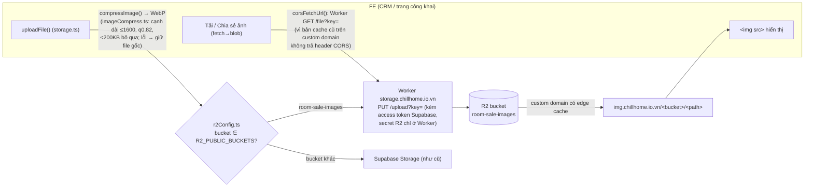
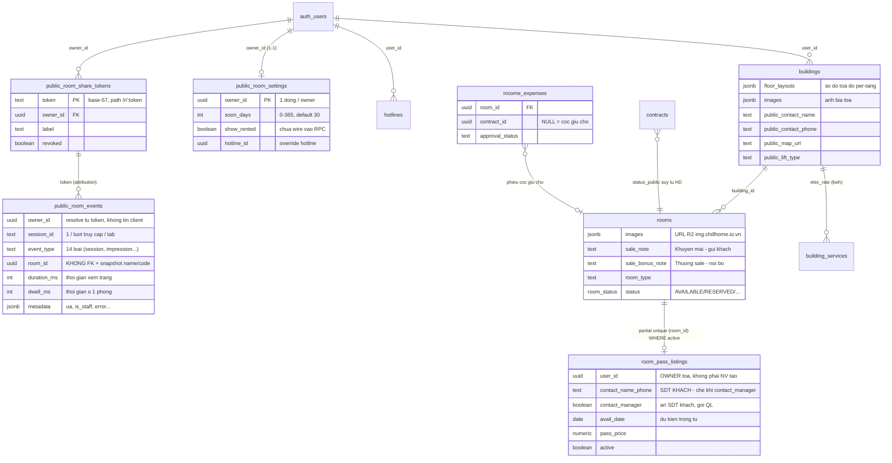
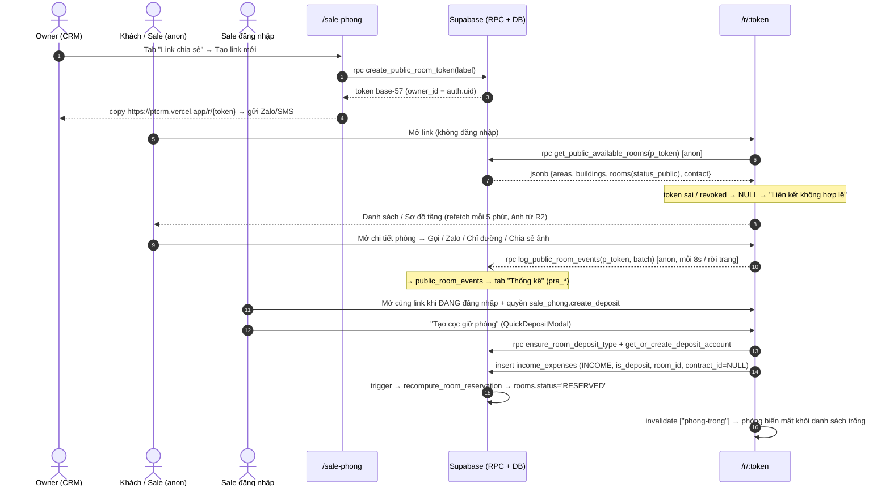
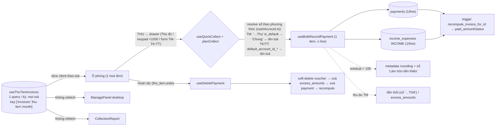

# Kênh công khai & mobile: Phòng trống (/r/:token) · Sale Phòng · Thu tiền

> Ba module "mặt tiền" mới (2026-06) phục vụ **sale & vận hành ngoài hiện trường**, xây bên trên các domain lõi sẵn có:
>
> 1. **Trang công khai "Phòng trống"** `/r/:token` — bảng phòng trống live cho khách/sale xem **không cần đăng nhập** (share link). Có thêm route thương hiệu `/phongtrong` (cùng trang, token cố định `"demo"`, commit `59d984c`) cho domain chillhome.io.vn.
> 2. **Module quản trị "Sale Phòng"** `/sale-phong` — nơi owner vận hành trang công khai: token chia sẻ, cài đặt hiển thị, thông tin sale (liên hệ/nội thất/ảnh), phòng khách nhờ sale, editor sơ đồ tầng kéo-thả, **tab Thống kê** đo đếm truy cập. Trên điện thoại tự chuyển sang bản mobile web-app riêng (§5.3).
> 3. **Trang "Thu tiền"** `/thu-tien` — màn mobile cho nhân viên đi **thu tiền** theo hoá đơn tháng (thu đủ 1 chạm / thu một phần / form TM-TK-TT / hoàn tác / báo cáo / bàn giao tiền mặt / đóng tiền điện nước NCC).
>
> Flow **"Tạo cọc nhanh"** trên trang công khai (trước đây đánh dấu WIP) **đã commit** tại `4b4f1cd` (2026-06-17) kèm migration [20260608100000_ensure_room_deposit_type_rpc.sql](supabase/migrations/20260608100000_ensure_room_deposit_type_rpc.sql) — xem §4.6.
>
> Ba thay đổi hạ tầng lớn sau ngày chốt đầu (2026-06-17): **bộ đo đếm** trang công khai (`public_room_events` + 6 RPC `pra_*`, commit `71858f3`, §2.8/§4.8) · **ảnh sale chuyển sang Cloudflare R2** (commit `525cf93`, §2.5) · **RPC in-app `get_my_available_rooms`** mirror bản public (§2.4).

## 1. Tổng quan & vai trò nghiệp vụ

### 1.1. Trang công khai "Phòng trống" `/r/:token`

- Owner tạo **token chia sẻ** (chuỗi base-57 ngẫu nhiên, 6 ký tự) → gửi link `https://ptcrm.vercel.app/r/<token>` cho sale/khách. Khách mở link **với role `anon`**, không đăng nhập.
- Trang hiển thị **mọi toà của owner đang có ≥1 phòng trống/sắp trống**, 2 chế độ xem: **Danh sách** (card ảnh + giá + tiện ích) và **Sơ đồ** (canvas toạ độ từng tầng, scale-to-fit). Chip "Tổng hợp" xem gộp tất cả toà; lọc theo Quận.
- Bottom-sheet chi tiết phòng: gallery ảnh, giá/cọc/điện, khuyến mãi (`sale_note`), thưởng sale (`sale_bonus_note` — nội bộ), nút **Gọi / Zalo / Chỉ đường / Chia sẻ (kèm toàn bộ ảnh qua Web Share API) / Tải ảnh**.
- Route đăng ký **ngoài `ProtectedRoute`** và lazy-load để cô lập [phongTrong.css](src/pages/phong-trong/phongTrong.css) (CSS đặt style cho `body`, ngoài `@layer` — không được rò sang phần còn lại của CRM). Xem comment trong [App.tsx](src/App.tsx).
- Sale **đang đăng nhập** mở chính link này và có quyền `sale_phong.create_deposit` sẽ thấy nút "Tạo cọc giữ phòng" → tạo phiếu thu cọc 1 chạm → phòng tự `RESERVED` (khoá realtime, biến mất khỏi danh sách trống). Đã live từ `4b4f1cd`.
- **Mọi hành vi của khách được đo đếm ẩn danh** (page view, thời gian xem, phòng hiện ra/mở chi tiết, bấm Gọi/Zalo/Chia sẻ/Tải…) qua tracker FE + RPC `log_public_room_events` — xem §2.8/§4.8. Owner xem báo cáo ở tab "Thống kê" của `/sale-phong`.
- **Ảnh phòng/toà trên trang này đọc từ Cloudflare R2** (custom domain `img.chillhome.io.vn`, egress $0) sau đợt migrate 2026-06-27 — không còn đọc từ Supabase Storage (§2.5).
- Cùng UI này còn được **nhúng in-app** cho user đã đăng nhập: `SalePhongMobilePage` truyền `buildings` từ hook [useMyAvailableRooms.ts](src/hooks/useMyAvailableRooms.ts) (RPC `get_my_available_rooms`, không cần token) — xem §2.4 và §5.3.

### 1.2. Module "Sale Phòng" `/sale-phong`

Trang quản trị (trong shell CRM, sidebar *Danh mục dữ liệu → Sale Phòng*), route gate bằng `RequirePermission module="sale_phong" action="view"`; **từng tab gate riêng theo quyền chi tiết** `sale_phong.*` qua `canUse` (fallback legacy `sale_phong.edit`, xem [permissionPages.ts](src/lib/permissionPages.ts)). **6 tab** ([SalePhongPage.tsx](src/pages/sale-phong/SalePhongPage.tsx)):

| Tab | Component | Quyền | Làm gì |
|---|---|---|---|
| Link chia sẻ | [ShareTokensTab.tsx](src/components/sale-phong/ShareTokensTab.tsx) | `manage_tokens` | CRUD token `/r/:token`: tạo (RPC), copy link, mở thử, đổi nhãn, **thu hồi/khôi phục** (`revoked`), xoá hẳn. |
| Cài đặt hiển thị | [DisplaySettingsTab.tsx](src/components/sale-phong/DisplaySettingsTab.tsx) | `manage_settings` | `soon_days` (số ngày báo "sắp trống", 0–365), hotline hiển thị, `show_rented` (lưu sẵn, **chưa wire vào RPC**). |
| Thông tin sale (tên cũ "Hình ảnh sale", đổi `1da1221`) | [SaleImagesTab.tsx](src/components/sale-phong/SaleImagesTab.tsx) | `manage_images` | Theo **phòng**: nội thất (`rooms.amenities`, tag-input) + ảnh (`rooms.images`), có **đồng bộ ảnh sang các phòng "cùng mẫu"** (`0855674`) và upload nhiều ảnh cùng lúc; theo **toà**: liên hệ QL/map + ảnh bìa (`buildings.images`). Ảnh upload qua Worker lên **R2** (§2.5). |
| Khách nhờ sale | [PassListingsTab.tsx](src/components/sale-phong/PassListingsTab.tsx) | `manage_pass_listings` | Quản lý `room_pass_listings` (§2.7): điền sẵn khách đại diện, ngày trống, cờ "Liên hệ quản lý". |
| Sơ đồ tòa nhà | [FloorPlanEditorTab.tsx](src/components/sale-phong/floor-editor/FloorPlanEditorTab.tsx) | `edit_floor_plan` | Editor **kéo-thả** vị trí phòng / thang máy / cầu thang / hành lang theo từng tầng → lưu `buildings.floor_layouts` (jsonb). |
| Thống kê | [AnalyticsTab.tsx](src/components/sale-phong/AnalyticsTab.tsx) | `view_analytics` | Báo cáo đo đếm trang công khai: KPI tổng quan, phòng được xem nhiều, theo thời gian, theo link, lỗi — 6 RPC `pra_*` (§2.8/§4.8). Ô lọc toà dùng [BuildingFilterSelect](src/components/buildings/BuildingFilterSelect.tsx) (phẳng, đơn-chọn, `3c3b7fa`); bộ lọc giữ qua F5 (`usePersistedState`). |

Trên **điện thoại** (`usePhoneViewport`) entry rẽ nhánh sang [SalePhongMobilePage.tsx](src/pages/sale-phong/SalePhongMobilePage.tsx) (`17be739` + redesign `386665e`): mặc định là màn **"Phòng trống" in-app** (nhúng nguyên `PhongTrongPage` với data từ `useMyAvailableRooms`), chế độ "Quản lý" là 6 màn mobile-native riêng dưới [src/components/sale-phong/mobile/](src/components/sale-phong/mobile/MobileShareTokens.tsx) (cùng gate quyền như desktop).

### 1.3. Trang "Thu tiền" `/thu-tien`

- Page phụ mobile-first ([ThuTien.tsx](src/pages/ThuTien.tsx) + bộ component [src/components/thu-tien/](src/components/thu-tien/RoomCellGrid.tsx)), style riêng `thu-tien.css` scope dưới `.tt-page` (font Be Vietnam Pro / Space Mono), lazy-load. Sidebar *Tài chính → Thu tiền*. Desktop ≥1024px có thêm cột trái [ManagePanel](src/components/thu-tien/ManagePanel.tsx) (bảng quản lý/báo cáo dùng chung data với khung phone).
- Vẫn là "view nghiệp vụ" trên domain [07 Hoá đơn](07-hoa-don-thanh-toan.md) + [08 Thu chi](08-thu-chi-so-quy.md), nhưng từ `f203aa9` có thêm **1 bảng + 2 RPC riêng cho tính năng "Đóng tiền Điện nước"** (`building_utility_accounts`, §2.6). Đọc hoá đơn = **1 query duy nhất cho CẢ KỲ mọi toà** (`8190d18`, key `['invoices','thu-tien',month]` — §5.4), lưới ô phòng 3 màu (Chưa thu / Một phần / Đã thu), thao tác **Thu đủ** (1 chạm), **Thu một phần** (bàn phím số nhập theo nghìn) hoặc **form nhiều dòng TM/TK/TT** trong drawer.
- Mỗi lần thu = ghi **`payments` + phiếu thu `income_expenses`** (xem §4.7) — đúng dòng dữ liệu của nút "Thu tiền" trong trang Hoá đơn, không phát minh đường ghi mới.
- Route gate `RequirePermission module="thu_tien"`; quyền chi tiết `thu_tien.view / collect / undo / report` (fallback legacy `invoices.record_payment`, riêng `report` fallback `invoices.view` — xem [permissionPages.ts](src/lib/permissionPages.ts)).
- Ngoài thu tiền còn 3 lối phụ trên header: **Bàn giao tiền mặt** ([HandoverSheet](src/components/thu-tien/HandoverSheet.tsx), xem [08 Thu chi](08-thu-chi-so-quy.md) + báo cáo bàn giao), **Đóng tiền điện nước** ([UtilityBillSheet](src/components/thu-tien/UtilityBillSheet.tsx)) và nút mở báo cáo **Chu kỳ Thu → Bàn giao** `/reports/finance/thu-ban-giao` (quyền `reports_finance.collection_cycle`).

---

## 2. Cấu trúc dữ liệu

### 2.1. Bảng `public_room_share_tokens` — token chia sẻ trang công khai

Migration [20260606120000_public_room_share_phong_trong.sql](supabase/migrations/20260606120000_public_room_share_phong_trong.sql).

| Cột | Ý nghĩa |
|---|---|
| `token` | **PK**, chuỗi base-57 (6 ký tự, trùng thì bump 8) — chính là path `/r/:token`. Không chứa thông tin owner. |
| `owner_id` | FK → `auth.users` (CASCADE). Chủ data được lộ ra — **chỉ phía server**, RPC dùng để lọc; không bao giờ trả về client anon. |
| `label` | Nhãn gợi nhớ (vd "Gửi sale khu Gò Vấp"). |
| `revoked` | `true` = thu hồi link (RPC trả NULL → trang báo "Liên kết không hợp lệ"). Có thể khôi phục. |
| `created_at` | Audit. |

RLS: policy `prst_owner_all` FOR ALL TO **authenticated** `owner_id = auth.uid()` — owner tự CRUD token của mình. **`anon` không có quyền nào trên bảng**; chỉ đọc gián tiếp qua RPC SECURITY DEFINER.

### 2.2. Bảng `public_room_settings` — cấu hình hiển thị (1 dòng / owner)

Migration [20260607090000_public_room_settings.sql](supabase/migrations/20260607090000_public_room_settings.sql).

| Cột | Ý nghĩa |
|---|---|
| `owner_id` | **PK**, FK → `auth.users`. 1 dòng / owner, áp cho **mọi** token của owner. |
| `soon_days` | Số ngày trước khi HĐ hết hạn thì phòng báo "Sắp trống" (CHECK 0–365, default 30). |
| `show_rented` | Lưu sẵn cho UI — **CHƯA wire vào RPC** (ẩn phòng đã thuê sẽ làm thủng sơ đồ tầng). |
| `hotline_id` | Override hotline hiển thị (NULL = hotline active đầu tiên của owner, bảng `hotlines`). |
| `updated_at` | Audit. |

RLS owner-only như trên. Thiếu dòng → RPC dùng mặc định (30 ngày, hotline đầu).

### 2.3. Cột mới trên `rooms` / `buildings` (phục vụ trang công khai)

| Bảng.Cột | Migration | Ý nghĩa |
|---|---|---|
| `rooms.sale_note` | `20260607120000` | Ô **"Khuyến mãi"** — promo riêng phòng, **gửi khách được**. Tách khỏi `description`. |
| `rooms.room_type` | `20260607130000` | "Loại phòng" (Gác, Ban công, Studio…) — trước đây suy sai từ `max_occupants`. |
| `rooms.sale_bonus_note` | `20260607140000` | Ô **"Thưởng sale"** — **nội bộ**, RPC vẫn trả về nhưng UI chỉ hiện cho sale (không nằm trong text chia sẻ khách). |
| `rooms.images` | (sẵn có) | jsonb string[] — sau đợt migrate R2 (`525cf93`) giá trị là **URL đầy đủ trên `img.chillhome.io.vn`** (126 ảnh cũ đã rewrite); path trần còn sót vẫn fallback về public URL Supabase (§2.5). |
| `buildings.floor_layouts` | `20260607090100` | **Sơ đồ toạ độ thủ công per-tầng** (jsonb). Shape: `{ "<floor>": { canvasW, canvasH, corridor{x,y,w,h}, fixtures[{id,kind:'elevator'\|'stairs',x,y,w,h}], rooms{ "<room_id>": {x,y,w,h} } } }`. NULL / thiếu tầng / thiếu phòng → client tự sinh `layoutFloor()` fallback. RLS kế thừa `buildings` (owner-scoped). |
| `buildings.public_contact_name/phone` | `20260607140000` | Liên hệ QL **riêng từng toà** (nút Gọi/Zalo); trống → dùng hotline chung. |
| `buildings.public_map_url` | `20260607140000` | Link Google Maps "Chỉ đường" riêng toà; trống → search theo địa chỉ. |
| `buildings.public_lift_type` | `20260607150000` | `"Thang máy"` \| `"Thang bộ"` — hiện ở Mô tả toà. |
| `buildings.images` | (sẵn có) | Ảnh bìa toà cho header từng toà trên trang công khai. |

### 2.4. RPC

| RPC | Grant | Vai trò |
|---|---|---|
| `get_public_available_rooms(p_token)` | **anon** + authenticated | API đọc duy nhất của trang công khai. SECURITY DEFINER: token → `owner_id` → trả jsonb `{areas, buildings, rooms, contact}`. Token sai/`revoked` → **NULL**. Đã qua nhiều vòng CREATE OR REPLACE: bản gốc `20260606120000` → v2 `20260607090400` (soon_days/hotline/floor_layouts/ảnh toà) → `…120000` (sale_note) → `…130000` (room_type) → `…140000` (sale_bonus_note + public_contact_* + map_url) → `…150000` (`public_lift_type`, `elec_rate` từ `building_services` join `services` có `unit ILIKE 'kwh'`) → `20260611120000` (**`area_ids[]`** từ `area_buildings` sau khi `buildings.area_id` bị DROP, xem [11 Phân quyền/Khu vực]) → `20260617090100` (`status_public='pass'` cho `room_pass_listings`, §2.7) → `20260617100100` (`pass_avail_date`) → [20260627120000_public_rooms_include_moveout.sql](supabase/migrations/20260627120000_public_rooms_include_moveout.sql) (`soon` gộp thêm khách đã đăng ký `contracts.expected_move_out_date`, §4.2) → `20260629000000` (move-out tôn trọng cửa sổ soon) → bản **mới nhất [20260629100000_room_pass_listings_contact_manager.sql](supabase/migrations/20260629100000_room_pass_listings_contact_manager.sql)** (`pass_contact_manager` — che SĐT khách khi cờ bật). ⚠️ Khi sửa tiếp phải base trên bản `20260629100000` **và đồng bộ luôn `get_my_available_rooms`** (dòng dưới). |
| `get_my_available_rooms()` | authenticated | **Bản in-app (không token) MIRROR của `get_public_available_rooms`** — suy owner từ caller (owner/super → chính mình; staff → `staff_assignments.user_id`) rồi chạy **cùng khối truy vấn**, trả **cùng payload** `{areas, buildings, rooms, contact}` để FE tái dùng `mapPayloadToBuildings` + nguyên UI. Migration [20260624000000](supabase/migrations/20260624000000_get_my_available_rooms.sql), fix đồng bộ [20260627120000_fix_get_my_available_rooms_area_ids.sql](supabase/migrations/20260627120000_fix_get_my_available_rooms_area_ids.sql). ⚠️ **2 RPC song song — sửa 1 hàm PHẢI sửa hàm kia**: bản in-app từng drift (còn đọc `buildings.area_id` đã DROP → 400, tab "Phòng trống" in-app rỗng) trước khi được fix. FE: [useMyAvailableRooms.ts](src/hooks/useMyAvailableRooms.ts). |
| `log_public_room_events(p_token, p_events)` | **anon** + authenticated | RPC ghi **batch** sự kiện đo đếm ẩn danh vào `public_room_events` (§2.8). SECURITY DEFINER: validate token chưa revoke, resolve `owner_id` server-side, cắt ≤50 event/batch, clamp text/duration/metadata, lọc `event_type` lạ, **không bao giờ ném lỗi cho anon** (EXCEPTION → 0). Migration [20260621100000](supabase/migrations/20260621100000_public_room_analytics.sql). |
| `pra_summary` / `pra_timeseries` / `pra_top_rooms` / `pra_funnel` / `pra_by_token` / `pra_errors` | authenticated | 6 RPC báo cáo cho tab "Thống kê" (lọc khoảng ngày / token / toà / loại trừ lượt xem nội bộ `is_staff`). Migration [20260621100100](supabase/migrations/20260621100100_public_room_analytics_reports.sql); FE hook [usePublicRoomsAnalytics.ts](src/hooks/usePublicRoomsAnalytics.ts). |
| `upsert_room_pass_listing` / `set_room_pass_listing_active` / `delete_room_pass_listing` / `pass_listing_form_rooms` / `pass_listing_room_customers` | authenticated (REVOKE anon) | Ghi/đọc-form "phòng khách nhờ sale" (§2.7). SECURITY DEFINER tự gán `user_id`=owner + guard quyền theo scope tòa. Migration gốc [20260617090000](supabase/migrations/20260617090000_room_pass_listings.sql); `upsert` đã đổi chữ ký 2 lần: +`p_avail_date` ([20260617100000](supabase/migrations/20260617100000_room_pass_listings_enhance.sql)) rồi +`p_contact_manager` ([20260629100000](supabase/migrations/20260629100000_room_pass_listings_contact_manager.sql)). `pass_listing_room_customers(room_id)` trả khách thuê HĐ active để FE điền sẵn SĐT/tên khách đại diện. |
| `create_public_room_token(p_label)` | authenticated (REVOKE anon) | Tạo token cho owner hiện tại: tái dùng `gen_contract_public_code(6)` (base-57, không ký tự dễ nhầm), retry chống trùng 10 lần rồi bump 8 ký tự. Migration [20260607090300](supabase/migrations/20260607090300_create_public_room_token_rpc.sql). |
| `recompute_room_reservation(room_id)` | (trigger gọi) | Nguồn sự thật cờ "cọc giữ chỗ": phòng `AVAILABLE` có cọc chưa-link-HĐ (kể cả phiếu **chưa duyệt**, chỉ loại `CANCELLED`/đã xoá) → `RESERVED`, và ngược lại. Migration [20260608000000](supabase/migrations/20260608000000_room_reservation_reconcile.sql) — xem chi tiết [04 Cọc](04-coc-giu-cho.md). |
| `ensure_room_deposit_type()` | authenticated | Get-or-create loại thu "Tiền cọc" của caller, **ép `is_deposit = TRUE`** (tái dùng helper `_termination_ensure_type`) — để `ie_has_deposit_item()` nhận diện phiếu cọc → trigger khoá phòng. Migration [20260608100000](supabase/migrations/20260608100000_ensure_room_deposit_type_rpc.sql) (commit `4b4f1cd`). |
| `get_or_create_deposit_account()` | authenticated | Sổ quỹ hệ thống **"CỌC (giữ hộ khách)"** (sẵn có từ module thanh lý, migration `20260603000022`) — QuickDepositModal dùng làm sổ nhận mặc định. |
| `upsert_building_utility_account` / `pay_utility_bill` | authenticated | Tính năng "Đóng tiền Điện nước" của `/thu-tien` (§2.6). Migration [20260620000000](supabase/migrations/20260620000000_building_utility_accounts.sql). |

> [types.ts](src/integrations/supabase/types.ts) regen lần gần nhất đã gồm đủ nhóm cột sale (`rooms.sale_note`/`sale_bonus_note`, `buildings.public_contact_*`/`public_map_url`/`public_lift_type`), bảng `room_pass_listings` (+ `avail_date`/`contact_manager`), `public_room_events`, các RPC pass/`pra_*`/`log_public_room_events`/`get_my_available_rooms` và `ensure_room_deposit_type` (một số hook vẫn gọi qua cast `as any` từ thời chưa regen — vô hại).

### 2.5. Ảnh sale: đã chuyển sang **Cloudflare R2** (egress $0) — Supabase chỉ còn là fallback

**Thay đổi kiến trúc storage lớn nhất của module** (commit `525cf93`, 2026-06-27 + fix CORS `30cc74b`): bucket `room-sale-images` chuyển sang **Cloudflare R2**, vì ảnh sale phục vụ khách anon là nguồn egress lớn nhất mà R2 miễn phí egress hoàn toàn.

- **Lớp định tuyến** [src/lib/storage/r2Config.ts](src/lib/storage/r2Config.ts): 2 set `R2_PUBLIC_BUCKETS` (hiện chỉ `room-sale-images`) và `R2_PRIVATE_BUCKETS` (**Phase 2 — còn trống, chưa làm**); bucket ngoài 2 set vẫn đi Supabase Storage. Env: `VITE_R2_PUBLIC_BASE` (= `https://img.chillhome.io.vn`) + `VITE_STORAGE_GATEWAY` (= `https://storage.chillhome.io.vn`) — thiếu env thì `r2Configured()`=false, tự rơi về Supabase. Call-site **không cần biết gì**: `uploadFile()`/`createSignedUrlFromStored()` trong [storage.ts](src/lib/storage.ts) tự đọc bảng này.
- **Upload** qua [r2Client.ts](src/lib/storage/r2Client.ts) `uploadToR2()`: Worker kiểm access token Supabase rồi mới ghi; response là URL công khai `<base>/<bucket>/<path>`; header `X-Cache-Control: immutable`. Trước upload mọi ảnh được **nén WebP client-side** ([imageCompress.ts](src/lib/imageCompress.ts)) — đuôi file đổi thành `.webp`.
- **Hiển thị**: URL R2 công khai dùng **thẳng** (không ký, cache edge). `parseR2Ref()` nhận diện URL đã migrate; R2 **riêng tư** (Phase 2) sẽ ký presigned GET qua Worker `GET /sign`.
- **Tải/chia sẻ ảnh** (fetch→blob trong DetailSheet/Lightbox) phải đi qua `corsFetchUrl()` → Worker `GET /file?key=` vì R2 custom domain không trả CORS cho bản đã cache (`30cc74b`). Hiển thị `` thì không cần.
- **Trạng thái migrate**: Phase 1 **xong** — 126 ảnh cũ đã copy sang R2 và `rooms.images`/`buildings.images` rewrite thành URL R2. Phase 2 (10 bucket riêng tư) **chưa bật**.
- **Bucket Supabase `room-sale-images` (PUBLIC, migration [20260607090200](supabase/migrations/20260607090200_room_sale_images_bucket.sql)) vẫn tồn tại làm fallback**: adapter [supabaseData.ts](src/pages/phong-trong/supabaseData.ts) `imageUrl()` pass-through URL đầy đủ (giờ là URL R2), chỉ dựng `getPublicUrl` Supabase khi giá trị còn là storage path trần. RLS `storage.objects` như cũ: đọc = `public`; ghi/sửa/xoá = `authenticated`.

### 2.6. Thu tiền — schema gần như tái dùng, chỉ thêm 1 bảng cho "Đóng tiền Điện nước"

- Phần thu tiền đọc/ghi các bảng sẵn có: `invoices` + `invoice_items` + `payments` (domain 07), `income_expenses` + `income_expense_types` + `accounts` (domain 08), `excess_amounts` (thu dư/hoàn tác). Logic FE thuần nằm ở [src/lib/collect.ts](src/lib/collect.ts) (pure helpers: `collectStatus`, `remainingOf`, `paymentsInRange`, `latestPaymentId`, **`paidAsOf`/`remainingAsOf`/`paidUpTo`** — snapshot công nợ *tính đến hết một ngày* cho bộ lọc theo ngày, format tiền/Zalo/tel — có test được) + [collectPlan.ts](src/lib/collectPlan.ts) (`planCollect` — tính dòng tiền form nhiều phương thức) + [cashAccount.ts](src/lib/cashAccount.ts) (resolve sổ quỹ theo phương thức, §4.7).
- **Bảng mới duy nhất** (commit `f203aa9`, migration [20260620000000_building_utility_accounts.sql](supabase/migrations/20260620000000_building_utility_accounts.sql)): `building_utility_accounts` — mã PE (điện) / số danh bạ (nước) + tên chủ hộ đăng ký NCC theo `(building_id, utility_type)`, owner-scoped, staff đọc qua RLS. Kèm 2 RPC: `upsert_building_utility_account` (sửa mã inline) và `pay_utility_bill` (SECURITY DEFINER, tạo **1 phiếu CHI** từ sổ "…Thu" của user, tính KQKD, kỳ gắn qua `start_date/end_date` của hạng mục, `voucher_date` = ngày đóng thực tế). FE: [UtilityBillSheet](src/components/thu-tien/UtilityBillSheet.tsx) + [useUtilityBills.ts](src/hooks/useUtilityBills.ts).

### 2.7. Bảng `room_pass_listings` — "phòng khách nhờ sale / pass" (2026-06-17)

Khách đang thuê nhờ công ty **sale / pass / sang phòng giùm**. Phòng đó đang có HĐ `ACTIVE` nên bị `status_public='rented'` và không lên kênh. Bảng này là **lớp overlay ĐỘC LẬP** đánh dấu phòng cần đăng lại — **KHÔNG đụng `rooms.status` / hợp đồng** (tránh `recompute_room_reservation`). Migration [20260617090000_room_pass_listings.sql](supabase/migrations/20260617090000_room_pass_listings.sql).

| Cột | Ý nghĩa |
|---|---|
| `user_id` | = `buildings.user_id` (OWNER tòa — để trang public match owner-của-token), **KHÔNG** phải `auth.uid()` của nhân viên tạo. |
| `building_id`, `room_id` | Phòng nội bộ được pass (FK). Partial unique `(room_id) WHERE active` — mỗi phòng tối đa 1 listing bật. |
| `contact_name` / `contact_phone` | **SĐT + tên KHÁCH** — hiển thị công khai thay hotline/QL. **Expose CÓ Ý** qua RPC (opt-in nhập tay; ngoại lệ so với quy tắc "anon không thấy khách thuê"). Bị **che khi `contact_manager=true`** (dòng dưới). |
| `contact_manager` | (mới `d890022`, migration [20260629100000](supabase/migrations/20260629100000_room_pass_listings_contact_manager.sql)) `true` = khách không muốn lộ số: **RPC public KHÔNG trả** `contact_phone/contact_name` (chỉ trả cờ `pass_contact_manager`); trang công khai hiện badge "Liên hệ quản lý" + nút Gọi dùng SĐT QL/hotline của tòa. SĐT khách **vẫn lưu và hiển thị nội bộ** trong tab quản trị. |
| `avail_date` | (mới `82901b4`, migration [20260617100000](supabase/migrations/20260617100000_room_pass_listings_enhance.sql)) Ngày dự kiến trống (tuỳ chọn) — trang công khai hiện "Dự kiến trống từ …". |
| `sale_policy` | Chính sách sale **do khách đặt** (vd "Giảm khách 500k tháng đầu…"). |
| `pass_price` | Giá pass (NULL → fallback `rooms.rent_price`). |
| `active`, `created_by` | Bật/tắt hiển thị; audit người tạo. |

- **RLS**: SELECT = owner OR `can_access_building(building_id)`; **KHÔNG có policy ghi** → ghi trực tiếp bị chặn, ép qua RPC.
- **RPC ghi SECURITY DEFINER**: `upsert_room_pass_listing` (chữ ký hiện tại có thêm `p_avail_date`, `p_contact_manager`) / `set_room_pass_listing_active` / `delete_room_pass_listing` — gán `user_id`=owner, guard `can_manage_pass_listing` (owner OR `can_do_on_building('sale_phong','manage_pass_listings'|'edit', building)`). RPC form: `pass_listing_form_rooms()` trả phòng trong scope nhân viên (KHÔNG lọc AVAILABLE); `pass_listing_room_customers(room_id)` trả khách thuê HĐ active để **điền sẵn khách đại diện + cho chọn khách khác** (chỉ user trong scope tòa, KHÔNG mở anon). REVOKE anon, GRANT authenticated.
- **Nhân viên có quyền** quản lý được (scope tòa qua RBAC như `income_expenses`), không chỉ owner. Quyền catalog: `sale_phong.manage_pass_listings` (fallback `edit`).
- **FE**: tab "Khách nhờ sale" trong `/sale-phong` ([PassListingsTab](src/components/sale-phong/PassListingsTab.tsx) + bản mobile [MobilePassListings](src/components/sale-phong/mobile/MobilePassListings.tsx) + [usePassListings](src/hooks/usePassListings.ts)); trang công khai render `RoomStatus='pass'` (hồng, [phongTrong.css](src/pages/phong-trong/phongTrong.css) `--st-pass`) với chính sách + giá pass của khách; [DetailSheet](src/pages/phong-trong/PhongTrongSheet.tsx) nút Gọi/Zalo trỏ **SĐT khách** ("Gọi khách") hoặc **QL tòa/hotline** ("Gọi Quản Lý") tuỳ `passContactManager`; text chia sẻ cũng thay dòng liên hệ tương ứng. Xem MEMORY `project_room_pass_listings`.

### 2.8. Bảng `public_room_events` — bộ đo đếm trang công khai (2026-06-21, `71858f3`)

Migration [20260621100000_public_room_analytics.sql](supabase/migrations/20260621100000_public_room_analytics.sql) (bảng + RPC ghi) và [20260621100100_public_room_analytics_reports.sql](supabase/migrations/20260621100100_public_room_analytics_reports.sql) (6 RPC đọc `pra_*`).

| Cột | Ý nghĩa |
|---|---|
| `token`, `owner_id` | Attribution về link chia sẻ; `owner_id` **resolve server-side từ token** (không tin client) — phục vụ RLS + báo cáo. |
| `session_id` | Client tạo, 1 / lượt truy cập / tab (giữ trong `sessionStorage` để StrictMode remount không sinh session mới). |
| `event_type` | CHECK 14 loại: `session`, `impression`, `building_select`, `view_mode`, `room_open`, `image_view`, `floorplan_view`, `contact_click`, `share`, `download`, `directions`, `favorite`, `deposit_dialog`, `error`. |
| `room_id` / `building_id` | **KHÔNG FK** (bảng anon-ghi, phòng có thể bị xoá) — kèm snapshot `room_name`/`room_code`/`building_name` để báo cáo sống sót khi phòng bị xoá. |
| `duration_ms` | Tổng thời gian **đang hiển thị** trang (Page Visibility) — event `session`; báo cáo lấy MAX/session. |
| `dwell_ms` | Thời gian ở lại 1 phòng — event `room_open`. |
| `metadata` | jsonb: `ua`, `referrer`, `view_mode`, **`is_staff`** (đánh dấu lượt xem nội bộ để báo cáo loại trừ), `error{...}`. |

- **RLS**: bật, nhưng **ghi đi hoàn toàn qua RPC SECURITY DEFINER** (bypass) → không có INSERT policy, `REVOKE ALL FROM anon`. SELECT chỉ cho chủ (self / staff-của-chủ qua `current_visible_owner_ids()` / admin).
- 5 index theo `(owner_id, created_at)` / token / room / type / session phục vụ 6 RPC `pra_*`.

---

## 3. Sơ đồ quan hệ dữ liệu

Quan hệ "ảo" quan trọng (không FK): RPC `get_public_available_rooms` **đọc xuyên** `public_room_share_tokens → buildings/rooms/areas/hotlines/contracts/building_services/room_pass_listings` bằng SECURITY DEFINER — token là "chìa khoá" duy nhất anon có (cả để đọc lẫn để **ghi** sự kiện qua `log_public_room_events`). RPC `get_my_available_rooms` đi cùng đường nhưng thay token bằng ngữ cảnh caller đã đăng nhập.

---

## 4. Quy tắc nghiệp vụ & tự động hoá

### 4.1. Mô hình bảo mật token (public read qua RPC, không mở bảng)

- Chuỗi token **ngẫu nhiên, không chứa owner_id**; URL không lộ gì. `anon` không SELECT được bảng nào — chỉ EXECUTE 2 RPC: `get_public_available_rooms` (đọc; tự map token → owner và **không trả** `user_id`/hợp đồng/khách thuê/công nợ ra payload — ngoại lệ duy nhất là contact phòng `pass` do khách opt-in, §2.7) và `log_public_room_events` (ghi sự kiện đo đếm, cũng validate token, §2.8).
- Thu hồi tức thời: set `revoked = true` → mọi request sau trả NULL → trang hiện "Liên kết không hợp lệ hoặc đã hết hạn". Khôi phục được (khác Xoá — mất hẳn).
- Trang FE khi **không có data/token** rơi về `SAMPLE_BUILDINGS` (data mẫu trong [sampleData.ts](src/pages/phong-trong/sampleData.ts)) để xem thử UI — cần biết điều này khi debug "sao thấy toà lạ".

### 4.2. `status_public` — **hợp đồng là nguồn sự thật**, không phải `rooms.status`

RPC tự tính cho từng phòng (vì cờ `rooms.status` có thể stale — phòng có HĐ nhưng vẫn để `AVAILABLE`):

| Giá trị | Điều kiện |
|---|---|
| `pass` | Phòng có **listing `room_pass_listings` đang `active`** (khách nhờ sale, §2.7) — nhánh này đặt **TRƯỚC** mọi nhánh khác nên phòng đang có HĐ vẫn ra `pass`. RPC trả kèm `pass_contact_name/phone` (**bị che khi** `pass_contact_manager=true`), `pass_sale_policy`, `pass_price`, `pass_avail_date`, `pass_contact_manager`. |
| `soon` | Có HĐ hiệu lực thoả **một trong hai** (từ `20260627120000`, siết lại ở `20260629000000`): (a) khách đã đăng ký `contracts.expected_move_out_date` (RegisterMoveOutDialog — "sắp chuyển đi") **nằm trong** `[CURRENT_DATE, CURRENT_DATE + soon_days]` (bản đầu không giới hạn cửa sổ, bản `…29000000` đổi ý: chỉ hiện khi sắp trống thật); (b) `COALESCE(actual_end_date, end_date)` trong cùng cửa sổ (logic gốc). Kèm `avail_date` = MIN ngày trống dự kiến qua các HĐ thoả, ưu tiên `expected_move_out_date`. |
| `rented` | Có HĐ hiệu lực (không sắp hết) — **kể cả** khi `rooms.status='AVAILABLE'`; HOẶC không HĐ nhưng `rooms.status` ∉ `AVAILABLE` (gồm `RESERVED`/`MAINTENANCE`…). |
| `free` | Không có HĐ hiệu lực **và** `rooms.status = 'AVAILABLE'`. |

- Chỉ trả **toà có ≥1 phòng `free`/`soon`/`pass`**, nhưng trả **đủ phòng** của toà đó để vẽ sơ đồ tầng (phòng `rented` hiện mờ). → toà full phòng đã thuê vẫn lên kênh nếu có phòng `pass`.
- **Phòng `RESERVED` (đã cọc giữ chỗ) hiện như "Đã thuê"** → tự ẩn khỏi bucket trống. Đây chính là cơ chế "khoá phòng realtime" của Tạo cọc nhanh (§4.6).
- ⚠️ **Ghi chú EXTENDED**: SQL của RPC vẫn viết `c.status IN ('ACTIVE','EXTENDED')` — vô hại vì từ 2026-06-06 status `EXTENDED` **đã ngưng dùng** (HĐ gia hạn giữ `ACTIVE`, xem [05 Hợp đồng](05-hop-dong.md)); điều kiện thực tế chỉ match `ACTIVE`. Nếu viết RPC mới, chỉ cần `ACTIVE`.

### 4.3. Sơ đồ tầng: layout thủ công + fallback tự sinh

- Mỗi toà/tầng có thể có layout thủ công trong `buildings.floor_layouts` (vẽ ở tab "Sơ đồ tòa nhà"). Client render bằng [floorLayoutShared.ts](src/pages/phong-trong/floorLayoutShared.ts): `applyStoredLayout()` nếu tầng có layout, ngược lại `layoutFloor()` tự xếp theo toạ độ (export từ `sampleData.ts`).
- Phòng **không có** trong layout (mới tạo, đổi tầng) được xếp tạm — trang công khai **luôn vẽ đủ phòng**; key phòng mồ côi (đã xoá) bị bỏ qua khi render, dọn ở lần Lưu kế tiếp của editor.
- Adapter chỉ giữ **tầng còn ≥1 phòng free/soon/pass** (ẩn tầng đã full khỏi chế độ Sơ đồ); `freeCount` của toà cũng đếm cả 3 loại này (`145b65a`/`5daa871`).
- Editor ([FloorPlanEditorTab.tsx](src/components/sale-phong/floor-editor/FloorPlanEditorTab.tsx)): seed tầng chưa có layout từ `seedFromAuto()`, undo stack 30 bước, snap lưới, "Tự sắp xếp" reset về auto, Lưu = `useUpdateBuilding` ghi nguyên map `floor_layouts`.

### 4.4. Gotcha gọi RPC public từ supabase-js (xem MEMORY `project_supabase_rpc_schema_gotcha`)

Gọi `supabase.rpc(...)` **như method** (giữ `this`) hoặc `supabase.rpc.bind(supabase)` — **không** tách `const { rpc } = supabase` ra biến rời, kẻo client mất cấu hình schema và PostgREST resolve nhầm thành `api.<fn>` → 404. Request RPC public phải mang header `Content-Profile: public`. Cả [usePhongTrong.ts](src/pages/phong-trong/usePhongTrong.ts) (cast nhưng gọi method) lẫn QuickDepositModal (`rpc.bind(supabase)`) đều tuân theo.

### 4.5. Realtime "mềm" của trang công khai

[usePhongTrong.ts](src/pages/phong-trong/usePhongTrong.ts): React Query `staleTime` 60s, `refetchOnWindowFocus`, `refetchInterval` 5 phút — sale luôn thấy "thời điểm hiện tại" mà không cần websocket. Sau khi tạo cọc nhanh, FE chủ động `invalidateQueries(["phong-trong"])` để phòng biến mất ngay. Hook in-app [useMyAvailableRooms.ts](src/hooks/useMyAvailableRooms.ts) dùng **đúng bộ tham số cache này** (key `["my-available-rooms"]`).

### 4.6. Tạo cọc nhanh trên trang công khai

Đã commit tại `4b4f1cd` (2026-06-17) — nhãn WIP cũ đã gỡ:

- **Quyền**: action `create_deposit` trên module `sale_phong` (nhóm "elevated" trong [permissionPages.ts](src/lib/permissionPages.ts), nhãn "Tạo cọc nhanh trên trang công khai"). Nút chỉ hiện khi có session đăng nhập **và** quyền — khách anon không bao giờ thấy.
- **Điểm vào**: nút "Tạo cọc giữ phòng" trong DetailSheet (phòng chưa thuê) + click ô phòng xanh ở chế độ Tổng hợp. Mở modal cũng bắn event đo đếm `deposit_dialog` (§4.8).
- **[QuickDepositModal.tsx](src/pages/phong-trong/QuickDepositModal.tsx)** tạo **phiếu thu `income_expenses`** qua `useCreateIncomeExpense` với: sổ quỹ = "CỌC (giữ hộ khách)" (`get_or_create_deposit_account`), hạng mục = "Tiền cọc" `is_deposit=TRUE` (`ensure_room_deposit_type`), `room_id` = phòng, `contract_id = NULL` (cọc giữ chỗ — chưa có HĐ), `business_result_accounting = NULL` (hạng mục cọc tự loại khỏi KQKD), nội dung "Cọc phòng {x} tòa {y}". **Số tiền để trống → mặc định 1đ** (chỉ để giữ chỗ); "Ngày bổ sung cọc"/"Ngày vào" chỉ ghi thêm vào nội dung/description.
- **Chuỗi tự động hoá** (migration `20260608000000`): insert phiếu → trigger `trg_ie_reconcile_room` → `recompute_room_reservation` thấy phòng `AVAILABLE` có phiếu cọc chưa-link-HĐ (kể cả **chưa duyệt**) → `rooms.status='RESERVED'` → RPC public xếp phòng vào `rented` → phòng rời danh sách trống của mọi link chia sẻ.

### 4.7. Thu tiền tạo dữ liệu gì (đọc từ code, không đoán)

Một lần thu trên `/thu-tien` chạy [useQuickCollect.ts](src/hooks/useQuickCollect.ts) → bọc [useBulkRecordPayment.ts](src/hooks/useBulkRecordPayment.ts) với đúng 1 item. Có **2 đường gọi** (không còn "chỉ TM" như bản đầu):

- **1-chạm** (nút Thu đủ / keypad Thu 1P): 1 line `TM` (hoặc method chọn nhanh), `amount` cap ≤ `remaining`.
- **Form nhiều dòng** ([CollectPayForm](src/components/thu-tien/CollectPayForm.tsx) trong drawer): tách nhiều dòng **TM/TK/TT** — mỗi dòng vào đúng sổ riêng, kèm ngày + ảnh chứng từ; cho **thu DƯ qua TM** → tiền thối (sổ `"…Thối"`, đã net vào `total_amount`) hoặc giữ làm **nợ khách** (`excess_amounts`, cần HĐ). Tính tiền thuần ở [collectPlan.ts](src/lib/collectPlan.ts) `planCollect` — y hệt RecordPaymentDialog trang Hoá đơn.

Dữ liệu ghi (mỗi **dòng phương thức** = 1 cặp):

1. **`payments`**: 1 dòng `payment_method` = method của line, `payment_date` = ngày chọn (mặc định hôm nay), `user_id` = **owner của invoice** (không phải staff — để RLS `staff_can('invoices', …)` match).
2. **`income_expenses`**: 1 phiếu thu `INCOME` link `payment_id`/`invoice` (loại thu mặc định `is_default` của owner), cùng `user_id` owner.
3. **Trigger DB** `recompute_invoice_for_id` (migration `20260510000010`) tự cập nhật `invoices.paid_amount / remaining_amount / status` — FE không tự tính.
4. **Không dùng RPC `record_invoice_payment`** — RPC đó check `user_id = p_user_id` nên staff bị từ chối dù RLS cho ghi; insert trực tiếp là chủ ý.

Quy tắc kèm theo:

- **Resolve sổ quỹ nhận theo phương thức** ([cashAccount.ts](src/lib/cashAccount.ts)): `TM` → sổ tên kết thúc `"…Thu"` thuộc user đang đăng nhập (**user có nhiều sổ "…Thu" thì ưu tiên sổ `is_default`**) → sổ `"Chung"` → sổ trùng tên toà; `TK` → `buildings.default_account_id_tk` → sổ trùng tên toà; `TT` → `buildings.default_account_id_tt` → sổ trùng tên toà. Không resolve được → **throw, chặn ghi** (không insert `account_id` rỗng).
- **Làm tròn tự động**: residual sau thu `0 < x < 10.000đ` → gắn metadata `rounding_amount` + sổ `"Làm tròn tiền thiếu"` lên voucher (audit, **không trừ số dư**) → trigger DB mark invoice `PAID`. Cùng cơ chế với [08 §4.10](08-thu-chi-so-quy.md).
- **Hoàn tác** (gate quyền `thu_tien.undo`; [useDeletePayment.ts](src/hooks/useDeletePayment.ts), lấy payment mới nhất qua `latestPaymentId`): soft-delete voucher `income_expenses` theo `payment_id` → hard-delete `excess_amounts` có `source_payment_id` → hard-delete `payments` → trigger `recompute_invoice_after_payment_change` tự hạ `paid_amount/status`.
- **Ghi chú** khi phòng chưa thu: ghi thẳng `invoices.notes` ([useUpdateInvoiceNote.ts](src/hooks/useUpdateInvoiceNote.ts)); khi thu kèm ghi chú thì truyền vào `notes` của phiếu.
- Trạng thái 3 màu map từ hoá đơn thật ([collect.ts](src/lib/collect.ts)): `paid` = `PAID` hoặc remaining ≤ 0; `partial` = `PARTIAL_PAID` hoặc `paid_amount > 0`; `unpaid` = còn lại (gồm `APPROVED/OVERDUE/DRAFT`).
- **Ai thu hiển thị trên ô phòng/drawer**: [useInvoiceCollectors.ts](src/hooks/useInvoiceCollectors.ts) đọc `creator_name` của phiếu thu theo `payment_id` — nhân viên thấy khoản nào do ai thu.

### 4.8. Bộ đo đếm /r/:token — tracker FE + gotchas (2026-06-21, `71858f3`)

Core framework-agnostic [tracking.ts](src/pages/phong-trong/tracking.ts) + React binding [useTracking.tsx](src/pages/phong-trong/useTracking.tsx) (`TrackingProvider`/`useTrack`/`useRoomImpression`); test [tracking.test.ts](src/pages/phong-trong/tracking.test.ts).

- **Buffer trong RAM, flush theo**: timer 8s / buffer ≥ 20 / khi rời trang (visibility `hidden` + `pagehide`). Không có token → `NOOP_TRACKER` (bản in-app nhúng qua prop `buildings` không ghi; riêng `/phongtrong` mang token `"demo"` nên vẫn ghi — RPC tự no-op nếu token không tồn tại/revoked).
- ⚠️ **Gotcha 1 — `supabase.rpc` là builder LAZY**: chỉ gửi request khi `.then()`/`await`. Flush định kỳ **PHẢI `await`** lời gọi `rpc("log_public_room_events", …)`, nếu không sự kiện lặng lẽ không bao giờ được gửi.
- ⚠️ **Gotcha 2 — flush cuối khi unload KHÔNG dùng `sendBeacon`**: sendBeacon không set được header `apikey`/`Authorization`/`Content-Profile` mà PostgREST yêu cầu → dùng **`fetch(..., { keepalive: true })`** POST thẳng `/rest/v1/rpc/log_public_room_events` với anon key.
- **`session_id`**: 1 / lượt truy cập / tab, giữ trong `sessionStorage` (`pt_sid_<token>`) để StrictMode remount + refetch-on-focus không sinh session mới; tracker `running` reversible cho StrictMode mount→unmount→mount.
- **Thời gian xem trang** = thời gian **đang hiển thị** (Page Visibility API, cộng dồn `activeMs`), gửi qua event `session.duration_ms` mỗi lần tab ẩn/rời trang; báo cáo lấy MAX duration/session nên nhiều dòng vẫn an toàn.
- **Impression**: `useRoomImpression` dùng IntersectionObserver — phòng hiện ≥50% viewport mới tính, **dedupe 1 lần/phòng/session**. `room_open` kèm `dwell_ms` khi đóng sheet.
- **`is_staff`**: user đang đăng nhập xem trang được đánh dấu trong `metadata` (set trễ qua `setStaff` vì session/perms nạp sau page-view) → tab Thống kê có switch "loại trừ lượt xem nội bộ" (tham số `p_exclude_staff` của `pra_*`).
- **Lỗi runtime của trang khách cũng được thu** (`window.onerror` / `unhandledrejection` → event `error`) — xem ở tab Thống kê mục "Lỗi". Mọi lỗi của chính tracker bị nuốt, không bao giờ lộ cho khách.

---

## 5. Quy trình theo từng trang

### 5.1. Sequence tổng: chia sẻ → khách xem → liên hệ / cọc

### 5.2. `/r/:token` — Trang công khai "Phòng trống"

Component chính: [PhongTrongPage.tsx](src/pages/phong-trong/PhongTrongPage.tsx) (orchestrator) · [PhongTrongParts.tsx](src/pages/phong-trong/PhongTrongParts.tsx) (`ListView`, `OverviewView`, `FloorPlan` canvas scale-to-fit) · [PhongTrongSheet.tsx](src/pages/phong-trong/PhongTrongSheet.tsx) (`DetailSheet` + `Lightbox` + `Toast`) · [usePhongTrong.ts](src/pages/phong-trong/usePhongTrong.ts) → [supabaseData.ts](src/pages/phong-trong/supabaseData.ts) (adapter payload → type `Building/Room` của UI).

1. `useParams` lấy `token` → `usePhongTrong(token)`; đang tải hiện "Đang tải…", lỗi hiện "Liên kết không hợp lệ"; không có token → data mẫu (xem thử UI). `PhongTrongPage` còn nhận prop `token` (route `/phongtrong` truyền `"demo"`) hoặc prop `buildings` (bản in-app — bỏ qua RPC token).
2. Header: chips **Quận** + chips **Toà nhà** (kéo ngang được bằng chuột/vuốt), chip **"Tổng hợp"** đầu hàng; segment **Danh sách / Sơ đồ**. Số "trống" trên thẻ toà/tầng = phòng `free` **+ `soon` + `pass`** (đồng nhất mọi thẻ từ `145b65a`/`5daa871`).
3. Chế độ *Danh sách*: phòng của toà đang chọn, ẩn `rented`, sort tầng cao→thấp. Chế độ *Tổng hợp*: card mỗi toà (ảnh, liên hệ, nút Zalo/SĐT, dải ô phòng nhanh; phòng pass kèm badge chính sách/ngày trống). Chế độ *Sơ đồ*: `FloorPlan` từng tầng theo `floor_layouts`/auto-layout, phòng `rented` mờ.
4. `DetailSheet`: gallery (ảnh thật từ `rooms.images` — URL R2; chưa có ảnh → placeholder picsum), lightbox chỉ render ảnh khi mở (tránh preload trùng) + nút **lưu TOÀN BỘ ảnh phòng** (`983587e`), specs (diện tích, loại phòng, điện `elec_rate`, thang máy/bộ), Khuyến mãi (`sale_note`), Thưởng sale (`sale_bonus_note` — chỉ hiển thị nội bộ, **không** vào text chia sẻ), nút hành động:
   - **Gọi / Zalo**: phòng `pass` → SĐT khách ("Gọi khách") hoặc QL tòa/hotline khi `passContactManager` bật ("Gọi Quản Lý", §2.7); phòng thường → liên hệ riêng toà (`public_contact_*`) → fallback hotline chung (`contact` từ RPC).
   - **Chỉ đường**: `public_map_url` → fallback Google Maps search theo địa chỉ.
   - **Chia sẻ / Copy gửi khách**: Web Share API level 2 gửi **text + toàn bộ ảnh** (`File[]`, tên `Tòa-Phòng-STT`); máy không hỗ trợ → share text → fallback copy clipboard.
   - **Tải ảnh**: share sheet files-only ("Lưu N ảnh" vào thư viện iOS/Android); desktop → tải từng ảnh `<a download>` cách nhau 350ms. Mọi fetch ảnh (blob) đi qua `corsFetchUrl()` → Worker `/file` (§2.5).
   - Điều hướng phòng trước/sau cùng toà (chỉ phòng chưa thuê); lưu tim `localStorage` key `pt_saved`.
5. Nút "Tạo cọc giữ phòng" + click ô phòng ở Tổng hợp → `QuickDepositModal` (§4.6).
6. **Đo đếm**: mọi thao tác trên bắn event tương ứng qua tracker (§4.8) — `room_open` (kèm dwell), `impression` (IntersectionObserver), `contact_click`/`share`/`download`/`directions`/`favorite`/`deposit_dialog`, `error`.

### 5.3. `/sale-phong` — Quản trị Sale Phòng

Gate route: `RequirePermission module="sale_phong" action="view"` ([App.tsx](src/App.tsx)); từng tab gate quyền chi tiết qua `canUse` (§1.2, catalog trong [permissionPages.ts](src/lib/permissionPages.ts)).

- **Tab Link chia sẻ**: bảng token (`usePublicRoomTokens` — SELECT thẳng bảng, RLS tự lọc owner). Tạo → RPC `create_public_room_token` + tự copy link ([publicLinks.ts](src/lib/publicLinks.ts) hard-code `PUBLIC_BASE = https://ptcrm.vercel.app`). Đổi nhãn / thu hồi / khôi phục = UPDATE; xoá = DELETE (có AlertDialog phân biệt "thu hồi tạm" vs "xoá vĩnh viễn").
- **Tab Cài đặt hiển thị**: form 1 dòng `public_room_settings` (upsert theo `owner_id`): `soon_days`, hotline (Select sentinel `__none__` = mặc định), switch `show_rented` (chỉ lưu — chưa tác dụng).
- **Tab Thông tin sale** (tên cũ "Hình ảnh sale"): 2 section Phòng và Toà **dùng chung 1 dropdown toà** (`0ef2d23`), chọn phòng bằng `SearchableSelect`. Theo phòng: nội thất (`rooms.amenities`) + ảnh + khối **"đồng bộ ảnh sang phòng tương tự"** (cả nhóm dùng chung 1 bộ ảnh — chỉ được 1 phòng có sẵn ảnh/nhóm); theo toà: liên hệ QL, map, ảnh bìa. [SaleImageManager.tsx](src/components/sale-phong/SaleImageManager.tsx) upload **nhiều file cùng lúc** (`fb22974`) → nén WebP → Worker → R2 (§2.5), lưu mảng URL vào `rooms.images` / `buildings.images` qua `useUpdateRoom` / `useUpdateBuilding`.
- **Tab Khách nhờ sale**: danh sách + form `room_pass_listings` (§2.7) — chọn phòng trong scope (`pass_listing_form_rooms`), tự điền khách đại diện (`pass_listing_room_customers`), ô giá pass / chính sách / ngày trống / switch "Liên hệ quản lý (ẩn SĐT khách)".
- **Tab Sơ đồ tòa nhà**: editor kéo-thả (§4.3) — chọn toà/tầng, palette Thang máy/Cầu thang, bắt lưới, "Tự sắp xếp", Hoàn tác, danh sách "Phòng chưa đặt" (+ tên phòng để thêm vào canvas), Lưu sơ đồ.
- **Tab Thống kê**: bộ lọc DateRangePicker (mặc định 30 ngày) × link chia sẻ (`SearchableSelect`) × toà ([BuildingFilterSelect](src/components/buildings/BuildingFilterSelect.tsx) phẳng đơn-chọn) × switch "loại trừ lượt xem nội bộ"; 5 mục **Tổng quan (KPI) · Phòng được xem nhiều · Theo thời gian · Theo link · Lỗi** (recharts + ExportButtons); data từ 6 hook `usePra*` (§2.8). Bộ lọc giữ qua F5 (`usePersistedState` key `flt:sale-phong-analytics:*`).
- **Mobile** ([SalePhongMobilePage](src/pages/sale-phong/SalePhongMobilePage.tsx)): mặc định màn "Phòng trống" in-app (nhúng `PhongTrongPage` + `useMyAvailableRooms`); chế độ "Quản lý" liệt kê 6 hàng tab → mở màn full-screen mobile-native tương ứng ([MobileShareTokens](src/components/sale-phong/mobile/MobileShareTokens.tsx) / MobileDisplaySettings / MobileSaleInfo / MobilePassListings / MobileAnalytics; riêng Sơ đồ tòa nhà chỉ hiện stub "mở trên máy tính" — editor kéo-thả không hợp màn nhỏ).

### 5.4. `/thu-tien` — Thu tiền mobile

Commit `e6f44a7` (trang) + `8510493` (scope CSS `.tt-page`); các đợt lớn sau đó: `f203aa9` (điện nước NCC + báo cáo theo ngày), chuỗi handover `e2b8c76`/`0d40096`/`f1208e9`, `21dd862` (popover thời gian báo cáo), `8190d18` (gộp 1 query/kỳ), `7fd2d3f` (bộ lọc giữ qua F5).

1. **Data — 1 query duy nhất cho cả kỳ** ([useThuTienInvoices](src/hooks/useCollectionReport.ts), `8190d18`): key `['invoices','thu-tien',billing_month]` — root `'invoices'` giữ nguyên để mọi `invalidateQueries(['invoices'])` sẵn có vẫn bắt được. Select `THU_TIEN_SELECT` **gọn đúng cột trang dùng** (KHÔNG kéo `invoice_items` — drawer lazy-fetch qua `useInvoiceItemsLite`; giữ `payments(id, amount, payment_date)` cho lọc ngày + hoàn tác; không `count:'exact'`), lọc mọi toà theo RLS. **Đổi tab toà / mở báo cáo / ManagePanel = 0 request** — slice client-side theo `building_id`.
2. **Header**: nút Bàn giao (kèm badge số phiên chờ) + nút Điện nước + nút Chu kỳ Thu→Bàn giao (theo quyền), input kỳ `type="month"` + [BuildingPills](src/components/thu-tien/BuildingPills.tsx) chọn toà (mặc định toà đầu — đây là dải pill riêng của trang, KHÔNG phải `BuildingFilterSelect`).
3. **Bộ lọc** (giữ qua F5 bằng `usePersistedState` key `flt:thu-tien:*`, `7fd2d3f`): [TimeFilter](src/components/thu-tien/TimeFilter.tsx) (Tất cả / **Hôm nay — mặc định** / Chọn ngày; [DatePanel](src/components/thu-tien/DatePanel.tsx) 1 ngày hoặc khoảng) × [StatusFilter](src/components/thu-tien/StatusFilter.tsx) (Tất cả — mặc định / Đã thu / Chưa thu), chip kèm số đếm chéo. Ngữ nghĩa theo ngày dùng snapshot `paidAsOf`/`remainingAsOf`: "Chưa thu" của một ngày quá khứ = còn nợ **tính đến hết ngày đó**; "Đã thu" của ngày = có phiếu thu trong ngày (thu 1 phần vẫn xếp vào Đã thu của ngày).
4. **[CollectSummaryBar](src/components/thu-tien/CollectSummaryBar.tsx)**: tổng Đã thu / Còn phải thu + số phòng theo phạm vi thời gian, nút mở Báo cáo (quyền `thu_tien.report`).
5. **Lưới ô phòng** ([RoomCellGrid](src/components/thu-tien/RoomCellGrid.tsx) / [RoomCell](src/components/thu-tien/RoomCell.tsx)): mỗi ô = 1 hoá đơn, 3 màu đỏ/vàng/xanh, sort tên phòng numeric; hiện **chữ cái viết tắt người thu** ([useInvoiceCollectors](src/hooks/useInvoiceCollectors.ts)); nút Zalo khách đại diện; nút **THU** mở drawer chế độ bàn phím (ConfirmCollectDialog cũ đã bỏ — Thu đủ giờ nằm trong drawer/keypad).
6. **[CollectDrawer](src/components/thu-tien/CollectDrawer.tsx)** (tap ô): chi tiết hoá đơn ([InvoiceDetailCard](src/components/thu-tien/InvoiceDetailCard.tsx), items lazy), Thu đủ / Thu một phần ([CollectKeypad](src/components/thu-tien/CollectKeypad.tsx) — nhập **theo nghìn**, `entered * 1000`) / **form nhiều dòng TM-TK-TT** ([CollectPayForm](src/components/thu-tien/CollectPayForm.tsx), §4.7), Ghi chú ([NoteEditor](src/components/thu-tien/NoteEditor.tsx)), **Hoàn tác** (quyền `thu_tien.undo`), Gọi khách đại diện (`contract_customers.is_representative`), điều hướng phòng trước/sau theo danh sách đã lọc. Nút ghi gated `thu_tien.collect`.
7. **[CollectionReport](src/components/thu-tien/CollectionReport.tsx)**: báo cáo full-sheet theo Toà (hoặc Tất cả toà) × **popover "Thời gian báo cáo"** (`21dd862`): Cả kỳ / Hôm nay / **lịch tháng thu gọn chọn 1 ngày ngay trong popover (1 chạm)**; nhóm đã-thu theo toà + chips danh sách phòng chưa thu; dùng `useCollectionReport` (lọc client trên cache `useThuTienInvoices`, không query riêng).
8. **[UtilityBillSheet](src/components/thu-tien/UtilityBillSheet.tsx)** (`f203aa9`): tab "Đóng tiền" — mỗi toà 1 card dòng Điện/Nước, mã PE/danh bạ + chủ hộ sửa inline (autosave, RPC `upsert_building_utility_account`), nhập tiền → ✓ tạo **phiếu CHI** qua RPC `pay_utility_bill` (§2.6); tab "Báo cáo" theo ngày có đóng trong kỳ.
9. **[HandoverSheet](src/components/thu-tien/HandoverSheet.tsx)**: bàn giao tiền mặt theo **số dư ròng** sổ "…Thu" của tôi → chọn người nhận (teams) → phiên PENDING → người nhận xác nhận (chọn sổ nhận); từ `f1208e9` chọn được **sổ nguồn** (bàn giao chuyển khoản). Chi tiết nghiệp vụ ở domain [08](08-thu-chi-so-quy.md) + báo cáo `/reports/finance/ban-giao`.

---

## 6. Liên kết sang domain khác (vào / ra)

| Liên kết | Hướng | Lý do |
|---|---|---|
| [02 Cơ cấu BĐS](02-co-cau-toa-nha-phong-dich-vu.md) — `buildings`/`rooms`/`areas`/`building_services` | **Vào** | RPC public đọc cây tài sản + giá điện (`unit ILIKE 'kwh'`); cột sale (`sale_note`, `floor_layouts`, `public_*`…) đắp thêm lên 2 bảng này; trạng thái `RESERVED` do cọc giữ chỗ. |
| [05 Hợp đồng](05-hop-dong.md) — `contracts` | **Vào** | `status_public` (free/soon/rented) + `avail_date` suy từ HĐ `ACTIVE` (EXTENDED đã ngưng dùng), kể cả `expected_move_out_date` (khách đăng ký chuyển đi → "sắp trống", §4.2); `recompute_room_reservation` bỏ qua phòng có HĐ hiệu lực. |
| [04 Cọc giữ chỗ](04-coc-giu-cho.md) | **Ra** | Tạo cọc nhanh ghi phiếu thu `is_deposit` `contract_id=NULL` → trigger `RESERVED`; sổ "CỌC (giữ hộ khách)"; nguồn sự thật cọc vẫn là IE `is_deposit`. |
| [08 Thu chi & Sổ quỹ](08-thu-chi-so-quy.md) — `income_expenses`, `accounts`, `income_expense_types`, `cash_handovers` | **Ra** | Thu tiền tạo phiếu thu + resolve sổ theo phương thức (TM: "…Thu" `is_default`/"Chung"/tên toà; TK/TT: `default_account_id_*`); làm tròn <10K vào sổ "Làm tròn tiền thiếu"; thu dư TM → sổ "…Thối"/`excess_amounts`; cọc nhanh dùng loại thu "Tiền cọc"; HandoverSheet = UI mobile của bàn giao tiền mặt; `pay_utility_bill` tạo phiếu CHI điện nước NCC. |
| [07 Hoá đơn & Thanh toán](07-hoa-don-thanh-toan.md) — `invoices`, `payments` | **Vào/Ra** | `/thu-tien` là UI mobile của flow record-payment: đọc 1 query/kỳ `useThuTienInvoices`, ghi `payments` TM/TK/TT, hoàn tác xoá payment; ghi chú vào `invoices.notes`. Cùng họ với trang công khai `/c/:code` của HĐ-đơn. |
| [01 Phân quyền](01-phan-quyen-nhan-su.md) | **Vào** | Module `sale_phong` 8 action chi tiết (view / manage_tokens / manage_settings / manage_images / edit_floor_plan / manage_pass_listings / create_deposit / view_analytics, fallback legacy `edit`) + module `thu_tien` (view/collect/undo/report, fallback `invoices.record_payment`); token/settings RLS owner-only; `public_room_events` SELECT theo chủ. |
| `hotlines` (domain 14) | **Vào** | Liên hệ mặc định của trang công khai (`hotline_id` override); cũng là số hiển thị khi phòng pass bật "Liên hệ quản lý". |
| Cloudflare R2 (`img.chillhome.io.vn` + Worker `storage.chillhome.io.vn`) | **Ra** | Kho ảnh sale hiện hành (§2.5): upload/tải-CORS qua Worker, đọc thẳng custom domain, egress $0. Bucket Supabase `room-sale-images` (PUBLIC) chỉ còn fallback path cũ — vẫn là ngoại lệ của quy tắc private + signed URL. |

> **Trạng thái tài liệu**: viết 2026-06-10 (commit `8510493`), chốt lần 2 ngày 2026-06-17 (`4b4f1cd`), **cập nhật lớn 2026-07-03 theo HEAD `1d945d9`**: gỡ toàn bộ nhãn WIP "Tạo cọc nhanh"; thêm bộ đo đếm `public_room_events`/`pra_*` (§2.8, §4.8); ảnh sale sang Cloudflare R2 (§2.5); RPC mirror `get_my_available_rooms` + bản mobile Sale Phòng (§2.4, §5.3); pass listing thêm `avail_date`/`contact_manager` (§2.7); `/thu-tien` gộp 1 query/kỳ, quyền `thu_tien.*`, TM/TK/TT, điện nước NCC, bàn giao, popover thời gian báo cáo (§5.4).
