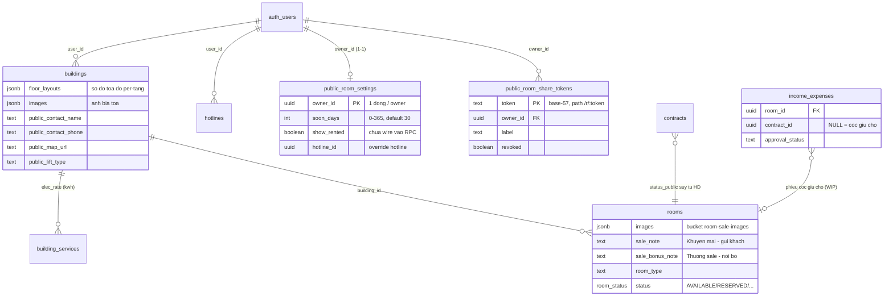
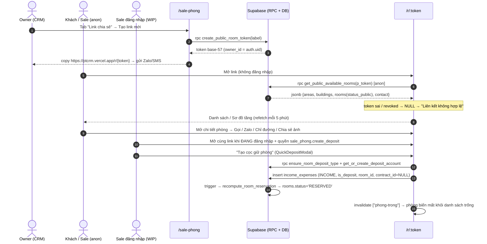
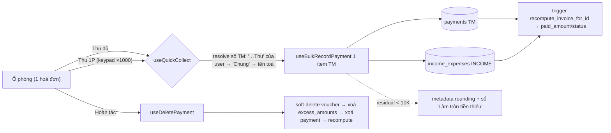

# Kênh công khai & mobile: Phòng trống (/r/:token) · Sale Phòng · Thu tiền

> Ba module "mặt tiền" mới (2026-06) phục vụ **sale & vận hành ngoài hiện trường**, xây bên trên các domain lõi sẵn có:
>
> 1. **Trang công khai "Phòng trống"** `/r/:token` — bảng phòng trống live cho khách/sale xem **không cần đăng nhập** (share link).
> 2. **Module quản trị "Sale Phòng"** `/sale-phong` — nơi owner vận hành trang công khai: token chia sẻ, cài đặt hiển thị, ảnh sale, editor sơ đồ tầng kéo-thả.
> 3. **Trang "Thu tiền"** `/thu-tien` — màn mobile cho nhân viên đi **thu tiền mặt** theo hoá đơn tháng (1 chạm thu đủ / thu một phần / hoàn tác / báo cáo).
>
> ⚠️ **Phần WIP chưa commit** (working tree tại thời điểm viết): flow **"Tạo cọc nhanh"** trên trang công khai — gồm [QuickDepositModal.tsx](src/pages/phong-trong/QuickDepositModal.tsx), migration `20260608100000_ensure_room_deposit_type_rpc.sql`, action quyền `sale_phong.create_deposit` trong [permissions.ts](src/lib/permissions.ts) và phần wiring trong PhongTrongPage/Parts/Sheet. Các mục liên quan bên dưới được đánh dấu **(WIP)**.

## 1. Tổng quan & vai trò nghiệp vụ

### 1.1. Trang công khai "Phòng trống" `/r/:token`

- Owner tạo **token chia sẻ** (chuỗi base-57 ngẫu nhiên, 6 ký tự) → gửi link `https://ptcrm.vercel.app/r/<token>` cho sale/khách. Khách mở link **với role `anon`**, không đăng nhập.
- Trang hiển thị **mọi toà của owner đang có ≥1 phòng trống/sắp trống**, 2 chế độ xem: **Danh sách** (card ảnh + giá + tiện ích) và **Sơ đồ** (canvas toạ độ từng tầng, scale-to-fit). Chip "Tổng hợp" xem gộp tất cả toà; lọc theo Quận.
- Bottom-sheet chi tiết phòng: gallery ảnh, giá/cọc/điện, khuyến mãi (`sale_note`), thưởng sale (`sale_bonus_note` — nội bộ), nút **Gọi / Zalo / Chỉ đường / Chia sẻ (kèm toàn bộ ảnh qua Web Share API) / Tải ảnh**.
- Route đăng ký **ngoài `ProtectedRoute`** và lazy-load để cô lập [phongTrong.css](src/pages/phong-trong/phongTrong.css) (CSS đặt style cho `body`, ngoài `@layer` — không được rò sang phần còn lại của CRM). Xem comment trong [App.tsx](src/App.tsx).
- **(WIP)** Sale **đang đăng nhập** mở chính link này và có quyền `sale_phong.create_deposit` sẽ thấy nút "Tạo cọc giữ phòng" → tạo phiếu thu cọc 1 chạm → phòng tự `RESERVED` (khoá realtime, biến mất khỏi danh sách trống).

### 1.2. Module "Sale Phòng" `/sale-phong`

Trang quản trị (trong shell CRM, sidebar *Danh mục dữ liệu → Sale Phòng*), gate bằng `RequirePermission module="sale_phong" action="view"`. 4 tab ([SalePhongPage.tsx](src/pages/sale-phong/SalePhongPage.tsx)):

| Tab | Component | Làm gì |
|---|---|---|
| Link chia sẻ | [ShareTokensTab.tsx](src/components/sale-phong/ShareTokensTab.tsx) | CRUD token `/r/:token`: tạo (RPC), copy link, mở thử, đổi nhãn, **thu hồi/khôi phục** (`revoked`), xoá hẳn. |
| Cài đặt hiển thị | [DisplaySettingsTab.tsx](src/components/sale-phong/DisplaySettingsTab.tsx) | `soon_days` (số ngày báo "sắp trống", 0–365), hotline hiển thị, `show_rented` (lưu sẵn, **chưa wire vào RPC**). |
| Hình ảnh sale | [SaleImagesTab.tsx](src/components/sale-phong/SaleImagesTab.tsx) | Upload/sắp xếp ảnh **phòng** (`rooms.images`) và ảnh **toà** (`buildings.images`) lên bucket PUBLIC `room-sale-images`. |
| Sơ đồ tòa nhà | [FloorPlanEditorTab.tsx](src/components/sale-phong/floor-editor/FloorPlanEditorTab.tsx) | Editor **kéo-thả** vị trí phòng / thang máy / cầu thang / hành lang theo từng tầng → lưu `buildings.floor_layouts` (jsonb). |

### 1.3. Trang "Thu tiền" `/thu-tien`

- Page phụ mobile-first ([ThuTien.tsx](src/pages/ThuTien.tsx) + bộ component [src/components/thu-tien/](src/components/thu-tien/RoomCellGrid.tsx)), style riêng `thu-tien.css` scope dưới `.tt-page` (font Be Vietnam Pro / Space Mono), lazy-load. Sidebar *Tài chính → Thu tiền*.
- **Không tạo bảng/RPC mới** — là một "view nghiệp vụ" trên domain [07 Hoá đơn](07-hoa-don-thanh-toan.md) + [08 Thu chi](08-thu-chi-so-quy.md): đọc hoá đơn theo toà + kỳ (`billing_month`), hiển thị lưới ô phòng 3 màu (Chưa thu / Một phần / Đã thu), thao tác **Thu đủ** (1 chạm) hoặc **Thu một phần** (bàn phím số nhập theo nghìn).
- Mỗi lần thu = ghi **`payments` (method `TM`) + phiếu thu `income_expenses`** (xem §4.7) — đúng dòng dữ liệu của nút "Thu tiền" trong trang Hoá đơn, không phát minh đường ghi mới.
- Route bọc `ProtectedRoute` (không gate quyền riêng); các nút ghi tiền chỉ hiện khi user có `invoices.record_payment`.

---

## 2. Cấu trúc dữ liệu

### 2.1. Bảng `public_room_share_tokens` — token chia sẻ trang công khai

Migration [20260606120000_public_room_share_phong_trong.sql](supabase/migrations/20260606120000_public_room_share_phong_trong.sql).

| Cột | Ý nghĩa |
|---|---|
| `token` | **PK**, chuỗi base-57 (6 ký tự, trùng thì bump 8) — chính là path `/r/:token`. Không chứa thông tin owner. |
| `owner_id` | FK → `auth.users` (CASCADE). Chủ data được lộ ra — **chỉ phía server**, RPC dùng để lọc; không bao giờ trả về client anon. |
| `label` | Nhãn gợi nhớ (vd "Gửi sale khu Gò Vấp"). |
| `revoked` | `true` = thu hồi link (RPC trả NULL → trang báo "Liên kết không hợp lệ"). Có thể khôi phục. |
| `created_at` | Audit. |

RLS: policy `prst_owner_all` FOR ALL TO **authenticated** `owner_id = auth.uid()` — owner tự CRUD token của mình. **`anon` không có quyền nào trên bảng**; chỉ đọc gián tiếp qua RPC SECURITY DEFINER.

### 2.2. Bảng `public_room_settings` — cấu hình hiển thị (1 dòng / owner)

Migration [20260607090000_public_room_settings.sql](supabase/migrations/20260607090000_public_room_settings.sql).

| Cột | Ý nghĩa |
|---|---|
| `owner_id` | **PK**, FK → `auth.users`. 1 dòng / owner, áp cho **mọi** token của owner. |
| `soon_days` | Số ngày trước khi HĐ hết hạn thì phòng báo "Sắp trống" (CHECK 0–365, default 30). |
| `show_rented` | Lưu sẵn cho UI — **CHƯA wire vào RPC** (ẩn phòng đã thuê sẽ làm thủng sơ đồ tầng). |
| `hotline_id` | Override hotline hiển thị (NULL = hotline active đầu tiên của owner, bảng `hotlines`). |
| `updated_at` | Audit. |

RLS owner-only như trên. Thiếu dòng → RPC dùng mặc định (30 ngày, hotline đầu).

### 2.3. Cột mới trên `rooms` / `buildings` (phục vụ trang công khai)

| Bảng.Cột | Migration | Ý nghĩa |
|---|---|---|
| `rooms.sale_note` | `20260607120000` | Ô **"Khuyến mãi"** — promo riêng phòng, **gửi khách được**. Tách khỏi `description`. |
| `rooms.room_type` | `20260607130000` | "Loại phòng" (Gác, Ban công, Studio…) — trước đây suy sai từ `max_occupants`. |
| `rooms.sale_bonus_note` | `20260607140000` | Ô **"Thưởng sale"** — **nội bộ**, RPC vẫn trả về nhưng UI chỉ hiện cho sale (không nằm trong text chia sẻ khách). |
| `rooms.images` | (sẵn có) | jsonb string[] — URL đầy đủ hoặc storage path trong bucket `room-sale-images`. |
| `buildings.floor_layouts` | `20260607090100` | **Sơ đồ toạ độ thủ công per-tầng** (jsonb). Shape: `{ "<floor>": { canvasW, canvasH, corridor{x,y,w,h}, fixtures[{id,kind:'elevator'\|'stairs',x,y,w,h}], rooms{ "<room_id>": {x,y,w,h} } } }`. NULL / thiếu tầng / thiếu phòng → client tự sinh `layoutFloor()` fallback. RLS kế thừa `buildings` (owner-scoped). |
| `buildings.public_contact_name/phone` | `20260607140000` | Liên hệ QL **riêng từng toà** (nút Gọi/Zalo); trống → dùng hotline chung. |
| `buildings.public_map_url` | `20260607140000` | Link Google Maps "Chỉ đường" riêng toà; trống → search theo địa chỉ. |
| `buildings.public_lift_type` | `20260607150000` | `"Thang máy"` \| `"Thang bộ"` — hiện ở Mô tả toà. |
| `buildings.images` | (sẵn có) | Ảnh bìa toà cho header từng toà trên trang công khai. |

### 2.4. RPC

| RPC | Grant | Vai trò |
|---|---|---|
| `get_public_available_rooms(p_token)` | **anon** + authenticated | API đọc duy nhất của trang công khai. SECURITY DEFINER: token → `owner_id` → trả jsonb `{areas, buildings, rooms, contact}`. Token sai/`revoked` → **NULL**. Đã qua nhiều vòng CREATE OR REPLACE: bản gốc `20260606120000` → v2 `20260607090400` (soon_days/hotline/floor_layouts/ảnh toà) → `…120000` (sale_note) → `…130000` (room_type) → `…140000` (sale_bonus_note + public_contact_* + map_url) → `…150000` (`public_lift_type`, `elec_rate` từ `building_services` join `services` có `unit ILIKE 'kwh'`) → `20260611120000` (**`area_ids[]`** từ `area_buildings` sau khi `buildings.area_id` bị DROP, xem [11 Phân quyền/Khu vực]) → bản **mới nhất [20260617090100_get_public_available_rooms_pass.sql](supabase/migrations/20260617090100_get_public_available_rooms_pass.sql)** (`status_public='pass'` cho `room_pass_listings`, §2.7). ⚠️ Khi sửa tiếp phải base trên bản `…090100`, KHÔNG phải `…150000` (bản đó còn `b.area_id` đã DROP → lỗi). |
| `upsert_room_pass_listing` / `set_room_pass_listing_active` / `delete_room_pass_listing` / `pass_listing_form_rooms` | authenticated (REVOKE anon) | Ghi/đọc-form "phòng khách nhờ sale" (§2.7). SECURITY DEFINER tự gán `user_id`=owner + guard quyền theo scope tòa. Migration [20260617090000](supabase/migrations/20260617090000_room_pass_listings.sql). |
| `create_public_room_token(p_label)` | authenticated (REVOKE anon) | Tạo token cho owner hiện tại: tái dùng `gen_contract_public_code(6)` (base-57, không ký tự dễ nhầm), retry chống trùng 10 lần rồi bump 8 ký tự. Migration [20260607090300](supabase/migrations/20260607090300_create_public_room_token_rpc.sql). |
| `recompute_room_reservation(room_id)` | (trigger gọi) | Nguồn sự thật cờ "cọc giữ chỗ": phòng `AVAILABLE` có cọc chưa-link-HĐ (kể cả phiếu **chưa duyệt**, chỉ loại `CANCELLED`/đã xoá) → `RESERVED`, và ngược lại. Migration [20260608000000](supabase/migrations/20260608000000_room_reservation_reconcile.sql) — xem chi tiết [04 Cọc](04-coc-giu-cho.md). |
| `ensure_room_deposit_type()` **(WIP)** | authenticated | Get-or-create loại thu "Tiền cọc" của caller, **ép `is_deposit = TRUE`** (tái dùng helper `_termination_ensure_type`) — để `ie_has_deposit_item()` nhận diện phiếu cọc → trigger khoá phòng. Migration `20260608100000_ensure_room_deposit_type_rpc.sql` (chưa commit). |
| `get_or_create_deposit_account()` | authenticated | Sổ quỹ hệ thống **"CỌC (giữ hộ khách)"** (sẵn có từ module thanh lý, migration `20260603000022`) — QuickDepositModal dùng làm sổ nhận mặc định. |

> [types.ts](src/integrations/supabase/types.ts) **đã regen từ live DB 2026-06-17** — nay gồm đủ nhóm cột sale (`rooms.sale_note`/`sale_bonus_note`, `buildings.public_contact_*`/`public_map_url`/`public_lift_type`), bảng `room_pass_listings` + các RPC pass, và `ensure_room_deposit_type`. (Trước đó types.ts dừng ở 2026-06-07 nên thiếu các nhóm này.)

### 2.5. Bucket Storage `room-sale-images` — **PUBLIC** (ngoại lệ duy ý)

Migration [20260607090200_room_sale_images_bucket.sql](supabase/migrations/20260607090200_room_sale_images_bucket.sql). Khác với quy tắc chung "7 bucket private + signed URL": trang công khai phục vụ khách **anon** nên ảnh sale (marketing, vốn để công khai) phải xem được qua `getPublicUrl`. RLS `storage.objects`: đọc = `public`; ghi/sửa/xoá = `authenticated`. Adapter [supabaseData.ts](src/pages/phong-trong/supabaseData.ts) pass-through nếu giá trị đã là URL đầy đủ, chỉ dựng public URL khi là storage path.

### 2.6. Thu tiền — không có schema riêng

`/thu-tien` chỉ đọc/ghi các bảng sẵn có: `invoices` + `invoice_items` + `payments` (domain 07), `income_expenses` + `income_expense_types` + `accounts` (domain 08), `excess_amounts` (khi hoàn tác). Toàn bộ logic FE thuần nằm ở [src/lib/collect.ts](src/lib/collect.ts) (pure helpers: `collectStatus`, `remainingOf`, `paymentsInRange`, `latestPaymentId`, format tiền/Zalo/tel — có test được).

### 2.7. Bảng `room_pass_listings` — "phòng khách nhờ sale / pass" (2026-06-17)

Khách đang thuê nhờ công ty **sale / pass / sang phòng giùm**. Phòng đó đang có HĐ `ACTIVE` nên bị `status_public='rented'` và không lên kênh. Bảng này là **lớp overlay ĐỘC LẬP** đánh dấu phòng cần đăng lại — **KHÔNG đụng `rooms.status` / hợp đồng** (tránh `recompute_room_reservation`). Migration [20260617090000_room_pass_listings.sql](supabase/migrations/20260617090000_room_pass_listings.sql).

| Cột | Ý nghĩa |
|---|---|
| `user_id` | = `buildings.user_id` (OWNER tòa — để trang public match owner-của-token), **KHÔNG** phải `auth.uid()` của nhân viên tạo. |
| `building_id`, `room_id` | Phòng nội bộ được pass (FK). Partial unique `(room_id) WHERE active` — mỗi phòng tối đa 1 listing bật. |
| `contact_name` / `contact_phone` | **SĐT + tên KHÁCH** — hiển thị công khai thay hotline/QL. **Expose CÓ Ý** qua RPC (opt-in nhập tay; ngoại lệ so với quy tắc "anon không thấy khách thuê"). |
| `sale_policy` | Chính sách sale **do khách đặt** (vd "Giảm khách 500k tháng đầu…"). |
| `pass_price` | Giá pass (NULL → fallback `rooms.rent_price`). |
| `active`, `created_by` | Bật/tắt hiển thị; audit người tạo. |

- **RLS**: SELECT = owner OR `can_access_building(building_id)`; **KHÔNG có policy ghi** → ghi trực tiếp bị chặn, ép qua RPC.
- **RPC ghi SECURITY DEFINER**: `upsert_room_pass_listing` / `set_room_pass_listing_active` / `delete_room_pass_listing` — gán `user_id`=owner, guard `can_manage_pass_listing` (owner OR `can_do_on_building('sale_phong','manage_pass_listings'|'edit', building)`). RPC form `pass_listing_form_rooms()` trả phòng trong scope nhân viên (KHÔNG lọc AVAILABLE). REVOKE anon, GRANT authenticated.
- **Nhân viên có quyền** quản lý được (scope tòa qua RBAC như `income_expenses`), không chỉ owner. Quyền catalog: `sale_phong.manage_pass_listings` (fallback `edit`).
- **FE**: tab "Khách nhờ sale" trong `/sale-phong` ([PassListingsTab](src/components/sale-phong/PassListingsTab.tsx) + [usePassListings](src/hooks/usePassListings.ts)); trang công khai render `RoomStatus='pass'` (hồng, [phongTrong.css](src/pages/phong-trong/phongTrong.css) `--st-pass`) với contact + chính sách của khách, DetailSheet nút "Gọi khách". Xem MEMORY `project_room_pass_listings`.

---

## 3. Sơ đồ quan hệ dữ liệu

Quan hệ "ảo" quan trọng (không FK): RPC `get_public_available_rooms` **đọc xuyên** `public_room_share_tokens → buildings/rooms/areas/hotlines/contracts/building_services` bằng SECURITY DEFINER — token là "chìa khoá" duy nhất anon có.

---

## 4. Quy tắc nghiệp vụ & tự động hoá

### 4.1. Mô hình bảo mật token (public read qua RPC, không mở bảng)

- Chuỗi token **ngẫu nhiên, không chứa owner_id**; URL không lộ gì. `anon` không SELECT được bảng nào — chỉ EXECUTE `get_public_available_rooms`, hàm tự map token → owner và **không trả** `user_id`/hợp đồng/khách thuê/công nợ ra payload.
- Thu hồi tức thời: set `revoked = true` → mọi request sau trả NULL → trang hiện "Liên kết không hợp lệ hoặc đã hết hạn". Khôi phục được (khác Xoá — mất hẳn).
- Trang FE khi **không có data/token** rơi về `SAMPLE_BUILDINGS` (data mẫu trong [sampleData.ts](src/pages/phong-trong/sampleData.ts)) để xem thử UI — cần biết điều này khi debug "sao thấy toà lạ".

### 4.2. `status_public` — **hợp đồng là nguồn sự thật**, không phải `rooms.status`

RPC tự tính cho từng phòng (vì cờ `rooms.status` có thể stale — phòng có HĐ nhưng vẫn để `AVAILABLE`):

| Giá trị | Điều kiện |
|---|---|
| `pass` | Phòng có **listing `room_pass_listings` đang `active`** (khách nhờ sale, §2.7) — nhánh này đặt **TRƯỚC** mọi nhánh khác nên phòng đang có HĐ vẫn ra `pass`. RPC trả kèm `pass_contact_name/phone`, `pass_sale_policy`, `pass_price`. |
| `soon` | Có HĐ hiệu lực có `COALESCE(actual_end_date, end_date)` trong `[CURRENT_DATE, CURRENT_DATE + soon_days]` → kèm `avail_date` = ngày hết hạn sớm nhất. |
| `rented` | Có HĐ hiệu lực (không sắp hết) — **kể cả** khi `rooms.status='AVAILABLE'`; HOẶC không HĐ nhưng `rooms.status` ∉ `AVAILABLE` (gồm `RESERVED`/`MAINTENANCE`…). |
| `free` | Không có HĐ hiệu lực **và** `rooms.status = 'AVAILABLE'`. |

- Chỉ trả **toà có ≥1 phòng `free`/`soon`/`pass`**, nhưng trả **đủ phòng** của toà đó để vẽ sơ đồ tầng (phòng `rented` hiện mờ). → toà full phòng đã thuê vẫn lên kênh nếu có phòng `pass`.
- **Phòng `RESERVED` (đã cọc giữ chỗ) hiện như "Đã thuê"** → tự ẩn khỏi bucket trống. Đây chính là cơ chế "khoá phòng realtime" của Tạo cọc nhanh (§4.6).
- ⚠️ **Ghi chú EXTENDED**: SQL của RPC vẫn viết `c.status IN ('ACTIVE','EXTENDED')` — vô hại vì từ 2026-06-06 status `EXTENDED` **đã ngưng dùng** (HĐ gia hạn giữ `ACTIVE`, xem [05 Hợp đồng](05-hop-dong.md)); điều kiện thực tế chỉ match `ACTIVE`. Nếu viết RPC mới, chỉ cần `ACTIVE`.

### 4.3. Sơ đồ tầng: layout thủ công + fallback tự sinh

- Mỗi toà/tầng có thể có layout thủ công trong `buildings.floor_layouts` (vẽ ở tab "Sơ đồ tòa nhà"). Client render bằng [floorLayoutShared.ts](src/pages/phong-trong/floorLayoutShared.ts): `applyStoredLayout()` nếu tầng có layout, ngược lại `layoutFloor()` tự xếp theo toạ độ (export từ `sampleData.ts`).
- Phòng **không có** trong layout (mới tạo, đổi tầng) được xếp tạm — trang công khai **luôn vẽ đủ phòng**; key phòng mồ côi (đã xoá) bị bỏ qua khi render, dọn ở lần Lưu kế tiếp của editor.
- Adapter chỉ giữ **tầng còn ≥1 phòng free/soon** (ẩn tầng đã full khỏi chế độ Sơ đồ).
- Editor ([FloorPlanEditorTab.tsx](src/components/sale-phong/floor-editor/FloorPlanEditorTab.tsx)): seed tầng chưa có layout từ `seedFromAuto()`, undo stack 30 bước, snap lưới, "Tự sắp xếp" reset về auto, Lưu = `useUpdateBuilding` ghi nguyên map `floor_layouts`.

### 4.4. Gotcha gọi RPC public từ supabase-js (xem MEMORY `project_supabase_rpc_schema_gotcha`)

Gọi `supabase.rpc(...)` **như method** (giữ `this`) hoặc `supabase.rpc.bind(supabase)` — **không** tách `const { rpc } = supabase` ra biến rời, kẻo client mất cấu hình schema và PostgREST resolve nhầm thành `api.<fn>` → 404. Request RPC public phải mang header `Content-Profile: public`. Cả [usePhongTrong.ts](src/pages/phong-trong/usePhongTrong.ts) (cast nhưng gọi method) lẫn QuickDepositModal (`rpc.bind(supabase)`) đều tuân theo.

### 4.5. Realtime "mềm" của trang công khai

[usePhongTrong.ts](src/pages/phong-trong/usePhongTrong.ts): React Query `staleTime` 60s, `refetchOnWindowFocus`, `refetchInterval` 5 phút — sale luôn thấy "thời điểm hiện tại" mà không cần websocket. Sau khi tạo cọc nhanh, FE chủ động `invalidateQueries(["phong-trong"])` để phòng biến mất ngay.

### 4.6. **(WIP)** Tạo cọc nhanh trên trang công khai

Toàn bộ phần này **chưa commit** (working tree 2026-06-10):

- **Quyền**: action mới `create_deposit` trên module `sale_phong` ([permissions.ts](src/lib/permissions.ts), nhãn "Tạo cọc nhanh"). Nút chỉ hiện khi `useSession()` có user **và** `can(perms, "sale_phong", "create_deposit")` — khách anon không bao giờ thấy.
- **Điểm vào**: nút "Tạo cọc giữ phòng" trong DetailSheet (phòng chưa thuê) + click ô phòng xanh ở chế độ Tổng hợp.
- **[QuickDepositModal.tsx](src/pages/phong-trong/QuickDepositModal.tsx)** tạo **phiếu thu `income_expenses`** qua `useCreateIncomeExpense` với: sổ quỹ = "CỌC (giữ hộ khách)" (`get_or_create_deposit_account`), hạng mục = "Tiền cọc" `is_deposit=TRUE` (`ensure_room_deposit_type`), `room_id` = phòng, `contract_id = NULL` (cọc giữ chỗ — chưa có HĐ), `business_result_accounting = NULL` (hạng mục cọc tự loại khỏi KQKD), nội dung "Cọc phòng {x} tòa {y}". **Số tiền để trống → mặc định 1đ** (chỉ để giữ chỗ); "Ngày bổ sung cọc"/"Ngày vào" chỉ ghi thêm vào nội dung/description.
- **Chuỗi tự động hoá** (đã commit ở migration `20260608000000`): insert phiếu → trigger `trg_ie_reconcile_room` → `recompute_room_reservation` thấy phòng `AVAILABLE` có phiếu cọc chưa-link-HĐ (kể cả **chưa duyệt**) → `rooms.status='RESERVED'` → RPC public xếp phòng vào `rented` → phòng rời danh sách trống của mọi link chia sẻ.

### 4.7. Thu tiền tạo dữ liệu gì (đọc từ code, không đoán)

Một lần thu trên `/thu-tien` chạy [useQuickCollect.ts](src/hooks/useQuickCollect.ts) → bọc [useBulkRecordPayment.ts](src/hooks/useBulkRecordPayment.ts) với **đúng 1 item, chỉ line `TM`** (`amount_tk = amount_tt = 0`, `change_amount = 0`):

1. **`payments`**: 1 dòng `payment_method='TM'`, `amount` = số thu (cap ≤ `remaining`), `payment_date` = hôm nay, `user_id` = **owner của invoice** (không phải staff — để RLS `staff_can('invoices', …)` match).
2. **`income_expenses`**: 1 phiếu thu `INCOME` link `payment_id`/`invoice` (loại thu mặc định `is_default` của owner), cùng `user_id` owner.
3. **Trigger DB** `recompute_invoice_for_id` (migration `20260510000010`) tự cập nhật `invoices.paid_amount / remaining_amount / status` — FE không tự tính.
4. **Không dùng RPC `record_invoice_payment`** — RPC đó check `user_id = p_user_id` nên staff bị từ chối dù RLS cho ghi; insert trực tiếp là chủ ý.

Quy tắc kèm theo:

- **Resolve sổ quỹ nhận (TM)** theo thứ tự: sổ tên kết thúc `"…Thu"` thuộc user đang đăng nhập → sổ `"Chung"` → sổ trùng tên toà của hoá đơn. Không tìm thấy → **throw, chặn ghi** (không insert `account_id` rỗng).
- **Làm tròn tự động**: residual sau thu `0 < x < 10.000đ` → gắn metadata `rounding_amount` + sổ `"Làm tròn tiền thiếu"` lên voucher (audit, **không trừ số dư**) → trigger DB mark invoice `PAID`. Cùng cơ chế với [08 §4.10](08-thu-chi-so-quy.md).
- **Hoàn tác** ([useDeletePayment.ts](src/hooks/useDeletePayment.ts), lấy payment mới nhất qua `latestPaymentId`): soft-delete voucher `income_expenses` theo `payment_id` → hard-delete `excess_amounts` có `source_payment_id` → hard-delete `payments` → trigger `recompute_invoice_after_payment_change` tự hạ `paid_amount/status`.
- **Ghi chú** khi phòng chưa thu: ghi thẳng `invoices.notes` ([useUpdateInvoiceNote.ts](src/hooks/useUpdateInvoiceNote.ts)); khi thu kèm ghi chú thì truyền vào `notes` của phiếu.
- Trạng thái 3 màu map từ hoá đơn thật ([collect.ts](src/lib/collect.ts)): `paid` = `PAID` hoặc remaining ≤ 0; `partial` = `PARTIAL_PAID` hoặc `paid_amount > 0`; `unpaid` = còn lại (gồm `APPROVED/OVERDUE/DRAFT`).

---

## 5. Quy trình theo từng trang

### 5.1. Sequence tổng: chia sẻ → khách xem → liên hệ / cọc

### 5.2. `/r/:token` — Trang công khai "Phòng trống"

Component chính: [PhongTrongPage.tsx](src/pages/phong-trong/PhongTrongPage.tsx) (orchestrator) · [PhongTrongParts.tsx](src/pages/phong-trong/PhongTrongParts.tsx) (`ListView`, `OverviewView`, `FloorPlan` canvas scale-to-fit) · [PhongTrongSheet.tsx](src/pages/phong-trong/PhongTrongSheet.tsx) (`DetailSheet` + `Toast`) · [usePhongTrong.ts](src/pages/phong-trong/usePhongTrong.ts) → [supabaseData.ts](src/pages/phong-trong/supabaseData.ts) (adapter payload → type `Building/Room` của UI).

1. `useParams` lấy `token` → `usePhongTrong(token)`; đang tải hiện "Đang tải…", lỗi hiện "Liên kết không hợp lệ"; không có token → data mẫu (xem thử UI).
2. Header: chips **Quận** + chips **Toà nhà** (kéo ngang được bằng chuột/vuốt), chip **"Tổng hợp"** đầu hàng; segment **Danh sách / Sơ đồ**.
3. Chế độ *Danh sách*: phòng của toà đang chọn, ẩn `rented`, sort tầng cao→thấp. Chế độ *Tổng hợp*: card mỗi toà (ảnh, liên hệ, nút Zalo/SĐT, dải ô phòng nhanh). Chế độ *Sơ đồ*: `FloorPlan` từng tầng theo `floor_layouts`/auto-layout, phòng `rented` mờ.
4. `DetailSheet`: gallery (ảnh thật từ `rooms.images`; chưa có ảnh → placeholder picsum), specs (diện tích, loại phòng, điện `elec_rate`, thang máy/bộ), Khuyến mãi (`sale_note`), Thưởng sale (`sale_bonus_note` — chỉ hiển thị nội bộ, **không** vào text chia sẻ), nút hành động:
   - **Gọi / Zalo**: liên hệ riêng toà (`public_contact_*`) → fallback hotline chung (`contact` từ RPC).
   - **Chỉ đường**: `public_map_url` → fallback Google Maps search theo địa chỉ.
   - **Chia sẻ / Copy gửi khách**: Web Share API level 2 gửi **text + toàn bộ ảnh** (`File[]`, tên `Tòa-Phòng-STT`); máy không hỗ trợ → share text → fallback copy clipboard.
   - **Tải ảnh**: share sheet files-only ("Lưu N ảnh" vào thư viện iOS/Android); desktop → tải từng ảnh `<a download>` cách nhau 350ms.
   - Điều hướng phòng trước/sau cùng toà (chỉ phòng chưa thuê); lưu tim `localStorage` key `pt_saved`.
5. **(WIP)** Nút "Tạo cọc giữ phòng" + click ô phòng ở Tổng hợp → `QuickDepositModal` (§4.6).

### 5.3. `/sale-phong` — Quản trị Sale Phòng

Gate: `RequirePermission module="sale_phong" action="view"` ([App.tsx](src/App.tsx)); module khai báo trong nhóm "Bất động sản" của [permissions.ts](src/lib/permissions.ts).

- **Tab Link chia sẻ**: bảng token (`usePublicRoomTokens` — SELECT thẳng bảng, RLS tự lọc owner). Tạo → RPC `create_public_room_token` + tự copy link ([publicLinks.ts](src/lib/publicLinks.ts) hard-code `PUBLIC_BASE = https://ptcrm.vercel.app`). Đổi nhãn / thu hồi / khôi phục = UPDATE; xoá = DELETE (có AlertDialog phân biệt "thu hồi tạm" vs "xoá vĩnh viễn").
- **Tab Cài đặt hiển thị**: form 1 dòng `public_room_settings` (upsert theo `owner_id`): `soon_days`, hotline (Select sentinel `__none__` = mặc định), switch `show_rented` (chỉ lưu — chưa tác dụng).
- **Tab Hình ảnh sale**: 2 section Phòng (chọn toà → phòng bằng `SearchableSelect`) và Toà. [SaleImageManager.tsx](src/components/sale-phong/SaleImageManager.tsx) upload bucket `room-sale-images`, lưu mảng vào `rooms.images` / `buildings.images` qua `useUpdateRoom` / `useUpdateBuilding`.
- **Tab Sơ đồ tòa nhà**: editor kéo-thả (§4.3) — chọn toà/tầng, palette Thang máy/Cầu thang, bắt lưới, "Tự sắp xếp", Hoàn tác, danh sách "Phòng chưa đặt" (+ tên phòng để thêm vào canvas), Lưu sơ đồ.

### 5.4. `/thu-tien` — Thu tiền mặt mobile

Commit `e6f44a7` (trang) + `8510493` (scope CSS `.tt-page`).

1. **Header**: input kỳ `type="month"` (`billing_month`) + [BuildingPills](src/components/thu-tien/BuildingPills.tsx) chọn toà (mặc định toà đầu). Data = `useInvoices({building_id, billing_month})` — cùng read-path trang Hoá đơn (RLS theo toà phụ trách).
2. **Bộ lọc**: [TimeFilter](src/components/thu-tien/TimeFilter.tsx) (Tất cả / Hôm nay / Chọn ngày — theo `payments.payment_date`, [DatePanel](src/components/thu-tien/DatePanel.tsx) hỗ trợ 1 ngày hoặc khoảng) × [StatusFilter](src/components/thu-tien/StatusFilter.tsx) (Chưa thu / Đã thu / Tất cả — mặc định **Chưa thu**), mỗi chip kèm số đếm chéo.
3. **[CollectSummaryBar](src/components/thu-tien/CollectSummaryBar.tsx)**: tổng Đã thu / Còn phải thu + số phòng, nút mở Báo cáo.
4. **Lưới ô phòng** ([RoomCellGrid](src/components/thu-tien/RoomCellGrid.tsx) / [RoomCell](src/components/thu-tien/RoomCell.tsx)): mỗi ô = 1 hoá đơn, 3 màu đỏ/vàng/xanh; nút nhanh **Thu đủ** (mở [ConfirmCollectDialog](src/components/thu-tien/ConfirmCollectDialog.tsx)) và **Thu 1P** (mở drawer chế độ bàn phím).
5. **[CollectDrawer](src/components/thu-tien/CollectDrawer.tsx)** (tap ô): chi tiết hoá đơn ([InvoiceDetailCard](src/components/thu-tien/InvoiceDetailCard.tsx)), Thu đủ / Thu một phần ([CollectKeypad](src/components/thu-tien/CollectKeypad.tsx) — nhập **theo nghìn**, `entered * 1000`), Ghi chú, **Hoàn tác** (xoá payment gần nhất), Gọi khách đại diện (`contract_customers.is_representative`), điều hướng phòng trước/sau theo danh sách đã lọc. Mọi nút ghi gated `invoices.record_payment`.
6. **[CollectionReport](src/components/thu-tien/CollectionReport.tsx)**: báo cáo full-sheet theo Toà (hoặc Tất cả toà) × thời gian (cả kỳ/hôm nay/ngày), nhóm đã-thu theo toà + chips danh sách phòng chưa thu; dùng [useCollectionReport.ts](src/hooks/useCollectionReport.ts) (tái dùng `useInvoices`, không query payments riêng).

---

## 6. Liên kết sang domain khác (vào / ra)

| Liên kết | Hướng | Lý do |
|---|---|---|
| [02 Cơ cấu BĐS](02-co-cau-toa-nha-phong-dich-vu.md) — `buildings`/`rooms`/`areas`/`building_services` | **Vào** | RPC public đọc cây tài sản + giá điện (`unit ILIKE 'kwh'`); cột sale (`sale_note`, `floor_layouts`, `public_*`…) đắp thêm lên 2 bảng này; trạng thái `RESERVED` do cọc giữ chỗ. |
| [05 Hợp đồng](05-hop-dong.md) — `contracts` | **Vào** | `status_public` (free/soon/rented) + `avail_date` suy từ HĐ `ACTIVE` (EXTENDED đã ngưng dùng); `recompute_room_reservation` bỏ qua phòng có HĐ hiệu lực. |
| [04 Cọc giữ chỗ](04-coc-giu-cho.md) | **Ra** | **(WIP)** Tạo cọc nhanh ghi phiếu thu `is_deposit` `contract_id=NULL` → trigger `RESERVED`; sổ "CỌC (giữ hộ khách)"; nguồn sự thật cọc vẫn là IE `is_deposit`. |
| [08 Thu chi & Sổ quỹ](08-thu-chi-so-quy.md) — `income_expenses`, `accounts`, `income_expense_types` | **Ra** | Thu tiền tạo phiếu thu + resolve sổ "…Thu"/"Chung"/tên toà; làm tròn <10K vào sổ "Làm tròn tiền thiếu"; cọc nhanh dùng loại thu "Tiền cọc". |
| [07 Hoá đơn & Thanh toán](07-hoa-don-thanh-toan.md) — `invoices`, `payments` | **Vào/Ra** | `/thu-tien` là UI mobile của flow record-payment: đọc `useInvoices`, ghi `payments` TM, hoàn tác xoá payment; ghi chú vào `invoices.notes`. Cùng họ với trang công khai `/c/:code` của HĐ-đơn. |
| [01 Phân quyền](01-phan-quyen-nhan-su.md) | **Vào** | Module `sale_phong` (view/create/edit/delete + extra `create_deposit` **(WIP)**); thu tiền gated `invoices.record_payment`; token/settings RLS owner-only. |
| `hotlines` (domain 14) | **Vào** | Liên hệ mặc định của trang công khai (`hotline_id` override). |
| Storage bucket `room-sale-images` | **Ra** | Bucket **PUBLIC** duy nhất cho ảnh sale — ngoại lệ của quy tắc private + signed URL. |

> **Trạng thái tài liệu**: viết 2026-06-10 theo code tại commit `8510493` + working tree (phần WIP đã đánh dấu). Khi flow "Tạo cọc nhanh" được commit/áp migration, gỡ nhãn **(WIP)** và regen `types.ts` để có `ensure_room_deposit_type`.
