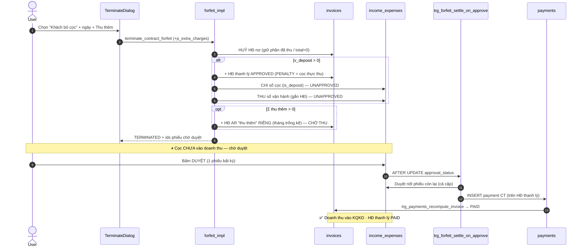
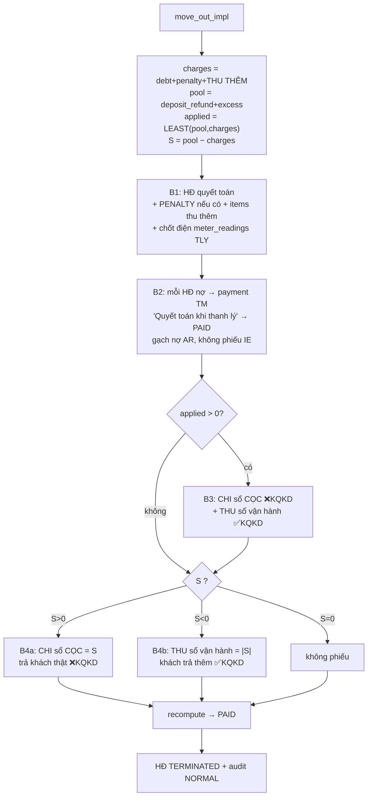

# Thanh lý hợp đồng — BỎ CỌC vs RỜI PHÒNG (deep-dive)

> Đào sâu **logic & dòng tiền** của 2 luồng thanh lý. Bổ sung cho [05 — Hợp đồng](05-hop-dong.md)
> (vốn mô tả thanh lý ở mức migration cũ `20260530000001`). Nội dung dưới dựng lại từ **định
> nghĩa hàm LIVE** trên Supabase (`pg_get_functiondef`, project `tryymsxyyckgbrmmvozx`) nên là
> hành vi **hiện hành** — không bị nhiễu bởi migrations chồng nhau (mỗi hàm là `CREATE OR
> REPLACE`, bản timestamp mới nhất thắng; team apply SQL trực tiếp qua Management API).
>
> Đã **xác minh đối kháng** (2 agent dựng lại độc lập + 1 critic refute từng claim): toàn bộ
> khẳng định chính = *confirmed*.
>
> **Cập nhật 2026-07-03** theo [20260627000001 — thu thêm khi thanh lý](../../supabase/migrations/20260627000001_termination_extra_charges.sql)
> (đã đối chiếu lại định nghĩa hàm LIVE): cả 2 RPC nhận thêm `p_extra_charges`; move-out **đổi
> bước gạch nợ** — quay về payment `TM`, bỏ sổ ảo "Cấn trừ nội bộ" (xem §2.3, §4.2).
>
> **⚠️ Cập nhật lớn 2026-07-09 — [20260709100000 — hoá đơn thanh lý riêng 100%](../../supabase/migrations/20260709100000_settlement_invoice_kind.sql)**
> (v4, APPLY LIVE; các đoạn dưới chưa viết lại theo bản này thì đọc kèm ghi chú sau):
>
> - **`invoices.kind`** mới: `'MONTHLY'` | `'SETTLEMENT'`. Unique `(contract_id, billing_month)`
>   chỉ còn áp cho `MONTHLY` → hoá đơn thanh lý **mang ĐÚNG kỳ tháng trả phòng/bỏ cọc**, sống
>   chung tháng với hoá đơn tiền phòng. `_termination_free_billing_month` (mượn slot tháng
>   trống — nguồn lệch kỳ accrual B6) **không còn được gọi**; 1 hoá đơn lịch sử sai kỳ đã dời về
>   tháng thật.
> - **Move-out KHÔNG BAO GIỜ đụng hoá đơn tháng nữa** (trước: gộp thu thêm vào hoá đơn tháng
>   khi chưa PAID → 1 hoá đơn trộn tiền phòng + thanh lý, báo cáo nhuộm nhầm cả nhóm thành
>   "Doanh thu thanh lý"). Phạt/thu thêm luôn vào hoá đơn `SETTLEMENT` riêng; phiếu "Doanh thu
>   thanh lý" gắn hoá đơn `SETTLEMENT` (hoặc `NULL` nếu không có phạt/thu thêm). Công nợ hoá đơn
>   tháng vẫn gạch bằng payments `CT` (không sửa nội dung hoá đơn).
> - Forfeit: 2 hoá đơn (bù cọc + thu thêm) cũng `kind='SETTLEMENT'`, đúng tháng bỏ cọc.
> - `generate_invoices_for_building` chỉ đếm `kind='MONTHLY'` khi check "đã có hoá đơn tháng".
> - FE: `getInvoiceTitle` nhận diện hoá đơn thanh lý bằng `kind` (regex notes giữ làm fallback);
>   BC Doanh Thu Chi Phí tách dòng thanh lý khỏi dòng tiền phòng khi cùng hoá đơn (dữ liệu lịch
>   sử gộp kiểu cũ vẫn hiển thị đúng).
> - Đã test DB-level 15/15 PASS (move-out HĐ tháng chưa/đã PAID, forfeit + thu thêm, unique).

---

## 1. Tổng quan & vai trò nghiệp vụ

Khi một hợp đồng kết thúc trước/đúng hạn, hệ thống có **2 hình thức thanh lý** (chọn ở step 1
của dialog [TerminateDialog.tsx](../../src/components/contracts/TerminateDialog.tsx)):

| Hình thức | Khi nào | RPC | Hook |
|---|---|---|---|
| **Khách bỏ cọc** (FORFEIT) | Khách bỏ ngang, mất cọc | `terminate_contract_forfeit` | `useTerminateForfeit` |
| **Khách rời phòng** (MOVE_OUT / NORMAL) | Khách trả phòng đúng quy trình | `terminate_contract_move_out` | `useTerminateMoveOut` |

Cả 2 RPC nằm trong nhóm **4 RPC HĐ bọc wrapper kiểm quyền** ([20260601000100](../../supabase/migrations/20260601000100_sec_contract_rpc_authz_and_anon_revoke.sql)):
hàm public `<tên>` (`SECURITY DEFINER`) kiểm `auth.uid()` + `is_super_admin()` OR
`can_do_on_building('contracts','edit', building_of_room)`, rồi gọi `<tên>_impl` chứa logic gốc;
`anon` bị revoke. Từ 2026-06-27, **cả 2 RPC (wrapper + impl) nhận thêm `p_extra_charges jsonb`**
([20260627000001](../../supabase/migrations/20260627000001_termination_extra_charges.sql)) —
khu **"Thu thêm"** ([TerminationExtraCharges](../../src/components/contracts/TerminationExtraCharges.tsx))
xuất hiện ở **step 2 của cả 2 mode** (xem §2.5). Sau khi RPC chạy xong, hook FE
([useContractOperations.ts](../../src/hooks/useContractOperations.ts)) gọi
`consumeRemainingCredit()` để **tiêu hết credit dư** (`excess_amounts`) của HĐ bằng 1 row âm.

Điểm khác biệt **cốt lõi**:

- **BỎ CỌC** = luồng **2 bước**: RPC tạo phiếu **chờ duyệt** (`UNAPPROVED`); phải vào sổ thu chi
  **bấm Duyệt** thì cọc mới vào doanh thu & hoá đơn thanh lý mới `PAID`. Hoá đơn nợ cũ bị **HUỶ**.
  Thu thêm (nếu có) → **hoá đơn AR riêng chờ thu**.
- **RỜI PHÒNG** = **1 bước**: mọi phiếu `APPROVED` ngay trong RPC. Hoá đơn nợ cũ được **đánh
  `PAID` bằng payment `TM` "Quyết toán khi thanh lý"**, KHÔNG huỷ (bản 19→27/06 từng gạch nợ bằng
  `CT` + phiếu sổ ảo — xem §2.3). Thu thêm **gộp** vào hoá đơn thanh lý & cấn vào cọc.

---

## 2. Khái niệm nền tảng (dùng chung)

### 2.1. Các "sổ" (accounts)

- **Sổ CỌC — `'CỌC (giữ hộ khách)'`** (`_deposit_account`): **1 sổ / owner** (key theo `user_id`,
  mọi toà dùng chung — KHÔNG phải 1 row toàn hệ thống). Giữ toàn bộ tiền cọc đang giữ hộ khách.
- **Sổ vận hành của toà** (`_termination_pick_account(user, building)`): nơi ghi **doanh thu**.
  Ưu tiên `buildings.default_account_id_tt` (TM) → `default_account_id_tk` (NH) → fallback sổ
  trùng tên toà / `is_default` / tạo sớm nhất, **né** 2 sổ kỹ thuật `'Cấn trừ thanh lý (nội bộ)'`
  và `'Làm tròn tiền thiếu'`.
- **Sổ ảo `'Cấn trừ thanh lý (nội bộ)'` (TK000055)** (`_termination_offset_account`): sổ kỹ thuật
  truy vết bút toán cấn trừ công nợ. **Chỉ được dùng ở bản move-out 19→27/06
  ([20260619000001](../../supabase/migrations/20260619000001_payment_method_cantru.sql));
  bản hiện hành ([20260627000001](../../supabase/migrations/20260627000001_termination_extra_charges.sql))
  KHÔNG dùng nữa** — hàm/sổ còn tồn tại, chỉ mang dấu vết lịch sử.

### 2.2. Quy tắc "vào KQKD" (Kết quả kinh doanh / Phân bổ lợi nhuận)

Cột `income_expenses.counts_in_business_result` do trigger `ie_business_result` (+ trigger trên
`income_expense_items`) → `recompute_ie_business_result()` tính
([business_result_accounting](../../supabase/migrations/20260531000001_business_result_accounting.sql)):

```text
counts_in_business_result = COALESCE(business_result_accounting, NOT has_deposit)
has_deposit = TRUE nếu BẤT KỲ item nào của phiếu dùng income_expense_type có is_deposit = TRUE
```

→ **Phiếu chạm tiền cọc (is_deposit) → KHÔNG vào KQKD**; phiếu doanh thu (type thường) → **vào
KQKD**; ép tay được bằng cột `business_result_accounting`. Đây là cơ chế khiến **cọc luôn ở ngoài
KQKD**, chỉ phần ghi nhận **doanh thu** mới vào KQKD.

### 2.3. `payment_method = 'CT'` (Cấn trừ)

Loại thanh toán thứ 4 (ngoài `TM/TK/TT`,
[20260619000001](../../supabase/migrations/20260619000001_payment_method_cantru.sql)). Đánh dấu
hoá đơn `PAID` bằng **gạch nợ**, **KHÔNG phải tiền mặt** → không phồng ô TM dashboard
(`get_invoice_statistics_v2` có thẻ riêng `payment_ct`; `CT` không cho nhân viên chọn tay).

**Hiện trạng (từ 27/06):** `CT` chỉ còn được sinh bởi **trigger duyệt forfeit**
(`trg_forfeit_settle_on_approve`). Bản move-out 19→27/06 từng gạch nợ bằng `CT` + phiếu truy vết
vào sổ ảo TK000055, nhưng [20260627000001](../../supabase/migrations/20260627000001_termination_extra_charges.sql)
viết lại impl và **quay về payment `TM`** nhãn "Quyết toán khi thanh lý", **không kèm phiếu truy
vết nào**. ⚠️ Hệ quả: khoản gạch nợ AR của move-out lại được cộng vào ô TM dashboard — đúng hiện
tượng mà 20260619000001 từng sửa (hồi quy, commit 8b01507 không nhắc chủ ý này).

### 2.4. `_ensure_initial_deposit_voucher(contract)`

Đảm bảo cọc **thực sự nằm trên sổ** trước khi đem chuyển/hoàn:

- Nếu HĐ đã có phiếu thu cọc (`INCOME`, `APPROVED`, có item is_deposit) → trả về **đúng sổ đang
  chứa cọc** (có thể là sổ thật, không phải sổ CỌC).
- Nếu chưa (HĐ cũ) & `deposit_paid > 0` → **backfill** 1 phiếu `INCOME` `[BACKFILL_INITIAL_DEPOSIT]`
  = `deposit_paid` vào sổ CỌC (item type "Tiền cọc", is_deposit), rồi trả về sổ CỌC.

### 2.5. "Thu thêm" khi thanh lý (`p_extra_charges`) — dùng chung 2 luồng

Thêm 2026-06-27 ([20260627000001](../../supabase/migrations/20260627000001_termination_extra_charges.sql),
commit 8b01507 + UI 25d176d):

- **FE — khu "Thu thêm"** ([TerminationExtraCharges](../../src/components/contracts/TerminationExtraCharges.tsx),
  hiện ở step 2 của **cả 2 mode** trong [TerminateDialog.tsx](../../src/components/contracts/TerminateDialog.tsx)):
  3 dòng mặc định + dòng tuỳ ý, emit mảng `ExtraChargeItem` (zod `extraChargeItemSchema` trong
  [contractValidation.ts](../../src/lib/contractValidation.ts)):
  - `PRORATED` — "Tiền phòng + Nước + PDV" theo **khoảng ngày ở từ → đến** (ô "đến" mặc định =
    ngày thanh lý; `calcProratedDays` suy số ngày, prorate /30 trên nền `rent + nước×số người +
    PDV` theo `resolveInvoicePricing` + `useBuildingServices`).
  - `ELECTRIC` — tiền điện chốt cuối kỳ: số đầu auto từ `meter_readings` APPROVED mới nhất
    (fallback `initial_electricity_reading`), số cuối nhập tay, × đơn giá điện; kèm `meter_id`.
  - `CLEANING` — tiền vệ sinh (mặc định 200.000đ).
  - `CUSTOM` — khoản tuỳ ý `{tên, số tiền}` (nút "Thêm khoản").
- **DB — helper `_termination_apply_extra_charges(invoice, charges, date, user, contract)`**:
  ghi từng khoản thành `invoice_items` (map kind → type: `PRORATED→RENT`, `ELECTRIC→SERVICE`,
  còn lại `→OTHER`), cộng dồn `subtotal/total_amount`. Item `ELECTRIC` có `meter_id` → INSERT 1
  bản ghi **`meter_readings` đã duyệt** (chốt số điện) với `reading_code` prefix **`TLY`** tự cấp
  (né trigger generator + unique toàn cục), **best-effort** — bọc `EXCEPTION`, lỗi không chặn
  thanh lý; không trigger nào tự sinh hoá đơn từ meter_reading nên không trùng tiền.
- **Helper `_termination_free_billing_month(contract, start)`**: trả `billing_month` đầu tiên còn
  trống (né UNIQUE partial `(contract_id, billing_month)`), dùng cho các hoá đơn forfeit.
- **Khác nhau 2 mode**: MOVE_OUT **gộp** thu thêm vào 1 hoá đơn thanh lý duy nhất và **cộng vào
  `charges`** (cấn vào cọc — thay vai trò ô "Phí phạt" đã bỏ khỏi form); FORFEIT tạo **hoá đơn AR
  thu tiền khách RIÊNG chờ thu** (tháng trống kế tiếp), tách với hoá đơn bù cọc.

---

## 3. Luồng BỎ CỌC (FORFEIT)

Hàm: `terminate_contract_forfeit_impl(p_contract_id, p_forfeit_date, p_extra_charges)`
([impl hiện hành — +thu thêm](../../supabase/migrations/20260627000001_termination_extra_charges.sql)).
Dòng lịch sử: `20260617000001` (bản superseded trong `supabase/migrations-archive/`). Bản đang chạy: [20260627000001](../../supabase/migrations/20260627000001_termination_extra_charges.sql).
dựng mô hình "hạch toán đầy đủ + cặp phiếu chờ duyệt" (kèm trigger duyệt) →
[20260618000001](../../supabase/migrations/20260618000001_forfeit_use_paid_deposit.sql) đổi sang
`LEAST(total, paid)` → [20260627000001] thêm `p_extra_charges` (giữ nguyên trigger duyệt).

### 3.1. Các bước trong RPC

1. **Kiểm tra:** HĐ tồn tại / chưa `TERMINATED`/`EXPIRED` / có phòng / có toà.
2. **Số cọc bị bỏ** `v_deposit = LEAST(total_deposit, deposit_paid)` — chỉ giữ phần cọc **thực
   thu** (không thể giữ tiền khách chưa đưa). Đây là số tiền phí phạt.
3. **HUỶ toàn bộ hoá đơn còn nợ** (status `APPROVED/OVERDUE/PARTIAL_PAID`):
   - Đã thu 1 phần (`paid>0`): `→ CANCELLED`, **`total_amount = paid_amount`** (giữ phần đã thu
     làm doanh thu, **xoá phần nợ**). Tổng phần giữ = `v_kept_paid`.
   - Chưa thu (`paid=0`): `→ CANCELLED`, **`total_amount = 0`**.
4. **Nếu `v_deposit > 0`:**
   - Tạo **hoá đơn thanh lý mới** (`APPROVED`, 1 item `PENALTY` "Phí phạt khách bỏ cọc (giữ tiền
     cọc đã thu)" = `v_deposit`) — `billing_month` = **tháng trống đầu tiên** kể từ tháng forfeit
     (`_termination_free_billing_month`, phòng khi HĐ `PAID` của tháng đó còn chiếm slot UNIQUE).
   - Tạo **cặp phiếu chuyển khoản nội bộ, đều `UNAPPROVED`**, nhãn `[CẤN CỌC BỎ CỌC <id>]`:
     - **CHI** sổ chứa cọc (`v_acc_dep`), item is_deposit → cọc rời sổ. *Ngoài KQKD.*
     - **THU** sổ vận hành (`v_acc_op`), gắn `invoice_id` = HĐ thanh lý, type thường → doanh thu
       bỏ cọc. *Vào KQKD.*
5. **Thu thêm (`Σ p_extra_charges > 0`):** tạo **hoá đơn AR RIÊNG** (`APPROVED`) ở **tháng trống
   kế tiếp**, itemize qua `_termination_apply_extra_charges` (+ chốt điện `meter_readings` — §2.5)
   rồi `recompute_invoice_for_id`. Hoá đơn này **chờ thu tiền khách thật**, không dính gì đến cặp
   phiếu bù cọc.
6. HĐ `→ TERMINATED`, `actual_end_date = p_forfeit_date` → trigger `trigger_update_room_status`
   giải phóng phòng.
7. Audit `contract_terminations` (`FORFEIT`, bọc `EXCEPTION WHEN OTHERS THEN NULL`).
8. Return `{ contract_id, invoice_id, settlement_invoice_id, extra_invoice_id,
   extra_charges_total, forfeit_amount, cancelled_invoices, kept_paid_amount,
   pending_income_voucher_id, pending_expense_voucher_id }`.

### 3.2. Bước DUYỆT (trigger `trg_forfeit_settle_on_approve`)

`AFTER UPDATE OF approval_status ON income_expenses`, chỉ xử lý phiếu nhãn `[CẤN CỌC BỎ CỌC %`
(tạo ở migration lịch sử `20260617000001`,
đổi payment `TM→CT` ở [20260619000001](../../supabase/migrations/20260619000001_payment_method_cantru.sql),
**giữ nguyên** qua 20260627000001):

- **`UNAPPROVED → APPROVED`:** (a) tự **duyệt nốt phiếu còn lại** cùng `contract_id` (1 cú bấm cả
  cặp); (b) phiếu **THU có invoice_id** → INSERT `payments` (`CT`, amount = total, nhãn
  `[CẤN CỌC BỎ CỌC PAYMENT <id>]`, idempotent `NOT EXISTS`). ⚠️ Trigger forfeit **KHÔNG** tự gọi
  recompute; hoá đơn thanh lý về `PAID` nhờ trigger `trg_payments_recompute_invoice` →
  `recompute_invoice_after_payment_change` chạy khi payment `CT` được insert.
- **`APPROVED → UNAPPROVED/CANCELLED` (đảo duyệt):** xoá payment `CT` + đảo phiếu còn lại (gỡ đối
  xứng).

> ⚠️ **Trước khi duyệt:** cọc còn trên sổ, doanh thu **chưa** vào KQKD, hoá đơn thanh lý
> `APPROVED` nhưng **chưa PAID**. Quên bấm Duyệt = KQKD thiếu doanh thu bỏ cọc.

### 3.3. Sơ đồ



### 3.4. Bảng phiếu (khi `deposit > 0`)

| Phiếu | type | sổ | is_deposit | approval | KQKD |
|---|---|---|---|---|---|
| Cấn cọc bỏ cọc → chuyển doanh thu | EXPENSE | sổ chứa cọc | ✔ | UNAPPROVED | ❌ ngoài |
| Doanh thu bỏ cọc (gắn HĐ thanh lý) | INCOME | sổ vận hành | ✘ | UNAPPROVED | ✅ vào |

> Hoá đơn AR "thu thêm" (nếu có) **không sinh phiếu** nào lúc thanh lý — doanh thu/tiền chỉ ghi
> nhận khi user thu tiền hoá đơn đó như hoá đơn thường.

---

## 4. Luồng RỜI PHÒNG (MOVE_OUT / NORMAL)

Hàm: `terminate_contract_move_out_impl(contract, move_out_date, deposit_refund, penalty_fee,
excess_rent, outstanding_debt, notes, extra_charges)`
([impl hiện hành — +thu thêm](../../supabase/migrations/20260627000001_termination_extra_charges.sql)).
Dòng lịch sử: [20260603000022 — deposit book transfer](../../supabase/migrations/20260603000022_termination_deposit_book_transfer.sql)
(mô hình sổ CỌC) → [20260619000001](../../supabase/migrations/20260619000001_payment_method_cantru.sql)
(gạch nợ bằng `CT` + phiếu sổ ảo) → [20260627000001] (thêm `p_extra_charges`; **quay lại gạch nợ
`TM`, bỏ phiếu sổ ảo** — xem §2.3). Sổ vận hành vẫn chọn qua
[`_termination_pick_account`](../../supabase/migrations/20260603000021_termination_pick_account_building_cashbook.sql).

Tham số do UI tính sẵn (`StepMoveOut` trong [TerminateDialog.tsx](../../src/components/contracts/TerminateDialog.tsx)):
`deposit_refund` mặc định = `total_deposit`; `excess_rent` auto-fill = credit dư; `outstanding_debt`
= Σ `(total − paid)` các HĐ chưa thanh toán; `extra_charges` từ khu "Thu thêm" (§2.5).
⚠️ **Ô "Phí phạt" đã bị BỎ khỏi form** (2026-06-27) — hook luôn gửi `p_penalty_fee = 0`, tham số
chỉ còn tồn tại ở chữ ký RPC; vai trò phạt/thu vét chuyển hết sang "Thu thêm".

### 4.1. Công thức quyết toán (xương sống)

```text
extra   = Σ amount (p_extra_charges)          -- tổng thu thêm
charges = outstanding_debt + penalty_fee + extra   -- tổng phải trừ (penalty_fee = 0 từ FE)
pool    = deposit_refund   + excess_rent      -- tổng nguồn bù
applied = LEAST(pool, charges)                -- phần cọc/dư dùng cấn nợ + thu thêm → doanh thu
S       = pool − charges                       -- quyết toán ròng
```

`S > 0` chủ trả lại khách · `S < 0` khách trả thêm · `S = 0` huề.

### 4.2. Các bước trong RPC (tất cả `APPROVED` ngay)

1. **Hoá đơn quyết toán:** tìm HĐ `billing_month` = tháng move-out (ưu tiên chưa PAID). Nếu
   `(penalty > 0 OR extra > 0)` mà chưa có → tạo HĐ thanh lý `APPROVED` subtotal 0. `penalty > 0`
   → thêm item `PENALTY` "Phí phạt thanh lý"; `extra > 0` → **itemize thu thêm** vào cùng hoá đơn
   qua `_termination_apply_extra_charges` (+ chốt điện `meter_readings` — §2.5).
2. **Đánh `PAID` MỌI hoá đơn còn nợ (không huỷ):** mỗi HĐ `remaining > 0` → 1 payment
   **`TM`** nhãn "Quyết toán khi thanh lý <ngày>" → `PAID`. Đây chỉ là **gạch nợ AR** (doanh
   thu/tiền thật ghi ở B3–B4). ⚠️ Bản hiện hành **không sinh phiếu truy vết nào** cho bút toán này
   và dùng method `TM` (hồi quy so với bản `CT` + phiếu sổ ảo 19→27/06 — xem §2.3).
3. **`applied > 0` → chuyển khoản nội bộ cọc → doanh thu:**
   - **CHI** sổ CỌC = `applied`, is_deposit `'Cấn cọc chuyển doanh thu'` → cọc rời sổ. *Ngoài KQKD.*
   - **THU** sổ vận hành = `applied`, type thường `'Doanh thu thanh lý'`, gắn HĐ → *Vào KQKD.*
4. **Quyết toán ròng `S`:**
   - `S > 0` → **CHI** sổ CỌC = `S` (is_deposit `'Hoàn cọc thanh lý'`) = **tiền trả khách thật**. *Ngoài KQKD.*
   - `S < 0` → **THU** sổ vận hành = `|S|` (type thường `'Thu thanh lý (khách trả thêm)'`, gắn HĐ). *Vào KQKD.*
   - `S = 0` → không phiếu.
5. `recompute_invoice_for_id(settlement_invoice)` → HĐ `PAID`.
6. HĐ `→ TERMINATED`, `actual_end_date = move_out_date`.
7. Audit `contract_terminations` (`NORMAL`, `outstanding_debt = debt`,
   `early_termination_fee = penalty + extra`, `total_deductions = applied`,
   `refund_amount = GREATEST(S, 0)`; bọc EXCEPTION). ⚠️ RPC **không set `refund_method`** trong
   khi bảng có CHECK `terminations_refund_method_required_if_refund`
   (`refund_amount <= 0 OR refund_method IS NOT NULL`) → khi `S > 0` INSERT vi phạm CHECK và bị
   `EXCEPTION` **nuốt im lặng** — xem §6.
8. Return `{ contract_id, settlement_invoice_id, charges, extra_charges_total, applied,
   net_settlement, acc_op, acc_deposit }`.

### 4.3. Sơ đồ



### 4.4. Bảng phiếu

| Phiếu | điều kiện | type | sổ | is_deposit / override | KQKD |
|---|---|---|---|---|---|
| Cấn cọc → chuyển doanh thu | applied>0 | EXPENSE | sổ CỌC | is_deposit ✔ | ❌ ngoài |
| Doanh thu thanh lý (gắn HĐ) | applied>0 | INCOME | sổ vận hành | type thường | ✅ vào |
| Trả khách (hoàn cọc sau khấu trừ) | S>0 | EXPENSE | sổ CỌC | is_deposit ✔ | ❌ ngoài |
| Khách trả thêm (gắn HĐ) | S<0 | INCOME | sổ vận hành | type thường | ✅ vào |

> Bước gạch nợ B2 **không còn dòng phiếu nào** — chỉ có `payments` method `TM` trên từng hoá đơn.
> (Bản 19→27/06 từng kèm phiếu INCOME "Cấn trừ thanh lý" trên sổ ảo, ép ngoài KQKD — đã bỏ.)

---

## 5. So sánh 2 trường hợp

| Tiêu chí | BỎ CỌC (FORFEIT) | RỜI PHÒNG (MOVE_OUT) |
|---|---|---|
| Hoá đơn nợ cũ | **HUỶ** (giữ phần đã thu, xoá phần nợ) | **Payment `TM` "Quyết toán khi thanh lý" → PAID** (không huỷ) |
| Số cọc xử lý | `LEAST(total_deposit, deposit_paid)` (thực thu) | `deposit_refund` (UI, mặc định total_deposit) |
| Thu thêm (`p_extra_charges`) | **HĐ AR RIÊNG chờ thu** (tháng trống kế) — không cấn vào cọc | **GỘP vào HĐ thanh lý** + cộng vào `charges` (cấn vào cọc) |
| Doanh thu KQKD | = cọc bị bỏ (phí phạt) | = `applied` (+ `\|S\|` nếu khách trả thêm) |
| Hoàn tiền cho khách | Không | Có, nếu `S > 0` (chi từ sổ CỌC) |
| Trạng thái phiếu | **UNAPPROVED** → phải bấm Duyệt | **APPROVED ngay** |
| HĐ thanh lý PAID | Khi duyệt (trigger insert payment `CT`) | Ngay trong RPC (recompute) |
| HĐ thanh lý mới | Luôn tạo (PENALTY = cọc thực thu) nếu cọc>0, tháng trống đầu tiên; + HĐ AR thu thêm nếu có | Dùng/ghép HĐ tháng; thêm PENALTY + items thu thêm |
| Audit type | `FORFEIT` | `NORMAL` (⚠️ mất khi `S>0` — §6) |

**Giống nhau:** cọc luôn đi qua sổ CỌC & **ngoài KQKD**; doanh thu vào sổ vận hành & **trong
KQKD**; dùng chung khu "Thu thêm" + chốt điện `meter_readings` (§2.5); FE tiêu hết credit dư;
đóng HĐ + giải phóng phòng. (Riêng `payment_method='CT'` nay **chỉ còn ở forfeit** — trigger
duyệt; move-out gạch nợ bằng `TM` — §2.3.)

---

## 6. Edge cases · invariant · cảnh báo

- **FORFEIT `deposit=0`:** bỏ qua toàn bộ B4 — không HĐ thanh lý, không cặp phiếu; chỉ huỷ nợ + đóng HĐ.
  (Thu thêm — nếu có — vẫn tạo HĐ AR riêng.)
- **MOVE_OUT `applied=0`:** bỏ qua B3 (không doanh thu từ cọc). **`S=0`:** bỏ qua B4.
  **`penalty=0 & extra=0` & không có HĐ tháng:** `v_settle_inv = NULL` → phiếu doanh thu tạo với
  `invoice_id NULL` (không gắn HĐ) & recompute bị bỏ qua — khe hở truy vết nhỏ.
- **MOVE_OUT tất toán nợ trên MỌI HĐ còn nợ** (không chỉ tháng move-out).
- **Không double-count doanh thu:** bước gạch nợ B2 chỉ là `payments` (`TM`) — không phải phiếu
  thu chi; doanh thu thật chỉ ở phiếu "Doanh thu thanh lý" / "Khách trả thêm".
- ⚠️ **Hồi quy `TM` (từ 27/06):** payment gạch nợ move-out mang method `TM` → được
  `get_invoice_statistics_v2` cộng vào ô TM dashboard như tiền mặt thật (đúng bug mà
  [20260619000001](../../supabase/migrations/20260619000001_payment_method_cantru.sql) từng sửa
  bằng `CT`). Forfeit không bị — trigger duyệt vẫn insert payment `CT`.
- **Chốt điện khi thanh lý best-effort:** bản ghi `meter_readings` mã `TLY...` (`APPROVED`) được
  bọc `EXCEPTION` — trùng/lỗi chèn không chặn thanh lý, nhưng cũng nghĩa là chốt số có thể **mất
  im lặng**.
- **Invariant sổ CỌC net 0** chỉ đúng khi cọc nằm đúng sổ CỌC. Nếu cọc gốc ghi vào 1 **sổ tiền
  mặt thật**, các phiếu CHI cọc rút từ sổ thật đó → sổ thật có thể âm.
- ⚠️ **Audit best-effort — move-out NORMAL gần như KHÔNG có audit:** `INSERT contract_terminations`
  bọc `EXCEPTION WHEN OTHERS THEN NULL` ở **cả 2** luồng, và RPC move-out **không set
  `refund_method`** trong khi CHECK `terminations_refund_method_required_if_refund`
  (`refund_amount <= 0 OR refund_method IS NOT NULL` — [013](../../supabase/migrations/013_contract_terminations.sql))
  bắt buộc có method khi hoàn tiền → mọi lần move-out có `S > 0` (hoàn khách) **mất audit row im
  lặng**. Cộng thêm UNIQUE 1 biên bản/HĐ (bản ghi `PENDING_APPROVAL` mồ côi chặn insert). Thực tế
  live (02/07/2026): bảng chỉ có **18 bản ghi `FORFEIT`, 0 bản ghi `NORMAL`** — báo cáo thanh lý
  phải suy move-out từ `contracts` (status/`actual_end_date`) hoặc phiếu IE, muốn có audit đủ phải
  sửa RPC set `refund_method`. (Xem [05 §2.7](05-hop-dong.md) và
  [13 — Báo cáo](13-bao-cao-dashboard-thong-bao.md).)
- ⚠️ `_termination_pick_account` có thể trả `NULL` nếu user không có sổ phù hợp; flag `is_deposit`
  của type bị ép runtime (không snapshot) → nếu sau này đổi `is_deposit` của type, phiếu lịch sử
  có thể bị phân loại lại khi recompute.

---

## 7. Liên kết sang domain khác

- **[04 — Cọc giữ chỗ](04-coc-giu-cho.md):** nguồn cọc (`deposit_paid`), `excess_amounts` (credit).
- **[05 — Hợp đồng](05-hop-dong.md):** vòng đời HĐ, bảng `contract_terminations`, RPC wrapper kiểm quyền.
- **[06 — Công tơ & Chỉ số](06-cong-to-chi-so.md):** chốt số điện khi thanh lý ghi thẳng
  `meter_readings` (mã `TLY`, APPROVED — §2.5).
- **[07 — Hoá đơn & Thu tiền](07-hoa-don-thanh-toan.md):** `invoices/invoice_items/payments`,
  `recompute_invoice_for_id`, `payment_method='CT'`.
- **[08 — Thu chi & Sổ quỹ](08-thu-chi-so-quy.md):** `income_expenses`, sổ CỌC / sổ vận hành / sổ
  ảo, `business_result_accounting`, KQKD.
- **[12 — Cổ đông · Lợi nhuận](12-co-dong-loi-nhuan.md):** doanh thu thanh lý vào KQKD → ảnh hưởng
  phân bổ lợi nhuận.
