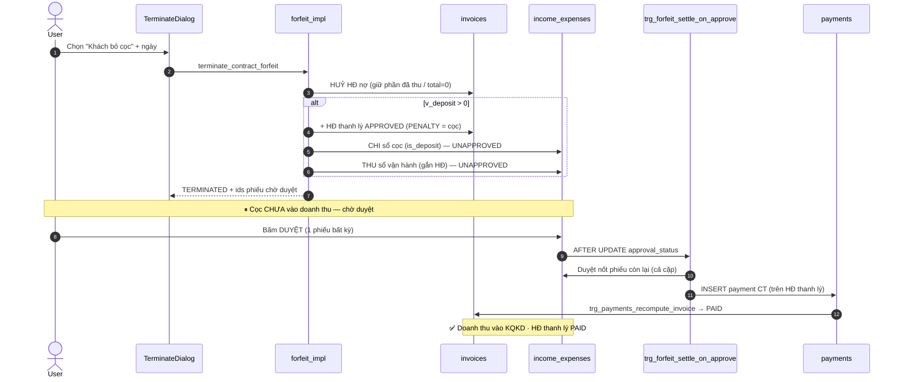
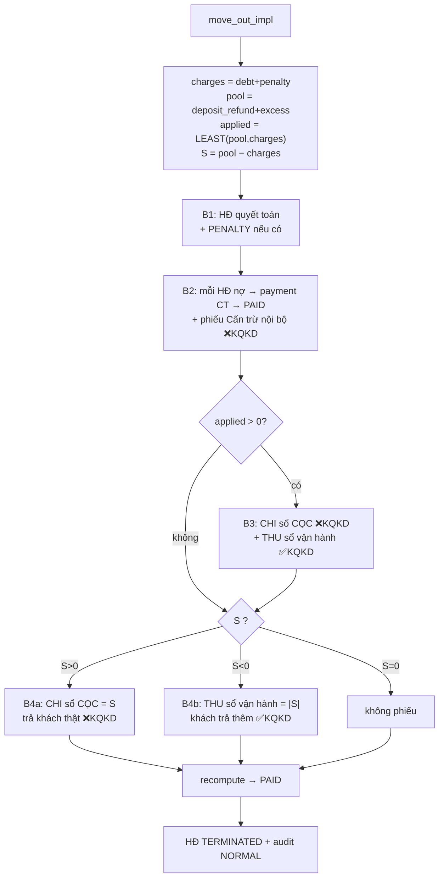

# Thanh lý hợp đồng — BỎ CỌC vs RỜI PHÒNG (deep-dive)

> Đào sâu **logic & dòng tiền** của 2 luồng thanh lý. Bổ sung cho [05 — Hợp đồng](05-hop-dong.md)
> (vốn mô tả thanh lý ở mức migration cũ `20260530000001`). Nội dung dưới dựng lại từ **định
> nghĩa hàm LIVE** trên Supabase (`pg_get_functiondef`, project `tryymsxyyckgbrmmvozx`) nên là
> hành vi **hiện hành** — không bị nhiễu bởi migrations chồng nhau (mỗi hàm là `CREATE OR
> REPLACE`, bản timestamp mới nhất thắng; team apply SQL trực tiếp qua Management API).
>
> Đã **xác minh đối kháng** (2 agent dựng lại độc lập + 1 critic refute từng claim): toàn bộ
> khẳng định chính = *confirmed*.

---

## 1. Tổng quan & vai trò nghiệp vụ

Khi một hợp đồng kết thúc trước/đúng hạn, hệ thống có **2 hình thức thanh lý** (chọn ở step 1
của dialog [TerminateDialog.tsx](../../src/components/contracts/TerminateDialog.tsx)):

| Hình thức | Khi nào | RPC | Hook |
|---|---|---|---|
| **Khách bỏ cọc** (FORFEIT) | Khách bỏ ngang, mất cọc | `terminate_contract_forfeit` | `useTerminateForfeit` |
| **Khách rời phòng** (MOVE_OUT / NORMAL) | Khách trả phòng đúng quy trình | `terminate_contract_move_out` | `useTerminateMoveOut` |

Cả 2 RPC nằm trong nhóm **4 RPC HĐ bọc wrapper kiểm quyền** ([20260601000100](../../supabase/migrations/20260601000100_sec_contract_rpc_authz_and_anon_revoke.sql)):
hàm public `<tên>` (`SECURITY DEFINER`) kiểm `auth.uid()` + `is_super_admin()` OR
`can_do_on_building('contracts','edit', building_of_room)`, rồi gọi `<tên>_impl` chứa logic gốc;
`anon` bị revoke. Sau khi RPC chạy xong, hook FE
([useContractOperations.ts](../../src/hooks/useContractOperations.ts)) gọi
`consumeRemainingCredit()` để **tiêu hết credit dư** (`excess_amounts`) của HĐ bằng 1 row âm.

Điểm khác biệt **cốt lõi**:

- **BỎ CỌC** = luồng **2 bước**: RPC tạo phiếu **chờ duyệt** (`UNAPPROVED`); phải vào sổ thu chi
  **bấm Duyệt** thì cọc mới vào doanh thu & hoá đơn thanh lý mới `PAID`. Hoá đơn nợ cũ bị **HUỶ**.
- **RỜI PHÒNG** = **1 bước**: mọi phiếu `APPROVED` ngay trong RPC. Hoá đơn nợ cũ được **tất toán
  bằng cấn trừ (CT)**, KHÔNG huỷ.

---

## 2. Khái niệm nền tảng (dùng chung)

### 2.1. Các "sổ" (accounts)

- **Sổ CỌC — `'CỌC (giữ hộ khách)'`** (`_deposit_account`): **1 sổ / owner** (key theo `user_id`,
  mọi toà dùng chung — KHÔNG phải 1 row toàn hệ thống). Giữ toàn bộ tiền cọc đang giữ hộ khách.
- **Sổ vận hành của toà** (`_termination_pick_account(user, building)`): nơi ghi **doanh thu**.
  Ưu tiên `buildings.default_account_id_tt` (TM) → `default_account_id_tk` (NH) → fallback sổ
  trùng tên toà / `is_default` / tạo sớm nhất, **né** 2 sổ kỹ thuật `'Cấn trừ thanh lý (nội bộ)'`
  và `'Làm tròn tiền thiếu'`.
- **Sổ ảo `'Cấn trừ thanh lý (nội bộ)'`** (`_termination_offset_account`): sổ kỹ thuật, số dư
  luôn = 0, chỉ truy vết bút toán cấn trừ công nợ (**chỉ dùng ở MOVE_OUT**).

### 2.2. Quy tắc "vào KQKD" (Kết quả kinh doanh / Phân bổ lợi nhuận)

Cột `income_expenses.counts_in_business_result` do trigger `ie_business_result` (+ trigger trên
`income_expense_items`) → `recompute_ie_business_result()` tính
([business_result_accounting](../../supabase/migrations/20260531000001_business_result_accounting.sql)):

```text
counts_in_business_result = COALESCE(business_result_accounting, NOT has_deposit)
has_deposit = TRUE nếu BẤT KỲ item nào của phiếu dùng income_expense_type có is_deposit = TRUE
```

→ **Phiếu chạm tiền cọc (is_deposit) → KHÔNG vào KQKD**; phiếu doanh thu (type thường) → **vào
KQKD**; ép tay được bằng cột `business_result_accounting`. Đây là cơ chế khiến **cọc luôn ở ngoài
KQKD**, chỉ phần ghi nhận **doanh thu** mới vào KQKD.

### 2.3. `payment_method = 'CT'` (Cấn trừ)

Loại thanh toán thứ 4 (ngoài `TM/TK/TT`,
[20260619000001](../../supabase/migrations/20260619000001_payment_method_cantru.sql)). Đánh dấu
hoá đơn `PAID` bằng **gạch nợ**, **KHÔNG phải tiền mặt** → không phồng ô TM dashboard. Cả 2 luồng
đều dùng `CT` để tất toán hoá đơn.

### 2.4. `_ensure_initial_deposit_voucher(contract)`

Đảm bảo cọc **thực sự nằm trên sổ** trước khi đem chuyển/hoàn:

- Nếu HĐ đã có phiếu thu cọc (`INCOME`, `APPROVED`, có item is_deposit) → trả về **đúng sổ đang
  chứa cọc** (có thể là sổ thật, không phải sổ CỌC).
- Nếu chưa (HĐ cũ) & `deposit_paid > 0` → **backfill** 1 phiếu `INCOME` `[BACKFILL_INITIAL_DEPOSIT]`
  = `deposit_paid` vào sổ CỌC (item type "Tiền cọc", is_deposit), rồi trả về sổ CỌC.

---

## 3. Luồng BỎ CỌC (FORFEIT)

Hàm: `terminate_contract_forfeit_impl(p_contract_id, p_forfeit_date)`
([impl hiện hành](../../supabase/migrations/20260618000001_forfeit_use_paid_deposit.sql) ·
[trigger duyệt](../../supabase/migrations/20260617000001_forfeit_full_settlement.sql)).

### 3.1. Các bước trong RPC

1. **Kiểm tra:** HĐ tồn tại / chưa `TERMINATED`/`EXPIRED` / có phòng / có toà.
2. **Số cọc bị bỏ** `v_deposit = LEAST(total_deposit, deposit_paid)` — chỉ giữ phần cọc **thực
   thu** (không thể giữ tiền khách chưa đưa). Đây là số tiền phí phạt.
3. **HUỶ toàn bộ hoá đơn còn nợ** (status `APPROVED/OVERDUE/PARTIAL_PAID`):
   - Đã thu 1 phần (`paid>0`): `→ CANCELLED`, **`total_amount = paid_amount`** (giữ phần đã thu
     làm doanh thu, **xoá phần nợ**). Tổng phần giữ = `v_kept_paid`.
   - Chưa thu (`paid=0`): `→ CANCELLED`, **`total_amount = 0`**.
4. **Nếu `v_deposit > 0`:**
   - Tạo **hoá đơn thanh lý mới** (`APPROVED`, 1 item `PENALTY` = `v_deposit`).
   - Tạo **cặp phiếu chuyển khoản nội bộ, đều `UNAPPROVED`**, nhãn `[CẤN CỌC BỎ CỌC <id>]`:
     - **CHI** sổ chứa cọc (`v_acc_dep`), item is_deposit → cọc rời sổ. *Ngoài KQKD.*
     - **THU** sổ vận hành (`v_acc_op`), gắn `invoice_id` = HĐ thanh lý, type thường → doanh thu
       bỏ cọc. *Vào KQKD.*
5. HĐ `→ TERMINATED`, `actual_end_date = p_forfeit_date` → trigger `trigger_update_room_status`
   giải phóng phòng.
6. Audit `contract_terminations` (`FORFEIT`, bọc `EXCEPTION WHEN OTHERS THEN NULL`).
7. Return `{ settlement_invoice_id, forfeit_amount, cancelled_invoices, kept_paid_amount,
   pending_income_voucher_id, pending_expense_voucher_id }`.

### 3.2. Bước DUYỆT (trigger `trg_forfeit_settle_on_approve`)

`AFTER UPDATE OF approval_status ON income_expenses`, chỉ xử lý phiếu nhãn `[CẤN CỌC BỎ CỌC %`:

- **`UNAPPROVED → APPROVED`:** (a) tự **duyệt nốt phiếu còn lại** cùng `contract_id` (1 cú bấm cả
  cặp); (b) phiếu **THU có invoice_id** → INSERT `payments` (`CT`, amount = total, nhãn
  `[CẤN CỌC BỎ CỌC PAYMENT <id>]`, idempotent `NOT EXISTS`). ⚠️ Trigger forfeit **KHÔNG** tự gọi
  recompute; hoá đơn thanh lý về `PAID` nhờ trigger `trg_payments_recompute_invoice` →
  `recompute_invoice_after_payment_change` chạy khi payment `CT` được insert.
- **`APPROVED → UNAPPROVED/CANCELLED` (đảo duyệt):** xoá payment `CT` + đảo phiếu còn lại (gỡ đối
  xứng).

> ⚠️ **Trước khi duyệt:** cọc còn trên sổ, doanh thu **chưa** vào KQKD, hoá đơn thanh lý
> `APPROVED` nhưng **chưa PAID**. Quên bấm Duyệt = KQKD thiếu doanh thu bỏ cọc.

### 3.3. Sơ đồ



### 3.4. Bảng phiếu (khi `deposit > 0`)

| Phiếu | type | sổ | is_deposit | approval | KQKD |
|---|---|---|---|---|---|
| Cấn cọc bỏ cọc → chuyển doanh thu | EXPENSE | sổ chứa cọc | ✔ | UNAPPROVED | ❌ ngoài |
| Doanh thu bỏ cọc (gắn HĐ thanh lý) | INCOME | sổ vận hành | ✘ | UNAPPROVED | ✅ vào |

---

## 4. Luồng RỜI PHÒNG (MOVE_OUT / NORMAL)

Hàm: `terminate_contract_move_out_impl(contract, move_out_date, deposit_refund, penalty_fee,
excess_rent, outstanding_debt, notes)`
([impl hiện hành — deposit book transfer](../../supabase/migrations/20260603000022_termination_deposit_book_transfer.sql) ·
[pick account](../../supabase/migrations/20260603000021_termination_pick_account_building_cashbook.sql) ·
[net settlement](../../supabase/migrations/20260603000020_termination_net_settlement.sql)).

Tham số do UI tính sẵn (`StepMoveOut` trong [TerminateDialog.tsx](../../src/components/contracts/TerminateDialog.tsx)):
`deposit_refund` mặc định = `total_deposit`; `excess_rent` auto-fill = credit dư; `outstanding_debt`
= Σ `(total − paid)` các HĐ chưa thanh toán.

### 4.1. Công thức quyết toán (xương sống)

```text
charges = outstanding_debt + penalty_fee     -- tổng phải trừ
pool    = deposit_refund   + excess_rent      -- tổng nguồn bù
applied = LEAST(pool, charges)                -- phần cọc/dư dùng cấn nợ + phạt → doanh thu
S       = pool − charges                       -- quyết toán ròng
```

`S > 0` chủ trả lại khách · `S < 0` khách trả thêm · `S = 0` huề.

### 4.2. Các bước trong RPC (tất cả `APPROVED` ngay)

1. **Hoá đơn quyết toán:** tìm HĐ `billing_month` = tháng move-out (ưu tiên chưa PAID). Nếu
   `penalty > 0`: tạo HĐ tháng nếu chưa có, rồi thêm item `PENALTY` "Phí phạt thanh lý".
2. **Tất toán MỌI hoá đơn còn nợ bằng CẤN TRỪ (không huỷ):** mỗi HĐ `remaining > 0` → payment
   `CT` → `PAID`, kèm 1 phiếu `INCOME` trên sổ ảo `'Cấn trừ thanh lý (nội bộ)'` với
   **`business_result_accounting = FALSE`** (ép **ngoài KQKD**), nhãn `[CẤN TRỪ]`. → chỉ là dấu
   vết, không phải doanh thu/tiền thật.
3. **`applied > 0` → chuyển khoản nội bộ cọc → doanh thu:**
   - **CHI** sổ CỌC = `applied`, is_deposit `'Cấn cọc chuyển doanh thu'` → cọc rời sổ. *Ngoài KQKD.*
   - **THU** sổ vận hành = `applied`, type thường `'Doanh thu thanh lý'`, gắn HĐ → *Vào KQKD.*
4. **Quyết toán ròng `S`:**
   - `S > 0` → **CHI** sổ CỌC = `S` (is_deposit `'Hoàn cọc thanh lý'`) = **tiền trả khách thật**. *Ngoài KQKD.*
   - `S < 0` → **THU** sổ vận hành = `|S|` (type thường `'Thu thanh lý (khách trả thêm)'`, gắn HĐ). *Vào KQKD.*
   - `S = 0` → không phiếu.
5. `recompute_invoice_for_id(settlement_invoice)` → HĐ `PAID`.
6. HĐ `→ TERMINATED`, `actual_end_date = move_out_date`.
7. Audit `contract_terminations` (`NORMAL`, `total_deductions = applied`,
   `refund_amount = GREATEST(S, 0)`; bọc EXCEPTION).
8. Return `{ settlement_invoice_id, charges, applied, net_settlement, acc_op, acc_deposit }`.

### 4.3. Sơ đồ



### 4.4. Bảng phiếu

| Phiếu | điều kiện | type | sổ | is_deposit / override | KQKD |
|---|---|---|---|---|---|
| Cấn trừ thanh lý (mỗi HĐ nợ) | remaining>0 | INCOME | Cấn trừ nội bộ (ảo) | `business_result_accounting=FALSE` | ❌ ngoài |
| Cấn cọc → chuyển doanh thu | applied>0 | EXPENSE | sổ CỌC | is_deposit ✔ | ❌ ngoài |
| Doanh thu thanh lý (gắn HĐ) | applied>0 | INCOME | sổ vận hành | type thường | ✅ vào |
| Trả khách (hoàn cọc sau khấu trừ) | S>0 | EXPENSE | sổ CỌC | is_deposit ✔ | ❌ ngoài |
| Khách trả thêm (gắn HĐ) | S<0 | INCOME | sổ vận hành | type thường | ✅ vào |

---

## 5. So sánh 2 trường hợp

| Tiêu chí | BỎ CỌC (FORFEIT) | RỜI PHÒNG (MOVE_OUT) |
|---|---|---|
| Hoá đơn nợ cũ | **HUỶ** (giữ phần đã thu, xoá phần nợ) | **Cấn trừ `CT` → PAID** (không huỷ) |
| Số cọc xử lý | `LEAST(total_deposit, deposit_paid)` (thực thu) | `deposit_refund` (UI, mặc định total_deposit) |
| Doanh thu KQKD | = cọc bị bỏ (phí phạt) | = `applied` (+ `\|S\|` nếu khách trả thêm) |
| Hoàn tiền cho khách | Không | Có, nếu `S > 0` (chi từ sổ CỌC) |
| Trạng thái phiếu | **UNAPPROVED** → phải bấm Duyệt | **APPROVED ngay** |
| HĐ thanh lý PAID | Khi duyệt (trigger insert payment `CT`) | Ngay trong RPC (recompute) |
| HĐ thanh lý mới | Luôn tạo (PENALTY=cọc) nếu cọc>0 | Dùng/ghép HĐ tháng; chỉ thêm PENALTY |
| Audit type | `FORFEIT` | `NORMAL` |

**Giống nhau:** cọc luôn đi qua sổ CỌC & **ngoài KQKD**; doanh thu vào sổ vận hành & **trong
KQKD**; tất toán bằng `payment_method='CT'`; FE tiêu hết credit dư; đóng HĐ + giải phóng phòng.

---

## 6. Edge cases · invariant · cảnh báo

- **FORFEIT `deposit=0`:** bỏ qua toàn bộ B4 — không HĐ thanh lý, không cặp phiếu; chỉ huỷ nợ + đóng HĐ.
- **MOVE_OUT `applied=0`:** bỏ qua B3 (không doanh thu từ cọc). **`S=0`:** bỏ qua B4. **`penalty=0`
  & không có HĐ tháng:** `v_settle_inv = NULL` → phiếu doanh thu tạo với `invoice_id NULL` (không
  gắn HĐ) & recompute bị bỏ qua — khe hở truy vết nhỏ.
- **MOVE_OUT tất toán nợ trên MỌI HĐ còn nợ** (không chỉ tháng move-out).
- **Không double-count doanh thu:** phiếu "Cấn trừ nội bộ" tuy là INCOME nhưng bị ép
  `business_result_accounting=FALSE`; doanh thu thật chỉ ở phiếu "Doanh thu thanh lý".
- **Invariant sổ CỌC net 0** chỉ đúng khi cọc nằm đúng sổ CỌC. Nếu cọc gốc ghi vào 1 **sổ tiền
  mặt thật**, các phiếu CHI cọc rút từ sổ thật đó → sổ thật có thể âm.
- ⚠️ **Audit best-effort:** `INSERT contract_terminations` bọc `EXCEPTION WHEN OTHERS THEN NULL`
  ở **cả 2** luồng + UNIQUE 1 biên bản/HĐ → nếu HĐ đã có bản ghi (vd `PENDING_APPROVAL` mồ côi)
  thì audit lần thanh lý thật **bị mất im lặng**. (Xem [05 §2.7](05-hop-dong.md) và
  [13 — Báo cáo](13-bao-cao-dashboard-thong-bao.md).)
- ⚠️ `_termination_pick_account` có thể trả `NULL` nếu user không có sổ phù hợp; flag `is_deposit`
  của type bị ép runtime (không snapshot) → nếu sau này đổi `is_deposit` của type, phiếu lịch sử
  có thể bị phân loại lại khi recompute.

---

## 7. Liên kết sang domain khác

- **[04 — Cọc giữ chỗ](04-coc-giu-cho.md):** nguồn cọc (`deposit_paid`), `excess_amounts` (credit).
- **[05 — Hợp đồng](05-hop-dong.md):** vòng đời HĐ, bảng `contract_terminations`, RPC wrapper kiểm quyền.
- **[07 — Hoá đơn & Thu tiền](07-hoa-don-thanh-toan.md):** `invoices/invoice_items/payments`,
  `recompute_invoice_for_id`, `payment_method='CT'`.
- **[08 — Thu chi & Sổ quỹ](08-thu-chi-so-quy.md):** `income_expenses`, sổ CỌC / sổ vận hành / sổ
  ảo, `business_result_accounting`, KQKD.
- **[12 — Cổ đông · Lợi nhuận](12-co-dong-loi-nhuan.md):** doanh thu thanh lý vào KQKD → ảnh hưởng
  phân bổ lợi nhuận.
