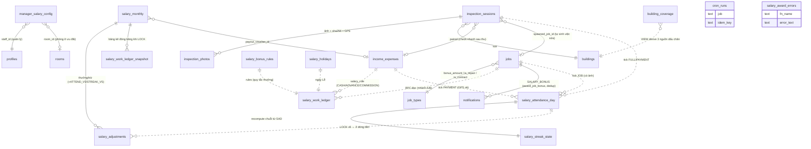
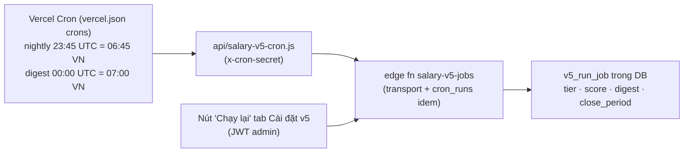

# Bảng lương & Thưởng (Salary · Bonus · V5 "dấu chân")

> **Reviewed:** 2026-07-20. Các forward-fix `20260720120000`–`20260720190000` là một phần của hành vi hiện hành.

## 1. Tổng quan & vai trò nghiệp vụ

Domain này trả lời câu hỏi **"nhân viên quản lý vận hành được trả bao nhiêu, vì sao, và bằng chứng ở đâu"**. Điểm cốt lõi của thiết kế: **lương tính từ dữ liệu vận hành thật** (việc đã hoàn thành, hợp đồng đã ký, phiếu thu đã ghi, phiên kiểm tra nhà đã đạt) chứ không nhập tay — nhập tay chỉ còn ở các dòng thưởng/trừ thủ công có nhãn rõ ràng.

Trong domain tồn tại **3 lớp chạy song song** trên production:

| | **Bảng lương quản lý** (v3, 2026-06-27) | **Thưởng tức thời** (award popup) | **SALARY V5 "dấu chân"** (2026-07-02, S1–S5 đã APPLY live) |
|---|---|---|---|
| Trả lời | Lương THÁNG của quản lý = bao nhiêu | Vừa hoàn thành việc → được thưởng gì NGAY | Hôm nay có NGÀY-CÔNG chưa? Chuỗi mấy ngày? Toà nào bị bỏ rơi? |
| Nguồn sự thật | RPC `salary_work_ledger` (SECURITY DEFINER) + tổng hợp ở TS | RPC `award_job_bonus` (mirror đúng quy tắc ledger) | Bảng `salary_attendance_day` (SAD) + `salary_streak_state` (SSS), ghi **chỉ qua RPC SECDEF** |
| Tiền vào lương | Chốt tháng (LOCK) → `salary_monthly` + snapshot | Không tự cộng tiền — chỉ **thông báo** (tiền đã nằm trong ledger) | Chốt qua `v5_apply_lock_adjustments` → 2 dòng `salary_adjustments` (`ATTEND_V5`/`STREAK_V5`) — **chỉ khi kill-switch `v5_money` BẬT** |
| UI chính | `/finance/salary` (admin) + `/finance/my-salary` (self) | Popup [BonusToast](src/components/tasks/BonusToast.tsx) + Web Push | `/my-day` (nhân viên) + `/reports/coverage` (chủ) |

> **Trạng thái vận hành:** schema + RPC + cron + UI V5 đã deploy. Không suy trạng thái live từ seed cũ `stage='off'`/flags OFF trong implementation log; phải đọc `system_v5.stage`, `feature_flags` và `effective_from` tại thời điểm xử lý. V5 chỉ thay công thức tháng từ mốc `effective_from`, các tháng trước đó tiếp tục dùng cơ chế legacy tương ứng.

> **V5.1 — hiệu lực 01/09/2026** (spec `docs/superpowers/specs/2026-08-26-v5-khien-3-lop-phep-tich-luy-moc-2tr5-design.md`, migration [20260826120000](supabase/migrations/20260826120000_v5_1_khien_3_lop_phep_nam_moc_2tr5.sql) + [20260826123000](supabase/migrations/20260826123000_v5_1_my_day_phep_nam.sql) + [20260826150000](supabase/migrations/20260826150000_v5_1_thang_2tr5_ap_ca_t7_t8.sql)). Tháng < `system_v5.shield_bank_from` (2026-09-01) chạy nhánh **legacy giữ CƠ CHẾ khiên/phép cũ** (`v5_recompute_streak_legacy`: free 3, dự trữ cap 2/tiêu 1, quota phép theo tháng) **nhưng THANG TIỀN 2.5tr đỉnh động áp cho MỌI kỳ kể cả 7–8/2026** (chủ quyết 26/08 đợt 2 — mốc trọn-tháng và trần 3tr bị thay hồi tố, tháng 7 của người đủ N_chuẩn từ 9tr về 8.5tr); từ kỳ 09/2026:
> 1. **Khiên 3 lớp, tiêu theo thứ tự, không trần tiêu tháng**: ① free **1**/tháng (reset) → ② **tháng-hoàn-hảo** (+1 khi tháng đi đủ 100% ngày làm việc, KHÔNG nghỉ ngày nào kể cả phép; kho cap **3**, carry) → ③ **điểm Chủ nhật** (+**0.5**/CN có tick, không giới hạn, vĩnh viễn; 1 ngày lỡ = 1.0). Kho ②③ **suy ra thuần túy từ SAD** kể từ `shield_bank_from` qua `v5_shield_bank` (idempotent, không có biến bị trừ tay); khiên dự trữ cũ quy đổi 1:1 vào seed `salary_shield_seed`.
> 2. **Phép tích lũy theo năm**: +1 ngày/tháng (rate = `paid_leave_days_per_month`), dồn trong năm dương lịch tối đa 12, **reset 01/01**; số dư = `LEAST(12, số-tháng-đã-trôi × rate) − đã dùng trong năm` (áp cho ngày xin ≥ 01/09/2026 trong `request_paid_leave` + `get_my_day_summary`).
> 3. **Pool streak 2.500.000, bỏ mốc trọn-tháng**: mốc `[4,8,13,18,23,'n_top']`, deltas `[300k,400k,500k,500k,400k,400k]`; sentinel **`n_top` = đỉnh ĐỘNG tại N_chuẩn** từng người từng tháng (trùng mốc số thì merge; mốc > N_chuẩn cắt, delta dồn vào đỉnh). Ai lỡ 1 ngày (dù khiên che, chuỗi không đứt) có chuỗi tối đa N_chuẩn−1 → hụt đúng mốc đỉnh — thay vai "trọn-tháng" bằng số học chuỗi thuần túy; `breaks_no_leave` giờ chỉ còn dùng thống kê. Trần v5 = 6tr + 2.5tr = **8.5tr**.

> **V5.2 — hiệu lực NGAY, áp mọi kỳ chạy v5** (chủ quyết 27/08/2026, chỉ FE — không migration). **Nhánh v5 KHÔNG thay thưởng việc nữa; hai nguồn tiền chạy song song**: chuyên cần (→ cột *Lương tháng*) là tiền đi làm đều, còn thưởng việc / CN-Lễ / ký HĐ theo rule cũ **cộng THÊM** vào cột *Thưởng* bên cạnh thưởng chuỗi. Trước đó [useManagerSalary.ts](src/hooks/useManagerSalary.ts) gán đè `bonusAuto = [chuỗi]`, vứt sạch `buildBonusAuto(ledger)` → kỳ 7/2026 mất **1.820.000đ** tiền việc khỏi bảng lương trong khi tab *Bảng kê công việc* vẫn hiện đủ từng dòng kèm số tiền (bảng kê hứa tiền, bảng lương không trả). Hệ quả cần nhớ:
> - **Trần 8,5tr giờ là trần của HAI QUỸ chuyên cần + chuỗi, KHÔNG phải trần tổng lương.** `v5_month_money` tự kẹp hai quỹ đó; `v5_lock_assert` cũng chỉ assert hai quỹ nên không đổi.
> - **`income_goal` hiển thị giữ nguyên 8.500.000** — thưởng việc là phần *vượt* mục tiêu, giữ được mốc so sánh giữa hai người trong bảng xếp hạng hiệu suất.
> - Gộp dòng qua `mergeV5Bonus` (chuỗi đứng đầu); tách `contract_bonus` khi LOCK qua `contractBonusOf` (icon `FileClock`) — thưởng chuỗi mang icon `Flame` nên rơi vào `work_bonus` như cũ.
> - Đường cộng/trừ thưởng tay (`salary_adjustments` → `adjSum`) **không đổi**, vẫn cộng/trừ được sau khi bật thưởng việc.
> - Ch.3 của `docs/bang-luong/V5-HE-THONG-LUONG-THUONG-THONG-NHAT.md` ("việc chỉ tick ngày công, không sinh tiền riêng") **đã bị chủ đảo** ở phần tiền; phần coverage/SLA giữ nguyên.

**Phân biệt quan trọng:** "Bảng lương quản lý" (bảng `manager_salary_config`, cột `income_expenses.salary_staff_id`) **khác hoàn toàn** với **"Lương điều hành"** (bảng `profit_managers`, cột `income_expenses.profit_manager_id`) — lương điều hành là khoản trừ khỏi lợi nhuận từng toà **trước khi chia cổ đông**, thuộc domain [12 — Cổ đông · Chia lợi nhuận](12-co-dong-loi-nhuan.md) (xem mục 4.7).

**Tài liệu thiết kế chi tiết** của cơ chế lương-thưởng (bàn tròn 6 vai, v1→v5) nằm ở `docs/bang-luong/` — hiện hành là `V5-HE-THONG-LUONG-THUONG-THONG-NHAT.md` (13 chương) + `V5-PLAN-THUC-HIEN.md` (6 epics S0–S5), kèm `V5-IMPLEMENTATION-LOG.md` và `V5-RUNBOOK.md` (vận hành/rollback — scripts `scripts/v5_rollback_s1..s4.sql`). **Doc 17 này là tài liệu HỆ THỐNG: mô tả cái đang chạy thật trong code/DB**; phần nào mới chỉ là thiết kế sẽ được ghi chú rõ (mục 4.13).

---

## 2. Cấu trúc dữ liệu

### 2.1. Lõi bảng lương tháng (v3 — migration [20260628000001](supabase/migrations/20260628000001_manager_salary_module.sql))

#### `manager_salary_config` — ai hưởng lương (effective-dated)
- `user_id` (owner) / `staff_id` (quản lý = auth user). Tập dòng `is_active` = danh sách quản lý hưởng lương.
- `base_salary`, `default_room_rent`, `income_goal`, `role_title`, `alias` (biệt danh — dùng khớp phiếu HH Sale theo `payer_name`).
- `room_id` ([20260628000002](supabase/migrations/20260628000002_salary_config_room.sql)) — phòng nhân viên ở giá ưu đãi: nếu set, "Tiền phòng" = **hoá đơn phòng đó theo tháng** (fallback `default_room_rent` khi tháng chưa có HĐ).
- `effective_from`/`effective_to` — cấu hình theo hiệu lực, tháng cũ vẫn tính đúng.

#### `salary_bonus_rules` — 1 dòng/owner, cột `rules` (jsonb) là "két cấu hình" nhiều đời
- Key v3: `repair`, `weekendRepair` (mặc định 20k), `afterHourContract` (50k), `afterHourMark` ('18:00'), `weekendDays` ([0]=CN), `requirePhoto`.
- Key `staffMonths` ([20260629000003](supabase/migrations/20260629000003_salary_staff_visible_months.sql)) — override hiện/ẩn từng tháng cho self-view (mục 4.6).
- 4 block V5 (seed ở [20260703000001](supabase/migrations/20260703000001_v5_foundation.sql)): `attendance_v5` (budget **6.000.000**, phép có lương 1 ngày/tháng, sàn mềm 13 ngày → 3tr), `streak_v5` (budget **3.000.000**, mốc 4/8/13/18/23/trọn-tháng, khiên free 3 + dự trữ cap 2), `coverage_v5` (SLA 4 ngày/3 ngày toà nóng, chuẩn ảnh/dwell theo cỡ toà), `system_v5` (feature flags/kill-switch, stage, lịch cron, `effective_from`, `pending_money_patch`, audit). Từ [20260720160000](supabase/migrations/20260720160000_ledger_excluded_and_v5_effective_from.sql), tháng trước `effective_from` không bị áp ngược V5.

#### `salary_holidays` — lịch ngày lễ của owner
`holiday_date` UNIQUE theo user. Đầu vào cho nhánh thưởng CN/Lễ (v3) **và** calendar ngày-làm V5 (`vn_workdays`). Quản lý ở tab Cấu hình (có nút thêm nhanh bộ lễ VN).

#### `salary_monthly` — chốt lương theo (quản lý × tháng), UNIQUE `(staff_id, period_month)`
- `status` `DRAFT`/`LOCKED`; các cột đóng băng khi chốt: `base_salary`, `work_bonus` (việc + CN/Lễ), `contract_bonus` (ký HĐ ngoài giờ), `commission_total` (HH Sale), `investment_profit` (LN đầu tư của quản lý-là-cổ-đông), `adjustments_total` (thưởng/trừ tay, có dấu), `advances_total` (ứng), `room_rent`, `gross_total`, `take_home`, `paid`, `payout_voucher_id`, `locked_at/by`.

#### `salary_adjustments` — dòng thưởng/trừ gắn `salary_monthly_id`
`kind` `BONUS`/`DEDUCTION`, `amount ≥ 0`, `source` ∈ {`MANUAL`,`ADVANCE_IE`,`ROOM_RENT`,`KPI`,`ATTEND_V5`,`STREAK_V5`} (2 giá trị cuối thêm ở V5 — là **cửa DUY NHẤT tiền v5 đi vào lương**).

#### `salary_work_ledger_snapshot` — đóng băng bảng kê khi chốt
Copy nguyên các dòng RPC `salary_work_ledger` tại thời điểm LOCK (bất biến lịch sử — đổi quy tắc/loại việc sau này không làm lệch tháng cũ). Có thêm cột `is_contract` ([20260630000002](supabase/migrations/20260630000002_ledger_drop_contract_branch.sql)).

#### Cột "mượn" trên bảng domain khác
- `job_types.bonus_amount` / `is_repair` / `counts_for_salary` (+ `is_contract`) — cấu hình thưởng **theo loại việc**. Việc `checkin` được khôi phục cờ ký hợp đồng +50k từ [20260720120000](supabase/migrations/20260720120000_fix_checkin_contract_bonus.sql).
- `jobs.exclude_from_salary` — chủ có thể loại **một việc cụ thể** khỏi thưởng mà không đổi loại việc hay xoá lịch sử; dòng vẫn hiện trong bảng kê với thưởng 0đ ([20260720140000](supabase/migrations/20260720140000_jobs_exclude_from_salary.sql)).
- `jobs.completion_time` do server đóng dấu khi chuyển sang `COMPLETED`; `completion_captured_at` chỉ là mốc client để đối chiếu watermark, không dùng tính lương. Helper `job_photo_ok` đọc cả `attachments` và `completion_attachments` ([20260720181000](supabase/migrations/20260720181000_jobs_completion_time_integrity.sql)).
- `income_expenses.salary_staff_id` + `salary_role` (`ADVANCE` ứng lương / `CASH_COLLECTION` thu tiền mặt — hiển thị minh bạch, không thưởng / `COMMISSION`) — gắn phiếu thu chi cho một quản lý hưởng lương.
- `notifications.job_id` + `metadata` (jsonb) + giá trị enum `SALARY_BONUS` ([20260629000010](supabase/migrations/20260629000010_notification_type_salary_bonus.sql), [20260629000011](supabase/migrations/20260629000011_award_job_bonus.sql)) — lưu + **dedup** thông báo thưởng (2 partial unique index: 1 thưởng JOB/job, 1 phụ cấp DAY_BONUS/ngày).

### 2.2. V5 "dấu chân" ([20260703000001](supabase/migrations/20260703000001_v5_foundation.sql) → [20260703000005](supabase/migrations/20260703000005_v5_money_lock.sql))

Nguyên tắc C9 của thiết kế: **các bảng V5 chỉ chứa STATE + BẰNG CHỨNG, không có cột tiền** — tiền luôn derive từ state × config, và chỉ vật chất hoá khi LOCK.

#### `inspection_sessions` — phiên kiểm tra nhà FULL/QUICK
- `type` `FULL`/`QUICK`; `status` ∈ {`open`,`passed`,`quick_done`,`presence`,`expired`,`cancelled`} — **không có `failed`**: rớt gate chuẩn = `presence` (vẫn tính "dấu chân" reset SLA toà, nhưng KHÔNG tick ngày-công), resume được tới 23:59.
- `session_date` (ngày VN), `dwell_seconds` (cộng dồn các phiên cùng ngày cùng toà), `checklist` (jsonb server-sinh: tủ điện, PCCC, hành lang tầng chỉ định, nước, +1 mục sâu random theo seed ngày+toà, phòng trống nếu có), `condition_note` ("Tình trạng nhà"), `photos_count`, `device_issue`, `paired_income_expense_id` (check-nhanh sau thu tiền), `spawned_job_id` (job sửa tự sinh khi "Có vấn đề"), `fail_reasons`.

#### `inspection_photos` — ảnh bằng chứng từng mục checklist
`slot`, `storage_path` (bucket `job-attachments`), **`sha256_hash`** (UNIQUE theo phiên + đối chiếu trùng theo NGÀY của user — chống nộp lại/chụp hộ), `exif_time`, `lat/lng/distance_m/geofence_status` (audit-only, bán kính đọc từ config geofence nghiệm thu — 1 nguồn sự thật).

#### `salary_attendance_day` (SAD) — xương sống ngày-công, UNIQUE `(user_id, work_date)`
- `status` 9 giá trị: `pending`, `pending_check` (nợ check-nhà-sau-thu-tiền), `pending_leave`, `ticked` (CÓ ngày-công — binary), `leave_approved` (**phép = ngày TRUNG TÍNH**, loại khỏi N_chuẩn, bắc cầu chuỗi), `neutral`, `expired`, `flagged` (nghi án), `voided` (kết án huỷ công).
- `tick_source` ∈ {`JOB`,`FULL`,`PAYMENT`,`MANUAL_DEVICE_ISSUE`}; `evidence` (jsonb append-only), `audit` (jsonb — xương sống kháng nghị), `voided_reason`.
- **Ghi CHỈ qua RPC SECURITY DEFINER** — không policy INSERT/UPDATE nào cho client.

#### `salary_streak_state` (SSS) — trạng thái chuỗi theo (user × tháng)
`current_streak`, `best_streak`, `milestones_banked` (jsonb — **mốc đã đạt là BANKED 🔒 không rơi**), `breaks_no_leave` (đứt KHÔNG-phép — trọn-tháng đòi = 0), `shields_free_left` (3/tháng), `shields_reserve`/`_used` (khiên dự trữ carry-over, cap tồn 2/tiêu 1), `sim_cap2` (mô phỏng nới cap — không hiện cho staff), `reset_from_date` (mốc "tính lại từ ngày kế" sau án gian lận). Recompute được 100% từ SAD + config.

#### `cron_runs` — heartbeat + idempotency cho jobs
`(job, idem_key)` UNIQUE — job `tier`/`score`/`digest`/`close_period`, idem theo ngày/tháng VN → chạy đôi tự skip. Bảng này là nguồn kiểm tra heartbeat; worker watchdog cũ đã bị gỡ, fallback live là nút chạy lại của admin.

#### `salary_award_errors` — KHÔNG nuốt lỗi im lặng
Mọi RPC ghi tiền/tick đều log lỗi vào đây trước khi RAISE — truy vết "làm xong sao không thấy công". Chỉ admin đọc.

#### Cột mượn V5
- `income_expenses.collect_lat/lng/distance_m/geofence_status` — GPS lúc bấm Thu tiền (ghi nền im lặng, **không bao giờ chặn phiếu**).
- `buildings.cluster_id` — cụm đường cho gợi ý đi tuyến.

#### VIEW `building_coverage` — "đồng hồ D" per toà
Derive từ **3 nguồn dấu chân**: (1) job COMPLETED có ảnh (chấp nhận cả `attachments` lẫn `completion_attachments` — ảnh hoàn thành từng được merge vào `attachments`, xem [11 — Công việc](11-cong-viec-su-co.md)); (2) `inspection_sessions` đạt `passed`/`quick_done`/`presence`; (3) phiếu thu có `collect_geofence_status='ok'`. Trả `days_since_touch`, `days_since_full`, phòng trống, việc 30 ngày.

### 2.3. Lương điều hành (tham chiếu — chi tiết ở doc [12](12-co-dong-loi-nhuan.md))
[20260629000020](supabase/migrations/20260629000020_profit_manager_salary.sql): `profit_managers` (gắn `auth_user_id` để tự xem), `profit_manager_salaries` (quy tắc `FIXED`/`PERCENT` × `PER_BUILDING`/`TOTAL_GROUP`), `profit_manager_salary_buildings`, `profit_monthly.management_salary` (snapshot), `profit_manager_allocations`, `income_expenses.profit_manager_id`, helper `current_profit_manager_id()`.

---

## 3. Sơ đồ quan hệ dữ liệu



(`salary_work_ledger` là **RPC** chứ không phải bảng — vẽ nét đứt; `cron_runs`/`salary_award_errors` đứng độc lập.)

---

## 4. Quy tắc nghiệp vụ & tự động hoá

### 4.1. `salary_work_ledger(p_period_month, p_staff_id)` — nguồn sự thật quy tắc thưởng v3

RPC **SECURITY DEFINER** (đọc xuyên RLS jobs/contracts/income_expenses), bảo mật ở tầng hàm: **người không phải admin bị ép `v_staff := auth.uid()`** — chỉ xem của chính mình. Trả bảng kê từng dòng, gồm các nhánh:

- **(A) JOB** — việc `COMPLETED` của loại việc tính lương, quy về ngày/giờ VN bằng `completion_time` do server đóng dấu. `bonus_amount` = 0 nếu thiếu ảnh khi `requirePhoto` bật, việc có `exclude_from_salary=true`, hoặc việc ký HĐ hoàn thành trong giờ hành chính ngày thường. Ledger trả thêm cờ `excluded` để UI hiện nút **Không tính / Tính lại**.
- **(B) DAY_BONUS** — phụ cấp `weekendRepair` (+20k) cho **mỗi NGÀY** CN/Lễ có ≥1 việc sửa chữa **hoặc** ký HĐ (mở rộng ở [20260630000001](supabase/migrations/20260630000001_bonus_rules_contract_combo.sql)).
- **(D) CASH** — phiếu thu tiền mặt `salary_role='CASH_COLLECTION'`: hiển thị minh bạch trong bảng kê, **không thưởng**.
- **(C) CONTRACT đã GỠ** ([20260630000002](supabase/migrations/20260630000002_ledger_drop_contract_branch.sql), commit `0fcdd47`): +50k ký HĐ **không còn đọc bảng `contracts`** — chỉ đến từ **VIỆC loại "checkin"** (`job_types.is_contract`) qua nhánh (A)+(B), tránh thưởng trùng. Dòng `CONTRACT` chỉ còn xuất hiện từ snapshot cũ (legacy).

Hai bản vá lịch sử quan trọng:
- **Owner-scope fix** ([20260629000004](supabase/migrations/20260629000004_salary_ledger_owner_scope_fix.sql)): bản đầu lọc `j.user_id = v_owner` làm **rớt toàn bộ việc do staff tự tạo** (jobs mang `user_id` = người tạo). Scope tenant đúng là theo **assignee** (assignee = mình, hoặc thuộc danh sách quản lý hưởng lương của owner) — đã bỏ predicate thừa.
- Quy tắc đọc từ `salary_bonus_rules` của owner (super_admin đầu tiên) — hệ hiện là single-tenant về lương.

Hardening 20/07:
- Không còn fallback `completion_time → created_at` cho việc đã hoàn thành; sai dữ liệu phải lỗi rõ.
- Nhân viên không tự chọn mốc thời gian tính thưởng; admin chỉ được lùi ngày khi kỳ tương ứng chưa LOCKED.
- `v5_tick_attendance` chặn ngày tương lai và tháng đã chốt; phiên kiểm tra qua nửa đêm có grace 4 giờ nhưng tick về `session_date` lúc bắt đầu ([20260720190000](supabase/migrations/20260720190000_v5_date_hardening.sql)).

### 4.2. Tổng hợp lương ở TS — [useManagerSalary](src/hooks/useManagerSalary.ts) + [managerSalary.ts](src/lib/managerSalary.ts)

RPC chỉ trả **dòng bằng chứng**; công thức tổng nằm ở lớp TS thuần (test: [managerSalary.test.ts](src/lib/__tests__/managerSalary.test.ts)):

```text
autoSum  = Σ bonusAuto (3 nhóm: việc-theo-loại · CN/Lễ · ký HĐ ngoài giờ)
bonus    = autoSum + adjSum (thưởng/trừ tay, có dấu)
gross    = base_salary + bonus + investment (LN đầu tư) + commission (HH Sale)
takehome = gross − advance (ứng) − roomRent (tiền phòng)
```

Các nguồn ghép trong 1 query tổng:
- **Đầu tư**: quản lý đồng thời là cổ đông (`shareholders.auth_user_id`) → cộng `profit_allocations` của các `profit_monthly` **đã LOCKED** trong tháng; đang có tháng DRAFT → hiện trạng thái "chờ chốt".
- **HH Sale**: phiếu CHI hoa hồng (loại có category "HOA HỒNG"/tên khớp `hhmg`) có `payer_name` khớp **alias/tên gọi** của quản lý, kỳ phân bổ (`income_expense_items.start_date`) trong tháng. Tháng nháp chỉ tính phiếu **CHƯA DUYỆT** (chốt lương sẽ tự duyệt = đã thanh toán); phiếu đã duyệt sẵn → cờ cảnh báo "!" cần kiểm tra.
- **Ứng lương**: phiếu `salary_role='ADVANCE'` đã APPROVED trong tháng.
- **Tiền phòng theo tháng T+1**: lương tháng T trả vào tháng kế → khấu trừ hoá đơn phòng ở của `billing_month` = **tháng T+1** (ưu tiên hoá đơn thật của `room_id`; fallback `default_room_rent`).
- Tháng đã LOCKED: toàn bộ số đọc từ `salary_monthly` + `salary_work_ledger_snapshot` (đóng băng), không tính lại.

### 4.3. Chốt tháng (LOCK) & mở khoá — [useLockSalaryMonth / useUnlockSalaryMonth](src/hooks/useManagerSalary.ts)

Chốt (quyền `salary.lock`): (1) tự DUYỆT các phiếu HH Sale còn nháp đang tính vào lương; (2) upsert `salary_monthly` `LOCKED` với đầy đủ số đóng băng (tách `work_bonus` vs `contract_bonus` theo icon nhóm thưởng); (3) xoá + ghi lại `salary_work_ledger_snapshot` từ ledger hiện hành. Mở khoá (quyền `salary.unlock`): xoá snapshot + trả `DRAFT`. **Invariant:** tháng LOCKED không bao giờ đọc RPC live.

### 4.4. Trả lương + tự gạch nợ tiền phòng (cấn trừ vào lương — commit `9a06751`)

[useSalaryPayout](src/hooks/useManagerSalary.ts) (quyền `salary.distribute`) ghi **phiếu CHI "Lương quản lý"** (toà ảo Chung, `business_result_accounting=false`, gắn `salary_staff_id`). Nếu quản lý có `roomRentInvoice` (hoá đơn phòng ở T+1 còn nợ):
1. Phiếu chi **tách 2 dòng**: "Tiền thực nhận" + "Tiền phòng (khấu trừ)" → tổng phiếu chi = gross phần trả.
2. Tự tạo **1 payment `CT`** (cấn trừ — xem [08 — Thu chi](08-thu-chi-so-quy.md)) đánh dấu hoá đơn ĐÃ THU + **1 phiếu THU** "Thu tiền phòng (khấu trừ lương …)" vào **CÙNG sổ quỹ** (user_id = chủ hoá đơn cho khớp RLS).
3. Kết quả: sổ quỹ net = đúng tiền thực nhận; hoá đơn phòng nhân viên tự gạch nợ; `salary_monthly.paid` chỉ cộng phần **thực nhận**.

Số thu chốt theo `remaining_amount` đọc lại tại thời điểm trả (chống trả trùng).

### 4.5. Thưởng tức thời — `award_job_bonus` + BonusToast + Web Push

Khi bấm Hoàn thành việc, [TaskCompleteDialog](src/components/tasks/TaskCompleteDialog.tsx) gọi fire-and-forget [awardAndNotifyJobBonus](src/lib/salaryBonusNotify.ts):
- RPC `award_job_bonus(p_job_id)` (SECDEF, [20260629000011](supabase/migrations/20260629000011_award_job_bonus.sql) → bản hiện hành [20260630000005](supabase/migrations/20260630000005_award_job_bonus_time_context.sql)) **mirror đúng nhánh (A) JOB + (B) DAY_BONUS** của ledger, người nhận = `assignee_id` = chính mình (owner làm hộ → rỗng). INSERT `notifications` type `SALARY_BONUS` (dedup bằng 2 partial unique index — chống race/re-complete), trả **chỉ các dòng MỚI** kèm `icon` (🔧 sửa chữa / 📝 ký HĐ / 🔥 phụ cấp) + `time_context`.
- FE gộp các dòng của 1 lần hoàn thành thành **một popup**: ≥2 khoản = thẻ **COMBO** vàng/lửa (commit `2188695`); 1 khoản chọn **skin theo ngữ cảnh** `time_context` (`AFTER_HOURS`→đêm indigo, `SUNDAY`→huân chương, `HOLIDAY`→thẻ "trân trọng" đỏ với lời cảm ơn là điểm nhấn — `af86d81`, `b3c637c`; ưu tiên HOLIDAY > SUNDAY > AFTER_HOURS). Kèm **1 Web Push tới chính mình** qua edge fn `send-push` (xem [13 — Thông báo](13-bao-cao-dashboard-thong-bao.md)).
- **+50K ký HĐ = job loại "checkin"** (`is_contract`): chỉ thưởng khi hoàn thành sau 18:00 hoặc CN/Lễ — popup và ledger dùng chung điều kiện, không lệch nhau.

### 4.6. Tháng hiển thị cho nhân viên (self-view lùi-tháng)

Mặc định **"lùi 1 tháng cho tới khi chốt"**: nhân viên thấy tháng TRƯỚC cho tới khi tháng trước LOCKED, rồi mới nhảy sang tháng hiện tại ([autoStaffYm/latestVisibleStaffYm](src/lib/managerSalary.ts)). Admin ghi đè từng tháng qua `rules->staffMonths`; staff không đọc được `salary_bonus_rules` nên overrides expose qua RPC SECDEF `salary_staff_months()` (chỉ trả map bool, không lộ số tiền). Hook: [useStaffDisplayMonth](src/hooks/useManagerSalary.ts).

### 4.7. Lương điều hành trừ TRƯỚC khi chia cổ đông (commit `653172f`)

Khoản trả cho người quản lý điều hành được trừ khỏi LN từng toà trước khi nhân % cổ đông: `distributable = adjusted_profit − management_salary`. Quy tắc `FIXED`/`PERCENT` × `PER_BUILDING`/`TOTAL_GROUP` tính bằng hàm thuần [managementSalary.ts](src/lib/managementSalary.ts) (chia largest-remainder không lệch làm tròn), snapshot khi chốt LN vào `profit_monthly.management_salary` + `profit_manager_allocations`; phiếu chi trả gắn `income_expenses.profit_manager_id` (không tính KQKD). UI trong Profit Hub ([ProfitManagerForm](src/components/shareholders/ProfitManagerForm.tsx), [ManagerSalaryPayoutDialog](src/components/shareholders/ManagerSalaryPayoutDialog.tsx), self-view [ProfitManagerSelfView](src/components/shareholders/ProfitManagerSelfView.tsx)) — **chi tiết thuộc doc [12](12-co-dong-loi-nhuan.md)**.

### 4.8. V5 — vòng ngày-công: tick, dấu chân, chuỗi, phép

**Hàm lõi `v5_tick_attendance(user, date, source, ref)`** ([20260703000002](supabase/migrations/20260703000002_v5_engine.sql)) — MỌI nguồn tick đi qua đây: advisory lock theo (user, ngày), idempotent theo UNIQUE, binary tuyệt đối (ngày đã `ticked` chỉ append evidence, không double); tự gỡ thông báo treo `pending_check` của ngày; recompute chuỗi; trả `n_chuẩn`/`day_rate`/`tạm tính`. **Client không gọi trực tiếp** (GRANT chỉ `service_role`) — chỉ các RPC dưới gọi nội bộ:

| Nguồn tick | Đường đi |
|---|---|
| `JOB` | Hoàn thành việc có ảnh → FE gọi `v5_tick_from_job(job_id)` (fire-and-forget trong [TaskCompleteDialog](src/components/tasks/TaskCompleteDialog.tsx)); verify job COMPLETED + assignee = mình + có ảnh (`attachments` hoặc `completion_attachments`). |
| `FULL` | Phiên kiểm tra nhà FULL **pass gate** trong `complete_inspection` (xem dưới). |
| `PAYMENT` | Thu tiền tại chỗ GPS khớp toà: `record_payment_gps` tick ngay nếu toà đã check hôm nay; chưa check → SAD `pending_check` + thông báo treo (dedup 1/toà/ngày); sau đó phiên **QUICK pass** tại đúng toà sẽ chốt tick nguồn PAYMENT. Ngày đã ticked → chỉ gợi ý piggyback, không sinh treo. |
| `MANUAL_DEVICE_ISSUE` | Nhân viên `report_device_issue` trong phiên → chủ `approve_device_issue` → tick tay có audit. |

**Kiểm tra nhà (inspections)** — nguồn dấu chân trung tâm, chạy bằng 4 RPC: `start_inspection` (mở/**RESUME** phiên cùng ngày cùng toà, nâng cấp QUICK→FULL; wrapper `start_quick_check`), `submit_inspection_photo` (idempotent theo hash; **ảnh trùng sha256 trong ngày bị từ chối**; geofence audit từng ảnh; cập nhật checklist done + dwell), `complete_inspection` (chấm gate **tại toà**: FULL = đủ mục required + đủ ảnh + đủ dwell theo cỡ toà + ≥1 ảnh trong bán kính; QUICK = 2 ảnh PCCC/tủ điện + geofence; **fail = `presence`** kèm danh sách thiếu "còn X nữa là đủ công" — gain-framing; "Tình trạng nhà" ≠ OK → **tự sinh job sửa** `spawned_job_id` nối sang domain [11](11-cong-viec-su-co.md)), `v5_expire_stale` (đóng phiên/SAD quá hạn). FE: [InspectionRunner](src/components/inspections/InspectionRunner.tsx) tái dùng **nguyên pipeline camera** JobCaptureCamera (camera-only + watermark + GPS) của geo-fence nghiệm thu, upload bucket `job-attachments`, sha256 tính client ([useMyDay](src/hooks/useMyDay.ts)).

**Chuỗi (streak) — `v5_recompute_streak`**: walk từng ngày của tháng từ SAD; CN/Lễ/phép (kể cả `pending_leave`) = **bắc cầu**. Từ kỳ 09/2026 (V5.1): ngày-làm quá khứ bị lỡ → tiêu khiên free (1) → kho tháng-hoàn-hảo → điểm CN (1.0/ngày) → **đứt**; tháng < 09/2026 đi nhánh `v5_recompute_streak_legacy` (cơ chế khiên cũ: free 3 → dự trữ cap tiêu 1 → đứt) **nhưng cùng thang mốc 2.5tr đỉnh động `n_top`** (26/08 đợt 2 — không còn mốc trọn-tháng ở bất kỳ kỳ nào). Mốc đạt theo `best_streak` được **bank** (không rơi khi đứt sau đó); tháng ngắn: mốc vượt N_chuẩn bị cắt, delta dồn vào đỉnh động — `public_v5_effective_milestones`, mirror TS ở [v5Calendar.ts](src/lib/v5Calendar.ts) — sửa 1 bên phải sửa bên kia + chạy `scripts/v5-calendar-parity.mjs`.

**Phép 1-chạm** ([20260703000004](supabase/migrations/20260703000004_v5_myday.sql)): `request_paid_leave` (V5.1: ngày xin ≥ 01/09/2026 dùng **số dư năm** `LEAST(12, tháng × rate) − đã dùng trong năm`; trước đó quota theo tháng; chỉ hôm nay/ngày tới, chặn CN, idempotent, báo chủ) → `approve_leave` (chủ duyệt → `leave_approved` = **ngày trung tính**: `v5_n_chuan(tháng, user) = COUNT(T2–T7 − lễ) − số-phép-duyệt` → đơn giá ngày `budget/N_chuẩn` **tự tăng**, nhân viên không thiệt).

### 4.9. V5 — tiền, LOCK, nghi án/kết án ([20260703000005](supabase/migrations/20260703000005_v5_money_lock.sql))

- **`v5_month_money(user, month)`** (đọc-only): `attend = round(budget/N_chuẩn) × min(ticked, N_chuẩn)`, áp **sàn mềm** (≥13 ngày → tối thiểu 3tr, config) và **trần budget 6tr**; `streak = Σ delta các mốc banked`, trần 3tr. `get_salary_progress_v5` = money + lưới ngày cho self-view.
- **3 ASSERT trước chốt — `v5_lock_assert(month)`** (bảng đối soát cho chủ): (1) không vượt trần 2 quỹ; (2) **không còn nghi án mở**; (3) 100% tick nguồn PAYMENT join ngược được phiếu thu thật có GPS ok (kể cả qua phiên check-nhanh paired).
- **`v5_apply_lock_adjustments(month)`** — cửa tiền DUY NHẤT: chặn nếu `feature_flags.v5_money` OFF (shadow **cấm ghi tiền**); chặn nếu bất kỳ ai rớt ASSERT; idempotent (xoá dòng `ATTEND_V5`/`STREAK_V5` cũ của kỳ rồi ghi lại) → 2 dòng BONUS vào `salary_adjustments` của `salary_monthly` (tự tạo DRAFT nếu chưa có) → từ đó chảy vào công thức lương v3 như một adjustment bình thường.
- **Kỷ luật có due-process (C2)**: chủ `v5_flag_day` (chỉ chủ; nhân viên nhận thông báo + 48h phản hồi) → nhân viên `v5_appeal` → chủ `v5_verdict`: xác nhận gian lận = `voided` + **tước toàn bộ mốc banked tháng** (ngoại lệ duy nhất của banked) + `reset_from_date = ngày kế` (chuỗi tính lại, các ngày làm thật khác giữ nguyên); minh oan = trả `ticked`.
- **`v5_shadow_report(month)`** — bảng "nếu áp v5 thì ra bao nhiêu" để chủ so trước khi bật tiền.

### 4.10. V5 — cron và fallback thủ công: **KHÔNG pg_cron** ([20260703000003](supabase/migrations/20260703000003_v5_jobs.sql))

Logic job đặt **trong DB** (`v5_run_job`); transport hiện có Vercel Cron và nút chạy lại của admin:



- **`nightly`** = `tier` (dọn phiên/SAD quá hạn qua `v5_expire_stale`) + `score` (làm nóng `v5_daily_missions` — tuyến gợi ý per staff: `score = D×(1+P/20) + 10·phòng-trống + 5·HĐ-đáo-hạn + 15·việc-mở`, màu red/yellow/green theo ngưỡng remind) + **`close_period`** nếu là ngày 1 VN (vật chất hoá `pending_money_patch`; bank mốc trọn-tháng khi `breaks_no_leave=0`; mở SSS tháng mới: khiên free reset, khiên dự trữ carry + earn).
- **`digest`** = 1 bản tin gộp/người/ngày "Tuyến hôm nay: N toà nên ghé" (chỉ toà red/yellow, tối đa 3 dòng; **tắt CN + ngày phép**; dedup unique index) → edge fn gửi Web Push qua `send-push`.
- `v5_cron_start/finish` trên `cron_runs` (UNIQUE `job+idem_key`) làm job idempotent. **Job không sinh tiền** — cron lỗi không tự ghi sai lương; admin có thể chạy lại từ UI. Auth edge fn: `x-cron-secret`, service role hoặc JWT admin.

### 4.11. V5 — config & kill-switch

- `get_salary_v5_config()` — 1 nguồn đọc config hiệu-lực (merge 4 block + áp pending 💰 nếu tới tháng hiệu lực).
- `set_salary_v5_config(p_patch)` — **chỉ chủ**; block `attendance_v5`/`streak_v5` là **key 💰: gói vào `pending_money_patch`, hiệu lực ĐẦU THÁNG KẾ** (không đổi luật giữa tháng); `coverage_v5`/`system_v5` áp NGAY (kill-switch phải tức thời); validate bất biến (Σ deltas = streak budget, phép 0–4); audit tối đa 50 entry + `config_version` tăng.
- `system_v5.effective_from` — mốc tháng đầu tiên được dùng công thức V5. Đây là guard chống áp ngược V5 cho kỳ cũ không có dữ liệu dấu chân.
- **Kill-switch** nằm ở tab "Cài đặt v5" của [OwnerDashboardV5](src/pages/reports/OwnerDashboardV5.tsx) (`/reports/coverage`): switch `v5_money` (TẮT = lương giữ nguyên cơ chế cũ — đây là kill-switch tiền), `v5_coverage`, và nút chọn `stage` ∈ off → grace → shadow_coverage → shadow_money → live. Nút chốt tiền ở tab Đối soát bị disable khi `v5_money` OFF hoặc còn ai rớt ASSERT.

### 4.12. RLS & phân quyền

- **Catalog quyền** ([permissionPages.ts](src/lib/permissionPages.ts)) — module `salary` (nhóm Tài chính): `view` / `lock` / `unlock` / `distribute` (trả lương) / `manage_salary` (cấu hình) / `export`; các quyền elevated fallback về edit/create của module. "Admin bảng lương" trên FE = superadmin hoặc có lock/manage_salary/distribute.
- Bảng v3: owner/admin full; **quản lý SELECT được dòng CỦA MÌNH** (`msc_self_select`, `sm_self_select`, `sa_self_select` qua salary_monthly, `sws_self_select`) — nền cho self-view realtime. Riêng `salary_bonus_rules`/`salary_holidays` owner-only (staff đọc phần cần thiết qua RPC SECDEF). Policy `income_expenses_select_salary_staff` cho quản lý thấy phiếu HH/ứng gắn mình.
- Bảng V5: `inspection_sessions` staff CRUD phiên của mình; `inspection_photos` **không có policy INSERT** (ghi qua RPC); **SAD/SSS chỉ SELECT self/admin — mọi ghi qua RPC SECDEF**; `cron_runs`/`salary_award_errors` admin-only. Toàn bộ RPC ghi V5 theo chuẩn: SECURITY DEFINER + `search_path` + advisory lock + idempotent + log `salary_award_errors` (cùng bài học class-bug generator ở [01](01-phan-quyen-nhan-su.md)/doc nội bộ).
- Route: `/reports/coverage` bọc `AdminOnlyRoute`; `/my-day` + `/finance/my-salary` mọi user đăng nhập ([App.tsx](src/App.tsx)).

### 4.13. ⚠️ Ranh giới ĐÃ CODE vs THIẾT KẾ (V5)

Con số "chuyên cần 6tr + streak 3tr banked" xuất phát từ thiết kế `docs/bang-luong/V5-*.md` và đã được code + seed làm config mặc định; engine/verdict/LOCK/cron/màn hình đều live. Trạng thái `stage`, `v5_money` và `effective_from` là cấu hình runtime, không phải hằng số của tài liệu. Những gì **chưa** phải hành vi production đầy đủ:
- Job `tier` hiện **chỉ dọn phiên/SAD quá hạn** — chưa gửi "nhắc 3 nấc 19:00 per toà" như thiết kế Ch. coverage (mới có digest gộp 07:00; config `remind`/`remind_hot` đang dùng để tô màu missions).
- `sim_cap2`, `building_overrides`, `quiet_hours`, `grace_days`… đã có chỗ trong config nhưng phần tiêu thụ mới ở mức tối thiểu.
- Các cơ chế thuần thiết kế chưa có code: ma trận dấu chân đầy đủ theo chương SLA/điểm coverage (red 25/yellow 15/green 5), popup piggyback route đầy đủ (server mới trả `piggyback_prompt`, FE chưa dựng UI riêng).

---

## 5. Quy trình theo từng trang (page)

### 5.1. `/finance/salary` — Bảng lương quản lý ([ManagerSalaryPage](src/pages/finance/ManagerSalaryPage.tsx))

**Vai admin** (desktop): 3 tab — **Bảng lương tháng** ([SalaryMonthly](src/components/salary/SalaryMonthly.tsx): card từng quản lý với breakdown lương cứng/thưởng tự động/HH/đầu tư/ứng/tiền phòng, adjustment, trả lương, chốt/mở khoá), **Bảng kê công việc** ([SalaryLedger](src/components/salary/SalaryLedger.tsx): từng dòng bằng chứng, lọc theo người/toà, cờ ảnh và nút **Không tính / Tính lại** cho từng JOB), **Cấu hình** ([SalaryConfig](src/components/salary/SalaryConfig.tsx): người hưởng lương, quy tắc, ngày lễ, tháng hiển thị). Có thanh "Xem dưới vai trò" để preview self-view.

**Mobile** (nhánh `usePhoneViewport`): shell web-app trọn màn [SalaryAdminMobile](src/components/salary/SalaryAdminMobile.tsx) — 4 tab đáy (Lương / Cá nhân / Bảng kê / Cấu hình), thao tác chốt/trả/adjustment đầy đủ.

**Vai nhân viên** (không phải admin): trang tự rơi về self-view — desktop [SalarySelf](src/components/salary/SalarySelf.tsx) trong MainLayout, phone [SalarySelfMobile](src/components/salary/SalarySelfMobile.tsx) (theme QUEST tối, gaming — tạo động lực); tháng hiển thị theo chính sách lùi-tháng (mục 4.6). Chưa được cấu hình hưởng lương → thông điệp hướng dẫn.

### 5.2. `/finance/my-salary` — "Lương của tôi" trọn màn ([MySalaryPage](src/pages/finance/MySalaryPage.tsx), commit `8300610`)

Sidebar mục "Bảng lương" với **nhân viên** mở trang này ở **TAB MỚI** (`selfHref` trong [Sidebar](src/components/layout/Sidebar.tsx)); admin vẫn vào `/finance/salary` in-app. Desktop = [SalarySelfDesktop](src/components/salary/SalarySelfDesktop.tsx) (QUEST full-screen, tự dựng chrome, điều hướng lùi lịch sử tháng nhưng **chặn vượt mốc được phép xem**); phone = SalarySelfMobile. Dữ liệu dùng chung `useManagerSalary` — số nhân viên thấy luôn = số admin thấy.

### 5.3. `/my-day` — "Ngày hôm nay của tôi" ([MyDayPage](src/pages/my-day/MyDayPage.tsx), V5 S3)

Màn trung tâm vòng lặp V5 phía nhân viên, mobile-first (desktop bó 480px), tile "Hôm nay ☀️" trên Home launcher. **Gain-framing tuyệt đối**: không màu đỏ, không chữ "mất/trừ", mọi số tiền là "TẠM TÍNH". Dữ liệu 1 round-trip `get_my_day_summary()` + `v5_daily_missions_self()` ([useMyDay](src/hooks/useMyDay.ts)):
1. **Khối A** — trạng thái ngày: đã tick (nguồn gì, +day_rate, chuỗi 🔥) / nghỉ phép / chưa có → gợi ý kiểm tra toà điểm cao nhất.
2. **Khối D** — nhắc treo "check nhà sau khi thu tiền" per toà → mở phiên QUICK 3–5 phút.
3. **Khối B** — "Hôm nay nên ghé": tối đa 3 toà red/yellow kèm lý-do-bằng-chữ.
4. **Khối C** — việc đang mở của tôi (link `/tasks`).
5. **Khối F** — 2 thanh tiến trình: chuyên cần `ticked/N_chuẩn` + tiền tạm tính/budget; chuỗi hiện mốc kế, khiên `free+reserve`, chip mốc 🔒 banked.
6. **Xin phép 1-chạm** (hiện quota còn lại) + **onboarding "Tôi đã hiểu"** bắt buộc từ chặng `shadow_money` (lưu `ui_preferences.v5_onboarding_ack`).
Phiên kiểm tra chạy trong dialog [InspectionRunner](src/components/inspections/InspectionRunner.tsx) (mục 4.8). Copy động viên tập trung ở [v5Copy.ts](src/lib/v5Copy.ts).

### 5.4. `/reports/coverage` — dashboard chủ V5 ([OwnerDashboardV5](src/pages/reports/OwnerDashboardV5.tsx), S4+S5, AdminOnly)

5 tab: **Coverage** (grid toà tô màu theo D chạm/FULL, phòng trống, việc 30d — từ VIEW `building_coverage`); **Nghi án** (SAD `flagged` + evidence/audit, 2 nút kết án — `v5_verdict`); **Đối soát tháng** (bảng `v5_lock_assert` 3 ASSERT + nút **"Ghi tiền v5 vào bảng lương"** = `v5_apply_lock_adjustments`, disable khi shadow); **Shadow/Gates** (`v5_shadow_report` — "nếu áp v5"); **Cài đặt v5** (kill-switch `v5_money`/`v5_coverage`, chọn stage, nút chạy lại job thủ công + nhật ký `cron_runs`).

### 5.5. Điểm chạm rải ở trang khác

- **Hoàn thành việc** ([TaskCompleteDialog](src/components/tasks/TaskCompleteDialog.tsx)): client gửi ảnh + `completion_captured_at` để đối chiếu; trigger server tự đóng dấu `completion_time` dùng tính lương. Sau khi lưu, UI gọi thưởng nóng và tick V5; lỗi server được ghi audit.
- **Thu tiền `/thu-tien`** ([useQuickCollect](src/hooks/useQuickCollect.ts) → [captureGpsAndRecord](src/lib/v5PaymentGps.ts)): sau khi phiếu thu lưu OK, bắn GPS **nền im lặng** qua `record_payment_gps` với `voucherIds` do [useBulkRecordPayment](src/hooks/useBulkRecordPayment.ts) trả — **không bao giờ chặn luồng thu**; server quyết tick / treo check-nhanh / piggyback, FE chỉ toast nhẹ.
- **Loại công việc** ([TaskTypeFormDialog](src/components/task-types/TaskTypeFormDialog.tsx)): khu cấu hình lương-thưởng của loại việc — `bonus_amount`, `is_repair`, `is_contract` (checkin), `counts_for_salary`.
- **Form thu chi**: người nhận là quản lý hưởng lương được đánh dấu `salary_staff_id` (dấu `*`) + `salary_role` — phiếu ứng/HH tự chảy vào bảng lương khi duyệt.

---

## 6. Liên kết sang domain khác (vào / ra)

**Đi RA (domain này đọc/ghi domain khác):**
- → **Công việc ([11](11-cong-viec-su-co.md))**: `jobs` + `job_types` là nguồn nhánh (A)/(B) của ledger, nguồn tick `JOB`, và nơi phiên kiểm tra "Có vấn đề" **tự sinh job sửa** (`spawned_job_id`); job "checkin" là vật mang thưởng ký HĐ. Pipeline camera + geofence nghiệm thu được **tái dùng nguyên vẹn** cho inspections.
- → **Thu chi & Sổ quỹ ([08](08-thu-chi-so-quy.md))**: phiếu chi "Lương quản lý"/"Ứng lương quản lý" (seed hạng mục, không tính KQKD), phiếu thu gạch nợ tiền phòng + payment `CT`, phiếu HH Sale/thu tiền mặt gắn `salary_staff_id`; GPS thu tiền ghi lên chính `income_expenses`.
- → **Hoá đơn ([07](07-hoa-don-thanh-toan.md))**: tiền phòng khấu trừ đọc hoá đơn phòng ở `billing_month` T+1; trả lương đánh dấu hoá đơn ĐÃ THU qua payment.
- → **Cổ đông/LN ([12](12-co-dong-loi-nhuan.md))**: cột "Đầu tư" của bảng lương đọc `profit_allocations` đã LOCKED; ngược lại module LN trừ **lương điều hành** trước khi chia (mục 4.7).
- → **Thông báo ([13](13-bao-cao-dashboard-thong-bao.md))**: `SALARY_BONUS`, thông báo treo `pending_check`, digest tuyến, phép/nghi án/kết án — đều qua `notifications` + Web Push `send-push`.
- → **Cơ cấu BĐS ([02](02-co-cau-toa-nha-phong-dich-vu.md))**: `buildings.latitude/longitude` (geofence), `cluster_id`, phòng trống trong checklist/score.

**Đi VÀO (domain khác phụ thuộc domain này):**
- ← **Phân quyền ([01](01-phan-quyen-nhan-su.md))**: module `salary` trong catalog trang; scope V5 (missions/digest/close_period) chạy theo `staff_assignments` có `building_id`.
- ← **Trang chủ/launcher**: tile "Hôm nay" (`/my-day`) nhóm Vận hành, gắn cờ hot.
- ← **API cron** (`api/salary-v5-cron.js`): chuyển Vercel Cron sang edge function; worker Zalo không phải dependency của V5.

**Lưu ý ranh giới:** đừng nhầm 3 chữ "lương": (1) **Bảng lương quản lý** (doc này) — trả công vận hành từ việc thật; (2) **Lương điều hành** — khấu trừ tầng phân bổ LN (doc 12); (3) **HH Sale** — phiếu chi hoa hồng của domain thu chi được *đối chiếu vào* bảng lương chứ không sinh ra ở đây. Tương tự, `salary_work_ledger` là RPC (không có bảng cùng tên), còn "bảng kê đóng băng" mới là bảng thật (`salary_work_ledger_snapshot`).
