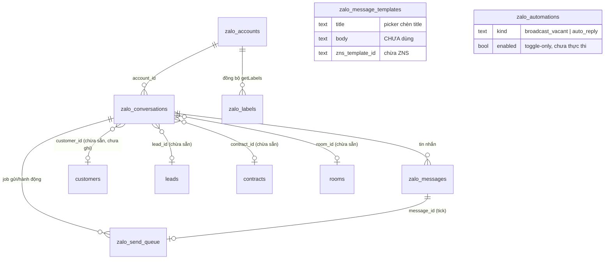
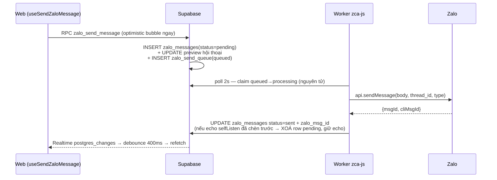
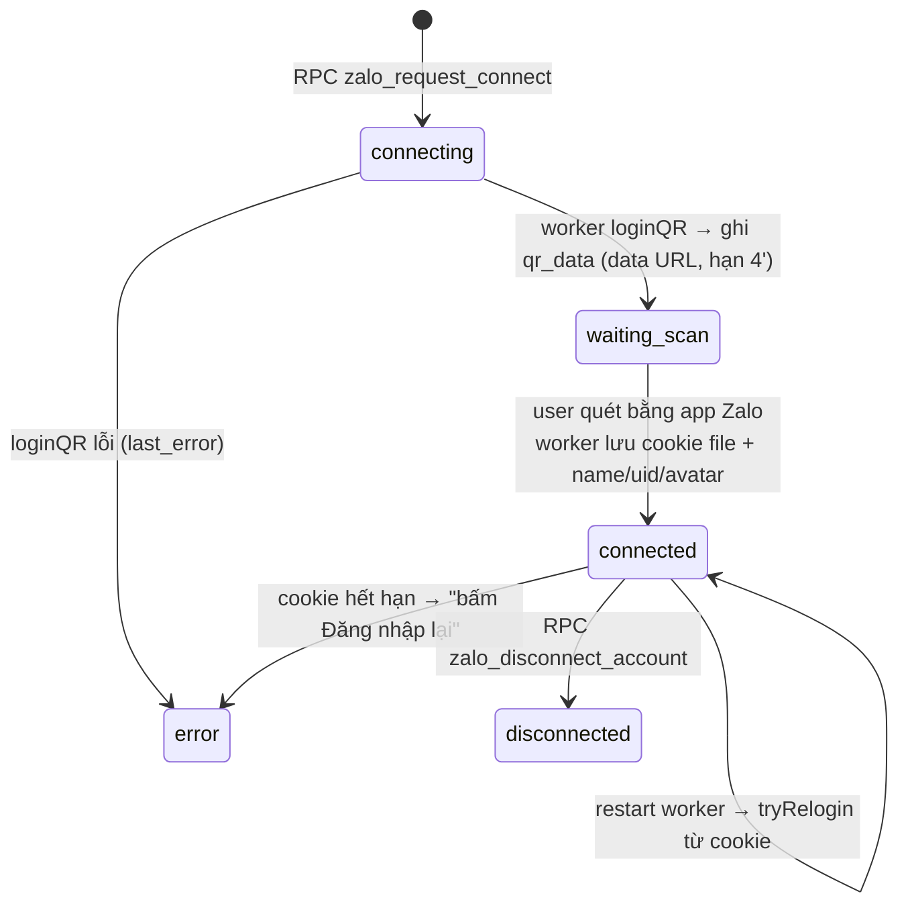

# Chat Zalo (Zalo Chat)

> **Reviewed:** 2026-08-13 — đợt nâng cấp lớn "khu Zalo riêng theo công ty":
> ORG-SCOPED toàn tuyến (migration 20260813100000..130000), gửi media/voice/sticker
> từ web, reply quote thật, gắn hội thoại ↔ CRM theo SĐT, pin/mute/đánh dấu chưa
> đọc, tìm trong hội thoại, soạn tin theo SĐT, CRUD mẫu tin; worker mã hoá phiên
> AES-256-GCM + lease đơn-instance + watchdog/proactive re-login. Các đoạn dưới
> đây mô tả mô hình MỚI; chỗ nào còn tả mô hình owner-scoped cũ đã được sửa.

## 1. Tổng quan & vai trò nghiệp vụ

Domain này đưa kênh **Zalo cá nhân** vào CRM: nhắn tin 2 chiều với khách trọ / lead / môi giới ngay trong web (route `/chat-zalo`), gửi hàng loạt theo nhãn phân loại, và nhận Web Push khi có tin mới. Trong vòng đời tổng của CRM, Chat Zalo nằm ở khâu **giao tiếp khách hàng** — trước hợp đồng (tư vấn lead) lẫn sau hợp đồng (chăm sóc khách trọ, nhắc nợ) — nhưng hiện **chưa nối dữ liệu** với các domain khách hàng/HĐ (xem mục 6).

Nguyên tắc kiến trúc cốt lõi (khác mọi domain khác trong hệ thống):

- **Web KHÔNG bao giờ gọi Zalo trực tiếp.** Frontend (React trên Vercel) chỉ nói chuyện với Supabase: đọc bảng `zalo_*`, gọi RPC, nhận Supabase Realtime.
- Kết nối Zalo thật do **một worker Node riêng** ([worker/index.js](worker/index.js), ~574 dòng, nằm trong repo nhưng **KHÔNG deploy lên Vercel** — chạy local/VPS bằng pm2) đảm nhiệm qua thư viện **zca-js** (API Zalo cá nhân *không chính thức* — rủi ro khoá nick, dùng tài khoản phụ). Worker dùng **service-role key** (bypass RLS): đọc hàng đợi `zalo_send_queue` để gửi đi, nghe WebSocket Zalo để ghi tin đến vào `zalo_messages` → Realtime tự đẩy sang trình duyệt.
- **Media (ảnh/video) KHÔNG lưu trong hệ thống** — chỉ lưu **URL CDN của Zalo** trong `zalo_messages.media_url`; FE render trực tiếp từ CDN Zalo. Vì vậy chuyển media sang R2 là vô nghĩa với module này (đã kiểm chứng trong sự cố egress 26/06 — mục 4.7).

```
┌──────────────┐   RPC zalo_send_message /…   ┌────────────────────┐
│  Web (React) │ ───────────────────────────► │ Supabase (Postgres)│
│  trên Vercel │ ◄────── Realtime ─────────── │  bảng zalo_*       │
└──────────────┘                              └─────────┬──────────┘
                                                        │ service_role
                                     poll queue 2s / ghi inbound
                                             ┌──────────▼─────────────┐   WS/HTTPS   ┌──────┐
                                             │ Worker zca-js (Node)   │ ◄──────────► │ Zalo │
                                             │ local → VPS, pm2       │              └──────┘
                                             │ giữ phiên QR + cookie  │
                                             └────────────────────────┘
```

> **Trạng thái thực tế của codebase (2026-07-02):** phần **đang chạy thật** gồm: kết nối đa tài khoản qua QR, đồng bộ danh bạ + nhóm (~1.470 bạn + ~354 nhóm), nhận tin realtime (kể cả ảnh/video/reaction/thu hồi/seen), gửi text + reply, thả reaction / thu hồi / tải thêm tin cũ (nhóm) từ web, nhãn phân loại + broadcast theo nhãn, Web Push tin mới. Phần **chưa chạy** (UI có sẵn hoặc schema chừa sẵn): gửi ảnh/file/sticker từ web, 2 luồng tự động hoá (toggle chỉ lưu DB — worker **không có** logic thực thi), gắn hội thoại với customer/lead/contract (cột FK có, không gì ghi), OA/ZNS. Chi tiết mục 7.

---

## 2. Cấu trúc dữ liệu

Toàn bộ schema tạo trong 8 migration cùng ngày [20260626000001…08](supabase/migrations/20260626000001_zalo_chat_schema.sql). Tất cả bảng có trigger `*_set_user_id_audit` (gán `user_id = auth.uid()` khi NULL) + `set_*_updated_at`; `REVOKE ALL FROM anon`.

### 2.1. `zalo_accounts` — tài khoản Zalo kết nối

Mục đích: mỗi dòng = 1 nick Zalo cá nhân (hoặc OA — để sau) mà worker giữ phiên.

Cột chủ chốt:
- `kind` (CHECK ∈ {`personal`,`oa`}) — vòng này chỉ dùng `personal`; `oa` chừa sẵn.
- `name`, `zalo_uid`, `avatar_url` — worker cập nhật sau khi đăng nhập (`fetchAccountInfo`/`getOwnId`).
- `status` (CHECK ∈ {`connected`,`disconnected`,`error`,`connecting`,`waiting_scan`}) — máy trạng thái của luồng đăng nhập QR (mục 4.3). 2 giá trị sau thêm ở [20260626000003](supabase/migrations/20260626000003_zalo_account_connect.sql).
- `qr_data` (data-URL ảnh QR do worker ghi), `qr_expires_at`, `last_error`, `login_requested_at` — phục vụ dialog kết nối.
- `meta` (jsonb) — lưu `userAgent` cố định per nick (cô lập "thiết bị" đa nick — mỗi account 1 UA thật chọn theo hash id, commit 1cedb3e). **Cookie phiên KHÔNG lưu DB** — worker giữ ở file `worker/sessions/<account_id>.json`.

### 2.2. `zalo_conversations` — hội thoại (1 thread / account+peer)

- `account_id` (FK `zalo_accounts`), `thread_id` (id thread phía Zalo), `thread_type` (`user`/`group`) — **UNIQUE (account_id, thread_id)** là khoá tìm/khởi tạo hội thoại của worker.
- `peer_name`, `peer_avatar_url`, `peer_phone`, `peer_zalo_uid`, `initials`, `tone` — hiển thị danh sách.
- `kind` (CHECK ∈ {`tenant`,`lead`,`broker`,`unknown`}) + FK chừa sẵn `customer_id→customers`, `lead_id→leads`, `contract_id→contracts`, `room_id→rooms`, `assigned_staff_id→auth.users` — **thiết kế để gắn hội thoại vào hồ sơ CRM, hiện KHÔNG có code nào ghi** (worker luôn tạo `kind='unknown'`), nên panel Khách trọ/Lead/Môi giới và bộ lọc tương ứng chưa có dữ liệu thật.
- `label_ids` (jsonb mảng int, thêm ở [20260626000007](supabase/migrations/20260626000007_zalo_labels.sql)) — nhãn "Phân loại" Zalo gắn vào hội thoại.
- Preview: `last_message_text/_at/_dir`, `unread_count`, `is_online`, `is_pinned`/`is_muted` (2 cờ sau chưa UI nào dùng).
- `profile` (jsonb) — snapshot cho panel thông tin (`{kind, isGroup, members, desc, …}`); worker ghi `isGroup/members/desc` khi sync nhóm.
- `sub_label`, `sub_tone`, `list_tag`, `header_tag`, `header_sub` (jsonb `{l,t}`) — badge trang trí theo design, hiện chủ yếu rỗng với dữ liệu thật.

### 2.3. `zalo_messages` — tin nhắn

- `conversation_id` (FK, CASCADE), `account_id`, `direction` (`in`/`out`), `msg_type` (CHECK ∈ {`text`,`image`,`file`,`sticker`,`sys`,`video`} — `video` thêm ở [20260626000006](supabase/migrations/20260626000006_zalo_video_msgtype.sql)).
- `body` — text hoặc nhãn thay thế (`[Hình ảnh]`, `[Sticker]`, `[Vị trí]`… — worker map từ `msgType` zca).
- `media_url` — **URL CDN Zalo** (ảnh: `href/thumb/normalUrl`; video: `href`); `media_meta` (jsonb — video có `{thumb, duration}`); `media_label`, `media_tone`.
- `reply_to` (jsonb `{name,text}`), `reaction_emoji` (1 emoji hiển thị nhanh), `reactions` (jsonb, chưa dùng).
- `status` (CHECK ∈ {`pending`,`sent`,`delivered`,`seen`,`failed`}) — tick ✓ trên bong bóng; `seen` do worker set khi đối phương đọc.
- `zalo_msg_id`, `cli_msg_id` — id phía Zalo, cần cho reaction/thu hồi. **UNIQUE (account_id, zalo_msg_id)** ([20260626000004](supabase/migrations/20260626000004_zalo_message_dedup.sql)) — chống trùng khi Zalo đẩy lại tin cũ (`old_messages`) và khi echo `selfListen` đụng tin web vừa gửi; NULL vẫn cho nhiều dòng (tin pending chưa có id).
- Index: `(conversation_id, created_at)`.

### 2.4. `zalo_send_queue` — hàng đợi lệnh cho worker

Mọi thao tác từ web đi Zalo đều thành 1 job ở đây (worker poll 2s):
- `message_id` (FK `zalo_messages` — job gửi tin trỏ về dòng tin để cập nhật tick), `conversation_id`, `account_id`.
- `channel` (CHECK ∈ {`personal`,`oa`}) — vòng này chỉ `personal`.
- `payload` (jsonb): job gửi = `{type, body, media_url, reply_to}`; job hành động = `{action: 'react'|'recall'|'load_history', …}` kèm `target_msg_id/thread_id/thread_type` ([20260626000005](supabase/migrations/20260626000005_zalo_chat_actions.sql)).
- `status` (`queued` → `processing` → `sent`/`failed`), `attempts`, `last_error`, `processed_at`.

### 2.5. `zalo_labels` — nhãn "Phân loại" của Zalo

`label_id` (int — id phía Zalo, UNIQUE theo `account_id`), `name`, `color`, `emoji`, `sort_order`. Worker đồng bộ từ `api.getLabels()` mỗi lần kết nối (mục 4.5).

### 2.6. `zalo_message_templates` — thư viện mẫu tin

`title`, `body`, `category`, `color`, `zns_template_id` (chừa cho ZNS), `variables`, `is_active`, `sort_order`. **Chưa có UI CRUD** — FE chỉ đọc `title/color` để chèn vào ô soạn ([useZaloTemplates](src/hooks/useZaloChat.ts)); lưu ý gotcha: picker chèn **`title`** làm nội dung tin, cột `body` chưa được dùng.

### 2.7. `zalo_automations` — công tắc tự động hoá

`kind` (CHECK ∈ {`broadcast_vacant`,`auto_reply`}, UNIQUE theo user), `enabled`, `config`, `stats` (jsonb). **Chỉ là công tắc lưu DB** — worker không đọc bảng này, chưa có logic gửi ảnh phòng trống / tự trả lời nào chạy.

### 2.8. RLS & Realtime — ORG-SCOPED (đổi 2026-08-13)

- **RLS** ([20260813100000](supabase/migrations/20260813100000_zalo_khu_rieng_theo_cong_ty.sql)) — mô hình **theo TỔ CHỨC**, thay owner-scoped cũ:
  - `organization_id` **NOT NULL** trên cả 7 bảng; trigger `app_private.autofill_org_zalo()` FAIL-CLOSED điền org theo thứ tự account → hội thoại cha → client khai (kiểm membership) → membership duy nhất → NỔ. Khai org khác org của account = 42501.
  - Policy PERMISSIVE: SELECT = `organization_id IN zalo_authorized_org_ids('view')`; WRITE = `('send')` (templates = `manage_templates`, automations = `manage_automation`). Đồng nghiệp CÙNG công ty giờ thấy chung khu chat; công ty khác tuyệt đối không.
  - RESTRICTIVE `<bảng>_org_boundary` giữ làm lớp 2 — nhánh thoát `organization_id IS NULL` đã ĐÓNG.
  - `is_admin()` đã gỡ khỏi zalo (nó ≡ `is_super_admin` từ 20260710150000; nhúng lại là mìn hẹn giờ).
- Helper `public.zalo_authorized_org_ids(action)` = `my_org_ids() ⨯ authorized_scope_v3('chat_zalo.'||action)` lọc org_wide — **RBAC v3**; `zalo_can(action, org)` bọc nó cho RPC. Bản `zalo_can` cũ đọc `staff_assignments` (nguồn đã chết từ cutover 25/07) đã bị thay — quyền giờ cấp qua màn phân quyền v3 là CÓ tác dụng.
  - ⚠ Helper đặt ở **public** có chủ đích: `authenticated` không có USAGE trên schema `app_private` (đo pg_namespace 13/08) — policy gọi thẳng `app_private.*` từ RLS sẽ chết khi user thường query.
- **Realtime publication**: 4 bảng như cũ; FE subscribe kèm filter `organization_id=eq.<org hiện hành>` để user đa-org không refetch chéo.

---

## 3. Sơ đồ quan hệ & kiến trúc



Luồng gửi 1 tin nhắn (outbound):



---

## 4. Quy tắc nghiệp vụ & tự động hoá

### 4.1. Bộ RPC (tất cả SECURITY DEFINER + `search_path=public`, revoke anon)

| RPC | Việc | Guard |
|---|---|---|
| `zalo_send_message(conv, type, body, media_url, reply_to, cli_msg_id)` | INSERT tin `pending` + cập nhật preview + enqueue | chủ hội thoại HOẶC `zalo_can('send')` |
| `zalo_mark_read(conv)` | `unread_count = 0` | owner / assigned_staff / admin |
| `zalo_react_message(msg, emoji)` | set `reaction_emoji` (lạc quan) + enqueue `action=react` | chủ HOẶC `zalo_can('send')` |
| `zalo_recall_message(msg)` | đổi thành `(Tin đã được thu hồi)` `msg_type=sys` + enqueue `action=recall`; **chỉ tin `direction='out'`** | chủ HOẶC `zalo_can('send')` |
| `zalo_load_history(conv, count≤200)` | enqueue `action=load_history` — **chỉ NHÓM** (zca-js không có API lịch sử 1-1) | chủ HOẶC `zalo_can('view')` |
| `zalo_broadcast(conv_ids[], body)` | vòng lặp: mỗi hội thoại 1 message `out` + 1 job; trả số gửi được ([20260626000008](supabase/migrations/20260626000008_zalo_broadcast.sql)) | per-hội-thoại: chủ HOẶC `zalo_can('send')` (không đủ quyền thì lặng lẽ bỏ qua) |
| `zalo_toggle_automation(kind, enabled)` | upsert `zalo_automations` | `zalo_can('manage_automation')` |
| `zalo_request_connect(account_id?, name?)` | tạo account mới `status='connecting'` hoặc reset account cũ về `connecting` | owner/admin |
| `zalo_disconnect_account(account_id)` | `status='disconnected'`, xoá `qr_data` | owner/admin |

Quyền UI: module **`chat_zalo`** trong catalog phân quyền ([permissions.ts](src/lib/permissions.ts), [permissionPages.ts](src/lib/permissionPages.ts)) — core `view` (gate route), extra `send`, `manage_automation`, `manage_templates` (`manage_templates` hiện chưa có UI nào tiêu thụ).

### 4.2. Vòng lặp worker ([worker/index.js](worker/index.js))

- **Tick 2s**, chống tick chồng (`ticking` flag). Mỗi tick: (a) quét `zalo_accounts` kind=personal — account `connecting`/`waiting_scan` → chạy `startLoginQR`; lần tick đầu account `connected` → `tryRelogin` từ cookie file; (b) lấy tối đa 10 job `queued` (channel personal), xử lý tuần tự.
- **Claim nguyên tử**: `UPDATE … SET status='processing' WHERE id=… AND status='queued'` — 0 dòng đổi nghĩa là tick khác đã nhận → bỏ qua (chống gửi trùng, commit 33fafad).
- **Rải nhịp anti-spam**: giữa các job ngủ 700–1500ms ngẫu nhiên — để broadcast hàng loạt không bị Zalo coi là spam.
- **Inbound** (`listener.on('message')`, bật `selfListen: true`): upsert hội thoại theo `(account_id, thread_id)` → upsert tin theo `(account_id, zalo_msg_id)` (`ignoreDuplicates`) → cập nhật preview + `unread_count` (+1 nếu tin đến; tin **mình tự gửi từ điện thoại** cũng về đây với `isSelf=true` → lưu `direction='out'`, unread=0).
- **Phân loại media** (`classifyMessage`): `chat.photo` → `msg_type='image'` + URL CDN; `chat.video.msg` → `video` + `media_meta={thumb,duration}`; còn lại text/nhãn (`[Sticker]`, `[Tin nhắn thoại]`, `[Danh thiếp]`, `[Vị trí]`…).
- **Đồng bộ khi kết nối**: `requestOldMessages(User+Group)` (tin gần đây, về qua event `old_messages` → upsert theo thread, preview chỉ cập nhật khi mới hơn — guard `.lt('last_message_at', ts)`); `syncContacts` (getAllFriends 20k + getAllGroups/getGroupInfo → upsert hội thoại, chunk 200); `syncLabels` (mục 4.5).
- **Inbound phụ**: `reaction` (map mã zca `/-heart`↔emoji), `undo` (đổi tin thành thu hồi), `seen_messages` (set `status='seen'` cho tin `out` của thread) — best-effort, defensive theo shape event.
- **Xử lý job**: `react` → `api.addReaction`; `recall` → `api.undo`; `load_history` → `api.getGroupChatHistory` rồi upsert; mặc định → `api.sendMessage` + cập nhật tick (nếu echo selfListen đã chèn cùng `zalo_msg_id` → xoá row pending của web, giữ echo).

### 4.3. Luồng kết nối tài khoản (QR)



FE hiện QR qua Realtime `zalo_accounts` ([ConnectZaloDialog](src/components/chat-zalo/ConnectZaloDialog.tsx)) + poll dự phòng 15s trong [useZaloAccounts](src/hooks/useZaloChat.ts) (tắt khi tab ẩn). Ràng buộc vận hành: **1 listener / nick** — mở Zalo Web cùng nick nơi khác sẽ đá rớt phần nhận tin (worker tự re-login từ cookie); dùng **tài khoản phụ riêng** cho worker; mỗi nick 1 user-agent cố định. Chi tiết: [worker/README.md](worker/README.md) + [docs/zalo/ZALO-WORKER-SETUP.md](docs/zalo/ZALO-WORKER-SETUP.md).

### 4.4. Chống trùng tin — 3 lớp

1. UNIQUE `(account_id, zalo_msg_id)` ở DB (mục 2.3).
2. Claim job nguyên tử + chống tick chồng ở worker (mục 4.2).
3. Dedup echo: tin web gửi (row `pending`) vs echo `selfListen` — worker so `zalo_msg_id`, trùng thì xoá row pending.

### 4.5. Nhãn phân loại (labels)

Worker đồng bộ `api.getLabels()` → upsert `zalo_labels` + xoá nhãn không còn; rồi gắn `label_ids` vào hội thoại: reset về `[]` rồi gộp các thread có **cùng bộ nhãn** thành ít câu UPDATE (chunk 300). Gotcha: id hội thoại nhóm phía Zalo có thể mang tiền tố `g` → worker thử cả 2 biến thể để khớp `thread_id`. FE lọc theo 1 nhãn ([LabelFilter](src/components/chat-zalo/LabelFilter.tsx)), broadcast chọn người nhận theo nhãn.

### 4.6. Web Push khi có tin Zalo mới

Worker (không phải FE) là bên đẩy: tin **đến** (`!isSelf`) → `notifyPush()` gọi edge function [send-push](supabase/functions/send-push/index.ts) bằng service-role, payload `{userId: chủ tài khoản, title: "Tin nhắn Zalo · <tên>", body: 120 ký tự đầu, url: '/chat-zalo', tag: 'zalo-<conv_id>'}` (tag để tin cùng hội thoại đè nhau thay vì dồn đống). Hạ tầng push (sw.js, `push_subscriptions`, VAPID, [push.ts](src/lib/push.ts)) là của domain Thông báo — xem [13-bao-cao-dashboard-thong-bao.md](docs/he-thong/13-bao-cao-dashboard-thong-bao.md). **Lưu ý vận hành:** logic push nằm trong tiến trình worker → đổi code push phải **restart worker** mới có hiệu lực.

### 4.7. ⚡ QUY TẮC HIỆU NĂNG — bài học egress 3.1GB ngày 26/06 (fix [49f33f7](src/hooks/useZaloChat.ts), 30/06)

Sự cố: worker bulk-sync (đồng bộ danh bạ/tin gần đây) ghi **hàng nghìn dòng**, mỗi dòng bắn 1 event Realtime; FE khi đó invalidate ngay từng event → refetch `select('*')` **toàn bộ** danh sách ~1.832 hội thoại N lần = **egress O(N²)** → 3.1GB/ngày. Hai điểm dễ hiểu sai:

- **Thủ phạm egress là TRÌNH DUYỆT**, không phải worker — worker chỉ *ghi* vào DB (= ingress, không tính egress).
- **R2 không giúp gì** — media đã nằm ở CDN Zalo, thứ tốn băng thông là các câu SELECT lặp của FE.

Ba quy tắc bắt buộc (đã cài trong [useZaloChat.ts](src/hooks/useZaloChat.ts) — sửa hook này phải giữ nguyên cả ba):

1. **Debounce invalidate realtime**: `useZaloRealtime` gom mọi event trong cửa sổ **400ms** (accounts 200ms) về **1 lần** `invalidateQueries` per queryKey — cơn bão sync N dòng → ~1 refetch/đợt; chat lẻ vẫn cập nhật dưới nửa giây. KHÔNG bao giờ invalidate trực tiếp trong callback `postgres_changes`.
2. **Chọn cột, cấm `select('*')`**: hằng `CONV_COLS` / `MSG_COLS` liệt kê đúng cột mapper dùng. Thêm cột hiển thị mới = thêm vào hằng, không quay về `*`.
3. **LIMIT trần**: hội thoại `CONV_LIMIT=5000`; tin nhắn `MSG_LIMIT=1000` **mới nhất** (query `desc` rồi đảo lại phía client) — không kéo cả lịch sử mỗi refetch; tin cũ hơn nạp chủ động qua `zalo_load_history`.

Cùng họ tối ưu: subscribe tin nhắn **chỉ cho hội thoại đang mở** (channel `zalo-msg-<id>`, filter `conversation_id=eq.`), danh sách chỉ render tối đa **300 dòng** ([ConversationList](src/components/chat-zalo/ConversationList.tsx) — quá thì nhắc gõ tìm kiếm), poll accounts dừng khi tab ẩn.

---

## 5. Quy trình theo từng trang (page)

### 5.1. `/chat-zalo` — workspace 3 cột ([ChatZaloPage.tsx](src/pages/chat-zalo/ChatZaloPage.tsx))

Route khai báo trong [App.tsx](src/App.tsx) với `RequirePermission module="chat_zalo" action="view"`; entry trên [Sidebar](src/components/layout/Sidebar.tsx) nhóm "KÊNH CHAT". Layout `MainLayout fullBleed`: **danh sách hội thoại (322px) · khung chat · panel thông tin (330px)**; mobile chuyển đổi list↔thread + panel thông tin thành Sheet trượt phải. Toàn bộ data hook trong [useZaloChat.ts](src/hooks/useZaloChat.ts).

**Cột 1 — Danh sách hội thoại** ([ConversationList](src/components/chat-zalo/ConversationList.tsx)):
- Trên cùng: [AccountSwitcher](src/components/chat-zalo/AccountSwitcher.tsx) — xem **nhiều tài khoản cùng lúc** (toggle/only/all; account mới xuất hiện tự thêm vào tập xem), nút "Kết nối Zalo cá nhân" (→ RPC `zalo_request_connect` + [ConnectZaloDialog](src/components/chat-zalo/ConnectZaloDialog.tsx) hiện QR), kết nối lại / ngắt từng nick.
- Tìm kiếm client-side theo tên / SĐT / sub / mã phòng; chip lọc `Tất cả · Chưa đọc · Khách trọ · Lead` (2 chip cuối lọc `profile.kind` — hiện không match gì vì kind luôn `unknown`, xem mục 2.2); [LabelFilter](src/components/chat-zalo/LabelFilter.tsx) lọc theo 1 nhãn phân loại.
- Chọn hội thoại → mở thread + `markRead.mutate` (RPC `zalo_mark_read`).
- Nút loa → mở [BroadcastDialog](src/components/chat-zalo/BroadcastDialog.tsx): lọc theo nhãn + tìm + "Chọn tất cả" (chỉ tập đang lọc) → RPC `zalo_broadcast` → toast "Đã gửi tới N hội thoại"; worker gửi tuần tự có rải nhịp.
- Nút "Soạn tin mới" hiện là nút trang trí (chưa có handler).

**Cột 2 — Khung chat** ([ChatThread](src/components/chat-zalo/ChatThread.tsx) + [MessageList](src/components/chat-zalo/MessageList.tsx)):
- Bong bóng text / [ảnh](src/components/chat-zalo/ImageMessage.tsx) / [video phát inline](src/components/chat-zalo/VideoMessage.tsx) (media từ CDN Zalo) / tin `sys`; tick `sent`/`seen`; reply quote; reaction emoji.
- [MessageActions](src/components/chat-zalo/MessageActions.tsx): thả reaction (optimistic → RPC `zalo_react_message`), thu hồi (chỉ tin mình gửi → RPC `zalo_recall_message`), **Chia sẻ** (forward) — đổ nội dung tin vào BroadcastDialog.
- "Tải thêm tin cũ" chỉ hiện với **NHÓM** (`profile.isGroup`) → RPC `zalo_load_history` (worker xử lý bất đồng bộ, hook chốt lại invalidate sau ~3s).
- [Composer](src/components/chat-zalo/Composer.tsx): Enter để gửi (optimistic bubble + rollback nếu lỗi); [TemplatePicker](src/components/chat-zalo/TemplatePicker.tsx) chèn mẫu tin (chèn `title`). **4 nút emoji / gửi ảnh / đính kèm / ghi âm là trang trí — chưa có handler** (gửi media từ web chưa làm).

**Cột 3 — Panel thông tin** ([InfoPanel](src/components/chat-zalo/InfoPanel.tsx)), 2 tab:
- **Thông tin**: rẽ nhánh theo `profile.kind` — [TenantInfo](src/components/chat-zalo/TenantInfo.tsx) (phòng/HĐ/công nợ) / [LeadInfo](src/components/chat-zalo/LeadInfo.tsx) / [BrokerInfo](src/components/chat-zalo/BrokerInfo.tsx) đọc từ **snapshot jsonb `profile`**, KHÔNG join live sang customers/contracts; dữ liệu thật hiện luôn rơi vào [ZaloContactInfo](src/components/chat-zalo/ZaloContactInfo.tsx) (danh bạ/nhóm: thành viên, mô tả).
- **Tự động hoá** ([AutomationPanel](src/components/chat-zalo/AutomationPanel.tsx)): 2 toggle "Gửi ảnh phòng trống" / "Tự động trả lời" (RPC `zalo_toggle_automation`, optimistic) + thư viện mẫu tin. **Toggle chỉ lưu trạng thái** — chưa có engine chạy phía sau; con số "automationRuns=34" ở footer danh sách là **hằng mock** trong ChatZaloPage.

**Edge case đáng nhớ:**
- Chưa chọn hội thoại → tự lấy hội thoại đầu danh sách (`effectiveId`).
- Các hook query **nuốt lỗi trả `[]`** (console.error) — lỗi RLS/mạng hiển thị như danh sách rỗng, không vào error-state.
- Danh bạ + nhóm đồng bộ **đổ chung** vào danh sách hội thoại (kể cả người chưa từng nhắn) — chưa tách tab "Danh bạ", chưa ảo hoá list (cap 300 + search là giải pháp tạm).
- Tin optimistic chưa có `id` → chưa thao tác reaction/thu hồi được cho tới khi refetch.

---

## 6. Liên kết sang domain khác (vào / ra)

**Đi RA:**
- → **Thông báo / Web Push**: worker gọi edge fn `send-push` khi có tin đến (mục 4.6) — dùng chung hạ tầng `push_subscriptions`/VAPID/sw.js của domain Thông báo ([doc 13](docs/he-thong/13-bao-cao-dashboard-thong-bao.md)). Ghi chú: enum `notification_channel` của domain Thông báo có giá trị `ZALO` — đó là **khung gửi thông báo hệ thống qua Zalo, chưa chạy**, không liên quan tới module chat này.
- → **Khách hàng / Lead / HĐ / Phòng**: FK `customer_id`/`lead_id`/`contract_id`/`room_id`/`assigned_staff_id` trên `zalo_conversations` + nhánh UI Tenant/Lead/Broker đã dựng sẵn — **chưa có luồng nào ghi** các cột này (việc "gắn hội thoại vào hồ sơ CRM" là bước tiếp theo tự nhiên của module).
- → **Phân quyền nhân sự**: module `chat_zalo` (view/send/manage_automation/manage_templates) trong catalog quyền theo trang; RPC guard qua `zalo_can` (mục 4.1).

**Đi VÀO:**
- ← **Sale Phòng / Phòng trống** (dự kiến): automation `broadcast_vacant` được thiết kế để bắn ảnh phòng trống cho tập khách theo nhãn — mới có công tắc, chưa có engine.
- ← Các domain khác hiện **không đọc** bảng `zalo_*` nào (nút "Gửi Zalo" trên hoá đơn ([InvoiceSendActions](src/components/invoices/InvoiceSendActions.tsx)), trang khách hàng… hiện mở deep-link/copy nội dung, không đi qua module chat).

**Ranh giới hạ tầng:** worker là tiến trình ngoài Vercel giữ service-role key, poll queue mỗi 2 giây và có thể bypass RLS. Cookie phiên Zalo nằm trong JSON plaintext ở `worker/sessions/`; giới hạn quyền file/backup/log, dùng tài khoản phụ và xoay phiên nếu lộ. Xem [runbook Zalo](../zalo/README.md).

---

## 7. Trạng thái module & tài liệu trong `docs/zalo/`

### 7.1. Chạy thật vs. chưa chạy (cập nhật 2026-08-13)

| Đã hiện thực (đợt 13/08 — code + gate + E2E build local; ✋ = chưa chạy với nick Zalo thật) | Chưa chạy / mới là khung |
|---|---|
| **ORG-SCOPED toàn tuyến**: mỗi công ty một khu Zalo, RLS v3, autofill org fail-closed — verify bằng role thật (org DEMO thấy 0 dòng org THẬT; Chủ công ty không-super-admin thấy đủ 1.832 hội thoại) | 2 luồng **tự động hoá** (toggle lưu DB, không engine) |
| Gửi **ảnh album/file/sticker/voice** từ web ✋: bucket private `zalo-media`, RPC `zalo_send_media`, worker tải bytes → zca; media tự host nên reload vẫn hiện | **OA / ZNS** (cột chừa sẵn) |
| **Reply quote THẬT** ✋ (zalo_raw + payload target → SendMessageQuote; Zalo từ chối quote thì gửi thường), mentions plumbing BE sẵn | **@mention nhóm trên UI** — cần lưu sender_uid/tên thành viên nhóm (v1 chưa có cột); RPC đã nhận `p_mentions` |
| **Gắn hội thoại ↔ CRM**: matcher SĐT (tenants+HĐ ACTIVE → customers → leads, CÙNG org), trigger + backfill sau sync, gắn/tháo tay, InfoPanel dữ liệu LIVE (`zalo_get_crm_summary`) | Ảo hoá danh sách dài (vẫn cap 300 + search) |
| **Idempotency gửi** (client_dedup_key + randomUUID + busy-lock), unread gate theo msgId, tên 1-1 không nhiễm uid shop | `assigned_staff_id` (giao hội thoại cho nhân viên cụ thể) |
| Pin/mute/đánh dấu chưa đọc (menu chuột phải), chip **Danh bạ**, tìm trong hội thoại (bỏ dấu), soạn tin theo SĐT ✋ (job find_user), xoá phía mình ✋, seen/typing outbound ✋ | |
| **CRUD mẫu tin** (dialog + quyền manage_templates; picker chèn **body** — sửa bug chèn title) | |
| Worker: phiên **mã hoá AES-256-GCM** (fail-closed, migrate plaintext tại chỗ), **lease đơn-instance** (test 2 instance thật), watchdog keepAlive 90s + proactive re-login 3.5 ngày ✋, backoff/kick 3000-3003 ✋, WRONG_ACCOUNT guard, graceful shutdown | |
| Quy tắc chống egress (debounce + cột + limit) — GIỮ NGUYÊN, realtime filter thêm theo org | |

**Khoảng trống xác minh (13/08)**: các mục đánh ✋ chưa chạy với nick Zalo THẬT
(worker chưa được khởi động lại với `ZALO_SESSION_KEY` + quét QR). Việc của người
vận hành: sinh key, chạy worker, quét QR nick phụ, gửi thử 1 ảnh + 1 reply +
1 voice, xem `docs/zalo/ZALO-WORKER-SETUP.md`.

### 7.2. Đọc tài liệu `docs/zalo/` cho đúng

- **Áp dụng cho repo này**: [Zalo README](../zalo/README.md), [kế hoạch canonical](../zalo/PLAN.md) và [runbook worker](../zalo/ZALO-WORKER-SETUP.md). README đã hợp nhất trạng thái thay cho file status cũ.
- Các bản thiết kế n2store/SSE trước đây đã bị loại khỏi repo; không dùng kiến trúc đó để triển khai Chat Zalo hiện tại. Repo này Supabase-native (Realtime thay SSE, RLS + RPC thay route Render).
