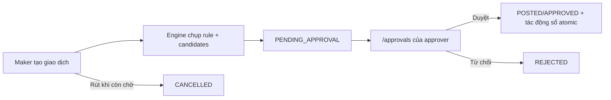

# Phê duyệt tài chính

> **Reviewed:** 2026-09-26  
> Route người dùng: `/approvals`.

> **Phạm vi file này:** LUẬT phê duyệt tài chính — khi nào cần duyệt, ngưỡng, `force_approval`,
> đặc quyền. **KHÔNG nói về:** cơ chế posting phiếu và số dư — `08-thu-chi-so-quy.md`; SOP tay —
> `19-sop-tien-va-so-quy.md`. Audit mới nhất: `docs/audits/AUDIT-THANH-TOAN-2026-08-31.md`.
> Từ 01/09/2026: đặc quyền "Đóng thêm" (`p_force`) neo theo **VAI `TENANT_OWNER`** (migration live
> prod, vá P1-02 audit 31/08) — không còn lọt qua `is_org_owner_v1` vốn chặn nhầm chủ công ty thật.

## Khi nào cần duyệt — MỘT bộ máy quyết (từ 26/09/2026)

Phiếu chi sinh ra đã duyệt hay chờ do **một** hàm luật quyết: `app_private.ie_spend_decide_v1`
(migration `20260926150000`). Luật khai **trên hạng mục** (`income_expense_types.spend_mode`),
mỗi hạng mục một trong ba kiểu:

| Kiểu | Hạng mục (org THẬT) | Máy duyệt khi | Chờ duyệt khi |
|---|---|---|---|
| **CAM_KET** — theo cam kết | Tiền nhà, internet, quản lý, vệ sinh, công an, rác, thang máy | Mọi dòng nằm trong phần **còn lại** của cam kết tháng (toà × hạng mục × tháng, kỳ lấy theo kỳ áp dụng của dòng) | Vượt phần còn lại — **kể cả người có quyền duyệt**; tháng chưa ký cam kết |
| **TRAN** — theo trần | Điện, nước | Dưới trần đã công bố (trần mỗi phiếu) | Vượt trần; toà chưa khai trần |
| **TUNG_PHIEU** — từng phiếu (mặc định cho hạng mục mới) | Mọi hạng mục khác | Người lập **có quyền duyệt** (ghi dấu `SELF_APPROVER`); hoặc dưới ngưỡng | Hạng mục `force_approval=true`; tổng ≥ ngưỡng (600.000đ) |

Luôn đi trước ba kiểu trên: **phiếu THU** giữ nguyên (tự duyệt); **18 nguồn hệ thống** chủ đã duyệt
(thu hoá đơn, cọc, bàn giao quỹ, bút toán thanh lý, chi lương…) tự cân đối; **phiếu CHI không có sổ
quỹ thật** thì chờ. Phiếu có nhiều dòng: **một dòng chờ ⇒ cả phiếu chờ**. Phiếu chờ duyệt **giữ chỗ**
trong cam kết (không được có phiếu thứ hai cho cùng phần tiền). Duyệt phần vượt vẫn được, nhưng sổ
tiêu ghi "đã chi vượt" và cam kết **không tự nới**.

**Trạng thái áp dụng hiện nay: CHẠY THỬ (SHADOW).** Cờ `spend.engine.v1` = `SHADOW`: 5 cửa chi
(`create_income_expense_v1`, `pay_period_fee`, `pay_utility_bill`, `generate_special_fees_v1`,
`generate_recurring_vouchers`) hỏi bộ máy nhưng **vẫn quyết theo luật cũ**; máy chỉ ghi lại nó *sẽ*
quyết thế nào (`app_private.spend_decisions`). Bộ máy chỉ **áp** khi cờ = `ON` **và** toà × hạng mục
× tháng đó đã bật công tắc (`set_spend_policy_switch_v1`). Plan đã chốt: bật sau ≥ 14 ngày chạy thử
(phiếu định kỳ: 30 ngày). Chủ xem và bật ở `/settings/finance/cam-ket-chi` (màn **Cam kết chi**).

Luật cũ (đang chạy tới khi bật): người lập có quyền duyệt ⇒ tự duyệt; hạng mục `force_approval` ⇒ chờ;
chi ≥ ngưỡng ⇒ chờ; trang Thanh toán: phí cố định theo `special_fee_rule_check_v1`, điện nước theo
ngưỡng + trần (`utility_ceiling_check_v1`). Writer chuyên biệt khác giữ invariant riêng của nó.

## Luồng

- Inbox gọi `list_my_pending_approvals_v1`; server lọc theo `auth.uid()`.
- Quyết định dùng `decide_financial_request_v2` với compare-and-swap; rút dùng `withdraw_financial_request_v1`.
- Maker không thể dùng các RPC approve legacy để vòng qua request engine.
- Duyệt và post sổ diễn ra trong transaction; retry dùng idempotency/CAS, không tạo bút toán đôi.

## Cấu hình ngưỡng

Owner mở `/settings/general` → tab **Thu chi**:

- Bỏ trống/bỏ ngưỡng: phiếu chi thường tự duyệt.
- Đặt số dương: chi thường dưới ngưỡng tự duyệt; từ ngưỡng trở lên sinh nháp chờ duyệt.
- Chỉ owner organization được đổi bằng `set_ie_auto_approve_threshold_v1`.

## Xử lý sự cố

- Inbox rỗng: request có thể không chỉ định người dùng hiện tại, đã được quyết định hoặc tài khoản/binding đã bị off-board.
- Người lập **có quyền duyệt** thì phiếu tự duyệt — chủ chốt 25/07 và giữ nguyên 26/09 (câu 05), chỉ ghi
  dấu vết để lọc/đếm: màn Cam kết chi → thẻ **Tự duyệt** (`list_self_approved_vouchers_v1`). Người không có
  quyền duyệt thì không tự duyệt được; chuyển người duyệt đúng rule.
- Phiếu tiền nhà/điện/… bất ngờ về chờ duyệt khi bộ máy đã bật: xem thẻ **Máy chấm thử** — lý do nằm ở cột
  "Máy quyết" (vượt cam kết, tháng chưa ký, vượt trần, phiếu chờ khác đang giữ chỗ…). Tắt công tắc của
  bucket đó ở thẻ **Bật áp dụng** là về luật cũ ngay; tắt hẳn: cờ `spend.engine.v1` ≠ `ON`.
- Không sửa trực tiếp `approval_status`/sổ quỹ. Dùng quyết định, withdraw hoặc reversal canonical để giữ audit.

Xem [hướng dẫn Chờ duyệt](../huong-dan-su-dung/03-quan-ly-van-hanh/cho-duyet/) và [authorization status](../authorization/README.md).
