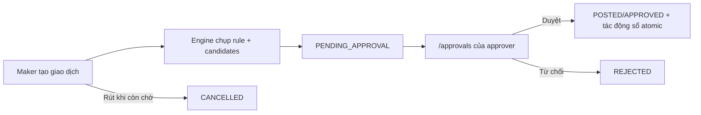

# Phê duyệt tài chính

> **Reviewed:** 2026-09-02  
> Route người dùng: `/approvals`.

> **Phạm vi file này:** LUẬT phê duyệt tài chính — khi nào cần duyệt, ngưỡng, `force_approval`,
> đặc quyền. **KHÔNG nói về:** cơ chế posting phiếu và số dư — `08-thu-chi-so-quy.md`; SOP tay —
> `19-sop-tien-va-so-quy.md`. Audit mới nhất: `docs/audits/AUDIT-THANH-TOAN-2026-08-31.md`.
> Từ 01/09/2026: đặc quyền "Đóng thêm" (`p_force`) neo theo **VAI `TENANT_OWNER`** (migration live
> prod, vá P1-02 audit 31/08) — không còn lọt qua `is_org_owner_v1` vốn chặn nhầm chủ công ty thật.

## Khi nào cần duyệt

- Hạng mục có `force_approval=true` (hoàn cọc/thanh lý/lương/lợi nhuận/hoa hồng/thưởng và các loại đặc biệt được cấu hình).
- Phiếu chi thường có tổng tiền **lớn hơn hoặc bằng** ngưỡng tự duyệt của organization.
- Writer chuyên biệt buộc approval theo invariant nghiệp vụ.

Phiếu thường dưới ngưỡng tự duyệt ngay. Nếu owner chưa đặt ngưỡng, mọi phiếu chi thường tự duyệt; hạng mục đặc biệt vẫn không được auto-post.

## Luồng

- Inbox gọi `list_my_pending_approvals_v1`; server lọc theo `auth.uid()`.
- Quyết định dùng `decide_financial_request_v2` với compare-and-swap; rút dùng `withdraw_financial_request_v1`.
- Maker không thể dùng các RPC approve legacy để vòng qua request engine.
- Duyệt và post sổ diễn ra trong transaction; retry dùng idempotency/CAS, không tạo bút toán đôi.

## Cấu hình ngưỡng

Owner mở `/settings/general` → tab **Thu chi**:

- Bỏ trống/bỏ ngưỡng: phiếu chi thường tự duyệt.
- Đặt số dương: chi thường dưới ngưỡng tự duyệt; từ ngưỡng trở lên sinh nháp chờ duyệt.
- Chỉ owner organization được đổi bằng `set_ie_auto_approve_threshold_v1`.

## Xử lý sự cố

- Inbox rỗng: request có thể không chỉ định người dùng hiện tại, đã được quyết định hoặc tài khoản/binding đã bị off-board.
- Không tự duyệt phiếu của mình; chuyển người duyệt đúng rule hoặc owner dùng emergency flow khi thật sự cần.
- Không sửa trực tiếp `approval_status`/sổ quỹ. Dùng quyết định, withdraw hoặc reversal canonical để giữ audit.

Xem [hướng dẫn Chờ duyệt](../huong-dan-su-dung/03-quan-ly-van-hanh/cho-duyet/) và [authorization status](../authorization/README.md).
