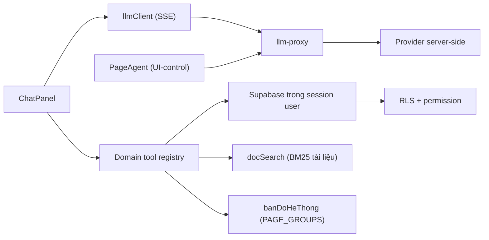

# AI Copilot

> **Reviewed:** 2026-07-20

AI Copilot gồm chat nghiệp vụ, UI-control giới hạn và tool domain. Launcher chỉ hiện khi user có session, entitlement còn hiệu lực và quyền tương ứng.

## Kiến trúc

Chat và UI-control đi hai lõi khác nhau: chat dùng `llmClient` nói thẳng
OpenAI-compat với proxy (cần streaming, ảnh, tool song song), còn UI-control giữ
`PageAgent` của `@page-agent/llms`.

- Key cloud nằm server-side; reservation, quota ba cấp và usage log do backend thực hiện cho request qua proxy.
- Registry lọc tool theo quyền trước khi đưa cho model và kiểm lại lúc execute.
- Query chạy dưới session user nên RLS là lớp chặn cuối.
- PII nhạy cảm không đưa vào tool result; số điện thoại được mask, CCCD/STK không trả.

## Khả năng hiện tại

- **Đọc số**: phòng trống, khách hàng, hoá đơn, hợp đồng sắp hết hạn, KQKD tháng, tỉ lệ lấp đầy (kèm phòng sắp trống), công nợ hoá đơn theo kỳ, cọc đang giữ, đối soát sổ quỹ.
- **Tra tài liệu**: chunk `docs/he-thong/*.md` theo heading rồi xếp hạng BM25 (bỏ dấu, bigram âm tiết, bảng đồng nghĩa). Trả các MỤC liên quan kèm trích dẫn nguồn dạng `(nguồn: <tài liệu> § <mục>)`. Chỉ tải thân tài liệu mà phiên có quyền đọc — xem "Giới hạn".
- **Bản đồ hệ thống**: trả lời "việc này làm ở trang nào, cần quyền gì", suy trực tiếp từ `VISIBLE_PAGE_GROUPS`. Chỉ kể trang mà phiên có ít nhất một chức năng dùng được.
- **Ngữ cảnh trang**: system prompt mang đường dẫn người dùng đang xem, nên hiểu được "cái này", "ở đây". Cũng mang NGÀY HÔM NAY — thiếu nó mô hình tự đoán ngày và trả báo cáo sai kỳ trong im lặng.
- **Đọc ảnh**: dán, kéo-thả hoặc chọn ảnh (điện thoại mở thẳng camera sau). Ảnh được nén về cạnh 1024/JPEG rồi gửi kèm câu hỏi; **không lưu ở đâu**, lịch sử chỉ ghi `[ảnh]`.
- **Trả lời chảy dần** (SSE) và **gọi nhiều công cụ song song** trong một lượt.
- UI-control: chỉ khi có quyền `ai_copilot.ui_control`; có thể điều hướng, lọc và điền form trong allowlist, nhưng không được bấm Lưu/Xác nhận/Submit hay hành động nguy hiểm. **Không** được cấp tool ghi.
- Ghi: tạo phiếu thu/chi **nháp** sau preview và xác nhận rõ của người dùng ở lượt kế tiếp; phiếu `UNAPPROVED`, chưa gắn sổ và chưa tác động tiền. Chỉ chat mới có tool này.

## Giới hạn cần biết

- Cờ xác nhận `xac_nhan` của write tool do model tạo theo schema/prompt; chưa có state machine server-side kiểm rằng preview đã được hiển thị và người dùng đã đồng ý ở lượt trước. Không dùng cờ này như bằng chứng ủy quyền độc lập.
- Write tool chạy ba bước: INSERT `ai_write_audit` (client) → RPC `ie_compat_insert_v2` → UPDATE `entity_id` vào audit (client). Phiếu và hạng mục **nằm chung một RPC nên nguyên tử với nhau**; ba bước thì không nằm chung transaction. Hỏng giữa chừng để lại audit không có `entity_id`, hoặc phiếu đã tạo mà audit chưa trỏ tới — không để lại phiếu thiếu hạng mục. Idempotency key chặn tạo trùng khi thử lại.
- Proxy từ chối `modelId` không có trong `ai_providers.models` của provider (400 `bad_model`); provider `mock` là ngoại lệ vì "model" của nó là kịch bản dev/test. Model đã bật mà khai giá `0` thì vẫn được tính chi phí `0` — hạn mức USD chỉ đúng bằng độ đúng của metadata giá, nên chỉ bật model đã điền giá thật.
- Các bảng/RPC RAG legacy đã bị drop; lịch sử chat hiện nằm ở `ai_chat_threads`/`ai_chat_messages`, không dùng `ai_conversations`/`ai_messages` cũ.
- Tra tài liệu **chỉ tải** thân những tài liệu phiên có quyền đọc, chứ không tải hết rồi mới lọc. Hệ quả chấp nhận có ý thức: điểm xếp hạng phụ thuộc tập tài liệu của từng người, nên hai người hỏi cùng câu có thể thấy thứ tự kết quả khác nhau.
- Không tìm được tài liệu thì Copilot nói thẳng, không trả đoạn gần đúng. Câu hỏi chỉ gồm hư từ ("cái này thì sao") bị coi là không có nội dung — cần ít nhất một từ mang nghĩa.
- Ảnh gửi vào chat **không được lưu**: chúng chỉ tồn tại trong một request. Đọc lại lịch sử sẽ thấy `[ảnh]` chứ không xem lại được ảnh cũ.

## Vận hành an toàn

- Cấp entitlement, quota và UI-control theo nguyên tắc tối thiểu; chỉ bật model đã xác minh capability và metadata giá.
- Kiểm log usage/audit khi có kết quả lạ; không cho Copilot thay người duyệt.
- Khi tool thiếu dữ liệu/quyền, sửa registry/query/backend thay vì nới RLS.
- Tắt entitlement hoặc kill switch khi provider/safety có sự cố.

Xem [AI Copilot current status](../ai-copilot/README.md) và [hướng dẫn người dùng](../huong-dan-su-dung/05-cai-dat/tro-ly-ai/).
