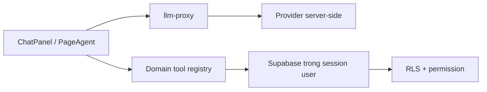

# AI Copilot

> **Reviewed:** 2026-07-20

AI Copilot gồm chat nghiệp vụ, UI-control giới hạn và tool domain. Launcher chỉ hiện khi user có session, entitlement còn hiệu lực và quyền tương ứng.

## Kiến trúc

- Key cloud nằm server-side; quota/reservation/log do backend kiểm soát.
- Registry lọc tool theo quyền trước khi đưa cho model và kiểm lại lúc execute.
- Query chạy dưới session user nên RLS là lớp chặn cuối.
- PII nhạy cảm không đưa vào tool result; số điện thoại được mask, CCCD/STK không trả.

## Khả năng hiện tại

- Đọc: phòng trống, khách hàng, hóa đơn, hợp đồng sắp hết hạn, KQKD tháng.
- Hướng dẫn: nạp động toàn bộ `docs/he-thong/*.md`; vì vậy tài liệu hệ thống phải link sạch và không chứa status sai hiển nhiên.
- UI-control: điều hướng trong allowlist và chỉ khi có quyền `ui_control`.
- Ghi: tạo phiếu thu/chi **nháp** sau preview + xác nhận hai bước; idempotency/audit; chưa gắn sổ và chưa tác động tiền.

## Vận hành an toàn

- Cấp entitlement, quota và UI-control theo nguyên tắc tối thiểu.
- Kiểm log usage/audit khi có kết quả lạ; không cho Copilot thay người duyệt.
- Khi tool thiếu dữ liệu/quyền, sửa registry/query/backend thay vì nới RLS.
- Tắt entitlement hoặc kill switch khi provider/safety có sự cố.

Xem [AI Copilot current status](../ai-copilot/README.md) và [hướng dẫn người dùng](../huong-dan-su-dung/05-cai-dat/tro-ly-ai/).
