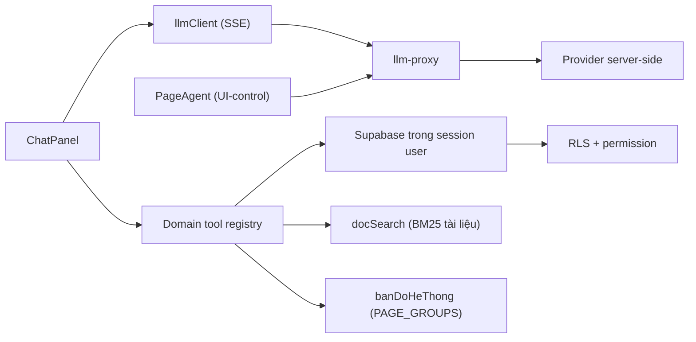

# AI Copilot

> **Reviewed:** 2026-09-03

AI Copilot gồm chat nghiệp vụ, UI-control giới hạn và tool domain. Launcher chỉ hiện khi user có session, entitlement còn hiệu lực và quyền tương ứng.

## Kiến trúc

Chat và UI-control đi hai lõi khác nhau: chat dùng `llmClient` nói thẳng
OpenAI-compat với proxy (cần streaming, ảnh, tool song song), còn UI-control giữ
`PageAgent` của `@page-agent/llms`.

- Key cloud nằm server-side; reservation, quota ba cấp và usage log do backend thực hiện cho request qua proxy.
- Registry lọc tool theo quyền trước khi đưa cho model và kiểm lại lúc execute.
- Query chạy dưới session user nên RLS là lớp chặn cuối.
- PII nhạy cảm không đưa vào tool result; số điện thoại được mask, CCCD/STK không trả.

## Khả năng hiện tại

- **Đọc số**: phòng trống, khách hàng, hoá đơn, hợp đồng sắp hết hạn, KQKD tháng, tỉ lệ lấp đầy (kèm phòng sắp trống), công nợ hoá đơn theo kỳ, cọc đang giữ, đối soát sổ quỹ.
- **Tra tài liệu**: chunk `docs/he-thong/*.md` theo heading rồi xếp hạng BM25 (bỏ dấu, bigram âm tiết, bảng đồng nghĩa). Trả các MỤC liên quan kèm trích dẫn nguồn dạng `(nguồn: <tài liệu> § <mục>)`. Chỉ tải thân tài liệu mà phiên có quyền đọc — xem "Giới hạn".
- **Bản đồ hệ thống**: trả lời "việc này làm ở trang nào, cần quyền gì", suy trực tiếp từ `VISIBLE_PAGE_GROUPS`. Chỉ kể trang mà phiên có ít nhất một chức năng dùng được.
- **Ngữ cảnh trang**: system prompt mang đường dẫn người dùng đang xem, nên hiểu được "cái này", "ở đây". Cũng mang NGÀY HÔM NAY — thiếu nó mô hình tự đoán ngày và trả báo cáo sai kỳ trong im lặng.
- **Đọc ảnh**: dán, kéo-thả hoặc chọn ảnh (điện thoại mở thẳng camera sau). Ảnh được nén về cạnh 1024/JPEG rồi gửi kèm câu hỏi; **không lưu ở đâu**, lịch sử chỉ ghi `[ảnh]`.
- **Trả lời chảy dần** (SSE) và **gọi nhiều công cụ song song** trong một lượt.
- UI-control: chỉ khi có quyền `ai_copilot.ui_control`; có thể điều hướng, lọc và điền form trong allowlist, nhưng không được bấm Lưu/Xác nhận/Submit hay hành động nguy hiểm. **Không** được cấp tool ghi.
- Ghi: tạo phiếu thu/chi **nháp** sau preview và xác nhận rõ của người dùng ở lượt kế tiếp; phiếu `UNAPPROVED`, chưa gắn sổ và chưa tác động tiền. Chỉ chat mới có tool này.
- **Kế hoạch thực thi (03/09/2026)**: super admin có thể xin Copilot lập một *kế hoạch* 1–8 bước đã xem trước, duyệt MỘT lần, rồi chạy tuần tự. Xem mục dưới.

## Kế hoạch thực thi — đồng ý theo lô (03/09/2026)

Một phiếu đồng ý cho một DÃY bước, thay cho một thẻ xác nhận mỗi thao tác. Hợp
đồng ở `20260903100253_copilot_execution_plan_v1.sql`; lối vào bước L5 ở
`20260903102931_copilot_action_income_expense_nop_ho_so_v1.sql`.

- **Vòng đời**: `DRAFT` (5 phút) → `APPROVED` (30 phút để chạy hết) →
  `DONE`/`FAILED`/`CANCELLED`/`EXPIRED`. Bước chạy TUYẾN TÍNH, một lời gọi một
  bước một giao dịch; một bước hỏng kéo cả kế hoạch dừng, các bước sau thành
  `BLOCKED`. Không có "bỏ qua rồi chạy tiếp".
- **Ba thứ mô hình không dựng được** đứng giữa kế hoạch và một lần ghi: nonce cấp
  kế hoạch (32 byte, server phát ĐÚNG MỘT LẦN, không vào ngữ cảnh mô hình),
  `plan_digest` mà giao diện echo lại từ màn hình, và CAS trên `plan_version`.
  `copilot_plan_approve_v1` KHÔNG nằm trong tool nào — chỉ giao diện gọi được.
- **Đây không phải "global consent"**: kế hoạch chỉ gói được các bước đã chạy xem
  trước và đã chốt `canonical`; mỗi bước giữ digest riêng, và server kiểm lại
  registry + cờ rollout + trần rủi ro + phạm vi quyền NGAY TRƯỚC KHI GHI từng
  bước. Van đổi giữa chừng ⇒ `policy_changed`; cầu dao kéo giữa chừng ⇒ bước
  `BLOCKED` với `copilot_action_disabled`.
- **Ai được lập**: `copilot_action_policy.allowed_roles`, seed `{superadmin}`.
  Trần rủi ro `max_direct_risk` hiện là `L4`, và MIỄN trần cho đúng một cơ chế
  thực thi — `maker_submit_v1` — vì nó không ghi trực tiếp.
- **Bước L5 duy nhất**: `income_expense.nop_ho_so` NỘP một phiếu nháp của chính
  người thao tác vào hàng chờ duyệt và ép hồ sơ dừng ở `PENDING_APPROVAL`. Luật
  `AUTO_POST` khớp ⇒ `copilot_auto_post_forbidden` và cuốn ngược sạch; luật `DENY`
  ⇒ `rule_denied`. **Người duyệt vẫn là một con người khác** qua
  `decide_financial_voucher` (maker-checker chặn chính người nộp). Tổ chức chưa có
  bộ luật duyệt `ACTIVE` thì bước này fail-CLOSED, không tạo hồ sơ nào.
- **Đọc lại thay vì đoán**: mất kết nối giữa chừng thì gọi `copilot_plan_get_v1`
  (chủ kế hoạch hoặc super admin) — nó trả trạng thái thật + 20 dòng sổ, và KHÔNG
  trả nonce, `canonical`, `payload` hay digest thô của bước.
- **Chưa có thân**: `copilot_plan_reconcile_step_v1` (đối soát bước
  `UNKNOWN_EFFECT` với nguồn ngoài) trả `not_implemented` — chữ ký và ACL có sẵn
  để Mức 3 không phải đổi bề mặt.

## Giới hạn cần biết

- Ghi đi qua nonce server, không còn dựa vào cờ model tự khai: `preview` (`copilot_preview_income_expense_v1`) trả `confirmation_nonce` một lần, lưu ở `app_private.copilot_write_confirmations` (migration `20260814034500`, chỉ lưu digest payload, TTL 5 phút, CAS `consumed_at` chặn dùng lại/song song). `execute` (`copilot_execute_income_expense_v1`, `20260830171108`) tiêu nonce rồi **re-check quyền lại từ đầu** thay vì tin kết quả preview, kèm guard hạng mục (`20260831110236`). Cờ `xac_nhan` do model tạo chỉ còn là tín hiệu UI; bằng chứng ủy quyền thật nằm ở dòng nonce đã bị tiêu trong `copilot_write_confirmations`.
- `ai_write_audit` append-only: trigger chặn UPDATE/DELETE ở **mọi vai kể cả `service_role`** (`20260814034600`). Phiếu và hạng mục nằm chung một RPC nên nguyên tử với nhau. Idempotency key chặn tạo trùng khi thử lại.
- Giới hạn hiện tại: chỉ 1 tool ghi (`tao_phieu_thu_chi_nhap`, draft UNAPPROVED), UI-control 3 route pilot.
- Proxy từ chối `modelId` không có trong `ai_providers.models` của provider (400 `bad_model`); provider `mock` là ngoại lệ vì "model" của nó là kịch bản dev/test — nhưng đường mock chỉ mở khi deployment đặt env `LLM_PROXY_ALLOW_MOCK=1`, không phải khi có dòng `mock` trong `ai_providers` (xem "Hàng rào của llm-proxy"). Model đã bật mà khai giá `0` thì vẫn được tính chi phí `0` — hạn mức USD chỉ đúng bằng độ đúng của metadata giá, nên chỉ bật model đã điền giá thật.
- Các bảng/RPC RAG legacy đã bị drop; lịch sử chat hiện nằm ở `ai_chat_threads`/`ai_chat_messages`, không dùng `ai_conversations`/`ai_messages` cũ.
- Tra tài liệu **chỉ tải** thân những tài liệu phiên có quyền đọc, chứ không tải hết rồi mới lọc. Hệ quả chấp nhận có ý thức: điểm xếp hạng phụ thuộc tập tài liệu của từng người, nên hai người hỏi cùng câu có thể thấy thứ tự kết quả khác nhau.
- Không tìm được tài liệu thì Copilot nói thẳng, không trả đoạn gần đúng. Câu hỏi chỉ gồm hư từ ("cái này thì sao") bị coi là không có nội dung — cần ít nhất một từ mang nghĩa.
- Ảnh gửi vào chat **không được lưu**: chúng chỉ tồn tại trong một request. Đọc lại lịch sử sẽ thấy `[ảnh]` chứ không xem lại được ảnh cũ.

## Hàng rào của llm-proxy (02/09/2026)

- **Tổ chức phải được NÓI, không được suy**: mọi request qua proxy gửi header `x-organization-id` (uuid). Thiếu hoặc rác → 400 `organization_required`; có mà người dùng không có membership `ACTIVE` trên org `ACTIVE` đó (và cũng không phải super admin ngoài org sandbox) → 403 `organization_forbidden`. Hàng rào này lặp lại ở RPC `reserve_ai_usage`, không chỉ nằm ở proxy.
- **Mock chỉ chạy khi deployment bật tường minh**: env `LLM_PROXY_ALLOW_MOCK=1`. KHÔNG đặt biến này trên production — một dòng `mock` trong `ai_providers` tự nó không mở được đường mock.
- **Body lên upstream theo allowlist trường**: `messages`, `stream`, `stream_options`, `max_tokens`, `temperature`, `top_p`, `tools`, `tool_choice`, `response_format`. Khoá mới của upstream mặc định bị BỎ chứ không mặc định lọt.
- **Trần kích thước**: body 512 KiB (413 `body_too_large`), 64 message, 4 ảnh, tổng base64 ảnh 6 MB, 8 lượt parse đồng thời.
- **Đồng hồ stream**: 180s tổng + 30s im lặng. Hết hạn nào cũng đóng stream và finalize ĐÚNG MỘT lần — hai lần finalize là hai lần ghi đè sổ usage.
- **Thứ tự phát hành BẮT BUỘC**: migration `reserve_ai_usage` → deploy llm-proxy **NGAY** → rồi mới frontend. Đảo thứ tự thì hoặc proxy gọi hàm chưa có, hoặc frontend gửi header mà CORS của proxy chưa cho qua.

## Vận hành an toàn

- Cấp entitlement, quota và UI-control theo nguyên tắc tối thiểu; chỉ bật model đã xác minh capability và metadata giá.
- Kiểm log usage/audit khi có kết quả lạ; không cho Copilot thay người duyệt.
- Khi tool thiếu dữ liệu/quyền, sửa registry/query/backend thay vì nới RLS.
- Tắt entitlement hoặc kill switch khi provider/safety có sự cố.

Xem [AI Copilot current status](../ai-copilot/README.md) và [hướng dẫn người dùng](../huong-dan-su-dung/05-cai-dat/tro-ly-ai/).
