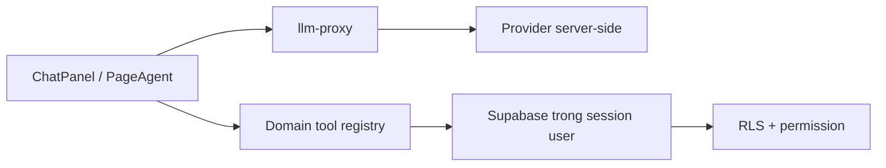

# AI Copilot

> **Reviewed:** 2026-07-20

AI Copilot gồm chat nghiệp vụ, UI-control giới hạn và tool domain. Launcher chỉ hiện khi user có session, entitlement còn hiệu lực và quyền tương ứng.

## Kiến trúc

- Key cloud nằm server-side; reservation, quota ba cấp và usage log do backend thực hiện cho request qua proxy.
- Registry lọc tool theo quyền trước khi đưa cho model và kiểm lại lúc execute.
- Query chạy dưới session user nên RLS là lớp chặn cuối.
- PII nhạy cảm không đưa vào tool result; số điện thoại được mask, CCCD/STK không trả.

## Khả năng hiện tại

- Đọc: phòng trống, khách hàng, hóa đơn, hợp đồng sắp hết hạn, KQKD tháng.
- Hướng dẫn: nạp động toàn bộ `docs/he-thong/*.md`; vì vậy tài liệu hệ thống phải link sạch và không chứa status sai hiển nhiên.
- UI-control: chỉ khi có quyền `ai_copilot.ui_control`; có thể điều hướng, lọc và điền form trong allowlist, nhưng không được bấm Lưu/Xác nhận/Submit hay hành động nguy hiểm.
- Ghi: tạo phiếu thu/chi **nháp** sau preview và xác nhận rõ của người dùng ở lượt kế tiếp; phiếu `UNAPPROVED`, chưa gắn sổ và chưa tác động tiền.

## Giới hạn cần biết

- Cờ xác nhận `xac_nhan` của write tool do model tạo theo schema/prompt; chưa có state machine server-side kiểm rằng preview đã được hiển thị và người dùng đã đồng ý ở lượt trước. Không dùng cờ này như bằng chứng ủy quyền độc lập.
- Write tool chạy ba bước: INSERT `ai_write_audit` (client) → RPC `ie_compat_insert_v2` → UPDATE `entity_id` vào audit (client). Phiếu và hạng mục **nằm chung một RPC nên nguyên tử với nhau**; ba bước thì không nằm chung transaction. Hỏng giữa chừng để lại audit không có `entity_id`, hoặc phiếu đã tạo mà audit chưa trỏ tới — không để lại phiếu thiếu hạng mục. Idempotency key chặn tạo trùng khi thử lại.
- Proxy từ chối `modelId` không có trong `ai_providers.models` của provider (400 `bad_model`); provider `mock` là ngoại lệ vì "model" của nó là kịch bản dev/test. Model đã bật mà khai giá `0` thì vẫn được tính chi phí `0` — hạn mức USD chỉ đúng bằng độ đúng của metadata giá, nên chỉ bật model đã điền giá thật.
- Các bảng/RPC RAG legacy đã bị drop; lịch sử chat hiện nằm ở `ai_chat_threads`/`ai_chat_messages`, không dùng `ai_conversations`/`ai_messages` cũ.

## Vận hành an toàn

- Cấp entitlement, quota và UI-control theo nguyên tắc tối thiểu; chỉ bật model đã xác minh capability và metadata giá.
- Kiểm log usage/audit khi có kết quả lạ; không cho Copilot thay người duyệt.
- Khi tool thiếu dữ liệu/quyền, sửa registry/query/backend thay vì nới RLS.
- Tắt entitlement hoặc kill switch khi provider/safety có sự cố.

Xem [AI Copilot current status](../ai-copilot/README.md) và [hướng dẫn người dùng](../huong-dan-su-dung/05-cai-dat/tro-ly-ai/).
