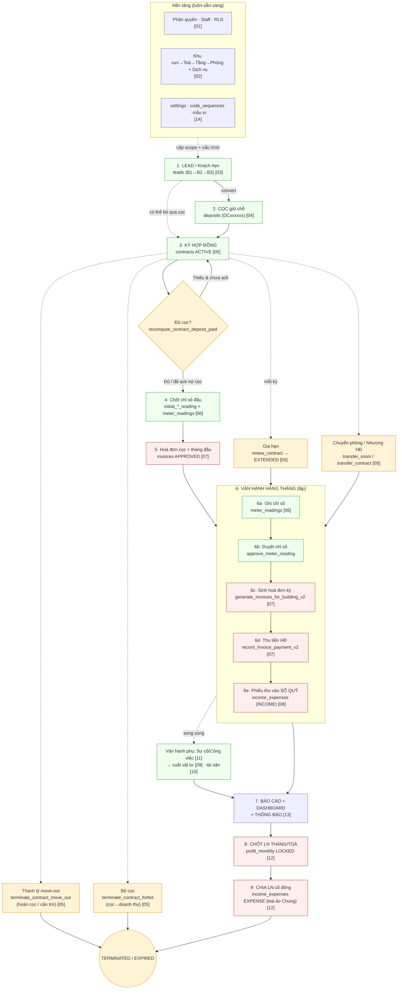
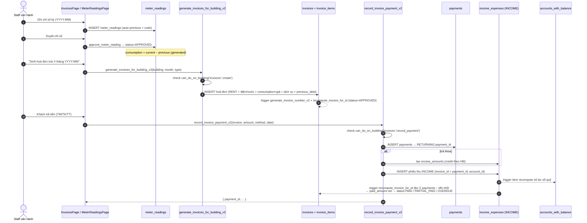
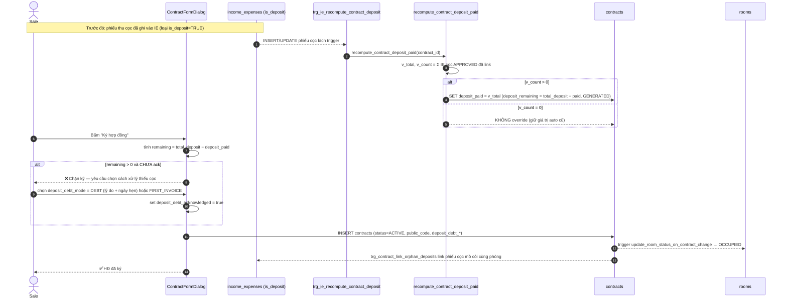
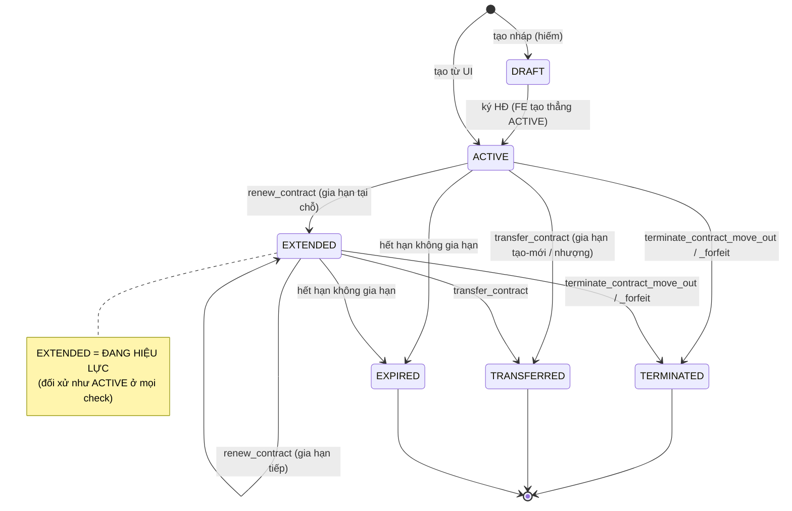
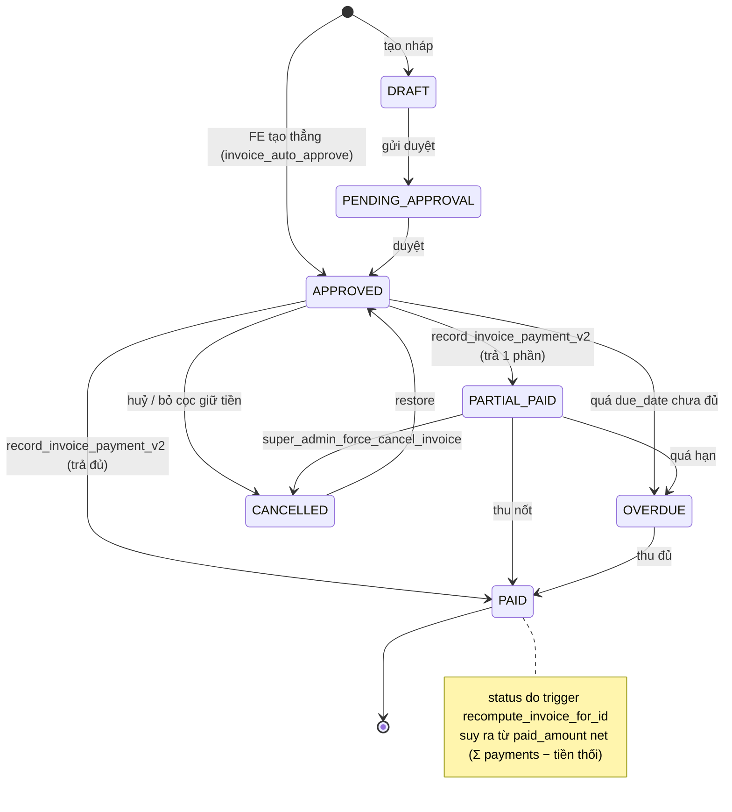
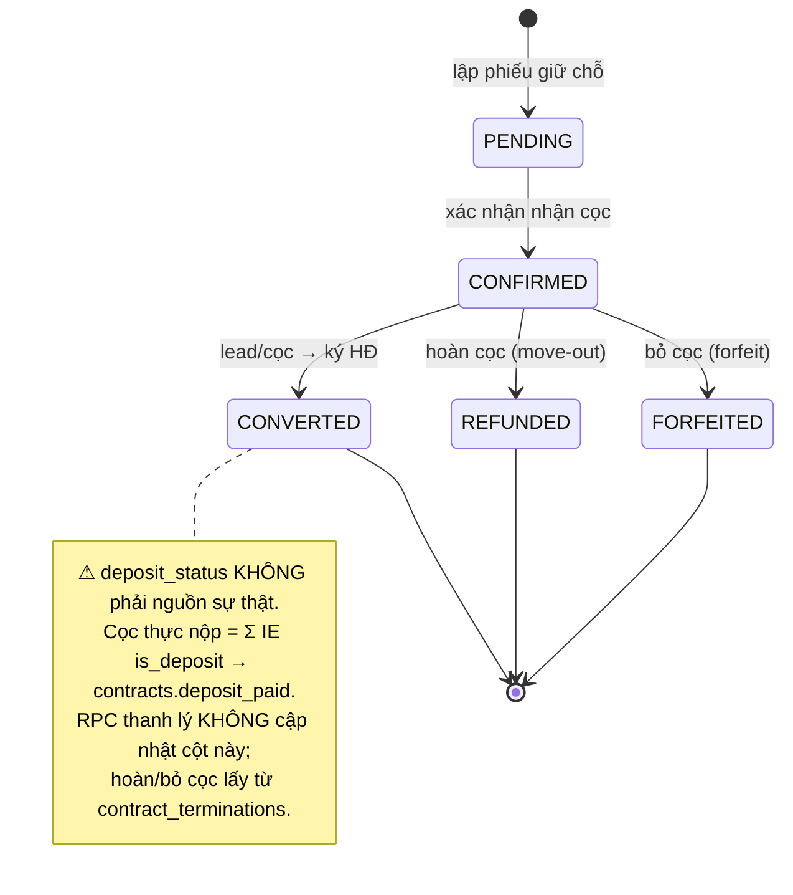
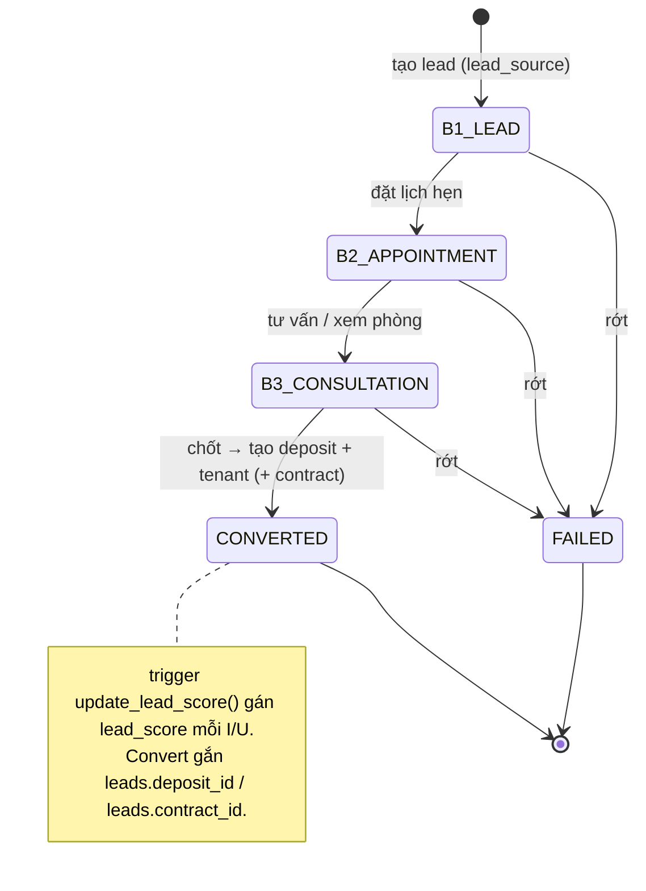

# Quy trình nghiệp vụ tổng — từ Lead đến Lợi nhuận

> Tài liệu **xuyên suốt** mọi domain. Nó không lặp lại chi tiết từng bảng/RPC (đã có trong 14 file domain `01`–`14`) mà nối chúng thành **một dòng chảy end-to-end**: từ khi một khách hẹn (lead) xuất hiện, đi qua cọc → ký hợp đồng → vận hành hàng tháng (chỉ số → hoá đơn → thu tiền → sổ quỹ) → báo cáo → và cuối cùng **chia lợi nhuận cho cổ đông**. Mỗi khâu chỉ ra: **ai làm**, **page nào**, **hook/RPC/bảng nào ghi**, **trigger/side-effect gì**, **chứng từ sinh ra**.
>
> Đọc kèm: [01-phan-quyen-nhan-su](01-phan-quyen-nhan-su.md), [02-co-cau-toa-nha-phong-dich-vu](02-co-cau-toa-nha-phong-dich-vu.md), [03-khach-hang-lead-ho-so](03-khach-hang-lead-ho-so.md), [04-coc-giu-cho](04-coc-giu-cho.md), [05-hop-dong](05-hop-dong.md), [06-cong-to-chi-so](06-cong-to-chi-so.md), [07-hoa-don-thanh-toan](07-hoa-don-thanh-toan.md), [08-thu-chi-so-quy](08-thu-chi-so-quy.md), [09-kho-vat-tu](09-kho-vat-tu.md), [10-tai-san](10-tai-san.md), [11-cong-viec-su-co](11-cong-viec-su-co.md), [12-co-dong-loi-nhuan](12-co-dong-loi-nhuan.md), [13-bao-cao-dashboard-thong-bao](13-bao-cao-dashboard-thong-bao.md), [14-cai-dat-danh-muc-tai-lieu](14-cai-dat-danh-muc-tai-lieu.md).

---

## 0. Tiền đề: nền tảng cấu hình & phân quyền

Trước khi *bất kỳ* chứng từ nào được tạo, hai domain "nền" phải sẵn sàng:

- **Phân quyền & nhân sự** ([01](01-phan-quyen-nhan-su.md)): mỗi request được phân loại caller theo cây logic `super_admin → owner → tenant_admin (role __superadmin) → staff thường → cổ đông`. Mọi RLS ở downstream gọi xuống helper `staff_can(table,action,owner)` (ghi), `can_do_on_building` / `can_access_building` (đọc/ghi theo toà), `is_super_admin` / `is_admin` (bypass). `get_my_permissions()` trả snapshot quyền (Tier 1 role template → Tier 2 `staff_assignments.permissions` override).
- **Cơ cấu BĐS + danh mục** ([02](02-co-cau-toa-nha-phong-dich-vu.md), [14](14-cai-dat-danh-muc-tai-lieu.md)): phải có **khu vực → toà → tầng → phòng** (`areas → buildings → floors → rooms`) và **dịch vụ/định mức** (`services`, `building_services`, `service_quotas`). `code_sequences` + `generate_code` / `generate_next_code` cấp engine sinh mã. `settings` (JSONB key-value) là **công tắc hành vi** (`invoice_auto_approve`, `invoice_payment_deadline_days`, `contract_e_signing_enabled`…). `seed_default_settings(p_user_id)` gieo ~20 key mặc định.

Mọi `building_id` / `room_id` xuất hiện ở các khâu sau đều **neo về domain [02]** này; mọi `user_id` (owner) + quyền staff đều neo về **[01]**.

---

## 1. Bản đồ vòng đời tổng

**Nguyên tắc bất biến xuyên suốt:**

- **Một phòng chỉ có một HĐ đang hiệu lực** tại một thời điểm (`ACTIVE` hoặc `EXTENDED` — dùng `isContractInEffect()` / `.in('status',['ACTIVE','EXTENDED'])`).
- **`income_expenses` (APPROVED, `deleted_at IS NULL`) là canonical ledger** — nguồn sự thật duy nhất cho số dư sổ quỹ, dòng tiền và P&L; tránh double-count bằng cách báo cáo luôn đọc về đây.
- **Cọc thực nộp = Σ phiếu thu `is_deposit`**, KHÔNG phải `deposits.status` (xem [04]).
- **Tiền chỉ "có thật" khi phiếu IE ở trạng thái APPROVED** — DRAFT/UNAPPROVED/CANCELLED không vào số dư.

---

## 2. Từng giai đoạn — mô tả từng bước

### Giai đoạn 1 — LEAD (Khách hẹn) · [03]

- **Ai:** sale/staff được giao toà. **Page:** [LeadsPage.tsx](../../src/pages/leads/LeadsPage.tsx) (phễu Kanban B1→B2→B3).
- **Bước:** staff tạo lead (nguồn `lead_source`: FACEBOOK/ZALO/PHONE/REFERRAL/WALK_IN/WEBSITE/OTHER), gán `assigned_staff_id` (→ `profiles`), `building_id`/`room_id` quan tâm.
- **Ghi:** bảng `leads`; mỗi tương tác ghi `lead_activities`.
- **Side-effect:** trigger `update_lead_score()` (BEFORE I/U) gán `NEW.lead_score`; `calculate_lead_score()` dùng để backfill. Kéo thẻ qua các cột đổi `lead_status`: `B1_LEAD → B2_APPOINTMENT → B3_CONSULTATION`.
- **Kết quả:** lead chuyển trạng thái `CONVERTED` (đi tiếp sang cọc/HĐ) hoặc `FAILED`. Convert sinh `deposit` + `tenant` và gắn `leads.deposit_id` / `leads.contract_id`.

### Giai đoạn 2 — CỌC giữ chỗ · [04]

- **Ai:** sale. **Page:** [DepositsPage.tsx](../../src/pages/deposits/DepositsPage.tsx) (4 tab: Tổng quan / Đủ-Thiếu cọc / Hoàn-Bỏ cọc / Phiếu giữ chỗ) hoặc dialog convert lead.
- **Bước:** lập phiếu giữ chỗ (`deposits`, mã `DCxxxxxx` qua trigger `deposits_set_code`) cho `tenant_id` + `room_id`. **Tiền cọc thực nộp** được ghi như một **phiếu thu** `income_expenses` thuộc loại có cờ `is_deposit=TRUE` ([08]).
- **Side-effect quan trọng:** khi tạo HĐ, trigger `trg_contract_link_orphan_deposits` tự **link** các phiếu IE cọc "mồ côi" cùng phòng vào HĐ; trigger `trg_ie_recompute_contract_deposit` + `trg_ie_items_recompute_deposit` gọi `recompute_contract_deposit_paid` để đẩy Σ cọc APPROVED vào `contracts.deposit_paid`.
- **Chứng từ:** phiếu giữ chỗ `DCxxxxxx` + phiếu thu cọc IS_DEPOSIT.
- **Lưu ý:** `deposit_status` (PENDING/CONFIRMED/CONVERTED/REFUNDED/FORFEITED) **không phải nguồn sự thật** — RPC thanh lý không cập nhật cột này.

### Giai đoạn 3 — KÝ HỢP ĐỒNG · [05]

- **Ai:** staff có quyền `contracts:create` trên toà. **Page:** [ContractsPage.tsx](../../src/pages/contracts/ContractsPage.tsx) → ContractFormDialog.
- **Bước:** chọn phòng + khách (qua junction `contract_customers`, đúng **1 đại diện** — trigger `check_contract_representative()`), nhập `rent_price`, `payment_cycle`, `total_deposit`, dịch vụ áp dụng (`contract_services` với đơn giá riêng + chỉ số đầu).
- **Kiểm tra cọc (gate):** form tính `deposit_remaining = total_deposit − deposit_paid`. Nếu thiếu, **chặn ký** trừ khi admin đặt `deposit_debt_mode` = `DEBT` (cho nợ, kèm `deposit_debt_reason` + `deposit_topup_due_date`) hoặc `FIRST_INVOICE` (thu đủ trong hoá đơn đầu) và bật `deposit_debt_acknowledged`. (Sơ đồ tuần tự ở mục 3b.)
- **Ghi:** `contracts` (status set thẳng `ACTIVE`, `contract_number` sinh bởi trigger, `public_code` 6 ký tự cho link QR `/c/:code`), `contract_customers`, `contract_services`.
- **Side-effect:** trigger `update_room_status_on_contract_change()` đặt `rooms.status = OCCUPIED`. Khi ký HĐ có thể sinh **phiếu hoa hồng** (commission) trạng thái UNAPPROVED trong `income_expenses` ([08]).
- **Chứng từ:** HĐ + (tuỳ cấu hình) hoá đơn cọc tự tạo.

### Giai đoạn 4 — CHỐT CHỈ SỐ ĐẦU · [06]

- **Ai:** staff vận hành. **Page:** form HĐ (cột `initial_electricity_reading` / `initial_water_reading`) và/hoặc [MeterReadingsPage.tsx](../../src/pages/meter-readings/MeterReadingsPage.tsx).
- **Bước:** ghi mốc chỉ số điện/nước lúc nhận phòng. Đây là **previous** cho kỳ chỉ số đầu tiên — `consumption` (cột generated) của kỳ sau = current − previous.
- **Ghi:** `contracts.initial_*_reading` + (nếu lập reading) `meter_readings` (gắn `meters` theo room+service). Trigger `auto_populate_previous_reading` lấy chỉ số kỳ trước.
- **Kết quả:** hệ thống có đủ mốc để tính tiền điện/nước cho dịch vụ `pricing_type = DON_GIA_CO_DINH_DONG_HO`.

### Giai đoạn 5 — HOÁ ĐƠN CỌC + THÁNG ĐẦU · [07]

- **Ai:** staff. **Page:** [InvoicesPage.tsx](../../src/pages/invoices/InvoicesPage.tsx) hoặc auto khi ký HĐ (settings `invoice_auto_create_deposit`).
- **Bước:** dựng hoá đơn tháng đầu = tiền thuê (theo `start_billing_date`) + dịch vụ + (nếu `FIRST_INVOICE`) phần cọc còn thiếu. `firstInvoiceBuilder` đánh dấu dòng điện/nước `METERED_PRICING`.
- **Ghi:** `invoices` + `invoice_items`. Số HĐ sinh bởi trigger `generate_invoice_number_v2`; trạng thái tạo thẳng `APPROVED` (nếu `invoice_auto_approve`).
- **Chứng từ:** hoá đơn tháng đầu (+ hoá đơn cọc nếu tách riêng).

### Giai đoạn 6 — VẬN HÀNH HÀNG THÁNG (vòng lặp lõi)

Lặp lại mỗi kỳ `billing_month` (YYYY-MM):

1. **6a · Ghi chỉ số** ([06]): staff nhập `meter_readings` (mã `CSS{YYMM}{seq}`), hoặc import Excel qua `bulk_create_meter_readings(p_readings jsonb)` (trả lỗi từng dòng). Triggers `auto_populate_meter_reading_fields` / `auto_populate_previous_reading` / `auto_generate_reading_code` điền sẵn trường.
2. **6b · Duyệt** ([06]): `approve_meter_reading(p_reading_id)` hoặc `bulk_approve_meter_readings(p_reading_ids[])` đặt `status = APPROVED` (thực tế FE thường tạo thẳng APPROVED). Chỉ chỉ số APPROVED mới được chọn lên hoá đơn.
3. **6c · Sinh hoá đơn kỳ** ([07]): `generate_invoices_for_building_v2(p_building_id, p_billing_month, p_invoice_type)` (RBAC, delegate xuống v1). Dòng điện/nước = `consumption × unit_price`; tiền thuê + dịch vụ cố định từ `contract_services`/`building_services` + bậc thang `service_quota_tiers`; cộng `previous_debt` (nợ kỳ trước, lưu `previous_debt_sources`). Trigger `recompute_invoice_for_id` suy `status` + `paid_amount` net.
4. **6d · Thu tiền** ([07]): `record_invoice_payment_v2(p_invoice_id, p_amount, p_payment_method, p_payment_date, …)` — kiểm `can_do_on_building`, tạo dòng `payments` (TM/TK/TT). Nếu khách trả thừa → tạo `excess_amounts` (credit theo HĐ).
5. **6e · Vào sổ quỹ** ([08]): **mỗi `payment` được mirror thành 1 phiếu thu `income_expenses` (INCOME)** gắn `invoice_id + payment_id`, `account_id` đẩy tiền vào sổ quỹ tương ứng (gợi ý `buildings.default_account_id_tt/tk`). Trigger item recompute số dư `accounts_with_balance`. Trigger trên invoice đọc ngược các phiếu IE (kể cả phiếu chi "Tiền thối"/"Hoàn trả") để tính `paid_amount` **net**, suy `status` = PAID/PARTIAL_PAID/OVERDUE và làm tròn dư < 10K.

> **Vận hành phụ song song** ([09]/[10]/[11]): khách/staff báo **sự cố** (`issues`, có SLA + workflow) hoặc lập **công việc** (`jobs`, mã `JOB-YYYYMMDD-NNNN`). Khi xử lý có thể **xuất vật tư** (`material_usages.job_id`, snapshot `unit_cost_at_usage`) hoặc bàn giao **tài sản** (`asset_handovers.contract_id`). Chi phí này hiện chưa tự sinh phiếu IE nhưng là dữ liệu chi phí cho phân tích.

### Giai đoạn 7 — BÁO CÁO · DASHBOARD · THÔNG BÁO · [13]

- **Đọc tổng hợp:** Dashboard KPI (lấp đầy, doanh thu tháng, công nợ) + ~17 báo cáo BĐS/Tài chính, tất cả **read-only** (không RPC riêng), đọc canonical từ `income_expenses` (dòng tiền) + `invoices`/`payments` (công nợ) + `contracts`/`rooms` (occupancy).
- **Cảnh báo đẩy:** `runScheduledNotifications()` (client, [notificationScheduler.ts](../../src/lib/notificationScheduler.ts)) gọi 4 check → ghi `notifications` (CONTRACT_EXPIRING / PAYMENT_REMINDER / OVERDUE_INVOICE / DEPOSIT_SHORTFALL), trạng thái PENDING(=chưa đọc)→READ.

### Giai đoạn 8 — CHỐT LỢI NHUẬN THÁNG / TOÀ · [12]

- **Ai:** owner. **Page:** [ShareholderProfitPage](../../src/pages/finance/ShareholderProfitPage.tsx) (`/finance/shareholder-profit`).
- **Bước:** chọn tháng + toà → `monthly_building_profit(p_start, p_end, p_building_id)` tính **LN = thu KQKD − chi KQKD** trên dữ liệu owner (chỉ `counts_in_business_result = true` + IE APPROVED). Khoá tháng qua `useLockProfitMonth` → upsert `profit_monthly` status `DRAFT → LOCKED` và **snapshot** phân bổ vào `profit_allocations` theo tỷ lệ `building_shareholders`.
- **Chứng từ:** dòng chốt LN (`profit_monthly`) + snapshot phân bổ.

### Giai đoạn 9 — CHIA LỢI NHUẬN CỔ ĐÔNG · [12]

- **Bước:** `useCreateProfitDistribution` sinh **phiếu chi** `income_expenses` (EXPENSE) gắn `shareholder_id`, đặt trên **toà ảo "Chung"** (`is_virtual`), `business_result_accounting = false` (KHÔNG tính lại vào P&L), chọn `account_id` để trừ số dư sổ quỹ. Cổ đông có `auth_user_id` link → đăng nhập xem read-only theo toà có cổ phần (nhánh cổ đông trong `get_my_permissions` / `can_access_building`).
- **Kết quả:** lợi nhuận biến thành **dòng tiền phân phối** thực cho người góp vốn — khép vòng đời.

### Nhánh biến động HĐ (có thể xảy ra bất cứ lúc nào ở Giai đoạn 6)

- **Gia hạn:** `renew_contract → renew_contract_impl` — gia hạn tại chỗ, `ACTIVE/EXTENDED → EXTENDED` (vẫn coi như đang hiệu lực), gia hạn tạo-mới (`CREATE_NEW(RENEWAL)`) trỏ `parent_contract_id`.
- **Chuyển phòng:** `transfer_room` — đổi `room_id` chính HĐ, chặn phòng bận, tự free phòng cũ / chiếm phòng mới.
- **Nhượng HĐ:** `transfer_contract → transfer_contract_impl` — đổi khách đại diện.
- **Thanh lý move-out:** `terminate_contract_move_out` — rời phòng, hoá đơn thanh lý cấn trừ cọc / phòng thừa / phạt; **hoàn cọc** ghi vào `contract_terminations` (hạng mục `is_deposit=TRUE`).
- **Bỏ cọc:** `terminate_contract_forfeit` — `termination_type = FORFEIT`, hoá đơn PAID ghi **cọc = doanh thu**, HĐ có thể CANCELLED nhưng giữ payment.
- Tất cả đặt `actual_end_date`, đổi `status → TERMINATED`, trigger đồng bộ `rooms.status → AVAILABLE`.

---

## 3. Sơ đồ tuần tự — 2 luồng then chốt

### 3a. Sinh hoá đơn hàng tháng → khách thanh toán → vào sổ quỹ

### 3b. Ký HĐ có kiểm tra cọc (chặn ký thiếu cọc)

---

## 4. Sơ đồ trạng thái

### 4a. `contract_status` (HĐ) · [05]

### 4b. `invoice_status` (hoá đơn) · [07]

### 4c. `deposit_status` (phiếu cọc) · [04]

### 4d. `lead_status` (khách hẹn) · [03]

---

## 5. Vận hành định kỳ tự động (pg_cron + client scheduler)

| Cơ chế | Lịch | Gọi gì | Kết quả |
|---|---|---|---|
| **Phiếu lặp định kỳ** ([08]) | pg_cron `0 18 * * *` (= 01:00 giờ VN), job `recurring_vouchers_daily` | `run_recurring_vouchers_job()` (SECURITY DEFINER) → `generate_recurring_vouchers(NULL)` cho **mọi owner** | Sinh phiếu IE con từ phiếu cha `repeat_cycle` (WEEK/MONTH/QUARTER/YEAR); `add_cycle` neo ngày chống drift. Xem [migration cron](../../supabase/migrations/20260603000011_recurring_vouchers_cron.sql). Lưu ý dùng `generate_recurring_vouchers(NULL)` chứ không `_v2` vì v2 cần `auth.uid()` (NULL trong ngữ cảnh cron). |
| **Sinh hoá đơn hàng loạt** ([07]) | thủ công theo nút (chưa cron) | `generate_invoices_for_building_v2(building, month, type)` | Hoá đơn cả toà cho `billing_month`. |
| **Thông báo theo lịch** ([13]) | client mỗi ~6h ([useScheduledNotifications.ts](../../src/hooks/useScheduledNotifications.ts)) | `runScheduledNotifications()` → `checkContractExpiryReminders` / `checkInvoicePaymentReminders` / `checkOverdueInvoices` / `checkDepositTopupReminders` | Ghi `notifications`: `CONTRACT_EXPIRING` (HĐ sắp hết hạn), `PAYMENT_REMINDER` / `OVERDUE_INVOICE` (hoá đơn), `DEPOSIT_SHORTFALL` (thiếu cọc theo `deposit_topup_due_date`). |

---

## 6. Ma trận: Sự kiện nghiệp vụ → bảng bị ghi → báo cáo bị ảnh hưởng

| # | Sự kiện (ai) | Page / RPC | Bảng bị GHI (+trigger/side-effect) | Báo cáo / số liệu bị ảnh hưởng |
|---|---|---|---|---|
| 1 | Tạo & nuôi lead (sale) | LeadsPage | `leads`, `lead_activities` (trg `update_lead_score`) | New-leases pipeline, Dashboard sale |
| 2 | Nhận cọc (sale) | DepositsPage / IE | `deposits` (DCxxxxxx), `income_expenses` is_deposit (trg recompute `contracts.deposit_paid`) | Báo cáo cọc (DepositsReport), số dư sổ quỹ |
| 3 | Ký HĐ (staff) | ContractFormDialog | `contracts` (ACTIVE), `contract_customers`, `contract_services`; trg `rooms.status=OCCUPIED`; (tuỳ) phiếu hoa hồng UNAPPROVED | Occupancy, New-leases, lấp đầy Dashboard |
| 4 | Chốt chỉ số đầu (staff) | form HĐ / MeterReadings | `contracts.initial_*_reading`, `meter_readings` | (mốc cho hoá đơn điện/nước) |
| 5 | Ghi + duyệt chỉ số (staff) | MeterReadings / `approve_meter_reading` | `meter_readings` (APPROVED, consumption generated) | Thống kê chỉ số, đầu vào hoá đơn |
| 6 | Sinh hoá đơn kỳ (staff) | `generate_invoices_for_building_v2` | `invoices`, `invoice_items` (trg số HĐ + recompute) | Doanh thu, công nợ (CustomerDebtReport), Dashboard |
| 7 | Khách thanh toán (staff) | `record_invoice_payment_v2` | `payments`, `income_expenses` INCOME, (thừa→`excess_amounts`); trg recompute invoice → status | Dòng tiền (CashFlow/DailyCashbook), công nợ, doanh thu, số dư sổ quỹ |
| 8 | Chi phí vận hành (staff) | IncomeExpensePage | `income_expenses` EXPENSE (+ items) | Dòng tiền, tỉ lệ chi phí (ExpenseRatio), P&L |
| 9 | Sự cố / công việc (staff) | TaskManagement | `issues` (SLA), `jobs` (JOB-…); (tuỳ) `material_usages` trừ kho | Dashboard sự cố, chi phí vật tư |
| 10 | Gia hạn (staff) | `renew_contract` | `contracts` (EXTENDED), `contract_extensions` | Renewals-transfers, expiring |
| 11 | Chuyển phòng/Nhượng (staff) | `transfer_room` / `transfer_contract` | `contracts` (room_id / TRANSFERRED), `contract_transfers`; trg `rooms.status` | Renewals-transfers, occupancy |
| 12 | Thanh lý move-out (staff) | `terminate_contract_move_out` | `contracts` (TERMINATED, actual_end_date), `contract_terminations`, hoá đơn thanh lý, IE hoàn cọc is_deposit; trg `rooms.status=AVAILABLE` | Terminations, phòng trống (Vacant), cọc, dòng tiền |
| 13 | Bỏ cọc (staff) | `terminate_contract_forfeit` | `contracts` (TERMINATED), `contract_terminations` (FORFEIT), hoá đơn PAID cọc=doanh thu | Terminations, doanh thu, cọc |
| 14 | Phiếu lặp tự sinh (cron) | `run_recurring_vouchers_job` | `income_expenses` con | Dòng tiền, P&L |
| 15 | Cảnh báo định kỳ (client) | `runScheduledNotifications` | `notifications` | Trung tâm thông báo, badge Dashboard |
| 16 | Chốt LN tháng (owner) | ShareholderProfit / `monthly_building_profit` | `profit_monthly` (LOCKED), `profit_allocations` | Báo cáo chia LN (ProfitDistribution) |
| 17 | Chia LN cổ đông (owner) | `useCreateProfitDistribution` | `income_expenses` EXPENSE shareholder_id (toà ảo Chung, không-KQKD); trg trừ số dư sổ quỹ | Số dư sổ quỹ, ProfitDistribution; **KHÔNG** vào P&L (business_result=false) |

---

### Phụ lục — quy ước trạng thái "tiền có thật"

- **Số dư sổ quỹ & dòng tiền** chỉ tính `income_expenses` có `approval_status = APPROVED` và `deleted_at IS NULL`.
- **P&L / lợi nhuận** lọc thêm `counts_in_business_result = true` (phiếu cọc `is_deposit` và phiếu chia LN bị loại khỏi P&L).
- **`contracts.deposit_paid`** chỉ bị `recompute_contract_deposit_paid` ghi đè khi có **≥ 1** phiếu IE cọc APPROVED đã link (`v_count > 0`); ngược lại giữ giá trị auto cũ.
- **`invoice.status` và `paid_amount`** luôn là **kết quả suy diễn** của trigger `recompute_invoice_for_id` (Σ payments − tiền thối, làm tròn < 10K), không set tay.
