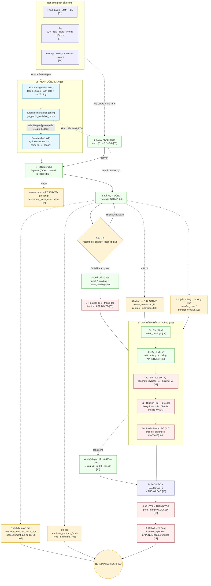
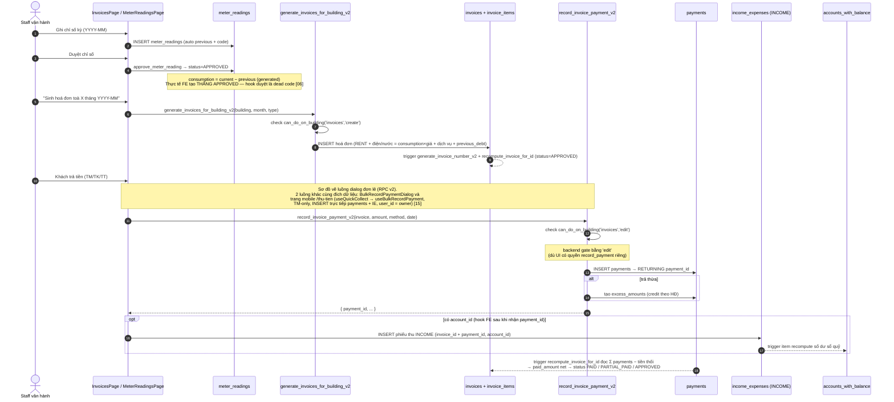
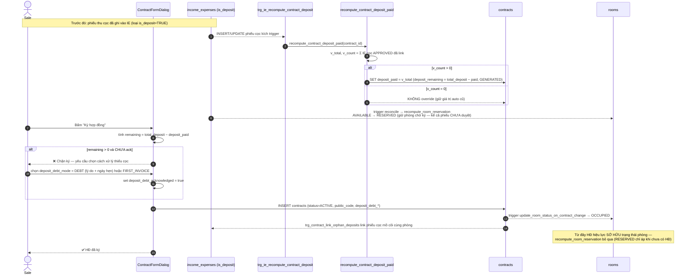
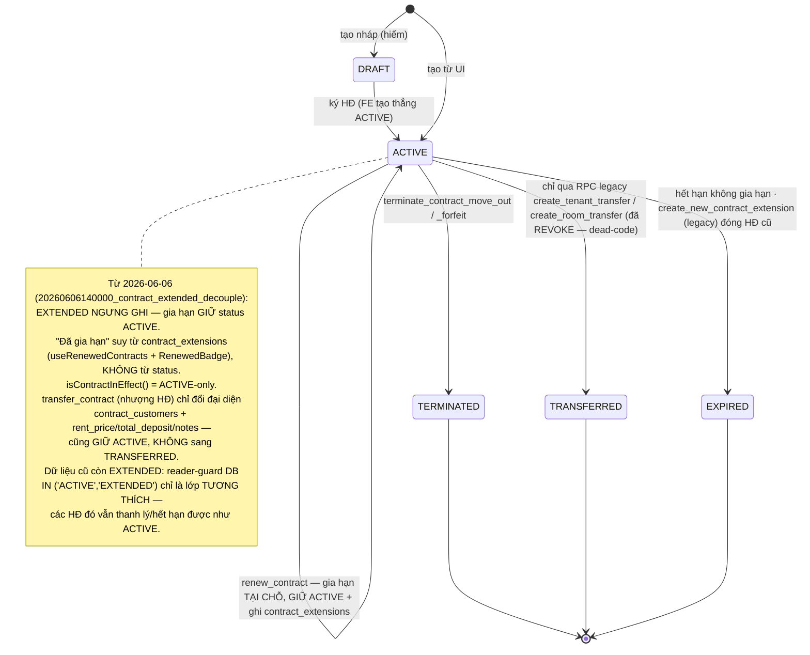
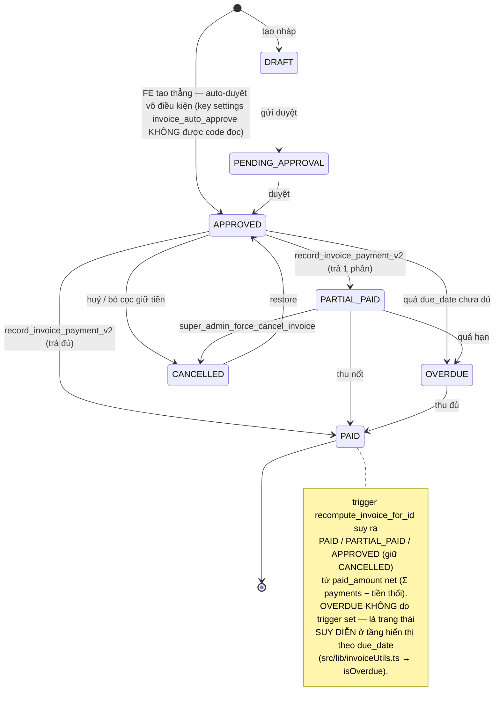
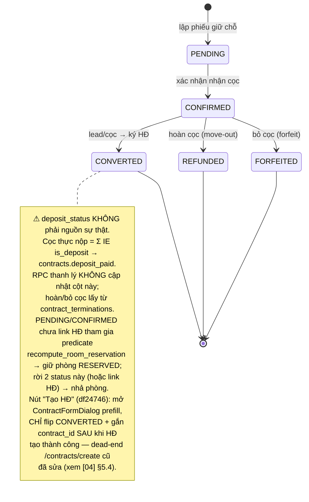
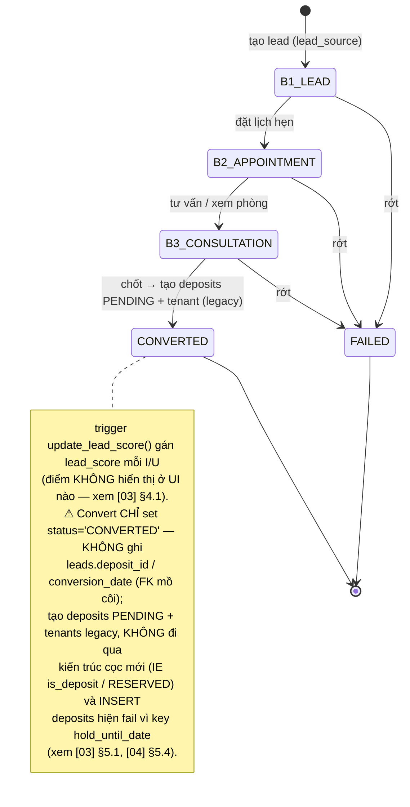

# Quy trình nghiệp vụ tổng — từ Lead đến Lợi nhuận

> Tài liệu **xuyên suốt** mọi domain. Nó không lặp lại chi tiết từng bảng/RPC (đã có trong 15 file domain `01`–`15`) mà nối chúng thành **một dòng chảy end-to-end**: từ khi một phòng trống được **chia sẻ công khai** / một khách hẹn (lead) xuất hiện, đi qua cọc (tự khoá phòng `RESERVED`) → ký hợp đồng → vận hành hàng tháng (chỉ số → hoá đơn → thu tiền → sổ quỹ) → báo cáo → và cuối cùng **chia lợi nhuận cho cổ đông**. Mỗi khâu chỉ ra: **ai làm**, **page nào**, **hook/RPC/bảng nào ghi**, **trigger/side-effect gì**, **chứng từ sinh ra**.
>
> Đọc kèm: [01-phan-quyen-nhan-su](01-phan-quyen-nhan-su.md), [02-co-cau-toa-nha-phong-dich-vu](02-co-cau-toa-nha-phong-dich-vu.md), [03-khach-hang-lead-ho-so](03-khach-hang-lead-ho-so.md), [04-coc-giu-cho](04-coc-giu-cho.md), [05-hop-dong](05-hop-dong.md), [06-cong-to-chi-so](06-cong-to-chi-so.md), [07-hoa-don-thanh-toan](07-hoa-don-thanh-toan.md), [08-thu-chi-so-quy](08-thu-chi-so-quy.md), [09-kho-vat-tu](09-kho-vat-tu.md), [10-tai-san](10-tai-san.md), [11-cong-viec-su-co](11-cong-viec-su-co.md), [12-co-dong-loi-nhuan](12-co-dong-loi-nhuan.md), [13-bao-cao-dashboard-thong-bao](13-bao-cao-dashboard-thong-bao.md), [14-cai-dat-danh-muc-tai-lieu](14-cai-dat-danh-muc-tai-lieu.md), [15-kenh-cong-khai-sale-thu-tien](15-kenh-cong-khai-sale-thu-tien.md).

---

## 0. Tiền đề: nền tảng cấu hình & phân quyền

Trước khi *bất kỳ* chứng từ nào được tạo, hai domain "nền" phải sẵn sàng:

- **Phân quyền & nhân sự** ([01](01-phan-quyen-nhan-su.md)): mỗi request được phân loại caller theo cây logic `super_admin → owner → tenant_admin (role __superadmin) → staff thường → cổ đông`. Engine RLS hiện hành là bộ helper **RBAC theo toà** (`can_access_building` / `can_do_on_building` / `can_access_org_entity` / `building_of_*` — Tier-2 aware qua `COALESCE(sa.permissions, r.permissions)`, xem [01] §4.3) + `is_super_admin` / `is_admin` (bypass); `staff_can` chỉ còn **legacy trên 3 bảng** accounts/settings/notifications ([01] §4.4). `get_my_permissions()` trả snapshot quyền (Tier 1 role template → Tier 2 `staff_assignments.permissions` override).
- **Cơ cấu BĐS + danh mục** ([02](02-co-cau-toa-nha-phong-dich-vu.md), [14](14-cai-dat-danh-muc-tai-lieu.md)): phải có **toà → tầng → phòng** (`buildings → floors → rooms`; `areas` chỉ là nhãn nhóm toà tuỳ chọn cho bộ lọc `BuildingMultiSelect` — xem [00 §7]) và **dịch vụ/định mức** (`services`, `building_services`, `service_quotas`). `code_sequences` + `generate_code` / `generate_next_code` là engine sinh mã **mồ côi** (FE/trigger không gọi — số HĐ/hoá đơn sinh bằng trigger riêng, xem [14] §4.5). `settings` (JSONB key-value) trên danh nghĩa là **công tắc hành vi** (`invoice_auto_approve`, `invoice_payment_deadline_days`, `contract_e_signing_enabled`…) nhưng ⚠️ hiện **chỉ `payment_auto_approve` có consumer thật** — 19/20 key là "cấu hình ma" ([14] §5.1). `seed_default_settings(p_user_id)` gieo ~20 key mặc định.

Mọi `building_id` / `room_id` xuất hiện ở các khâu sau đều **neo về domain [02]** này; mọi `user_id` (owner) + quyền staff đều neo về **[01]**.

---

## 1. Bản đồ vòng đời tổng

**Nguyên tắc bất biến xuyên suốt:**

- **Một phòng chỉ có một HĐ đang hiệu lực** tại một thời điểm. "Đang hiệu lực" từ 2026-06-06 **CHỈ là `ACTIVE`** (`isContractInEffect()` / `ACTIVE_CONTRACT_STATUSES = ['ACTIVE']` — [contract.ts](../../src/types/contract.ts)). **`EXTENDED` đã NGƯNG GHI** ([20260606140000](../../supabase/migrations/20260606140000_contract_extended_decouple.sql)): gia hạn GIỮ `ACTIVE`, "đã gia hạn" suy từ `contract_extensions` (`useRenewedContracts` + `RenewedBadge`); guard `IN ('ACTIVE','EXTENDED')` còn sót trong trigger/RPC DB chỉ là lớp **tương thích dữ liệu cũ**.
- **Phòng trống có cọc giữ chỗ tự khoá `RESERVED`** — [`recompute_room_reservation`](../../supabase/migrations/20260608000000_room_reservation_reconcile.sql) (SECURITY DEFINER, idempotent) chuyển `AVAILABLE ↔ RESERVED` theo việc phòng còn cọc chưa-link-HĐ (`deposits` PENDING/CONFIRMED **hoặc** phiếu thu IE có item `is_deposit` — **kể cả phiếu chưa duyệt**, chỉ loại CANCELLED); không đụng OCCUPIED/MAINTENANCE/UNAVAILABLE. Phòng RESERVED ẩn khỏi bucket "trống" toàn FE và hiện như `rented` trên `/r/:token`.
- **`income_expenses` (APPROVED, `deleted_at IS NULL`) là canonical ledger** — nguồn sự thật duy nhất cho số dư sổ quỹ, dòng tiền và P&L; tránh double-count bằng cách báo cáo luôn đọc về đây.
- **Cọc thực nộp = Σ phiếu thu `is_deposit`**, KHÔNG phải `deposits.status` (xem [04]). Tiền cọc nằm trên sổ quỹ riêng **"CỌC (giữ hộ khách)"** (1 sổ/owner — `get_or_create_deposit_account`); thanh lý tất toán sổ này về 0 cho mỗi HĐ (xem [05] §4.3/§4.4).
- **Tiền chỉ "có thật" khi phiếu IE ở trạng thái APPROVED** — DRAFT/UNAPPROVED/CANCELLED không vào số dư.

---

## 2. Từng giai đoạn — mô tả từng bước

### Giai đoạn 0b — KÊNH CÔNG KHAI: chia sẻ phòng trống → khách xem → cọc nhanh · [15]

Nhánh **tiền-lead** mới (2026-06), chạy song song trước Giai đoạn 1–2:

- **Chuẩn bị (owner/sale có quyền `sale_phong`):** trang [SalePhongPage](../../src/pages/sale-phong/SalePhongPage.tsx) (`/sale-phong`, gate `RequirePermission module="sale_phong"`) — 4 tab: tạo/thu hồi **token chia sẻ** (`public_room_share_tokens`), cài đặt hiển thị (`public_room_settings`: `soon_days`, hotline), upload **ảnh sale** (`rooms.images`/`buildings.images` → bucket **PUBLIC** `room-sale-images` — ngoại lệ duy nhất của quy ước bucket private), editor kéo-thả **sơ đồ tầng** (`buildings.floor_layouts` jsonb).
- **Khách xem (anon, không đăng nhập):** mở `/r/:token` ([PhongTrongPage](../../src/pages/phong-trong/PhongTrongPage.tsx), route ngoài `ProtectedRoute`, lazy-load CSS cô lập) → RPC public `get_public_available_rooms` (SECURITY DEFINER, grant `anon`, scope theo owner của token). `status_public` (`free`/`soon`/`rented`) suy từ **hợp đồng** `ACTIVE/EXTENDED` (không phải `rooms.status`); phòng `RESERVED` rơi vào nhánh `ELSE 'rented'` → **ẩn khỏi danh sách trống**. Khách bấm **Gọi / Zalo / Chỉ đường / Chia sẻ** → trở thành lead (Giai đoạn 1) — không ghi gì vào DB.
- **Cọc nhanh (⚠️ WIP chưa commit):** sale **đang đăng nhập** mở cùng link, có quyền `sale_phong.create_deposit` → [QuickDepositModal](../../src/pages/phong-trong/QuickDepositModal.tsx) tạo **phiếu thu** `income_expenses` INCOME `contract_id=NULL` vào sổ **"CỌC (giữ hộ khách)"** (`get_or_create_deposit_account`) + hạng mục "Tiền cọc" `is_deposit=TRUE` (RPC mới [`ensure_room_deposit_type`](../../supabase/migrations/20260608100000_ensure_room_deposit_type_rpc.sql)) → trigger khoá phòng `RESERVED` realtime, phòng rời danh sách trống của **mọi** link chia sẻ. Số tiền bỏ trống mặc định **1đ** (chỉ giữ chỗ — lưu ý rác sổ quỹ, xem [04] §5.7). Đi tiếp vào Giai đoạn 2.

### Giai đoạn 1 — LEAD (Khách hẹn) · [03]

- **Ai:** sale/staff được giao toà. **Page:** [LeadsPage.tsx](../../src/pages/leads/LeadsPage.tsx) (phễu Kanban B1→B2→B3).
- **Bước:** staff tạo lead (nguồn `lead_source`: FACEBOOK/ZALO/PHONE/REFERRAL/WALK_IN/WEBSITE/OTHER), gán `assigned_staff_id` (→ `profiles`), `building_id`/`room_id` quan tâm.
- **Ghi:** bảng `leads`; mỗi tương tác ghi `lead_activities`.
- **Side-effect:** trigger `update_lead_score()` (BEFORE I/U) gán `NEW.lead_score`; `calculate_lead_score()` dùng để backfill. Kéo thẻ qua các cột đổi `lead_status`: `B1_LEAD → B2_APPOINTMENT → B3_CONSULTATION`.
- **Kết quả:** lead chuyển trạng thái `CONVERTED` (đi tiếp sang cọc/HĐ) hoặc `FAILED`. ⚠️ Convert đi đường **legacy và hiện hỏng runtime**: dialog tạo `deposits` PENDING + `tenants` DEPOSITED nhưng gửi key `hold_until_date` trong khi cột DB là `hold_until` → INSERT fail; hook chỉ set `leads.status='CONVERTED'`, **KHÔNG** ghi `leads.deposit_id`/`conversion_date` (FK mồ côi), không tạo `customers`, không đi qua kiến trúc cọc mới (IE `is_deposit` → `deposit_remaining`/RESERVED) — xem [03] §5.1, [04] §5.4.

### Giai đoạn 2 — CỌC giữ chỗ · [04]

- **Ai:** sale. **Page:** [DepositsPage.tsx](../../src/pages/deposits/DepositsPage.tsx) (4 tab: Tổng quan / Đủ-Thiếu cọc / Hoàn-Bỏ cọc / Phiếu giữ chỗ) hoặc dialog convert lead.
- **Bước:** lập phiếu giữ chỗ (`deposits`, mã `DCxxxxxx` qua trigger `deposits_set_code`) cho `tenant_id` + `room_id` (⚠️ form hiện gửi `hold_until_date` thay vì cột thật `hold_until` → INSERT/UPDATE fail — xem [04] §5.4). **Tiền cọc thực nộp** được ghi như một **phiếu thu** `income_expenses` thuộc loại có cờ `is_deposit=TRUE` ([08]).
- **Entry-point thứ 3 (⚠️ WIP chưa commit):** "Cọc nhanh" ngay trên trang công khai `/r/:token` (Giai đoạn 0b) — phiếu thu INCOME `contract_id=NULL` vào sổ **"CỌC (giữ hộ khách)"**, hạng mục "Tiền cọc" qua RPC `ensure_room_deposit_type` — xem [15] §4.6, [04] §5.7.
- **Side-effect giữ phòng (tự động — 2026-06-07):** mọi biến động trên `deposits` / `income_expenses` (+items) / `rooms` kích trigger gọi [`recompute_room_reservation`](../../supabase/migrations/20260608000000_room_reservation_reconcile.sql): phòng `AVAILABLE` còn cọc chưa-link-HĐ (deposits PENDING/CONFIRMED **hoặc** phiếu thu có item `is_deposit` — **kể cả phiếu chưa duyệt**, chỉ loại CANCELLED) → `rooms.status='RESERVED'`; hết cọc / huỷ / hoàn / link HĐ → tự gỡ về `AVAILABLE`. Không can thiệp khi phòng có HĐ hiệu lực (OCCUPIED do HĐ sở hữu). FE tách bucket **"Đã cọc"** riêng; trang công khai `/r/:token` xếp RESERVED vào `rented`.
- **Side-effect khi tạo HĐ:** trigger `trg_contract_link_orphan_deposits` tự **link** các phiếu IE cọc "mồ côi" cùng phòng (cửa sổ 7 ngày) vào HĐ; trigger `trg_ie_recompute_contract_deposit` + `trg_ie_items_recompute_deposit` gọi `recompute_contract_deposit_paid` để đẩy Σ cọc APPROVED vào `contracts.deposit_paid`.
- **Chứng từ:** phiếu giữ chỗ `DCxxxxxx` + phiếu thu cọc IS_DEPOSIT.
- **Lưu ý:** `deposit_status` (PENDING/CONFIRMED/CONVERTED/REFUNDED/FORFEITED) **không phải nguồn sự thật** — RPC thanh lý không cập nhật cột này; nhưng PENDING/CONFIRMED chưa-link-HĐ **có** tham gia predicate giữ phòng RESERVED ở trên.

### Giai đoạn 3 — KÝ HỢP ĐỒNG · [05]

- **Ai:** staff có quyền `contracts:create` trên toà. **Page:** [ContractsPage.tsx](../../src/pages/contracts/ContractsPage.tsx) → ContractFormDialog.
- **Bước:** chọn phòng + khách (qua junction `contract_customers`, đúng **1 đại diện** — trigger `check_contract_representative()`), nhập `rent_price`, `payment_cycle`, `total_deposit`, dịch vụ áp dụng (`contract_services` với đơn giá riêng + chỉ số đầu).
- **Kiểm tra cọc (gate):** form tính `deposit_remaining = total_deposit − deposit_paid`. Nếu thiếu, **chặn ký** trừ khi admin đặt `deposit_debt_mode` = `DEBT` (cho nợ, kèm `deposit_debt_reason` + `deposit_topup_due_date`) hoặc `FIRST_INVOICE` (thu đủ trong hoá đơn đầu) và bật `deposit_debt_acknowledged`. (Sơ đồ tuần tự ở mục 3b.)
- **Ghi:** `contracts` (status set thẳng `ACTIVE`, `contract_number` sinh bởi trigger, `public_code` 6 ký tự cho link QR `/c/:code`), `contract_customers`, `contract_services`.
- **Side-effect:** trigger `update_room_status_on_contract_change()` đặt `rooms.status = OCCUPIED` (active-set của trigger vẫn là `IN ('ACTIVE','EXTENDED')` — lớp tương thích, xem [05] §4.1); từ lúc HĐ hiệu lực, `recompute_room_reservation` **bỏ qua** phòng này (RESERVED chỉ áp cho phòng chưa có HĐ). Trigger `trg_contract_link_orphan_deposits` link phiếu cọc mồ côi cùng phòng vào HĐ — form cảnh báo trước số cọc giữ chỗ đã thu (`useOrphanDepositVouchers`). Form tạo HĐ **tự tạo phiếu thu cọc** vào sổ **"CỌC (giữ hộ khách)"** (`get_or_create_deposit_account` — 1 sổ/owner, xem [05] §4.4) — từ df24746 phiếu auto **chỉ ghi PHẦN CHÊNH** `deposit_paid − Σ phiếu mồ côi` (hết double-count) — và có thể mở **phiếu hoa hồng** (CommissionVoucherModal) trạng thái UNAPPROVED trong `income_expenses` ([08]). Nếu HĐ tạo từ flow Cọc giữ chỗ (prefill `depositId`) → phiếu `deposits` flip `CONVERTED` + gắn `contract_id` **sau khi** HĐ tạo thành công.
- **Chứng từ:** HĐ + phiếu thu cọc (sổ CỌC) + (tuỳ cấu hình) hoá đơn tháng đầu.

### Giai đoạn 4 — CHỐT CHỈ SỐ ĐẦU · [06]

- **Ai:** staff vận hành. **Page:** form HĐ (cột `initial_electricity_reading` / `initial_water_reading`) và/hoặc [MeterReadingsPage.tsx](../../src/pages/meter-readings/MeterReadingsPage.tsx).
- **Bước:** ghi mốc chỉ số điện/nước lúc nhận phòng. Đây là **previous** cho kỳ chỉ số đầu tiên — `consumption` (cột generated) của kỳ sau = current − previous.
- **Ghi:** `contracts.initial_*_reading` + (nếu lập reading) `meter_readings` (gắn `meters` theo room+service). Trigger `auto_populate_previous_reading` lấy chỉ số kỳ trước.
- **Kết quả:** hệ thống có đủ mốc để tính tiền điện/nước cho dịch vụ `pricing_type = DON_GIA_CO_DINH_DONG_HO`.

### Giai đoạn 5 — HOÁ ĐƠN CỌC + THÁNG ĐẦU · [07]

- **Ai:** staff. **Page:** [InvoicesPage.tsx](../../src/pages/invoices/InvoicesPage.tsx) hoặc tạo ngay trong flow ký HĐ (preview hoá đơn tháng đầu chỉnh được trong ContractFormDialog, kèm KM tháng đầu — xem [05] §5.1).
- **Bước:** dựng hoá đơn tháng đầu = tiền thuê (theo `start_billing_date`) + dịch vụ + (nếu `FIRST_INVOICE`) phần cọc còn thiếu. `firstInvoiceBuilder` đánh dấu dòng điện/nước `METERED_PRICING`.
- **Ghi:** `invoices` + `invoice_items`. Số HĐ sinh bởi trigger `generate_invoice_number_v2`; trạng thái **FE tạo thẳng `APPROVED`** (key settings `invoice_auto_approve` là "cấu hình ma" — không code nào đọc, xem [14] §5.1).
- **Chứng từ:** hoá đơn tháng đầu (+ hoá đơn cọc nếu tách riêng).

### Giai đoạn 6 — VẬN HÀNH HÀNG THÁNG (vòng lặp lõi)

Lặp lại mỗi kỳ `billing_month` (YYYY-MM):

1. **6a · Ghi chỉ số** ([06]): staff nhập `meter_readings` (mã `CSS{YYMM}{seq}`), hoặc import Excel qua `bulk_create_meter_readings(p_readings jsonb)` (⚠️ hiện **hỏng runtime** — hook gửi `p_user_id` không có trong signature live → PGRST202, xem [06] §4.7). Triggers `auto_populate_meter_reading_fields` / `auto_populate_previous_reading` / `auto_generate_reading_code` điền sẵn trường (settlement_month/previous_reading bị trigger **ghi đè** kể cả khi client truyền — [06] §4.1/§4.2).
2. **6b · Duyệt** ([06]): RPC `approve_meter_reading` / `bulk_approve_meter_readings` tồn tại nhưng các hook duyệt FE là **dead code** — đường chạy thật: form Thêm chỉ số tạo **thẳng APPROVED**; các dialog hoá đơn (Generate/Excel) cũng tự INSERT reading APPROVED khi lập hoá đơn điện ([06] §6). Chỉ chỉ số APPROVED mới được chọn lên hoá đơn.
3. **6c · Sinh hoá đơn kỳ** ([07]): `generate_invoices_for_building_v2(p_building_id, p_billing_month, p_invoice_type)` (RBAC, delegate xuống v1). Dòng điện/nước = `consumption × unit_price`; tiền thuê + dịch vụ cố định từ `contract_services`/`building_services` + bậc thang `service_quota_tiers`; cộng `previous_debt` (nợ kỳ trước, lưu `previous_debt_sources`). Trigger `recompute_invoice_for_id` suy `status` + `paid_amount` net.
4. **6d · Thu tiền** ([07]): **3 luồng cùng đích dữ liệu** — ① dialog đơn lẻ: `record_invoice_payment_v2(p_invoice_id, p_amount, p_payment_method, p_payment_date, …)` — kiểm `can_do_on_building`, tạo dòng `payments` (TM/TK/TT); khách trả thừa → `excess_amounts` (credit theo HĐ); ② **thu hàng loạt** (BulkRecordPaymentDialog → `useBulkRecordPayment`, insert trực tiếp); ③ trang mobile **`/thu-tien`** ([15] §4.7): `useQuickCollect` bọc `useBulkRecordPayment` đúng 1 item **TM-only**, `user_id` của payment/phiếu = **owner hoá đơn** (không phải staff), resolve sổ TM theo **TÊN** ("…Thu" → "Chung" → trùng tên toà — throw nếu thiếu), tự làm tròn residual < 10K qua sổ "Làm tròn tiền thiếu".
5. **6e · Vào sổ quỹ** ([08]): RPC `record_invoice_payment_v2` **không** chèn `income_expenses` — phiếu thu INCOME do **hook FE `useRecordPaymentRPC`** ([useInvoicePayments.ts](../../src/hooks/useInvoicePayments.ts)) tạo **sau** khi RPC trả `payment_id`, và **chỉ khi có `account_id`**. Phiếu INCOME gắn `invoice_id + payment_id`, `account_id` đẩy tiền vào sổ quỹ tương ứng (gợi ý `buildings.default_account_id_tt/tk`). Trigger item recompute số dư `accounts_with_balance`. Trigger `recompute_invoice_for_id` trên `payments` đọc Σ payments (trừ phiếu chi "Tiền thối" trong IE) để tính `paid_amount` **net**, suy `status` = PAID/PARTIAL_PAID/APPROVED và làm tròn dư < 10K (OVERDUE suy ở tầng hiển thị theo `due_date`, không do trigger set).

> **Vận hành phụ song song** ([09]/[10]/[11]): khách/staff báo **sự cố** (`issues`, có SLA + workflow) hoặc lập **công việc** (`jobs`, mã `JOB-YYYYMMDD-NNNN`). Khi xử lý có thể **xuất vật tư** (`material_usages.job_id`, snapshot `unit_cost_at_usage`) hoặc bàn giao **tài sản** (`asset_handovers.contract_id`). Chi phí này hiện chưa tự sinh phiếu IE nhưng là dữ liệu chi phí cho phân tích.

### Giai đoạn 7 — BÁO CÁO · DASHBOARD · THÔNG BÁO · [13]

- **Đọc tổng hợp:** Dashboard KPI (lấp đầy, doanh thu tháng, công nợ) + ~19 báo cáo BĐS/Tài chính, tất cả **read-only** (không RPC riêng), đọc canonical từ `income_expenses` (dòng tiền) + `invoices`/`payments` (công nợ) + `contracts`/`rooms` (occupancy — quét chỉ HĐ `ACTIVE`, phòng `RESERVED` là bucket riêng "Đã cọc", xem [13] §4.3).
- **Cảnh báo đẩy:** `runScheduledNotifications()` (client, [notificationScheduler.ts](../../src/lib/notificationScheduler.ts)) gọi 4 check → ghi `notifications` (CONTRACT_EXPIRING / PAYMENT_REMINDER / OVERDUE_INVOICE / DEPOSIT_SHORTFALL), trạng thái PENDING(=chưa đọc)→READ.

### Giai đoạn 8 — CHỐT LỢI NHUẬN THÁNG / TOÀ · [12]

- **Ai:** owner. **Page:** [ShareholderProfitPage](../../src/pages/finance/ShareholderProfitPage.tsx) (`/finance/shareholder-profit`).
- **Bước:** chọn tháng + toà → `monthly_building_profit(p_start, p_end, p_building_id)` tính **LN = thu KQKD − chi KQKD** trên dữ liệu owner (chỉ `counts_in_business_result = true` + IE APPROVED, và chỉ tòa thật `is_virtual = false`). Khoá tháng qua `useLockProfitMonth` → upsert `profit_monthly` status `DRAFT → LOCKED` và **snapshot** phân bổ vào `profit_allocations` theo tỷ lệ `building_shareholders`.
- **Chứng từ:** dòng chốt LN (`profit_monthly`) + snapshot phân bổ.

### Giai đoạn 9 — CHIA LỢI NHUẬN CỔ ĐÔNG · [12]

- **Bước:** `useCreateProfitDistribution` sinh **phiếu chi** `income_expenses` (EXPENSE) gắn `shareholder_id`, đặt trên **toà ảo "Chung"** (`is_virtual = true`) và set `business_result_accounting = false`, chọn `account_id` để trừ số dư sổ quỹ. Phiếu này bị loại khỏi P&L **vì nằm trên tòa ảo** (`monthly_building_profit` chỉ tính `is_virtual = false`), không phải nhờ `counts_in_business_result` (giữ mặc định `true`). Cổ đông có `auth_user_id` link → đăng nhập xem read-only theo toà có cổ phần (nhánh cổ đông trong `get_my_permissions` / `can_access_building`).
- **Kết quả:** lợi nhuận biến thành **dòng tiền phân phối** thực cho người góp vốn — khép vòng đời.

### Nhánh biến động HĐ (có thể xảy ra bất cứ lúc nào ở Giai đoạn 6)

- **Gia hạn:** `renew_contract → renew_contract_impl` (bản hiện hành [20260606140000](../../supabase/migrations/20260606140000_contract_extended_decouple.sql)) — gia hạn **TẠI CHỖ** (UPDATE `end_date`/`rent_price`/`total_deposit`) và **GIỮ `status='ACTIVE'`** (KHÔNG còn chuyển `EXTENDED`); ghi `contract_extensions` (`extension_type='UPDATE_EXISTING'`, INSERT chắc — không nuốt lỗi). "Đã gia hạn" hiển thị qua `RenewedBadge` (suy từ `contract_extensions`), không từ status. KHÔNG tạo HĐ mới / `parent_contract_id` — 'tạo-mới' chỉ ở RPC `create_new_contract_extension` (bản mới set HĐ cũ → `EXPIRED`; đã REVOKE client). Trang chi tiết `/contracts/:id` từ df24746 (2026-06-10) dùng **cùng `RenewDialog`/`TerminateDialog` (RPC) như trang danh sách** — bộ dialog legacy (`ExtendContractDialog`/`TerminateContractDialog` + hook deprecated) đã xoá (xem [05] §5.2).
- **Chuyển phòng:** `transfer_room` — đổi `room_id` chính HĐ, chặn phòng bận, tự free phòng cũ / chiếm phòng mới.
- **Nhượng HĐ:** `transfer_contract → transfer_contract_impl` — đổi khách đại diện (`contract_customers`) + `rent_price`/`total_deposit`/`notes`; **GIỮ status `ACTIVE`** (reader-guard `ACTIVE/EXTENDED` chỉ là tương thích dữ liệu cũ), KHÔNG sang TRANSFERRED. Status TRANSFERRED chỉ do RPC legacy `create_tenant_transfer`/`create_room_transfer` (đã REVOKE client, dead-code).
- **Thanh lý move-out:** `terminate_contract_move_out` (bản hiện hành [20260603000022](../../supabase/migrations/20260603000022_termination_deposit_book_transfer.sql) — **net settlement qua sổ CỌC**): ① `_ensure_initial_deposit_voucher` đảm bảo cọc HĐ nằm trên sổ "CỌC (giữ hộ khách)" (backfill nếu thiếu); ② phí phạt **GỘP vào hoá đơn tháng cuối**, mọi hoá đơn nợ được đánh `PAID` bằng `payments`; ③ **chuyển khoản nội bộ** phần cấn trừ (applied = nợ+phạt được cọc gánh): phiếu CHI sổ CỌC (`is_deposit`, ngoài KQKD) + phiếu THU sổ vận hành **"Doanh thu thanh lý"** (**VÀO KQKD** của toà; sổ chọn ưu tiên `buildings.default_account_id_tt` — `_termination_pick_account`); ④ phần ròng `S = (cọc + thừa) − (nợ + phạt)`: `S>0` → 1 phiếu CHI sổ CỌC trả khách; `S<0` → phiếu THU sổ vận hành "Khách trả thêm". Sổ CỌC tất toán về **0 cho mỗi HĐ**. Audit `contract_terminations` ghi `refund_amount = GREATEST(S,0)` (⚠️ trigger legacy `auto_calculate_termination_financials` đè vài cột tài chính — xem [05] §4.2).
- **Bỏ cọc:** `terminate_contract_forfeit` — `termination_type = FORFEIT`, ghi **cọc = doanh thu**, HĐ thành **TERMINATED** (giữ payment đã thu); hoá đơn tháng trùng kỳ có thể bị CANCELLED nhưng HĐ vẫn TERMINATED. (Enum `contract_status` không có CANCELLED — CANCELLED chỉ thuộc `invoice_status`.)
- Tất cả đặt `actual_end_date`, đổi `status → TERMINATED`, trigger đồng bộ `rooms.status → AVAILABLE`. ⚠️ Ngay sau đó trigger reconcile gọi `recompute_room_reservation` — nếu phòng còn **cọc giữ chỗ mồ côi** (chưa link HĐ, chưa huỷ) thì phòng bị đặt lại `RESERVED` ngay (xem [04] §4.11).

---

## 3. Sơ đồ tuần tự — 2 luồng then chốt

### 3a. Sinh hoá đơn hàng tháng → khách thanh toán → vào sổ quỹ

### 3b. Ký HĐ có kiểm tra cọc (chặn ký thiếu cọc)

---

## 4. Sơ đồ trạng thái

### 4a. `contract_status` (HĐ) · [05]

### 4b. `invoice_status` (hoá đơn) · [07]

### 4c. `deposit_status` (phiếu cọc) · [04]

### 4d. `lead_status` (khách hẹn) · [03]

---

## 5. Vận hành định kỳ tự động (pg_cron + client scheduler)

| Cơ chế | Lịch | Gọi gì | Kết quả |
|---|---|---|---|
| **Phiếu lặp định kỳ** ([08]) | pg_cron `0 18 * * *` (= 01:00 giờ VN), job `recurring_vouchers_daily` | `run_recurring_vouchers_job()` (SECURITY DEFINER) → `generate_recurring_vouchers(NULL)` cho **mọi owner** | Sinh phiếu IE con từ phiếu cha `repeat_cycle` (WEEK/MONTH/QUARTER/YEAR); `add_cycle` neo ngày chống drift. Xem [migration cron](../../supabase/migrations/20260603000011_recurring_vouchers_cron.sql). Lưu ý dùng `generate_recurring_vouchers(NULL)` chứ không `_v2` vì v2 cần `auth.uid()` (NULL trong ngữ cảnh cron). |
| **Sinh hoá đơn hàng loạt** ([07]) | thủ công theo nút (chưa cron) | `generate_invoices_for_building_v2(building, month, type)` | Hoá đơn cả toà cho `billing_month`. |
| **Thông báo theo lịch** ([13]) | client mỗi ~6h ([useScheduledNotifications.ts](../../src/hooks/useScheduledNotifications.ts)) | `runScheduledNotifications()` → `checkContractExpiryReminders` / `checkInvoicePaymentReminders` / `checkOverdueInvoices` / `checkDepositTopupReminders` | Ghi `notifications`: `CONTRACT_EXPIRING` (HĐ sắp hết hạn — quét chỉ HĐ `ACTIVE`), `PAYMENT_REMINDER` / `OVERDUE_INVOICE` (hoá đơn), `DEPOSIT_SHORTFALL` (thiếu cọc theo `deposit_topup_due_date`). ⚠️ Mọi check `.eq('user_id', userId)` — **scope theo OWNER**, chỉ sinh khi chính owner online (xem [13] §4.2). |

---

## 6. Ma trận: Sự kiện nghiệp vụ → bảng bị ghi → báo cáo bị ảnh hưởng

| # | Sự kiện (ai) | Page / RPC | Bảng bị GHI (+trigger/side-effect) | Báo cáo / số liệu bị ảnh hưởng |
|---|---|---|---|---|
| 1 | Tạo & nuôi lead (sale) | LeadsPage | `leads`, `lead_activities` (trg `update_lead_score`) | New-leases pipeline, Dashboard sale |
| 2 | Nhận cọc (sale) | DepositsPage / IE | `deposits` (DCxxxxxx), `income_expenses` is_deposit (trg recompute `contracts.deposit_paid`; trg `recompute_room_reservation` → `rooms.status=RESERVED`) | Báo cáo cọc (DepositsReport), số dư sổ quỹ, bucket "Đã cọc" Dashboard, phòng rời danh sách `/r/:token` |
| 3 | Ký HĐ (staff) | ContractFormDialog | `contracts` (ACTIVE), `contract_customers`, `contract_services`; phiếu thu cọc → sổ **CỌC** (`get_or_create_deposit_account`); trg `rooms.status=OCCUPIED` + link cọc mồ côi; (tuỳ) phiếu hoa hồng UNAPPROVED | Occupancy, New-leases, lấp đầy Dashboard |
| 4 | Chốt chỉ số đầu (staff) | form HĐ / MeterReadings | `contracts.initial_*_reading`, `meter_readings` | (mốc cho hoá đơn điện/nước) |
| 5 | Ghi chỉ số (staff) | MeterReadings (FE tạo **thẳng APPROVED** — hook duyệt dead code) + dialog hoá đơn tự INSERT reading | `meter_readings` (APPROVED, consumption generated) | Thống kê chỉ số, đầu vào hoá đơn |
| 6 | Sinh hoá đơn kỳ (staff) | `generate_invoices_for_building_v2` | `invoices`, `invoice_items` (trg số HĐ + recompute) | Doanh thu, công nợ (CustomerDebtReport), Dashboard |
| 7 | Khách thanh toán (staff) | `record_invoice_payment_v2` + hook FE | `payments`, (thừa→`excess_amounts`); `income_expenses` INCOME do **hook FE tạo sau RPC** khi có `account_id`; trg recompute invoice → status | Dòng tiền (CashFlow/DailyCashbook), công nợ, doanh thu, số dư sổ quỹ |
| 8 | Chi phí vận hành (staff) | IncomeExpensePage | `income_expenses` EXPENSE (+ items) | Dòng tiền, tỉ lệ chi phí (ExpenseRatio), P&L |
| 9 | Sự cố / công việc (staff) | TaskManagement | `issues` (SLA), `jobs` (JOB-…); (tuỳ) `material_usages` trừ kho | Dashboard sự cố, chi phí vật tư |
| 10 | Gia hạn (staff) | `renew_contract` | `contracts` (UPDATE end_date/giá — **GIỮ ACTIVE**), `contract_extensions` (UPDATE_EXISTING — nguồn duy nhất của "đã gia hạn") | Renewals-transfers (đọc `contract_extensions`), expiring |
| 11 | Chuyển phòng/Nhượng (staff) | `transfer_room` / `transfer_contract` | `contracts` (room_id; status **GIỮ ACTIVE** — `transfer_contract` chỉ đổi đại diện `contract_customers`), `contract_transfers`; trg `rooms.status` | Renewals-transfers, occupancy |
| 12 | Thanh lý move-out (staff) | `terminate_contract_move_out` | `contracts` (TERMINATED, actual_end_date), `contract_terminations`, hoá đơn nợ+phạt → PAID (`payments`), cặp phiếu **CHI sổ CỌC + THU sổ vận hành "Doanh thu thanh lý"** (KQKD) + phiếu CHI trả khách ròng / THU "Khách trả thêm"; trg `rooms.status=AVAILABLE` (tái-RESERVED nếu còn cọc giữ chỗ mồ côi) | Terminations, phòng trống (Vacant), cọc, dòng tiền, P&L toà |
| 13 | Bỏ cọc (staff) | `terminate_contract_forfeit` | `contracts` (TERMINATED), `contract_terminations` (FORFEIT), hoá đơn PAID cọc=doanh thu | Terminations, doanh thu, cọc |
| 14 | Phiếu lặp tự sinh (cron) | `run_recurring_vouchers_job` | `income_expenses` con | Dòng tiền, P&L |
| 15 | Cảnh báo định kỳ (client) | `runScheduledNotifications` | `notifications` | Trung tâm thông báo, badge Dashboard |
| 16 | Chốt LN tháng (owner) | ShareholderProfit / `monthly_building_profit` | `profit_monthly` (LOCKED), `profit_allocations` | Báo cáo chia LN (ProfitDistribution) |
| 17 | Chia LN cổ đông (owner) | `useCreateProfitDistribution` | `income_expenses` EXPENSE shareholder_id (toà ảo Chung, `business_result_accounting=false`); trg trừ số dư sổ quỹ | Số dư sổ quỹ, ProfitDistribution; **KHÔNG** vào P&L vì nằm trên tòa ảo (`monthly_building_profit` lọc `is_virtual=false`) |
| 18 | Vận hành kênh công khai (owner/sale) | SalePhongPage (4 tab) [15] | `public_room_share_tokens` (tạo/thu hồi), `public_room_settings` (soon_days, hotline), `rooms.images`/`buildings.images` (bucket **PUBLIC** `room-sale-images`), `buildings.floor_layouts`, `rooms.sale_note`/`sale_bonus_note` | Nội dung trang công khai `/r/:token` |
| 19 | Khách xem phòng trống (anon) | `/r/:token` → `get_public_available_rooms` [15] | (read-only — KHÔNG ghi bảng nào) | — (đầu vào lead/cọc ở ngoài hệ thống) |
| 20 | ⚠️ WIP — Cọc nhanh từ `/r/:token` (sale đăng nhập, quyền `sale_phong.create_deposit`) | QuickDepositModal / RPC `ensure_room_deposit_type` [15] | `income_expenses` INCOME `is_deposit` (sổ CỌC, `contract_id=NULL`, mặc định 1đ nếu bỏ trống) + items; trg `recompute_room_reservation` → `rooms.status=RESERVED` | Phòng trống công khai (rời danh sách), cọc, số dư sổ quỹ |
| 21 | Thu tiền mặt mobile (staff) | `/thu-tien` → `useQuickCollect` [15] | `payments` (TM, `user_id` = **owner** HĐ) + `income_expenses` INCOME (sổ resolve theo TÊN "…Thu"→"Chung"→tên toà; làm tròn <10K → metadata + sổ "Làm tròn tiền thiếu"); trg recompute invoice → PAID/PARTIAL_PAID | Dòng tiền, công nợ, số dư sổ quỹ (cùng đích với #7) |

---

### Phụ lục — quy ước trạng thái "tiền có thật"

- **Số dư sổ quỹ & dòng tiền** chỉ tính `income_expenses` có `approval_status = APPROVED` và `deleted_at IS NULL`.
- **P&L / lợi nhuận** (`monthly_building_profit`) lọc `counts_in_business_result = true` **VÀ** chỉ tính tòa thật (`is_virtual = false`). Phiếu cọc `is_deposit` bị loại (mặc định `counts_in_business_result = false`); phiếu chia LN bị loại vì nằm trên **tòa ảo "Chung"** (`is_virtual = true`) — KHÔNG phải nhờ `counts_in_business_result` (phiếu chia LN giữ mặc định `counts_in_business_result = true`, chỉ đặt `business_result_accounting = false`). Tránh gộp hai cờ này.
- **`contracts.deposit_paid`** chỉ bị `recompute_contract_deposit_paid` ghi đè khi có **≥ 1** phiếu IE cọc APPROVED đã link (`v_count > 0`); ngược lại giữ giá trị cũ. (Trigger legacy `trigger_auto_calculate_deposit_paid` từng điền cột này từ `deposits` đã **DROP** 2026-06-10 — [04] §4.6.)
- **`invoice.status` và `paid_amount`** luôn là **kết quả suy diễn** của trigger `recompute_invoice_for_id` (Σ payments − tiền thối, làm tròn < 10K), không set tay.
