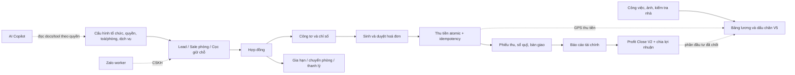

# Quy trình tổng end-to-end

> **Reviewed:** 2026-07-20
> Tài liệu này nối các domain `01`–`21` thành luồng vận hành chung. Chi tiết bảng, RPC và edge case nằm ở tài liệu domain tương ứng; khi có mâu thuẫn, code chạy, migration mới nhất và generated types thắng prose.

## 1. Nền tảng chung

- **Tenant và quyền:** organization, membership, role binding, scope và override là biên hiện hành. UI chỉ phản chiếu quyền; RPC/RLS/`authorize_v2` quyết định cuối cùng. Xem [01 — Phân quyền](01-phan-quyen-nhan-su.md).
- **Canonical writer:** 15/15 route flag đã bật từ 19/07. Một số adapter vẫn giữ fallback có kiểm soát sang writer coexistence cho tới khi hoàn tất T7 drain; client không tự chọn route bằng cờ gửi lên. Xem [Authorization](../authorization/README.md).
- **Phê duyệt tài chính:** request thuộc engine đi qua hộp thư Chờ duyệt; maker không tự duyệt request của mình. Phiếu thu/chi thường tự duyệt, trừ hạng mục `force_approval` hoặc phiếu chi đạt ngưỡng owner cấu hình. Xem [20 — Phê duyệt tài chính](20-phe-duyet-tai-chinh.md).
- **Tiền và báo cáo:** sổ quỹ chỉ tính phiếu hợp lệ, chưa xoá; KQKD dùng `income_expenses.kqkd_amount` để loại cọc và các khoản ngoài KQKD. Mọi thay đổi đụng tiền phải chạy đối chiếu thật.

## 2. Bản đồ luồng chính

## 3. Luồng theo giai đoạn

### 3.1. Khởi tạo và cấu hình

1. Owner tạo organization, mời nhân sự, gán role/binding/scope và quyền theo trang.
2. Khai báo khu vực, toà, tầng, phòng, dịch vụ, định mức, công tơ, sổ quỹ và loại thu/chi.
3. Cấu hình các ranh giới có hiệu lực: sổ mặc định theo phương thức, rule phê duyệt, lương, cổ đông và kênh công khai.

Đọc: [00](00-tong-quan.md), [01](01-phan-quyen-nhan-su.md), [02](02-co-cau-toa-nha-phong-dich-vu.md), [14](14-cai-dat-danh-muc-tai-lieu.md).

### 3.2. Sale, lead và cọc

- Phòng trống có thể được công khai bằng token; sale đăng nhập và có quyền mới được tạo cọc nhanh.
- Cọc giữ chỗ hiện hành là phiếu thu có hạng mục `is_deposit`, có thể chưa gắn hợp đồng. Trigger reservation quyết định phòng chuyển `RESERVED`.
- Khi tạo hợp đồng, hold/cọc hợp lệ được tiêu thụ hoặc liên kết; không dùng bảng cọc legacy làm nguồn sự thật.

Đọc: [03 — Khách hàng](03-khach-hang-lead-ho-so.md), [04 — Cọc](04-coc-giu-cho.md), [15 — Kênh công khai và Thu tiền](15-kenh-cong-khai-sale-thu-tien.md).

### 3.3. Hợp đồng

- Writer hợp đồng canonical đã live, nhưng UI chỉ cắt sang writer khi payload đủ parity; fallback không được phép làm mất field im lặng.
- Hợp đồng có hiệu lực neo khách, phòng, giá thuê, cọc và dịch vụ. Các thao tác gia hạn/chuyển/thanh lý phải đi qua RPC nghiệp vụ, không cập nhật trạng thái rời rạc từ client.

Đọc: [05 — Hợp đồng](05-hop-dong.md), [16 — Thanh lý](16-thanh-ly-hop-dong.md).

### 3.4. Chỉ số và hoá đơn

1. Ghi chỉ số điện/nước theo toà và kỳ; ảnh/bằng chứng đi cùng reading khi flow yêu cầu.
2. Sinh hoá đơn từ tiền phòng, dịch vụ, điện nước, nợ kỳ trước và phần cọc còn thiếu theo nghiệp vụ.
3. Hoá đơn chỉ trở thành khoản phải thu vận hành khi ở trạng thái hợp lệ; trạng thái thanh toán được recompute từ bút toán, không sửa tay.

Đọc: [06 — Công tơ](06-cong-to-chi-so.md), [07 — Hoá đơn và thanh toán](07-hoa-don-thanh-toan.md).

### 3.5. Thu tiền

- `RecordPaymentDialog`, thu hàng loạt và `/thu-tien` cùng dùng adapter `recordInvoicePaymentWithFallback`: thử `record_invoice_payment_v4` canonical trước, chỉ fallback `record_invoice_payment_v3` với tín hiệu coexistence được phân loại rõ.
- Mỗi dòng TM/TK/TT là một RPC atomic gồm payment, recompute hoá đơn, phiếu thu, hạng mục và idempotency. Một batch nhiều hoá đơn vẫn là vòng lặp nhiều transaction; kết quả có thể thành công một phần và phải hiển thị từng lỗi.
- Phần doanh thu/cọc được client chuẩn bị thành payload, còn server ghi all-or-nothing cho dòng thanh toán. Giữ tiền dư thành credit hiện còn bước `excess_amounts` sau RPC và phải được đối chiếu khi xử lý sự cố.
- Hoàn tác canonical tạo bút toán đối ứng và giữ lịch sử; không mặc định xoá cứng payment đã ghi.

Đọc: [07](07-hoa-don-thanh-toan.md), [08 — Thu chi và sổ quỹ](08-thu-chi-so-quy.md), [15](15-kenh-cong-khai-sale-thu-tien.md), [19 — SOP tiền](19-sop-tien-va-so-quy.md).

### 3.6. Sổ quỹ, bàn giao và phê duyệt

- Phiếu thu/chi hợp lệ làm thay đổi số dư sổ; hạng mục quyết định KQKD và rule duyệt.
- Bàn giao tiền mặt và đối soát tạo bằng chứng hai phía; không suy số thật từ 1.000 dòng đầu của REST.
- Request bắt buộc duyệt chỉ được post tiền sau quyết định hợp lệ. Rút request, từ chối và hoàn tác phải giữ audit trail.

Đọc: [08](08-thu-chi-so-quy.md), [19](19-sop-tien-va-so-quy.md), [20](20-phe-duyet-tai-chinh.md).

### 3.7. Lương và công việc

- Việc hoàn thành dùng thời điểm server đóng dấu để tính kỳ/ngoài giờ; ảnh đọc được từ pipeline hoàn thành hiện hành.
- Chủ có thể loại từng việc khỏi thưởng mà vẫn giữ dòng trong bảng kê. V5 chỉ áp từ `system_v5.effective_from`; tháng trước mốc này dùng cơ chế legacy tương ứng.
- Tháng `LOCKED` đọc snapshot, không tính lại từ ledger live. Trả lương tạo phiếu chi và có thể cấn trừ tiền phòng theo flow canonical.

Đọc: [11 — Công việc](11-cong-viec-su-co.md), [17 — Lương thưởng](17-luong-thuong.md), [runbook lương](../bang-luong/README.md).

### 3.8. Lợi nhuận cổ đông

- Profit Close V2 lấy preview server-side, tính nguồn, lương điều hành và phân bổ trong cùng mô hình organization.
- Chốt dùng source hash để chống dữ liệu đổi giữa preview và ghi; chốt lại tạo revision mới và bắt buộc lý do.
- Nếu tháng có snapshot không đồng nhất/legacy, dùng **Đặt lại tháng** với state hash và lý do; lịch sử revision vẫn được giữ.
- Cổ đông/quản lý inactive hoặc đã xoá không nhận allocation mới.

Đọc: [12 — Cổ đông và lợi nhuận](12-co-dong-loi-nhuan.md).

### 3.9. Thanh lý và kết thúc vòng đời

- Gia hạn/chuyển phòng giữ tính liên tục của hợp đồng theo RPC hiện hành.
- Move-out/forfeit tính cọc, nợ, thu thêm, hoàn trả và chứng từ sổ quỹ trong flow nghiệp vụ; không dựa vào chuỗi ghi chú để tự lắp bút toán ở client.
- Sau thanh lý, trạng thái hợp đồng/phòng/hoá đơn phải khớp và các bút toán vẫn truy vết được.

Đọc: [16 — Thanh lý](16-thanh-ly-hop-dong.md).

## 4. Trạng thái và nguồn sự thật

| Đối tượng | Nguồn quyết định | Không làm |
|---|---|---|
| Phòng | trigger/RPC reservation, contract, termination | Không sửa trạng thái phòng độc lập để chữa triệu chứng |
| Hợp đồng | writer/RPC lifecycle | Không ghép nhiều update client thành một giao dịch giả |
| Hoá đơn | invoice writer + recompute payment | Không sửa `paid_amount`/status bằng tay |
| Phiếu thu/chi | canonical writer + approval engine | Không post tiền từ client direct DML khi đã có writer |
| Sổ quỹ | phiếu hợp lệ + khoá kỳ | Không cộng từ tập dữ liệu bị cap 1.000 dòng |
| Lương | ledger live khi DRAFT; snapshot khi LOCKED | Không hồi tố cấu hình qua kỳ đã khoá |
| Lợi nhuận | Profit Close V2 preview/hash/revision | Không xoá snapshot rồi tái tạo bằng nhiều DML client |

## 5. Bề mặt cần theo dõi

- **Coexistence authorization:** 15/15 writer đã ON nhưng T7 drain chưa đồng nghĩa mọi direct-write legacy đã bị revoke.
- **Sổ quỹ theo tên:** một số resolver vẫn phụ thuộc quy ước tên `…Thu`, `…Thối`, `Chung`; đổi tên phải test các luồng thu/bàn giao.
- **AI Copilot:** tool ghi phiếu nháp hiện chưa phải một transaction DB duy nhất. Flow được thiết kế yêu cầu preview/xác nhận, nhưng cờ xác nhận do model truyền và chưa có state server độc lập; không giao quyền duyệt cho AI và không coi đây là authorization boundary cứng.
- **Zalo worker:** service-role, cookie phiên và polling là rủi ro vận hành cần kiểm soát bằng runbook.
- **Tài liệu runtime:** toàn bộ `docs/he-thong/*.md` được Copilot nạp, nên nội dung historical phải nằm ngoài thư mục này hoặc được ghi nhãn rõ.

## 6. Gate khi thay đổi luồng xuyên domain

1. Xác định writer/RPC và invariant tiền/trạng thái bị ảnh hưởng.
2. Chạy test unit/property và `npm run typecheck:baseline`.
3. Migration đụng view phải chạy `node scripts/check-view-invoker.mjs`.
4. Thay đổi tiền phải chạy `node scripts/reconcile-money.mjs [YYYY-MM]`.
5. Test browser headless happy path, edge case và console error.
6. Cập nhật tài liệu domain, README mục lục và tài liệu hướng dẫn người dùng tương ứng.
