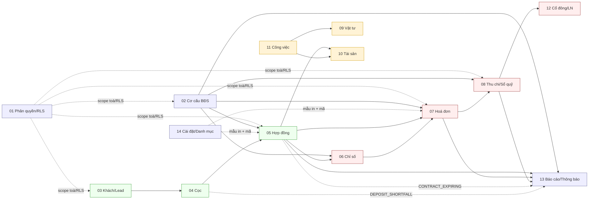

# Tài liệu Hệ thống CRM Quản lý BĐS cho thuê

Bộ tài liệu **cấu trúc dữ liệu + quy trình nghiệp vụ** của toàn bộ ứng dụng (production: <https://ptcrm.vercel.app>).
Mỗi file mô tả một **domain** theo cùng một bố cục: *Tổng quan → Cấu trúc dữ liệu → Sơ đồ quan hệ → Quy tắc nghiệp vụ & tự động hoá → Quy trình từng trang (page) → Liên kết domain khác*.

> **Sơ đồ**: tất cả vẽ bằng [Mermaid](https://mermaid.js.org) trong các khối mã `mermaid`. Xem trực tiếp trên GitHub, VS Code (ext *Markdown Preview Mermaid*), hoặc <https://mermaid.live>.
> **Phạm vi dữ liệu**: 95 bảng · 5 view · 30 enum · ~80 RPC/function nghiệp vụ · 60 sơ đồ. Trích từ schema thật của Supabase (project `tryymsxyyckgbrmmvozx`) tại thời điểm lập tài liệu.

---

## 🗺️ Bắt đầu từ đâu?

1. **[00 — Kiến trúc & Tổng quan](00-tong-quan.md)** — đọc trước: stack, bản đồ 14 domain, mô hình phân quyền, **ER sơ đồ cốt lõi**, tra cứu enum.
2. **[99 — Quy trình nghiệp vụ tổng](99-quy-trinh-tong.md)** — vòng đời end-to-end *Lead → Cọc → Hợp đồng → Chỉ số → Hoá đơn → Thu chi → Báo cáo → Lợi nhuận*, kèm sequence/state diagram.
3. Sau đó tra từng domain theo bảng dưới.

## 📚 Mục lục theo nhóm

### Nền tảng (luôn-sẵn-sàng)
| # | Domain | Bảng chính | Route chính |
|---|--------|-----------|-------------|
| [01](01-phan-quyen-nhan-su.md) | **Phân quyền & Nhân sự** (Auth · Roles · Staff · RLS) | `profiles, roles, staff_assignments, super_admins, departments` | `/login`, `/settings/staff`, `/admin/users` |
| [02](02-co-cau-toa-nha-phong-dich-vu.md) | **Cơ cấu BĐS** (Khu vực · Toà · Tầng · Phòng · Dịch vụ) | `areas, buildings, floors, rooms, services, building_services, service_quotas` | `/areas`, `/buildings`, `/apartments`, `/services`, `/building-map` |
| [14](14-cai-dat-danh-muc-tai-lieu.md) | **Cài đặt · Danh mục · Tài liệu mẫu · Gói cước** | `settings, document_templates, signature_templates, code_sequences, subscription_plans` | `/settings/*`, `/account/subscription` |

### Vòng khách hàng → hợp đồng
| # | Domain | Bảng chính | Route chính |
|---|--------|-----------|-------------|
| [03](03-khach-hang-lead-ho-so.md) | **Khách hàng · Lead · Người thuê · Phương tiện · CT01** | `leads, customers, tenants, vehicles, ct01_declarations, contract_customers/tenants` | `/leads`, `/customers`, `/vehicles` |
| [04](04-coc-giu-cho.md) | **Cọc giữ chỗ** & theo dõi cọc | `deposits, excess_amounts` | `/deposits` |
| [05](05-hop-dong.md) | **Hợp đồng** — gia hạn · chuyển nhượng · thanh lý | `contracts, contract_services/extensions/transfers/terminations, asset_handovers` | `/contracts`, `/contracts/:id` |

### Tài chính & vận hành tháng
| # | Domain | Bảng chính | Route chính |
|---|--------|-----------|-------------|
| [06](06-cong-to-chi-so.md) | **Công tơ & Ghi chỉ số** | `meters, meter_readings` | `/meter-readings`, `/settings/meters` |
| [07](07-hoa-don-thanh-toan.md) | **Hoá đơn & Thu tiền** | `invoices, invoice_items, payments, invoice_audit_log` | `/invoices`, `/c/:code` (công khai) |
| [08](08-thu-chi-so-quy.md) | **Thu chi & Sổ quỹ** (trung tâm dòng tiền) | `income_expenses(+items/batches), income_expense_types/templates, accounts, auto_debt_config` | `/income-expense`, `/finance/cashbooks`, `/finance/refund-log` |
| [12](12-co-dong-loi-nhuan.md) | **Cổ đông · Chia lợi nhuận · Ví cá nhân** | `shareholders, building_shareholders, profit_monthly/allocations, personal_transactions` | `/finance/shareholder-profit`, `/finance/personal-wallet` |

### Tài sản & công việc
| # | Domain | Bảng chính | Route chính |
|---|--------|-----------|-------------|
| [09](09-kho-vat-tu.md) | **Kho vật tư tiêu hao** | `materials, material_purchases/usages/adjustments(+items), suppliers` | `/materials` |
| [10](10-tai-san.md) | **Tài sản & Nội thất** | `assets, asset_categories/movements/maintenance/warehouses/handovers` | `/assets`, `/settings/categories/asset-*` |
| [11](11-cong-viec-su-co.md) | **Công việc · Sự cố · Quy trình** | `jobs, job_types/groups, issues(+history), task_flows/phases, sla_configs` | `/tasks` |

### Tổng hợp
| # | Domain | Bảng chính | Route chính |
|---|--------|-----------|-------------|
| [13](13-bao-cao-dashboard-thong-bao.md) | **Báo cáo · Dashboard · Thông báo** | `notifications(+logs/templates)` + đọc xuyên domain | `/`, `/reports/*`, `/notifications` |

---

## 🔗 Bản đồ phụ thuộc domain (rút gọn)

## 📌 Quy ước đọc tài liệu

- **Link code** dạng `[Tên](src/...)` click thẳng tới file nguồn trong repo.
- **Mã trạng thái** giữ nguyên enum DB (vd `ACTIVE`, `TM/TK/TT`) — xem bảng tra cứu enum ở [00 §6](00-tong-quan.md).
- **EXTENDED = đang hiệu lực**: hợp đồng đã gia hạn được đối xử như `ACTIVE` ở mọi kiểm tra vận hành.
- **Nguồn sự thật số cọc** = tổng phiếu thu chi `is_deposit` (→ `contracts.deposit_paid`), **không** phải `deposits.status` — xem [04](04-coc-giu-cho.md).
- Tài liệu phản ánh schema tại thời điểm lập; khi đổi migration nên cập nhật lại domain tương ứng.
