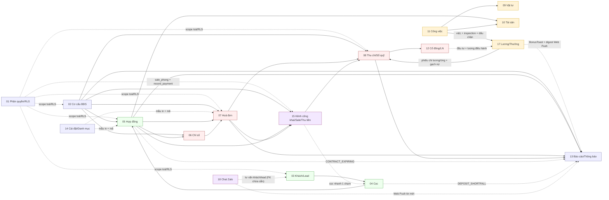

# Tài liệu Hệ thống CRM Quản lý BĐS cho thuê

Bộ tài liệu **cấu trúc dữ liệu + quy trình nghiệp vụ** của toàn bộ ứng dụng (production: <https://ptcrm.vercel.app>).
Mỗi file mô tả một **domain** theo cùng một bố cục: *Tổng quan → Cấu trúc dữ liệu → Sơ đồ quan hệ → Quy tắc nghiệp vụ & tự động hoá → Quy trình từng trang (page) → Liên kết domain khác*.

> **Sơ đồ**: tất cả vẽ bằng [Mermaid](https://mermaid.js.org) trong các khối mã `mermaid`. Xem trực tiếp trên GitHub, VS Code (ext *Markdown Preview Mermaid*), hoặc <https://mermaid.live>.
> **Phạm vi dữ liệu**: ~117 bảng (110 trong `types.ts` regen 2026-06-29 + các bảng áp thẳng qua Management API sau đó: `cashbook_reconciliations` + 6 bảng lương v5) · 6 view · 30 enum · ~130 RPC/function nghiệp vụ · ~75 sơ đồ. Trích từ schema thật của Supabase (project `tryymsxyyckgbrmmvozx`) — cập nhật toàn bộ 2026-07-03.

---

## 🗺️ Bắt đầu từ đâu?

1. **[00 — Kiến trúc & Tổng quan](00-tong-quan.md)** — đọc trước: stack, bản đồ 17 domain, mô hình phân quyền, **ER sơ đồ cốt lõi**, tra cứu enum.
2. **[99 — Quy trình nghiệp vụ tổng](99-quy-trinh-tong.md)** — vòng đời end-to-end *Lead → Cọc → Hợp đồng → Chỉ số → Hoá đơn → Thu tiền → Bàn giao/Đối soát sổ → Báo cáo → Lợi nhuận* (kèm nhánh dấu chân lương v5 + Chat Zalo), sequence/state diagram.
3. Sau đó tra từng domain theo bảng dưới.

## 📚 Mục lục theo nhóm

### Nền tảng (luôn-sẵn-sàng)
| # | Domain | Bảng chính | Route chính |
|---|--------|-----------|-------------|
| [01](01-phan-quyen-nhan-su.md) | **Phân quyền & Nhân sự** (Auth · Roles · Staff · RLS) | `profiles, roles, staff_assignments, super_admins, departments` | `/login`, `/settings/staff`, `/admin/users` |
| [02](02-co-cau-toa-nha-phong-dich-vu.md) | **Cơ cấu BĐS** (Khu vực · Toà · Tầng · Phòng · Dịch vụ) | `areas, buildings, floors, rooms, services, building_services, service_quotas` | `/buildings` (dialog Quản lý khu vực; `/areas` redirect về đây), `/apartments`, `/services`, `/building-map` |
| [14](14-cai-dat-danh-muc-tai-lieu.md) | **Cài đặt · Danh mục · Tài liệu mẫu · Gói cước** | `settings, document_templates, signature_templates, code_sequences, subscription_plans` | `/settings/*`, `/account/subscription` |

### Vòng khách hàng → hợp đồng
| # | Domain | Bảng chính | Route chính |
|---|--------|-----------|-------------|
| [03](03-khach-hang-lead-ho-so.md) | **Khách hàng · Lead · Người thuê · Phương tiện · CT01** | `leads, customers, tenants, vehicles, ct01_declarations, contract_customers/tenants` | `/leads`, `/customers`, `/vehicles` |
| [04](04-coc-giu-cho.md) | **Cọc giữ chỗ** & theo dõi cọc | `deposits, excess_amounts` | `/deposits` |
| [05](05-hop-dong.md) | **Hợp đồng** — gia hạn · chuyển nhượng · thanh lý | `contracts, contract_services/extensions/transfers/terminations, asset_handovers` | `/contracts`, `/contracts/:id` |
| [16](16-thanh-ly-hop-dong.md) | **Thanh lý hợp đồng** (deep-dive) — dòng tiền BỎ CỌC vs RỜI PHÒNG | `contract_terminations, invoices, payments, income_expenses, accounts` | dialog Thanh lý ở `/contracts/:id` |

### Tài chính & vận hành tháng
| # | Domain | Bảng chính | Route chính |
|---|--------|-----------|-------------|
| [06](06-cong-to-chi-so.md) | **Công tơ & Ghi chỉ số** | `meters, meter_readings` | `/meter-readings`, `/settings/meters` |
| [07](07-hoa-don-thanh-toan.md) | **Hoá đơn & Thu tiền** | `invoices, invoice_items, payments, invoice_audit_log` | `/invoices`, `/c/:code` (công khai) |
| [08](08-thu-chi-so-quy.md) | **Thu chi & Sổ quỹ** (trung tâm dòng tiền) | `income_expenses(+items/batches), income_expense_types/templates, accounts, auto_debt_config` | `/income-expense`, `/finance/cashbooks`, `/finance/refund-log` |
| [12](12-co-dong-loi-nhuan.md) | **Cổ đông · Chia lợi nhuận · Ví cá nhân** — trừ lương điều hành trước khi chia | `shareholders, building_shareholders, profit_monthly/allocations, profit_managers(+salaries/allocations), personal_transactions` | `/reports/finance/profit-distribution` (ProfitHubPage — URL cũ `/finance/shareholder-profit` redirect), `/finance/personal-wallet` |
| [17](17-luong-thuong.md) | **Bảng lương & Thưởng** — lương v3 từ việc/HĐ thật · thưởng tức thời · V5 "dấu chân" (flags OFF, shadow) | `manager_salary_config, salary_monthly(+adjustments), salary_bonus_rules, inspection_sessions(+photos), salary_attendance_day, salary_streak_state` | `/finance/salary`, `/finance/my-salary`, `/my-day`, `/reports/coverage` |

### Tài sản & công việc
| # | Domain | Bảng chính | Route chính |
|---|--------|-----------|-------------|
| [09](09-kho-vat-tu.md) | **Kho vật tư tiêu hao** | `materials, material_purchases/usages/adjustments(+items), suppliers` | `/materials` |
| [10](10-tai-san.md) | **Tài sản & Nội thất** | `assets, asset_categories/movements/maintenance/warehouses/handovers` | `/assets`, `/settings/categories/asset-*` |
| [11](11-cong-viec-su-co.md) | **Công việc · Sự cố · Quy trình** | `jobs, job_types/groups, issues(+history), task_flows/phases, sla_configs` | `/tasks` |

### Tổng hợp & kênh công khai
| # | Domain | Bảng chính | Route chính |
|---|--------|-----------|-------------|
| [13](13-bao-cao-dashboard-thong-bao.md) | **Báo cáo · Dashboard · Thông báo** | `notifications(+logs/templates)` + đọc xuyên domain | `/`, `/reports/*`, `/notifications` |
| [15](15-kenh-cong-khai-sale-thu-tien.md) | **Kênh công khai & mobile** — Phòng trống công khai · Sale Phòng · Thu tiền mặt | `public_room_share_tokens, public_room_settings, public_room_events` + cột sale trên `buildings/rooms` (`floor_layouts, sale_note…`) | `/r/:token` (công khai, anon), `/sale-phong`, `/thu-tien` |
| [18](18-zalo-chat.md) | **Chat Zalo** — nhắn tin 2 chiều qua worker zca-js (ngoài Vercel, service-role) · nhãn + broadcast · Web Push tin mới | `zalo_accounts, zalo_conversations, zalo_messages, zalo_send_queue, zalo_labels, zalo_message_templates, zalo_automations` | `/chat-zalo` |

---

## 🔗 Bản đồ phụ thuộc domain (rút gọn)

## 📌 Quy ước đọc tài liệu

- **Link code** dạng `[Tên](src/...)` click thẳng tới file nguồn trong repo.
- **Mã trạng thái** giữ nguyên enum DB (vd `ACTIVE`, `TM/TK/TT`) — xem bảng tra cứu enum ở [00 §6](00-tong-quan.md).
- **Gia hạn giữ nguyên `ACTIVE`** (từ 2026-06-06): status `EXTENDED` đã **ngưng ghi** — hợp đồng gia hạn vẫn là `ACTIVE`, `isContractInEffect()` chỉ tính `ACTIVE`; "đã gia hạn" suy từ bảng `contract_extensions` (hook `useRenewedContracts` + `RenewedBadge`). Một số trigger DB còn nhận `EXTENDED` chỉ là lớp tương thích — xem [05](05-hop-dong.md).
- **Nguồn sự thật số cọc** = tổng phiếu thu chi `is_deposit` (→ `contracts.deposit_paid`), **không** phải `deposits.status` — bảng `deposits` là **legacy đã chết** (0 dòng, không UI ghi); phiếu giữ chỗ thật = phiếu thu IE mồ côi — xem [04](04-coc-giu-cho.md).
- **Khu vực = nhãn nhóm toà, không phải đơn vị quyền** (từ 2026-06-10): trang `/areas` đã gỡ (quản lý qua dialog trong `/buildings`). **Ô LỌC toà toàn app = `BuildingFilterSelect` phẳng ĐƠN-CHỌN** (3c3b7fa — 1 toà hoặc tất cả, state giữ shape mảng 0/1 phần tử, `[] = tất cả`); `BuildingMultiSelect` (nhóm theo khu) **chỉ còn** cho màn scope/cấu hình (gán phạm vi staff, ProfitManagerForm, ManageAreasDialog) — xem [00 §7](00-tong-quan.md) và [02 §5.1](02-co-cau-toa-nha-phong-dich-vu.md).
- **Bộ lọc giữ qua F5** (7fd2d3f): state ô lọc toàn app dùng `usePersistedState` (sessionStorage, key quy ước `flt:<trang>:<state>`); URL param **thắng** giá trị khôi phục; không persist dialog/selection/pagination — trang mới có filter phải theo quy ước này.
- **Hạch toán KQKD item-level qua `income_expenses.kqkd_amount`** (2026-07-02, migration `20260702120000` — đã áp live qua Management API, loạt FE working-tree chưa commit): 1 lần thu = **ĐÚNG 1 phiếu thu trộn** doanh thu + cọc (item cọc `is_deposit` trên cùng phiếu); báo cáo P&L/`fa_*` cộng `SUM(kqkd_amount)` — phần cọc tự loại, `counts_in_business_result` chỉ còn là cờ filter/badge — xem [08 §4.5](08-thu-chi-so-quy.md), [07 §5.6](07-hoa-don-thanh-toan.md), [12 §4.1b](12-co-dong-loi-nhuan.md).
- **Cổ đông tách quyền** (2026-07-02, 3cd0d90): cổ đông/quản lý LN thuần chỉ còn **đúng 1 quyền** `shareholder_profit.view`; `can_access_building` **bỏ nhánh cổ đông** (hết đọc bảng vận hành của toà góp vốn); tên toà trang chia LN qua RPC `get_my_share_buildings` — xem [01 §4.7](01-phan-quyen-nhan-su.md), [12](12-co-dong-loi-nhuan.md).
- **Đồng bộ Realtime (cross-cutting)**: cơ chế hub trung tâm invalidate cache React Query khi 5 bảng nghiệp vụ (`invoices, income_expenses, contracts, jobs, customers`) đổi — bản đồ *bảng → query key* + quy tắc bảo trì (tránh lỗi "màn kẹt dữ liệu cũ") xem **[realtime-sync.md](realtime-sync.md)**.
- Các trang nội dung tĩnh `/faq`, `/changelog`, `/app-guide` không có nghiệp vụ dữ liệu — **ngoài phạm vi** bộ tài liệu (bỏ qua có chủ ý).
- Tài liệu phản ánh schema tại thời điểm lập; khi đổi migration nên cập nhật lại domain tương ứng.
