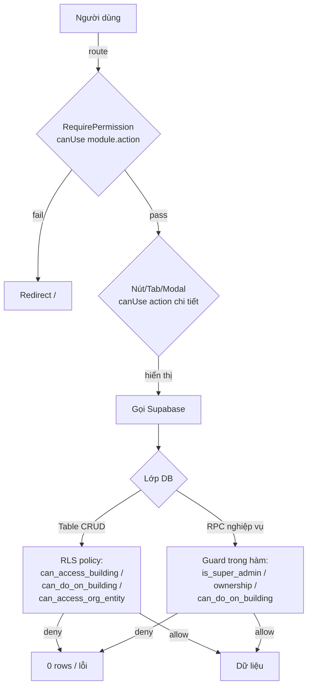

# Audit phân quyền toàn hệ thống — Kiến trúc phân tầng, quyền theo trang & theo chủ thể

> Ngày lập: **2026-07-02**. Nguồn: đọc source (`src/`), migrations (`supabase/migrations/`) **và đối chiếu trực tiếp DB production** (Supabase Management API, read-only). Mọi khẳng định về RLS/RPC trong tài liệu này đã kiểm bằng `pg_policies` + `pg_get_functiondef` **trên DB live** — không chỉ dựa vào migrations (team hay apply SQL thẳng qua API nên migrations có thể lệch).
>
> Đây là tài liệu audit + đánh giá, **không kèm thay đổi code**. Các đề xuất ở Chương 6 để chủ dự án quyết định cắt ticket.

---

## Mục lục

1. [Kiến trúc phân tầng chủ thể](#1-kiến-trúc-phân-tầng-chủ-thể)
2. [Cơ chế kỹ thuật (FE + DB)](#2-cơ-chế-kỹ-thuật)
3. [Phân quyền chi tiết theo trang / tab / modal](#3-phân-quyền-theo-trang)
4. [Phân quyền theo chủ thể dữ liệu (RLS per table)](#4-phân-quyền-theo-chủ-thể-dữ-liệu)
5. [Trạng thái phân quyền THẬT trên production](#5-trạng-thái-thật-trên-production)
6. [Đánh giá tính hợp lý & phát hiện](#6-đánh-giá--phát-hiện)

---

## 1. Kiến trúc phân tầng chủ thể

Hệ thống dùng RBAC theo **5 tầng chủ thể**, phân tách theo *ai* (danh tính) và *phạm vi tòa nhà* (scope):

| Tầng | Chủ thể | Xác định bởi | Phạm vi |
|---|---|---|---|
| 0 | **Super admin** (nền tảng) | bảng `super_admins` → `is_super_admin()` | Bypass **mọi** RLS, xuyên tenant |
| 1 | **Admin / Chủ tài khoản** | role có sentinel `{"__superadmin":true}` **hoặc** `name='Admin'` → `is_admin()` | Bypass RLS trong tenant của mình |
| 2 | **Nhân viên** (staff) | `staff_assignments` (role template + override JSONB) | Theo **scope**: full / 1 tòa / 1 khu (live) |
| 3 | **Cổ đông / Quản lý lợi nhuận** | `shareholders.auth_user_id` / `profit_managers.auth_user_id` | **Chỉ** trang Phân bổ LN (đã cắt khỏi vận hành 2026-07-02) |
| 4 | **Khách vãng lai (anon)** | không đăng nhập, chỉ có anon key | Chỉ RPC token-based công khai |

### Luồng kiểm quyền (mọi request đều đi qua ≥1 lớp)

**Nguyên tắc cốt lõi:** FE quyết định *hiển thị gì*, **DB mới là lớp chặn thật**. Điểm mấu chốt cần nhớ (xem Chương 6): DB chỉ enforce **4 action gốc** (`view/create/edit/delete`) + một số RPC có guard riêng; ~150 action key "chi tiết" (approve, renew, terminate, record_payment, print, export…) **chỉ chặn ở FE**.

---

## 2. Cơ chế kỹ thuật

### 2.1 Lưu trữ quyền (JSONB 2 lớp)

- **Template**: `roles.permissions` (jsonb) — mẫu quyền dùng chung.
- **Override per-staff**: `staff_assignments.permissions` (jsonb, nullable) — nếu ≠ NULL thì **thắng** template.
- Công thức hiệu lực ở DB: `COALESCE(sa.permissions, roles.permissions) -> '<module>' ->> '<action>'`.
- Định dạng: `{ "<module>": { "<action>": true } }`; sentinel toàn quyền: `{ "__superadmin": true }`.

Scope tòa nhà lưu ở `staff_assignments`:
- `building_id IS NULL AND area_id IS NULL` → **full scope** (mọi tòa của chủ).
- `building_id` set → **1 tòa cụ thể**.
- `area_id` set → **theo khu, LIVE** — nở ra danh sách tòa qua `area_buildings` (N-N) tại thời điểm truy vấn (thêm/bớt tòa khỏi khu tự đổi scope, không cần gán lại). `buildings.area_id` đã DROP.
- Ràng buộc: `building_id` XOR `area_id` (không đồng thời ≠ NULL).

### 2.2 Lớp FE

| Thành phần | File | Vai trò |
|---|---|---|
| Registry | [src/lib/permissions.ts](../../src/lib/permissions.ts) | 39 module × ~190 action, 9 nhóm; `canFeature()` (fallback), `applyGlobalPreset()` |
| Catalog theo trang | [src/lib/permissionPages.ts](../../src/lib/permissionPages.ts) | 39 trang; mỗi feature có `tier` (view/manage/elevated) + `fallback` legacy; `canUse()`, `diffFeatures()`, `setFeature()` |
| Nạp quyền | [src/hooks/useMyPermissions.ts](../../src/hooks/useMyPermissions.ts) | RPC `get_my_permissions()` (SECURITY DEFINER); cache 5′; sentinel `__superadmin` |
| Route guard | [src/components/auth/RequirePermission.tsx](../../src/components/auth/RequirePermission.tsx) | `canUse(perms, module, action)`; fail → `<Navigate>` |
| Menu | [src/components/layout/Sidebar.tsx](../../src/components/layout/Sidebar.tsx) | Lọc menu cùng bộ (module, action) |
| UI phân quyền | [src/components/staff/PagePermissionMatrix.tsx](../../src/components/staff/PagePermissionMatrix.tsx) | Ma trận 39 trang; diff vs template; preset None/View/Manage/All |
| Admin route | `AdminOnlyRoute` trong [src/App.tsx](../../src/App.tsx) | `/admin/users` — chỉ `is_admin()` |

**Fallback legacy** (quan trọng cho tương thích ngược): nếu key chi tiết chưa được set tường minh trong JSONB, `canFeature()` xét key gốc. Ví dụ `contracts.renew` chưa set → suy từ `contracts.edit`; `thu_tien.view` → `invoices.record_payment`. Nhờ vậy nhân viên tuyển trước đợt tách key (2026-06-11) không mất quyền.

### 2.3 Lớp DB — helper (định nghĩa LIVE)

- **`get_my_permissions()`** (SECURITY DEFINER): super admin → `{"__superadmin":true}`; staff → override/template của assignment ưu tiên full-scope; **cổ đông/quản lý LN thuần → đúng `{"shareholder_profit":{"view":true}}`**; nếu kiêm staff → `shareholder_perms || staff_perms`; chủ thật (không staff/cổ đông) → sentinel.
- **`can_access_building(bid)`** (SELECT gate): `is_super_admin() OR is_admin() OR (staff_assignments khớp full/tòa/khu-live) OR (profit_manager có salary gắn tòa)`. **Không còn nhánh cổ đông** (đã cắt 2026-07-02).
- **`can_do_on_building(table, action, bid)`** (WRITE gate): như trên **+** `COALESCE(sa.permissions, r.permissions)->table->>action = true`.
- **`can_access_org_entity(resource, action)`**: quyền cấp tổ chức, **không** theo tòa (dùng cho `customers`, `income_expense_types`, `templates`…).
- **`can_ie_all_buildings(action, bid)`**: cờ `income_expenses.all_buildings` → cho ghi thu chi ngoài scope (có enforce ở RLS, xem §4).
- **`same_team()`**, **`current_visible_owner_ids()`**, **`staff_can()`**: hỗ trợ visibility đồng đội / staff↔owner.

### 2.4 Hạng mục thu chi hạn chế

Cơ chế 3 lớp: cờ `income_expense_types.is_restricted` → trigger `trg_ie_type_recompute_restricted` duy trì `income_expenses.has_restricted_item` → **8 policy RESTRICTIVE** (AND với mọi policy khác) trên `income_expenses`, `income_expense_items`, `income_expense_types`, dùng `can_view_restricted_ie()` / `can_create_restricted_ie()`. Ẩn hạng mục "nhạy cảm" (vd Quản Lý) khỏi người không có quyền — kể cả trong picker.

---

## 3. Phân quyền theo trang

Ký hiệu tier: **V**=view · **M**=manage · **E**=elevated (nhạy cảm). "Gate DB" = lớp chặn thật ở backend.

### 3.1 Tổng quan & Chat

| Route | Trang | Gate route | Tab / Modal | Gate DB |
|---|---|---|---|---|
| `/` `/dashboard` | Bảng tin | `dashboard.view` | Thẻ tài chính ẩn theo `dashboard.view_finance`(V, fb view) | Số liệu qua RPC tự lọc scope |
| `/notifications` | Thông báo | `notifications.view` | Xoá: `notifications.delete`(M) | RLS `notifications`: own + `current_visible_owner_ids()` + `staff_can` |
| `/building-map` | Sơ đồ tòa | `buildings.view` | — | RLS `buildings/rooms` = `can_access_building` |
| `/chat-zalo` | Chat Zalo | `chat_zalo.view` | Kết nối OA, Broadcast | RPC `zalo_*` guard `zalo_can(action)` (kiểm key `chat_zalo.*`) |

### 3.2 Bất động sản

| Route | Trang | Gate route | Tab / Modal | Gate DB |
|---|---|---|---|---|
| `/buildings` | Tòa nhà & Khu vực | `buildings.view` | Modal tòa: create/edit/delete(M); ManageAreas: `areas.*`(M) | `buildings` RLS + `areas` RLS (full-scope mới ghi) |
| `/buildings/:id` | Chi tiết tòa | `buildings.view` | 4 tab (Thông tin/Phòng/HĐ/Hoá đơn); Edit(M) | như trên |
| `/apartments` `/apartments/:id` | Phòng | `rooms.view` | CRUD phòng(M) | `rooms` RLS = `can_do_on_building('buildings',…)` |
| `/services` | Dịch vụ | `services.view` | CRUD(M) | RLS org/tòa |
| `/sale-phong` | Sale Phòng | `sale_phong.view` | 6 tab, mỗi tab gate riêng: Link `manage_tokens`(M) · Cài đặt `manage_settings`(M) · Ảnh `manage_images`(M) · Khách nhờ `manage_pass_listings`(M) · Sơ đồ `edit_floor_plan`(M) · Thống kê `view_analytics`(V) | `public_room_share_tokens`(owner) · `room_pass_listings` RPC SECURITY DEFINER |
| `/assets` | Tài sản | `assets.view` | move(M), maintain(M), CRUD | RLS |
| `/materials` | Vật tư | `materials.view` | 4 tab (Tồn/Nhập/Xuất/Điều chỉnh) | RLS |

### 3.3 Khách hàng

| Route | Trang | Gate route | Tab / Modal | Gate DB |
|---|---|---|---|---|
| `/leads` | Khách hẹn | `leads.view` | convert(M), export(M), CRUD | RLS |
| `/deposits` | Đặt cọc | `deposits.view` | **4 tab** (Đủ/thiếu · Hoàn/bỏ · Giữ chỗ · Tổng quan); CreateDeposit(M); convert→HĐ `deposits.convert`(M) / `contracts.create` | `deposits` RLS theo contract→tòa hoặc room→tòa |
| `/contracts` | Hợp đồng | `contracts.view` | **10 modal**: Form(M) · Renew `renew`(M) · TransferRoom/Contract `transfer`(M) · Terminate/MoveOut `terminate`(**E**) · Delete(M) · Print `print`(M) · QR · Import/Export `export`(M) | `contracts` RLS = `can_do_on_building('contracts', …)`; **RPC renew/transfer/terminate guard = `contracts.edit`** (xem 6-F7) |
| `/contracts/:id` | Chi tiết HĐ | `contracts.view` | 5 tab (Thông tin/DV/Hoá đơn/Thanh toán/Lịch sử) + modal như trên | như trên |
| `/customers` `/customers/:id` | Cư dân | `customers.view` | Create/Delete(M); import/print/export; CT01 | RLS **`can_access_org_entity('customers')`** — **KHÔNG theo tòa** (xem 6-F9) |
| `/vehicles` | Phương tiện | `vehicles.view` | CRUD | RLS |

### 3.4 Tài chính

| Route | Trang | Gate route | Tab / Modal | Gate DB |
|---|---|---|---|---|
| `/finance/cashbooks` | Sổ quỹ | `cashbooks.view` | Detail(M); share `cashbooks.share`(M) | RLS `accounts` (owner/shared/staff) |
| `/meter-readings` | Ghi chỉ số | `meter_readings.view` | Create/Edit(M); export | RLS + RPC `approve_meter_reading` (guard) — **`bulk_approve` thiếu guard, xem 6-F3** |
| `/invoices` `/invoices/:id` | Hoá đơn | `invoices.view` | Approve(**E**) · Cancel(M) · RecordPayment `record_payment`(M) · Print(M) | `invoices` RLS; **RPC `record_invoice_payment_v2` guard = `invoices.edit`** |
| `/thu-tien` | Thu tiền (mobile) | `thu_tien.view` (fb `invoices.record_payment`) | collect/undo(M), report(V) | qua RPC ghi payment |
| `/income-expense` | Thu chi | `income_expenses.view` | 2 tab (Chi tiết/Hàng loạt); approve(**E**), cancel(M), print, export, **all_buildings(E)**, **restricted_create/view(E)** | RLS phức hợp (6 policy SELECT) + RESTRICTIVE; **all_buildings enforce ở DB qua `can_ie_all_buildings`** |
| `/reports/finance/overpayment` | Tiền thừa | `reports_finance.overpayment`/`excess_amounts` | CRUD | RLS |

### 3.5 Vận hành, Cổ đông, Lương

| Route | Trang | Gate route | Tab / Modal | Gate DB |
|---|---|---|---|---|
| `/tasks` | Công việc | `tasks.view` | complete(M), approve(**E**), CRUD | `jobs` RLS (tòa hoặc org nếu building NULL) |
| `/finance/salary` | Bảng lương QL | `salary.view` | tab sheet/ledger/config; config `manage_salary`(**E**); lock(**E**), distribute(**E**) | `salary_monthly` RLS: owner + `staff_id=auth.uid()` self; `salary_work_ledger` RPC guard |
| `/finance/my-salary` | Lương của tôi | chỉ auth | self-view | RLS self |
| `/reports/finance/profit-distribution` | Phân bổ LN (ProfitHub) | **KHÔNG gate route** — check trong component | 5 tab điều kiện: Phân bổ `reports_finance.profit_distribution` · Tổng quan/Chốt `shareholder_profit.lock` · Cổ đông `manage_shareholders` · self-view cổ đông/QL | `profit_monthly`/`profit_allocations` RLS: owner + `current_shareholder_id()`/`current_profit_manager_id()` self |
| `/finance/personal-wallet` | Ví cá nhân | `personal_finance.view` | CRUD | `personal_transactions` own |

### 3.6 Báo cáo

- `/reports/real-estate` (gate `reports_real_estate.view`) → 8 báo cáo con, mỗi cái 1 action key riêng (`vacant_rooms`, `expiring`, `occupancy`, `terminations`…), **fallback về `.view`**.
- `/reports/finance` (gate `reports_finance.view`) → ~10 báo cáo con: `analysis`, `daily_cashbook`, `cash_flow`, `debt`, `customer_debt`, `payment_schedule`, `deposits_report`, `handover_report` (+ `reconcile`), `collection_cycle` (fb `invoices.record_payment`). Dữ liệu qua RPC `fa_*` / `get_invoice_statistics_v2` **tự lọc scope theo `can_access_building`** (SECURITY DEFINER, bypass RLS nhưng tự giới hạn tòa).

### 3.7 Cài đặt & Admin

| Route | Trang | Gate route | Ghi chú |
|---|---|---|---|
| `/settings/staff` | Nhân viên & Phân quyền | `users.view`(**E**) | 3 tab: NV · Đội ngũ · Mẫu phân quyền (`users.manage_templates`) |
| `/settings/general` | Cài đặt chung | `settings.view` | edit `settings.edit`(M) |
| `/settings/categories/*` | ~12 sub-page danh mục | mỗi trang 1 module: `categories`, `service_quotas`, `auto_debt`, `hotline`, `suppliers`, `warehouses`, `asset_types`, `task_types`… | RLS org-entity |
| `/settings/income-expense-types` | Hạng mục thu chi | `categories.view` | cờ is_restricted, hide_in_report |
| `/settings/meters` | Công tơ | `meters.view` | CRUD |
| `/settings/templates` `/settings/signatures` | Biểu mẫu/Chữ ký | `templates.view` | CRUD |
| `/admin/users` | Quản trị user | **`AdminOnlyRoute`** (`is_admin()`) | Ngoài hệ RBAC theo key |

### 3.8 Trang công khai (không auth) — Tầng 4

| Route | Trang | Bảo vệ |
|---|---|---|
| `/r/:token` `/phongtrong` | Phòng trống (sale) | RPC `get_public_available_rooms(token)` + `_pass` (opt-in lộ SĐT khách nhờ sale); `log_public_room_events` |
| `/c/:code` | Hoá đơn công khai (QR) | RPC `get_public_latest_invoice_by_code(code)` — `public_code` ngẫu nhiên |
| `/login` `/register` `/forgot-password` `/reset-password` | Auth | PublicRoute |

---

## 4. Phân quyền theo chủ thể dữ liệu

Đối chiếu `pg_policies` **LIVE** — 124 bảng, **tất cả đều bật RLS và có ≥1 policy** (không có bảng hở). Mẫu chuẩn cho bảng nghiệp vụ gắn tòa:

| Bảng | SELECT | INSERT/UPDATE/DELETE | Ghi chú |
|---|---|---|---|
| `buildings` | `can_access_building(id)` | `can_do_on_building('buildings', …)`; INSERT chỉ full-scope | +admin/superadmin bypass |
| `rooms` | `can_access_building(building_id)` | `can_do_on_building('buildings', …)` | |
| `contracts` | `can_access_building(room→building)` | `can_do_on_building('contracts', …)` | traverse room→building |
| `invoices` | `can_access_building(building_id)` | `can_do_on_building('invoices', …)` | |
| `invoice_items` / `payments` | traverse `invoice→building` | `can_do_on_building('invoices', …)` | |
| `meter_readings` | `can_access_building(building_id)` | `can_do_on_building('meter_readings', …)` | |
| `deposits` | `can_access_building(contract→ hoặc room→building)` | `can_do_on_building('deposits', …)` | |
| `customers` | **`can_access_org_entity('customers','view')`** | `can_access_org_entity('customers', …)` | **org-global, không theo tòa** |
| `income_expense_types` | org-entity + RESTRICTIVE `is_restricted` | org-entity | |
| `jobs` | tòa **hoặc** org (khi building_id NULL) | tương ứng | |

### `income_expenses` — bảng phức tạp nhất (6 policy SELECT permissive + 3 RESTRICTIVE)

Một phiếu **hiện ra** nếu thỏa **BẤT KỲ** điều kiện (OR):
1. `income_expenses_select_rbac` — `can_access_building(building_id)` (RBAC tòa chuẩn).
2. `income_expenses_select_all_buildings` — chủ phiếu + `income_expenses.all_buildings`.
3. `income_expenses_select_fund_member` — **chủ/được chia sổ quỹ** của `account_id`/`change_account_id`/`rounding_account_id` (xuyên tòa — *chủ ý*).
4. `income_expenses_select_profit_manager` — `profit_manager_id = current_profit_manager_id()`.
5. `income_expenses_select_salary_staff` — `salary_staff_id = auth.uid()` (NV thấy phiếu lương của mình).
6. `income_expenses_select_shareholder` — `shareholder_id = current_shareholder_id()`.

**AND** với 3 policy RESTRICTIVE (hạn chế): `has_restricted_item = false OR user_id = auth.uid() OR can_view_restricted_ie()`.

WRITE: nhánh RBAC (`can_do_on_building('income_expenses', …)`) **hoặc** nhánh all_buildings (`can_ie_all_buildings(action, building_id)` — cờ `all_buildings` **được enforce ở DB**, không chỉ FE). Phiếu `building_id IS NULL` = phiếu hệ thống → chỉ super_admin/admin.

### Lương / Lợi nhuận / Đội ngũ

| Bảng | Chính sách |
|---|---|
| `salary_monthly` | owner ALL; `staff_id = auth.uid()` self-SELECT |
| `profit_monthly` / `profit_allocations` | owner ALL; self qua `current_shareholder_id()` / `current_profit_manager_id()` |
| `cash_handovers` | `giver_id`/`receiver_id`/admin |
| `teams`/`team_members` | own/member/`same_team()`; write chỉ owner |
| `room_pass_listings` | SELECT own/`can_access_building`; write chỉ qua RPC SECURITY DEFINER |
| `public_room_share_tokens` | `owner_id = auth.uid()` |

---

## 5. Trạng thái thật trên production

Truy vấn `roles`, `staff_assignments`, `super_admins`, `shareholders`, `teams` (ẩn dữ liệu nhạy cảm):

**Role template (5):** `Super Admin` (sentinel, 1 module) · `Quản Lý Tòa` (30 module) · `Huy` (37 module — gần full, custom) · `Partner` (10) · `Viewer` (18).

**Super admin:** 1 người — **NG TÂM** (chủ tài khoản, bootstrap super admin).

**33 staff_assignments** — **tất cả đều có override JSONB** (đã tinh chỉnh riêng, template chỉ là điểm xuất phát):

| Người | Role | Scope | Quyền nhạy cảm (hiệu lực) |
|---|---|---|---|
| NG TÂM | Super Admin | FULL | sentinel — toàn quyền |
| JOEY | Quản Lý Tòa | 8 tòa | `all_buildings=true`, `ie.approve=true`, `contracts.terminate=true`, `salary.view=true` (self) |
| NATHAN | Quản Lý Tòa | 11 tòa | `all_buildings=true`, `ie.approve=true`, `salary.view=true`; **không** terminate |
| B.Huy | **Huy** (custom, gần full) | 14 tòa | **kiêm cổ đông** (`shareholder_profit.view`); `all_buildings=false`, không approve/terminate/users/settings |

**Cổ đông (3):** B.Huy (14 tòa), JOEY (6), NATHAN (6) — **cả 3 đều kiêm staff**. Nhờ cắt quyền 2026-07-02, quyền vận hành của họ **chỉ** đến từ `staff_assignments`, không từ tư cách cổ đông. Đã verify live: `get_my_permissions()` cho cổ đông thuần chỉ trả `{"shareholder_profit":{"view":true}}`.

**Profit manager (1):** NG TÂM. **Đội ngũ (1):** "Đội thu tiền" (3 thành viên).

**Restricted categories:** hiện **không nhân viên nào** có `restricted_view`/`restricted_create` (chỉ chủ thấy hạng mục hạn chế).

**Drift migrations ↔ live:** `schema_migrations` đứng ở Feb 2026 nhưng các policy/hàm kiểm tra trên live **khớp ý đồ** migrations mới nhất (20260701170000). Không phát hiện mâu thuẫn policy. 124/124 bảng có RLS + policy.

---

## 6. Đánh giá & phát hiện

### Điểm mạnh (thiết kế tốt)

- **Phòng thủ nhiều lớp**: FE (route + action) → RLS → RPC guard. Mất 1 lớp không tự động lộ.
- **Scope khu LIVE** qua `area_buildings` N-N: linh hoạt, không cần gán lại khi đổi cơ cấu tòa.
- **2 lớp JSONB** (template + override) + UI diff-vs-template: dễ quản lý, thấy ngay ai "khác mẫu".
- **Cắt quyền cổ đông (3cd0d90)**: đã verify — cổ đông kiêm staff không còn bypass qua tư cách cổ đông. Đúng ý đồ.
- **Contract RPC** (renew/transfer/terminate) đã REVOKE anon + có guard `can_do_on_building` + logic gốc trong `*_impl` bị revoke khỏi authenticated.
- **Hạng mục hạn chế**: RESTRICTIVE policies AND đúng chuẩn (kể cả super_admin phải qua helper).
- **Anon table grants rộng nhưng vô hại**: verify live — anon SELECT thẳng `income_expenses/contracts/customers/roles/staff_assignments` đều trả `[]` (RLS chặn). Rủi ro nằm ở **RPC SECURITY DEFINER**, không phải grants.

### Phát hiện — xếp hạng 🔴 (rủi ro thật) / 🟡 (bất nhất/cần siết) / 🟢 (chủ ý, ghi nhận)

#### 🔴 F1 — `get_income_expense_history()` LỘ nhật ký kiểm phiếu xuyên tenant (ĐÃ POC LIVE)
Hàm SECURITY DEFINER, **không kiểm `auth.uid()`, không kiểm scope**, được cấp EXECUTE cho `anon`. Đã chứng minh: gọi bằng **anon key (không đăng nhập)** + header `Content-Profile: public` với 1 UUID phiếu bất kỳ → trả về `income_expense_audit_log` thật: tên người thao tác ("NG TÂM"), hành động ("RESTORED"), ghi chú ("Khôi phục phiếu"), thời điểm. Xuyên tenant (giới hạn: cần biết/đoán UUID phiếu).
→ **Khuyến nghị:** thêm `IF auth.uid() IS NULL … + kiểm quyền xem phiếu (giống policy SELECT của income_expenses)` **hoặc** `REVOKE EXECUTE … FROM anon`.

#### 🔴 F2 — `generate_invoices_for_building(p_user_id, p_building_id, …)` (v1) tin tham số `p_user_id`
SECURITY DEFINER, **không có `auth.uid()`**, tạo hàng loạt hoá đơn **APPROVED** + item cho mọi HĐ ACTIVE của `p_user_id`/`p_building_id` truyền vào. anon/bất kỳ ai gọi được → chèn dữ liệu tài chính cho tenant khác (cần biết UUID tòa + user). Bản `_v2` đã dùng `auth.uid()` đúng.
→ **Khuyến nghị:** DROP v1 (hoặc REVOKE anon/authenticated), FE dùng v2.

#### 🔴 F3 — `bulk_approve_meter_readings(uuid[])` duyệt chỉ số KHÔNG kiểm sở hữu
SECURITY DEFINER; `UPDATE meter_readings SET status='APPROVED' WHERE id = ANY(...) AND status='UNAPPROVED'` — **không lọc user_id/scope**. Bất kỳ user (hoặc anon) biết UUID reading của tenant khác đều duyệt được. (Bản đơn `approve_meter_reading` có guard — chỉ bản bulk thiếu.)
→ **Khuyến nghị:** thêm điều kiện `can_do_on_building('meter_readings','edit', building_id)` vào WHERE.

#### 🟡 F4 — Job tái lập phiếu định kỳ gọi được bởi anon
`generate_recurring_vouchers(p_user_id)` (p_user_id NULL = mọi tenant) và `run_recurring_vouchers_job()` được cấp EXECUTE cho anon. Idempotent (chỉ sinh con theo cấu hình sẵn có) nhưng cho phép người lạ kích hoạt side-effect xuyên tenant / DoS nhẹ.
→ **Khuyến nghị:** REVOKE anon/authenticated, chỉ để `service_role` (worker) gọi.

#### 🟡 F5 — Các RPC nội bộ lộ cho anon
`seed_commission_expense_types(p_user_id)` (chèn 2 hạng mục cho user tùy ý — có dedup), `recompute_invoice_for_id`, `recompute_room_reservation` (buộc tính lại theo UUID — ghi lại status phòng/hoá đơn từ dữ liệu thật, idempotent). Blast radius nhỏ nhưng không nên public.
→ **Khuyến nghị:** REVOKE anon; đây là helper trigger/worker.

#### 🟡 F6 — `log_income_expense_action()` cho ghi audit lên phiếu bất kỳ
Chỉ chặn `auth.uid() IS NOT NULL`, **không kiểm scope** → user đã đăng nhập chèn được dòng audit-log vào phiếu của tenant khác (nếu biết UUID). Ảnh hưởng tính toàn vẹn nhật ký.
→ **Khuyến nghị:** thêm kiểm quyền xem phiếu như `verify_income_expense`.

#### 🟡 F7 — ~150 action key "chi tiết" chỉ chặn ở FE (điểm kiến trúc quan trọng)
DB chỉ enforce 4 action gốc + guard RPC theo **`edit`/ownership**, không theo key chi tiết:
- `record_invoice_payment_v2` guard = `invoices.edit` → ai có **invoices.edit** đều thu tiền được, dù bị TẮT `invoices.record_payment` ở FE.
- `terminate_contract_*` / `renew_contract` guard = `contracts.edit` → ai có **contracts.edit** đều thanh lý/gia hạn được, dù bị TẮT `contracts.terminate` (tier **E**) ở FE.
- `approve_voucher` guard = `user_id = auth.uid()` → người **tạo** phiếu tự duyệt được dù không bật `income_expenses.approve`.

Nghĩa là các toggle tier **elevated** (approve/terminate/record_payment…) tạo **cảm giác an toàn giả**: tắt ở FE không chặn được người quyết tâm gọi PostgREST/RPC trực tiếp bằng chính anon/JWT của họ. Đây là đánh đổi thiết kế (DB gom về action gốc cho gọn), **không phải bug**, nhưng cần:
→ **Khuyến nghị:** với hành động rủi ro cao (thanh lý HĐ, duyệt phiếu, thu tiền), thêm kiểm key chuyên biệt trong RPC (vd `can_do_on_building('contracts','terminate', …)`), **hoặc** ghi rõ trong tài liệu vận hành rằng elevated-key chỉ là UX, ai có `edit` xem như có luôn nhóm hành động đó.

#### 🟡 F8 — Cư dân (`customers`) không theo scope tòa
RLS dùng `can_access_org_entity('customers', …)` (cấp tổ chức). NV được giao 1 tòa vẫn **thấy toàn bộ cư dân** của chủ (mọi tòa). Hợp lý về mặt "khách không thuộc riêng 1 tòa", nhưng là điểm nới scope cần biết khi đánh giá lộ thông tin cá nhân (SĐT/CCCD).
→ **Khuyến nghị:** cân nhắc lọc theo HĐ trong scope nếu cần siết; hiện chấp nhận được nếu chủ ý.

#### 🟢 Ghi nhận (chủ ý, có lý do)
- **`income_expenses_select_fund_member`**: chủ/được-chia sổ quỹ thấy giao dịch xuyên tòa của sổ đó — chủ ý ([[project_ie_fund_owner_visibility]]); gây lệch giữa **số dư** (view bỏ RLS) và **danh sách** (theo RLS) — đã biết.
- **Báo cáo P&L / `fa_*` vẫn cộng cả hạng mục hạn chế**: RESTRICTIVE không áp lên RPC tổng hợp → người xem báo cáo tài chính vẫn thấy **con số** dù không thấy phiếu ([[project_ie_restricted_categories]]). Cần nhớ khi mở quyền báo cáo.
- **ProfitHubPage/ManagerSalaryPage không gate ở route** mà check trong component: nhất quán về kết quả (fallback self-view), chỉ khác kiểu — chấp nhận được.
- **`/r/:token` + pass listings** lộ SĐT khách nhờ sale: opt-in, đúng thiết kế ([[project_room_pass_listings]]).
- **B.Huy** giữ role custom "Huy" gần full trên 14 tòa **kiêm** cổ đông: quyết định nghiệp vụ của chủ, không phải lỗi hệ thống — chỉ nêu để chủ rà lại có đúng ý không.

### Tổng kết mức độ

| Mức | Số | Đầu mục |
|---|---|---|
| 🔴 Cần xử lý | 3 | F1 (lộ audit-log — đã PoC), F2 (tạo hoá đơn xuyên tenant), F3 (duyệt chỉ số không kiểm sở hữu) |
| 🟡 Nên siết / lưu ý | 5 | F4, F5, F6 (RPC anon), F7 (action key FE-only), F8 (customers org-scope) |
| 🟢 Chủ ý, ghi nhận | 5 | fund_member, P&L lộ số hạn chế, ProfitHub gate, pass listings, B.Huy near-full |

**Chủ đề chung của cả 3 mục 🔴 + F4/F5/F6:** các hàm SECURITY DEFINER được cấp `EXECUTE` cho `anon` theo mặc định Supabase mà **quên REVOKE**, trong khi thân hàm thiếu kiểm `auth.uid()`/scope. Một đợt rà soát grant `anon`/`authenticated` trên toàn bộ RPC SECURITY DEFINER (và thêm guard hoặc REVOKE) sẽ đóng gần hết nhóm rủi ro này.
