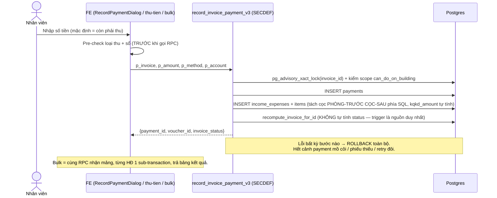
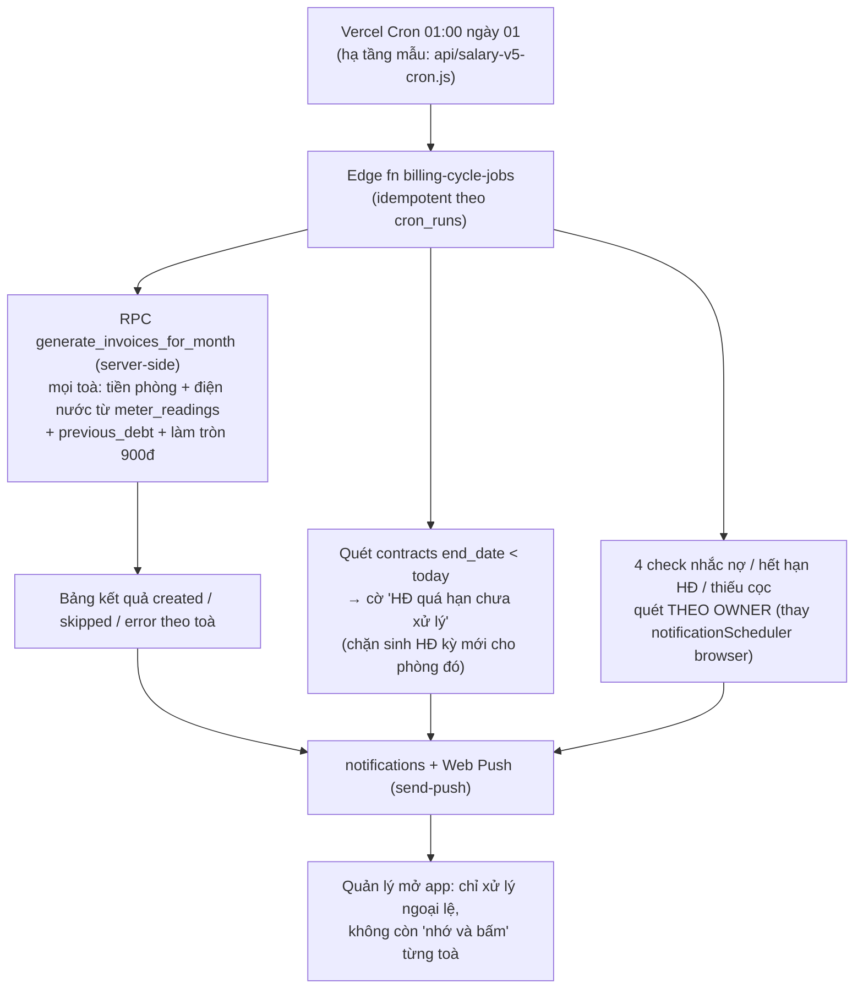
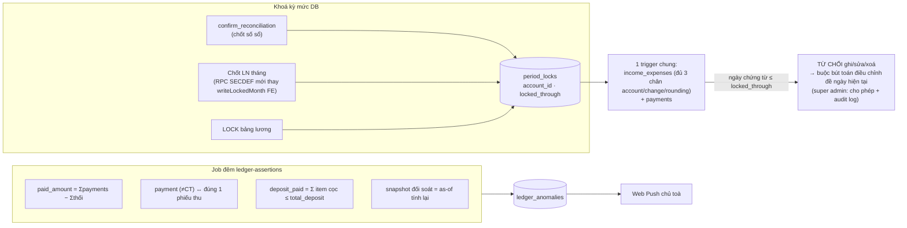
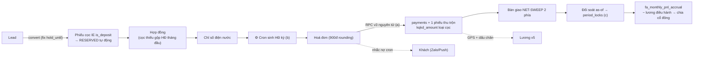

# Hội đồng Cố vấn 5 chuyên gia — Biên bản tranh luận & Kế hoạch hành động

> Ngày 2026-07-03 · HEAD `98927ca` · Phạm vi: toàn bộ codebase + live DB (đối chiếu qua Management API, read-only).
> Thành phần: **COO** (Vận hành & Nghiệp vụ) · **Architect** (Backend/DB) · **UX Lead** (Frontend) · **QA** (Bug Hunter) · **Kế toán trưởng** (Chief Accountant).
> Mỗi phát hiện đều có dẫn chứng `file:dòng` do chuyên gia tương ứng tự xác minh. Tài liệu hệ thống nền: `docs/he-thong/` (đã đại tu cùng ngày, commit `98927ca`).

---

## PHẦN 1 — PHIÊN TRANH LUẬN

**Chủ đề mổ xẻ trung tâm:** *một lần thu tiền hoá đơn tháng đầu (gộp cọc) — từ ngón tay nhân viên đến báo cáo chia lợi nhuận.* Đây là luồng đi qua cả 5 lãnh địa: UX nhập liệu → RPC/trigger → phiếu thu sổ quỹ → bàn giao/đối soát → KQKD/chia LN.

---

**Kế toán trưởng** *(mở màn)*: Tôi đi thẳng vào phát hiện nặng nhất — **P0**. Diff chưa commit ở `src/lib/invoiceHelpers.ts:259-275` đổi chiều phân bổ cọc từ "cọc-trước" sang "phòng-trước". Đúng về ý đồ, nhưng với hoá đơn **đang thu dở theo quy tắc cũ** thì sai: HĐ 5.950.000 (cọc gộp 2.300.000 + phòng 3.650.000), đợt 1 đã thu 2.000.000 → thành phiếu **cọc** 2.000.000 theo quy tắc cũ. Nay thu nốt 3.950.000, code mới (`useInvoicePayments.ts:157-169`) lấy `paidBefore=2.000.000` và coi đó là **doanh thu đã phủ** → phiếu mới ghi doanh thu 1.650.000 + cọc 2.300.000. Cộng sổ: cọc 4.300.000 — **đếm đôi 2.000.000**, KQKD hụt đúng chừng đó, và `recompute_contract_deposit_paid` đẩy `deposit_paid > total_deposit`. Đây chính là lớp bug "cọc lẫn doanh thu" ta đã phải backfill hồi T5–T6, tái sinh theo chiều ngược lại.

**QA**: Xác nhận, và tôi có thêm **ba quả mìn cùng nằm trong diff chưa commit đó**. Một, `useInvoicePayments.ts:160-161` cộng `total_amount + previous_debt` làm `collectibleTotal` — trong khi `useInvoices.ts:573-577` cho thấy `total_amount` **đã gộp** nợ cũ lúc phát hành; tôi đối chiếu live: 22/25 HĐ có nợ cũ khớp công thức đã-gộp. Cộng đúp. Hai, thứ tự chết người: RPC `record_invoice_payment_v2` ghi payment **trước**, rồi FE mới pre-check loại thu và throw ở `:186-194` — nghĩa là "báo lỗi nhưng tiền đã vào", bấm thu lại là **payment đôi**. Ba, `:157` — chỉ cần nhân viên bật "Làm tròn tiền thiếu" (dialog tự bật khi thiếu dưới 10 nghìn, `RecordPaymentDialog.tsx:456-461`) là `canSplit=false`, **toàn bộ cọc chui vào hạng mục doanh thu**. Ba bug này phải chặn trước khi commit đợt code đang nằm ở working tree.

**Architect**: Các anh đang tả triệu chứng của một bệnh nền: **logic tiền nằm ở client**. Phiếu thu là bút toán mirror do trình duyệt insert *sau* khi RPC trả về (`useInvoicePayments.ts:71-81` rồi `:201-262`). Rớt mạng giữa hai bước là hoá đơn PAID mà sổ quỹ trống. Và ngay trong DB cũng có mâu thuẫn nội tại: `record_invoice_payment_v2` (`20260528000002:53-79`) tự cộng `paid_amount = cũ + amount` **đè lên** kết quả trigger `recompute_invoice_for_id` vốn chuẩn hơn (biết trừ Tiền thối, biết ngưỡng <10K) — vừa mất rule làm tròn, vừa race lost-update khi hai người thu song song. Mẫu sửa có sẵn trong chính repo: advisory lock đã dùng cho code generators (`20260701000001:42`), chỉ chưa ai áp cho tiền.

**Kế toán trưởng**: Và kể cả khi từng phiếu đúng, **không có khoá kỳ**. `confirm_reconciliation` chốt số xong không set gì cả — backdate một phiếu vào kỳ đã CONFIRMED là số as-of tính lại lệch snapshot, báo cáo hiển thị cả hai số mà không giải thích được. `accounts.lock_date` thì thủng: trigger chỉ check `NEW.account_id` (`20260425000001:85-135`) trong khi view số dư cộng cả hai chân `change_account_id`/`rounding_account_id`; bảng `payments` hoàn toàn không khoá. Chốt lợi nhuận cổ đông cũng vậy — `writeLockedMonth` là snapshot FE-only (`useShareholderProfit.ts:340-460`): chốt T6 chia 100 triệu, T7 ai đó huỷ một phiếu chi 30 triệu của T6, không hệ thống nào kêu.

**COO**: Tôi lùi một bước nhìn cả vòng đời. Kết luận của tôi: **nửa sau (thu tiền → chia LN) thiết kế tốt hiếm thấy ở CRM tự xây — ledger canonical, bàn giao hai phía, đối soát point-in-time. Nhưng cả hệ vẫn là "phần mềm hỗ trợ ghi chép", chưa phải "hệ thống tự chạy".** Toàn bộ app chỉ có 3 job tự động, không job nào thuộc chu kỳ billing. Sinh hoá đơn hàng tháng? `generate_invoices_for_building_v2` tồn tại trong DB mà **0 caller** — đường chạy thật là ExcelInvoiceDialog, 1 toà/lần, submit từng phòng bằng vòng lặp client (`ExcelInvoiceDialog.tsx:500-515`). Nhắc nợ? 4 check nằm trong `setInterval` 6 tiếng **trong trình duyệt của đúng tài khoản owner** (`notificationScheduler.ts:38-311`) — owner đi vắng một tuần là cả hệ nhắc nhở câm. Gửi hoá đơn cho khách? Zalo OA/Email đều "Sắp ra mắt". Với hàng chục toà, đây là chỗ thất thoát dòng tiền lớn nhất, hơn mọi bug lẻ.

**UX Lead**: Và khi hệ ghi chép ấy trục trặc, **người dùng không hề biết**. Tôi đếm được ~41 hook query kiểu `console.error → return []` — "rỗng giả": RLS chặn hay timeout đều hiện "Chưa có dữ liệu", nhân viên tưởng hết việc, chủ tưởng hết nợ. Nặng hơn là write: chi lương xong update `salary_monthly.paid` **không check error** (`useManagerSalary.ts:890`), ghi thưởng lỗi chỉ `console.warn` (`salaryBonusNotify.ts:62-68` — có nguyên comment "nuốt êm"), 5 mutation bàn giao quỹ không có `onError`. Các anh bàn khoá kỳ với atomic — tôi đồng ý, nhưng nếu tầng hiển thị cứ nuốt lỗi thì mọi lớp bảo vệ phía dưới đều bị che mắt người vận hành.

**COO**: Thêm dữ kiện cho anh: hai nút **đang hỏng hẳn** mà không ai kêu — đúng vì "rỗng giả". Convert lead gửi `hold_until_date` trong khi cột là `hold_until` (`ConvertLeadDialog.tsx:106`) → phễu Lead→Cọc chết từ khâu đầu; import Excel chỉ số gửi thừa `p_user_id` → PGRST202 (`useMeterReadings.ts:368-374`) — fix mất 5 phút, hỏng nhiều tuần.

**UX Lead** *(phản biện Architect)*: Nhưng tôi không nhận hết lỗi về frontend đâu. Lý do FE phải tự compute nhiều thứ là **backend bắt nó làm thế**: màn lương fan-out 10–12 query rồi tính ở TS (`useManagerSalary.ts:56-448`), Phân bổ LN kéo full-history (`useShareholderProfit.ts:167-282`). Trong khi `useFinancialAnalysis` đã chứng minh mẫu đúng: RPC server-side + staleTime + key chuẩn. Cho tôi RPC gọn, tôi trả anh màn hình nhanh. Còn về nhập liệu: form thu chi — nghiệp vụ lặp nhiều nhất ngày — vẫn bắt chọn "Sổ quỹ *" bằng tay (`IncomeExpenseForm.tsx:185,660`) dù `lib/cashAccount.ts` auto-pick theo `is_default` có sẵn và mobile đã dùng. Một phiếu chi đơn giản 10–14 thao tác. Ghi chỉ số điện — việc 100% đứng trước đồng hồ — **không có bản mobile**.

**Architect** *(phản biện lại)*: Đồng ý dồn compute xuống DB, nhưng phải nói thẳng chi phí: mỗi RPC SQL là một bề mặt drift mới, và kỷ luật migration hiện tại **đang là sự cố chứ không còn là rủi ro**. Bằng chứng nằm ngay working tree: `20260617000001_forfeit_full_settlement.sql` untracked là **bản cũ đã bị thay** — bản live là LEAST của `20260618000001` cộng CT của `20260619000001`; ai "dọn repo" mà apply lại file đó là chi sổ thật phần cọc chưa thu, sổ âm, doanh thu khống. Ngược lại `20260702120000_kqkd_item_level.sql` untracked nhưng **đã áp live và FE tại HEAD phụ thuộc nó** — không commit là người sau không dựng nổi môi trường. Cùng gốc bệnh: redefine hàm bằng copy-paste nguyên thân 200 dòng, một lần paste bản cũ là mất `SET search_path` âm thầm. Và còn lớp **magic string**: sổ nhận diện bằng `LIKE '%Thu'` ở ≥7 hàm, state machine thanh lý chạy bằng text trong cột `notes` (`20260617000001:256`) — sửa ghi chú trước khi duyệt là trigger tất toán không chạy. Vụ hỏng font "t? d?ng l?p" chứng minh chuỗi tiếng Việt trong DB là bề mặt lỗi thật.

**Kế toán trưởng**: Bồi thêm về magic string: nhận diện cọc gộp bằng khớp chuỗi `'tiền cọc'` (`useInvoicePayments.ts:140-153`) — ai sửa mô tả item thành "Tiền cọc giữ phòng" là cả khoản cọc thành doanh thu. Cờ phải là **cột cấu trúc**, không phải văn bản. Và một hồi quy các anh chưa nhắc: migration `20260627000001` viết lại move-out nhưng bước gạch nợ **quay về payment TM**, bỏ phiếu truy vết sổ ảo TK000055 — nghĩa là ô "TM" trên dashboard lại phồng đúng cái bệnh mà `CT` sinh ra để chữa. Live xác nhận: `contract_terminations` có 18 FORFEIT / **0 NORMAL** — mọi move-out có tiền trả khách đều mất audit vì CHECK `refund_method`.

**COO**: Về phân quyền tôi thấy một nghịch lý vận hành: chỗ cần chặt thì lỏng — staff được bật toggle FE là **tự chốt lợi nhuận tháng** (RLS WITH CHECK luôn pass, `useShareholderProfit.ts:462-469`), người tạo phiếu tự duyệt phiếu của mình; chỗ cần lỏng thì chặt — bàn giao treo vì receiver nghỉ việc thì owner cũng không giải cứu được (`20260610130000:324-326`), phân quyền nhân sự không uỷ quyền nổi. Cộng thêm lỗ thưởng: tự tạo job có `bonus_amount`, tự gán, chụp một ảnh là tiền vào ledger (`award_job_bonus` chỉ đòi COMPLETED + assignee, `20260629000011:88-91`); `completion_time` nhân viên tự nhập không clamp; geofence 70m **thuần audit không chặn**.

**Architect**: Cùng họ đó, nghiêm trọng hơn về bảo mật dữ liệu: RPC SECURITY DEFINER cấp cho `authenticated` mà thân hàm không kiểm scope — `get_income_expense_history` được redefine **sau** khi audit đã POC lộ xuyên tenant mà vẫn không guard (`20260630000004:195-217`); `v5_month_money(p_user)` cho nhân viên đọc tiền lương v5 của đồng nghiệp (`20260703000005:53-54`); `bulk_approve_meter_readings` duyệt chỉ số của người khác. Checklist 4 điểm cho SECDEF phải thành quy trình, không phải lời khuyên. Còn một quả bom hẹn giờ nữa: `payments.user_id` **ON DELETE CASCADE từ auth.users** (`20250601000001:159`) — xoá một user là chứng từ tiền bốc hơi dây chuyền, trigger recompute flip hoá đơn về unpaid "đúng quy trình". Chứng từ kế toán phải RESTRICT.

**UX Lead** *(chốt phần mình)*: Trả lời câu hỏi đề bài cho sòng phẳng: theme hiện tại **không phải Japandi Indigo/Teal** — token thật là shadcn light + primary emerald (`src/index.css:11-39`, hue 152), và đang có **5 hệ style song song**, token kit mobile bị copy ≥5 file với 4 prefix khác nhau, `phongTrong.css` còn xả token vào `:root` toàn cục. Muốn về một ngôn ngữ thì việc đầu tiên là một file `tokens.css` nguồn duy nhất, không phải sơn lại từng trang.

**Master Agent** *(đúc kết đồng thuận)*: Hội đồng thống nhất ba mạch ưu tiên, theo đúng thứ tự:
1. **Đúng trước** — vá chùm bug thu-tiền trong diff chưa commit (P0/P1 của QA + Kế toán trưởng) và xử lý 2 migration untracked; đây là điều kiện để mọi số liệu phía sau còn nghĩa.
2. **Chắc sau** — nguyên tử hoá thu tiền vào 1 RPC + khoá kỳ mức DB + sweep guard SECDEF: biến "đúng" thành "không thể sai".
3. **Tự chạy cuối** — cron chu kỳ billing (sinh hoá đơn, nhắc nợ, quét HĐ hết hạn) + diệt "rỗng giả"/silent-write toàn cục + giảm click nghiệp vụ lặp: biến hệ ghi chép thành hệ vận hành.

---

## PHẦN 2 — BÁO CÁO TỔNG KẾT & KẾ HOẠCH HÀNH ĐỘNG

### 2.1 Bảng đánh giá tổng quan

| Góc nhìn | Điểm mạnh nổi bật | Nhược điểm nổi bật |
|---|---|---|
| **Business (COO + Kế toán)** | Ledger canonical `income_expenses` + hạch toán KQKD item-level (`kqkd_amount`); thanh lý net-settlement đóng gói 1 click; bàn giao 2 phía + đối soát as-of; giữ chỗ RESERVED tự động idempotent; lương v5 shadow-mode phòng thủ nhiều lớp | Không có nhịp kỳ tự động (sinh HĐ, nhắc nợ, quét HĐ hết hạn = tay + trí nhớ); nhắc nợ chỉ chạy trong browser owner; công nợ phân mảnh 3 nơi (nợ HĐ / nợ cọc / credit `excess_amounts` không màn hình); không khoá kỳ sau chốt; lỗ gian lận thưởng (tự tạo–tự gán–tự thưởng, geofence không chặn); phễu lead→cọc đang gãy runtime |
| **System (Architect + QA)** | Tiền toàn `NUMERIC(15,2)`; recompute full-re-SUM idempotent; RLS set-based + initplan đúng bài; UNIQUE partial đúng nghiệp vụ; bug-class generator đã sửa hệ thống (SECDEF + advisory lock, 7 hàm); property-based test cho logic tiền | Logic tiền ở client (mirror phiếu thu sau RPC); RPC v2 đè trigger + race; SECDEF thiếu guard scope (≥3 RPC lộ xuyên tenant); migration drift thành sự cố (0617 stale nguy hiểm, 0702 chưa commit mà live phụ thuộc); magic string định danh nghiệp vụ (tên sổ, notes-as-state, 'tiền cọc'); CASCADE từ auth.users xuống chứng từ; 106–148 lỗi TS pre-existing làm mất gate |
| **UI/UX (UX Lead)** | /thu-tien 2-3 chạm là hình mẫu; smart defaults rộng ở dialog tiền; bộ input chuyên dụng tự viết tốt; 57 file skeleton + filter sống qua F5; chi tiết mobile-native thực dụng | ~41 hook "rỗng giả" + loạt write không check error (silent-fail đúng chỗ tiền); 5 hệ style song song, token copy ≥5 bản; form thu chi 10-14 thao tác dù auto-pick có sẵn; ghi chỉ số không có mobile; 1 ErrorBoundary cho cả app; modal tự chế không focus-trap ngay luồng tiền; theme thực tế là emerald — không phải Japandi Indigo/Teal như kỳ vọng |

### 2.2 Danh sách lỗi cần sửa NGAY (xếp hạng, kèm file + giải pháp)

**🔴 P0 — chặn trước khi commit diff working tree hiện tại**

| # | Lỗi | File | Fix |
|---|---|---|---|
| 1 | `collectibleTotal` cộng đúp previous_debt → tách cọc sai, cọc lọt KQKD | `src/hooks/useInvoicePayments.ts:160` (+ JSDoc `src/lib/invoiceHelpers.ts:257`) | `collectibleTotal = total_amount` (đã gộp nợ cũ); sửa JSDoc |
| 2 | Đổi chiều phân bổ cọc giữa dòng → HĐ thu dở theo quy tắc cũ bị **đếm đôi cọc** | `src/lib/invoiceHelpers.ts:259-275` + caller | `paidBefore` phải trừ Σ item cọc đã ghi của chính HĐ (đọc income_expenses theo invoice_id); chạy SQL đối chiếu `deposit_paid > total_deposit` |
| 3 | Throw "thiếu loại thu" SAU khi RPC đã ghi payment → retry = payment đôi | `src/hooks/useInvoicePayments.ts:71-83, 186-194` | Dời pre-check loại thu/sổ lên TRƯỚC lời gọi RPC |
| 4 | Bật "Làm tròn tiền thiếu" trên HĐ gộp cọc → toàn bộ cọc thành doanh thu | `src/hooks/useInvoicePayments.ts:157` + `RecordPaymentDialog.tsx:456-461` | Vẫn split khi rounding>0, hoặc tắt auto-rounding khi `depositInInvoice > 0` (như bulk đã chặn) |
| 5 | Migration untracked `20260617000001` là bản CŨ (COALESCE + TM) đã bị 0618 (LEAST) + 0619 (CT) thay — apply lại là regress tiền | `supabase/migrations/20260617000001_forfeit_full_settlement.sql` | KHÔNG apply; commit dạng tài-liệu-lịch-sử có header "superseded", hoặc thay thân bằng bản live; commit ngay `20260702120000` (live đã phụ thuộc) |

**🟠 P1 — tuần này**

| # | Lỗi | File | Fix |
|---|---|---|---|
| 6 | Phiếu thu mirror client-side sau RPC → rớt mạng = hoá đơn PAID, sổ quỹ trống | `useInvoicePayments.ts:201-262`; bulk bypass `useBulkRecordPayment.ts:241-330` | Gộp payment + phiếu + items vào 1 RPC SECDEF transaction (v3); bulk = 1 RPC nhận mảng. SQL dò lệch: payments không có phiếu `payment_id` |
| 7 | `record_invoice_payment_v2` tự tính status đè trigger + race lost-update | `supabase/migrations/20260528000002:53-79` | Bỏ khối tự tính; `SELECT ... FOR UPDATE` dòng invoice + `PERFORM recompute_invoice_for_id` |
| 8 | SECDEF thiếu guard: `get_income_expense_history`, `bulk_approve_meter_readings`, `v5_month_money(p_user)`; `fa_type_breakdown*` lộ hạng mục hạn chế | `20260630000004:195-217`, `20250130000004`, `20260703000005:53-54`, `20260611140000:127-128` | Sweep checklist 4 điểm mọi SECDEF: guard scope trong thân + REVOKE anon tường minh + lock hàm ghi tiền + lọc `has_restricted_item` ở RPC báo cáo |
| 9 | Hồi quy CT→TM move-out (0627) → ô TM dashboard phồng lại; move-out NORMAL mất audit (CHECK refund_method) — live 18 FORFEIT/0 NORMAL | `20260627000001` (`terminate_contract_move_out_impl`) | Khôi phục CT + phiếu truy vết cho bước gạch nợ; RPC set `refund_method` khi S>0 |
| 10 | Race recompute tiền (2 payment đồng thời → paid_amount thiếu) | `recompute_invoice_for_id` (`20260530000002`), `recompute_contract_deposit_paid` | 1 dòng `pg_advisory_xact_lock(hashtext(invoice_id))` đầu hàm (mẫu có sẵn ở 0701) |
| 11 | Convert lead chết: gửi `hold_until_date`, cột thật `hold_until` | `ConvertLeadDialog.tsx:106`, `useDeposits.ts:222-227` | Sửa key; viết lại convert đi luồng phiếu IE `is_deposit` (bảng `deposits` đã chết) |
| 12 | Import Excel chỉ số chết PGRST202 (gửi thừa `p_user_id`) | `src/hooks/useMeterReadings.ts:368-374` | Xoá 1 tham số |
| 13 | Loạt write tiền không check error (chi lương, bàn giao, chốt sổ, thưởng) | `useManagerSalary.ts:890,637-639`, `salaryBonusNotify.ts:62-68`, `useCashHandovers.ts:126-193`, `useReconciliations.ts:32-62` | Check `.error` + throw; default `onError` toast ở QueryClient mutationCache |
| 14 | CT/sổ ảo TK000055 đếm như tiền thật trong CashFlow/Sổ quỹ ngày | `src/hooks/useCashBook.ts:27-65,148-188` | 1 helper lọc chung sổ ảo + `counts_in_business_result` cho mọi hook cashbook |
| 15 | Nợ carry đếm đôi khi HĐ carry chưa PAID + nợ "hồi sinh" sau cascade | `get_invoice_statistics_v2` + `trg_settle_previous_debt` (`20260527000051:60-98`) | Cascade tạo payment 'CT' thay vì ghi đè paid_amount; thống kê khử HĐ nguồn đang được carry |

**🟡 P2 — trong tháng**

| # | Lỗi | File | Fix |
|---|---|---|---|
| 16 | Không khoá kỳ sau đối soát/chốt LN; lock_date thủng 2 chân + payments | `20260425000001:85-135`, `useShareholderProfit.ts:340-469` | Bảng `period_locks` + 1 trigger chung (xem sơ đồ 2.4c); chốt LN chuyển thành RPC SECDEF |
| 17 | Class timezone UTC: trước 7h sáng VN mọi default lùi 1 ngày/1 tháng | `IncomeExpenseForm.tsx:186`, `CashbookLockDialog.tsx:20`, `TerminateDialog.tsx:229`, `MeterReadingsPage.tsx:32` (hằng module-level), `useInvoices.ts:1159`… | Helper `vnToday()/vnMonth()` (Intl timeZone Asia/Ho_Chi_Minh), thay dần chỗ dính tiền/kỳ |
| 18 | Xoá phiếu cọc cuối → `deposit_paid` kẹt giá trị ma (guard `v_count>0`) | `20260702120000:440-457` | Cho phép ghi 0 khi HĐ từng có phiếu IE cọc |
| 19 | Check overdue đạp PAID→OVERDUE (đọc-rồi-ghi không re-check) | `useInvoices.ts:1163-1180` | Thêm `.in('status',[APPROVED,PARTIAL_PAID])` vào câu UPDATE |
| 20 | ~41 hook "rỗng giả" `return []` sau error | `useIncomeExpenseTypes.ts:54-57`, `useInvoices.ts:223-226`, `useAreas.ts:26`… | Codemod throw + panel lỗi "Thử lại" (mẫu f36ef69) |
| 21 | `payments.user_id`/`income_expenses.user_id` ON DELETE CASCADE từ auth.users | `20250601000001:159`, `20250120000001:9` | Đổi RESTRICT/SET NULL cho bảng chứng từ |
| 22 | Gian lận thưởng: tự tạo–tự gán–tự thưởng; completion_time client; geofence không vào điều kiện tick | `20260629000011:88-91`, `TaskCompleteDialog.tsx:139-144`, `20260703000002:548-566` | Clamp completion_time server; điều kiện thưởng = job người khác tạo/duyệt; geofence-ok vào điều kiện tick JOB |
| 23 | Xoá mềm phiếu THU forfeit đã duyệt không gỡ payment | trigger `20260617000001:311-315` (bản live) | Thêm nhánh `UPDATE OF deleted_at` gỡ payment + đảo phiếu cặp |
| 24 | Trùng lặp TS↔SQL lệch số: prorate 30-ngày vs ngày thực; rounding 900đ chỉ có ở TS; name_sort SQL xếp 'Đ' sau 'Z' | `prorateCalculation.ts:23-31` vs `013:220-232`; `invoiceUtils.ts:88-95`; `20260702100000:11-28` | Chọn 1 nguồn (ưu tiên SQL), bên kia gọi/chấp nhận; test đối chiếu |

### 2.3 Đề xuất tối ưu (kiến trúc · quy trình · UI)

**Kiến trúc (Architect + Kế toán trưởng)**
1. **RPC hardening sweep** một đợt cho toàn bộ SECURITY DEFINER theo checklist 4 điểm: guard `auth.uid()`/scope trong thân → `REVOKE FROM PUBLIC, anon` tường minh dưới mỗi `CREATE OR REPLACE` → hàm ghi tiền mở đầu bằng advisory lock → RPC báo cáo lọc `has_restricted_item`. Mẫu tốt có sẵn: `manager_collection_cycle_report:38-42`.
2. **Thay magic string bằng cột định danh**: `accounts.kind` enum (COLLECTION/DEPOSIT_HOLD/SETTLEMENT/ROUNDING) thay `LIKE '%Thu'`/tên sổ CỌC; `invoice_items.is_deposit boolean` thay khớp chuỗi "Tiền cọc"; `income_expenses.settlement_group_id` thay marker trong `notes`; `income_expense_types.code` thay tên "Tiền thối".
3. **Kỷ luật migration một-chiều**: commit file TRƯỚC khi apply qua Management API (script Node UTF-8 duy nhất, ghi tay `schema_migrations`); script diff `pg_get_functiondef` live-vs-file cho ~30 hàm nóng; chấm dứt copy-paste nguyên thân hàm.

**Quy trình vận hành (COO + Kế toán trưởng)**
4. **"Chốt kỳ tự động"** — 1 Vercel Cron đầu tháng (hạ tầng mẫu `api/salary-v5-cron.js` + edge fn có sẵn): sinh hoá đơn kỳ server-side mọi toà (điện nước + nợ cũ + làm tròn 900đ), quét HĐ quá `end_date`, chạy 4 check nhắc nợ theo owner thay browser (sơ đồ 2.4b).
5. **Khoá kỳ + job đối chiếu đêm**: `period_locks` mức DB + RPC đêm kiểm 4 đẳng thức (paid = Σpayments − thối; mỗi payment ≠CT có đúng 1 phiếu; deposit_paid = Σ item cọc ≤ total_deposit; snapshot đối soát = as-of tính lại) ghi `ledger_anomalies` + Web Push chủ (sơ đồ 2.4c).
6. **Màn "Công nợ 360°"**: gộp nợ hoá đơn + nợ cọc + credit `excess_amounts` theo khách/HĐ, tuổi nợ theo `due_date`; audit-trail cho force-cancel còn nợ.

**UI/UX (UX Lead)**
7. **Giảm 4-6 thao tác phiếu thu/chi hằng ngày**: auto-pick Sổ quỹ theo `is_default` trong `IncomeExpenseForm` (lib có sẵn), auto-chọn/nhớ toà, đưa QuickCreateDialog lên desktop.
8. **Màn ghi chỉ số mobile-first**: chọn toà → danh sách đồng hồ chưa ghi → nhập số + chụp ảnh inline (tái dùng kit `.cm-app`).
9. **Một nguồn token style**: tách `src/styles/tokens.css` cho kit warm-neutral+emerald (đang copy ≥5 file), quy ước port design mới map về token; ErrorBoundary theo route; modal tự chế dựng lại trên Radix primitive.

### 2.4 Sơ đồ flow tối ưu (Mermaid)

**a) Thu tiền nguyên tử — `record_invoice_payment_v3` (1 transaction, thay chuỗi RPC + mirror client)**

**b) Chu kỳ billing tự động (xoá khối thao tác O(số toà) mỗi tháng)**

**c) Khoá kỳ + đối chiếu tự động (biến đối soát thành hàng rào thật)**

**d) Vòng đời chuẩn sau tối ưu (rút gọn)**

### 2.5 Lộ trình đề xuất

| Đợt | Nội dung | Việc |
|---|---|---|
| **Tuần này** | Đúng | P0 #1-5 (diff thu-tiền + 2 migration untracked) → verify bằng SQL đối chiếu live + Playwright thu HĐ gộp cọc; P1 #11-12 (2 fix 5 phút) |
| **Tuần 1-2** | Chắc | RPC v3 nguyên tử (sơ đồ a) + advisory lock recompute + SECDEF sweep (#6-10); vá CT move-out (#9); helper lọc sổ ảo (#14) |
| **Tuần 3-4** | Không thể sai | `period_locks` + job đối chiếu đêm (sơ đồ c); chốt LN thành RPC; sửa cascade nợ cũ (#15-16) |
| **Tháng tới** | Tự chạy | Cron billing (sơ đồ b); Công nợ 360°; codemod rỗng giả + onError toàn cục (#13, #20); ghi chỉ số mobile + giảm click form thu chi; tokens.css |

> **Ghi chú cho phiên làm việc sau:** tài liệu hệ thống đã khớp code tại `98927ca` (docs/he-thong, 18 file domain + 17/18 mới). File này là nguồn action-plan; khi sửa xong mục nào, đánh dấu ngay tại đây.
