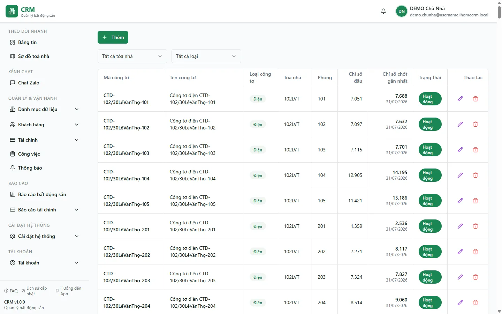
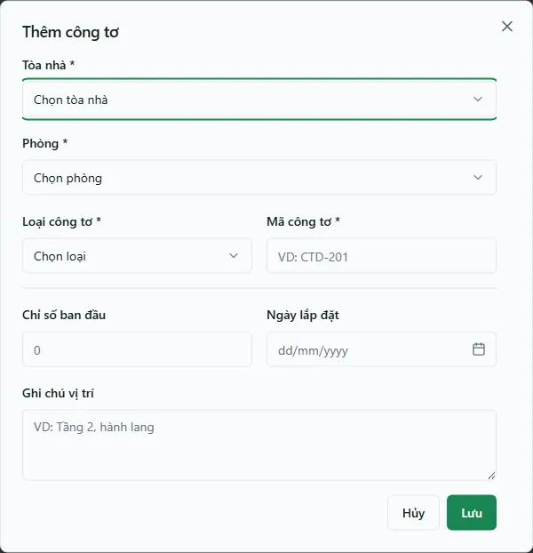

# Bước 4: Công tơ điện nước

Màn hình **Đồng hồ Công tơ** là nơi bạn khai báo từng đồng hồ điện, nước, gas lắp trong phòng. Mỗi công tơ gắn với một phòng, một loại dịch vụ và một chỉ số ban đầu. Đây là bước chuẩn bị bắt buộc trong quá trình khởi tạo dữ liệu: chỉ khi phòng đã có công tơ thì mỗi tháng bạn mới ghi được chỉ số và lên hoá đơn tiền điện, tiền nước theo mức tiêu thụ thật.

::: info Điều kiện tiên quyết
- `meters.view` để mở trang và `meters.create` để thêm công tơ; toà/phòng chỉ hiện trong phạm vi được giao.
- Đã tạo **toà nhà** và **phòng** trước — công tơ phải gắn vào một phòng cụ thể. Xem [Tạo tầng & phòng](/01-bat-dau/tao-tang-phong/).
- Hệ thống đã có các **dịch vụ** đúng tên **Điện**, **Nước**, **Gas** — mỗi công tơ tự nối vào dịch vụ tương ứng theo loại. Xem [Dịch vụ & định mức](/01-bat-dau/dich-vu-dinh-muc/).
:::

## Hướng dẫn từng bước

**Bước 1**: Tại thanh menu, mở **Cài đặt hệ thống** => **Đồng hồ / Công tơ** (`/settings/meters`). Màn hình liệt kê mã, loại, toà nhà, phòng, chỉ số đầu và chỉ số chốt gần nhất.

**Bước 2**: Ấn nút **Thêm** ở góc trên. Hộp thoại **Thêm công tơ** hiện ra.

**Bước 3**: Chọn **Tòa nhà**, rồi chọn **Phòng**. Danh sách phòng chỉ hiện sau khi bạn đã chọn toà nhà.

**Bước 4**: Chọn **Loại công tơ** — **Điện**, **Nước** hoặc **Gas**. Hệ thống tự nối công tơ vào đúng dịch vụ cùng tên, bạn không cần chọn dịch vụ thủ công.

**Bước 5**: Điền **Mã công tơ** (ví dụ `CTD-201`). Mã này là duy nhất, dùng để định danh đồng hồ khi import chỉ số hàng loạt.

**Bước 6**: Điền **Chỉ số ban đầu** (số hiện trên mặt đồng hồ lúc lắp), **Ngày lắp đặt** và **Ghi chú vị trí** nếu cần. Form không có trường tên công tơ và không tự sinh tên; định danh người dùng nhập là **Mã công tơ**.

**Bước 7**: Ấn **Lưu**. Công tơ mới xuất hiện ngay trong danh sách với trạng thái **Hoạt động**.

::: tip Chỉ số ban đầu dùng để làm gì
**Chỉ số ban đầu** chính là chỉ số cũ cho **lần ghi đầu tiên** của đồng hồ. Ở những lần ghi sau, hệ thống tự lấy chỉ số của lần trước làm chỉ số cũ, nên bạn chỉ cần đặt đúng một lần lúc khai báo. Nếu đồng hồ mới tinh về 0, cứ để mặc định 0.
:::

## Các tính năng khác trên màn hình

| Nút / Bộ lọc | Công dụng |
|---|---|
| **Chọn tòa nhà** | Lọc danh sách theo một toà nhà. Gõ để tìm nhanh; chọn **Tất cả tòa nhà** để bỏ lọc. |
| **Loại công tơ** | Lọc theo **Điện** / **Nước** / **Gas**; chọn **Tất cả loại** để bỏ lọc. |
| Biểu tượng **Sửa** (bút chì) | Mở lại hộp thoại để sửa loại, mã, chỉ số ban đầu, ngày lắp, ghi chú của công tơ. |
| Biểu tượng **Xoá** (thùng rác) | Gỡ công tơ khỏi danh sách (xoá mềm). |
| Cột **Chỉ số chốt gần nhất** | Chỉ số của lần ghi mới nhất kèm ngày chốt — giúp bạn biết đồng hồ đã đọc số đến đâu. |
| Cột **Trạng thái** | **Hoạt động** / **Ngừng** / **Hỏng** / **Đã gỡ** — chỉ công tơ **Hoạt động** mới hiện trong danh sách "chưa chốt" khi ghi chỉ số. |

::: warning Xoá công tơ vẫn giữ mã
Xoá công tơ chỉ ẩn nó khỏi danh sách chứ **không giải phóng mã**. Nếu sau này bạn thêm lại một công tơ cùng mã, hệ thống vẫn báo trùng. Muốn dùng lại đúng mã đó, hãy đặt một mã khác hoặc liên hệ quản trị.
:::

## Tình huống & lỗi thường gặp

| Tình huống | Cách xử lý |
|---|---|
| Báo **"Mã công tơ đã tồn tại"** | Mã đang trùng với một công tơ khác — kể cả công tơ đã bị xoá vẫn giữ mã. Đổi sang mã khác. |
| Ô **Phòng** trống, không chọn được | Bạn chưa chọn **Tòa nhà**. Chọn toà nhà trước, danh sách phòng sẽ hiện theo. |
| Không tạo được công tơ dù đã điền đủ | Hệ thống chưa có dịch vụ đúng tên **Điện** / **Nước** / **Gas** tương ứng với loại. Tạo dịch vụ đó trước tại [Dịch vụ & định mức](/01-bat-dau/dich-vu-dinh-muc/). |
| Đổi tên dịch vụ rồi công tơ báo lỗi | Công tơ nối dịch vụ theo đúng tên **Điện/Nước/Gas**. Giữ nguyên các tên này, đừng đổi thành tên khác. |
| Phòng thiếu công tơ khi ghi chỉ số | Quay lại đây thêm đủ công tơ cho phòng đó rồi mới ghi chỉ số được. |

## Thử trực tiếp trên sandbox

<SandboxTry account="demo.chunha" app-path="/settings/meters" app-label="Mở màn Đồng hồ Công tơ" fixtures="Snapshot 13/08/2026: chưa có công tơ." view-only>

**Hãy nhìn thấy**

1. Xác nhận empty state **Chưa có công tơ nào**; không giả định các mã fixture cũ vẫn tồn tại.
2. Ấn **Thêm** để mở form và nhận diện các trường **Tòa nhà, Phòng, Loại công tơ, Mã công tơ, Chỉ số ban đầu**.
3. Đóng form bằng **Hủy**, không bấm **Lưu**.

Qua bài quan sát này bạn nắm được cấu trúc **một công tơ = một phòng + một loại (Điện/Nước/Gas) + một chỉ số đầu** mà không tạo dữ liệu.

</SandboxTry>

## Quy trình liên quan

- [Tạo tầng & phòng](/01-bat-dau/tao-tang-phong/) — công tơ phải gắn vào một phòng có sẵn.
- [Dịch vụ & định mức](/01-bat-dau/dich-vu-dinh-muc/) — khai báo dịch vụ Điện/Nước/Gas mà công tơ nối vào.
- [Sổ quỹ & loại thu chi](/01-bat-dau/so-quy-loai-thu-chi/) — bước khởi tạo tiếp theo.
- [Căn hộ / Phòng](/03-quan-ly-van-hanh/can-ho-phong/) — quản lý phòng trong vận hành hằng ngày.
