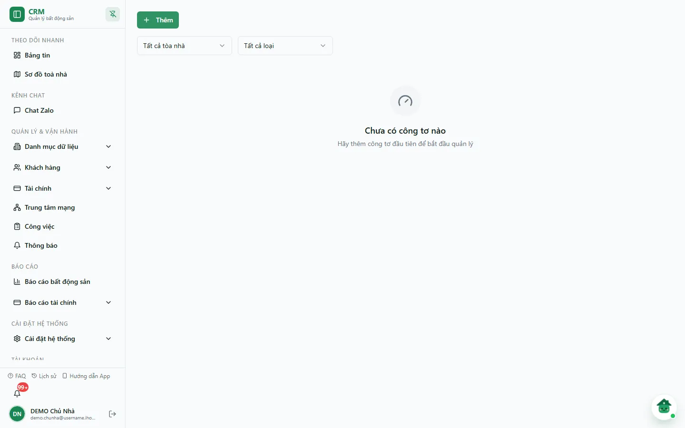
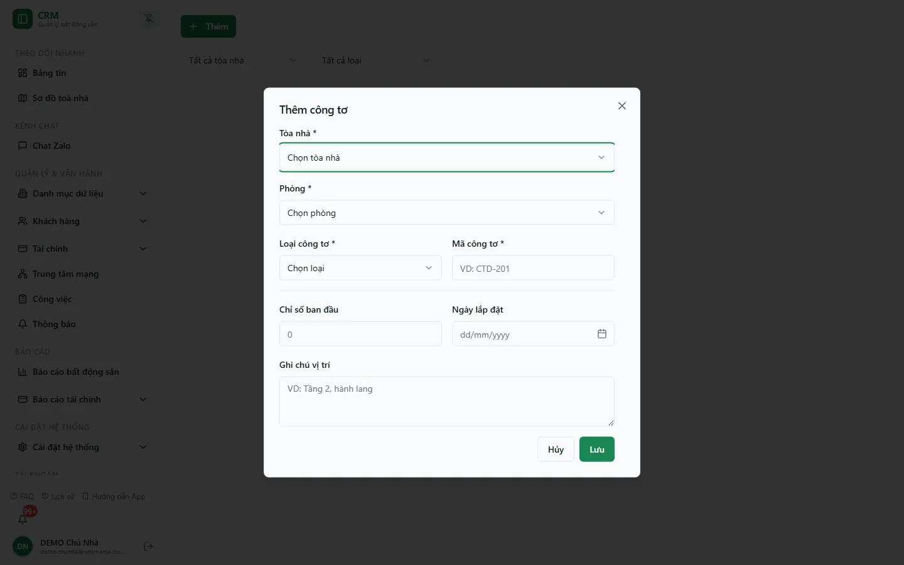

# Bước 4: Công tơ điện nước

Màn hình **Đồng hồ công tơ** là nơi bạn khai báo từng đồng hồ điện, nước, gas lắp trong phòng. Mỗi công tơ gắn với một phòng, một loại (Điện/Nước/Gas) và một chỉ số ban đầu. Đây là bước chuẩn bị bắt buộc khi khởi tạo dữ liệu: chỉ khi phòng đã có công tơ thì mỗi tháng bạn mới ghi được chỉ số và lên hoá đơn tiền điện, tiền nước theo mức tiêu thụ thật.

::: info Điều kiện tiên quyết
- `meters.view` để mở trang và `meters.create` để thêm công tơ; toà/phòng chỉ hiện trong phạm vi được giao.
- Đã tạo **toà nhà** và **phòng** trước — công tơ phải gắn vào một phòng cụ thể. Xem [Tạo tầng & phòng](/01-bat-dau/tao-tang-phong/).
- Đã có **dịch vụ** điện/nước/gas tương ứng: dịch vụ điện có **Loại phí** *Tiền điện*, dịch vụ nước có **Loại phí** *Tiền nước*, dịch vụ gas có mã `GAS` hoặc tên **Gas**. Xem [Dịch vụ & định mức](/01-bat-dau/dich-vu-dinh-muc/).
:::

## Hướng dẫn từng bước

**Bước 1**: Tại thanh menu, mở **Cài đặt hệ thống** => **Danh mục khác**, rồi chọn thẻ **Đồng hồ công tơ** (`/settings/meters`). Màn hình có nút **Thêm**, hai bộ lọc toà nhà và loại công tơ, và bảng công tơ. Khi chưa có công tơ nào, bảng hiện **Chưa có công tơ nào**.

::: tip Đừng nhầm với "Ghi chỉ số"
Mục **Tài chính** => **Ghi chỉ số** trên menu là màn ghi số hằng tháng ([Ghi chỉ số](/03-quan-ly-van-hanh/ghi-chi-so/)). Màn khai báo đồng hồ ở bài này nằm trong **Danh mục khác**. Địa chỉ cũ `/settings/categories/meters` tự chuyển về `/settings/meters`.
:::

**Bước 2**: Ấn nút **Thêm**. Hộp thoại **Thêm công tơ** hiện ra.

**Bước 3**: Chọn **Tòa nhà**, rồi chọn **Phòng**. Danh sách phòng chỉ hiện sau khi đã chọn toà nhà.

**Bước 4**: Chọn **Loại công tơ** — **Điện**, **Nước** hoặc **Gas**. Khi lưu, hệ thống tự tìm dịch vụ tương ứng (ưu tiên theo loại phí *Tiền điện*/*Tiền nước*, sau đó theo mã, cuối cùng theo tên **Điện/Tiền điện**, **Nước/Tiền nước**, **Gas**); bạn không chọn dịch vụ thủ công.

**Bước 5**: Điền **Mã công tơ** (bắt buộc, ví dụ `CTD-201`). Mã dùng để định danh đồng hồ khi import chỉ số hàng loạt. Form không có ô tên công tơ; cột **Tên công tơ** trên bảng hiện `—` với công tơ tạo từ form này.

**Bước 6**: Điền **Chỉ số ban đầu** (số hiện trên mặt đồng hồ lúc lắp, mặc định 0), **Ngày lắp đặt** và **Ghi chú vị trí** nếu cần (ví dụ "Tầng 2, hành lang").

**Bước 7**: Ấn **Lưu**. Công tơ mới xuất hiện trong danh sách với trạng thái **Hoạt động**.

::: tip Chỉ số ban đầu dùng để làm gì
**Chỉ số ban đầu** chính là chỉ số cũ cho **lần ghi đầu tiên** của đồng hồ. Ở những lần ghi sau, hệ thống tự lấy chỉ số của lần trước làm chỉ số cũ, nên bạn chỉ cần đặt đúng một lần lúc khai báo.
:::

## Các tính năng khác trên màn hình

| Nút / Bộ lọc | Công dụng |
|---|---|
| Bộ lọc toà nhà | Lọc danh sách theo một toà; chọn **Tất cả tòa nhà** để bỏ lọc. |
| Bộ lọc loại công tơ | Lọc theo **Điện** / **Nước** / **Gas**; chọn **Tất cả loại** để bỏ lọc. |
| Bảng công tơ | Các cột **Mã công tơ**, **Tên công tơ**, **Loại công tơ**, **Tòa nhà**, **Phòng**, **Chỉ số đầu**, **Chỉ số chốt gần nhất** (kèm ngày chốt), **Trạng thái**, **Thao tác**. |
| **Sửa** (bút chì) | Mở hộp **Sửa công tơ** để chỉnh loại, mã, chỉ số ban đầu, ngày lắp, ghi chú. |
| **Xoá** (thùng rác) | Gỡ công tơ khỏi danh sách (xoá mềm), sau bước **Xác nhận xoá**. |
| Cột **Trạng thái** | **Hoạt động** / **Ngừng** / **Hỏng** / **Đã gỡ** — chỉ công tơ **Hoạt động** mới hiện trong danh sách cần ghi khi ghi chỉ số. |

::: warning Xoá công tơ vẫn giữ mã
Xoá công tơ chỉ ẩn nó khỏi danh sách chứ **không giải phóng mã**. Thêm lại công tơ cùng mã vẫn có thể bị báo trùng — hãy đặt mã khác.
:::

## Tình huống & lỗi thường gặp

| Tình huống | Cách xử lý |
|---|---|
| Báo **"Mã công tơ đã tồn tại"** | Mã đang trùng với một công tơ khác — kể cả công tơ đã bị xoá. Đổi sang mã khác. |
| Ô **Phòng** trống, không chọn được | Chưa chọn **Tòa nhà**. Chọn toà trước, danh sách phòng sẽ hiện theo. |
| Báo `Chưa có dịch vụ "Tiền điện" đang hoạt động…` (hoặc "Tiền nước", "Gas") | Chưa có dịch vụ khớp loại công tơ. Sửa dịch vụ điện/nước cho đúng **Loại phí** *Tiền điện*/*Tiền nước* (gas: mã `GAS` hoặc tên **Gas**) tại [Dịch vụ & định mức](/01-bat-dau/dich-vu-dinh-muc/), rồi lưu lại công tơ. |
| Form báo chưa tải đủ toà hoặc phòng | Ấn **Tải lại dữ liệu** rồi mới lưu. |
| Phòng thiếu công tơ khi ghi chỉ số | Quay lại đây thêm đủ công tơ cho phòng đó rồi mới ghi chỉ số được. |

## Thử trực tiếp trên sandbox

<SandboxTry account="demo.chunha" app-path="/settings/meters" app-label="Mở màn Đồng hồ công tơ" fixtures="Snapshot 07/10/2026: chưa có công tơ." view-only>

**Hãy nhìn thấy**

1. Xác nhận màn trống **Chưa có công tơ nào**; không giả định mã fixture cũ nào còn tồn tại.
2. Ấn **Thêm** để mở form và nhận diện các trường **Tòa nhà, Phòng, Loại công tơ, Mã công tơ, Chỉ số ban đầu, Ngày lắp đặt, Ghi chú vị trí**.
3. Đóng form bằng **Hủy**, không bấm **Lưu**.

Ở snapshot này ba dịch vụ DEMO (**DEMO Điện/Nước/Rác**) chưa khai **Loại phí** và tên có tiền tố "DEMO", nên nếu lưu thật thì công tơ nhiều khả năng sẽ báo thiếu dịch vụ — đúng tình huống ở bảng lỗi phía trên.

Qua bài quan sát này bạn nắm được cấu trúc **một công tơ = một phòng + một loại (Điện/Nước/Gas) + một chỉ số đầu** mà không tạo dữ liệu.

</SandboxTry>

## Quy trình liên quan

- [Tạo tầng & phòng](/01-bat-dau/tao-tang-phong/) — công tơ phải gắn vào một phòng có sẵn.
- [Dịch vụ & định mức](/01-bat-dau/dich-vu-dinh-muc/) — khai báo dịch vụ điện/nước/gas mà công tơ nối vào.
- [Ghi chỉ số](/03-quan-ly-van-hanh/ghi-chi-so/) — ghi chỉ số hằng tháng cho các công tơ đã khai báo.
- [Sổ quỹ & loại thu chi](/01-bat-dau/so-quy-loai-thu-chi/) — bước khởi tạo tiếp theo.
