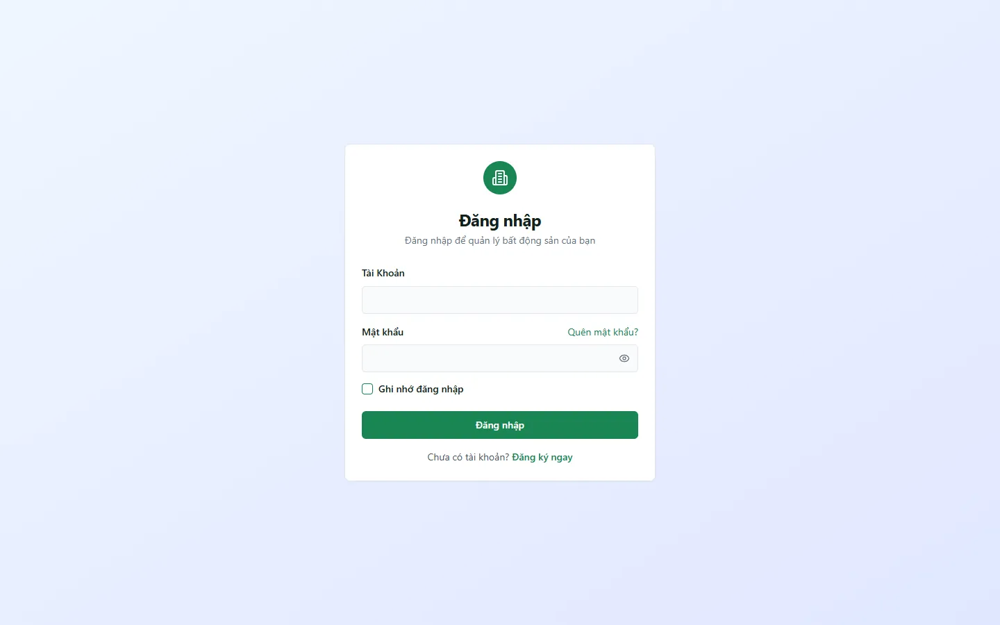

# Đăng nhập & khôi phục mật khẩu

Trang `/login` nhận username, số điện thoại hoặc email. `/login`, `/register`, `/forgot-password` dành cho người chưa đăng nhập; nếu đã có phiên, hệ thống chuyển về `/`. `/reset-password` là route công khai nhưng chỉ cho đặt mật khẩu khi có recovery session hợp lệ.

::: info Điều kiện tiên quyết
- Có tài khoản đã được cấp hoặc được mời vào tổ chức.
- Để dùng **Quên mật khẩu**, tài khoản phải có email thật mà bạn truy cập được.
- Đăng ký công khai đã đóng; `/register` chỉ hướng dẫn liên hệ quản trị.
:::

## Đăng nhập

**Bước 1**: Mở `/login`, nhập định danh vào ô **Tài Khoản**.

Hệ thống chuẩn hoá định danh như sau:

- Chuỗi 10–11 chữ số: số điện thoại.
- Chuỗi có dạng email: email.
- Giá trị khác: username, có hỗ trợ tiếng Việt và khoảng trắng trước khi chuẩn hoá nội bộ.

**Bước 2**: Nhập mật khẩu, dùng biểu tượng con mắt để kiểm tra ký tự.

**Bước 3**: Ấn **Đăng nhập**. Thành công sẽ điều hướng tới `/`: desktop hiển thị Bảng tin, mobile hiển thị HomeLauncher.

::: info Đích sau đăng nhập
Luồng đăng nhập hiện điều hướng về `/`. Nếu bạn được đưa tới đăng nhập từ một link mời hoặc route bảo vệ, hãy mở lại link/route đó sau khi đăng nhập; route đích vẫn kiểm tra capability và phạm vi.
:::

## Quên và đặt lại mật khẩu

1. Tại `/forgot-password`, nhập **email thật**. Form không nhận username hoặc số điện thoại cho luồng này.
2. Mở email và dùng link đặt lại; hướng dẫn giao diện ghi link có hiệu lực **1 giờ**.
3. `/reset-password` kiểm tra recovery session. Nếu session/link không hợp lệ hoặc đã dùng, quay lại xin link mới.
4. Mật khẩu mới cần tối thiểu **8 ký tự**, có chữ hoa, chữ thường và số.

## Nhận lời mời tổ chức

Người quản trị tạo lời mời tại `/settings/members` và gửi link thủ công. Người nhận phải đăng nhập bằng **đúng email được mời**, sau đó mở `/invite/:token`. Đăng nhập đúng nhưng link hết hạn vẫn không thể nhận lời mời; cần nhờ quản trị tạo link mới.

## Tình huống & lỗi thường gặp

| Tình huống | Cách xử lý |
|---|---|
| Đang đăng nhập nhưng mở `/login` hoặc `/forgot-password` | PublicRoute chuyển bạn về trang chủ; đăng xuất trước nếu muốn đổi tài khoản. |
| Báo sai tài khoản/mật khẩu | Kiểm tra khoảng trắng, kiểu định danh và mật khẩu; thông báo được gộp để không tiết lộ tài khoản nào tồn tại. |
| Không nhận email khôi phục | Kiểm tra spam và email thật đã gắn tài khoản; username demo/nội bộ không thay cho email khôi phục. |
| `/reset-password` báo link không hợp lệ | Link hết hạn, đã dùng hoặc recovery session không tồn tại; xin link mới. |
| `/register` không có form đăng ký | Đăng ký công khai đã đóng; liên hệ quản trị hoặc nhận lời mời tổ chức. |
| Link mời từ chối email | Đăng xuất tài khoản hiện tại và đăng nhập đúng email ghi trong lời mời. |

## Thử trực tiếp trên sandbox

<SandboxTry account="demo.quanly" app-path="/login" app-label="Mở trang Đăng nhập" view-only>

Dùng username demo và mật khẩu được công bố trên [trang Sandbox](/01-bat-dau/sandbox/). Sau đăng nhập, desktop mở Bảng tin tại `/`, còn mobile mở lưới chức năng.

</SandboxTry>

## Quy trình liên quan

- [Giới thiệu hệ thống](/01-bat-dau/gioi-thieu/)
- [Làm quen giao diện](/01-bat-dau/lam-quen-giao-dien/)
- [Thêm nhân viên & phân quyền](/01-bat-dau/them-nhan-vien/)
- [Bảng tin](/02-theo-doi-nhanh/bang-tin/)
