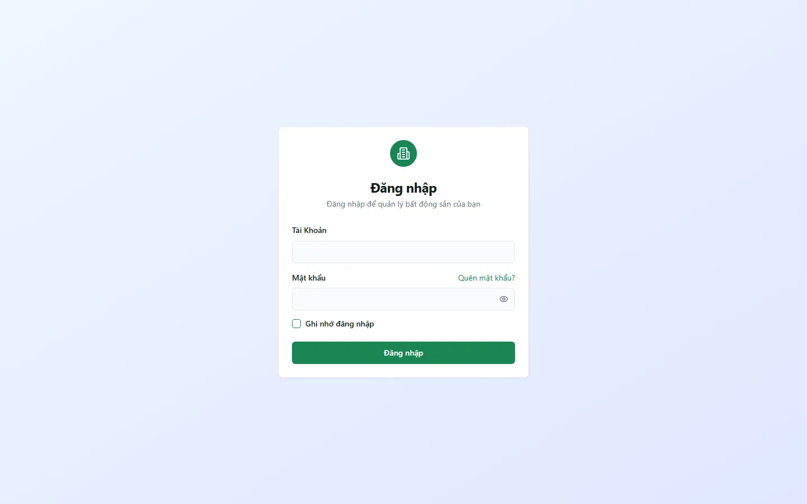

# Đăng nhập & khôi phục mật khẩu

Trang `/login` nhận username, số điện thoại hoặc email. `/login` và `/forgot-password` dành cho người chưa đăng nhập; nếu đã có phiên, hệ thống chuyển bạn đi tiếp (về trang đang chờ hoặc về `/`). `/reset-password` là route công khai nhưng chỉ cho đặt mật khẩu khi có phiên khôi phục hợp lệ.

::: info Điều kiện tiên quyết
- Có tài khoản do quản trị tạo hoặc được mời vào tổ chức.
- Để dùng **Quên mật khẩu**, tài khoản phải có email thật mà bạn truy cập được.
- Đăng ký công khai đã bỏ hẳn từ 15/09/2026: không còn trang `/register` (mở sẽ ra trang **404 — Không tìm thấy trang này**). Tài khoản mới chỉ do quản trị tạo hoặc qua lời mời tổ chức.
:::

## Đăng nhập

**Bước 1**: Mở `/login`, nhập định danh vào ô **Tài Khoản**.

Hệ thống chuẩn hoá định danh như sau:

- Chuỗi 10–11 chữ số: số điện thoại.
- Chuỗi có dạng email: email.
- Giá trị khác: username, có hỗ trợ tiếng Việt và khoảng trắng trước khi chuẩn hoá nội bộ.

**Bước 2**: Nhập **Mật khẩu**, dùng biểu tượng con mắt để kiểm tra ký tự. Ô **Ghi nhớ đăng nhập** vẫn hiện trên form; phiên đăng nhập luôn được giữ trên trình duyệt này cho tới khi bạn bấm **Đăng xuất** hoặc phiên hết hạn.

**Bước 3**: Ấn **Đăng nhập**. Thành công sẽ hiện thông báo **Đăng nhập thành công** và đưa bạn tới:

- **Trang bạn đang mở dở** — nếu bạn mở một đường dẫn cần đăng nhập (link mời, link ghim Ví cá nhân, link chia sẻ nội bộ…), hệ thống chuyển tới `/login?next=…` và sau khi đăng nhập quay lại đúng trang đó. Chỉ đường dẫn nội bộ của ứng dụng được chấp nhận; link trỏ ra ngoài hoặc trở lại các trang đăng nhập/quên mật khẩu bị bỏ qua và bạn về `/`.
- **Trang chủ `/`** trong các trường hợp còn lại: máy tính hiển thị Bảng tin, điện thoại hiển thị lưới chức năng.

Trang đích vẫn kiểm tra quyền và phạm vi như bình thường.

### Công ty làm việc được nhớ theo tài khoản

Mỗi tài khoản nhớ riêng **công ty đang chọn**. Sau khi đăng nhập, hệ thống khôi phục công ty bạn chọn lần trước — kể cả khi đăng nhập trên trình duyệt hay thiết bị khác — nên không cần chọn lại.

- Tài khoản chỉ thuộc một công ty: công ty đó được chọn tự động.
- Tài khoản thuộc nhiều công ty: đổi công ty tại **Tài khoản** → **Công ty làm việc** → **Công ty đang chọn**. Lựa chọn tự lưu, không cần bấm Lưu.
- Công ty đã lưu không còn khả dụng (bị gỡ quyền, đổi công ty): hệ thống yêu cầu chọn lại trong danh sách hiện có.
- Tài khoản chưa thuộc công ty nào: ô chọn ghi **Chưa có công ty** kèm lời nhắc liên hệ quản trị viên.

Chi tiết xem [Thông tin cá nhân](/06-tai-khoan/thong-tin-ca-nhan/).

## Quên và đặt lại mật khẩu

1. Tại `/login`, bấm **Quên mật khẩu?** để mở `/forgot-password`, rồi nhập **email thật**. Form không nhận username hoặc số điện thoại cho luồng này.
2. Hệ thống báo **Đã tiếp nhận yêu cầu đặt lại mật khẩu** — thông báo giống nhau dù email có tồn tại hay không. Mở email và dùng link đặt lại; link có hiệu lực **1 giờ**.
3. `/reset-password` kiểm tra phiên khôi phục. Nếu link hết hạn, đã dùng hoặc không hợp lệ, quay lại xin link mới.
4. Mật khẩu mới cần tối thiểu **8 ký tự**, có chữ hoa, chữ thường và số; danh sách yêu cầu được đánh dấu ngay khi bạn gõ.

## Nhận lời mời tổ chức

Người quản trị tạo lời mời bằng nút **Mời thành viên** tại `/settings/members` và gửi link cho bạn. Mở link `/invite/:token`:

- Nếu chưa đăng nhập, hệ thống đưa bạn tới `/login`, đăng nhập xong tự quay lại link mời.
- Phải đăng nhập bằng **đúng email được mời**. Nhận thành công thì ứng dụng tự chuyển về trang chủ sau vài giây.
- Link hết hạn hoặc sai thì không nhận được lời mời; nhờ quản trị tạo link mới.

## Đăng xuất & đổi tài khoản

Bấm **Đăng xuất** (máy tính: biểu tượng ở góc dưới thanh bên, cạnh tên tài khoản; điện thoại: trang Tài khoản). Đăng xuất chỉ áp dụng cho **thiết bị/trình duyệt đang dùng**; phiên trên thiết bị khác vẫn giữ nguyên.

Ứng dụng nạp lại hẳn trang `/login` và xoá mọi thứ tài khoản vừa thoát để lại trên trình duyệt: bộ lọc của mọi trang, cột đã ẩn ở bảng hoá đơn và thu chi, sổ chi chọn gần nhất. Tài khoản đăng nhập kế tiếp luôn bắt đầu từ bộ lọc mặc định.

- Phiên hết hạn, hoặc đăng xuất/đổi tài khoản ở tab khác: các tab còn mở tự nạp lại và cũng xoá như trên.
- Còn giữ: phiên đăng nhập của tài khoản mới, **công ty đã chọn của từng tài khoản** và dấu vết chống ghi trùng tiền. Các dữ liệu này gắn riêng từng người, để chính người đó dùng lại khi đăng nhập lại.
- Ô lọc toà tự bỏ toà bạn không còn được xem (mất quyền, đổi công ty) và trở về **Tất cả toà nhà**, thay vì lọc theo một toà không hiện tên.

## Tình huống & lỗi thường gặp

| Tình huống | Cách xử lý |
|---|---|
| Đang đăng nhập nhưng mở `/login` hoặc `/forgot-password` | Hệ thống chuyển bạn đi tiếp (trang đang chờ hoặc trang chủ); đăng xuất trước nếu muốn đổi tài khoản. |
| Bấm Đăng nhập khi để trống | Form báo **Tài Khoản không được để trống** / **Mật khẩu không được để trống** ngay dưới ô. |
| Báo sai tài khoản/mật khẩu | Dưới ô hiện **Email/số điện thoại hoặc mật khẩu không đúng.** Kiểm tra khoảng trắng, kiểu định danh và mật khẩu; thông báo được gộp để không tiết lộ tài khoản nào tồn tại. |
| Màn **Chưa thể kiểm tra phiên đăng nhập** | Mạng chậm hoặc lỗi khi khôi phục phiên; bấm **Thử lại** hoặc **Tải lại ứng dụng**. Dữ liệu đăng nhập không bị xoá. |
| Không nhận email khôi phục | Kiểm tra spam và email thật đã gắn tài khoản; username demo/nội bộ không thay cho email khôi phục. |
| `/reset-password` báo link không hợp lệ | Link hết hạn (sau 1 giờ), đã dùng hoặc phiên khôi phục không tồn tại; xin link mới. |
| Mở `/register` ra trang 404 | Đăng ký công khai đã bỏ; liên hệ quản trị để được tạo tài khoản hoặc nhận lời mời tổ chức. |
| Đăng nhập xong nhưng hầu hết trang trống | Kiểm tra **Tài khoản** → **Công ty làm việc**: chưa có công ty hoặc đang chọn nhầm công ty. |
| Link mời từ chối email | Đăng xuất tài khoản hiện tại và đăng nhập đúng email ghi trong lời mời. |

## Thử trực tiếp trên sandbox

<SandboxTry account="demo.quanly" app-path="/login" app-label="Mở trang Đăng nhập" view-only>

Dùng username demo và mật khẩu được công bố trên [trang Sandbox](/01-bat-dau/sandbox/). Sau đăng nhập, desktop mở Bảng tin tại `/`, còn mobile mở lưới chức năng. Mở **Tài khoản** để xem ô **Công ty làm việc** — tài khoản demo chỉ thuộc công ty DEMO nên công ty được chọn sẵn. Không đổi mật khẩu tài khoản demo.

</SandboxTry>

## Quy trình liên quan

- [Giới thiệu hệ thống](/01-bat-dau/gioi-thieu/)
- [Làm quen giao diện](/01-bat-dau/lam-quen-giao-dien/)
- [Thông tin cá nhân](/06-tai-khoan/thong-tin-ca-nhan/)
- [Thêm nhân viên & phân quyền](/01-bat-dau/them-nhan-vien/)
- [Bảng tin](/02-theo-doi-nhanh/bang-tin/)
