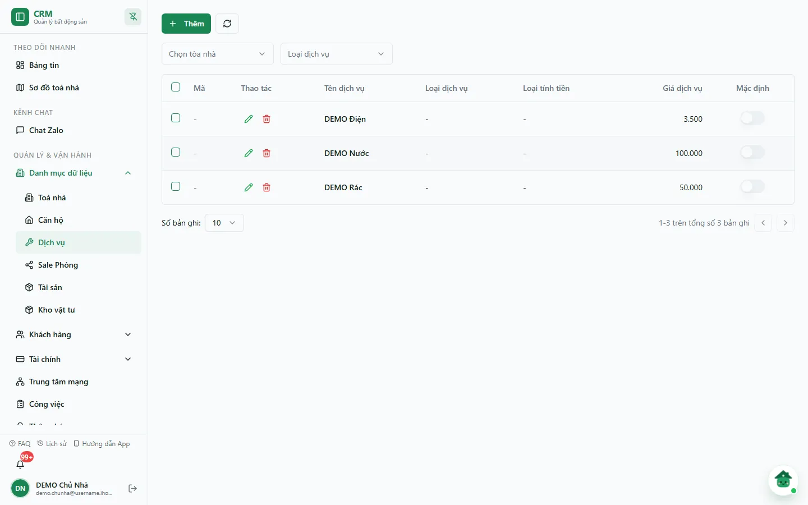
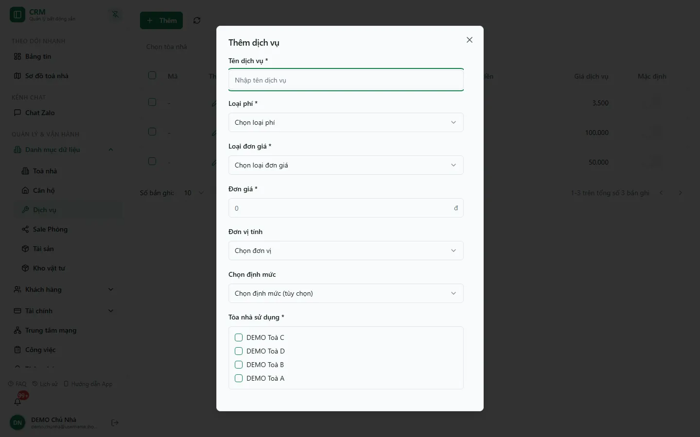
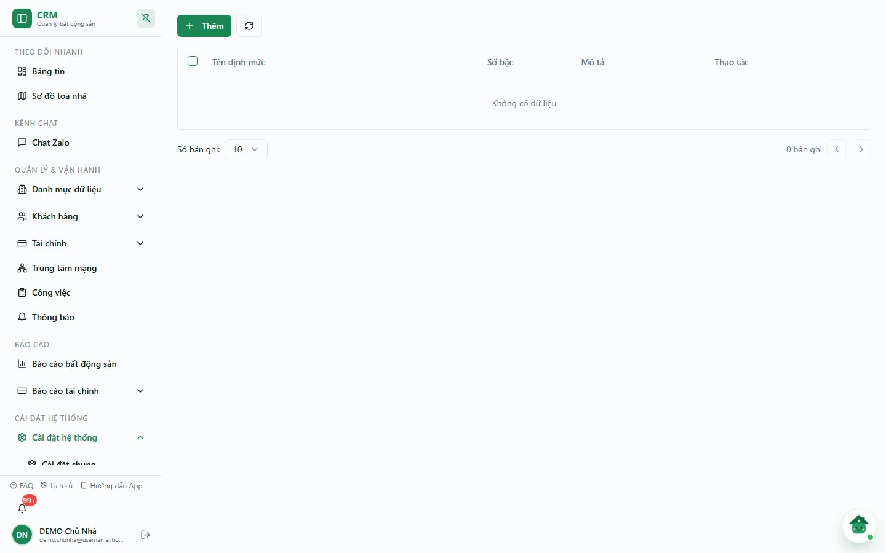

# Bước 3: Dịch vụ & định mức

Dịch vụ là các khoản thu ngoài tiền phòng: điện, nước, rác, giữ xe, phí dịch vụ chung… Ở bước này bạn khai báo **danh mục dịch vụ dùng chung cho mọi toà**, chọn **loại phí** và **loại đơn giá** cho từng dịch vụ, rồi **gán vào các toà** sử dụng. Đây là nền tảng để hệ thống tính đúng số tiền trên hoá đơn hàng tháng, nên hãy làm sau khi đã có toà nhà và trước khi ký hợp đồng.

::: info Điều kiện tiên quyết
- `services.view` để mở trang, `services.create` để thêm dịch vụ. Tạo định mức riêng cần `service_quotas.create`.
- Đã tạo ít nhất một toà nhà để gán dịch vụ (xem [Tạo khu vực & toà nhà](/01-bat-dau/tao-toa-nha/)).
- Nếu tính giá luỹ tiến (điện bậc thang): chuẩn bị sẵn các mốc bậc và đơn giá từng bậc.
:::

## Hướng dẫn từng bước

**Bước 1**: Tại thanh menu, mở **Quản lý & Vận hành** => **Danh mục dữ liệu** => **Dịch vụ** (`/services`). Màn hình có nút **Thêm**, nút làm mới, hai bộ lọc **Chọn tòa nhà** và **Loại dịch vụ**, và bảng với các cột **Mã**, **Thao tác**, **Tên dịch vụ**, **Loại dịch vụ**, **Loại tính tiền**, **Giá dịch vụ**, **Mặc định**.

**Bước 2**: Ấn **Thêm**. Hộp thoại **Thêm dịch vụ** mở ra.

**Bước 3**: Điền **Tên dịch vụ** và chọn **Loại phí**: **Tiền phí dịch vụ**, **Tiền điện**, **Tiền nước**, **Tiền phí khác** hoặc **Tiền vệ sinh**. Với điện và nước, hãy chọn đúng **Tiền điện** / **Tiền nước** — công tơ dựa vào loại phí này để tìm dịch vụ (xem [Bước 4](/01-bat-dau/cong-to/)).

**Bước 4**: Chọn **Loại đơn giá** (trên bảng hiển thị ở cột **Loại tính tiền**). Có năm lựa chọn:

| Loại đơn giá | Cách tính | Ví dụ |
|---|---|---|
| **Đơn giá cố định theo tháng** | Một khoản cố định mỗi tháng, không phụ thuộc số người hay số phòng | Phí dịch vụ chung, wifi |
| **Đơn giá theo người** | Đơn giá nhân với số người đang ở trong phòng | Rác, giữ xe (tính đầu người) |
| **Đơn giá theo phòng** | Mỗi phòng một khoản như nhau, dù ở bao nhiêu người | Phí vệ sinh theo phòng |
| **Đơn giá cố định theo đồng hồ** | Theo sản lượng tiêu thụ = (chỉ số mới − chỉ số cũ) × đơn giá | Điện (Kwh), nước (m³) |
| **Đơn giá biến động** | Đơn giá xác định theo dữ liệu phát sinh/cấu hình nghiệp vụ | Khoản có giá thay đổi theo kỳ |

**Bước 5**: Điền **Đơn giá** (bắt buộc) và chọn **Đơn vị tính**: Phòng, Người, Kwh, m³, Lượt, Tháng hoặc Chiếc. Với dịch vụ theo đồng hồ, đơn giá là giá cho mỗi Kwh hoặc mỗi m³.

::: tip Dịch vụ theo đồng hồ cần công tơ
Điện và nước tính theo đồng hồ chỉ ra được số tiền khi phòng đã có **công tơ** để ghi chỉ số. Khai báo dịch vụ ở đây trước, rồi gắn công tơ vào phòng ở [Bước 4: Công tơ điện nước](/01-bat-dau/cong-to/).
:::

**Bước 6**: (Tuỳ chọn) Ở ô **Chọn định mức**, chọn một bảng giá bậc thang hoặc để **Không chọn**. Định mức được tạo tại trang **Định mức dịch vụ** (xem mục bên dưới).

**Bước 7**: Ở **Tòa nhà sử dụng**, tích **ít nhất một toà** (bắt buộc). Điền **Mô tả** nếu cần, rồi ấn **Lưu**. Dịch vụ mới xuất hiện trong danh sách và sẵn sàng để chọn khi lập hợp đồng / hoá đơn cho các toà đã gán.

::: tip Giá riêng theo toà đặt trong form Toà nhà
Form dịch vụ chỉ có một **Đơn giá** chung. Muốn một toà dùng giá khác, mở **Toà nhà** => **Sửa** => khối **Dịch vụ toà nhà** và điền ô **Đơn giá** của dịch vụ đó. Giá riêng theo toà luôn **thắng** đơn giá chung; xoá ô giá riêng để toà quay về giá chung.
:::

## Tạo định mức bậc thang

Mở **Cài đặt hệ thống** => **Danh mục khác** => **Định mức dịch vụ** (`/settings/categories/service-quotas`). Bảng có các cột **Tên định mức**, **Số bậc**, **Mô tả**, **Thao tác**.

Ấn **Thêm** để mở **Thêm định mức dịch vụ**: điền **Tên định mức**, **Mô tả**, rồi thêm các **Bậc định mức** gồm **Từ – Đến – Đơn giá**; để trống mốc **Đến** (hiện `∞`) ở bậc cuối khi muốn áp không giới hạn. Sau khi lưu, mở lại để kiểm tra đủ bậc trước khi gắn vào dịch vụ. Chi tiết xem [Định mức dịch vụ](/05-cai-dat/dinh-muc-dich-vu/).

## Các tính năng khác trên màn hình

| Nút / Bộ lọc | Công dụng |
|---|---|
| Bộ lọc **Chọn tòa nhà** | Chỉ hiện các dịch vụ đã gán cho toà được chọn; **Tất cả tòa nhà** để bỏ lọc. |
| Bộ lọc **Loại dịch vụ** | Lọc theo loại phí; **Tất cả loại** để bỏ lọc. |
| Cột **Mặc định** | Đánh dấu dịch vụ được gợi ý sẵn khi lập hợp đồng (chỉ hiển thị, không bật/tắt tại bảng). |
| Nút **Sửa** (bút chì) | Mở hộp **Sửa dịch vụ** để chỉnh tên, loại phí, loại đơn giá, đơn giá, định mức, toà sử dụng. |
| Nút **Xoá** (thùng rác) | Ẩn dịch vụ khỏi danh mục (không xoá dữ liệu lịch sử đã dùng). |
| Nút làm mới | Tải lại danh sách dịch vụ. |

## Tình huống & lỗi thường gặp

| Tình huống | Cách xử lý |
|---|---|
| Thêm dịch vụ nhưng một toà không thấy nó | Dịch vụ chưa được gán cho toà đó. Mở **Sửa**, tích toà ở **Tòa nhà sử dụng**, rồi lưu lại. |
| Giá trên hoá đơn khác đơn giá chung | Toà đang dùng **giá riêng** đặt trong form **Toà nhà**. Kiểm tra khối **Dịch vụ toà nhà** của toà. |
| Đổi đơn giá chung nhưng một toà vẫn tính giá cũ | Toà đó có giá riêng nên không đổi theo. Xoá ô giá riêng của toà để về giá chung. |
| Form báo "Chưa tải đủ tòa hoặc định mức" | Ấn **Tải lại dữ liệu** rồi mới lưu. |
| Dịch vụ theo đồng hồ nhưng hoá đơn không có dòng điện/nước | Phòng chưa có công tơ để ghi chỉ số. Sang [Bước 4: Công tơ điện nước](/01-bat-dau/cong-to/). |
| Tạo công tơ báo chưa có dịch vụ "Tiền điện"/"Tiền nước" | Dịch vụ điện/nước chưa chọn đúng **Loại phí**. Sửa dịch vụ, chọn **Tiền điện** / **Tiền nước** rồi tạo lại công tơ. |
| Định mức đã lưu nhưng tính bậc thang bị sai / thiếu bậc | Mở lại định mức kiểm tra đủ số bậc, các khoảng **Từ – Đến** nối liền nhau và bậc cuối để trống mốc Đến. |

::: warning Xoá dịch vụ
Xoá dịch vụ chỉ ẩn nó khỏi danh mục, không đụng tới hoá đơn/hợp đồng đã dùng dịch vụ đó. Nhưng dịch vụ đã ẩn sẽ không còn chọn được cho hợp đồng mới — cân nhắc bỏ gán khỏi toà thay vì xoá.
:::

## Thử trực tiếp trên sandbox

<SandboxTry account="demo.chunha" app-path="/services" app-label="Mở màn Dịch vụ" fixtures="Snapshot 07/10/2026: DEMO Điện 3.500; DEMO Nước 100.000; DEMO Rác 50.000; chưa có định mức." view-only>

Mở màn **Dịch vụ** và quan sát ba dòng hiện hành. Ở snapshot này ba dịch vụ DEMO chưa khai **Loại dịch vụ** và **Loại tính tiền** (cột hiện `-`), nên là ví dụ tốt về dữ liệu cần bổ sung. Ấn **Thêm** để xem các trường bắt buộc rồi đóng hộp thoại; không bấm **Lưu/Sửa/Xoá** trong bài chỉ xem.

**Kết quả mong đợi**: bạn phân biệt được dịch vụ cần công tơ với dịch vụ cố định/theo người/theo phòng, và biết một dịch vụ mới phải gắn ít nhất một toà.

</SandboxTry>

## Quy trình liên quan

- [Tạo khu vực & toà nhà](/01-bat-dau/tao-toa-nha/) — phải có toà trước mới gán được dịch vụ; giá riêng theo toà đặt ở đây.
- [Công tơ điện nước](/01-bat-dau/cong-to/) — bước tiếp theo cho các dịch vụ tính theo đồng hồ.
- [Định mức dịch vụ](/05-cai-dat/dinh-muc-dich-vu/) — quản lý bảng giá bậc thang.
- [Dịch vụ (quản lý vận hành)](/03-quan-ly-van-hanh/dich-vu/) — quản lý dịch vụ trong vận hành hằng ngày.
