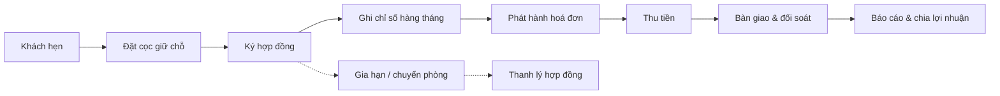

# Giới thiệu hệ thống

ptcrm là hệ thống quản lý cho thuê phòng trọ / căn hộ: từ khách hẹn xem phòng, đặt cọc, ký hợp đồng, ghi chỉ số điện nước, phát hành hoá đơn, thu tiền, bàn giao — đối soát sổ quỹ, đến báo cáo tài chính và chia lợi nhuận cổ đông.

Tài liệu này dành cho chủ nhà, quản lý toà, kế toán, sale, kỹ thuật và cổ đông. Mỗi trang hướng dẫn một màn hình hoặc nghiệp vụ, nêu rõ điều kiện vào trang, quyền cần có, phạm vi dữ liệu nhìn thấy, kết quả sau thao tác và các ngoại lệ thường gặp.

## Vòng đời nghiệp vụ tổng quát

## Bản đồ điều hướng hiện tại

Trên máy tính, sidebar được chia theo các nhóm **THEO DÕI NHANH**, **QUẢN LÝ & VẬN HÀNH**, **BÁO CÁO**, **CÀI ĐẶT HỆ THỐNG** và **TÀI KHOẢN**. Mục **Thông báo** hiện nằm trong nhóm Quản lý & Vận hành; trên điện thoại, trang `/` là lưới biểu tượng và chỉ hiện các ô đúng capability của tài khoản.

Các đường dẫn nghiệp vụ như `/`, `/dashboard`, `/building-map`, `/notifications`, `/my-day`, `/buildings`, `/apartments`, `/services` và các trang cài đặt đều yêu cầu đăng nhập. Riêng `/login`, `/register`, `/forgot-password`, `/reset-password` là luồng xác thực công khai; người đã đăng nhập sẽ được chuyển khỏi ba trang đầu. Các kênh chia sẻ `/c/:code`, `/r/:token`, `/phongtrong` và trang quay số công khai không yêu cầu tài khoản.

## Quyền và phạm vi là hai lớp độc lập

- **Capability** trả lời “được làm gì”: ví dụ `rooms.view` để xem phòng, `rooms.create` để thêm phòng, `notifications.delete` để xoá thông báo.
- **Phạm vi** trả lời “được làm ở đâu”: toàn tổ chức, khu vực, toà nhà hoặc sổ quỹ. Dữ liệu thực tế còn được RLS lọc theo phạm vi này.
- Tên vai trò chỉ là nhãn của một gói quyền. Quyền hiệu lực được cộng từ vai trò, phạm vi và ngoại lệ riêng; lệnh **Cấm (DENY)** luôn thắng.
- Vai trò không gắn phạm vi thì chưa tạo quyền sử dụng thực tế. Một người có thể mang nhiều vai trò ở nhiều phạm vi khác nhau.
- Phạm vi **Toàn tổ chức** là lựa chọn độc quyền và bao gồm cả toà/sổ quỹ tạo trong tương lai; phạm vi toà chỉ cho thấy dữ liệu của các toà được giao.

::: info Quy mô catalog production
Bằng chứng schema production đo ngày **13/08/2026** ghi nhận **317 bảng logic**, **92 partition con**, **12 view**, **1.558 function** (trong đó **1.086 `SECURITY DEFINER`**), **30 enum** và **30 bảng Realtime**. Người dùng không cần nhớ các con số này; ngày đo cho biết đây là snapshot kiểm chứng, không phải con số cố định vĩnh viễn.
:::

Để bắt đầu thao tác, đọc tiếp [Khởi tạo dữ liệu](/01-bat-dau/khoi-tao-du-lieu/), [Làm quen giao diện](/01-bat-dau/lam-quen-giao-dien/) và [Sandbox — Môi trường thực hành](/01-bat-dau/sandbox/).
