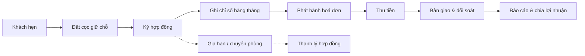

# Giới thiệu hệ thống

ptcrm là hệ thống quản lý cho thuê phòng trọ / căn hộ: từ khách hẹn xem phòng, đặt cọc, ký hợp đồng, ghi chỉ số điện nước, phát hành hoá đơn, thu tiền, bàn giao — đối soát sổ quỹ, đến báo cáo tài chính và chia lợi nhuận cổ đông.

Tài liệu này dành cho người vận hành: chủ nhà, quản lý toà, kế toán, sale và kỹ thuật. Mỗi trang hướng dẫn một màn hình hoặc một nghiệp vụ, kèm ảnh chụp từng bước thao tác thật.

## Vòng đời nghiệp vụ tổng quát

## 7 khu chức năng

| Khu | Nội dung chính |
|---|---|
| **Theo dõi nhanh** | Bảng tin, sơ đồ toà nhà, thông báo, việc của tôi |
| **Danh mục dữ liệu** | Toà nhà, phòng, dịch vụ, tài sản, kho vật tư, sale phòng |
| **Khách hàng** | Khách hẹn, đặt cọc, hợp đồng, cư dân, phương tiện |
| **Tài chính** | Ghi chỉ số, hoá đơn, thu tiền, thu chi, sổ quỹ, lương, chia lợi nhuận |
| **Báo cáo** | Báo cáo bất động sản & báo cáo tài chính |
| **Cài đặt** | Danh mục, mẫu biểu, nhân viên, phân quyền |
| **Kênh công khai** | Trang phòng trống chia sẻ khách, tra cứu hoá đơn QR, chat Zalo |
