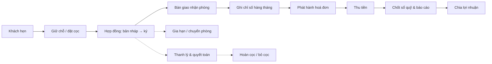

# Giới thiệu hệ thống

ptcrm là hệ thống quản lý cho thuê phòng trọ / căn hộ: từ khách hẹn xem phòng, giữ chỗ và đặt cọc, ký hợp đồng, bàn giao phòng, ghi chỉ số điện nước, phát hành hoá đơn, thu tiền, ghi chi — đối soát và chốt sổ quỹ, đến thanh lý hợp đồng, hoàn cọc, báo cáo tài chính và chia lợi nhuận cổ đông.

Tài liệu này dành cho chủ nhà, quản lý toà, kế toán, sale, kỹ thuật và cổ đông. Mỗi trang hướng dẫn một màn hình hoặc nghiệp vụ, nêu rõ điều kiện vào trang, quyền cần có, phạm vi dữ liệu nhìn thấy, kết quả sau thao tác và các ngoại lệ thường gặp.

## Vòng đời nghiệp vụ tổng quát

```mermaid
flowchart LR
  A[Khách hẹn] --> B[Giữ chỗ / đặt cọc]
  B --> C[Hợp đồng: bản nháp → ký]
  C --> D[Bàn giao nhận phòng]
  D --> E[Ghi chỉ số hàng tháng]
  E --> F[Phát hành hoá đơn]
  F --> G[Thu tiền]
  G --> H[Chốt sổ quỹ & báo cáo]
  H --> I[Chia lợi nhuận]
  C -.-> J[Gia hạn / chuyển phòng]
  C -.-> K[Thanh lý & quyết toán]
  K -.-> L[Hoàn cọc / bỏ cọc]
```

Tiền chỉ thật sự vào/ra sổ quỹ khi phiếu thu chi ở trạng thái **Đã Thu / Đã Chi** (đã ghi sổ). Phiếu được duyệt là bước kiểm soát quy trình, chưa phải tiền thật vào sổ.

Xem bản đồ từng luồng: [Khách thuê](/01-bat-dau/quy-trinh-khach-thue/), [Thu tiền](/01-bat-dau/quy-trinh-thu-tien/), [Bàn giao](/01-bat-dau/quy-trinh-ban-giao/), [Thanh lý](/01-bat-dau/quy-trinh-thanh-ly/), [Chốt tháng](/01-bat-dau/quy-trinh-chot-thang/).

## Bản đồ điều hướng hiện tại

Trên máy tính, thanh bên được chia theo các nhóm **THEO DÕI NHANH**, **KÊNH CHAT**, **QUẢN LÝ & VẬN HÀNH** (gồm Danh mục dữ liệu, Khách hàng, Tài chính, Trung tâm mạng, Công việc, Thông báo), **BÁO CÁO**, **CÀI ĐẶT HỆ THỐNG** và **TÀI KHOẢN**. Trên điện thoại, trang `/` là màn hình chính dạng lưới biểu tượng (Vận hành, Khách hàng & Hợp đồng, Tài chính, Cá nhân, Hệ thống) và chỉ hiện các ô đúng capability của tài khoản. Chi tiết xem [Làm quen giao diện](/01-bat-dau/lam-quen-giao-dien/).

Các đường dẫn nghiệp vụ như `/`, `/dashboard`, `/building-map`, `/notifications`, `/my-day`, `/buildings`, `/apartments`, `/services` và các trang cài đặt đều yêu cầu đăng nhập; mở khi chưa đăng nhập sẽ được đưa tới `/login` rồi quay lại đúng trang sau khi đăng nhập. Riêng `/login`, `/forgot-password`, `/reset-password` là luồng xác thực công khai; người đã đăng nhập sẽ được chuyển khỏi hai trang đầu. Đăng ký công khai (`/register`) đã bỏ — tài khoản mới do quản trị tạo hoặc qua lời mời. Các kênh chia sẻ `/c/:code` (hoá đơn mới nhất theo mã QR hợp đồng), `/r/:token`, `/phongtrong` (phòng trống) và trang quay số công khai `/quayso/…` không yêu cầu tài khoản.

## Công ty, quyền và phạm vi

- **Công ty đang chọn**: một tài khoản có thể thuộc nhiều công ty. Công ty làm việc được nhớ theo tài khoản (chọn ở **Tài khoản** → **Công ty làm việc**); ranh giới công ty do hệ thống chặn ở cơ sở dữ liệu, nên không thể thấy dữ liệu công ty khác.
- **Capability** trả lời “được làm gì”: ví dụ `rooms.view` để xem phòng, `rooms.create` để thêm phòng, `notifications.delete` để xoá thông báo.
- **Phạm vi** trả lời “được làm ở đâu”: toàn tổ chức, khu vực, toà nhà hoặc sổ quỹ. Dữ liệu thực tế còn được RLS lọc theo phạm vi này.
- Tên vai trò chỉ là nhãn của một gói quyền. Quyền hiệu lực được cộng từ vai trò, phạm vi và ngoại lệ riêng; lệnh **Cấm (DENY)** luôn thắng.
- Vai trò không gắn phạm vi thì chưa tạo quyền sử dụng thực tế. Một người có thể mang nhiều vai trò ở nhiều phạm vi khác nhau.
- Phạm vi **Toàn tổ chức** là lựa chọn độc quyền và bao gồm cả toà/sổ quỹ tạo trong tương lai; phạm vi toà chỉ cho thấy dữ liệu của các toà được giao.

Để bắt đầu thao tác, đọc tiếp [Đăng nhập](/01-bat-dau/dang-nhap/), [Khởi tạo dữ liệu](/01-bat-dau/khoi-tao-du-lieu/), [Làm quen giao diện](/01-bat-dau/lam-quen-giao-dien/) và [Sandbox — Môi trường thực hành](/01-bat-dau/sandbox/).
