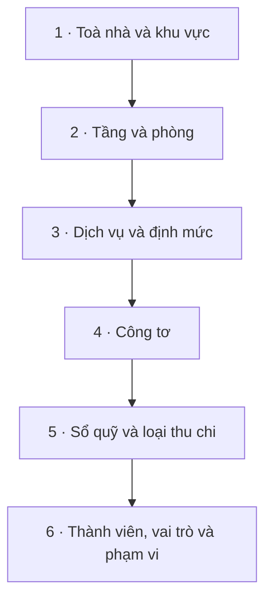

# Khởi tạo dữ liệu — thứ tự chuẩn

Một toà mới có thể tạo hợp đồng tối thiểu sau khi đã có **toà nhà → tầng/phòng → dịch vụ**. Để vận hành đầy đủ, cần bổ sung định mức, công tơ, sổ quỹ, loại thu chi, thành viên, vai trò và phạm vi. Các trang danh mục chuẩn bên dưới là nguồn cấu hình chính thức; không nên dựa vào wizard hoặc nút “tạo nhanh” để hoàn tất hồ sơ toà.

::: info Điều kiện tiên quyết
- Đã [đăng nhập](/01-bat-dau/dang-nhap/) và có capability phù hợp cho từng bước; quyền xem trang (`*.view`) không tự cho phép tạo/sửa/xoá.
- Người thực hiện phải có phạm vi phù hợp. Tài khoản chỉ có quyền nhưng không có phạm vi sẽ không thấy dữ liệu để thao tác.
- Khu vực là nhãn nhóm tuỳ chọn. Toà nhà, phòng và dịch vụ mới là ba lớp tối thiểu bắt buộc.
:::

## Critical path khởi tạo

| Bước | Trang chuẩn | Capability tạo dữ liệu | Kết quả |
|---|---|---|---|
| 1 | `/buildings` | `buildings.create`; `areas.create` nếu dùng khu vực | Toà có tên và địa chỉ đầy đủ; khu vực là nhãn N:N tuỳ chọn. |
| 2 | `/apartments` | `rooms.create` | Phòng có toà, tầng, giá thuê/cọc và tên duy nhất trong toà. |
| 3 | `/services`; `/settings/categories/service-quotas` | `services.create`; `service_quotas.create` | Dịch vụ được gán ít nhất một toà; định mức được chọn khi cần. |
| 4 | `/settings/meters` | `meters.create` | Công tơ Điện/Nước/Gas gắn đúng phòng và dịch vụ cùng tên. |
| 5 | `/finance/cashbooks`; `/settings/income-expense-types` | `cashbooks.create`; `categories.create` | Có nơi ghi tiền, người phụ trách và danh mục phân loại thu/chi. |
| 6 | `/settings/members`; `/settings/roles` | `users.create`; `users.edit` | Thành viên nhận lời mời, có vai trò và ít nhất một phạm vi hiệu lực. |

### Ba bước tối thiểu

1. Tạo toà tại `/buildings`. Form chuẩn yêu cầu tên, tỉnh/thành, quận/huyện, phường/xã và địa chỉ chi tiết.
2. Tạo tầng/phòng tại `/apartments`. Chỉ các toà đang hoạt động và nằm trong phạm vi của bạn mới xuất hiện.
3. Tạo dịch vụ tại `/services`, chọn loại phí, loại đơn giá, giá, đơn vị và ít nhất một toà sử dụng.

Sau ba bước này có thể bắt đầu dựng hợp đồng cơ bản. Công tơ là bắt buộc nếu muốn ghi điện/nước theo tiêu thụ; sổ quỹ và loại thu chi là bắt buộc trước khi ghi nhận dòng tiền đúng chuẩn.

### Các bước để sẵn sàng vận hành

- Tạo định mức tại `/settings/categories/service-quotas` nếu dịch vụ dùng bảng giá/định mức.
- Tạo công tơ tại `/settings/meters`. Loại Điện/Nước/Gas được nối với dịch vụ có tên chính xác **Điện**, **Nước**, **Gas**.
- Tạo sổ quỹ tại `/finance/cashbooks`, điền số dư/ngày đầu kỳ, người phụ trách và toà mặc định cho phiếu nhanh nếu cần.
- Tạo loại thu chi tại `/settings/income-expense-types`, chọn Thu/Chi, nhóm, trạng thái hạn chế hoặc hạng mục đặc biệt khi phù hợp.
- Tạo vai trò dùng lại tại `/settings/roles`, rồi mời người ở `/settings/members`. Vai trò không chứa phạm vi; phạm vi được chọn lúc gán vai trò cho từng người.

::: warning Không dùng “tạo toà nhanh” làm hồ sơ chính
Nút **+ Thêm toà nhà** trong form phòng chỉ hỏi tên và mã, trong khi form chuẩn yêu cầu đủ địa chỉ. Nếu thao tác nhanh bị backend chặn hoặc tạo ra hồ sơ thiếu thông tin, hãy đóng form và tạo tại `/buildings` trước.
:::

## Trạng thái và ngoại lệ cần biết

| Tình huống | Cách xử lý |
|---|---|
| Không thấy toà/phòng/sổ quỹ dù đã có dữ liệu | Kiểm tra cả capability và phạm vi. Menu hiện không có nghĩa là dữ liệu mọi toà đều được mở. |
| Không tạo được phòng | Toà phải đang hoạt động; tên phòng phải duy nhất trong cùng toà. |
| Không tạo được công tơ | Cần phòng và dịch vụ tên chính xác **Điện/Nước/Gas** tương ứng. |
| Vai trò đã gán nhưng người dùng vẫn không có quyền | Mỗi vai trò phải có ít nhất một phạm vi; **Cấm** trong vai trò/ngoại lệ luôn thắng **Cho**. |
| Cần quyền cho mọi toà hiện tại và tương lai | Chọn phạm vi **Toàn tổ chức**. Phạm vi này không kết hợp đồng thời với khu/toà/sổ quỹ lẻ. |
| Xoá toà bị chặn | Toà còn phòng chưa xoá; xử lý phòng trước. |

## Thử trực tiếp trên sandbox

<SandboxTry account="demo.chunha" app-path="/buildings" app-label="Mở Toà nhà (sandbox)" view-only>

Sandbox production hiện có **4 toà DEMO**, mỗi toà ít nhất **10 phòng**, bao phủ đủ năm trạng thái hiển thị: đang thuê, sắp hết hạn, giữ chỗ, trống và bảo trì. Dùng chế độ chỉ xem để lần lượt đối chiếu `/buildings`, `/apartments`, `/services`, `/settings/meters` và `/finance/cashbooks`.

</SandboxTry>

## Quy trình liên quan

- [Tạo khu vực & toà nhà](/01-bat-dau/tao-toa-nha/)
- [Tạo tầng & phòng](/01-bat-dau/tao-tang-phong/)
- [Dịch vụ & định mức](/01-bat-dau/dich-vu-dinh-muc/)
- [Công tơ điện nước](/01-bat-dau/cong-to/)
- [Sổ quỹ & loại thu chi](/01-bat-dau/so-quy-loai-thu-chi/)
- [Thêm nhân viên & phân quyền](/01-bat-dau/them-nhan-vien/)
