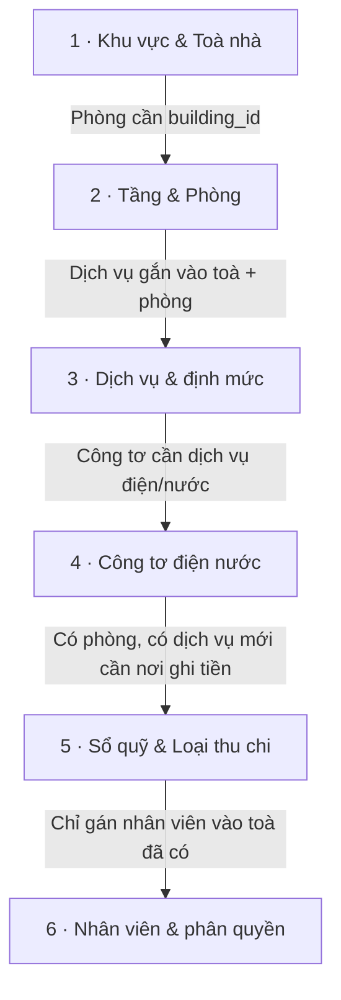

# Khởi tạo dữ liệu — thứ tự chuẩn

Khi bắt đầu dùng ptcrm cho một toà nhà mới, bạn cần khai báo dữ liệu nền theo **đúng thứ tự**: mỗi lớp dữ liệu bên dưới đều tham chiếu tới lớp phía trước, nên đảo thứ tự sẽ khiến hệ thống chặn hoặc để trống. Trang này là bản đồ tổng quan 6 bước — mỗi bước dẫn tới một trang hướng dẫn chi tiết. Đọc trang này trước khi thao tác để không phải làm đi làm lại.

::: info Điều kiện tiên quyết
- Bạn đã **Đăng nhập** bằng tài khoản chủ nhà (super admin) hoặc tài khoản có quyền các module nhóm **Bất động sản** (Khu vực / Toà nhà / Phòng / Dịch vụ), **Sổ quỹ** và **Nhân viên**.
- Chưa cần dữ liệu gì trước — đây là việc đầu tiên sau khi đăng nhập. Bạn sẽ tạo dữ liệu từ con số 0.
- Nên xem qua [Giới thiệu hệ thống](/01-bat-dau/gioi-thieu/) và [Làm quen giao diện](/01-bat-dau/lam-quen-giao-dien/) để biết vị trí các menu.
:::

## Hướng dẫn từng bước

Sáu lớp dữ liệu phải khai theo trình tự sau. Mũi tên là ràng buộc: lớp sau cần lớp trước mới tồn tại được.

**Bước 1**: Tạo **Khu vực** rồi **Toà nhà**. Khu vực chỉ là nhãn nhóm (một toà có thể thuộc nhiều khu), còn toà nhà là đơn vị trung tâm mà gần như mọi dữ liệu về sau bám vào. *Vì sao đứng đầu:* phòng, tầng, dịch vụ, công tơ, hoá đơn, hợp đồng đều mang khoá `building_id` — chưa có toà thì không có gì để gắn vào. Chi tiết ở [Tạo khu vực & toà nhà](/01-bat-dau/tao-toa-nha/).

**Bước 2**: Trong toà vừa tạo, khai **Tầng** rồi **Phòng/Căn hộ**. *Vì sao không đảo được:* cột `building_id` của phòng và tầng là bắt buộc (NOT NULL) — dropdown chọn toà khi tạo phòng **chỉ liệt kê toà đang hoạt động**, nên nếu chưa có toà (hoặc toà đang tắt) thì không tạo được phòng. Mỗi phòng còn phải có **tên duy nhất trong toà**. Chi tiết ở [Tạo tầng & phòng](/01-bat-dau/tao-tang-phong/).

**Bước 3**: Khai **Dịch vụ & định mức** (điện, nước, wifi, vệ sinh, gửi xe…) và bật/đặt giá riêng cho từng toà. *Vì sao đứng sau toà–phòng:* dịch vụ được gắn vào toà qua bảng nối (bật/tắt + giá override từng toà) nên cần có toà trước; định mức bậc thang (điện luỹ tiến) gắn vào dịch vụ để hoá đơn biết cách tính tiền. Chi tiết ở [Dịch vụ & định mức](/01-bat-dau/dich-vu-dinh-muc/).

**Bước 4**: Gắn **Công tơ điện nước** cho từng phòng và ghi chỉ số đầu. *Vì sao phải sau bước 2 và 3:* mỗi công tơ tham chiếu đồng thời **một phòng** và **một dịch vụ** kiểu đồng hồ (điện/nước). Chưa có phòng thì không biết gắn công tơ ở đâu; chưa khai dịch vụ điện/nước thì không có dịch vụ để chọn cho công tơ. Chi tiết ở [Công tơ điện nước](/01-bat-dau/cong-to/).

**Bước 5**: Lập **Sổ quỹ** (tiền mặt / chuyển khoản) và **Loại thu chi**. *Vì sao ở đây:* toà nhà mang cấu hình **sổ quỹ mặc định** (nơi ghi nhận khi khách trả tiền phòng), nên bạn tạo sổ quỹ rồi quay lại gán vào toà; loại thu chi phải có sẵn trước khi ghi phiếu thu/chi đầu tiên. Có phòng và dịch vụ rồi thì lớp này mới thực sự cần dùng đến. Chi tiết ở [Sổ quỹ & loại thu chi](/01-bat-dau/so-quy-loai-thu-chi/).

::: danger Sổ quỹ liên quan trực tiếp tới tiền
Sổ quỹ mặc định của toà quyết định phiếu thu tiền phòng rơi vào quỹ nào. Đặt sai sổ sẽ làm số dư và báo cáo lợi nhuận lệch. Kiểm tra kỹ sổ **TT** (tiền mặt/thanh toán) và **TK** (chuyển khoản) trước khi phát sinh giao dịch thật.
:::

**Bước 6**: Cuối cùng, **Thêm nhân viên & phân quyền** rồi gán phạm vi (theo toà hoặc theo khu). *Vì sao để cuối:* phân quyền nhân viên trỏ tới toà/khu cụ thể — chỉ gán được vào toà và khu đã tồn tại. Nhân viên **chưa được gán toà nào sẽ không thấy dữ liệu gì** (màn hình hiện "Chưa có dữ liệu"), nên hoàn tất 5 lớp trên trước rồi mới mở quyền. Chi tiết ở [Thêm nhân viên & phân quyền](/01-bat-dau/them-nhan-vien/).

::: tip Làm theo đúng thứ tự sẽ nhanh hơn
Bước 1 → 3 dựng khung; bước 4 → 6 làm cho khung "chạy được". Nếu chỉ muốn dùng thử, bạn có thể dừng ở bước 3 (đã đủ để tạo phòng và hợp đồng cơ bản), bổ sung công tơ, sổ quỹ và nhân viên sau.
:::

## Các tính năng khác trên màn hình

| Danh mục cần khai báo | Công dụng |
| --- | --- |
| **Khu vực** | Nhãn nhóm nhiều toà (quan hệ nhiều-nhiều), dùng để lọc và làm phạm vi phân quyền theo khu. Không bắt buộc, có thể bỏ qua nếu ít toà. |
| **Toà nhà** | Đơn vị trung tâm: mang địa chỉ, sổ quỹ mặc định, mẫu hợp đồng/hoá đơn, toạ độ GPS nghiệm thu, bậc hoa hồng. |
| **Tầng** | Danh mục số tầng để nhóm và hiển thị phòng trong Sơ đồ toà nhà và bộ lọc. |
| **Phòng / Căn hộ** | Đơn vị cho thuê thực: giá thuê, tiền cọc, trạng thái (trống / đang thuê / đã đặt cọc / bảo trì). |
| **Dịch vụ** | Cách tính tiền trên hoá đơn: cố định theo tháng, theo đồng hồ, theo người, theo phòng, hoặc bậc thang theo định mức. |
| **Công tơ** | Đo điện/nước theo phòng để ra sản lượng cho hoá đơn. |
| **Sổ quỹ & Loại thu chi** | Nơi ghi nhận dòng tiền và phân loại thu/chi. |
| **Nhân viên** | Tài khoản vận hành + phạm vi (toà/khu) họ được thấy và thao tác. |

## Tình huống & lỗi thường gặp

| Tình huống | Cách xử lý |
| --- | --- |
| Không tạo được phòng, dropdown "Toà nhà" trống hoặc thiếu toà cần chọn | Tạo toà trước (bước 1) và bật trạng thái **Đang hoạt động** — dropdown chỉ liệt kê toà đang hoạt động. |
| Báo lỗi "Tên phòng đã tồn tại trong toà nhà này" | Tên phòng phải duy nhất trong cùng toà. Đổi tên (vd A101, A102) hoặc kiểm tra phòng đã tồn tại. |
| Tạo công tơ nhưng không có dịch vụ điện/nước để chọn | Quay lại bước 3 khai dịch vụ điện và nước (kiểu tính theo đồng hồ) cho toà, rồi mới gắn công tơ. |
| Phiếu thu tiền phòng vào nhầm quỹ | Mở lại toà nhà, đặt đúng **Sổ quỹ mặc định** TT/TK (chỉ super admin thấy 2 ô này). |
| Nhân viên đăng nhập nhưng màn hình trống, "Chưa có dữ liệu" | Nhân viên chưa được gán toà/khu nào. Vào phân quyền (bước 6) gán phạm vi cho họ. |
| Muốn xoá một khu vực nhưng bị chặn | Khu đang được dùng làm phạm vi phân quyền của nhân viên. Gỡ khu khỏi phạm vi nhân viên trước, rồi mới xoá. |

::: warning Xoá là hành động khó hoàn tác
Xoá tầng là **xoá vĩnh viễn** (không khôi phục được). Xoá toà/phòng/dịch vụ chỉ ẩn đi (xoá mềm) nhưng vẫn ảnh hưởng các dữ liệu tham chiếu. Rà soát kỹ trước khi xoá dữ liệu nền đã có phát sinh hợp đồng/hoá đơn.
:::

## Thử trực tiếp trên sandbox

<SandboxTry account="demo.chunha" app-path="/buildings" app-label="Mở Toà nhà (sandbox)" view-only>

Sandbox đã dựng sẵn **Tòa DEMO A** và **Tòa DEMO B** đủ 6 lớp dữ liệu — dạo qua từng mục để hình dung thứ tự.

- Ở **Toà nhà**, bạn sẽ nhìn thấy Tòa DEMO A và Tòa DEMO B đã có địa chỉ và số phòng.
- Mở chi tiết một toà, bạn sẽ thấy các phòng A101, A102… (Tòa A) và B101, B102… (Tòa B), cùng thẻ thống kê trạng thái phòng.
- Xem tiếp **Dịch vụ** để thấy điện/nước/wifi đã bật cho toà, và hình dung công tơ gắn theo dịch vụ điện/nước.
- Đây là chế độ chỉ xem — bạn quan sát cách các lớp nối tiếp nhau, chưa ghi dữ liệu.

</SandboxTry>

## Quy trình liên quan

- [Giới thiệu hệ thống](/01-bat-dau/gioi-thieu/) — bức tranh tổng thể trước khi khởi tạo.
- [Sandbox — Môi trường thực hành](/01-bat-dau/sandbox/) — nơi thao tác thử không sợ hỏng dữ liệu thật.
- [Sơ đồ toà nhà](/02-theo-doi-nhanh/so-do-toa-nha/) — xem trực quan phòng và trạng thái sau khi đã khởi tạo.
