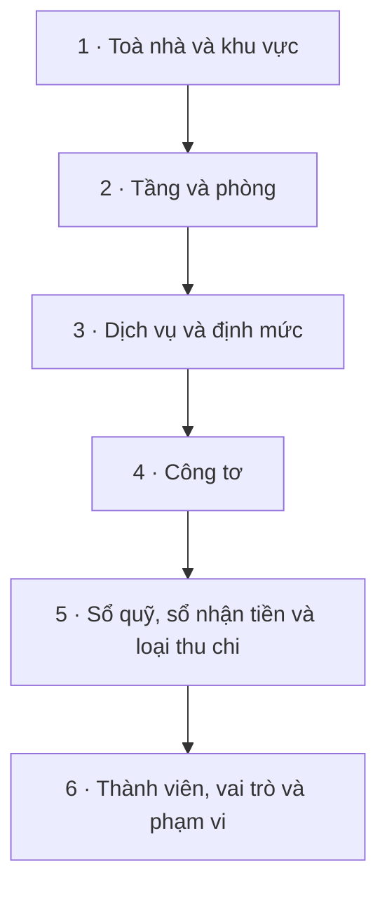

# Khởi tạo dữ liệu — thứ tự chuẩn

Một toà mới có thể tạo hợp đồng tối thiểu sau khi đã có **toà nhà → tầng/phòng → dịch vụ**. Để vận hành đầy đủ, cần bổ sung định mức, công tơ, sổ quỹ, sổ nhận tiền, loại thu chi, thành viên, vai trò và phạm vi. Các trang danh mục chuẩn bên dưới là nguồn cấu hình chính thức; không nên dựa vào nút "tạo nhanh" để hoàn tất hồ sơ toà.

::: info Điều kiện tiên quyết
- Đã [đăng nhập](/01-bat-dau/dang-nhap/) và có capability phù hợp cho từng bước; quyền xem trang (`*.view`) không tự cho phép tạo/sửa/xoá.
- Người thực hiện phải có phạm vi phù hợp. Tài khoản chỉ có quyền nhưng không có phạm vi sẽ không thấy dữ liệu để thao tác.
- Một số bước tài chính (sổ nhận tiền, loại thu chi) chỉ **chủ công ty** làm được.
- Khu vực là nhãn nhóm tuỳ chọn. Toà nhà, phòng và dịch vụ mới là ba lớp tối thiểu bắt buộc.
:::

## Critical path khởi tạo

```mermaid
flowchart TD
  B1[1 · Toà nhà và khu vực] --> B2[2 · Tầng và phòng]
  B2 --> B3[3 · Dịch vụ và định mức]
  B3 --> B4[4 · Công tơ]
  B4 --> B5[5 · Sổ quỹ, sổ nhận tiền và loại thu chi]
  B5 --> B6[6 · Thành viên, vai trò và phạm vi]
```

| Bước | Trang chuẩn (menu) | Quyền tạo dữ liệu | Kết quả |
|---|---|---|---|
| 1 | `/buildings` (Danh mục dữ liệu → Toà nhà) | `buildings.create`; `areas.create` nếu dùng khu vực | Toà có tên và địa chỉ đầy đủ; khu vực là nhãn N:N tuỳ chọn. |
| 2 | `/apartments` (Danh mục dữ liệu → Căn hộ) | `rooms.create` | Phòng có toà, tầng, tiền thuê/cọc và tên duy nhất trong toà. |
| 3 | `/services` (Danh mục dữ liệu → Dịch vụ); `/settings/categories/service-quotas` (Danh mục khác → Định mức dịch vụ) | `services.create`; `service_quotas.create` | Dịch vụ có loại phí, loại đơn giá và ít nhất một toà; định mức được chọn khi cần. |
| 4 | `/settings/meters` (Danh mục khác → Đồng hồ công tơ) | `meters.create` | Công tơ Điện/Nước/Gas gắn đúng phòng và nối được dịch vụ tương ứng. |
| 5 | `/finance/cashbooks` (Tài chính → Sổ quỹ, tab **Sổ nhận tiền**); `/settings/income-expense-types` (Danh mục khác → Loại thu chi) | `cashbooks.create`; sổ nhận tiền và thêm/sửa loại thu chi: chủ công ty | Có nơi ghi tiền, người giữ sổ, sổ nhận tiền theo người/toà và danh mục phân loại thu/chi. |
| 6 | `/settings/roles` (Mẫu vai trò); `/settings/members` (Thành viên) | `users.create`; `users.edit` | Thành viên nhận lời mời, có vai trò và ít nhất một phạm vi hiệu lực. |

### Ba bước tối thiểu

1. Tạo toà tại `/buildings`. Form chuẩn yêu cầu tên toà, Tỉnh/Thành phố, Quận/Huyện, Xã/Phường và địa chỉ chi tiết.
2. Tạo tầng/phòng tại `/apartments`. Chỉ các toà đang hoạt động và nằm trong phạm vi của bạn mới xuất hiện trong ô chọn toà.
3. Tạo dịch vụ tại `/services`, chọn loại phí, loại đơn giá, đơn giá, đơn vị tính và ít nhất một toà sử dụng.

Sau ba bước này có thể bắt đầu dựng hợp đồng cơ bản. Công tơ là bắt buộc nếu muốn ghi điện/nước theo tiêu thụ; sổ quỹ, sổ nhận tiền và loại thu chi là bắt buộc trước khi thu tiền và ghi nhận dòng tiền đúng chuẩn.

### Các bước để sẵn sàng vận hành

- Tạo định mức tại `/settings/categories/service-quotas` nếu dịch vụ dùng bảng giá bậc thang ([Định mức dịch vụ](/05-cai-dat/dinh-muc-dich-vu/)).
- Tạo công tơ tại `/settings/meters`. Công tơ Điện/Nước tự nối vào dịch vụ có **Loại phí** *Tiền điện*/*Tiền nước*; công tơ Gas nối vào dịch vụ mã `GAS` hoặc tên **Gas**.
- Tạo sổ quỹ tại `/finance/cashbooks`, điền số dư/ngày đầu kỳ và toà mặc định cho phiếu nhanh nếu cần; sau đó giao **Người giữ sổ / Người được xem sổ**.
- Chủ công ty cài tab **Sổ nhận tiền**: sổ tiền mặt riêng cho từng người thu, sổ Chuyển khoản / Thanh toán cho từng toà. Chưa cài thì người đó/toà đó chưa thu được bằng hình thức tương ứng.
- Chủ công ty rà **Loại thu chi** tại `/settings/income-expense-types` (danh mục chi chuẩn): chọn Thu/Chi, nhóm, cụm từ hay nói, hạng mục đặc biệt khi phù hợp.
- Tạo vai trò dùng lại tại `/settings/roles`, rồi mời người ở `/settings/members`. Vai trò không chứa phạm vi; phạm vi được chọn lúc gán vai trò cho từng người.

::: warning Không dùng "tạo toà nhanh" làm hồ sơ chính
Dòng **+ Thêm toà nhà** trong form căn hộ mở hộp **Thêm toà nhà nhanh** chỉ hỏi tên và mã, trong khi form chuẩn yêu cầu đủ địa chỉ. Nếu thao tác nhanh bị chặn hoặc tạo ra hồ sơ thiếu thông tin, hãy đóng form và tạo tại `/buildings` trước.
:::

## Trạng thái và ngoại lệ cần biết

| Tình huống | Cách xử lý |
|---|---|
| Không thấy toà/phòng/sổ quỹ dù đã có dữ liệu | Kiểm tra cả capability và phạm vi. Menu hiện không có nghĩa là dữ liệu mọi toà đều được mở. |
| Không tạo được phòng | Toà phải đang hoạt động; tên phòng phải duy nhất trong cùng toà. |
| Không tạo được công tơ, báo chưa có dịch vụ | Dịch vụ điện/nước chưa chọn đúng loại phí *Tiền điện*/*Tiền nước* (gas: mã `GAS` hoặc tên **Gas**). |
| Nhân viên chưa thu được tiền mặt / chuyển khoản | Chủ công ty chưa cài **Sổ nhận tiền** cho người đó hoặc cho toà đó. |
| Phiếu đã duyệt nhưng sổ quỹ không đổi | Chỉ phiếu **Đã Thu / Đã Chi** (đã ghi sổ) mới thay đổi tồn quỹ. |
| Vai trò đã gán nhưng người dùng vẫn không có quyền | Mỗi vai trò phải có ít nhất một phạm vi; **Cấm** trong vai trò/ngoại lệ luôn thắng **Cho**. |
| Cần quyền cho mọi toà hiện tại và tương lai | Chọn phạm vi **Toàn tổ chức**. Phạm vi này không kết hợp đồng thời với khu/toà/sổ quỹ lẻ. |
| Xoá toà bị chặn | Toà còn căn hộ chưa xoá; xử lý phòng trước. |

## Thử trực tiếp trên sandbox

<SandboxTry account="demo.chunha" app-path="/buildings" app-label="Mở Toà nhà (sandbox)" view-only>

Sandbox production hiện có **4 toà DEMO** với tổng **44 phòng**, 3 dịch vụ (DEMO Điện/Nước/Rác), 5 sổ quỹ (2 sổ ảo) và chưa có công tơ, chưa có định mức (snapshot 07/10/2026). Dùng chế độ chỉ xem để lần lượt đối chiếu `/buildings`, `/apartments`, `/services`, `/settings/meters`, `/finance/cashbooks` và `/settings/members`.

</SandboxTry>

## Quy trình liên quan

- [Tạo khu vực & toà nhà](/01-bat-dau/tao-toa-nha/)
- [Tạo tầng & phòng](/01-bat-dau/tao-tang-phong/)
- [Dịch vụ & định mức](/01-bat-dau/dich-vu-dinh-muc/)
- [Công tơ điện nước](/01-bat-dau/cong-to/)
- [Sổ quỹ & loại thu chi](/01-bat-dau/so-quy-loai-thu-chi/)
- [Thêm nhân viên & phân quyền](/01-bat-dau/them-nhan-vien/)
- [Sổ quỹ (vận hành)](/03-quan-ly-van-hanh/so-quy/) · [Phân quyền](/05-cai-dat/phan-quyen/)
