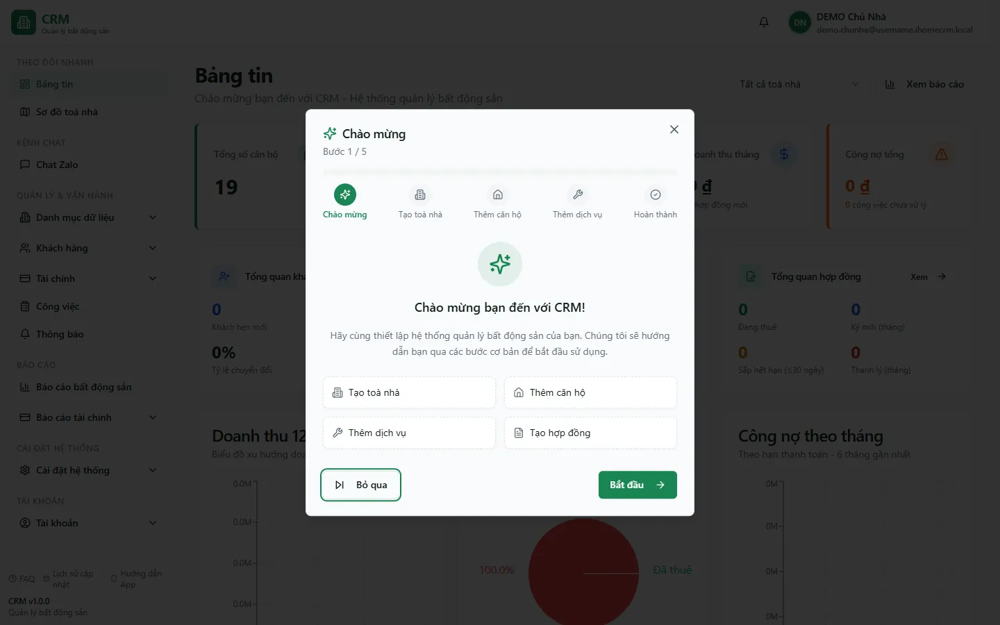
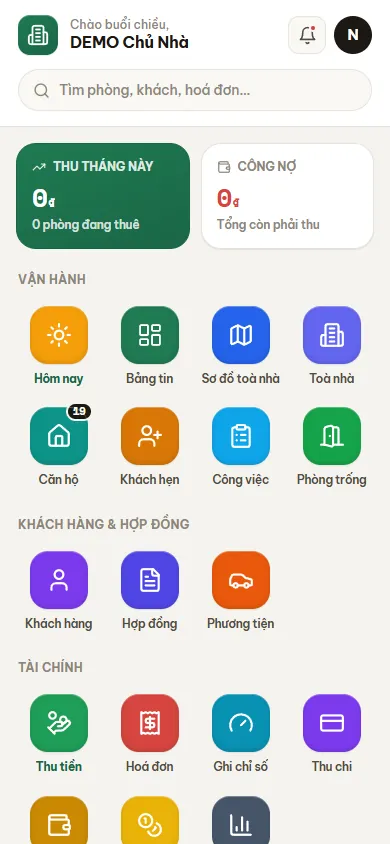

# Làm quen giao diện

Trang này giúp bạn nhận diện các thành phần chính trên màn hình ptcrm trước khi đi vào từng nghiệp vụ: thanh điều hướng bên trái, ô lọc toà nhà, chuông thông báo và điểm khác biệt khi mở trên điện thoại. Đọc một lần ở đây, bạn sẽ tự tìm được đường đến mọi tính năng ở các trang sau. Dùng khi bạn mới đăng nhập lần đầu hoặc vừa được cấp một quyền mới và muốn biết nó hiện ở đâu.

::: info Điều kiện tiên quyết
- Đã có **tài khoản** đăng nhập được vào <https://ptcrm.vercel.app> (xem trang Đăng nhập).
- Tài khoản đã được **gán quyền** ít nhất một khu chức năng — nếu chưa có quyền nào, sidebar sẽ gần như trống.
- Với nhân viên: đã được **gán phạm vi toà nhà** (một toà, một khu, hoặc toàn bộ) thì ô lọc toà mới có dữ liệu để chọn.
:::

## Hướng dẫn từng bước

**Bước 1**: Sau khi đăng nhập, bạn dừng lại ở trang **Bảng tin**. Nhìn sang mép trái màn hình, bạn thấy **thanh điều hướng** (sidebar) chạy dọc — đây là bản đồ đi tới mọi tính năng, chia thành các nhóm xếp từ trên xuống.

**Bước 2**: Tại **thanh điều hướng**, đọc lần lượt bốn nhóm chính:

- **THEO DÕI NHANH** — Bảng tin, Sơ đồ toà nhà, Thông báo, Việc của tôi. Nơi nhìn tổng quan mỗi sáng.
- **QUẢN LÝ & VẬN HÀNH** — toà nhà, phòng, khách hàng, hợp đồng, ghi chỉ số, hoá đơn, thu tiền, thu chi, công việc… Các nghiệp vụ hằng ngày.
- **BÁO CÁO** — báo cáo bất động sản và báo cáo tài chính.
- **CÀI ĐẶT** — danh mục, mẫu biểu, nhân viên và phân quyền.

::: tip Menu hiện đúng theo quyền của bạn
Thanh điều hướng **chỉ hiện những mục bạn có quyền xem** — mục nào chưa được cấp quyền sẽ **bị ẩn hoàn toàn**, không phải bị khoá mờ. Vì vậy hai người khác vai trò (ví dụ quản lý toà và kế toán) sẽ thấy sidebar dài ngắn khác nhau. Nếu bạn không thấy một mục mà đồng nghiệp có, đó là do quyền chứ không phải lỗi.
:::

**Bước 3**: Ở đầu các trang danh sách (Phòng, Hợp đồng, Hoá đơn, Thu chi…), tìm **ô lọc toà nhà** — mặc định hiển thị **Tất cả toà nhà**. Ấn chọn rồi gõ để tìm, chọn ví dụ **Tòa DEMO A**. Danh sách bên dưới lập tức chỉ còn dữ liệu của toà đó. Đây là bộ lọc **đơn-chọn**: một lúc chỉ lọc một toà, hoặc để **Tất cả toà nhà** để xem hết.

**Bước 4**: Sau khi đã chọn một toà, nhấn **F5** (tải lại trang). Bạn sẽ thấy ô lọc **vẫn giữ đúng toà bạn vừa chọn** — hệ thống ghi nhớ bộ lọc và ô tìm kiếm của từng trang, nên bạn không phải chọn lại mỗi lần vào. Muốn bỏ lọc, chọn lại **Tất cả toà nhà**.

**Bước 5**: Nhìn lên **góc trên bên phải** màn hình, ấn biểu tượng **chuông** để mở **Thông báo** (nhắc thu tiền, hoá đơn quá hạn, hợp đồng sắp hết hạn, thiếu cọc…). Chấm đỏ trên chuông là số thông báo **chưa đọc**; mở ra và đọc thì chúng chuyển sang đã đọc.

**Bước 6**: Mở app trên **điện thoại**: thay vì thanh điều hướng bên trái, bạn gặp **màn hình chính** dạng lưới biểu tượng (HomeLauncher) — ấn một ô để vào thẳng tính năng. Một số trang được thiết kế tối ưu cho điện thoại như **Thu tiền** (thu tiền mặt tại phòng) và **Việc của tôi / Ngày của tôi** (`/my-day`).

## Các tính năng khác trên màn hình

| Nút / Bộ lọc | Công dụng |
|---|---|
| **Ô lọc toà nhà** | Lọc dữ liệu theo một toà (hoặc **Tất cả toà nhà**); gõ để tìm nhanh; được nhớ qua F5 |
| **Chuông thông báo** (góc trên phải) | Mở danh sách thông báo; chấm đỏ = số chưa đọc |
| Nhóm **THEO DÕI NHANH** | Bảng tin, Sơ đồ toà nhà, Thông báo, Việc của tôi |
| Nhóm **QUẢN LÝ & VẬN HÀNH** | Toà nhà, phòng, khách, hợp đồng, chỉ số, hoá đơn, thu tiền, thu chi, công việc |
| Nhóm **BÁO CÁO** | Báo cáo bất động sản và báo cáo tài chính |
| Nhóm **CÀI ĐẶT** | Danh mục, mẫu biểu, nhân viên, phân quyền |
| **Màn hình chính** (điện thoại) | Lưới biểu tượng thay cho sidebar; vào thẳng tính năng |

## Tình huống & lỗi thường gặp

| Tình huống | Cách xử lý |
|---|---|
| Không thấy một mục menu mà đồng nghiệp có | Bạn chưa được cấp quyền cho mục đó; nhờ chủ nhà / quản trị mở quyền (xem trang Thêm nhân viên & phân quyền) |
| Sidebar gần như trống sau khi đăng nhập | Tài khoản chưa được gán quyền nào; liên hệ người quản trị hệ thống |
| Ô lọc toà vẫn giữ toà cũ sau khi F5 | Đúng thiết kế — bộ lọc được nhớ; chọn lại **Tất cả toà nhà** nếu muốn xem hết |
| Ô lọc toà không có toà nào để chọn | Nhân viên chưa được gán phạm vi toà; nhờ quản trị gán phạm vi |
| Trên điện thoại không thấy thanh điều hướng bên trái | Bình thường — điện thoại dùng **màn hình chính** dạng lưới; ấn biểu tượng để vào tính năng |
| Chuông không báo thông báo đẩy về điện thoại | Cần cho phép **thông báo** trên trình duyệt khi được hỏi; thông báo trong app vẫn hiện ở chuông dù chưa bật đẩy |

## Thử trực tiếp trên sandbox

<SandboxTry account="demo.quanly" app-path="/" view-only>

Mở app bằng tài khoản **demo.quanly** (quản lý toà) và quan sát:

- Hãy nhìn thấy **thanh điều hướng** bên trái chỉ hiện các mục theo quyền của quản lý toà — có toà nhà, phòng, hợp đồng, ghi chỉ số, công việc; **không** thấy các mục dành riêng chủ nhà như phân bổ lợi nhuận hay phân quyền hệ thống.
- Đăng xuất, đăng nhập lại bằng **demo.ketoan** (kế toán): so sánh sidebar — bạn sẽ thấy **menu khác đi**, nổi bật là Hoá đơn, Thu tiền, Thu chi, Sổ quỹ, còn các mục vận hành toà thu hẹp lại.
- Kết luận: cùng một hệ thống nhưng **mỗi vai trò thấy một sidebar riêng** đúng theo quyền.

</SandboxTry>

## Quy trình liên quan

- [Đăng nhập](/01-bat-dau/dang-nhap/) — vào hệ thống trước khi khám phá giao diện
- [Sandbox — Môi trường thực hành](/01-bat-dau/sandbox/) — danh sách tài khoản demo và cách reset dữ liệu
- [Bảng tin](/02-theo-doi-nhanh/bang-tin/) — trang đầu tiên bạn gặp sau khi đăng nhập
- [Thêm nhân viên & phân quyền](/01-bat-dau/them-nhan-vien/) — cấp quyền để mở các mục menu bị ẩn
