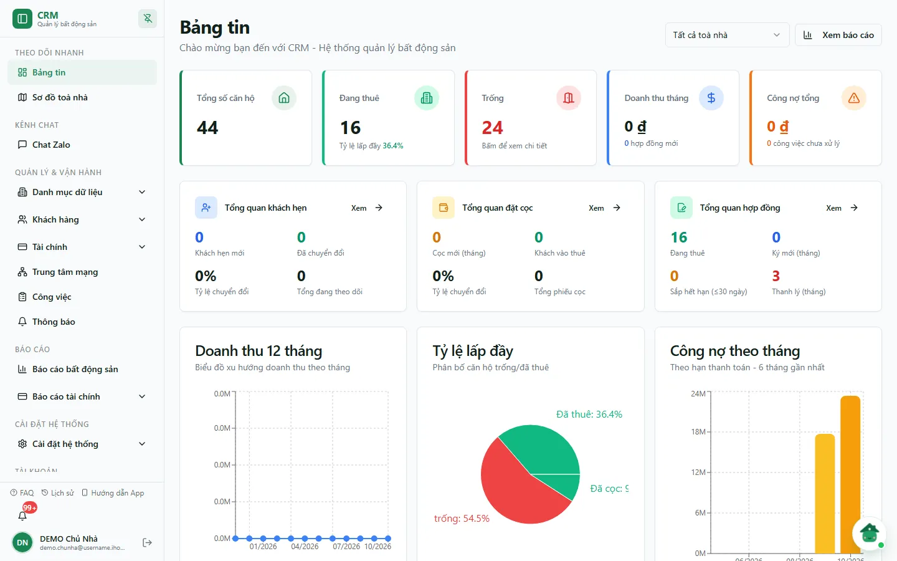
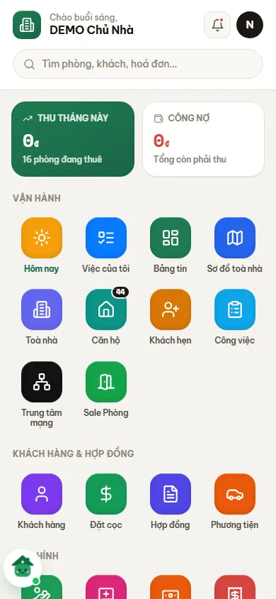
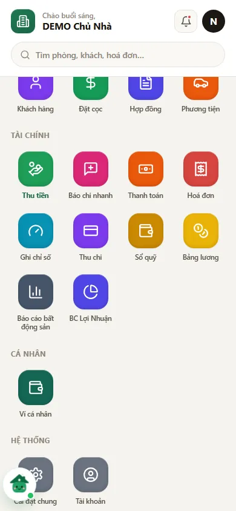

# Làm quen giao diện

Sau đăng nhập, máy tính mở **Bảng tin** tại `/`; điện thoại mở **màn hình chính dạng lưới biểu tượng** tại `/`, còn Bảng tin trên điện thoại nằm ở `/dashboard`. Giao diện chỉ hiện menu/ô chức năng khớp capability, trong khi dữ liệu bên trong tiếp tục được lọc độc lập theo phạm vi và RLS.

::: info Điều kiện tiên quyết
- Có tài khoản đăng nhập tại <https://ptcrm.vercel.app>.
- Được cấp capability để menu/ô chức năng xuất hiện.
- Được gán phạm vi để trang có dữ liệu toà, khu hoặc sổ quỹ tương ứng.
- Đã có **công ty làm việc** (tự chọn khi tài khoản chỉ thuộc một công ty; xem [Đăng nhập](/01-bat-dau/dang-nhap/)).
:::

## Giao diện máy tính

**Bước 1**: Sau khi đăng nhập, nhìn thanh bên (sidebar) ở mép trái.

Trên màn hình rộng, thanh bên mở sẵn. Màn hình hẹp hơn thì thanh bên thu về một dải biểu tượng; rê chuột vào để mở tạm. Nút ghim ở góc trên thanh bên (**Ghim sidebar mở** / **Thu gọn sidebar**, phím tắt **Ctrl/⌘ + B**) giữ lựa chọn cho tài khoản của bạn.

**Bước 2**: Các nhóm hiện hành (chỉ hiện mục bạn có quyền):

- **THEO DÕI NHANH** — Bảng tin, Sơ đồ toà nhà.
- **KÊNH CHAT** — Chat Zalo.
- **QUẢN LÝ & VẬN HÀNH**
  - **Danh mục dữ liệu**: Toà nhà, Căn hộ, Dịch vụ, Sale Phòng, Tài sản, Kho vật tư.
  - **Khách hàng**: Khách hẹn, Đặt cọc, Hợp đồng, Khách hàng, Phương tiện.
  - **Tài chính**: Ghi chỉ số, Hoá đơn, Thu tiền, Thanh toán, Thu chi, Báo chi nhanh, Chờ duyệt, Sổ quỹ, Phí cố định, Cam kết chi, Bảng lương, Ví cá nhân.
  - Các mục đơn: **Trung tâm mạng**, **Công việc**, **Thông báo**.
- **BÁO CÁO** — Báo cáo bất động sản; **Báo cáo tài chính**: Trung tâm tài chính, Phân tích tài chính, Tài khoản theo ngày, Dòng tiền, Báo cáo Lợi Nhuận, Lịch thanh toán, Tiền thừa, Danh sách tiền cọc.
- **CÀI ĐẶT HỆ THỐNG** — **Cài đặt hệ thống**: Cài đặt chung, Danh mục khác, Mẫu biểu, Tổ chức, Thành viên, Mẫu vai trò, Trợ lý AI, Quay số may mắn.
- **TÀI KHOẢN** — Thông tin cá nhân, Gói cước.

**Bước 3**: Bấm tên một mục có mũi tên (vd **Tài chính**) để mở danh sách con. Mục chứa trang đang mở tự bung sẵn.

Menu được lọc theo capability chính xác, ví dụ `buildings.view`, `rooms.view`, `cashbooks.view`. Tên vai trò không phải gate trực tiếp và việc thấy menu không đồng nghĩa được tạo/sửa/xoá. Một số trường hợp đặc biệt:

- **Chờ duyệt** luôn hiện; người không phải bước duyệt nào chỉ thấy danh sách rỗng.
- **Thanh toán**, **Phí cố định**, **Cam kết chi** cần quyền thu tiền (`thu_tien.collect`); riêng **Cam kết chi** chỉ chủ công ty đọc/sửa được.
- **Bảng lương**: người không có quyền quản lý lương bấm vào sẽ mở **Lương của tôi** ở tab mới.
- **Trung tâm tài chính** chỉ hiện khi tài khoản có công ty được xem báo cáo kết quả kinh doanh.

**Bước 4**: Chân thanh bên có liên kết **FAQ**, **Lịch sử** (ghi chú phiên bản), **Hướng dẫn App**; chuông thông báo (kèm số chưa đọc); tên tài khoản (mở **Thông tin cá nhân**) và nút **Đăng xuất**. Trang thông báo đầy đủ là `/notifications`, cần `notifications.view`.

**Bước 5**: Trên các trang danh sách, dùng bộ lọc toà/khu/trạng thái theo đúng UI của trang. Không có một quy tắc “mọi trang chỉ chọn một toà”: trang Căn hộ và nhiều danh sách hỗ trợ nhiều toà/khu; một số trang như Sơ đồ chỉ chọn một toà. Bộ lọc được nhớ trong tab đang dùng và bị xoá khi đăng xuất hoặc đổi tài khoản.

Nút **Trợ lý AI** (biểu tượng tròn ở góc dưới màn hình) mở khung chat Copilot; Copilot dùng công ty đang chọn ở trang Tài khoản.

## Giao diện điện thoại

Trang `/` trên điện thoại là màn hình chính: lời chào và tên bạn, nút chuông và ảnh đại diện (mở Tài khoản), ô tìm kiếm **Tìm phòng, khách, hoá đơn…**, hai thẻ **THU THÁNG NÀY** và **CÔNG NỢ**, rồi lưới ô chức năng chia nhóm.

- **Vận hành** — Hôm nay, Việc của tôi, Bảng tin, Sơ đồ toà nhà, Toà nhà, Căn hộ (kèm số phòng), Khách hẹn, Công việc, Trung tâm mạng, Sale Phòng.
- **Khách hàng & Hợp đồng** — Khách hàng, Đặt cọc, Hợp đồng, Phương tiện. Ô **Đặt cọc** là lối vào duy nhất của màn Sổ cọc trên điện thoại.
- **Tài chính** — Thu tiền, **Báo chi nhanh**, Thanh toán, Hoá đơn, Ghi chỉ số, Thu chi, Sổ quỹ, Bảng lương, Báo cáo bất động sản, BC Lợi Nhuận.
- **Cá nhân** — Ví cá nhân.
- **Hệ thống** — Cài đặt chung, Tài khoản.

Mỗi ô được lọc bằng đúng `module.action`; vì vậy hai người cùng tên vai trò nhưng khác ngoại lệ quyền có thể thấy lưới khác nhau. Ví dụ ô **Báo chi nhanh** (`/chi-tieu` — gõ, nói hoặc chụp hoá đơn để tạo thẻ nháp phiếu chi) chỉ hiện khi có quyền tạo phiếu thu chi; ô **Thanh toán** cần quyền thu tiền.

- **Hôm nay** (`/my-day`) gom việc cần làm trong ngày — xem [Việc của tôi](/02-theo-doi-nhanh/viec-cua-toi/).
- **Việc của tôi** (`/viec-cua-toi`) là danh sách việc cá nhân, lưu trên chính thiết bị.
- Các trang khác trên điện thoại có thanh đầu trang với nút menu mở thanh bên dạng ngăn kéo, cùng nhóm mục như máy tính.

## Quyền menu và quyền dữ liệu

| Lớp | Quyết định |
|---|---|
| Capability | Trang/nút có được mở hay không. |
| Phạm vi | Toà, khu, tổ chức hoặc sổ quỹ nào nằm trong quyền hiệu lực. |
| Công ty đang chọn | Công ty mà Copilot và các công cụ theo công ty làm việc trên đó. |
| RLS/hook dữ liệu | Các dòng thực tế được trả về cho user hiện tại. |
| Possession nghiệp vụ | Ví dụ ai đang giữ sổ mới được ghi/chốt tiền dù đã có capability. |

## Tình huống & lỗi thường gặp

| Tình huống | Cách xử lý |
|---|---|
| Không thấy mục menu | Kiểm tra capability `.view` của đúng module trong **Quyền hiệu lực**. |
| Thấy trang nhưng danh sách trống | Kiểm tra phạm vi toà/khu/sổ quỹ, công ty đang chọn và dữ liệu thật trong phạm vi đó. |
| Không thấy nút Thêm/Sửa/Xoá | Quyền xem trang không tự bao gồm `.create/.edit/.delete`. |
| Không thấy Thông báo trong Theo dõi nhanh | Đúng bố cục hiện tại: mục này nằm dưới Quản lý & Vận hành. |
| Không thấy Trung tâm mạng | Mục chỉ hiện khi tính năng đang bật và tài khoản có quyền `network_center.view`. |
| Trên mobile không thấy sidebar | Màn hình chính dùng lưới biểu tượng; ở các trang khác bấm nút menu trên thanh đầu trang. |
| Bộ lọc khác trang đồng nghiệp | Mỗi trang có bộ lọc riêng; một số cho nhiều toà, một số chỉ một toà. |
| Ô lọc toà ghi **Tất cả toà nhà** sau khi đổi tài khoản | Đúng thiết kế: toà bạn không còn được xem bị bỏ khỏi bộ lọc. |

## Thử trực tiếp trên sandbox

<SandboxTry account="demo.quanly" app-path="/" view-only>

So sánh desktop và mobile, rồi so `demo.quanly` với `demo.ketoan`. Bạn sẽ thấy menu/ô chức năng khác theo capability; dữ liệu của `demo.quanly` chỉ thuộc DEMO Toà A+B, trong khi tài khoản kế toán có phạm vi tổ chức nhưng vẫn chỉ mở các nghiệp vụ được cấp. Chỉ mở trang để xem, không lưu thay đổi.

</SandboxTry>

## Quy trình liên quan

- [Đăng nhập](/01-bat-dau/dang-nhap/)
- [Sandbox — Môi trường thực hành](/01-bat-dau/sandbox/)
- [Bảng tin](/02-theo-doi-nhanh/bang-tin/)
- [Báo chi nhanh](/03-quan-ly-van-hanh/bao-chi-nhanh/)
- [Thêm nhân viên & phân quyền](/01-bat-dau/them-nhan-vien/)
