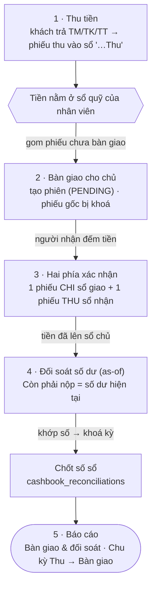

# Quy trình: Bàn giao & đối soát

Sau khi khách trả tiền, tiền mặt không "biến mất vào sổ" là xong — nó đi tiếp một chặng đường có kiểm soát: **Thu tiền => Bàn giao cho chủ (hai phía xác nhận) => Đối soát số dư => Chốt sổ => Báo cáo**. Trang này là bản đồ xuyên suốt chặng đường đó, giúp bạn — kế toán hay chủ nhà — hình dung **tiền đang nằm ở sổ nào, ai đang cầm, còn phải nộp bao nhiêu**. Đọc trang này trước để nắm dòng chảy, rồi mở từng trang chi tiết khi thao tác thật.

::: info Điều kiện tiên quyết
- Đã có **sổ quỹ** và **loại thu/chi** — mỗi nhân viên thu tiền cần một sổ "…Thu" của riêng mình. Nếu chưa, xem [Sổ quỹ & loại thu chi](/01-bat-dau/so-quy-loai-thu-chi/).
- Đã thu được tiền của khách vào sổ — xem chặng trước [Quy trình thu tiền](/01-bat-dau/quy-trinh-thu-tien/).
- Muốn **bàn giao**: người nhận phải **cùng đội** với bạn, hoặc là **chủ nhà**. Muốn **chốt số sổ**: chỉ **chủ sổ / chủ nhà** mới xác nhận được — đồng đội không tự chốt hộ.
- Nắm sơ giao diện và menu bên trái — xem [Làm quen giao diện](/01-bat-dau/lam-quen-giao-dien/).
:::

## Hướng dẫn từng bước

Năm chặng đi theo đúng thứ tự dưới đây. Mỗi lần tiền đổi tay đều để lại **chứng từ đối xứng** — một phiếu chi ở sổ người giao, một phiếu thu ở sổ người nhận — nên số liệu không bao giờ đếm trùng.

**Bước 1**: **Thu tiền vào sổ.** Mỗi lần khách trả tiền hoá đơn, hệ thống ghi **một phiếu thu** vào **sổ quỹ "…Thu"** của người thu. Mã hình thức giữ nguyên **TM / TK / TT** (tiền mặt / tài khoản / thanh toán) — không dịch, không đổi. Đây là điểm khởi đầu của dòng tiền; chi tiết ở [Quy trình thu tiền](/01-bat-dau/quy-trinh-thu-tien/), thao tác thật ở [Thu tiền hoá đơn](/03-quan-ly-van-hanh/thu-tien-hoa-don/) hoặc [Thu tiền (mobile)](/03-quan-ly-van-hanh/thu-tien-mobile/).

::: danger Thu tiền là thao tác ghi tiền thật vào sổ quỹ
Mỗi phiếu thu làm **tăng số dư sổ quỹ** và đổi trạng thái hoá đơn. Kiểm tra đúng **số tiền**, đúng **hình thức TM/TK/TT** và đúng **sổ nhận tiền** trước khi lưu — ghi sai kéo lệch cả số "còn phải nộp" khi bàn giao lẫn báo cáo dòng tiền.
:::

::: tip Ba quy ước tiền dễ nhầm ở bước thu
- **Cọc còn thiếu** được gộp thành **một dòng "Tiền cọc" trong hoá đơn tháng đầu**; khi thu, phần cọc tách thành **hạng mục riêng đánh dấu là cọc** và **không** tính vào kết quả kinh doanh (KQKD) — cọc không bị nhầm thành doanh thu.
- **Tiền thối** cho khách đã được **trừ sẵn (net)** trong tổng thu của phiếu — bạn không phải trừ lại lần nữa.
- Nếu khách trả **thiếu một chút** (dưới **10.000đ**), hệ thống tự **làm tròn** qua sổ "Làm tròn tiền thiếu" và đánh hoá đơn đã thu đủ.
:::

**Bước 2**: **Bàn giao tiền cho chủ (tạo phiên).** Cuối ngày/ca, mở khối **Bàn giao** trong màn thu tiền, chọn **Sổ bàn giao** (mặc định là sổ "…Thu" của bạn) rồi tick các **phiếu chưa bàn giao** cần nộp. Bấm tạo phiên — hệ thống lập một **phiên bàn giao ở trạng thái Chờ xác nhận (PENDING)** và **khoá** các phiếu gốc lại (không sửa/xoá/hoàn tác được nữa) để số tiền không đổi trong lúc chờ. Chi tiết màn hình ở [Bàn giao & đối soát](/03-quan-ly-van-hanh/ban-giao-doi-soat/).

::: tip Bàn giao theo số dư ròng và bàn giao chuyển khoản
- Nếu trong kỳ bạn **vừa thu vừa chi** (ví dụ đã chi sửa chữa), một phiên gộp được **cả phiếu thu lẫn phiếu chi**; số tiền thực cầm để nộp = **số dư ròng** (tổng thu − tổng chi), không bắt bạn nộp gộp rồi ghi âm sổ.
- Chọn một **sổ ngân hàng "TK…"** làm sổ bàn giao sẽ **bật chế độ bàn giao chuyển khoản** (nộp bằng chuyển khoản thay vì tiền mặt).
:::

::: warning Phiếu vào phiên bàn giao là bị khoá
Ngay khi tick vào phiên, các **phiếu thu/chi gốc bị khoá** — bạn không sửa số tiền, không xoá, không hoàn tác được cho tới khi phiên kết thúc. Nếu tick nhầm phiếu, hãy **huỷ phiên** (cần **cả hai phía** đồng ý huỷ) thay vì cố sửa phiếu.
:::

**Bước 3**: **Hai phía xác nhận.** Người nhận (chủ nhà hoặc quản lý cùng đội) mở phiên, **đếm tiền theo danh sách phiếu** rồi bấm **Xác nhận**. Lúc này hệ thống sinh **đúng một cặp chứng từ đối xứng**: **một phiếu CHI** trên sổ người giao (đưa sổ giao về 0) và **một phiếu THU tổng** trên sổ người nhận (cộng đúng số đã nộp). Cặp phiếu này nằm **ngoài KQKD** — chỉ là tiền chuyển nội bộ giữa hai sổ, doanh thu vẫn chỉ đếm một lần ở phiếu gốc.

::: danger Xác nhận bàn giao là thao tác dịch tiền giữa hai sổ
Bấm **Xác nhận** ghi ngay cặp phiếu CHI/THU và **chuyển số dư** từ sổ nhân viên sang sổ chủ. Chỉ xác nhận **sau khi đã đếm đủ tiền mặt** khớp với danh sách; xác nhận nhầm sẽ làm lệch số dư của **cả hai** sổ.
:::

**Bước 4**: **Đối soát số dư (as-of) & chốt sổ.** Định kỳ, chủ/quản lý mở **Báo cáo bàn giao & đối soát**. Với mỗi sổ, cột **CÒN PHẢI NỘP chính là số dư hiện tại** của sổ — nếu bằng 0 nghĩa là đã nộp sạch. Khi số khớp, bấm **Chốt số** để đóng mốc đối soát: hệ thống chụp lại **số dư theo đúng ngày `as-of`** đã chọn (tính các phiếu có ngày ≤ ngày chốt), làm mốc so sánh cho kỳ sau.

::: warning Chốt số phải do chủ sổ / chủ nhà xác nhận
Bạn có thể **chốt một mình** nếu là **chủ sổ hoặc chủ nhà**, hoặc chốt **hai phía** (một bên đề xuất, chủ sổ xác nhận). **Đồng đội không phải chủ sổ không được tự chốt hộ** — luôn phải chờ chủ sổ xác nhận. Số dư đối soát chụp theo **ngày `as-of`**, không phải số dư "hôm nay"; chọn sai ngày sẽ lấy nhầm số.
:::

**Bước 5**: **Báo cáo.** Toàn bộ chặng đường trên được soi qua hai báo cáo:
- **Bàn giao & đối soát** — theo **từng sổ**: thu thực / chi thực trong kỳ, đã bàn giao cho chủ, **còn phải nộp** (= số dư), kèm danh sách phiên bàn giao và lần chốt số gần nhất.
- **Chu kỳ Thu => Bàn giao** — theo **quản lý**: mỗi mốc bàn giao chốt lại số **chưa thu** của các toà phụ trách tại thời điểm đó, cho thấy quản lý thu tới đâu, nộp tới đâu.

Cả hai đều **chỉ đọc** — chúng phản chiếu dữ liệu bàn giao và số dư sổ, không tự dịch tiền. Chi tiết ở [Bàn giao & đối soát](/03-quan-ly-van-hanh/ban-giao-doi-soat/).

## Các tính năng khác trên màn hình

Mỗi chặng của dòng tiền là một màn hình riêng — bảng dưới tóm tắt vai trò và chứng từ mà nó sinh ra.

| Màn hình trong chuỗi | Vai trò & chứng từ sinh ra |
| --- | --- |
| **Thu tiền hoá đơn** ([mở](/03-quan-ly-van-hanh/thu-tien-hoa-don/)) | Ghi phiếu thu vào sổ "…Thu"; tách hạng mục cọc (không vào KQKD); làm tròn residual < 10.000đ. |
| **Thu tiền (mobile)** ([mở](/03-quan-ly-van-hanh/thu-tien-mobile/)) | Thu nhanh **chỉ tiền mặt (TM)** ngoài hiện trường; kèm GPS; từ chối hoá đơn gộp cọc để cọc không lọt vào KQKD. |
| **Bàn giao & đối soát** ([mở](/03-quan-ly-van-hanh/ban-giao-doi-soat/)) | Khối **Bàn giao** (3 tab: Bàn giao / Phiên chờ / Lịch sử) để tạo & xác nhận phiên; báo cáo **còn phải nộp** theo từng sổ; nút **Chốt số**. |
| **Sổ quỹ** ([mở](/03-quan-ly-van-hanh/so-quy/)) | Xem số dư và dòng tiền vào/ra của từng sổ — nguồn số "còn phải nộp". |
| **Thu chi** ([mở](/03-quan-ly-van-hanh/thu-chi/)) | Lập phiếu thu/chi lẻ (ví dụ chi sửa chữa, thu phí phạt) — các phiếu này cũng vào phiên bàn giao. |

## Tình huống & lỗi thường gặp

| Tình huống | Nguyên nhân & cách xử lý |
| --- | --- |
| Không chọn được người nhận khi bàn giao | Người nhận phải **cùng đội** với bạn, hoặc là **chủ nhà**. Nếu danh sách trống, nhờ chủ thêm bạn vào đội (Đội ngũ) hoặc bàn giao thẳng cho chủ. |
| Không sửa/xoá được một phiếu thu | Phiếu đó **đã vào một phiên bàn giao** nên bị khoá. Muốn sửa phải **huỷ phiên** (cần **cả hai phía** đồng ý) trước. |
| "Còn phải nộp" vẫn khác 0 sau khi đã nộp | Phiên bàn giao còn ở **Chờ xác nhận** — người nhận chưa **Xác nhận**. Tiền chỉ rời sổ khi phía nhận đếm và xác nhận xong. |
| Số dư đối soát không giống số dư hôm nay | Đối soát chụp số dư theo **ngày `as-of`** đã chọn (phiếu có ngày ≤ ngày đó), không phải số dư hiện thời. Chọn lại đúng ngày cần chốt. |
| Nhân viên bấm "Chốt số" nhưng không được | Đúng thiết kế: **chỉ chủ sổ / chủ nhà** chốt được. Đồng đội chỉ **đề xuất**, chờ chủ sổ xác nhận. |
| Doanh thu như bị đếm hai lần sau bàn giao | Không phải — cặp phiếu CHI/THU của bàn giao nằm **ngoài KQKD**, doanh thu chỉ đếm **một lần** ở phiếu thu gốc. Báo cáo dòng tiền/lợi nhuận đã loại phiếu chuyển bàn giao. |
| Sổ bị âm khi vừa thu vừa chi | Dùng **bàn giao theo số dư ròng**: một phiên gộp cả thu lẫn chi, chỉ nộp phần **chênh lệch ròng** thay vì nộp gross rồi ghi âm. |

## Thử trực tiếp trên sandbox

<SandboxTry account="demo.ketoan" app-path="/reports/finance/ban-giao" app-label="Mở Báo cáo Bàn giao & đối soát" fixtures="3 sổ quỹ demo; hoá đơn tháng 7 Tòa A đã thu (A101 4.070.000đ, A103 đủ) + A102 còn nợ 2.570.000đ; B101 chưa thu; A105 quá hạn 6.070.000đ; 1 phiếu chi sửa chữa 500.000đ; 1 phiếu thu phí phạt 200.000đ" view-only>

Đây là chế độ **chỉ xem** — nhiệm vụ của bạn là **đi mắt theo dòng tiền từ thu => nộp chủ => chốt sổ**, không thao tác ghi tiền. Tòa DEMO A là dữ liệu triển lãm (đã thu / quá hạn), cứ xem thoải mái.

1. **Xem từng sổ quỹ:** trên báo cáo, chọn khoảng thời gian **tháng 7/2026**. Mỗi **sổ quỹ** hiện các cột **Thu thực / Chi thực / Đã bàn giao cho chủ / Còn phải nộp**. Chú ý cột **Còn phải nộp = số dư hiện tại** của sổ.
2. **Đọc dòng tiền vào một sổ "…Thu":** sổ này gom tiền mặt thu hoá đơn Tòa A (A101 **4.070.000đ**, A103 thu đủ, phần đã thu của A102) cộng phiếu **thu phí phạt 200.000đ**, trừ phiếu **chi sửa chữa 500.000đ**. Hình dung: đây chính là **số dư ròng** kế toán đang cầm và sẽ phải nộp lên chủ.
3. **Mở một phiên bàn giao:** trong danh sách phiên bàn giao của kỳ, mở một phiên để thấy **thu − chi = thực nộp** và danh sách phiếu gốc đã **bị khoá**. Đây là lúc tiền chuyển từ sổ kế toán sang sổ chủ (một phiếu CHI + một phiếu THU đối xứng).
4. **Xem mốc chốt số:** để ý **lần chốt số gần nhất** và **ngày `as-of`** của nó — đó là mốc đối soát mà số dư được chụp lại. (Nút **Chốt số** chỉ chủ sổ/chủ nhà bấm được; ở chế độ xem bạn chỉ quan sát.)

Kết quả mong đợi: bạn dựng được bức tranh khép kín — **khách trả tiền => tiền vào sổ "…Thu" của kế toán => bàn giao nộp chủ (hai phía xác nhận) => "còn phải nộp" về 0 => chủ chốt số sổ** — và hiểu vì sao doanh thu không bị đếm trùng dù tiền đi qua nhiều sổ.

:::tip
Trên sandbox bạn cứ mở xem thoải mái — đây là dữ liệu demo, không ảnh hưởng số liệu thật. Tòa DEMO B (B101 chưa thu) để dành cho bài tập **thu tiền** ở trang tương ứng, đừng thu ở đây.
:::

</SandboxTry>

## Quy trình liên quan

- [Quy trình thu tiền](/01-bat-dau/quy-trinh-thu-tien/) — chặng trước: khách trả tiền, phiếu thu vào sổ "…Thu".
- [Thu tiền hoá đơn](/03-quan-ly-van-hanh/thu-tien-hoa-don/) — thao tác thu trên desktop, tách hạng mục cọc, làm tròn.
- [Thu tiền (mobile)](/03-quan-ly-van-hanh/thu-tien-mobile/) — thu nhanh tiền mặt ngoài hiện trường.
- [Bàn giao & đối soát](/03-quan-ly-van-hanh/ban-giao-doi-soat/) — màn hình chính: tạo/xác nhận phiên, báo cáo còn phải nộp, chốt số.
- [Sổ quỹ](/03-quan-ly-van-hanh/so-quy/) — xem số dư và dòng tiền vào/ra của từng sổ.
- [Thu chi](/03-quan-ly-van-hanh/thu-chi/) — lập phiếu thu/chi lẻ cùng vào phiên bàn giao.
- [Sổ quỹ & loại thu chi](/01-bat-dau/so-quy-loai-thu-chi/) — dựng sổ "…Thu" cho từng nhân viên trước khi chạy chuỗi này.
- [Quy trình: Vòng đời khách thuê](/01-bat-dau/quy-trinh-khach-thue/) — bức tranh lớn hơn: khách đi từ hẹn xem đến thanh lý.
