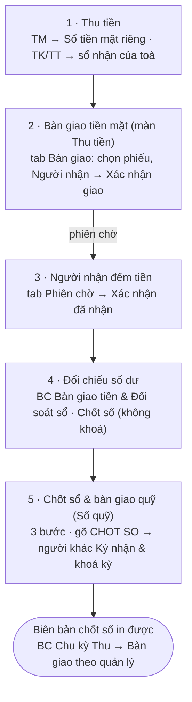

# Quy trình: Bàn giao & đối soát

Sau khi khách trả tiền, tiền mặt còn đi tiếp một chặng có kiểm soát: **Thu vào sổ => Bàn giao tiền mặt (hai phía xác nhận) => Đối chiếu số dư => Chốt sổ & bàn giao quỹ (hai bên ký, khoá kỳ) => Báo cáo**. Trang này là bản đồ xuyên suốt chặng đó, giúp kế toán và chủ nhà biết **tiền đang nằm ở sổ nào, ai đang giữ, còn phải nộp bao nhiêu**. Ba thao tác dễ nhầm tên nhau, cần phân biệt ngay từ đầu:

| Thao tác | Ở đâu | Tác dụng |
| --- | --- | --- |
| **Bàn giao tiền mặt** | Màn **Thu tiền** (`/thu-tien`) | Chuyển tiền giữa sổ người giao và sổ người nhận khi người nhận bấm **Xác nhận đã nhận**. |
| **Chốt số** | Báo cáo **Bàn giao tiền & Đối soát sổ** | Chỉ ghi lại một mốc so sánh số đếm với số hệ thống — **không khoá sổ**, không chuyển tiền. |
| **Chốt sổ & bàn giao quỹ** | **Tài chính => Sổ quỹ** | Hai người ký, **khoá vĩnh viễn** mọi phiếu có ngày ≤ ngày chốt; có biên bản in được. |

::: info Điều kiện tiên quyết
- Mỗi người thu tiền mặt có **Sổ tiền mặt riêng** (chủ công ty cài ở **Sổ quỹ → Sổ nhận tiền**). Nếu chưa, xem [Sổ quỹ](/03-quan-ly-van-hanh/so-quy/) và [Sổ quỹ & loại thu chi](/01-bat-dau/so-quy-loai-thu-chi/).
- Đã thu tiền vào sổ — xem [Quy trình: Chu kỳ thu tiền hàng tháng](/01-bat-dau/quy-trinh-thu-tien/).
- Quyền: `thu_tien.collect` để thấy nút **Bàn giao tiền mặt**; `reports_finance.handover_report` (và `reconcile` cho nút **Chốt số**) để mở báo cáo đối soát; quyền **Đề nghị chốt & bàn giao quỹ** và **Xác nhận nhận bàn giao** cho hai bên chốt sổ; `reports_finance.collection_cycle` cho báo cáo Chu kỳ Thu → Bàn giao.
:::

## Bản đồ dòng tiền

```mermaid
flowchart TD
  P["1 · Thu tiền<br/>TM → Sổ tiền mặt riêng · TK/TT → sổ nhận của toà"] --> H["2 · Bàn giao tiền mặt (màn Thu tiền)<br/>tab Bàn giao: chọn phiếu, Người nhận → Xác nhận giao"]
  H -->|"phiên chờ"| C["3 · Người nhận đếm tiền<br/>tab Phiên chờ → Xác nhận đã nhận"]
  C --> D["4 · Đối chiếu số dư<br/>BC Bàn giao tiền & Đối soát sổ · Chốt số (không khoá)"]
  D --> L["5 · Chốt sổ & bàn giao quỹ (Sổ quỹ)<br/>3 bước · gõ CHOT SO → người khác Ký nhận & khoá kỳ"]
  L --> R(["Biên bản chốt sổ in được<br/>BC Chu kỳ Thu → Bàn giao theo quản lý"])
```

## Hướng dẫn từng bước

**Bước 1**: **Thu tiền vào sổ.** Mỗi lần thu tạo phiếu thu "Thu tiền theo HĐ …". Tiền mặt (`TM`) luôn vào **Sổ tiền mặt riêng** của người thu; chuyển khoản (`TK`) và thanh toán (`TT`) vào sổ nhận của toà mà người thu chọn. Thao tác thu xem [Thu tiền tại hoá đơn](/03-quan-ly-van-hanh/thu-tien-hoa-don/) và [Thu tiền tại phòng (điện thoại)](/03-quan-ly-van-hanh/thu-tien-mobile/).

::: danger Đã duyệt chưa phải là tiền đã vào sổ
Phiếu thu từ lần thu đã ở trạng thái duyệt, nhưng tiền chỉ coi là vào sổ quỹ khi phiếu là **Đã Thu** (đã ghi sổ — `POSTED`). Cột **Tồn quỹ** ở Sổ quỹ chỉ cộng bút toán đã ghi sổ. Đối chiếu trạng thái này trước khi bàn giao hoặc chốt sổ.
:::

**Bước 2**: **Bàn giao tiền mặt.** Cuối ngày/ca, người thu mở **Tài chính => Thu tiền**, bấm nút **Bàn giao tiền mặt** (biểu tượng bàn tay cầm tiền, có số đếm) trên thanh đầu trang. Tấm **Bàn giao tiền mặt** ("Nộp số dư (thu − chi) · xác nhận 2 phía để không lộn tiền") có ba tab **Bàn giao / Phiên chờ / Lịch sử**. Ở tab **Bàn giao**:

- Ô **Sổ bàn giao** (khi bạn giữ nhiều sổ): mặc định là Sổ tiền mặt riêng; có thể chọn sổ "…Thu" hoặc sổ chuyển khoản của mình.
- Danh sách phiếu chưa bàn giao đã được tích sẵn; nhóm **Đã chi từ sổ — trừ vào tiền nộp** gom các phiếu chi. Dòng **Tiền thực nộp** = tổng thu − tổng chi đang chọn.
- Chọn **Người nhận**, ghi chú nếu cần, bấm **Xác nhận giao …**. Danh sách liệt kê mọi nhân viên, nhưng máy chủ chỉ chấp nhận người nhận **cùng đội** với bạn hoặc **chủ công ty**; chọn người khác đội sẽ bị từ chối với lời báo "Người nhận không cùng đội với bạn".

Tiền **vẫn nằm trong sổ của bạn** cho tới khi người nhận bấm **Xác nhận đã nhận**. Phần chi lớn hơn phần thu thì không bàn giao được (không giao số âm).

**Bước 3**: **Người nhận xác nhận.** Người nhận mở cùng tấm **Bàn giao tiền mặt** → tab **Phiên chờ**, đếm tiền theo danh sách phiếu, chọn **Sổ nhận tiền** rồi bấm **✓ Xác nhận đã nhận …**. Lúc này hệ thống chuyển số tiền từ sổ người giao sang sổ người nhận; các phiếu chuyển tiền của phiên là chuyển nội bộ, không tính vào kết quả kinh doanh. Phiên đã nhận hoặc đã huỷ xem ở tab **Lịch sử**.

::: warning Huỷ phiên cần hai phía
Chọn nhầm phiếu hoặc người nhận: bấm **Yêu cầu hủy**, nhập **Lý do hủy phiên (bắt buộc)** rồi **Gửi yêu cầu hủy** — bên kia phải xác nhận thì phiên mới huỷ. Phiếu nằm trong phiên bàn giao đã xác nhận không sửa/huỷ được cho tới khi phiên đó bị huỷ; đừng sửa phiếu để "chữa" số bàn giao.
:::

**Bước 4**: **Đối chiếu số dư (không khoá sổ).** Chủ/kế toán mở **Báo cáo tài chính** (`/reports/finance`) → thẻ **Bàn giao tiền & Đối soát sổ**. Chọn khoảng ngày; bảng theo sổ hiện **Đã thu (kỳ)**, **Đã chi (kỳ)**, **Đã bàn giao**, **Còn phải nộp** (= số dư hiện tại của sổ) và cột **Đối soát**; bên dưới là **Phiên bàn giao trong kỳ**. Khi đếm két hoặc khớp sao kê, bấm **Chốt số**, nhập **Số đếm/đối chiếu thực tế**, xem dòng **Lệch**, rồi **Chốt số** (một mình) hoặc **Gửi đối soát** (khi chọn người xác nhận cùng). Chi tiết: [Bàn giao tiền & đối soát](/03-quan-ly-van-hanh/ban-giao-doi-soat/).

::: warning "Chốt số" không phải chốt sổ
**Chốt số** chỉ lưu một mốc so sánh tại hôm nay; giao dịch sau đó vẫn phát sinh bình thường, không có gì bị khoá. Muốn khoá kỳ, làm Bước 5 ở Sổ quỹ.
:::

**Bước 5**: **Chốt sổ & bàn giao quỹ (khoá kỳ).** Người giữ sổ vào **Tài chính => Sổ quỹ**, bấm biểu tượng ổ khoá **Chốt sổ & bàn giao quỹ** ở dòng sổ. Hộp có 3 bước:

1. **Bước 1/3** kiểm tra sổ: mục đỏ **Phải dọn xong những việc này trước** chặn chốt; mục vàng **Lưu ý (không chặn)** chỉ nhắc.
2. **Bước 2/3** hiện **Số dư theo sổ**; nhập **Số tiền thực đếm trong két** (sổ ngân hàng: số dư sao kê), chọn **Người nhận bàn giao (sẽ ký xác nhận)**. Máy báo **Khớp sổ** hoặc số thừa/thiếu quỹ.
3. **Bước 3/3** gõ **CHOT SO** rồi bấm **Gửi đề nghị chốt sổ** — sổ **chưa** khoá.

Người nhận thấy khung **Đề nghị chốt sổ đang chờ** ở đầu màn Sổ quỹ, bấm **Xem & ký nhận**, gõ số tiền mình vừa đếm, tích xác nhận đã nhận đủ rồi bấm **Ký nhận & khoá kỳ** (hoặc **Từ chối & huỷ đề nghị**). Sau khi ký, khung **Biên bản chốt sổ đã ký** có nút **Xem biên bản** mở trang `/finance/cashbooks/closure/<số biên bản>` để **In biên bản**. Chi tiết: [Sổ quỹ](/03-quan-ly-van-hanh/so-quy/).

::: danger Ký là khoá VĨNH VIỄN, và cần hai người khác nhau
Sau khi người nhận ký, mọi phiếu có ngày ≤ ngày chốt **không sửa, huỷ hay xoá được nữa** — không ai mở lại được, kể cả chủ tổ chức. Sai sót phát hiện sau phải xử lý bằng phiếu điều chỉnh ở kỳ hiện tại (vẫn bổ sung được ảnh chứng từ và ghi chú). Người ký phải **khác** người đề nghị; nếu sổ đã đổi kể từ lúc đề nghị, hộp không cho ký — hai bên huỷ đề nghị và đếm lại.
:::

::: tip Chốt sổ ngay sau mỗi lần bàn giao
Lúc vừa trao tiền là lúc người giữ sổ còn nhớ rõ số lẻ trong két. Tab **Chốt LN tháng** của Báo cáo Lợi Nhuận cũng nhắc những sổ chưa chốt hết tháng — xem [Quy trình: Chốt tháng tài chính](/01-bat-dau/quy-trinh-chot-thang/).
:::

**Bước 6**: **Báo cáo theo dõi.** Hai báo cáo chỉ đọc:

- **Bàn giao tiền & Đối soát sổ** — theo **từng sổ**: thu/chi trong kỳ, đã bàn giao, còn phải nộp, lần đối soát gần nhất. Xem [Bàn giao tiền & đối soát](/03-quan-ly-van-hanh/ban-giao-doi-soat/).
- **Chu kỳ Thu → Bàn giao** — theo **quản lý** và các toà họ phụ trách: đã thu, đã bàn giao, tiền chưa thu tại mỗi mốc bàn giao. Mở từ thẻ ở Báo cáo tài chính hoặc nút hai mũi tên trên màn Thu tiền. Xem [Báo cáo: Chu kỳ Thu — Bàn giao](/04-bao-cao/thu-ban-giao/).

"Đã thu − Đã bàn giao" chỉ là chỉ báo chu kỳ, không phải tồn quỹ; số dư chính xác theo ngày xem ở [Sổ quỹ theo ngày](/04-bao-cao/so-quy-ngay/).

## Các màn trong chuỗi

| Màn hình | Vai trò & chứng từ sinh ra |
| --- | --- |
| [Thu tiền tại hoá đơn](/03-quan-ly-van-hanh/thu-tien-hoa-don/) · [Thu tiền tại phòng](/03-quan-ly-van-hanh/thu-tien-mobile/) | Ghi phiếu thu vào Sổ tiền mặt riêng / sổ nhận TK-TT; nút **Bàn giao tiền mặt** nằm trên màn Thu tiền. |
| [Bàn giao tiền & đối soát](/03-quan-ly-van-hanh/ban-giao-doi-soat/) | Báo cáo theo sổ, danh sách phiên đã xác nhận, nút **Chốt số** (không khoá). |
| [Sổ quỹ](/03-quan-ly-van-hanh/so-quy/) | **Chốt sổ & bàn giao quỹ** hai bên ký, biên bản in được; tab **Sổ nhận tiền** cài sổ cho người thu. |
| [Báo cáo: Chu kỳ Thu — Bàn giao](/04-bao-cao/thu-ban-giao/) | Chu kỳ thu và bàn giao theo quản lý. |
| [Thu chi](/03-quan-ly-van-hanh/thu-chi/) | Phiếu thu/chi lẻ; phiếu chi trong sổ cũng vào phiên bàn giao (trừ vào tiền nộp). |

## Tình huống & lỗi thường gặp

| Tình huống | Nguyên nhân & cách xử lý |
| --- | --- |
| Tab **Bàn giao** báo chưa có sổ tiền mặt riêng | Chủ công ty chưa cài sổ cho bạn ở **Sổ quỹ → Sổ nhận tiền**; hoặc chọn sổ khác ở ô **Sổ bàn giao** nếu có. |
| Tab **Bàn giao** báo không còn phiếu nào | Mọi phiếu thu/chi trong sổ đã nằm trong phiên bàn giao trước. |
| Không bàn giao được vì số âm | Phần chi đang lớn hơn phần thu. Bỏ bớt phiếu chi hoặc thêm phiếu thu. |
| **Còn phải nộp** vẫn khác 0 sau khi đã giao tiền | Phiên còn ở **Phiên chờ** — người nhận chưa bấm **Xác nhận đã nhận**. |
| Không thấy một phiên ở báo cáo đối soát | Báo cáo chỉ hiện phiên **đã xác nhận**, trong kỳ đang chọn, mà bạn là người giao hoặc nhận. |
| Đã **Chốt số** nhưng vẫn sửa được phiếu cũ | Đúng thiết kế: **Chốt số** không khoá. Khoá kỳ bằng **Chốt sổ & bàn giao quỹ** ở Sổ quỹ. |
| Bước 2/3 của chốt sổ báo chưa có ai đủ quyền xác nhận | Nhờ quản trị cấp quyền **Xác nhận nhận bàn giao** cho người nhận (vd gán vai trò Kế toán toàn tổ chức). |
| Thu chi báo "Ngày đã chọn nằm trong kỳ sổ quỹ đã khóa" | Kỳ đó đã chốt sổ; lập phiếu điều chỉnh ở kỳ hiện tại. |

## Thử trực tiếp trên sandbox

<SandboxTry account="demo.chunha" app-path="/finance/cashbooks" app-label="Mở Sổ quỹ" fixtures="Snapshot 07/10/2026: 5 sổ, DEMO Quỹ tiền mặt tồn 41.995.000 đ do DEMO Chủ Nhà giữ; chưa có biên bản chốt sổ; báo cáo Bàn giao tiền & Đối soát sổ không có sổ thu tiền trong phạm vi, chưa có phiên bàn giao." view-only>

Đây là chế độ **chỉ xem** — đi mắt theo dòng tiền, không ghi gì:

1. Ở **Sổ quỹ**, đọc cột **Tồn quỹ** và giải thích vì sao hai sổ toà hiện dấu **—** (bạn không giữ sổ đó).
2. Mở hộp **Chốt sổ & bàn giao quỹ** của **DEMO Quỹ tiền mặt** tới **Bước 2/3** rồi đóng — không gõ **CHOT SO**, không gửi.
3. Mở **Báo cáo tài chính** → **Bàn giao tiền & Đối soát sổ**, đổi khoảng ngày và quan sát bốn ô tổng, bảng theo sổ (đang trống) và danh sách phiên.
4. Mở **Thu tiền**, bấm **Bàn giao tiền mặt** để xem ba tab **Bàn giao / Phiên chờ / Lịch sử**, rồi **Đóng** — không bấm **Xác nhận giao**.

Kết quả mong đợi: bạn phân biệt được **Bàn giao tiền mặt**, **Chốt số** và **Chốt sổ & bàn giao quỹ**, và biết mỗi thao tác nằm ở màn nào.

:::tip
Snapshot DEMO thay đổi theo lần reset. Luôn đọc tên sổ, kỳ và số tiền ngay trên màn hình.
:::

</SandboxTry>

## Quy trình liên quan

- [Quy trình: Chu kỳ thu tiền hàng tháng](/01-bat-dau/quy-trinh-thu-tien/) — chặng trước: thu tiền vào sổ.
- [Thu tiền tại phòng (điện thoại)](/03-quan-ly-van-hanh/thu-tien-mobile/) — nơi có nút **Bàn giao tiền mặt**.
- [Bàn giao tiền & đối soát](/03-quan-ly-van-hanh/ban-giao-doi-soat/) — báo cáo theo sổ và **Chốt số**.
- [Sổ quỹ](/03-quan-ly-van-hanh/so-quy/) — chốt sổ & bàn giao quỹ, biên bản, sổ nhận tiền.
- [Báo cáo: Chu kỳ Thu — Bàn giao](/04-bao-cao/thu-ban-giao/) — chu kỳ thu/bàn giao theo quản lý.
- [Sổ quỹ & loại thu chi](/01-bat-dau/so-quy-loai-thu-chi/) — dựng sổ trước khi chạy chuỗi này.
- [Quy trình: Chốt tháng tài chính](/01-bat-dau/quy-trinh-chot-thang/) — chặng sau: khép sổ cuối tháng.
