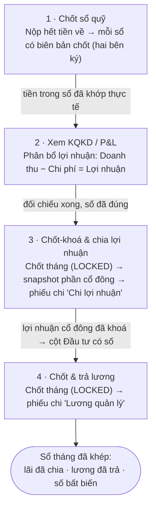

# Quy trình: Chốt tháng tài chính

Cuối mỗi tháng, bạn — chủ nhà hoặc kế toán — cần khép sổ theo một trình tự cố định. `Profit Close V2` có snapshot, source hash, revision và cơ chế mở/chốt lại; nhưng các báo cáo đầu vào vẫn có reader sai cohort/semantics. Vì vậy con số chỉ được coi là **đã chốt theo nguồn snapshot**, không mặc định mọi con số đang hiển thị đều đúng. Trình tự vận hành vẫn là **đối soát sổ => xem KQKD phát sinh => chốt lợi nhuận => chốt và trả lương**.

::: info Điều kiện tiên quyết
- Quyền chi tiết nằm ở catalog: `shareholder_profit.lock/unlock/distribute`, `salary.lock/unlock/distribute`, `cashbooks.close_propose/close_confirm` và các quyền xem tương ứng. Không suy quyền chỉ từ tên vai trò.
- Trong tháng đã **thu tiền, ghi thu/chi và bàn giao** đầy đủ — nếu còn tiền chưa vào sổ, số KQKD sẽ thiếu. Xem [Quy trình thu tiền](/01-bat-dau/quy-trinh-thu-tien/) và [Quy trình: Bàn giao & đối soát](/01-bat-dau/quy-trinh-ban-giao/).
- Đã khai **cổ đông & tỷ lệ %** cho từng toà (nếu chia lợi nhuận) và **danh sách quản lý hưởng lương** (nếu chốt lương) — hai phần này cấu hình ngay trong màn tương ứng ở Bước 3 và Bước 4.
- Nắm sơ giao diện và menu bên trái — xem [Làm quen giao diện](/01-bat-dau/lam-quen-giao-dien/).
:::

::: warning Phân biệt hai nghĩa "lợi nhuận"
Tab **Phân bổ lợi nhuận/KQKD phát sinh** có thể gồm phiếu đang chờ duyệt; **lợi nhuận đã chốt/đủ điều kiện chia** là snapshot của thao tác Close. Trước khi chốt, kiểm pending, settlement bị huỷ, phiếu cọc/phi KQKD và mọi ngoại lệ thanh lý. Không lấy thẻ KQKD phát sinh làm số tiền được phép chi ngay.
:::

## Hướng dẫn từng bước

Bốn chặng đi theo đúng thứ tự dưới đây. Mũi tên cho thấy vì sao chặng sau phải chờ chặng trước.

**Bước 1**: **Chốt sổ quỹ.** Trước khi tính lãi, hãy chắc rằng **tiền trong sổ khớp thực tế**. Nhân viên nộp hết tiền lên chủ qua **Bàn giao tiền mặt** (hai phía xác nhận). Ngay sau khi người nhận xác nhận, người giao được **nhắc chốt sổ** — bấm vào thông báo là mở luôn hộp thoại. Hoặc vào **Tài chính → Sổ quỹ**, chọn sổ → **Chốt sổ & bàn giao quỹ**: đếm tiền thật trong két (sổ ngân hàng thì đọc **số dư sao kê**), chọn người ký, rồi **người ký đếm lại và ký nhận**. Lệch số thì hệ tự lập phiếu *Thừa quỹ / Thiếu quỹ khi chốt sổ* (ngoài KQKD) và ghi **biên bản in được**. Chi tiết dòng chảy ở [Quy trình: Bàn giao & đối soát](/01-bat-dau/quy-trinh-ban-giao/).

::: danger Chốt sổ là khoá VĨNH VIỄN, và cần HAI người
Sau khi người nhận ký, mọi phiếu có ngày ≤ ngày chốt **không sửa, huỷ hay xoá được nữa** — **không ai mở lại được, kể cả chủ**. Sai sót phát hiện sau phải xử lý bằng phiếu điều chỉnh ở kỳ hiện tại (ảnh chứng từ và ghi chú thì vẫn bổ sung được).

Người ký phải **khác** người đề nghị. Sổ nào chỉ một mình bạn dính tới (sổ tiền mặt của chủ, các sổ ngân hàng) sẽ báo *"chưa có người ký"* — hãy gán một người vào vai trò **Kế toán** ở **Cài đặt → Thành viên** với phạm vi **toàn tổ chức**, rồi người đó ký cho bạn.
:::

::: tip Nên chốt sổ sau MỖI lần bàn giao, không dồn tới cuối tháng
Lúc vừa trao tiền là lúc duy nhất người giữ sổ còn nhớ rõ số lẻ còn lại trong két. Dồn cả tháng rồi mới đếm là phải dò lại từ đầu. Tab **Chốt LN tháng** sẽ nhắc *"còn N sổ chưa chốt tháng M"* nếu bạn bỏ sót.
:::

**Bước 2**: **Xem kết quả kinh doanh phát sinh (KQKD / P&L).** Mở màn [Chia lợi nhuận](/03-quan-ly-van-hanh/chia-loi-nhuan/) => tab **Phân bổ lợi nhuận**. Chọn tháng/toà và soi từng khoản. Đây là bước **đối chiếu, chưa ghi gì**: rà riêng phiếu chờ duyệt, settlement đã huỷ, cọc/phi KQKD và các khoản thanh lý thiếu hồ sơ trước khi sang Bước 3.

::: tip Hai công tắc quyết định con số Lợi nhuận
- **Phân bổ theo kỳ áp dụng** (mặc định **bật**): chia đều tiền của một khoản ra các tháng trong kỳ áp dụng — đây là cách tính **dồn tích** khớp với số sẽ được khoá ở Bước 3. Tắt đi thì ghi nhận theo **ngày lập phiếu**, dùng để đối chiếu dòng tiền chứ không phải để chốt.
- **Hiện cả khoản không hạch toán KQKD (cọc…)**: khi bật, trang hiện thêm các dòng **không** vào lãi/lỗ (điển hình là **tiền cọc**). Phần cọc gộp trong hoá đơn tháng đầu **tự bị loại khỏi Lợi nhuận** — nên nếu thấy doanh thu "hụt" so với tiền đã thu, rất có thể phần chênh chính là cọc đã được tách ra đúng cách.
:::

**Bước 3**: **Chốt-khoá & chia lợi nhuận cổ đông.** Vẫn ở màn [Chia lợi nhuận](/03-quan-ly-van-hanh/chia-loi-nhuan/), chuyển sang tab **Chốt LN tháng**. Bảng **LN theo nhà** hiện mỗi toà: **Doanh thu / Chi phí / LN tự tính / LN sau điều chỉnh / Lương điều hành / LN chia cổ đông**. Nếu cần trừ thêm khoản ngoài sổ, sửa ô **LN sau điều chỉnh**. Xem khối **Xem trước chia cho cổ đông** để đối chiếu phần từng người theo tỷ lệ %, rồi bấm **Chốt tháng MM/YYYY**. Lúc này hệ thống **khoá** kết quả (trạng thái **Đã chốt**) và **chụp bất biến** phần mỗi cổ đông — đổi tỷ lệ về sau **không** làm lệch số đã khoá. Cuối cùng, sang tab **Tổng quan**, bấm **Chi** trên dòng cổ đông để lập **phiếu chi "Chia lợi nhuận cổ đông"** (chọn số tiền, sổ quỹ, ngày). Muốn khai cổ đông/tỷ lệ, dùng tab **Cổ đông & tỷ lệ**.

::: danger Chốt LN tháng và Chi lợi nhuận đều là thao tác khoá / ghi tiền
**Chốt tháng** khoá con số lợi nhuận thành bản bất biến để chia; **Chi** lập một phiếu chi thật làm **giảm số dư sổ quỹ**. Kiểm tra kỹ **tháng**, **LN sau điều chỉnh** và **tỷ lệ cổ đông** trước khi chốt; kiểm tra **số tiền** và **sổ quỹ** trước khi chi. Trước khi chia cho cổ đông, hệ thống **trừ lương điều hành** khỏi lợi nhuận từng toà — phần còn lại mới nhân theo % cổ phần.
:::

::: warning Chốt LN SAU KHI HẾT THÁNG
Chốt giữa tháng là chốt trên số liệu **còn thiếu những ngày chưa tới**. Sau khi một tháng đã chốt, các phiếu thu/chi thuộc tháng đó bị **khoá** — muốn ghi tiếp bạn phải bấm *Mở khoá tháng*, mà mở khoá thì **xoá phần đã chia** và phải chốt lại. Cứ đợi qua ngày cuối tháng rồi chốt một lần là xong. Tab **Chốt LN tháng** có cảnh báo sẵn (tháng chưa kết thúc · còn sổ quỹ chưa chốt) nhưng **không chặn** — quyết định vẫn là của bạn.
:::

::: warning Nút "Chốt tháng" áp cho tất cả toà và mở khoá sẽ xoá phần đã chia
Nút **Chốt tháng** khoá **mọi toà** trong bảng cùng lúc và chụp lại phần cổ đông theo **tỷ lệ % hiện tại**. Nếu bạn **mở khoá** một tháng để sửa, toàn bộ **phần đã chia (allocations) bị xoá** rồi tạo lại — hãy chỉ mở khoá khi thực sự cần và chốt lại ngay sau đó. Chốt một tháng **trống** vẫn tạo dòng khoá 0đ; đừng chốt nhầm tháng chưa có dữ liệu.
:::

**Bước 4**: **Chốt & trả lương quản lý.** Mở màn [Bảng lương](/03-quan-ly-van-hanh/bang-luong/) (menu **Bảng lương** => **Bảng lương quản lý**), tab **Bảng lương tháng**. Nếu bảng **trống** — chưa ai được cấu hình hưởng lương — hãy sang tab **Cấu hình** khai **danh sách quản lý hưởng lương** kèm **lương cứng / tiền phòng / phòng ở**, rồi quay lại. Mỗi quản lý hiện thẻ breakdown: **lương cứng / thưởng tự động / hoa hồng / đầu tư / ứng / tiền phòng**. Cột **Đầu tư** lấy phần lợi nhuận **đã khoá** ở Bước 3 — đó là lý do phải chốt lợi nhuận trước. Bấm **Chốt tháng** để khoá bảng lương (đóng băng mọi số), rồi **Trả lương** từng người hoặc hàng loạt (chọn **sổ quỹ**). Nhân viên tự xem phần của mình ở [Lương của tôi](/03-quan-ly-van-hanh/luong-cua-toi/).

::: danger Chốt lương và Trả lương là thao tác khoá / ghi tiền
**Chốt tháng** đóng băng toàn bộ bảng kê công việc và số lương tại thời điểm chốt; **Trả lương** lập **phiếu chi "Lương quản lý"** làm **giảm số dư sổ quỹ**. Nếu quản lý còn nợ **tiền phòng ở**, hệ thống tự **cấn trừ vào lương** (một dòng khấu trừ trên phiếu chi + tự đánh dấu hoá đơn phòng ĐÃ THU) — số thực nhận đã là số ròng. Kiểm tra **sổ quỹ** và **số thực nhận** trước khi trả.
:::

::: tip Lương điều hành khác lương quản lý
Đừng nhầm hai khoản cùng tên: **Lương điều hành** (khai ở màn Chia lợi nhuận, khối **Lương điều hành**) được **trừ khỏi lợi nhuận trước khi chia cổ đông**; còn **Lương quản lý** (màn Bảng lương ở Bước 4) là lương tính theo **công việc / hợp đồng / hoa hồng** của nhân viên vận hành. Hai màn khác nhau, hai loại phiếu chi khác nhau.
:::

## Các tính năng khác trên màn hình

Mỗi chặng chốt tháng là một màn hình riêng — bảng dưới tóm tắt vai trò và chứng từ mà nó sinh ra.

| Màn hình trong chuỗi | Vai trò & chứng từ sinh ra |
| --- | --- |
| **Bàn giao & đối soát** ([mở](/03-quan-ly-van-hanh/ban-giao-doi-soat/)) | Báo cáo **còn phải nộp** theo từng sổ (chỉ để đọc). |
| **Sổ quỹ** ([mở](/03-quan-ly-van-hanh/so-quy/)) | **Chốt sổ & bàn giao quỹ** — nghi thức hai bên ký, khoá kỳ vĩnh viễn; hộp thư *đang chờ tôi ký* + biên bản in được. |
| **Chia lợi nhuận** — tab **Phân bổ lợi nhuận** ([mở](/03-quan-ly-van-hanh/chia-loi-nhuan/)) | Báo cáo KQKD theo phiếu/kỳ (**chỉ đọc**): Doanh thu / Chi phí / Lợi nhuận, sổ phân bổ hai cột Thu\|Chi, hai công tắc dồn tích và ẩn/hiện khoản cọc. |
| **Chia lợi nhuận** — tab **Chốt LN tháng** ([mở](/03-quan-ly-van-hanh/chia-loi-nhuan/)) | Khoá lợi nhuận từng toà (**Đã chốt**), snapshot phần cổ đông bất biến; trừ lương điều hành trước khi chia; nút mở khoá / **Chốt lại N tháng**. |
| **Chia lợi nhuận** — tab **Tổng quan** & **Cổ đông & tỷ lệ** ([mở](/03-quan-ly-van-hanh/chia-loi-nhuan/)) | Bảng **Được chia / Đã ứng / Còn lại** theo cổ đông; nút **Chi** lập phiếu chi chia lợi nhuận; khai cổ đông + tỷ lệ %. |
| **Bảng lương** ([mở](/03-quan-ly-van-hanh/bang-luong/)) | Chốt (**LOCKED**) + trả lương → phiếu chi "Lương quản lý"; tab **Cấu hình** khai quản lý hưởng lương, lương cứng, ngày lễ. |
| **Lương của tôi** ([mở](/03-quan-ly-van-hanh/luong-cua-toi/)) | Nhân viên tự xem lương tháng của mình (chỉ đọc). |
| **Sổ quỹ** ([mở](/03-quan-ly-van-hanh/so-quy/)) | Xem số dư từng sổ — nguồn số "còn phải nộp" và nơi các phiếu chi lợi nhuận/lương làm giảm số dư. |
| **Thu chi** ([mở](/03-quan-ly-van-hanh/thu-chi/)) | Nơi phiếu chi lợi nhuận / lương xuất hiện như phiếu thu chi bình thường (sửa/xoá được — cẩn trọng, xem lỗi thường gặp). |

## Tình huống & lỗi thường gặp

| Tình huống | Nguyên nhân & cách xử lý |
| --- | --- |
| Số KQKD nhỏ hơn tiền đã thu trong tháng | Phần **tiền cọc** gộp trong hoá đơn tháng đầu **không** tính vào Lợi nhuận. Bật **"Hiện cả khoản không hạch toán KQKD (cọc…)"** để thấy phần cọc đã được tách ra — đó là đúng thiết kế, không phải thiếu số. |
| Con số hai tab "Phân bổ lợi nhuận" và "Chốt LN tháng" lệch nhau | Kiểm tra công tắc **Phân bổ theo kỳ áp dụng**: tab Chốt LN luôn dùng số **dồn tích**; nếu ở tab Phân bổ bạn tắt công tắc này (ghi nhận theo ngày phiếu) thì hai bên sẽ lệch. Bật lại để khớp. |
| KQKD phát sinh lớn hơn số đủ điều kiện chốt | Có thể còn phiếu chờ duyệt hoặc settlement huỷ bị reader cộng. Mở chi tiết nguồn, xử lý/loại ngoại lệ trước; chỉ chi theo snapshot Close đã xác minh. |
| Đã chốt LN nhưng cột **Đầu tư** ở bảng lương vẫn trống | Cột Đầu tư chỉ đọc lợi nhuận ở trạng thái **Đã chốt (LOCKED)**. Nếu tháng đó còn **Nháp**, hãy quay lại tab Chốt LN tháng và bấm **Chốt tháng** trước, rồi mở lại bảng lương. |
| Bảng lương trống trơn, không có ai | Chưa cấu hình người hưởng lương. Vào tab **Cấu hình** của màn Bảng lương, thêm quản lý + lương cứng/tiền phòng, rồi quay lại tab Bảng lương tháng. |
| Mở khoá một tháng xong thấy mất hết phần đã chia cổ đông | Đúng thiết kế: **mở khoá xoá toàn bộ phần đã chia (allocations)**. Bấm **Chốt tháng** lại để tạo lại snapshot theo tỷ lệ hiện tại. Chỉ mở khoá khi thật sự cần sửa. |
| "Còn phải nộp" của sổ vẫn khác 0 khi định chốt tháng | Còn phiên bàn giao **Chờ xác nhận** hoặc tiền chưa nộp hết. Hoàn tất bàn giao (người nhận **Xác nhận**) cho tới khi sổ "…Thu" về 0 rồi mới chốt số — xem [Quy trình: Bàn giao & đối soát](/01-bat-dau/quy-trinh-ban-giao/). |
| Xoá nhầm một phiếu chi lợi nhuận ở màn Thu chi làm "Đã ứng" của cổ đông tụt | Phiếu chia lợi nhuận là phiếu thu chi bình thường, **xoá/huỷ duyệt từ màn Thu chi sẽ làm số "Đã ứng" giảm** mà không có cảnh báo. Đừng xoá các phiếu này ở màn Thu chi; nếu cần điều chỉnh hãy lập lại phiếu **Chi** đúng ở màn Chia lợi nhuận. |

## Thử trực tiếp trên sandbox

<SandboxTry account="demo.chunha" app-path="/reports/finance/profit-distribution" app-label="Mở màn Chia lợi nhuận" fixtures="Đọc đúng tháng và các dòng đang hiển thị; snapshot tài chính DEMO có thể là 0đ khi chưa phát sinh chứng từ." view-only>

Đây là chế độ **chỉ xem** — nhiệm vụ của bạn là **đi mắt theo chuỗi chốt tháng: KQKD => chia lợi nhuận => chốt lương**, không thao tác khoá hay ghi tiền.

1. **Xem KQKD (tab Phân bổ lợi nhuận):** chọn tháng cần kiểm tra, đọc ba thẻ **Doanh thu / Chi phí / Lợi nhuận** và bộ lọc toà. Nếu tất cả là `0đ`, giữ nguyên kết luận “kỳ chưa có số liệu”, không chèn ví dụ cọc/công nợ từ fixture cũ.
2. **Xem phần chia cổ đông (tab Chốt LN tháng):** đọc bảng **LN theo nhà** và khối **Xem trước chia cho cổ đông** nếu có dòng. Nếu không có lợi nhuận đủ điều kiện, nút chốt/chi không phải công cụ tạo dữ liệu thử.
3. **Xem công nợ cổ đông (tab Tổng quan):** đọc các cột **Được chia / Đã ứng / Còn lại** trên đúng các cổ đông đang hiển thị; tỷ lệ và tên có thể thay đổi theo cấu hình hiện tại.
4. **Xem bước chốt lương:** mở [Bảng lương](/03-quan-ly-van-hanh/bang-luong/). Ở đây bảng đang **trống vì chưa cấu hình** — quan sát thông điệp hướng dẫn và ghé tab **Cấu hình** để thấy nơi khai **quản lý hưởng lương + lương cứng**. Hình dung: sau khi cấu hình và **chốt lợi nhuận** ở bước trên, cột **Đầu tư** của quản lý-là-cổ-đông mới có số để tính vào lương.

Kết quả mong đợi: bạn dựng được bức tranh khép sổ cuối tháng — **đối soát sổ => xem KQKD => chốt-khoá lợi nhuận => phân bổ theo cấu hình cổ đông => chốt & trả lương** — và hiểu vì sao **phải chốt lợi nhuận trước khi chốt lương**.

:::tip
[Ví cá nhân](/03-quan-ly-van-hanh/vi-ca-nhan/) là bề mặt riêng, không dùng số của ví để bù vào sổ quỹ hoặc KQKD. Snapshot ngày 13/08/2026 của tài khoản DEMO đang rỗng.
:::

</SandboxTry>

## Quy trình liên quan

- [Quy trình: Bàn giao & đối soát](/01-bat-dau/quy-trinh-ban-giao/) — chặng 1: đưa mọi sổ "…Thu" về 0 và chốt số trước khi khép tháng.
- [Bàn giao & đối soát](/03-quan-ly-van-hanh/ban-giao-doi-soat/) — màn hình chốt số sổ và báo cáo còn phải nộp.
- [Chia lợi nhuận](/03-quan-ly-van-hanh/chia-loi-nhuan/) — màn hình chính của Bước 2 và Bước 3: xem KQKD, chốt LN tháng, chia cho cổ đông, khai lương điều hành.
- [Bảng lương](/03-quan-ly-van-hanh/bang-luong/) — Bước 4: cấu hình, chốt và trả lương quản lý.
- [Lương của tôi](/03-quan-ly-van-hanh/luong-cua-toi/) — nhân viên tự xem lương tháng của mình.
- [Ví cá nhân](/03-quan-ly-van-hanh/vi-ca-nhan/) — sổ thu chi riêng tư, tách hoàn toàn khỏi sổ quỹ hệ thống.
- [Sổ quỹ](/03-quan-ly-van-hanh/so-quy/) — xem số dư từng sổ, nơi các phiếu chi lợi nhuận/lương làm giảm số dư.
- [Thu chi](/03-quan-ly-van-hanh/thu-chi/) — nơi phiếu chi lợi nhuận/lương hiển thị như phiếu thu chi thường.
- [Quy trình thu tiền](/01-bat-dau/quy-trinh-thu-tien/) — bảo đảm tiền đã vào sổ đủ trước khi khép tháng.
- [Quy trình: Vòng đời khách thuê](/01-bat-dau/quy-trinh-khach-thue/) — bức tranh lớn hơn: khách đi từ hẹn xem đến thanh lý.
