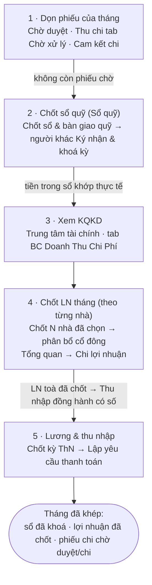

# Quy trình: Chốt tháng tài chính

Cuối mỗi tháng, chủ nhà hoặc kế toán khép sổ theo một trình tự cố định: **dọn phiếu chờ duyệt => chốt sổ quỹ => xem kết quả kinh doanh => chốt lợi nhuận theo từng nhà và chia cổ đông => chốt kỳ lương và trả lương**. Thứ tự này có lý do: lợi nhuận chỉ đúng khi mọi phiếu của tháng đã vào sổ; phần **Thu nhập đồng hành** trong lương chỉ có số khi lợi nhuận toà đã chốt.

Xuyên suốt trang này, nhớ ba mức khác nhau: **đã duyệt** (phiếu qua bước phê duyệt), **Đã Thu / Đã Chi** (đã ghi sổ — `posting_status = POSTED`, tiền thật vào/ra quỹ), và **đã chốt** (số bị khoá, không sửa được nữa).

::: info Điều kiện tiên quyết
- Quyền theo từng chặng: duyệt phiếu ở [Chờ duyệt](/03-quan-ly-van-hanh/cho-duyet/); **Đề nghị chốt & bàn giao quỹ** / **Xác nhận nhận bàn giao** (sổ quỹ); `reports_finance.profit_distribution` và `shareholder_profit.lock/unlock/manage_shareholders/distribute` (lợi nhuận); `salary.lock/unlock/distribute/manage_salary` (lương). Không suy quyền từ tên vai trò.
- Trong tháng đã thu tiền, ghi thu/chi và bàn giao đầy đủ — xem [Quy trình: Chu kỳ thu tiền hàng tháng](/01-bat-dau/quy-trinh-thu-tien/) và [Quy trình: Bàn giao & đối soát](/01-bat-dau/quy-trinh-ban-giao/).
- Đã khai **cổ đông & tỷ lệ** theo toà (nếu chia lợi nhuận) và **quản lý hưởng lương** (nếu trả lương) — cấu hình ngay trong màn ở Bước 4 và Bước 5.
- Dùng **máy tính**: bản điện thoại của Báo cáo Lợi Nhuận không có tab chốt và cấu hình.
:::

## Bản đồ chốt tháng

```mermaid
flowchart TD
  A["1 · Dọn phiếu của tháng<br/>Chờ duyệt · Thu chi tab Chờ xử lý · Cam kết chi"] -->|"không còn phiếu chờ"| R["2 · Chốt sổ quỹ (Sổ quỹ)<br/>Chốt sổ & bàn giao quỹ → người khác Ký nhận & khoá kỳ"]
  R -->|"tiền trong sổ khớp thực tế"| P["3 · Xem KQKD<br/>Trung tâm tài chính · tab BC Doanh Thu Chi Phí"]
  P --> L["4 · Chốt LN tháng (theo từng nhà)<br/>Chốt N nhà đã chọn → phân bổ cổ đông<br/>Tổng quan → Chi lợi nhuận"]
  L -->|"LN toà đã chốt → Thu nhập đồng hành có số"| S["5 · Lương & thu nhập<br/>Chốt kỳ ThN → Lập yêu cầu thanh toán"]
  S --> E(["Tháng đã khép:<br/>sổ đã khoá · lợi nhuận đã chốt · phiếu chi chờ duyệt/chi"])
```

## Hướng dẫn từng bước

**Bước 1**: **Dọn phiếu của tháng.** Mở [Chờ duyệt](/03-quan-ly-van-hanh/cho-duyet/) (`/approvals`) xử lý các yêu cầu giao cho bạn (**Duyệt**, **Duyệt và Chi…/Duyệt và Thu…** khi bạn giữ sổ, hoặc **Từ chối** có lý do); mở [Thu chi](/03-quan-ly-van-hanh/thu-chi/) tab **Chờ xử lý** để thấy mọi phiếu của công ty còn chờ duyệt hoặc chưa chọn sổ quỹ. Chi phát sinh ngoài đời ghi nhanh bằng [Báo chi nhanh](/03-quan-ly-van-hanh/bao-chi-nhanh/) (gõ, nói hoặc chụp bill → thẻ nháp → **Lưu**) — phiếu tạo ra đi cùng luật duyệt như lập ở Thu chi.

::: tip Cam kết chi quyết định phiếu nào tự duyệt
Với các phạm vi (hạng mục × toà × tháng) đã bật áp dụng ở [Cam kết chi](/05-cai-dat/cam-ket-chi/), phiếu chi nằm trong phần cam kết còn lại được máy duyệt ngay; vượt cam kết thì nằm chờ chủ duyệt, kể cả khi người lập có quyền duyệt. Máy duyệt vẫn chưa phải **Đã Chi** — tuỳ cửa chi, người giữ sổ có thể còn phải bấm chi.
:::

::: warning Nhà còn phiếu Chờ duyệt thì không chốt được lợi nhuận
Ở Bước 4, máy chủ từ chối chốt nhà còn phiếu **Chờ duyệt** trong tháng và nêu mã phiếu cần duyệt hoặc huỷ trước. Dọn ở Bước 1 để khỏi bị chặn.
:::

**Bước 2**: **Chốt sổ quỹ.** Mọi tiền mặt đã thu được nộp qua **Bàn giao tiền mặt** (hai phía xác nhận). Sau đó người giữ sổ vào **Tài chính => Sổ quỹ**, bấm biểu tượng ổ khoá **Chốt sổ & bàn giao quỹ**: **Bước 1/3** kiểm tra sổ, **Bước 2/3** nhập **Số tiền thực đếm trong két** (sổ ngân hàng: số dư sao kê) và chọn **Người nhận bàn giao (sẽ ký xác nhận)**, **Bước 3/3** gõ **CHOT SO** → **Gửi đề nghị chốt sổ**. Người nhận bấm **Xem & ký nhận**, đếm lại rồi **Ký nhận & khoá kỳ**; biên bản in được ở `/finance/cashbooks/closure/<số biên bản>`. Chi tiết: [Sổ quỹ](/03-quan-ly-van-hanh/so-quy/) và [Quy trình: Bàn giao & đối soát](/01-bat-dau/quy-trinh-ban-giao/).

::: danger Chốt sổ là khoá VĨNH VIỄN, cần hai người
Sau khi người nhận ký, mọi phiếu có ngày ≤ ngày chốt **không sửa, huỷ hay xoá được nữa** — không ai mở lại được, kể cả chủ. Sai sót sau đó xử lý bằng phiếu điều chỉnh ở kỳ hiện tại. Người ký phải **khác** người đề nghị; sổ chỉ một mình bạn dính tới sẽ báo chưa có người ký — gán một người vai trò **Kế toán** toàn tổ chức để ký.
:::

::: info "Chốt số" ở báo cáo Bàn giao tiền & Đối soát sổ không khoá sổ
Nút **Chốt số** trên báo cáo [Bàn giao tiền & đối soát](/03-quan-ly-van-hanh/ban-giao-doi-soat/) chỉ ghi một mốc so sánh số đếm với số hệ thống. Khoá kỳ chỉ làm bằng **Chốt sổ & bàn giao quỹ** ở Sổ quỹ.
:::

**Bước 3**: **Xem kết quả kinh doanh (chưa ghi gì).** Hai nơi xem:

- [Trung tâm tài chính](/04-bao-cao/trung-tam-tai-chinh/) — tổng quan KQKD, hiệu quả từng toà, lấp đầy, thu tiền & công nợ, xu hướng 13 tháng (chỉ toà vật lý, một công ty mỗi lần xem).
- **Báo cáo tài chính => Báo cáo Lợi Nhuận**, tab **BC Doanh Thu Chi Phí** — doanh thu, chi phí, lợi nhuận theo phòng/khoản trong tháng; công tắc **Kỳ phân bổ** và **Chỉ KQKD**.

Rà riêng các khoản không thuộc KQKD (tiền cọc, chuyển nội bộ…), phiếu chờ duyệt và các ngoại lệ thanh lý trước khi sang Bước 4.

**Bước 4**: **Chốt lợi nhuận theo từng nhà và chia cổ đông.** Ở trang **Báo cáo Lợi Nhuận**, tab **Chốt LN tháng** và **Cổ đông & tỷ lệ** mặc định ẩn — nhấp nhanh **3 lần** vào biểu tượng tròn bên trái tiêu đề **Báo cáo Lợi Nhuận** để hiện (tab ẩn có dấu **•**). Chi tiết: [Chia lợi nhuận cổ đông](/03-quan-ly-van-hanh/chia-loi-nhuan/).

1. Tab **Cổ đông & tỷ lệ**: kiểm cổ đông, tỷ lệ theo toà (**Tỷ lệ gán đủ 100%**) và quy tắc **Lương điều hành** (trừ khỏi lợi nhuận từng nhà trước khi chia).
2. Tab **Chốt LN tháng**: chọn tổ chức, tháng, năm; bấm **Tải lại số nguồn** nếu vừa sửa phiếu. Đọc dải KPI (**Kỳ chốt**, **Tổng quỹ sau lương**, **Đã phân bổ cổ đông**, **Chưa phân bổ**, **Source hash**) và bảng **Lợi nhuận theo nhà** (**Quỹ sau lương = LN tự tính + Điều chỉnh − Lương điều hành**).
3. Với nhà có tỷ lệ cổ đông dưới 100%, chọn **Giữ lại lợi nhuận** hoặc **Chuyển kỳ sau** cho **Phần chưa phân bổ**, kèm lý do.
4. Tick các nhà muốn chốt, bấm **Chốt N nhà đã chọn** rồi xác nhận **Chốt N nhà**. Chốt là **theo từng nhà**: nhà không tick giữ nguyên và phiếu của chúng vẫn sửa được.
5. Tab **Tổng quan**: bấm **+ Chi lợi nhuận** (hoặc **Chi** trên dòng cổ đông), chọn cổ đông, số tiền, sổ quỹ, ngày → **Ghi phiếu chi**.

::: danger Chốt LN khoá mọi phiếu trong tháng của nhà đó
Sau khi chốt, **mọi phiếu có ngày trong tháng** của các nhà đã chốt bị khoá với mọi người, kể cả chủ công ty — gồm cả phiếu thu tiền của hoá đơn tháng đó dù phiếu mang ngày tháng sau. Muốn sửa phải **Mở khoá N nhà đã chọn** (cần lý do), và mở khoá **xoá phần đã phân bổ** cho cổ đông và lương điều hành của các nhà đó — sửa xong phải chốt lại. Vì vậy hãy chốt **sau khi hết tháng**; tab có cảnh báo **Tháng chưa kết thúc** và **Còn N sổ quỹ chưa chốt hết tháng** nhưng không chặn.
:::

::: warning Phiếu chi lợi nhuận chưa phải tiền đã ra
**Ghi phiếu chi** tạo phiếu chi lợi nhuận; cột **Đã ứng / đã chia** cộng phiếu đã **duyệt**. Tiền chỉ ra khỏi quỹ khi phiếu là **Đã Chi**. Phiếu chi lợi nhuận nằm trên toà ảo **Chung** và không tính lại vào KQKD.
:::

**Bước 5**: **Chốt kỳ lương và trả lương.** Vào **Tài chính => Bảng lương** (màn **Lương & thu nhập**). Chi tiết: [Bảng lương quản lý](/03-quan-ly-van-hanh/bang-luong/).

1. Tab **Tổng quan kỳ**: đọc năm ô số và mục **Cần xử lý trước khi chốt** (toà chưa công bố giá phí Quản lý, phiếu hoa hồng chờ duyệt, **lợi nhuận kỳ chưa chốt**, phiếu chi lương đang chờ duyệt…).
2. Tab **Thu nhập & thanh toán**: kiểm từng người theo bốn nhóm **Lương vận hành**, **Hoa hồng & thưởng Sale**, **Thu nhập đồng hành** (chỉ có số khi lợi nhuận toà đã chốt ở Bước 4; chưa chốt thì hiện **Chưa đủ cơ sở**), **Ứng & cấn trừ**. Tab **Bảng kê công việc** để soi bằng chứng thưởng.
3. Bấm **Chốt kỳ ThN** (ví dụ **Chốt kỳ Th10**) → **Chốt tháng**: hệ thống tính lần cuối, tự duyệt phiếu hoa hồng còn chờ đang tính vào lương và đóng băng bảng lương cùng bảng kê.
4. Ở khung **Thanh toán cho <tên>**, chọn **Chi từ sổ**, **Ngày chi** rồi **Lập yêu cầu thanh toán**; hoặc **Trả lương hàng loạt** → **Ghi N phiếu chi**.

::: danger Lập yêu cầu, duyệt và chi là ba việc khác nhau
**Lập yêu cầu thanh toán** chỉ tạo **phiếu chi lương chờ duyệt** (không tính KQKD). Ô **Đã trả** tăng khi phiếu được duyệt; tiền chỉ ra khỏi quỹ khi phiếu là **Đã Chi**. Tiền phòng nhân viên ở được trừ thẳng vào hoá đơn phòng nếu đã có hoá đơn tháng kế. Muốn sửa kỳ đã chốt dùng **Mở khoá ThN** (quyền `unlock`) rồi chốt lại ngay.
:::

::: tip Lương điều hành khác lương quản lý
**Lương điều hành** khai ở tab **Cổ đông & tỷ lệ** của Báo cáo Lợi Nhuận và bị **trừ khỏi lợi nhuận trước khi chia cổ đông** (chi bằng **+ Chi lương điều hành** ở tab Tổng quan). **Lương quản lý vận hành** tính ở màn **Lương & thu nhập** theo ngày công, công việc, hoa hồng. Hai màn, hai loại phiếu chi khác nhau.
:::

## Các màn trong chuỗi

| Màn hình | Vai trò & chứng từ sinh ra |
| --- | --- |
| [Chờ duyệt](/03-quan-ly-van-hanh/cho-duyet/) · [Thu chi](/03-quan-ly-van-hanh/thu-chi/) | Duyệt / từ chối phiếu; tab **Chờ xử lý** gom phiếu chờ duyệt hoặc chưa chọn sổ quỹ. |
| [Báo chi nhanh](/03-quan-ly-van-hanh/bao-chi-nhanh/) | Ghi phiếu thu/chi từ câu gõ, giọng nói, ảnh bill. |
| [Cam kết chi](/05-cai-dat/cam-ket-chi/) | Ký trước số chi mỗi tháng theo toà × hạng mục; máy quyết phiếu nào tự duyệt. |
| [Sổ quỹ](/03-quan-ly-van-hanh/so-quy/) | **Chốt sổ & bàn giao quỹ** hai bên ký, khoá kỳ vĩnh viễn, biên bản in được. |
| [Bàn giao tiền & đối soát](/03-quan-ly-van-hanh/ban-giao-doi-soat/) | Báo cáo còn phải nộp theo sổ; **Chốt số** không khoá. |
| [Trung tâm tài chính](/04-bao-cao/trung-tam-tai-chinh/) | Xem KQKD, hiệu quả toà, công nợ, xu hướng. |
| [Chia lợi nhuận cổ đông](/03-quan-ly-van-hanh/chia-loi-nhuan/) | **Chốt LN tháng** theo nhà, phân bổ cổ đông, **Chi lợi nhuận**, lương điều hành. |
| [Bảng lương quản lý](/03-quan-ly-van-hanh/bang-luong/) · [Lương của tôi](/03-quan-ly-van-hanh/luong-cua-toi/) | **Chốt kỳ**, **Lập yêu cầu thanh toán** → phiếu chi lương chờ duyệt; nhân viên tự xem lương. |

## Tình huống & lỗi thường gặp

| Tình huống | Nguyên nhân & cách xử lý |
| --- | --- |
| Không thấy tab **Chốt LN tháng** / **Cổ đông & tỷ lệ** | Dùng máy tính, nhấp nhanh 3 lần biểu tượng bên trái tiêu đề. Vẫn không hiện thì thiếu quyền `lock`/`unlock`/`manage_shareholders`. |
| Chốt báo **Còn N phiếu chờ duyệt trong tháng … của toà …** | Duyệt hoặc huỷ các phiếu được nêu ở [Chờ duyệt](/03-quan-ly-van-hanh/cho-duyet/) rồi chốt lại. |
| Nút xác nhận chốt bị khoá vì phần lợi nhuận còn dư | Chọn **Giữ lại lợi nhuận** / **Chuyển kỳ sau** và nhập lý do cho từng nhà còn dư, hoặc bỏ tick nhà đó. |
| Nút chốt báo vùng chọn đang lẫn | Đang tick cả nhà đã chốt lẫn chưa chốt; chốt và **Chốt lại N nhà đã chọn** làm hai lượt. |
| Nhà báo **Cũ** / **Đã lệch nguồn** | Dữ liệu phiếu, tỷ lệ hoặc lương đã đổi sau lần chốt. Tick nhà đó, **Chốt lại N nhà đã chọn** với lý do. |
| Thu/sửa phiếu báo lợi nhuận tháng **đã chốt** | Nhà đó đã chốt lợi nhuận tháng này. Lập điều chỉnh ở tháng hiện tại, hoặc **Mở khoá** (mất phần đã phân bổ, phải chốt lại). |
| **Thu nhập đồng hành** ghi **Chưa đủ cơ sở** | Lợi nhuận toà chưa chốt; quay lại Bước 4. |
| Đã lập yêu cầu trả lương / chi lợi nhuận nhưng quỹ chưa giảm | Phiếu còn chờ duyệt hoặc chưa **Đã Chi**; theo dõi ở [Chờ duyệt](/03-quan-ly-van-hanh/cho-duyet/). |
| Không ký được chốt sổ vì sổ đã thay đổi | Có phiếu mới ghi sổ sau lúc đề nghị. Huỷ đề nghị, hai bên đếm lại. |

## Thử trực tiếp trên sandbox

<SandboxTry account="demo.chunha" app-path="/reports/finance/profit-distribution" app-label="Mở Báo cáo Lợi Nhuận" fixtures="Snapshot 07/10/2026: 4 toà, chưa có cổ đông và quản lý điều hành; tháng 10/2026 chưa chốt, còn 1 sổ quỹ chưa chốt; Lương & thu nhập có 1 quản lý fixture, kỳ 10/2026 chưa chốt." view-only>

Đây là chế độ **chỉ xem** — đi mắt theo chuỗi chốt tháng, không khoá hay ghi tiền:

1. **KQKD:** đọc tab **BC Doanh Thu Chi Phí** và **Tổng quan**.
2. **Chốt LN tháng:** nhấp nhanh 3 lần biểu tượng bên trái tiêu đề; ở tab **Chốt LN tháng** đọc dải KPI, cảnh báo **Tháng chưa kết thúc** / sổ quỹ chưa chốt và các cột của bảng. **Không** bấm **Chốt N nhà đã chọn**, **Mở khoá** hay **Đặt lại**.
3. **Sổ quỹ:** mở [Sổ quỹ](/03-quan-ly-van-hanh/so-quy/), mở hộp **Chốt sổ & bàn giao quỹ** tới Bước 2/3 rồi đóng — không gõ **CHOT SO**.
4. **Lương:** mở [Bảng lương quản lý](/03-quan-ly-van-hanh/bang-luong/), đọc mục **Cần xử lý trước khi chốt** và nhóm **Thu nhập đồng hành**. **Không** bấm **Chốt kỳ** hay **Lập yêu cầu thanh toán**.

Kết quả mong đợi: bạn dựng được chuỗi **dọn phiếu => chốt sổ => xem KQKD => chốt LN theo nhà => chốt kỳ lương** và hiểu vì sao phải chốt lợi nhuận trước khi chốt lương.

:::tip
[Ví cá nhân](/03-quan-ly-van-hanh/vi-ca-nhan/) là sổ riêng, không dùng số của ví để bù vào sổ quỹ hay KQKD công ty.
:::

</SandboxTry>

## Quy trình liên quan

- [Quy trình: Bàn giao & đối soát](/01-bat-dau/quy-trinh-ban-giao/) — nộp tiền và chốt sổ trước khi khép tháng.
- [Chờ duyệt](/03-quan-ly-van-hanh/cho-duyet/) · [Thu chi](/03-quan-ly-van-hanh/thu-chi/) · [Báo chi nhanh](/03-quan-ly-van-hanh/bao-chi-nhanh/) — đưa đủ phiếu của tháng vào sổ.
- [Cam kết chi](/05-cai-dat/cam-ket-chi/) — luật tự duyệt phiếu chi theo cam kết.
- [Sổ quỹ](/03-quan-ly-van-hanh/so-quy/) — chốt sổ & bàn giao quỹ.
- [Trung tâm tài chính](/04-bao-cao/trung-tam-tai-chinh/) — xem KQKD toàn cảnh.
- [Chia lợi nhuận cổ đông](/03-quan-ly-van-hanh/chia-loi-nhuan/) — chốt LN tháng theo nhà, chia cổ đông.
- [Bảng lương quản lý](/03-quan-ly-van-hanh/bang-luong/) · [Lương của tôi](/03-quan-ly-van-hanh/luong-cua-toi/) — chốt kỳ và trả lương.
- [Quy trình: Chu kỳ thu tiền hàng tháng](/01-bat-dau/quy-trinh-thu-tien/) — bảo đảm tiền đã vào sổ trước khi khép tháng.
- [Quy trình: Thanh lý hợp đồng](/01-bat-dau/quy-trinh-thanh-ly/) — doanh thu thanh lý vào lợi nhuận tháng.
