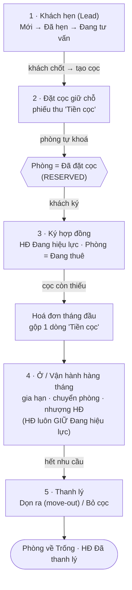

# Quy trình: Vòng đời khách thuê

Một khách trong ptcrm đi qua năm chặng nối tiếp nhau: **Khách hẹn => Đặt cọc giữ chỗ => Ký hợp đồng => Ở => Thanh lý**. Mỗi chặng là một màn hình riêng, và khi bạn hoàn tất một chặng thì hệ thống **tự đổi trạng thái phòng và hợp đồng** để chặng sau tiếp nối đúng. Trang này là bản đồ xuyên suốt — mỗi mắt xích dẫn tới một trang hướng dẫn chi tiết. Đọc trang này trước để hình dung dòng chảy, rồi mở từng trang khi thao tác thật.

::: info Điều kiện tiên quyết
- Đã dựng xong dữ liệu nền cho toà nhà: toà, tầng/phòng, dịch vụ, sổ quỹ. Nếu chưa, xem [Khởi tạo dữ liệu — thứ tự chuẩn](/01-bat-dau/khoi-tao-du-lieu/).
- Tài khoản có quyền phù hợp với từng chặng: **Khách hẹn** (sale), **Đặt cọc** và **Hợp đồng** (sale / quản lý toà). Là nhân viên, bạn chỉ thấy khách thuộc **toà được gán phạm vi** cho mình.
- Nắm sơ giao diện và menu bên trái — xem [Làm quen giao diện](/01-bat-dau/lam-quen-giao-dien/).
:::

## Hướng dẫn từng bước

Năm chặng đi theo đúng thứ tự dưới đây. Mũi tên cho thấy trạng thái phòng/hợp đồng đổi ra sao khi qua mỗi chặng.

**Bước 1**: **Khách hẹn (Lead).** Nhập khách tiềm năng vào phễu sale và đẩy qua các giai đoạn **Mới => Đã hẹn => Đang tư vấn**. Ở chặng này chưa có tiền và chưa đụng tới phòng — phòng vẫn ở trạng thái **Trống**. Khi khách chốt, bạn chuyển lead sang đặt cọc. Chi tiết ở [Khách hẹn (Lead)](/03-quan-ly-van-hanh/khach-hen/).

**Bước 2**: **Đặt cọc giữ chỗ.** Khi khách đồng ý giữ căn, bạn lập một **phiếu thu tiền cọc** cho phòng đó. *Điểm mấu chốt:* ngay khi có phiếu thu cọc, hệ thống **tự chuyển phòng sang "Đã đặt cọc" (RESERVED)** và phòng biến mất khỏi danh sách phòng trống — kể cả trang công khai `/r/:token`. Bạn không cần bấm gì thêm để "khoá" phòng. Chi tiết ở [Đặt cọc](/03-quan-ly-van-hanh/dat-coc/).

::: danger Đây là thao tác ghi tiền cọc vào sổ quỹ
Lập phiếu thu cọc là **ghi một khoản tiền thật** của khách vào sổ quỹ **"CỌC (giữ hộ khách)"**. Kiểm tra kỹ đúng **phòng**, đúng **số tiền cọc** và đúng **ngày** trước khi lưu — ghi sai sẽ kéo lệch số cọc phải nộp khi ký hợp đồng và cả khi thanh lý.
:::

::: warning Phòng tự khoá "Đã đặt cọc" ngay cả khi phiếu cọc chưa duyệt
Chỉ cần có phiếu thu cọc cho phòng (chưa cần duyệt), phòng đã chuyển **Đã đặt cọc** và rời danh sách trống. Nếu khách đổi ý, bạn phải **huỷ phiếu cọc** thì phòng mới tự trả về **Trống** — không có nút "mở khoá phòng" riêng.
:::

**Bước 3**: **Ký hợp đồng.** Chọn phòng đang giữ chỗ + khách, nhập giá thuê, chu kỳ, tiền cọc và dịch vụ. Khi lưu, hợp đồng chuyển **Đang hiệu lực** và phòng chuyển **Đang thuê (OCCUPIED)** — từ lúc này hợp đồng "sở hữu" trạng thái phòng, cơ chế giữ chỗ tự động không còn tác động. Số cọc khách đã nộp ở Bước 2 được **truy về đúng hợp đồng** này. Chi tiết ở [Hợp đồng](/03-quan-ly-van-hanh/hop-dong/); xem một hợp đồng đã ký ở [Hợp đồng — chi tiết](/03-quan-ly-van-hanh/hop-dong-chi-tiet/).

::: warning Thiếu cọc sẽ bị chặn ký
Nếu số cọc đã nộp chưa đủ **Tiền cọc** của hợp đồng, hệ thống **chặn ký**. Bạn phải chọn một trong hai cách xử lý rồi mới ký được: **cho nợ cọc** (ghi lý do + ngày hẹn bổ sung) hoặc **thu đủ trong hoá đơn tháng đầu**.
:::

::: tip Cọc thiếu được gộp vào hoá đơn tháng đầu
Với cách "thu đủ trong hoá đơn tháng đầu", phần cọc còn thiếu **không** thu thành phiếu riêng mà được gộp thành **một dòng "Tiền cọc" ngay trong hoá đơn tháng đầu** của hợp đồng. Nhờ ghi đúng nhãn này, hệ thống tự **loại phần cọc khỏi doanh thu** khi khách thanh toán — cọc không bị tính nhầm thành tiền lời.
:::

**Bước 4**: **Ở — vận hành hàng tháng.** Khách vào ở; mỗi kỳ bạn ghi chỉ số, sinh hoá đơn và thu tiền. Trong lúc ở, hợp đồng có thể biến động: **gia hạn**, **chuyển phòng** hoặc **nhượng hợp đồng** cho người khác. Điểm quan trọng: mọi biến động này **giữ nguyên hợp đồng ở trạng thái Đang hiệu lực** — không sinh hợp đồng mới, "đã gia hạn" chỉ là một nhãn phụ. Chi tiết ở [Gia hạn & chuyển phòng](/03-quan-ly-van-hanh/gia-han-chuyen-phong/); hồ sơ khách đang ở xem tại [Cư dân](/03-quan-ly-van-hanh/cu-dan/).

::: tip "Đã gia hạn" không đổi trạng thái hợp đồng
Gia hạn cập nhật thẳng **ngày kết thúc / giá thuê** trên chính hợp đồng cũ và **giữ Đang hiệu lực**; hệ thống chỉ gắn thêm nhãn **Đã gia hạn** để bạn nhận biết. Đừng tìm một hợp đồng "mới" sau khi gia hạn — vẫn là hợp đồng đó.
:::

**Bước 5**: **Thanh lý.** Khi khách trả phòng, bạn kết thúc hợp đồng theo một trong hai hướng:
- **Dọn ra (move-out):** tất toán bình thường — cấn trừ cọc với công nợ và các khoản thu thêm (tiền phòng lẻ ngày, chốt điện cuối kỳ, phí khác), phần cọc thừa **chi trả lại khách**, phần cấn nợ chuyển thành **Doanh thu thanh lý**.
- **Bỏ cọc (forfeit):** khách bỏ cọc — phần cọc **thực thu** được giữ lại và chuyển thành **doanh thu**.

Kết thúc chặng này, hợp đồng chuyển **Đã thanh lý** và phòng tự trả về **Trống**, sẵn sàng cho khách mới. Chi tiết ở [Hoàn / Bỏ cọc](/03-quan-ly-van-hanh/hoan-bo-coc/) và [Hợp đồng — chi tiết](/03-quan-ly-van-hanh/hop-dong-chi-tiet/).

::: danger Thanh lý là thao tác chi/cấn trừ tiền cọc
Khi thanh lý, hệ thống ghi hàng loạt phiếu tiền: gạch nợ hoá đơn, chi trả cọc thừa cho khách, hoặc cấn cọc vào doanh thu. Kiểm tra kỹ **các khoản thu thêm** và **số cọc còn lại** trước khi xác nhận — sai một khoản là lệch cả sổ quỹ lẫn báo cáo lợi nhuận của toà.
:::

::: tip Số cọc luôn truy từ phiếu thu, không từ nhãn "trạng thái cọc"
Cọc thực nộp của một hợp đồng = **tổng các phiếu thu "Tiền cọc" đã duyệt**, chứ không phải một ô trạng thái nào. Vì vậy khi số cọc trông "lệch", hãy soát lại **các phiếu thu cọc** của phòng đó thay vì tìm một nút chỉnh tay.
:::

## Các tính năng khác trên màn hình

Mỗi chặng của vòng đời là một màn hình riêng — bảng dưới đây tóm tắt vai trò và trạng thái mà nó tạo ra.

| Màn hình trong vòng đời | Vai trò & trạng thái sinh ra |
| --- | --- |
| **Khách hẹn** ([mở](/03-quan-ly-van-hanh/khach-hen/)) | Phễu sale 5 giai đoạn (Mới / Đã hẹn / Đang tư vấn / Đã chuyển đổi / Thất bại). Chưa đụng phòng, chưa ghi tiền. |
| **Đặt cọc** ([mở](/03-quan-ly-van-hanh/dat-coc/)) | Lập phiếu thu cọc → phòng tự chuyển **Đã đặt cọc** và rời danh sách trống. Tab **Phiếu giữ chỗ** liệt kê cọc chưa gắn hợp đồng. |
| **Hợp đồng** ([mở](/03-quan-ly-van-hanh/hop-dong/)) | Ký hợp đồng → HĐ **Đang hiệu lực**, phòng **Đang thuê**; chặn ký khi thiếu cọc; sinh hoá đơn tháng đầu. |
| **Hợp đồng — chi tiết** ([mở](/03-quan-ly-van-hanh/hop-dong-chi-tiet/)) | Xem một hợp đồng, gia hạn / thanh lý ngay tại đây; hiện nhãn **Đã gia hạn**. |
| **Gia hạn & chuyển phòng** ([mở](/03-quan-ly-van-hanh/gia-han-chuyen-phong/)) | Biến động khi đang ở — gia hạn tại chỗ, đổi phòng, nhượng hợp đồng; đều **giữ Đang hiệu lực**. |
| **Cư dân** ([mở](/03-quan-ly-van-hanh/cu-dan/)) | Hồ sơ khách đang ở sau khi ký hợp đồng. |
| **Hoàn / Bỏ cọc** ([mở](/03-quan-ly-van-hanh/hoan-bo-coc/)) | Nhật ký hoàn cọc / bỏ cọc phát sinh khi thanh lý. |

## Tình huống & lỗi thường gặp

| Tình huống | Nguyên nhân & cách xử lý |
| --- | --- |
| Phòng vẫn "Trống" sau khi khách đặt cọc | Chưa có phiếu thu cọc thật cho phòng, hoặc phiếu đã bị huỷ. Vào [Đặt cọc](/03-quan-ly-van-hanh/dat-coc/) lập phiếu thu cọc — phòng tự chuyển **Đã đặt cọc**. |
| Khách đổi ý nhưng phòng vẫn "Đã đặt cọc" | Phòng chỉ tự nhả về **Trống** khi **huỷ phiếu cọc** (hoặc gắn cọc vào hợp đồng). Không có nút mở khoá riêng — hãy huỷ phiếu thu cọc của phòng. |
| Không ký được hợp đồng, báo thiếu cọc | Số cọc đã nộp chưa đủ **Tiền cọc**. Chọn **cho nợ cọc** (ghi lý do + ngày hẹn) hoặc **thu đủ trong hoá đơn tháng đầu** để mở khoá nút ký. |
| Số cọc trên hợp đồng khác số đã thu | Cọc được cộng từ **các phiếu thu cọc đã duyệt** gắn với phòng. Soát lại phiếu cọc (đủ chưa, đã duyệt chưa, đúng phòng chưa) thay vì sửa tay. |
| Gia hạn xong không tìm thấy hợp đồng "mới" | Đúng thiết kế: gia hạn **giữ nguyên hợp đồng cũ** (cập nhật ngày/giá) và gắn nhãn **Đã gia hạn**. Mở lại chính hợp đồng đó. |
| Thanh lý xong phòng chưa về "Trống" | Nếu phòng **còn một phiếu cọc giữ chỗ mồ côi** (của khách kế tiếp), phòng sẽ tự chuyển lại **Đã đặt cọc** ngay sau thanh lý. Kiểm tra phiếu cọc còn treo trên phòng. |
| Cọc bị tính nhầm thành doanh thu | Phần cọc thiếu phải là dòng **"Tiền cọc"** trong hoá đơn tháng đầu (đúng nhãn) thì hệ thống mới loại khỏi doanh thu. Kiểm tra lại cách lập hoá đơn tháng đầu ở [Hợp đồng](/03-quan-ly-van-hanh/hop-dong/). |

## Thử trực tiếp trên sandbox

<SandboxTry account="demo.sale" app-path="/leads" app-label="Mở màn Khách hẹn" fixtures="5 lead DEMO Khách Tiềm Năng; cọc giữ chỗ A301/A302; HĐ A101–A105" view-only>

Đây là chế độ **chỉ xem** — hãy đi đúng chuỗi vòng đời, mỗi chặng mở trang tương ứng để thấy trạng thái nối tiếp nhau:

1. **Xem lead:** trên màn **Khách hẹn** có sẵn **5 lead "DEMO Khách Tiềm Năng"** rải đều 5 giai đoạn (Mới, Đã hẹn, Đang tư vấn, Đã chuyển đổi, Thất bại). Quan sát một lead ở cột **Đã chuyển đổi** — đó là khách đã chốt, chuẩn bị sang cọc.
2. **Xem cọc giữ chỗ:** mở [Đặt cọc](/03-quan-ly-van-hanh/dat-coc/), tab **Phiếu giữ chỗ**. Chú ý phòng **A301** (đã đủ tiền cọc) và **A302** (cọc quá hạn) — cả hai đang ở trạng thái **Đã đặt cọc** và không còn nằm trong danh sách phòng trống.
3. **Xem hợp đồng:** mở [Hợp đồng](/03-quan-ly-van-hanh/hop-dong/). Quan sát **A101** (Nguyễn Văn An — đã ký lâu năm, đủ cọc) và **A102** (Trần Thị Bình — mới ký, **còn thiếu cọc**) để thấy dòng **Tiền cọc** gộp trong hoá đơn tháng đầu; mở thêm **A104** (Phạm Thị Dung) để thấy nhãn **Đã gia hạn** mà hợp đồng vẫn **Đang hiệu lực**.

Kết quả mong đợi: bạn đi trọn chuỗi **Lead => Cọc giữ chỗ => Hợp đồng** và nhận ra trạng thái phòng đổi theo — **Trống** ở chặng lead, **Đã đặt cọc** khi có phiếu cọc, **Đang thuê** khi đã ký hợp đồng.

:::tip
Trên sandbox bạn cứ mở xem thoải mái — đây là dữ liệu demo, không ảnh hưởng số liệu thật.
:::

</SandboxTry>

## Quy trình liên quan

- [Khách hẹn (Lead)](/03-quan-ly-van-hanh/khach-hen/) — chặng 1: nuôi khách tiềm năng qua phễu sale.
- [Đặt cọc](/03-quan-ly-van-hanh/dat-coc/) — chặng 2: lập phiếu thu cọc, phòng tự khoá "Đã đặt cọc".
- [Hợp đồng](/03-quan-ly-van-hanh/hop-dong/) — chặng 3: ký hợp đồng, cọc thiếu gộp vào hoá đơn tháng đầu.
- [Hợp đồng — chi tiết](/03-quan-ly-van-hanh/hop-dong-chi-tiet/) — xem một hợp đồng, gia hạn hoặc thanh lý.
- [Gia hạn & chuyển phòng](/03-quan-ly-van-hanh/gia-han-chuyen-phong/) — chặng 4: biến động khi khách đang ở.
- [Cư dân](/03-quan-ly-van-hanh/cu-dan/) — hồ sơ khách chính thức sau khi ký hợp đồng.
- [Hoàn / Bỏ cọc](/03-quan-ly-van-hanh/hoan-bo-coc/) — chặng 5: xử lý cọc khi thanh lý.
- [Khởi tạo dữ liệu — thứ tự chuẩn](/01-bat-dau/khoi-tao-du-lieu/) — dựng dữ liệu nền trước khi chạy vòng đời này.
