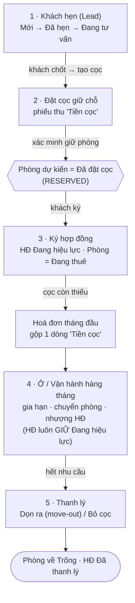

# Quy trình: Vòng đời khách thuê

Một khách trong ptcrm thường đi qua năm chặng: **Khách hẹn => Đặt cọc giữ chỗ => Ký hợp đồng => Ở => Thanh lý**. Trạng thái phòng/hợp đồng có cơ chế đối soát tự động, nhưng các điểm nối **lead → cọc**, **cọc → đúng khách**, **lập đủ kỳ hoá đơn** và **thanh lý → hồ sơ hoàn cọc** hiện chưa phải một transaction khép kín. Vì vậy trang này vừa chỉ đường thao tác, vừa nêu các hậu kiểm bắt buộc sau mỗi chặng.

::: info Điều kiện tiên quyết
- Đã dựng xong dữ liệu nền cho toà nhà: toà, tầng/phòng, dịch vụ, sổ quỹ. Nếu chưa, xem [Khởi tạo dữ liệu — thứ tự chuẩn](/01-bat-dau/khoi-tao-du-lieu/).
- Tài khoản có quyền phù hợp: `leads.view/create/convert`, `deposits.view/create/convert`, `contracts.view/create/renew/transfer/terminate`, cùng quyền tài chính tương ứng khi thu/duyệt tiền. Hồ sơ **Cư dân** dùng quyền `customers` ở phạm vi tổ chức; lead, cọc, hợp đồng và xe có thể còn bị giới hạn theo toà.
- Nắm sơ giao diện và menu bên trái — xem [Làm quen giao diện](/01-bat-dau/lam-quen-giao-dien/).
:::

::: warning Hiện trạng đã biết — không coi đây là một chuỗi tự động hoàn toàn
- Nút chuyển lead sang cọc vẫn ghi mô hình `tenants + deposits` cũ bằng nhiều request; hãy tạo cọc chính thức tại màn **Đặt cọc** và tự cập nhật lead sau khi đối chiếu.
- Tạo cọc giữ chỗ đặt khoá phòng và ghi phiếu tiền qua các request riêng; lỗi khoá/RLS/mạng có thể không chặn phiếu. Sau khi lưu phải kiểm tra cả **phiếu cọc** lẫn **trạng thái phòng**.
- Cọc mồ côi hiện được tìm chủ yếu theo phòng/cửa thời gian, chưa khóa chắc theo khách; trước khi ký phải so tên người nộp, khách đại diện và chứng từ.
- Không có scheduler đáng tin để tự sinh mọi kỳ hoá đơn. Mỗi tháng phải kiểm danh sách hợp đồng/phòng còn thiếu kỳ.
- Thanh lý hiện có thể đóng hợp đồng dù thiếu hồ sơ thanh lý; công nợ preview do client tải. Chỉ coi hoàn tất khi đối chiếu đủ hợp đồng, phòng, hoá đơn, phiếu tiền và hồ sơ/nhật ký thanh lý.
:::

## Hướng dẫn từng bước

Năm chặng đi theo đúng thứ tự dưới đây. Mũi tên cho thấy trạng thái phòng/hợp đồng đổi ra sao khi qua mỗi chặng.

**Bước 1**: **Khách hẹn (Lead).** Nhập khách tiềm năng vào phễu sale và đẩy qua các giai đoạn **Mới => Đã hẹn => Đang tư vấn**. Lead chỉ là dữ liệu sale; chưa được coi là khách/cọc canonical. Khi khách chốt, ghi nhận cọc ở màn **Đặt cọc**, rồi xác nhận lead đã chuyển trạng thái. Chi tiết ở [Khách hẹn (Lead)](/03-quan-ly-van-hanh/khach-hen/).

**Bước 2**: **Đặt cọc giữ chỗ.** Khi khách đã thực nộp tiền, bạn lập phiếu thu cọc cho đúng phòng. Trigger phòng sẽ cố đưa phòng sang **Đã đặt cọc (RESERVED)**; tuy nhiên khoá kỹ thuật 24 giờ, phiếu tiền và trạng thái phòng chưa được ghi trong cùng một transaction. Sau khi lưu, mở lại màn **Đặt cọc** và danh sách phòng để xác nhận cả hai phía. Chi tiết ở [Đặt cọc](/03-quan-ly-van-hanh/dat-coc/).

::: danger Đây là thao tác ghi tiền cọc vào sổ quỹ
Lập phiếu thu cọc là **ghi một khoản tiền thật** của khách vào sổ quỹ **"CỌC (giữ hộ khách)"**. Kiểm tra kỹ đúng **phòng**, đúng **số tiền cọc** và đúng **ngày** trước khi lưu — ghi sai sẽ kéo lệch số cọc phải nộp khi ký hợp đồng và cả khi thanh lý.
:::

::: warning Không suy ra trạng thái phòng từ việc phiếu cọc đã lưu
Phiếu tiền và giữ phòng được ghi qua các bước riêng; giữ phòng có thể thất bại mà phiếu vẫn tồn tại. Sau khi tạo hoặc huỷ cọc, kiểm tra trực tiếp trạng thái phòng và các hợp đồng/cọc còn hiệu lực trước khi bán lại phòng. Ô ngày giữ trên form là mô tả; khoá kỹ thuật hiện có cửa sổ 24 giờ riêng.
:::

**Bước 3**: **Ký hợp đồng.** Chọn phòng đang giữ chỗ + khách, nhập giá thuê, chu kỳ, tiền cọc và dịch vụ. Khi lưu, hợp đồng chuyển **Đang hiệu lực** và phòng chuyển **Đang thuê (OCCUPIED)** — từ lúc này hợp đồng "sở hữu" trạng thái phòng, cơ chế giữ chỗ tự động không còn tác động. Số cọc khách đã nộp ở Bước 2 được **truy về đúng hợp đồng** này. Chi tiết ở [Hợp đồng](/03-quan-ly-van-hanh/hop-dong/); xem một hợp đồng đã ký ở [Hợp đồng — chi tiết](/03-quan-ly-van-hanh/hop-dong-chi-tiet/).

::: warning Thiếu cọc sẽ bị chặn ký
Nếu số cọc đã nộp chưa đủ **Tiền cọc** của hợp đồng, hệ thống **chặn ký**. Bạn phải chọn một trong hai cách xử lý rồi mới ký được: **cho nợ cọc** (ghi lý do + ngày hẹn bổ sung) hoặc **thu đủ trong hoá đơn tháng đầu**.
:::

::: tip Cọc thiếu được gộp vào hoá đơn tháng đầu
Với cách "thu đủ trong hoá đơn tháng đầu", phần cọc còn thiếu **không** thu thành phiếu riêng mà được gộp thành **một dòng "Tiền cọc" ngay trong hoá đơn tháng đầu** của hợp đồng. Nhờ ghi đúng nhãn này, hệ thống tự **loại phần cọc khỏi doanh thu** khi khách thanh toán — cọc không bị tính nhầm thành tiền lời.
:::

**Bước 4**: **Ở — vận hành hàng tháng.** Khách vào ở; mỗi kỳ bạn ghi chỉ số, sinh hoá đơn và thu tiền. Trong lúc ở, hợp đồng có thể biến động: **gia hạn**, **chuyển phòng** hoặc **nhượng hợp đồng** cho người khác. Điểm quan trọng: mọi biến động này **giữ nguyên hợp đồng ở trạng thái Đang hiệu lực** — không sinh hợp đồng mới, "đã gia hạn" chỉ là một nhãn phụ. Chi tiết ở [Gia hạn & chuyển phòng](/03-quan-ly-van-hanh/gia-han-chuyen-phong/); hồ sơ khách đang ở xem tại [Cư dân](/03-quan-ly-van-hanh/cu-dan/).

::: tip "Đã gia hạn" không đổi trạng thái hợp đồng
Gia hạn cập nhật thẳng **ngày kết thúc / giá thuê** trên chính hợp đồng cũ và **giữ Đang hiệu lực**; hệ thống chỉ gắn thêm nhãn **Đã gia hạn** để bạn nhận biết. Đừng tìm một hợp đồng "mới" sau khi gia hạn — vẫn là hợp đồng đó.
:::

**Bước 5**: **Thanh lý.** Khi khách trả phòng, bạn kết thúc hợp đồng theo một trong hai hướng. Preview công nợ chỉ là số để kiểm tra; nếu khối công nợ đang tải hoặc lỗi, **không xác nhận**:
- **Dọn ra (move-out):** tất toán bình thường — cấn trừ cọc với công nợ và các khoản thu thêm (tiền phòng lẻ ngày, chốt điện cuối kỳ, phí khác), phần cọc thừa **chi trả lại khách**, phần cấn nợ chuyển thành **Doanh thu thanh lý**.
- **Bỏ cọc (forfeit):** khách bỏ cọc — phần cọc **thực thu** được giữ lại và chuyển thành **doanh thu**.

Sau khi xác nhận, phải kiểm riêng: hợp đồng **Đã thanh lý**, phòng **Trống/Đã giữ chỗ đúng thực tế**, hoá đơn đúng trạng thái, phiếu thu/chi đúng sổ, và có hồ sơ thanh lý/nhật ký hoàn cọc. Thiếu một trong các dấu vết này là **ngoại lệ cần báo kế toán/kỹ thuật**, không phải trạng thái bình thường. Chi tiết ở [Hoàn / Bỏ cọc](/03-quan-ly-van-hanh/hoan-bo-coc/) và [Hợp đồng — chi tiết](/03-quan-ly-van-hanh/hop-dong-chi-tiet/).

::: danger Thanh lý là thao tác chi/cấn trừ tiền cọc
Khi thanh lý, hệ thống ghi hàng loạt phiếu tiền: gạch nợ hoá đơn, chi trả cọc thừa cho khách, hoặc cấn cọc vào doanh thu. Kiểm tra kỹ **các khoản thu thêm** và **số cọc còn lại** trước khi xác nhận — sai một khoản là lệch cả sổ quỹ lẫn báo cáo lợi nhuận của toà.
:::

::: warning Đối chiếu cọc từ phiếu thực tế, không từ badge tổng hợp
Cọc thực nộp cần được đối chiếu từ các phiếu thu "Tiền cọc" đúng hợp đồng/người nộp và trạng thái duyệt/posting. Trường tổng hợp `deposit_paid` có thể còn giá trị cũ nếu phiếu cuối biến mất; vì vậy khi số cọc lệch, soát từng phiếu thay vì sửa badge hoặc tin một nguồn duy nhất.
:::

## Các tính năng khác trên màn hình

Mỗi chặng của vòng đời là một màn hình riêng — bảng dưới đây tóm tắt vai trò và trạng thái mà nó tạo ra.

| Màn hình trong vòng đời | Vai trò & trạng thái sinh ra |
| --- | --- |
| **Khách hẹn** ([mở](/03-quan-ly-van-hanh/khach-hen/)) | Phễu sale 5 giai đoạn (Mới / Đã hẹn / Đang tư vấn / Đã chuyển đổi / Thất bại). Chưa đụng phòng, chưa ghi tiền. |
| **Đặt cọc** ([mở](/03-quan-ly-van-hanh/dat-coc/)) | Lập phiếu thu cọc, rồi xác minh riêng phòng đã **Đặt cọc** và rời danh sách trống. Tab **Phiếu giữ chỗ** liệt kê cọc chưa gắn hợp đồng. |
| **Hợp đồng** ([mở](/03-quan-ly-van-hanh/hop-dong/)) | Ký hợp đồng → HĐ **Đang hiệu lực**, phòng **Đang thuê**; chặn ký khi thiếu cọc; sinh hoá đơn tháng đầu. |
| **Hợp đồng — chi tiết** ([mở](/03-quan-ly-van-hanh/hop-dong-chi-tiet/)) | Xem một hợp đồng, gia hạn / thanh lý ngay tại đây; hiện nhãn **Đã gia hạn**. |
| **Gia hạn & chuyển phòng** ([mở](/03-quan-ly-van-hanh/gia-han-chuyen-phong/)) | Biến động khi đang ở — gia hạn tại chỗ, đổi phòng, nhượng hợp đồng; đều **giữ Đang hiệu lực**. |
| **Cư dân** ([mở](/03-quan-ly-van-hanh/cu-dan/)) | Hồ sơ khách đang ở sau khi ký hợp đồng. |
| **Hoàn / Bỏ cọc** ([mở](/03-quan-ly-van-hanh/hoan-bo-coc/)) | Đối chiếu kết quả hoàn/bỏ cọc; `/finance/refund-log` hiện mang nhãn **Sổ tiền thối**, không phải sổ hoàn cọc canonical. |

## Tình huống & lỗi thường gặp

| Tình huống | Nguyên nhân & cách xử lý |
| --- | --- |
| Phòng vẫn "Trống" sau khi khách đặt cọc | Bước giữ phòng có thể đã lỗi dù phiếu tiền được tạo. Không lập phiếu lần hai; đối chiếu phiếu, hợp đồng/cọc sống của phòng và báo quản trị xử lý trạng thái. |
| Khách đổi ý nhưng phòng vẫn "Đã đặt cọc" | Huỷ đúng phiếu cọc rồi kiểm tra lại trạng thái thực tế. Nếu phòng chưa về Trống, báo quản trị; không tạo giao dịch đối nghịch hoặc sửa trạng thái tay khi chưa đối soát. |
| Không ký được hợp đồng, báo thiếu cọc | Số cọc đã nộp chưa đủ **Tiền cọc**. Chọn **cho nợ cọc** (ghi lý do + ngày hẹn) hoặc **thu đủ trong hoá đơn tháng đầu** để mở khoá nút ký. |
| Số cọc trên hợp đồng khác số đã thu | Trường `deposit_paid` hiện cộng **các phiếu thu cọc `APPROVED`** gắn với phòng. Soát lại phiếu (đủ chưa, đã duyệt chưa, đúng phòng chưa) thay vì sửa tay; nhưng khi đối soát tiền thật vẫn phải kiểm `posting_status=POSTED`, đúng sổ và không có reversal. |
| Gia hạn xong không tìm thấy hợp đồng "mới" | Đúng thiết kế: gia hạn **giữ nguyên hợp đồng cũ** (cập nhật ngày/giá) và gắn nhãn **Đã gia hạn**. Mở lại chính hợp đồng đó. |
| Thanh lý xong phòng chưa về "Trống" | Nếu phòng **còn một phiếu cọc giữ chỗ mồ côi** (của khách kế tiếp), phòng sẽ tự chuyển lại **Đã đặt cọc** ngay sau thanh lý. Kiểm tra phiếu cọc còn treo trên phòng. |
| Cọc bị tính nhầm thành doanh thu | Phần cọc thiếu phải là dòng **"Tiền cọc"** trong hoá đơn tháng đầu (đúng nhãn) thì hệ thống mới loại khỏi doanh thu. Kiểm tra lại cách lập hoá đơn tháng đầu ở [Hợp đồng](/03-quan-ly-van-hanh/hop-dong/). |

## Thử trực tiếp trên sandbox

<SandboxTry account="demo.chunha" app-path="/leads" app-label="Mở màn Khách hẹn" fixtures="Snapshot 13/08/2026: Khách hẹn và Đặt cọc đang rỗng; Hợp đồng có 20 bản ghi, 4 sắp hết hạn." view-only>

Đây là chế độ **chỉ xem** — hãy đi đúng chuỗi vòng đời và phân biệt dữ liệu **đang có** với điều kiện cần có để sang chặng tiếp theo:

1. **Xem lead:** màn **Khách hẹn** hiện empty state. Đây là nơi bản ghi sẽ đi qua các giai đoạn Mới / Đã hẹn / Đang tư vấn / Đã chuyển đổi / Thất bại khi có dữ liệu.
2. **Xem cọc giữ chỗ:** mở [Đặt cọc](/03-quan-ly-van-hanh/dat-coc/). Snapshot hiện không có phiếu; khi có cọc thật, đối chiếu phiếu tiền và trạng thái phòng thay vì dựa vào mã phòng mẫu.
3. **Xem hợp đồng:** mở [Hợp đồng](/03-quan-ly-van-hanh/hop-dong/), chọn một dòng đang hiển thị. Snapshot ngày 13/08/2026 có **20 hợp đồng**, **4 sắp hết hạn**; hợp đồng đầu là `HD-2026-00001`, phòng `A-01`, nghĩa vụ cọc 4.000.000đ nhưng đã thu 0đ.

Kết quả mong đợi: bạn hiểu chuỗi **Lead => Cọc giữ chỗ => Hợp đồng**, biết empty state không phải lỗi, và chỉ dùng dữ liệu đang hiển thị để xác nhận trạng thái phòng/cọc.

:::tip
Trên sandbox bạn cứ mở xem thoải mái — đây là dữ liệu demo, không ảnh hưởng số liệu thật.
:::

</SandboxTry>

## Quy trình liên quan

- [Khách hẹn (Lead)](/03-quan-ly-van-hanh/khach-hen/) — chặng 1: nuôi khách tiềm năng qua phễu sale.
- [Đặt cọc](/03-quan-ly-van-hanh/dat-coc/) — chặng 2: lập phiếu thu cọc và xác minh độc lập trạng thái giữ phòng.
- [Hợp đồng](/03-quan-ly-van-hanh/hop-dong/) — chặng 3: ký hợp đồng, cọc thiếu gộp vào hoá đơn tháng đầu.
- [Hợp đồng — chi tiết](/03-quan-ly-van-hanh/hop-dong-chi-tiet/) — xem một hợp đồng, gia hạn hoặc thanh lý.
- [Gia hạn & chuyển phòng](/03-quan-ly-van-hanh/gia-han-chuyen-phong/) — chặng 4: biến động khi khách đang ở.
- [Cư dân](/03-quan-ly-van-hanh/cu-dan/) — hồ sơ khách chính thức sau khi ký hợp đồng.
- [Hoàn / Bỏ cọc](/03-quan-ly-van-hanh/hoan-bo-coc/) — chặng 5: xử lý cọc khi thanh lý.
- [Khởi tạo dữ liệu — thứ tự chuẩn](/01-bat-dau/khoi-tao-du-lieu/) — dựng dữ liệu nền trước khi chạy vòng đời này.
