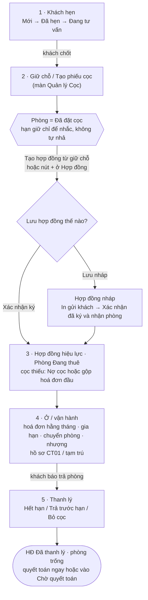
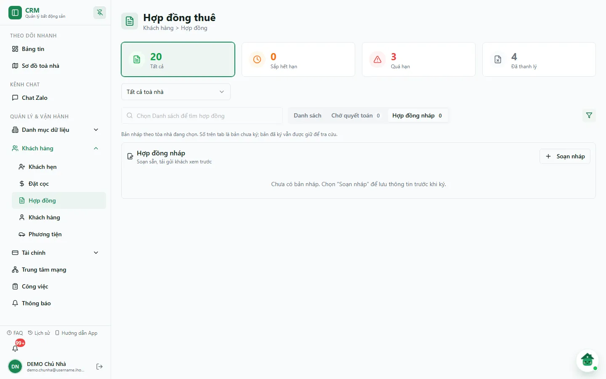

# Quy trình: Vòng đời khách thuê

Một khách trong ptcrm thường đi qua năm chặng: **Khách hẹn => Giữ chỗ / Đặt cọc => Ký hợp đồng => Ở => Thanh lý**. Trang này là bản đồ: mỗi chặng nói bạn làm gì, trạng thái phòng/hợp đồng đổi ra sao và trang chi tiết nào hướng dẫn thao tác. Phần tiền (cọc, hoá đơn, hoàn cọc) luôn phân biệt **đã duyệt** với **đã vào sổ quỹ**: chỉ phiếu ở trạng thái **Đã Thu/Đã Chi** (đã ghi sổ — `POSTED`) mới là tiền thật vào/ra quỹ.

::: info Điều kiện tiên quyết
- Đã dựng xong dữ liệu nền cho toà nhà: toà, tầng/phòng, dịch vụ, công tơ, sổ quỹ. Nếu chưa, xem [Khởi tạo dữ liệu — thứ tự chuẩn](/01-bat-dau/khoi-tao-du-lieu/).
- Tài khoản có quyền phù hợp từng chặng: `leads` (Khách hẹn), `deposits` (Đặt cọc: `create`, `convert`, `edit`, `delete`, `refund`), `contracts` (`create`, `renew`, `transfer`, `terminate`…), `customers` (hồ sơ khách, `print` cho CT01/tạm trú). Nhân viên chỉ thấy lead, cọc, hợp đồng của toà được gán phạm vi; hồ sơ khách (`customers.view`) đọc theo toàn tổ chức.
- Nắm sơ giao diện và menu bên trái — xem [Làm quen giao diện](/01-bat-dau/lam-quen-giao-dien/).
:::

## Bản đồ vòng đời

```mermaid
flowchart TD
  L["1 · Khách hẹn<br/>Mới → Đã hẹn → Đang tư vấn"] -->|"khách chốt"| C["2 · Giữ chỗ / Tạo phiếu cọc<br/>(màn Quản lý Cọc)"]
  C --> R{{"Phòng = Đã đặt cọc<br/>hạn giữ chỉ để nhắc, không tự nhả"}}
  R -->|"Tạo hợp đồng từ giữ chỗ<br/>hoặc nút + ở Hợp đồng"| K{"Lưu hợp đồng thế nào?"}
  K -->|"Lưu nháp"| D["Hợp đồng nháp<br/>In gửi khách → Xác nhận đã ký và nhận phòng"]
  K -->|"Xác nhận ký"| A["3 · Hợp đồng hiệu lực · Phòng Đang thuê<br/>cọc thiếu: Nợ cọc hoặc gộp hoá đơn đầu"]
  D --> A
  A --> O["4 · Ở / vận hành<br/>hoá đơn hằng tháng · gia hạn · chuyển phòng · nhượng<br/>hồ sơ CT01 / tạm trú"]
  O -->|"khách báo trả phòng"| T["5 · Thanh lý<br/>Hết hạn / Trả trước hạn / Bỏ cọc"]
  T --> E(["HĐ Đã thanh lý · phòng trống<br/>quyết toán ngay hoặc vào Chờ quyết toán"])
```

## Hướng dẫn từng bước

**Bước 1**: **Khách hẹn.** Vào **Khách hàng => Khách hẹn**, bấm **Tạo khách hẹn** để nhập khách tiềm năng, rồi đẩy thẻ qua các cột **Mới => Đã hẹn => Đang tư vấn** bằng **Sửa** => đổi ô **Trạng thái** (bảng Kanban không kéo-thả). Khách hẹn chỉ là dữ liệu sale, chưa giữ phòng và chưa ghi tiền. Chi tiết: [Khách hẹn](/03-quan-ly-van-hanh/khach-hen/).

::: warning Nút "Cọc" trên thẻ lead là luồng cũ
Nút **Cọc** trên thẻ lead mở hộp **Chuyển sang Đặt cọc** — luồng legacy ghi qua nhiều bước rời, không tạo hồ sơ giữ chỗ chính thức và không khoá phòng cho đúng khách. Với tiền thật, tạo cọc ở màn **Đặt cọc** (Bước 2), xác minh xong rồi mới quay lại lead đổi **Trạng thái** sang **Đã chuyển đổi**.
:::

**Bước 2**: **Giữ chỗ / Đặt cọc.** Vào **Khách hàng => Đặt cọc** (màn **Quản lý Cọc**; địa chỉ cũ `/reservations` tự chuyển về `/deposits`). Bấm **Tạo đặt cọc** để mở hộp **Giữ chỗ / Tạo phiếu cọc**: chọn **Khách hàng** (trong danh bạ, hoặc gõ tên khách gợi nhớ), **Căn hộ**, **Số tiền cọc** (phải lớn hơn 0), **Ngày đặt cọc**, **Giữ phòng đến** (hạn phải làm hợp đồng), **Sổ quỹ ghi cọc** và hạn bổ sung nếu cọc chưa đủ; bấm **Tạo cọc & giữ chỗ**. Giữ chỗ và phiếu cọc được ghi trong cùng một lần ở máy chủ, phòng chuyển **Đã đặt cọc**. Nếu mới nhập tên gợi nhớ, phải bấm **Gắn khách** ở hồ sơ giữ chỗ trước khi ký hợp đồng. Muốn giữ phòng ngắn hạn mà chưa thu tiền thì dùng **Lock tạm** ở danh sách phòng trống. Chi tiết: [Đặt cọc giữ chỗ](/03-quan-ly-van-hanh/dat-coc/).

::: danger Tạo phiếu cọc chưa phải là tiền đã vào quỹ
Phiếu cọc **chờ duyệt** chưa được tính là đã nhận. Đọc thông báo sau khi lưu ("đã xác nhận khoản cọc đã thu" hay "Chưa xác nhận tiền vào quỹ"); chỉ phiếu đã ghi sổ (**POSTED**) đúng sổ quỹ mới chứng minh tiền đã vào. Nếu một bước phụ (kỳ hạn, thưởng Sale) báo chưa xong, mở hồ sơ đã tạo để bổ sung — **không tạo lại cọc**.
:::

::: warning Hạn giữ phòng chỉ để nhắc
**Giữ phòng đến** và **Hạn bổ sung cho đủ** chỉ đưa hồ sơ vào các nhóm quá hạn ở chế độ **Cần xử lý**. Hệ thống **không** tự huỷ giữ chỗ, không tự nhả phòng, không tự tịch thu cọc. Bạn tự chọn **Điều chỉnh hạn**, **Bổ sung cọc**, **Hủy giữ chỗ** (chưa nhận tiền) hoặc **Xử lý bỏ cọc** (đã nhận tiền, khách không ký).
:::

**Bước 3**: **Ký hợp đồng.** Có hai lối vào: nút **Tạo hợp đồng** ở nhóm **GIỮ CHỖ SẴN SÀNG KÝ HĐ** của màn Đặt cọc (form mở sẵn toà/phòng, cọc đã nhận được chuyển sang đúng hợp đồng), hoặc nút **+** ở **Khách hàng => Hợp đồng**. Điền **Thông tin chung**, **Khách hàng** (đánh dấu khách đại diện), **Tiền thuê & Tiền cọc**, dịch vụ và xem trước hoá đơn cọc + tháng đầu. Bấm **Lưu** — hộp **Bạn muốn lưu hợp đồng thế nào?** hỏi:

- **Lưu nháp** — chưa giữ phòng, chưa ghi tiền; bản nháp vào tab **Hợp đồng nháp** để sửa, **In** gửi khách xem trước.
- **Xác nhận ký** — tạo hợp đồng chính thức, ghi phiếu cọc các lần cọc đã nhập và lập hoá đơn tháng đầu. Hợp đồng **Đang hiệu lực**, phòng **Đang thuê**.

Ký từ bản nháp: ở tab **Hợp đồng nháp**, bấm **Xác nhận đã ký** trên bản nháp đã in. Hộp **Xác nhận đã ký và nhận phòng** yêu cầu **Ngày nhận phòng thực tế**, hai ô tích xác nhận (khách ký đúng phiên bản đã xuất; phòng đã bàn giao), **Chỉ số điện/nước khi bàn giao** (số đã kiểm tra trên đồng hồ và thời điểm đo) và nguồn giữ chỗ/cọc của khách. Chi tiết: [Hợp đồng — danh sách, nháp & ký mới](/03-quan-ly-van-hanh/hop-dong/).

::: warning Cọc còn thiếu khi ký phải chọn cách xử lý
Nếu số cọc đã đặt chưa bằng **Tiền cọc**, form hiện khung đỏ "Khách chưa đóng đủ cọc — còn thiếu …" và bắt chọn: **Đóng đủ trong hoá đơn** (gộp phần thiếu vào hoá đơn tháng đầu, khi thu tự tách phần cọc ra khỏi doanh thu) hoặc **Nợ cọc** (nhập **Lý do cho nợ cọc** và **Hẹn bổ sung cọc**). Ký từ nháp có hai lựa chọn tương ứng: **Theo dõi nợ cọc, bổ sung sau** hoặc **Gộp cọc vào hoá đơn đầu để thu sau**.
:::

::: danger Ký hợp đồng là thao tác ghi tiền
**Xác nhận ký** ghi phiếu cọc vào đúng sổ quỹ bạn chọn, gắn phiếu cọc giữ chỗ của phòng và lập hoá đơn tháng đầu. Sau khi lưu, mở [Trang chi tiết hợp đồng](/03-quan-ly-van-hanh/hop-dong-chi-tiet/) kiểm khối **Tài chính** (nhóm Tiền cọc và Hoá đơn). Số **Đã thu** của cọc cộng từ phiếu cọc đã duyệt gắn hợp đồng — không sửa tay; đối soát tiền thật vẫn phải kiểm **POSTED**.
:::

**Bước 4**: **Ở — vận hành.** Mỗi tháng phòng đi qua chu kỳ ghi chỉ số, lập hoá đơn và thu tiền — xem [Quy trình: Chu kỳ thu tiền hàng tháng](/01-bat-dau/quy-trinh-thu-tien/). Trong lúc khách ở:

- **Gia hạn** (dời ngày kết thúc, có thể đổi giá/cọc), **Chuyển phòng** (sang phòng **Trống**, phòng cũ về Trống) — cả hai **giữ nguyên hợp đồng đang hiệu lực** và ghi dòng **GIA HẠN** / **CHUYỂN PHÒNG** vào **Lịch sử hợp đồng**.
- **Nhượng HĐ** — **không** sửa hợp đồng cũ: khách cũ thanh lý như bình thường (chọn **Trả phòng, quyết toán sau**), khách mới ký hợp đồng mới từ nháp, hai bên nối bằng **liên kết nhượng**. Hệ thống chưa hỗ trợ chuyển cọc giữa hai hợp đồng; khách mới nộp cọc mới độc lập.

Chi tiết: [Gia hạn, chuyển phòng & nhượng hợp đồng](/03-quan-ly-van-hanh/gia-han-chuyen-phong/). Hồ sơ người ở xem tại [Cư dân](/03-quan-ly-van-hanh/cu-dan/); khai báo cư trú bằng [Hồ sơ CT01](/03-quan-ly-van-hanh/ho-so-ct01/) và [Đăng ký tạm trú trên Cổng DVC](/03-quan-ly-van-hanh/dang-ky-tam-tru-dvc/).

**Bước 5**: **Thanh lý.** Khi khách báo sẽ trả, bấm **Đăng ký chuyển đi** để ghi ngày dự kiến (hợp đồng vẫn đang ở, không ghi tiền). Khi khách bàn giao thực tế, bấm **Thanh lý**: nhập **Ngày khách thực tế trả phòng**, chọn **Loại thanh lý** (**Hết hạn hợp đồng** / **Trả phòng trước hạn** / **Bỏ cọc**), **Nội dung thanh lý** (bắt buộc) và chỉ số bàn giao (được chọn bổ sung sau), rồi chọn **Trả phòng, quyết toán sau** (hồ sơ vào tab **Chờ quyết toán**) hoặc **Tiếp tục quyết toán ngay**. Toàn bộ chặng này xem [Quy trình: Thanh lý hợp đồng](/01-bat-dau/quy-trinh-thanh-ly/).

::: danger Quyết toán thanh lý ghi tiền và không hoàn tác
Quyết toán tạo hoá đơn thanh lý, quyết toán công nợ, chuyển cọc đã cấn thành doanh thu và lập phiếu chi trả khách phần dư (hoặc, với bỏ cọc, giữ cọc thực đóng làm doanh thu và huỷ nợ cũ). Phiếu chi **"Trả khách thanh lý"** sinh ra còn chờ duyệt và chưa có sổ quỹ — tiền chỉ ra khỏi quỹ khi đã chọn sổ, duyệt và ghi sổ (**Đã Chi**).
:::

## Các màn trong vòng đời

| Màn hình | Vai trò & trạng thái sinh ra |
| --- | --- |
| [Khách hẹn](/03-quan-ly-van-hanh/khach-hen/) | Phễu sale 5 cột **Mới / Đã hẹn / Đang tư vấn / Đã chuyển đổi / Thất bại**. Chưa đụng phòng, chưa ghi tiền. |
| [Đặt cọc giữ chỗ](/03-quan-ly-van-hanh/dat-coc/) | **Tạo đặt cọc** → giữ chỗ + phiếu cọc, phòng **Đã đặt cọc**; chế độ **Cần xử lý** (việc quá hạn, sẵn sàng ký) và **Sổ cọc đầy đủ** (4 tab); **Xử lý bỏ cọc** khi khách không ký. |
| [Hợp đồng](/03-quan-ly-van-hanh/hop-dong/) | Tab **Danh sách / Chờ quyết toán / Hợp đồng nháp**; ký mới, ký từ nháp; badge **Đủ cọc / Thiếu cọc**. |
| [Trang chi tiết hợp đồng](/03-quan-ly-van-hanh/hop-dong-chi-tiet/) | Toàn cảnh một hợp đồng; nút **Gia hạn / Chuyển phòng / Nhượng HĐ / Đăng ký chuyển đi / Thanh lý**; khối **Tài chính** gom cọc và hoá đơn. |
| [Gia hạn, chuyển phòng & nhượng](/03-quan-ly-van-hanh/gia-han-chuyen-phong/) | Biến động khi đang ở; gia hạn/chuyển phòng giữ hợp đồng hiệu lực, nhượng dùng liên kết hai hợp đồng. |
| [Cư dân](/03-quan-ly-van-hanh/cu-dan/) | Hồ sơ khách (`customers`), đọc CCCD, phương tiện, khối **Hồ sơ tạm trú**. |
| [Hồ sơ CT01](/03-quan-ly-van-hanh/ho-so-ct01/) · [Tạm trú DVC](/03-quan-ly-van-hanh/dang-ky-tam-tru-dvc/) | Tờ khai CT01, bộ CT01 + hợp đồng (Word), nộp đăng ký tạm trú trên Cổng DVC. |
| [Hoàn / bỏ cọc](/03-quan-ly-van-hanh/hoan-bo-coc/) | Đối chiếu cọc đã hoàn / đã bỏ; `/finance/refund-log` là **Sổ tiền thối / Sổ làm tròn**, không phải sổ hoàn cọc. |

## Tình huống & lỗi thường gặp

| Tình huống | Nguyên nhân & cách xử lý |
| --- | --- |
| Lead đã **Đã chuyển đổi** nhưng màn Đặt cọc không có giữ chỗ | Cọc được tạo bằng nút **Cọc** (luồng legacy) trên thẻ lead. Đối soát phiếu/khách/phòng trước; nếu cần giữ chỗ chính thức, tạo ở **Tạo đặt cọc** — không ghi tiền hai lần. |
| Giữ chỗ quá hạn mà phòng vẫn **Đã đặt cọc** | Đúng thiết kế: hạn chỉ để nhắc. Liên hệ khách rồi **Điều chỉnh hạn**, **Hủy giữ chỗ** (chưa nhận tiền) hoặc **Xử lý bỏ cọc** (đã nhận tiền). |
| Không chọn được phòng khi ký hợp đồng | Phòng đang có hợp đồng hiệu lực khác. Thanh lý hợp đồng cũ trước, hoặc chọn phòng khác. |
| Bấm **Lưu** bị chặn vì cọc | Cọc chưa đủ mà chưa chọn **Đóng đủ trong hoá đơn** hoặc **Nợ cọc** (nợ cọc cần lý do và ngày hẹn). |
| Nút **Xác nhận đã ký và nhận phòng** mờ | Chưa tích đủ hai xác nhận, chưa nhập chỉ số bàn giao đã kiểm tra, ngày nhận phòng không khớp tài liệu, hoặc nháp đã sửa sau lần in (phải **In** lại). |
| Hợp đồng hiện **Thiếu cọc** dù khách nói đã đóng | Số đã thu tính từ phiếu cọc **đã duyệt** gắn hợp đồng. Kiểm khối **Tài chính** ở trang chi tiết và màn Đặt cọc; không sửa tay con số. |
| Gia hạn xong không thấy hợp đồng "mới" | Đúng thiết kế: gia hạn giữ nguyên hợp đồng, chỉ dời ngày kết thúc; xem dòng **GIA HẠN** ở **Lịch sử hợp đồng**. |
| Muốn nhượng và cấn cọc cũ sang khách mới | Hệ thống chưa hỗ trợ chuyển cọc giữa hai hợp đồng. Khách cũ quyết toán cọc theo thanh lý, khách mới nộp cọc mới độc lập. |

## Thử trực tiếp trên sandbox

<SandboxTry account="demo.chunha" app-path="/leads" app-label="Mở màn Khách hẹn" fixtures="Snapshot 07/10/2026: Khách hẹn rỗng; Đặt cọc có 4 giữ chỗ ở nhóm GIỮ CHỖ SẴN SÀNG KÝ HĐ; Hợp đồng 20 bản ghi (3 quá hạn, 4 đã thanh lý), 0 nháp, 0 chờ quyết toán." view-only>

Đây là chế độ **chỉ xem** — đi theo chuỗi vòng đời và chỉ mở form rồi đóng:

1. **Khách hẹn:** màn đang rỗng (dòng **Chưa có khách hẹn nào**). Nhận diện 5 cột giai đoạn và nút **Tạo khách hẹn**.
2. **Đặt cọc:** mở [Đặt cọc giữ chỗ](/03-quan-ly-van-hanh/dat-coc/), đọc dải số liệu và nhóm **GIỮ CHỖ SẴN SÀNG KÝ HĐ · 4**. Bấm **Tạo đặt cọc** để xem hộp **Giữ chỗ / Tạo phiếu cọc**, rồi **Hủy**.
3. **Hợp đồng:** mở [Hợp đồng](/03-quan-ly-van-hanh/hop-dong/), chuyển qua ba tab **Danh sách / Chờ quyết toán / Hợp đồng nháp**. Bấm **+** để xem các phần của hộp **Tạo hợp đồng mới**, rồi **Hủy** — không bấm **Lưu**, **Lưu nháp** hay **Xác nhận ký**.

Kết quả mong đợi: bạn nắm chuỗi **Khách hẹn => Giữ chỗ/Cọc => Hợp đồng (nháp hoặc ký ngay)** và biết empty state của DEMO không phải lỗi.

:::tip
Trên sandbox cứ mở xem thoải mái — đây là dữ liệu demo, không ảnh hưởng số liệu thật.
:::

</SandboxTry>

## Quy trình liên quan

- [Khách hẹn](/03-quan-ly-van-hanh/khach-hen/) — chặng 1: phễu sale.
- [Đặt cọc giữ chỗ](/03-quan-ly-van-hanh/dat-coc/) — chặng 2: giữ chỗ, phiếu cọc, xử lý bỏ cọc giữ chỗ.
- [Hợp đồng](/03-quan-ly-van-hanh/hop-dong/) và [Trang chi tiết hợp đồng](/03-quan-ly-van-hanh/hop-dong-chi-tiet/) — chặng 3: ký mới, ký từ nháp, xem toàn cảnh.
- [Gia hạn, chuyển phòng & nhượng](/03-quan-ly-van-hanh/gia-han-chuyen-phong/) — chặng 4: biến động khi khách đang ở.
- [Cư dân](/03-quan-ly-van-hanh/cu-dan/) · [Hồ sơ CT01](/03-quan-ly-van-hanh/ho-so-ct01/) · [Đăng ký tạm trú trên Cổng DVC](/03-quan-ly-van-hanh/dang-ky-tam-tru-dvc/) — hồ sơ và cư trú của khách.
- [Quy trình: Chu kỳ thu tiền hàng tháng](/01-bat-dau/quy-trinh-thu-tien/) — việc lặp lại mỗi tháng khi khách ở.
- [Quy trình: Thanh lý hợp đồng](/01-bat-dau/quy-trinh-thanh-ly/) — chặng 5.
- [Khởi tạo dữ liệu — thứ tự chuẩn](/01-bat-dau/khoi-tao-du-lieu/) — dựng dữ liệu nền trước khi chạy vòng đời này.
