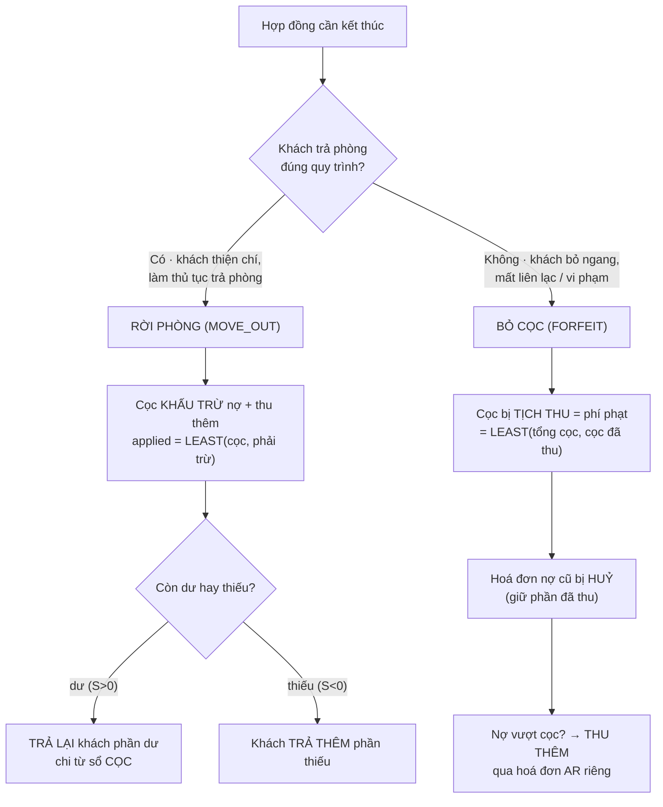

# Quy trình: Thanh lý hợp đồng (2 kịch bản)

Khi một hợp đồng kết thúc — dù đúng hạn, trước hạn hay khách bỏ ngang — bạn không chỉ "đóng hợp đồng" là xong. Hệ thống phải xử lý ba thứ cùng lúc: **tiền cọc đang giữ hộ khách**, **các hoá đơn còn nợ**, và **những khoản thu vét cuối kỳ** (tiền phòng lẻ ngày, điện chốt số, vệ sinh). ptcrm gói toàn bộ việc đó vào **hai kịch bản thanh lý** với **hai dòng tiền khác hẳn nhau**. Trang này giúp bạn — quản lý toà hoặc kế toán — chọn đúng kịch bản và hiểu tiền đi đâu, trước khi bấm nút thật ở [Thanh lý (rời phòng)](/03-quan-ly-van-hanh/thanh-ly-move-out/) hoặc [Thanh lý (bỏ cọc)](/03-quan-ly-van-hanh/thanh-ly-forfeit/).

::: info Điều kiện tiên quyết
- Hợp đồng đang **còn hiệu lực** (ACTIVE) — chưa từng thanh lý. Đã thanh lý rồi thì không mở lại được.
- Bạn có **quyền chỉnh sửa hợp đồng** trên toà nhà chứa phòng đó. Không có quyền, nút thanh lý sẽ bị ẩn/khoá.
- **Tiền cọc phải đang nằm đúng sổ** — hệ thống giữ cọc ở sổ **CỌC (giữ hộ khách)**. Nếu cọc gốc lỡ ghi vào một sổ tiền mặt thật, các bút toán rút cọc có thể làm sổ đó âm. Kiểm tra ở [Đặt cọc](/03-quan-ly-van-hanh/dat-coc/) / [Hoàn & bỏ cọc](/03-quan-ly-van-hanh/hoan-bo-coc/).
- Nếu định **chốt điện cuối kỳ**, nắm được **số điện mới nhất** của phòng (xem [Ghi chỉ số](/03-quan-ly-van-hanh/ghi-chi-so/)).
- Đã nắm khái niệm **KQKD** (kết quả kinh doanh): cọc **không** phải doanh thu, chỉ phần **ghi nhận doanh thu** mới vào KQKD.
:::

Trước khi vào từng bước, hãy nhìn bức tranh lớn: chọn kịch bản nào phụ thuộc **khách có hợp tác trả phòng hay bỏ ngang**, và hai nhánh đó tạo ra **hai dòng tiền cọc ngược chiều nhau**.



## Hướng dẫn từng bước

Cả hai kịch bản đi chung 3 bước đầu (mở hợp đồng, chọn hình thức, nhập ngày & thu thêm), rồi rẽ nhánh ở bước xác nhận. Làm theo đúng thứ tự.

**Bước 1**: **Mở hợp đồng cần thanh lý.** Vào menu **Hợp đồng** (`/contracts`), tìm đúng hợp đồng theo phòng/khách, bấm mở **chi tiết hợp đồng**, rồi bấm **Thanh lý hợp đồng**. Thao tác thật của mỗi kịch bản nằm ở [Hợp đồng](/03-quan-ly-van-hanh/hop-dong/) và [Chi tiết hợp đồng](/03-quan-ly-van-hanh/hop-dong-chi-tiet/).

**Bước 2**: **Chọn hình thức thanh lý (bước 1 của hộp thoại).** Hộp thoại hỏi hai lựa chọn: **Khách rời phòng** (khách trả phòng đúng quy trình) hay **Khách bỏ cọc** (khách bỏ ngang). Đây là quyết định **quan trọng nhất** — nó định đoạt cả dòng tiền cọc lẫn cách xử lý hoá đơn nợ (xem bảng so sánh bên dưới). Chọn sai phải huỷ và làm lại.

::: warning Thanh lý là thao tác khó hoàn tác
Bấm xác nhận thanh lý sẽ **đóng hợp đồng** (chuyển sang TERMINATED), **giải phóng phòng** (phòng về trạng thái trống), và **đóng/tất toán các hoá đơn** liên quan. Không có nút "hoàn tác thanh lý" — muốn sửa phải nhờ kỹ thuật can thiệp thủ công. Hãy chắc chắn **đúng hợp đồng, đúng ngày, đúng kịch bản** trước khi xác nhận.
:::

**Bước 3**: **Nhập ngày thanh lý và khai khu "Thu thêm" (bước 2 của hộp thoại).** Chọn **ngày thanh lý / ngày rời phòng** (mặc định hôm nay). Khu **Thu thêm** dùng để vét các khoản cuối kỳ, có sẵn các dòng:
- **Tiền phòng + Nước + PDV** theo số ngày ở lẻ (từ đầu kỳ đến ngày trả phòng, chia theo tỷ lệ /30).
- **Tiền điện** chốt cuối kỳ: số điện đầu tự lấy từ chỉ số mới nhất, **số cuối bạn nhập tay**, nhân đơn giá điện. Khoản này đồng thời **chốt luôn số điện** vào lịch sử công tơ (bản ghi mã `TLY`, đã duyệt).
- **Tiền vệ sinh** (mặc định 200.000đ) và các **khoản tuỳ ý** (bấm **Thêm khoản**).

::: danger Chốt điện khi thanh lý là ghi số công tơ thật
Nhập **số điện cuối** ở khu Thu thêm sẽ ghi một bản ghi chỉ số công tơ **đã duyệt** cho phòng — đây là số chốt cuối cùng của hợp đồng. Nhập sai số sẽ vừa tính sai tiền điện vừa để lại chỉ số sai trong lịch sử. Đối chiếu **số cuối ≥ số đầu** và đúng đơn giá trước khi xác nhận. Xem thêm [Ghi chỉ số](/03-quan-ly-van-hanh/ghi-chi-so/).
:::

**Bước 4a — nếu chọn RỜI PHÒNG**: **Kiểm tra quyết toán ròng rồi xác nhận.** Hộp thoại đã tính sẵn: **nguồn bù = cọc hoàn lại + tiền dư** (credit của khách), **khoản phải trừ = nợ + thu thêm**. Kết quả **quyết toán ròng S**:
- **S > 0** → chủ **trả lại khách** phần dư (chi từ sổ CỌC).
- **S < 0** → **khách trả thêm** phần thiếu.
- **S = 0** → huề, không phát sinh tiền.

Bấm xác nhận: **mọi bút toán được duyệt ngay** trong một lần — cọc cấn vào nợ chuyển thành doanh thu, hoá đơn nợ cũ được đánh **đã thanh toán** (gạch nợ, không huỷ), hoá đơn thanh lý về **PAID**. Không cần bước duyệt sau.

**Bước 4b — nếu chọn BỎ CỌC**: **Xác nhận, rồi vào Sổ thu chi bấm Duyệt.** Khi xác nhận, hệ thống: tính **phí phạt = cọc thực thu** (`LEAST(tổng cọc, cọc đã thu)`), **huỷ toàn bộ hoá đơn còn nợ** (giữ lại phần khách đã trả, xoá phần nợ), tạo **hoá đơn thanh lý** ghi khoản phí phạt, và **một cặp phiếu chuyển cọc → doanh thu ở trạng thái CHỜ DUYỆT**. Nếu có **thu thêm**, hệ thống tạo thêm một **hoá đơn AR riêng chờ thu tiền khách**.

::: danger Bỏ cọc chưa xong khi chưa bấm Duyệt
Với kịch bản **bỏ cọc**, cọc **chưa** thành doanh thu ngay. Bạn phải vào [Thu chi](/03-quan-ly-van-hanh/thu-chi/), tìm cặp phiếu nhãn **[CẤN CỌC BỎ CỌC …]** và **bấm Duyệt** (duyệt một phiếu là hệ thống tự duyệt nốt phiếu còn lại). Chỉ khi đó **doanh thu bỏ cọc mới vào KQKD** và **hoá đơn thanh lý mới về PAID**. Quên bước này = báo cáo thiếu doanh thu, hoá đơn treo chưa thu.
:::

**Bước 5**: **Kiểm tra kết quả.** Sau khi xong, xác nhận: hợp đồng đã **TERMINATED**, **phòng đã trống** (sẵn sàng cho khách mới), hoá đơn nợ đã đóng đúng cách (rời phòng: **PAID**; bỏ cọc: **CANCELLED**), và **doanh thu thanh lý** đã lên báo cáo. Nếu tạo hoá đơn AR thu thêm (bỏ cọc), khoản đó nằm chờ ở danh sách hoá đơn để thu sau như hoá đơn thường.

## So sánh hai kịch bản (dòng tiền)

Đây là phần cốt lõi của trang — hai kịch bản xử lý **cọc, hoá đơn nợ, thu thêm** theo hai cách ngược nhau:

| Tiêu chí | **RỜI PHÒNG** (khách trả phòng) | **BỎ CỌC** (khách bỏ ngang) |
| --- | --- | --- |
| **Số phận tiền cọc** | **Khấu trừ** vào nợ + thu thêm; phần dư **trả lại khách** | **Tịch thu** toàn bộ cọc thực thu làm **phí phạt** (doanh thu) |
| **Hoá đơn nợ cũ** | **Gạch nợ → PAID** (đánh đã thanh toán, **không huỷ**) | **HUỶ** (giữ phần đã thu, xoá phần nợ chưa thu) |
| **Nợ vượt quá cọc** | Khách **trả thêm** phần thiếu (S < 0) ngay trong quyết toán | Không tự thu; muốn đòi phải dùng **Thu thêm → hoá đơn AR riêng** |
| **Cọc còn dư sau khấu trừ** | **Trả lại khách** phần dư (S > 0), chi từ sổ CỌC | Không có khái niệm "trả lại" — cọc đã tịch thu hết |
| **Khoản Thu thêm** | **Gộp** vào hoá đơn thanh lý, **cấn vào cọc** | Tách ra **hoá đơn AR riêng chờ thu** (không cấn cọc) |
| **Doanh thu vào KQKD** | Phần cọc đã cấn (+ tiền khách trả thêm nếu có) | Bằng **cọc bị tịch thu** (phí phạt) |
| **Số bước** | **1 bước** — mọi phiếu duyệt ngay | **2 bước** — phiếu **chờ duyệt**, phải bấm **Duyệt** |
| **Chọn khi nào** | Khách hợp tác, làm thủ tục trả phòng tử tế | Khách bỏ ngang, mất liên lạc, vi phạm hợp đồng |

**Công thức quyết toán kịch bản RỜI PHÒNG** (hộp thoại tự tính, bạn chỉ cần đọc kết quả):

```text
Khoản phải trừ  = Nợ còn lại + Thu thêm
Nguồn bù        = Cọc hoàn lại + Tiền dư (credit của khách)
Cấn vào doanh thu = phần nhỏ hơn của (Nguồn bù, Khoản phải trừ)
Quyết toán ròng S = Nguồn bù − Khoản phải trừ
    S > 0  → trả lại khách S       (chi sổ CỌC)
    S < 0  → khách trả thêm |S|    (thu vào sổ vận hành, vào KQKD)
    S = 0  → huề
```

**Ba ví dụ minh hoạ (RỜI PHÒNG, cọc 4.000.000đ):**

| Tình huống | Nợ | Thu thêm | Cấn cọc | Quyết toán ròng |
| --- | --- | --- | --- | --- |
| Không nợ, không thu thêm | 0đ | 0đ | 0đ | **Trả lại khách 4.000.000đ** |
| Nợ 1.000.000đ + điện 500.000đ | 1.000.000đ | 500.000đ | 1.500.000đ | **Trả lại khách 2.500.000đ** |
| Nợ 5.000.000đ (vượt cọc) | 5.000.000đ | 0đ | 4.000.000đ | **Khách trả thêm 1.000.000đ** |

**Kịch bản BỎ CỌC** đơn giản hơn về cọc nhưng ngược chiều: cọc thực thu (ví dụ 4.000.000đ) **thành doanh thu phí phạt**, hoá đơn nợ quá hạn bị **huỷ** (không đòi phần nợ qua cọc). Nếu chủ vẫn muốn đòi phần nợ/khoản vét, khai ở **Thu thêm** — hệ thống lập **hoá đơn AR riêng** để thu tiền khách sau, tách bạch khỏi khoản cọc đã tịch thu.

::: tip Nguyên tắc chung của cả hai kịch bản
Dù chọn kịch bản nào: **tiền cọc luôn đi qua sổ CỌC và nằm NGOÀI KQKD**; chỉ phần **ghi nhận doanh thu** (cọc đã cấn / phí phạt / khách trả thêm) mới vào sổ vận hành của toà và **vào KQKD**. Nhờ vậy cọc không bao giờ bị nhầm thành doanh thu, và số liệu phân bổ lợi nhuận cho cổ đông chuẩn xác — xem [Chia lợi nhuận](/03-quan-ly-van-hanh/chia-loi-nhuan/).
:::

## Các tính năng khác trên màn hình

Hộp thoại thanh lý và các màn liên quan còn có những khối sau:

| Khối / màn hình | Vai trò |
| --- | --- |
| **Khu "Thu thêm"** (bước 2 hộp thoại) | Vét khoản cuối kỳ: tiền phòng lẻ ngày, **điện chốt số**, vệ sinh, khoản tuỳ ý. Có ở **cả hai** kịch bản. |
| **Ngày thanh lý / rời phòng** | Mốc đóng hợp đồng (`actual_end_date`) và mốc tính prorate ngày ở lẻ. |
| [Thanh lý (rời phòng)](/03-quan-ly-van-hanh/thanh-ly-move-out/) | Màn thao tác thật kịch bản RỜI PHÒNG — quyết toán ròng, hoàn cọc dư. |
| [Thanh lý (bỏ cọc)](/03-quan-ly-van-hanh/thanh-ly-forfeit/) | Màn thao tác thật kịch bản BỎ CỌC — tịch thu cọc, cặp phiếu chờ duyệt. |
| [Thu chi](/03-quan-ly-van-hanh/thu-chi/) | Nơi **bấm Duyệt** cặp phiếu cấn cọc của kịch bản bỏ cọc. |
| [Hoàn & bỏ cọc](/03-quan-ly-van-hanh/hoan-bo-coc/) | Theo dõi cọc còn giữ, đã hoàn, đã tịch thu theo từng hợp đồng. |
| [Ghi chỉ số](/03-quan-ly-van-hanh/ghi-chi-so/) | Xem/đối chiếu số điện đã chốt khi thanh lý (bản ghi mã `TLY`). |

## Tình huống & lỗi thường gặp

| Tình huống | Nguyên nhân & cách xử lý |
| --- | --- |
| Đã thanh lý bỏ cọc nhưng **doanh thu không lên báo cáo** | Chưa **bấm Duyệt** cặp phiếu **[CẤN CỌC BỎ CỌC …]** ở [Thu chi](/03-quan-ly-van-hanh/thu-chi/). Duyệt một phiếu là hệ thống duyệt nốt phiếu kia và hoá đơn thanh lý về PAID. |
| Không thấy nút **Thanh lý hợp đồng** | Bạn thiếu **quyền chỉnh sửa hợp đồng** trên toà đó, hoặc hợp đồng **không còn ACTIVE** (đã thanh lý/hết hạn). |
| **Sổ tiền mặt bị âm** sau khi hoàn cọc | Cọc gốc lỡ ghi vào **sổ tiền mặt thật** thay vì sổ CỌC — bút toán chi cọc rút từ sổ đó làm âm. Kiểm tra cọc đang ở đúng sổ CỌC trước khi thanh lý. |
| Kịch bản bỏ cọc **không đòi được phần nợ vượt cọc** | Đúng thiết kế: bỏ cọc chỉ tịch thu cọc, **huỷ** phần nợ. Muốn đòi thì khai ở **Thu thêm** để sinh **hoá đơn AR riêng** thu sau. |
| Chọn nhầm kịch bản | Không sửa được sau khi xác nhận. Nếu **chưa** bấm xác nhận, quay lại bước 1 hộp thoại đổi lựa chọn; nếu đã xác nhận, nhờ kỹ thuật can thiệp. |
| Tiền điện chốt **không khớp** | Số điện đầu lấy từ chỉ số đã duyệt gần nhất, **số cuối bạn tự nhập** — nhập nhầm sẽ sai tiền và ghi sai chỉ số vào lịch sử. Đối chiếu lại ở [Ghi chỉ số](/03-quan-ly-van-hanh/ghi-chi-so/). |
| Báo cáo thanh lý **thiếu ca rời phòng** | Kịch bản RỜI PHÒNG có thể không để lại bản ghi audit khi có hoàn tiền cho khách; báo cáo suy trạng thái từ hợp đồng (đã TERMINATED + ngày rời phòng). Không phải lỗi dữ liệu tiền. |

## Thử trực tiếp trên sandbox

<SandboxTry account="demo.quanly" app-path="/contracts" app-label="Mở danh sách Hợp đồng" fixtures="Tòa DEMO A. HĐ A202 (Bùi Thị Hoa, ACTIVE, cọc đủ 4.000.000đ, không nợ) — dùng thử RỜI PHÒNG trả cọc. HĐ A203 (Ngô Văn Ích, ACTIVE, còn 1 hoá đơn quá hạn 4.570.000đ) — dùng thử BỎ CỌC giữ cọc trừ nợ." view-only>

Đây là chế độ **chỉ xem** — mục tiêu là **so sánh hai dòng tiền** của hai hợp đồng thật trên sandbox, **không** bấm nút xác nhận cuối cùng. Cứ mở hộp thoại thanh lý để **đọc phần quyết toán** hệ thống tính sẵn, rồi thoát ra.

1. **Mở HĐ A202 (Bùi Thị Hoa) — kịch bản RỜI PHÒNG.** Vào chi tiết hợp đồng, bấm **Thanh lý hợp đồng**, chọn **Khách rời phòng**. Vì cọc đủ **4.000.000đ** và **không nợ**, hãy để ý phần quyết toán: **nguồn bù 4.000.000đ − khoản phải trừ 0đ = trả lại khách 4.000.000đ**. Đây là dòng tiền "cọc dư trả khách". Thoát ra, **không** xác nhận.
2. **Mở HĐ A203 (Ngô Văn Ích) — kịch bản BỎ CỌC.** Lần này chọn **Khách bỏ cọc**. Để ý: **hoá đơn quá hạn 4.570.000đ sẽ bị HUỶ** (không đòi qua cọc), còn **cọc bị tịch thu thành doanh thu phí phạt**. Đây là dòng tiền ngược hẳn với A202 — không trả khách đồng nào, cọc thành doanh thu. Thoát ra, **không** xác nhận.
3. **So chiếu hai bảng quyết toán:** với A202, cọc **quay về túi khách**; với A203, cọc **ở lại thành doanh thu** và nợ bị xoá. Cùng một số cọc, hai số phận trái ngược — đó chính là điểm khác biệt cốt lõi của trang này.
4. **Ngó phần "Thu thêm"** ở cả hai: thử nhập một khoản (ví dụ vệ sinh **1.000.000đ**) để thấy A202 **gộp** khoản đó vào hoá đơn thanh lý (cấn cọc), còn A203 **tách** thành hoá đơn AR riêng chờ thu. Đừng xác nhận — chỉ quan sát.

Kết quả mong đợi: bạn phân biệt rõ **khi nào chọn RỜI PHÒNG** (khách hợp tác, cần khấu trừ/hoàn cọc) và **khi nào chọn BỎ CỌC** (khách bỏ ngang, tịch thu cọc), và thấy tận mắt hai dòng tiền cọc đi ngược chiều nhau.

:::tip
Dữ liệu sandbox là demo, không ảnh hưởng số liệu thật — nhưng ở đây bạn **chỉ xem**, đừng bấm xác nhận thanh lý để giữ hai hợp đồng nguyên vẹn cho người thử sau. Muốn thao tác ghi thật, dùng tài khoản và toà của bạn.
:::

</SandboxTry>

## Quy trình liên quan

- [Thanh lý (rời phòng)](/03-quan-ly-van-hanh/thanh-ly-move-out/) — màn thao tác thật kịch bản khách trả phòng: quyết toán ròng, hoàn cọc dư, thu thêm gộp hoá đơn.
- [Thanh lý (bỏ cọc)](/03-quan-ly-van-hanh/thanh-ly-forfeit/) — màn thao tác thật kịch bản khách bỏ ngang: tịch thu cọc, cặp phiếu chờ duyệt, hoá đơn AR thu thêm.
- [Ghi chỉ số](/03-quan-ly-van-hanh/ghi-chi-so/) — chốt điện nước cuối kỳ; đối chiếu chỉ số công tơ ghi khi thanh lý.
- [Thu chi](/03-quan-ly-van-hanh/thu-chi/) — nơi bấm Duyệt cặp phiếu cấn cọc của kịch bản bỏ cọc.
- [Hoàn & bỏ cọc](/03-quan-ly-van-hanh/hoan-bo-coc/) — theo dõi cọc còn giữ / đã hoàn / đã tịch thu theo hợp đồng.
- [Đặt cọc](/03-quan-ly-van-hanh/dat-coc/) — nguồn của tiền cọc mà thanh lý đem khấu trừ hoặc tịch thu.
- [Chi tiết hợp đồng](/03-quan-ly-van-hanh/hop-dong-chi-tiet/) — nơi mở nút Thanh lý hợp đồng.
- [Chia lợi nhuận](/03-quan-ly-van-hanh/chia-loi-nhuan/) — doanh thu thanh lý vào KQKD sẽ chảy tới phân bổ lợi nhuận cổ đông.
- [Quy trình: Vòng đời khách thuê](/01-bat-dau/quy-trinh-khach-thue/) — bức tranh lớn: khách đi từ hẹn xem đến thanh lý.
- [Quy trình: Chốt tháng](/01-bat-dau/quy-trinh-chot-thang/) — chặng sau: khoá sổ kỳ đã có doanh thu thanh lý.
