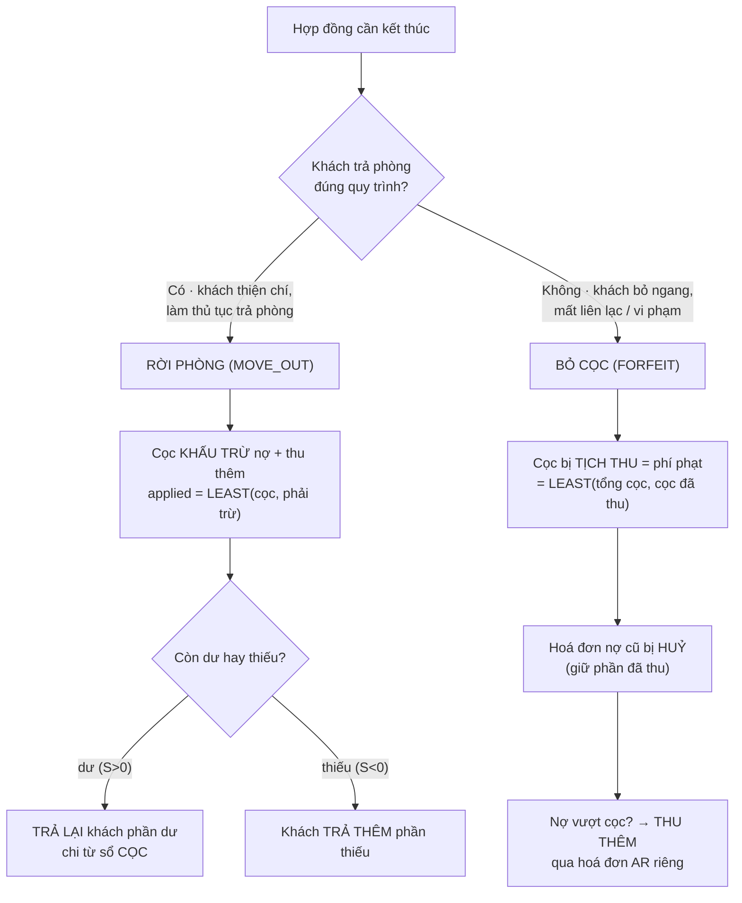

# Quy trình: Thanh lý hợp đồng (2 kịch bản)

Khi một hợp đồng kết thúc — dù đúng hạn, trước hạn hay khách bỏ ngang — bạn không chỉ "đóng hợp đồng" là xong. Hệ thống phải xử lý **tiền cọc**, **hoá đơn còn nợ** và **các khoản cuối kỳ**. ptcrm có hai kịch bản thanh lý, nhưng UI hiện gửi số công nợ preview lên server, hồ sơ thanh lý có thể ghi thất bại mà hợp đồng vẫn đóng, và tồn tại hai đường tạo phiếu hoàn cọc. Vì vậy không được coi một toast thành công là bằng chứng đã tất toán đầy đủ.

::: info Điều kiện tiên quyết
- Hợp đồng đang **còn hiệu lực** (ACTIVE) — chưa từng thanh lý. Đã thanh lý rồi thì không mở lại được.
- Bạn có quyền `contracts.terminate` trên toà nhà chứa phòng đó. `contracts.edit` không thay thế quyền thanh lý.
- **Tiền cọc phải đang nằm đúng sổ** — hệ thống giữ cọc ở sổ **CỌC (giữ hộ khách)**. Nếu cọc gốc lỡ ghi vào một sổ tiền mặt thật, các bút toán rút cọc có thể làm sổ đó âm. Kiểm tra ở [Đặt cọc](/03-quan-ly-van-hanh/dat-coc/) / [Hoàn & bỏ cọc](/03-quan-ly-van-hanh/hoan-bo-coc/).
- Nếu định **chốt điện cuối kỳ**, nắm được **số điện mới nhất** của phòng (xem [Ghi chỉ số](/03-quan-ly-van-hanh/ghi-chi-so/)).
- Đã nắm khái niệm **KQKD** (kết quả kinh doanh): cọc **không** phải doanh thu, chỉ phần **ghi nhận doanh thu** mới vào KQKD.
:::

::: danger Hậu kiểm bắt buộc sau mọi lần thanh lý
Chỉ kết thúc nghiệp vụ khi đã đối chiếu đủ: (1) hợp đồng `TERMINATED`; (2) phòng về đúng trạng thái; (3) mọi hoá đơn active và payment/reversal liên quan; (4) phiếu cọc, phiếu hoàn/thu thêm và posting đúng sổ; (5) có dòng hồ sơ thanh lý trong lịch sử/tab Hoàn-Bỏ cọc. Nếu hợp đồng đã đóng nhưng thiếu hồ sơ hoặc phiếu tiền không có nguồn cha, dừng mọi lần hoàn tiếp theo và báo ngoại lệ — production đã có các ca như vậy.
:::

Trước khi vào từng bước, hãy nhìn bức tranh lớn: chọn kịch bản nào phụ thuộc **khách có hợp tác trả phòng hay bỏ ngang**, và hai nhánh đó tạo ra **hai dòng tiền cọc ngược chiều nhau**.



## Hướng dẫn từng bước

Cả hai kịch bản đi chung 3 bước đầu (mở hợp đồng, chọn hình thức, nhập ngày & thu thêm), rồi rẽ nhánh ở bước xác nhận. Làm theo đúng thứ tự.

**Bước 1**: **Mở hợp đồng cần thanh lý.** Vào menu **Hợp đồng** (`/contracts`), tìm đúng hợp đồng theo phòng/khách, bấm mở **chi tiết hợp đồng**, rồi bấm **Thanh lý hợp đồng**. Thao tác thật của mỗi kịch bản nằm ở [Hợp đồng](/03-quan-ly-van-hanh/hop-dong/) và [Chi tiết hợp đồng](/03-quan-ly-van-hanh/hop-dong-chi-tiet/).

**Bước 2**: **Chọn hình thức thanh lý (bước 1 của hộp thoại).** Hộp thoại hỏi hai lựa chọn: **Khách rời phòng** (khách trả phòng đúng quy trình) hay **Khách bỏ cọc** (khách bỏ ngang). Đây là quyết định **quan trọng nhất** — nó định đoạt cả dòng tiền cọc lẫn cách xử lý hoá đơn nợ (xem bảng so sánh bên dưới). Chọn sai phải huỷ và làm lại.

::: warning Thanh lý là thao tác khó hoàn tác
Bấm xác nhận thanh lý sẽ **đóng hợp đồng** (chuyển sang TERMINATED), **giải phóng phòng** (phòng về trạng thái trống), và **đóng/tất toán các hoá đơn** liên quan. Không có nút "hoàn tác thanh lý" — muốn sửa phải nhờ kỹ thuật can thiệp thủ công. Hãy chắc chắn **đúng hợp đồng, đúng ngày, đúng kịch bản** trước khi xác nhận.
:::

**Bước 3**: **Chờ công nợ tải xong, nhập ngày thanh lý và khai khu "Thu thêm".** Nếu danh sách công nợ đang tải, báo lỗi hoặc bất ngờ rỗng, hãy đóng dialog và kiểm tra ở màn Hoá đơn; không tiếp tục với số 0. Khi dữ liệu đã ổn, chọn ngày thanh lý/rời phòng và nhập các khoản cuối kỳ:
- **Tiền phòng + Nước + PDV** theo số ngày ở lẻ (từ đầu kỳ đến ngày trả phòng, chia theo tỷ lệ /30).
- **Tiền điện** chốt cuối kỳ: số điện đầu tự lấy từ chỉ số mới nhất, **số cuối bạn nhập tay**, nhân đơn giá điện. Khoản này đồng thời **chốt luôn số điện** vào lịch sử công tơ (bản ghi mã `TLY`, đã duyệt).
- **Tiền vệ sinh** (mặc định 200.000đ) và các **khoản tuỳ ý** (bấm **Thêm khoản**).

::: danger Chốt điện khi thanh lý là ghi số công tơ thật
Nhập **số điện cuối** ở khu Thu thêm sẽ ghi một bản ghi chỉ số công tơ **đã duyệt** cho phòng — đây là số chốt cuối cùng của hợp đồng. Nhập sai số sẽ vừa tính sai tiền điện vừa để lại chỉ số sai trong lịch sử. Đối chiếu **số cuối ≥ số đầu** và đúng đơn giá trước khi xác nhận. Xem thêm [Ghi chỉ số](/03-quan-ly-van-hanh/ghi-chi-so/).
:::

**Bước 4a — nếu chọn RỜI PHÒNG**: **Kiểm tra quyết toán ròng rồi xác nhận.** Con số trong hộp thoại là preview do client tính; hãy đối chiếu với hoá đơn active và phiếu thu trước khi dùng. **Nguồn bù = cọc hoàn lại + tiền dư**, **khoản phải trừ = nợ + thu thêm**. Kết quả **quyết toán ròng S**:
- **S > 0** → chủ **trả lại khách** phần dư (chi từ sổ CỌC).
- **S < 0** → **khách trả thêm** phần thiếu.
- **S = 0** → huề, không phát sinh tiền.

Bấm xác nhận: **mọi bút toán được duyệt ngay** trong một lần — cọc cấn vào nợ chuyển thành doanh thu, hoá đơn nợ cũ được đánh **đã thanh toán** (gạch nợ, không huỷ), hoá đơn thanh lý về **PAID**. Không cần bước duyệt sau.

**Bước 4b — nếu chọn BỎ CỌC**: **Đối chiếu rồi xác nhận một lần.** Hệ thống tính **phí phạt = cọc thực thu** (`LEAST(tổng cọc, cọc đã thu)`), **huỷ toàn bộ hoá đơn còn nợ** (giữ lại phần khách đã trả, xoá phần nợ), tạo **hoá đơn thanh lý** ghi khoản phí phạt và cặp bút toán nội bộ chuyển cọc → doanh thu. Cặp này được tự duyệt, chạy trên sổ ảo với `NON_CASH/NOT_APPLICABLE`, rồi tạo payment không tiền mặt để tất toán hoá đơn thanh lý. Nếu có **thu thêm**, hệ thống tạo thêm một **hoá đơn AR riêng chờ thu tiền khách**.

::: danger Không Thu/Chi thủ công cặp bút toán bỏ cọc
Cặp **Cấn cọc bỏ cọc / Doanh thu bỏ cọc** không đại diện tiền mới vào hoặc ra sổ quỹ thật. Nếu màn Thu chi còn chào nút **Duyệt và Thu/Chi**, không thao tác; giữ nguyên dữ liệu và báo quản trị kiểm migration/runtime. Kết quả chuẩn sau xác nhận là cả hai chân `APPROVED`, `posting_status=NOT_APPLICABLE` và hoá đơn thanh lý đã tất toán bằng payment có `received_amount=0`.
:::

**Bước 5**: **Kiểm tra kết quả theo checklist hậu kiểm.** Xác nhận hợp đồng đã **TERMINATED**, phòng đúng trạng thái, hoá đơn nợ đóng đúng cách, phiếu tiền đúng sổ và **có hồ sơ thanh lý**. Với bỏ cọc, kiểm thêm cặp bút toán đã tự duyệt trên sổ ảo và không có posting tiền thật; với rời phòng, kiểm phiếu hoàn không bị tạo trùng bởi màn hoàn cọc riêng.

## So sánh hai kịch bản (dòng tiền)

Đây là phần cốt lõi của trang — hai kịch bản xử lý **cọc, hoá đơn nợ, thu thêm** theo hai cách ngược nhau:

| Tiêu chí | **RỜI PHÒNG** (khách trả phòng) | **BỎ CỌC** (khách bỏ ngang) |
| --- | --- | --- |
| **Số phận tiền cọc** | **Khấu trừ** vào nợ + thu thêm; phần dư **trả lại khách** | **Tịch thu** toàn bộ cọc thực thu làm **phí phạt** (doanh thu) |
| **Hoá đơn nợ cũ** | **Gạch nợ → PAID** (đánh đã thanh toán, **không huỷ**) | **HUỶ** (giữ phần đã thu, xoá phần nợ chưa thu) |
| **Nợ vượt quá cọc** | Khách **trả thêm** phần thiếu (S < 0) ngay trong quyết toán | Không tự thu; muốn đòi phải dùng **Thu thêm → hoá đơn AR riêng** |
| **Cọc còn dư sau khấu trừ** | **Trả lại khách** phần dư (S > 0), chi từ sổ CỌC | Không có khái niệm "trả lại" — cọc đã tịch thu hết |
| **Khoản Thu thêm** | **Gộp** vào hoá đơn thanh lý, **cấn vào cọc** | Tách ra **hoá đơn AR riêng chờ thu** (không cấn cọc) |
| **Doanh thu vào KQKD** | Phần cọc đã cấn (+ tiền khách trả thêm nếu có) | Bằng **cọc bị tịch thu** (phí phạt) |
| **Số bước** | **1 bước** — các phiếu chính được duyệt ngay | **1 lần xác nhận** — cặp bút toán bỏ cọc tự duyệt, không bấm Duyệt thủ công |
| **Chọn khi nào** | Khách hợp tác, làm thủ tục trả phòng tử tế | Khách bỏ ngang, mất liên lạc, vi phạm hợp đồng |

**Công thức quyết toán kịch bản RỜI PHÒNG** (hộp thoại tự tính, bạn chỉ cần đọc kết quả):

```text
Khoản phải trừ  = Nợ còn lại + Thu thêm
Nguồn bù        = Cọc hoàn lại + Tiền dư (credit của khách)
Cấn vào doanh thu = phần nhỏ hơn của (Nguồn bù, Khoản phải trừ)
Quyết toán ròng S = Nguồn bù − Khoản phải trừ
    S > 0  → trả lại khách S       (chi sổ CỌC)
    S < 0  → khách trả thêm |S|    (thu vào sổ vận hành, vào KQKD)
    S = 0  → huề
```

**Ví dụ minh hoạ theo ký hiệu** (`D` = cọc/credit dùng để bù, `N` = nợ, `T` = thu thêm):

| Tình huống | Nợ | Thu thêm | Cấn cọc | Quyết toán ròng |
| --- | --- | --- | --- | --- |
| Không nợ, không thu thêm | `0` | `0` | `0` | **Trả lại khách `D`** |
| Có nợ và thu thêm, tổng nhỏ hơn cọc | `N` | `T` | `N + T` | **Trả lại khách `D - N - T`** |
| Nợ + thu thêm vượt nguồn bù | `N` | `T` | tối đa `D` | **Khách còn phải trả `N + T - D`** |

**Kịch bản BỎ CỌC** đơn giản hơn về cọc nhưng ngược chiều: phần cọc thực thu `D` **thành doanh thu phí phạt**, hoá đơn nợ quá hạn bị **huỷ** (không đòi phần nợ qua cọc). Nếu chủ vẫn muốn đòi phần nợ/khoản vét, khai ở **Thu thêm** — hệ thống lập **hoá đơn AR riêng** để thu tiền khách sau, tách bạch khỏi khoản cọc đã tịch thu.

::: warning Nguyên tắc hạch toán cần được kiểm tra bằng phiếu/posting
Tiền cọc gốc là khoản giữ hộ và dự kiến nằm ngoài KQKD; chỉ phần được chuyển thành **doanh thu** (cọc đã cấn / phí phạt / khách trả thêm) mới vào sổ vận hành và KQKD. Vì các writer legacy/V2 và trạng thái duyệt có thể khác nhau, phải đối chiếu đúng sổ, cặp phiếu và posting trước khi chốt lợi nhuận; không chỉ dựa vào nhãn trên màn thanh lý.
:::

## Các tính năng khác trên màn hình

Hộp thoại thanh lý và các màn liên quan còn có những khối sau:

| Khối / màn hình | Vai trò |
| --- | --- |
| **Khu "Thu thêm"** (bước 2 hộp thoại) | Vét khoản cuối kỳ: tiền phòng lẻ ngày, **điện chốt số**, vệ sinh, khoản tuỳ ý. Có ở **cả hai** kịch bản. |
| **Ngày thanh lý / rời phòng** | Mốc đóng hợp đồng (`actual_end_date`) và mốc tính prorate ngày ở lẻ. |
| [Thanh lý (rời phòng)](/03-quan-ly-van-hanh/thanh-ly-move-out/) | Màn thao tác thật kịch bản RỜI PHÒNG — quyết toán ròng, hoàn cọc dư. |
| [Thanh lý (bỏ cọc)](/03-quan-ly-van-hanh/thanh-ly-forfeit/) | Màn thao tác thật kịch bản BỎ CỌC — tịch thu cọc bằng cặp bút toán nội bộ tự duyệt. |
| [Thu chi](/03-quan-ly-van-hanh/thu-chi/) | Nơi tra soát cặp bút toán bỏ cọc; không Thu/Chi thủ công cặp `NON_CASH`. |
| [Hoàn & bỏ cọc](/03-quan-ly-van-hanh/hoan-bo-coc/) | Theo dõi cọc còn giữ, đã hoàn, đã tịch thu theo từng hợp đồng. |
| [Ghi chỉ số](/03-quan-ly-van-hanh/ghi-chi-so/) | Xem/đối chiếu số điện đã chốt khi thanh lý (bản ghi mã `TLY`). |

## Tình huống & lỗi thường gặp

| Tình huống | Nguyên nhân & cách xử lý |
| --- | --- |
| Đã thanh lý bỏ cọc nhưng **doanh thu không lên báo cáo** | Chuỗi tự duyệt/cascade đã không hoàn tất đúng. Kiểm hai `system_source` `termination.forfeit_offset`/`termination.forfeit_revenue`, authorization và payment không tiền mặt; báo quản trị kỹ thuật, không bấm Thu/Chi và không thanh lý lại. |
| Không thấy nút **Thanh lý hợp đồng** | Bạn thiếu **quyền chỉnh sửa hợp đồng** trên toà đó, hoặc hợp đồng **không còn ACTIVE** (đã thanh lý/hết hạn). |
| **Sổ tiền mặt bị âm** sau khi hoàn cọc | Cọc gốc lỡ ghi vào **sổ tiền mặt thật** thay vì sổ CỌC — bút toán chi cọc rút từ sổ đó làm âm. Kiểm tra cọc đang ở đúng sổ CỌC trước khi thanh lý. |
| Kịch bản bỏ cọc **không đòi được phần nợ vượt cọc** | Đúng thiết kế: bỏ cọc chỉ tịch thu cọc, **huỷ** phần nợ. Muốn đòi thì khai ở **Thu thêm** để sinh **hoá đơn AR riêng** thu sau. |
| Chọn nhầm kịch bản | Không sửa được sau khi xác nhận. Nếu **chưa** bấm xác nhận, quay lại bước 1 hộp thoại đổi lựa chọn; nếu đã xác nhận, nhờ kỹ thuật can thiệp. |
| Tiền điện chốt **không khớp** | Số điện đầu lấy từ chỉ số đã duyệt gần nhất, **số cuối bạn tự nhập** — nhập nhầm sẽ sai tiền và ghi sai chỉ số vào lịch sử. Đối chiếu lại ở [Ghi chỉ số](/03-quan-ly-van-hanh/ghi-chi-so/). |
| Hợp đồng đã thanh lý nhưng tab/lịch sử thiếu hồ sơ | Đây là **lỗi nguồn/audit đã biết**, không được coi là bình thường hay tự kết luận tiền đúng. Dừng tạo thêm phiếu hoàn, lưu bằng chứng hợp đồng-hoá đơn-phiếu tiền và báo kế toán/kỹ thuật để xử lý ngoại lệ. |

## Thử trực tiếp trên sandbox

<SandboxTry account="demo.chunha" app-path="/contracts" app-label="Mở danh sách Hợp đồng" fixtures="Snapshot 13/08/2026: chọn một hợp đồng Đang hoạt động đang hiển thị; chỉ mở hai form thanh lý rồi đóng." view-only>

Đây là chế độ **chỉ xem** — mục tiêu là **so sánh hai dòng tiền** trên cùng một hợp đồng đang hiển thị, **không** bấm nút xác nhận cuối cùng. Snapshot đã kiểm tra có hợp đồng `HD-2026-00001`, phòng `A-01`, nghĩa vụ cọc **4.000.000đ** nhưng **đã thu 0đ** và không có hoá đơn/công nợ.

1. Mở chi tiết một hợp đồng **Đang hoạt động**, đọc riêng **Tổng tiền cọc / Đã thu / Còn lại** và **Công nợ**. Không coi nghĩa vụ cọc là tiền đã thực nộp.
2. Bấm **Thanh lý**, chọn **Khách rời phòng**. Xác nhận form tải xong, đọc **Công nợ khách hàng**, **Tiền cọc hoàn trả** và **Thu thêm**. Với snapshot trên, tiền cọc hoàn trả là **0đ** vì khách chưa thực đóng cọc. Đóng form.
3. Mở lại và chọn **Khách bỏ cọc**. Đọc **Hoá đơn sẽ bị huỷ** và dòng **Tiền cọc chuyển thành doanh thu**. Với snapshot trên, số chuyển thành doanh thu là **0đ**, dù nghĩa vụ theo hợp đồng là 4.000.000đ. Đóng form.
4. So sánh nguyên tắc: rời phòng dùng **cọc thực thu + credit** để bù nợ/thu thêm rồi hoàn phần dư; bỏ cọc chỉ chuyển **phần cọc thực thu** thành doanh thu và huỷ phần nợ cũ theo luồng bỏ cọc.

Kết quả mong đợi: bạn phân biệt rõ **khi nào chọn RỜI PHÒNG** (khách hợp tác, cần khấu trừ/hoàn cọc) và **khi nào chọn BỎ CỌC** (khách bỏ ngang, tịch thu cọc), và thấy tận mắt hai dòng tiền cọc đi ngược chiều nhau.

:::tip
Không nhập khoản thử và không xác nhận thanh lý. Chỉ cần mở, đọc số hiện tại rồi đóng là đủ chứng minh hai nhánh giao diện.
:::

</SandboxTry>

## Quy trình liên quan

- [Thanh lý (rời phòng)](/03-quan-ly-van-hanh/thanh-ly-move-out/) — màn thao tác thật kịch bản khách trả phòng: quyết toán ròng, hoàn cọc dư, thu thêm gộp hoá đơn.
- [Thanh lý (bỏ cọc)](/03-quan-ly-van-hanh/thanh-ly-forfeit/) — màn thao tác thật kịch bản khách bỏ ngang: tịch thu cọc qua bút toán nội bộ tự duyệt, hoá đơn AR thu thêm.
- [Ghi chỉ số](/03-quan-ly-van-hanh/ghi-chi-so/) — chốt điện nước cuối kỳ; đối chiếu chỉ số công tơ ghi khi thanh lý.
- [Thu chi](/03-quan-ly-van-hanh/thu-chi/) — nơi tra soát cặp bút toán nội bộ của kịch bản bỏ cọc.
- [Hoàn & bỏ cọc](/03-quan-ly-van-hanh/hoan-bo-coc/) — theo dõi cọc còn giữ / đã hoàn / đã tịch thu theo hợp đồng.
- [Đặt cọc](/03-quan-ly-van-hanh/dat-coc/) — nguồn của tiền cọc mà thanh lý đem khấu trừ hoặc tịch thu.
- [Chi tiết hợp đồng](/03-quan-ly-van-hanh/hop-dong-chi-tiet/) — nơi mở nút Thanh lý hợp đồng.
- [Chia lợi nhuận](/03-quan-ly-van-hanh/chia-loi-nhuan/) — doanh thu thanh lý vào KQKD sẽ chảy tới phân bổ lợi nhuận cổ đông.
- [Quy trình: Vòng đời khách thuê](/01-bat-dau/quy-trinh-khach-thue/) — bức tranh lớn: khách đi từ hẹn xem đến thanh lý.
- [Quy trình: Chốt tháng](/01-bat-dau/quy-trinh-chot-thang/) — chặng sau: khoá sổ kỳ đã có doanh thu thanh lý.
