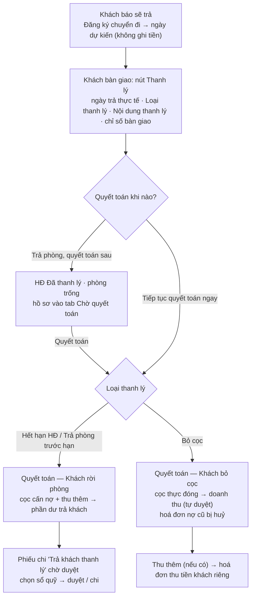
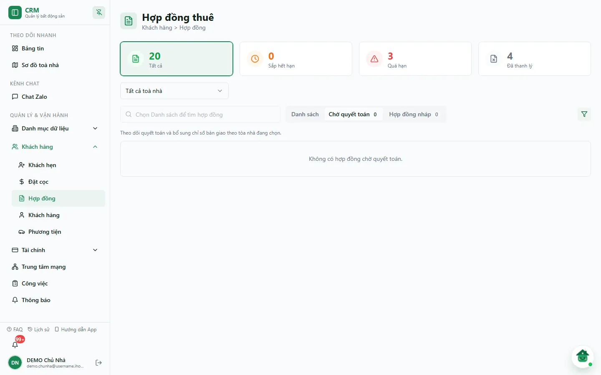

# Quy trình: Thanh lý hợp đồng (2 kịch bản)

Khi một hợp đồng kết thúc — hết hạn, trả trước hạn hay khách bỏ ngang — bạn không chỉ "đóng hợp đồng". Hệ thống tách việc thành ba chặng: **báo ngày dự kiến trả phòng** (không ghi tiền), **ghi nhận khách đã trả phòng** (phòng trống để cho thuê lại) và **quyết toán** tiền cọc, công nợ và các khoản cuối kỳ — ngay lúc trả phòng hoặc để sau. Quyết toán đi theo một trong hai kịch bản: **Khách rời phòng** (cọc cấn nợ, phần dư trả khách) hoặc **Khách bỏ cọc** (cọc thực đóng thành doanh thu, nợ cũ bị huỷ).

::: info Điều kiện tiên quyết
- Quyền **Hợp đồng => Thanh lý** (`contracts.terminate`) trên toà của hợp đồng — nút **Đăng ký chuyển đi** và **Thanh lý** chỉ hiện khi có quyền này. `contracts.edit` không thay được quyền thanh lý.
- Hợp đồng đang hiệu lực (hoặc đã có hồ sơ ở tab **Chờ quyết toán**).
- Tiền cọc đã thu nằm trên các phiếu cọc của hợp đồng — kiểm ở khối **Tài chính** của [Trang chi tiết hợp đồng](/03-quan-ly-van-hanh/hop-dong-chi-tiet/) và màn [Đặt cọc](/03-quan-ly-van-hanh/dat-coc/).
- Nên có **chỉ số điện/nước khi bàn giao**; chưa có thì chọn bổ sung sau.
:::

## Bản đồ thanh lý


```mermaid
flowchart TD
  A["Khách báo sẽ trả<br/>Đăng ký chuyển đi → ngày dự kiến (không ghi tiền)"] --> B["Khách bàn giao: nút Thanh lý<br/>ngày trả thực tế · Loại thanh lý · Nội dung thanh lý · chỉ số bàn giao"]
  B --> Q{"Quyết toán khi nào?"}
  Q -->|"Trả phòng, quyết toán sau"| W["HĐ Đã thanh lý · phòng trống<br/>hồ sơ vào tab Chờ quyết toán"]
  W -->|"Quyết toán"| K{"Loại thanh lý"}
  Q -->|"Tiếp tục quyết toán ngay"| K
  K -->|"Hết hạn HĐ / Trả phòng trước hạn"| M["Quyết toán — Khách rời phòng<br/>cọc cấn nợ + thu thêm → phần dư trả khách"]
  K -->|"Bỏ cọc"| F["Quyết toán — Khách bỏ cọc<br/>cọc thực đóng → doanh thu (tự duyệt)<br/>hoá đơn nợ cũ bị huỷ"]
  M --> P["Phiếu chi 'Trả khách thanh lý' chờ duyệt<br/>chọn sổ quỹ → duyệt / chi"]
  F --> X["Thu thêm (nếu có) → hoá đơn thu tiền khách riêng"]
```

## Hướng dẫn từng bước

**Bước 1**: **Báo ngày dự kiến trả phòng.** Khi khách báo sẽ trả, mở [Trang chi tiết hợp đồng](/03-quan-ly-van-hanh/hop-dong-chi-tiet/) và bấm **Đăng ký chuyển đi** (ở danh sách là **ĐK chuyển đi**). Hộp **Báo ngày dự kiến trả phòng** nhận **Ngày dự kiến trả phòng** và **Lý do / ghi chú** → **Lưu ngày dự kiến**. Hợp đồng vẫn đang ở; phòng hiện **Sắp trống** trên trang phòng trống công khai. Đến ngày hẹn, hợp đồng vào khối **Cần xác nhận ngày trả phòng** đầu màn [Hợp đồng](/03-quan-ly-van-hanh/hop-dong/) để bạn **Cập nhật ngày trả** hoặc huỷ báo trả nếu khách ở tiếp.

**Bước 2**: **Ghi nhận khách trả phòng.** Khi khách bàn giao thực tế, bấm nút đỏ **Thanh lý**. Hộp **Thanh lý hợp đồng** yêu cầu:

- **Ngày khách thực tế trả phòng** (mặc định hôm nay).
- **Loại thanh lý**: **Hết hạn hợp đồng**, **Trả phòng trước hạn** hoặc **Bỏ cọc** — quyết định kịch bản quyết toán.
- **Nội dung thanh lý** — bắt buộc, dùng để đối chiếu và in trên phiếu hoàn cọc; có nút **Dùng nội dung mẫu**.
- **Chỉ số điện, nước khi bàn giao** — mặc định tích **Chưa đủ chỉ số, bổ sung sau. Vẫn ghi nhận khách đã trả phòng.**; bỏ tích để nhập số đã kiểm tra trên từng đồng hồ và **Thời điểm đo thực tế**.

**Bước 3**: **Chọn quyết toán ngay hay để sau.**

- **Trả phòng, quyết toán sau** — hợp đồng chuyển **Đã thanh lý** với ngày trả thực tế, phòng trống để sale, hồ sơ vào tab **Chờ quyết toán** của màn Hợp đồng. Thao tác này **không ghi tiền**.
- **Tiếp tục quyết toán ngay** — sang form quyết toán (Bước 4).

Hồ sơ để sau được mở lại bằng nút **Quyết toán** ở tab **Chờ quyết toán**, hoặc **Quyết toán hồ sơ này** ở khối **Hồ sơ trả phòng** của trang chi tiết. Đổi loại thanh lý lúc quyết toán phải nhập **Lý do đổi loại thanh lý**.



**Bước 4a — Khách rời phòng** (loại **Hết hạn hợp đồng** / **Trả phòng trước hạn**): form **Quyết toán — Khách rời phòng** gồm **CÔNG NỢ KHÁCH HÀNG** (hoá đơn chưa thanh toán), **HOÀN CỌC VÀ TIỀN THỪA** (**Tiền cọc hoàn trả** mặc định bằng cọc **đã thu**, ô **Tiền thừa của khách (credit) áp vào quyết toán**), **THU THÊM** (tiền phòng + nước + PDV theo ngày ở, tiền điện chốt, tiền vệ sinh, khoản tuỳ ý — vào **hoá đơn thanh lý riêng**), **HOÀN LẠI KHÁCH** (tiền phòng ngày không ở…) và **TỔNG HỢP** với kết quả **Chủ nhà trả lại khách** hoặc **Khách còn phải trả**. Nếu khách còn phải trả, chọn ghi nhận thu ngay (chọn sổ nhận tiền) hoặc **Ghi nợ**. Bấm **Lập hoá đơn & Thanh lý** → hộp **Xác nhận thanh lý — khách rời phòng** → **Xác nhận thanh lý**. Chi tiết: [Thanh lý — Khách rời phòng](/03-quan-ly-van-hanh/thanh-ly-move-out/).

::: danger Phiếu "Trả khách thanh lý" chưa phải tiền đã chi
Phần dư trả khách sinh **phiếu chi "Trả khách thanh lý …" ở trạng thái Chờ duyệt và chưa có sổ quỹ**. Trang chi tiết hợp đồng hiện dải **Phiếu thanh lý chờ xử lý** để nhắc. Người có quyền mở phiếu (màn [Thu chi](/03-quan-ly-van-hanh/thu-chi/), tab **Chờ xử lý**), **chọn sổ quỹ chi tiền**, rồi duyệt/chi. Tiền chỉ thật sự ra khỏi quỹ khi phiếu ở trạng thái **Đã Chi** (`POSTED`).
:::

**Bước 4b — Khách bỏ cọc** (loại **Bỏ cọc**): form **Quyết toán — Khách bỏ cọc** hiện **HOÁ ĐƠN SẼ BỊ HUỶ** (mọi hoá đơn còn nợ; hoá đơn đã thu một phần giữ phần đã thu, chỉ huỷ phần nợ), dòng **Tiền cọc chuyển thành doanh thu (tự duyệt)** = phần cọc **đã thu**, cảnh báo xoá credit (nếu có) và khu **THU THÊM**. Bấm **Lập hoá đơn & thanh lý** → hộp **Xác nhận thanh lý — khách bỏ cọc** → **Xác nhận thanh lý**. Chi tiết: [Thanh lý — Khách bỏ cọc](/03-quan-ly-van-hanh/thanh-ly-forfeit/).

::: danger Bỏ cọc là bút toán nội bộ tự duyệt — không Thu/Chi tay
Xác nhận bỏ cọc huỷ phần nợ của các hoá đơn cũ, tạo hoá đơn thanh lý bằng phần cọc thực đóng và cặp bút toán nội bộ chuyển cọc thành **Doanh thu bỏ cọc** — **tự duyệt ngay**, không đi qua sổ quỹ tiền thật, không cần bấm **Duyệt**. Đây không phải tiền mới vào hay ra quỹ. Phần muốn đòi thêm ngoài cọc phải khai ở **Thu thêm** — hệ thống lập **hoá đơn thu tiền khách riêng** để thu sau.
:::

::: warning Chỉ có một đường hoàn tiền khách khi thanh lý
Từ 23/09/2026, đường hoàn khách thứ hai (lập phiếu hoàn cọc riêng ngoài quyết toán) đã gỡ. Khoản trả lại khách của hợp đồng đã ký chỉ sinh từ quyết toán thanh lý (phiếu **Trả khách thanh lý**). Không lập phiếu chi hoàn cọc tay ở Thu chi cho cùng hợp đồng; nếu thấy hai phiếu cho cùng hồ sơ, dừng và báo kế toán. Bỏ cọc/hoàn cọc của **giữ chỗ chưa ký** xử lý riêng ở màn [Đặt cọc](/03-quan-ly-van-hanh/dat-coc/) (**Xử lý bỏ cọc**).
:::

**Bước 5**: **Hậu kiểm.** Chỉ kết thúc khi đã đối chiếu đủ:

1. Hợp đồng **Đã thanh lý** đúng ngày trả thực tế; khối **Hồ sơ trả phòng** ghi **Đã chốt quyết toán**; phòng thực sự trống.
2. Hoá đơn còn nợ: đã quyết toán (rời phòng) hoặc đã huỷ phần nợ (bỏ cọc); hoá đơn thanh lý đúng số và trạng thái.
3. Rời phòng: phiếu **Trả khách thanh lý** tồn tại đúng một lần, đúng số, có nội dung thanh lý, đã chọn sổ, đã duyệt và đã ghi sổ. Bỏ cọc: phiếu **Doanh thu bỏ cọc** đã duyệt; hoá đơn **Thu thêm** (nếu có) đang chờ thu ở [Thu tiền tại hoá đơn](/03-quan-ly-van-hanh/thu-tien-hoa-don/).
4. Nếu đã chọn bổ sung chỉ số sau: hồ sơ nằm trong khối **Chờ bổ sung chỉ số bàn giao** (tab Chờ quyết toán) — bấm **Mở mốc bàn giao** để nhập.
5. Tab **Hoàn / Bỏ cọc** của **Sổ cọc đầy đủ** (màn Đặt cọc) có dòng của hợp đồng; cột **Tiền đã ra khỏi két** chỉ ghi đã hoàn khi phiếu hoàn đã duyệt và đã vào sổ.

## So sánh hai kịch bản

| Tiêu chí | **Khách rời phòng** (Hết hạn / Trả trước hạn) | **Khách bỏ cọc** |
| --- | --- | --- |
| **Tiền cọc** | Cọc **đã thu** cấn vào công nợ + thu thêm; phần dư **trả lại khách** | Cọc **đã thu** chuyển thành **doanh thu bỏ cọc** (không vượt cọc theo hợp đồng) |
| **Hoá đơn còn nợ** | Được **quyết toán** bằng cọc/credit hoặc khách trả thêm | **Bị huỷ phần nợ** (giữ phần đã thu) |
| **Nợ vượt cọc** | Kết quả **Khách còn phải trả**: thu ngay hoặc **Ghi nợ** | Không tự đòi; khai **Thu thêm** để lập hoá đơn riêng |
| **Khoản Thu thêm** | Vào **hoá đơn thanh lý**, cấn vào cọc | Tách thành **hoá đơn thu tiền khách riêng**, không cấn cọc |
| **Credit của khách** | Nhập số muốn áp vào quyết toán; phần không nhập vẫn treo trên hợp đồng | Bị xoá khi bỏ cọc (form cảnh báo) |
| **Chứng từ tiền ra** | Phiếu chi **Trả khách thanh lý** chờ duyệt, chưa có sổ — phải chọn sổ rồi duyệt/chi | Không có tiền ra; bút toán nội bộ tự duyệt |
| **Vào KQKD** | Phần cọc đã cấn và khoản thu thêm; hoàn tiền phòng ngày không ở làm giảm lợi nhuận | Phần cọc thực đóng (phí phạt) |

**Công thức kịch bản Khách rời phòng** (form tự tính, bạn đọc kết quả):

```text
Số quyết toán = (Cọc hoàn trả + Tiền thừa áp vào + Hoàn lại khách)
              − (Công nợ + Tổng thu thêm)
    > 0  → Chủ nhà trả lại khách (phiếu chi Trả khách thanh lý)
    < 0  → Khách còn phải trả (thu ngay hoặc Ghi nợ)
    = 0  → huề
```

**Tiền cọc hoàn trả** không vượt quá cọc **đã thu**: hợp đồng ghi cọc 3.000.000 đ nhưng khách mới nộp 0 đ thì số hoàn là 0 đ — hệ thống không hoàn một nghĩa vụ cọc khách chưa nộp.

## Các màn liên quan trong chuỗi

| Màn / khối | Vai trò |
| --- | --- |
| [Trang chi tiết hợp đồng](/03-quan-ly-van-hanh/hop-dong-chi-tiet/) | Nút **Đăng ký chuyển đi**, **Thanh lý**; khối **Hồ sơ trả phòng**; dải **Phiếu thanh lý chờ xử lý**. |
| [Hợp đồng](/03-quan-ly-van-hanh/hop-dong/) — khối **Cần xác nhận ngày trả phòng**, tab **Chờ quyết toán** | Hàng việc trả phòng và hồ sơ chờ quyết toán / chờ bổ sung chỉ số. |
| [Thanh lý — Khách rời phòng](/03-quan-ly-van-hanh/thanh-ly-move-out/) | Form quyết toán rời phòng, hoàn cọc dư, thu thêm. |
| [Thanh lý — Khách bỏ cọc](/03-quan-ly-van-hanh/thanh-ly-forfeit/) | Form quyết toán bỏ cọc, huỷ nợ, hoá đơn thu thêm riêng. |
| [Hoàn / bỏ cọc](/03-quan-ly-van-hanh/hoan-bo-coc/) | Tab **Hoàn / Bỏ cọc**, khối **Chờ hoàn cọc**, thẻ **Đối soát hoàn cọc**. |
| [Thu chi](/03-quan-ly-van-hanh/thu-chi/) · [Chờ duyệt](/03-quan-ly-van-hanh/cho-duyet/) | Chọn sổ và duyệt/chi phiếu **Trả khách thanh lý**; tra phiếu **Doanh thu bỏ cọc**. |
| [Tiền thừa](/03-quan-ly-van-hanh/tien-thua/) | Báo cáo legacy; credit chuẩn hiện ở ô credit của form quyết toán. |

## Tình huống & lỗi thường gặp

| Tình huống | Nguyên nhân & cách xử lý |
| --- | --- |
| Không thấy nút **Thanh lý** / **Đăng ký chuyển đi** | Thiếu quyền `contracts.terminate`, hoặc hợp đồng đã **Thanh lý**. |
| Nút **Trả phòng, quyết toán sau** / **Tiếp tục quyết toán ngay** mờ | Chưa chọn loại thanh lý, chưa nhập **Nội dung thanh lý**, hoặc bỏ tích "bổ sung sau" mà chưa nhập đủ chỉ số. |
| Form báo "Không tải được công nợ và số dư khách hàng" | Không quyết toán khi số nợ chưa tải được. Đóng hộp, tải lại trang rồi làm lại. |
| **Tiền cọc hoàn trả = 0** dù hợp đồng ghi cọc | Khách chưa thực nộp cọc (đã thu 0 đ). |
| Đã quyết toán nhưng khách chưa nhận tiền | Phiếu **Trả khách thanh lý** còn chờ duyệt, chưa có sổ quỹ. Chọn sổ, duyệt/chi; kiểm phiếu thành **Đã Chi**. |
| Bỏ cọc nhưng nợ lớn hơn cọc | Đúng thiết kế: bỏ cọc huỷ nợ cũ. Muốn đòi phần vượt, khai **Thu thêm** để lập hoá đơn riêng. |
| Chọn nhầm loại thanh lý | Trước khi xác nhận: **Quay lại** đổi loại. Hồ sơ chờ quyết toán: đổi loại kèm **Lý do đổi loại thanh lý**. Sau khi xác nhận thì không hoàn tác — báo chủ nhà/kế toán. |
| Tab **Hoàn / Bỏ cọc** ghi **Chưa có phiếu hoàn** | Hồ sơ ghi phải hoàn nhưng phiếu chi chưa duyệt/chưa vào sổ. Xử lý phiếu **Trả khách thanh lý** như trên. |

## Thử trực tiếp trên sandbox

<SandboxTry account="demo.chunha" app-path="/deposits" app-label="Mở màn Đặt cọc để vào hợp đồng" fixtures="Snapshot 07/10/2026: HD-2026-00008 · DEMO Toà D · D-03 · cọc 3.000.000 đ, đã thu 0 đ · 1 hoá đơn nợ 500.000 đ; tab Chờ quyết toán đang trống." view-only>

Đây là chế độ **chỉ xem** — so sánh hai kịch bản trên cùng một hợp đồng, **không** xác nhận:

1. Ở **Đặt cọc** → **Sổ cọc đầy đủ** → tab **Đủ / Thiếu cọc**, bấm **DEMO Khách 08** để mở hợp đồng D-03.
2. Bấm **Thanh lý**, chọn **Trả phòng trước hạn**, bấm **Dùng nội dung mẫu**, rồi **Tiếp tục quyết toán ngay**. Đọc **CÔNG NỢ KHÁCH HÀNG** (500.000 đ), **Tiền cọc hoàn trả = 0 đ** và **TỔNG HỢP** báo **Khách còn phải trả**. Bấm **Hủy**.
3. Mở lại **Thanh lý**, chọn **Bỏ cọc**, **Tiếp tục quyết toán ngay**. Đọc **HOÁ ĐƠN SẼ BỊ HUỶ** (500.000 đ) và **Tiền cọc chuyển thành doanh thu = 0 đ**. Bấm **Hủy**.
4. Ở màn **Hợp đồng**, mở tab **Chờ quyết toán** để thấy nơi hồ sơ "quyết toán sau" sẽ nằm.

Kết quả mong đợi: bạn phân biệt rõ khi nào chọn **rời phòng** (khách hợp tác, cấn nợ và hoàn phần dư) và khi nào chọn **bỏ cọc** (giữ cọc thực đóng, huỷ nợ cũ), mà không tạo dữ liệu nào.

:::tip
Không bấm **Lập hoá đơn & Thanh lý** hay **Trả phòng, quyết toán sau** trên DEMO — mở, đọc rồi **Hủy** là đủ.
:::

</SandboxTry>

## Quy trình liên quan

- [Thanh lý — Khách rời phòng](/03-quan-ly-van-hanh/thanh-ly-move-out/) — thao tác chi tiết kịch bản rời phòng.
- [Thanh lý — Khách bỏ cọc](/03-quan-ly-van-hanh/thanh-ly-forfeit/) — thao tác chi tiết kịch bản bỏ cọc.
- [Hoàn / bỏ cọc](/03-quan-ly-van-hanh/hoan-bo-coc/) — theo dõi cọc đã hoàn / đã bỏ.
- [Tiền thừa](/03-quan-ly-van-hanh/tien-thua/) — báo cáo legacy, khác credit chuẩn.
- [Trang chi tiết hợp đồng](/03-quan-ly-van-hanh/hop-dong-chi-tiet/) · [Hợp đồng](/03-quan-ly-van-hanh/hop-dong/) — nơi mở thanh lý và tab Chờ quyết toán.
- [Quy trình: Vòng đời khách thuê](/01-bat-dau/quy-trinh-khach-thue/) — bức tranh lớn từ khách hẹn đến thanh lý.
- [Quy trình: Chốt tháng tài chính](/01-bat-dau/quy-trinh-chot-thang/) — chặng sau: doanh thu thanh lý vào lợi nhuận tháng.
