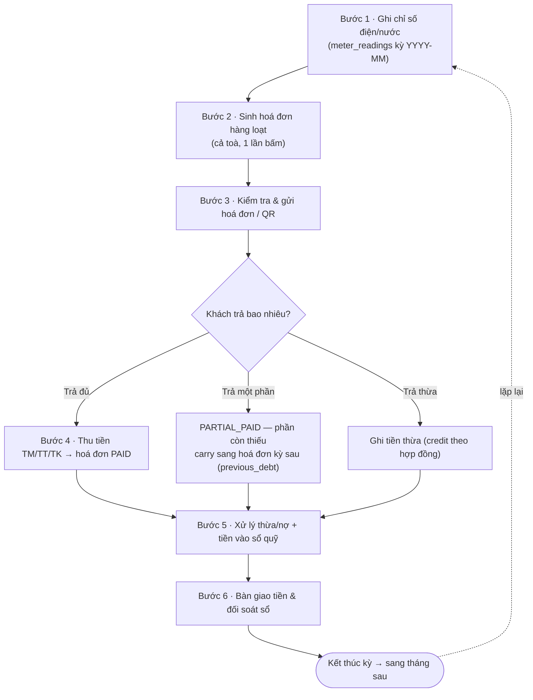

# Quy trình: Chu kỳ thu tiền hàng tháng

Trang này là sổ tay tổng quan (SOP) nối liền các bước bạn lặp lại **mỗi tháng** để thu đủ tiền của một toà nhà: ghi chỉ số điện/nước, sinh hoá đơn hàng loạt, gửi hoá đơn kèm QR cho khách, thu tiền (tiền mặt hoặc chuyển khoản) rồi xử lý phần thừa/nợ. Mỗi bước dưới đây chỉ tóm tắt "làm gì, ở đâu, ràng buộc nào cần nhớ" và **liên kết tới trang hướng dẫn chi tiết** của bước đó. Nếu đây là lần đầu bạn chạy một kỳ thu tiền, hãy đọc lần lượt từ Bước 1 đến Bước 6.

::: info Điều kiện tiên quyết
Trước khi bắt đầu một kỳ thu tiền, toà nhà của bạn cần có sẵn:

- **Công tơ điện/nước** đã gắn cho từng phòng — xem [Công tơ & đồng hồ](/01-bat-dau/cong-to/).
- **Dịch vụ & định mức** (điện, nước, rác, phí quản lý…) đã khai báo đơn giá — xem [Dịch vụ & định mức](/01-bat-dau/dich-vu-dinh-muc/).
- **Hợp đồng đang hiệu lực** cho các phòng cần thu — xem [Quy trình khách thuê](/01-bat-dau/quy-trinh-khach-thue/).
- **Sổ quỹ & loại thu chi** để tiền thu vào có chỗ ghi nhận — xem [Sổ quỹ & loại thu chi](/01-bat-dau/so-quy-loai-thu-chi/).

Bạn cần quyền ghi chỉ số, tạo hoá đơn và thu tiền trên toà tương ứng. Nếu thiếu quyền, hệ thống sẽ chặn ở đúng bước đó.
:::

## Hướng dẫn từng bước

Toàn bộ chu kỳ một tháng chảy theo sơ đồ dưới đây. Mỗi khối là một bước, và mỗi bước có một trang chi tiết riêng.

**Bước 1**: Ghi chỉ số điện/nước cho kỳ. Vào **Ghi chỉ số** (menu **Vận hành** => **Ghi chỉ số**), chọn toà và tháng, nhập số công tơ hiện tại của từng phòng. Hệ thống tự lấy chỉ số kỳ trước làm mốc và tính lượng tiêu thụ = chỉ số hiện tại − chỉ số trước. Chỉ những chỉ số đã ở trạng thái **Đã duyệt** mới được đưa lên hoá đơn ở Bước 2. Chi tiết thao tác và cách nhập hàng loạt: [Ghi chỉ số điện nước](/03-quan-ly-van-hanh/ghi-chi-so/).

::: tip
Ghi chỉ số cố định vào cùng một ngày mỗi tháng (ví dụ ngày cuối tháng) để lượng tiêu thụ giữa các kỳ so sánh được và khách không thắc mắc về số ngày lệch.
:::

**Bước 2**: Sinh hoá đơn hàng loạt cho cả toà. Vào **Sinh hoá đơn** (menu **Vận hành** => **Sinh hoá đơn**), chọn toà và **tháng tính tiền**, rồi bấm sinh. Hệ thống tự dựng cho mỗi phòng: **Tiền phòng** + **Điện** (lượng tiêu thụ × đơn giá) + **Nước** + **Rác** + các dịch vụ cố định, và cộng thêm **nợ kỳ trước** nếu có (xem ghi chú carry bên dưới). Tổng hoá đơn được **làm tròn phần lẻ về bội 1.000đ**. Chi tiết: [Sinh hoá đơn hàng loạt](/03-quan-ly-van-hanh/sinh-hoa-don/).

::: warning
Sinh hoá đơn tạo chứng từ công nợ thật cho khách. Kiểm tra kỹ đã chọn **đúng tháng** và **đúng toà** trước khi bấm — sửa lại sau khi đã sinh sẽ mất công huỷ/tạo lại từng hoá đơn. Mỗi hợp đồng chỉ được một hoá đơn đang hiệu lực cho mỗi tháng.
:::

**Bước 3**: Kiểm tra và gửi hoá đơn cho khách. Mở danh sách [Hoá đơn](/03-quan-ly-van-hanh/hoa-don/) để rà soát toàn kỳ, hoặc mở [Chi tiết hoá đơn](/03-quan-ly-van-hanh/hoa-don-chi-tiet/) của từng phòng để xem từng dòng, in, hoặc lấy **mã QR / link thanh toán** gửi khách. Ở màn này bạn xác nhận số tiền, hạn thanh toán và nội dung trước khi khách trả.

**Bước 4**: Thu tiền khi khách thanh toán. Có ba đường thu, cùng ghi vào một chỗ:

- **Thu trên chi tiết hoá đơn** (máy tính): mở [Thu tiền hoá đơn](/03-quan-ly-van-hanh/thu-tien-hoa-don/), nhập số tiền, chọn hình thức **TM** / **TT** / **TK** và sổ quỹ nhận tiền. Đây là đường duy nhất thu được hoá đơn tháng đầu có gộp cọc.
- **Thu nhanh trên điện thoại**: dùng [Thu tiền trên điện thoại](/03-quan-ly-van-hanh/thu-tien-mobile/) khi đi thu tại chỗ — chỉ thu **TM**, tự chọn sổ "…Thu" và làm tròn phần thiếu nhỏ.
- **Thu hàng loạt**: chọn nhiều hoá đơn và thu một lượt (không dùng cho hoá đơn gộp cọc).

Sau khi thu, trạng thái hoá đơn tự chuyển **PAID** (đủ) hoặc **PARTIAL_PAID** (một phần), và một **phiếu thu** được ghi vào sổ quỹ tương ứng.

::: danger
Thu tiền là thao tác **ghi tiền thật** vào sổ quỹ và làm thay đổi công nợ khách. Trước khi bấm xác nhận, đối chiếu lại **số tiền**, **hình thức TM/TT/TK** và **sổ quỹ nhận** — ghi nhầm sổ hoặc nhầm hình thức sẽ làm lệch số dư và phải điều chỉnh thủ công. Giữ nguyên mã **TM** / **TT** / **TK** như phần mềm hiển thị, không tự dịch sang chữ.
:::

**Bước 5**: Xử lý tiền thừa và nợ còn lại. Nếu khách trả **thừa**, phần dư được ghi thành **credit theo hợp đồng** để trừ vào kỳ sau — theo dõi ở [Tiền thừa](/03-quan-ly-van-hanh/tien-thua/). Nếu khách trả **thiếu**, phần còn lại nằm ở trạng thái nợ và tự **carry** sang hoá đơn kỳ sau. Các khoản thu/chi lẻ ngoài hoá đơn (phí phạt, sửa chữa…) ghi ở [Thu chi](/03-quan-ly-van-hanh/thu-chi/); số dư tổng của từng quỹ xem ở [Sổ quỹ](/03-quan-ly-van-hanh/so-quy/).

**Bước 6**: Bàn giao tiền mặt và đối soát sổ. Cuối ngày/cuối đợt, tiền mặt nhân viên đang giữ được **nộp lên** cho quản lý hoặc chủ, rồi hai bên **đối soát số dư sổ**. Đây là một quy trình riêng — xem [Quy trình bàn giao](/01-bat-dau/quy-trinh-ban-giao/) để nắm các bước, và [Bàn giao & đối soát](/03-quan-ly-van-hanh/ban-giao-doi-soat/) để thao tác trên màn hình.

### Ghi nhớ nghiệp vụ quan trọng

- **Cọc gộp trong hoá đơn tháng đầu**: khi khách còn thiếu tiền cọc lúc ký hợp đồng, phần cọc thiếu **không** là một phiếu thu lẻ ngoài hoá đơn — nó được thêm thành một dòng **"Tiền cọc"** ngay trong **hoá đơn tháng đầu**. Vì vậy hoá đơn tháng đầu phải thu qua màn hình chi tiết hoá đơn (Bước 4, đường đầu tiên), không thu qua thu hàng loạt/thu nhanh.
- **Phiếu thu tách hạng mục — cọc không vào doanh thu**: mỗi lần thu tạo **đúng một phiếu thu**, nhưng nếu hoá đơn có gộp cọc thì phiếu tự tách hạng mục **"Tiền cọc" (is_deposit)**. Phần cọc này **không** được tính vào Kết quả kinh doanh (KQKD) — nó là tiền giữ hộ khách, chỉ phần tiền phòng/dịch vụ mới là doanh thu.
- **Nợ cũ tự cộng dồn (carry)**: hoá đơn kỳ mới tự cộng phần **nợ kỳ trước** của phòng đó vào tổng, kèm ghi nguồn nợ. Bạn không phải cộng tay.
- **Làm tròn tiền thiếu dưới 10.000đ**: khi thu và phần còn lại chỉ là vài nghìn lẻ (< 10.000đ), hệ thống tự làm tròn để đóng hoá đơn thay vì để treo nợ vụn.
- **Tiền thối đã net trong tổng thu**: nếu có ghi nhận tiền thối lại cho khách, số tiền đó đã được trừ sẵn — **tổng thu của phiếu là số ròng**, đừng trừ thêm lần nữa.

## Các tính năng khác trên màn hình

| Tính năng | Ở màn nào | Dùng để làm gì |
|---|---|---|
| Nhập chỉ số hàng loạt (Excel) | [Ghi chỉ số](/03-quan-ly-van-hanh/ghi-chi-so/) | Nhập nhanh số công tơ nhiều phòng cùng lúc |
| Xem lượng tiêu thụ so kỳ trước | [Ghi chỉ số](/03-quan-ly-van-hanh/ghi-chi-so/) | Phát hiện phòng dùng điện/nước bất thường trước khi ra hoá đơn |
| Chỉnh dòng hoá đơn từng phòng | [Chi tiết hoá đơn](/03-quan-ly-van-hanh/hoa-don-chi-tiet/) | Sửa số tiền, thêm/bớt dịch vụ trước khi khách trả |
| In hoá đơn / lấy QR thanh toán | [Hoá đơn](/03-quan-ly-van-hanh/hoa-don/) | Gửi khách qua ảnh/QR để chuyển khoản |
| Thu tiền tại chỗ trên điện thoại | [Thu tiền trên điện thoại](/03-quan-ly-van-hanh/thu-tien-mobile/) | Đi thu tiền mặt ngoài hiện trường, tự vào sổ |
| Theo dõi & trừ tiền thừa | [Tiền thừa](/03-quan-ly-van-hanh/tien-thua/) | Giữ credit của khách để bù kỳ sau |
| Ghi thu/chi lẻ ngoài hoá đơn | [Thu chi](/03-quan-ly-van-hanh/thu-chi/) | Phí phạt, sửa chữa, các khoản không qua hoá đơn |
| Xem số dư từng quỹ | [Sổ quỹ](/03-quan-ly-van-hanh/so-quy/) | Kiểm tra tồn quỹ trước khi bàn giao |

## Tình huống & lỗi thường gặp

| Tình huống | Vì sao | Cách xử lý |
|---|---|---|
| Sinh hoá đơn nhưng phòng bị thiếu tiền điện/nước | Chỉ số kỳ đó chưa **Đã duyệt** hoặc chưa ghi | Quay lại [Ghi chỉ số](/03-quan-ly-van-hanh/ghi-chi-so/), ghi/duyệt chỉ số rồi sinh lại hoá đơn phòng đó |
| Hoá đơn tháng đầu không thu được qua thu nhanh/thu hàng loạt | Hoá đơn có **gộp cọc**, hai đường này từ chối | Thu qua [Thu tiền hoá đơn](/03-quan-ly-van-hanh/thu-tien-hoa-don/) trên chi tiết hoá đơn |
| Tổng hoá đơn lệch vài trăm đồng so với tính tay | Hệ thống **làm tròn về bội 1.000đ** | Bình thường — đây là số tiền cuối cùng khách phải trả |
| Thu đủ nhưng hoá đơn vẫn còn nợ nhỏ | Có ghi **tiền thối**, hoặc còn lẻ < 10.000đ | Kiểm tra dòng tiền thối (đã net trong tổng thu); phần < 10.000đ được tự làm tròn khi thu |
| Khách trả thừa, không biết tiền đi đâu | Phần thừa thành **credit theo hợp đồng** | Xem và dùng lại ở [Tiền thừa](/03-quan-ly-van-hanh/tien-thua/) cho kỳ sau |
| Ghi nhầm hình thức TM/TT/TK | Chọn sai lúc thu | Điều chỉnh phiếu thu ở [Sổ quỹ](/03-quan-ly-van-hanh/so-quy/); giữ nguyên mã TM/TT/TK, không tự dịch |

## Thử trực tiếp trên sandbox

<SandboxTry account="demo.ketoan" app-path="/meter-readings" app-label="Mở Ghi chỉ số (sandbox kế toán)" fixtures="Toà DEMO A (triển lãm): chỉ số & hoá đơn tháng 7/2026 đã ghi cho A101–A105. A101 & A103 đã thu đủ; A102 đã thu một phần còn nợ 2.570.000đ; A105 hoá đơn tháng 6 quá hạn 6.070.000đ (có nợ cũ 1.000.000đ). Toà DEMO B (bài tập): B101 hoá đơn tháng 7 chưa thu 5.570.000đ. Mỗi hoá đơn gồm Tiền phòng + Điện 420.000đ + Nước 120.000đ + Rác 30.000đ. Có 1 phiếu chi sửa chữa 500.000đ, 1 phiếu thu phí phạt 200.000đ, 3 sổ quỹ demo." view-only>
Đi theo chuỗi trên sandbox: **ghi chỉ số → sinh hoá đơn → thu tiền**, mỗi bước mở trang tương ứng để xem dữ liệu thật.

1. Mở **Ghi chỉ số**, chọn Toà DEMO A tháng 7/2026 — xem chỉ số A101–A105 đã ghi và lượng tiêu thụ so kỳ trước.
2. Sang **Sinh hoá đơn** — quan sát một hoá đơn A10x gồm Tiền phòng + Điện 420.000đ + Nước 120.000đ + Rác 30.000đ.
3. Sang **Thu tiền hoá đơn** — đối chiếu trạng thái: A101/A103 **PAID**, A102 **PARTIAL_PAID** (còn nợ 2.570.000đ), A105 **quá hạn** 6.070.000đ.

Toà DEMO A đã thu/quá hạn nên chỉ để xem, đừng thu lại. Nếu muốn thử một lượt thu, làm trên **B101** của Toà DEMO B (chưa thu 5.570.000đ) rồi bấm Reset để trả sandbox về trạng thái ban đầu.
</SandboxTry>

## Quy trình liên quan

- [Quy trình khách thuê](/01-bat-dau/quy-trinh-khach-thue/) — từ khách hẹn, đặt cọc đến ký hợp đồng (đầu vào của chu kỳ thu tiền).
- [Quy trình bàn giao](/01-bat-dau/quy-trinh-ban-giao/) — nộp tiền và đối soát sổ sau khi thu.
- [Ghi chỉ số điện nước](/03-quan-ly-van-hanh/ghi-chi-so/)
- [Sinh hoá đơn hàng loạt](/03-quan-ly-van-hanh/sinh-hoa-don/)
- [Danh sách hoá đơn](/03-quan-ly-van-hanh/hoa-don/) · [Chi tiết hoá đơn](/03-quan-ly-van-hanh/hoa-don-chi-tiet/)
- [Thu tiền hoá đơn](/03-quan-ly-van-hanh/thu-tien-hoa-don/) · [Thu tiền trên điện thoại](/03-quan-ly-van-hanh/thu-tien-mobile/)
- [Tiền thừa](/03-quan-ly-van-hanh/tien-thua/) · [Thu chi](/03-quan-ly-van-hanh/thu-chi/) · [Sổ quỹ](/03-quan-ly-van-hanh/so-quy/)
- [Bàn giao & đối soát](/03-quan-ly-van-hanh/ban-giao-doi-soat/)
