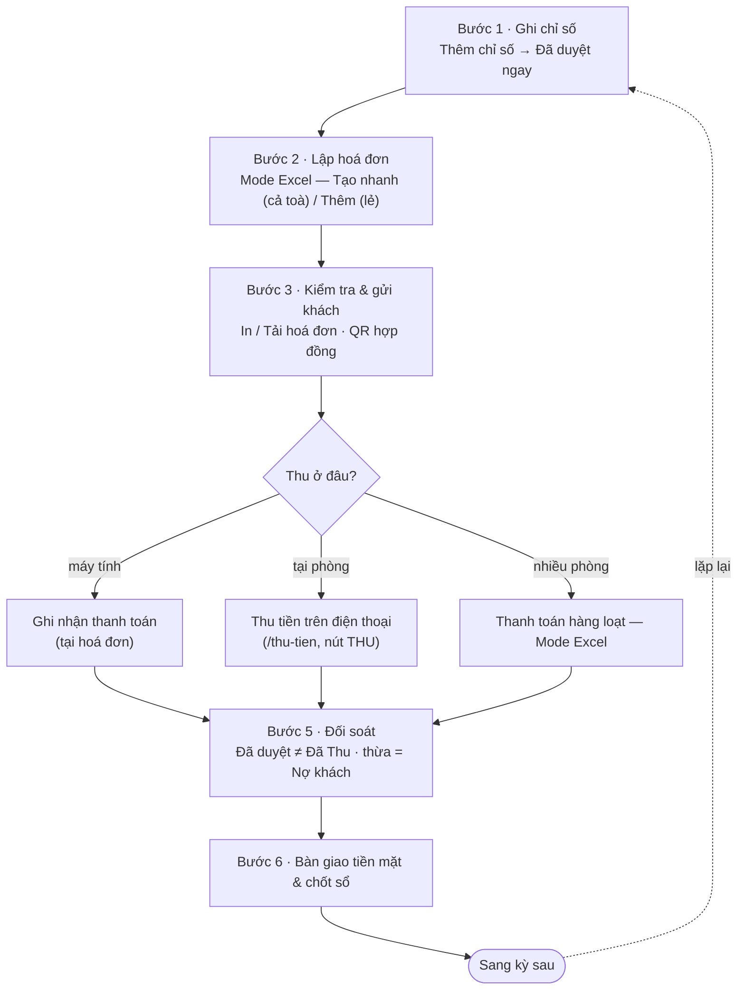

# Quy trình: Chu kỳ thu tiền hàng tháng

Trang này là SOP các bước bạn lặp lại **mỗi tháng**: ghi chỉ số, lập hoá đơn, gửi khách, thu tiền, đối soát và bàn giao. Hệ thống **không tự sinh hoá đơn hằng tháng** — mỗi kỳ bạn chủ động lập (cả lô bằng **Mode Excel — Tạo nhanh** hoặc từng hoá đơn bằng **Thêm**). Chu kỳ chỉ coi là xong khi mọi hợp đồng đang hiệu lực đã có hoá đơn của kỳ và tiền thu được đã thực vào sổ quỹ (**Đã Thu**), không chỉ khi phiếu đã duyệt.

::: info Điều kiện tiên quyết
Trước khi bắt đầu một kỳ thu tiền, toà nhà cần có sẵn:

- **Công tơ điện/nước** gắn cho từng phòng — xem [Công tơ & đồng hồ](/01-bat-dau/cong-to/).
- **Dịch vụ & đơn giá** (điện, nước, phí dịch vụ…) — xem [Dịch vụ & định mức](/01-bat-dau/dich-vu-dinh-muc/).
- **Hợp đồng đang hiệu lực** cho các phòng cần thu — xem [Quy trình: Vòng đời khách thuê](/01-bat-dau/quy-trinh-khach-thue/).
- **Sổ nhận tiền**: mỗi người thu có **Sổ tiền mặt riêng** và toà có sổ nhận **Chuyển khoản / Thanh toán**; chủ công ty cài ở **Sổ quỹ → Sổ nhận tiền** — xem [Sổ quỹ](/03-quan-ly-van-hanh/so-quy/) và [Sổ quỹ & loại thu chi](/01-bat-dau/so-quy-loai-thu-chi/).

Quyền cần có: `meter_readings.view/create` (ghi chỉ số), `invoices.view/create` (lập hoá đơn), `invoices.record_payment` (thu tại hoá đơn) hoặc `thu_tien.view/collect` (thu tại phòng), cùng phạm vi toà tương ứng.
:::

## Bản đồ chu kỳ

```mermaid
flowchart TD
    A["Bước 1 · Ghi chỉ số<br/>Thêm chỉ số → Đã duyệt ngay"] --> B["Bước 2 · Lập hoá đơn<br/>Mode Excel — Tạo nhanh (cả toà) / Thêm (lẻ)"]
    B --> C["Bước 3 · Kiểm tra & gửi khách<br/>In / Tải hoá đơn · QR hợp đồng"]
    C --> D{"Thu ở đâu?"}
    D -->|"máy tính"| E["Ghi nhận thanh toán<br/>(tại hoá đơn)"]
    D -->|"tại phòng"| F["Thu tiền trên điện thoại<br/>(/thu-tien, nút THU)"]
    D -->|"nhiều phòng"| G["Thanh toán hàng loạt — Mode Excel"]
    E --> H["Bước 5 · Đối soát<br/>Đã duyệt ≠ Đã Thu · thừa = Nợ khách"]
    F --> H
    G --> H
    H --> I["Bước 6 · Bàn giao tiền mặt & chốt sổ"]
    I --> J(["Sang kỳ sau"])
    J -.lặp lại.-> A
```

## Hướng dẫn từng bước

**Bước 1**: **Ghi chỉ số điện/nước.** Vào **Tài chính => Ghi chỉ số**, bấm **Thêm chỉ số**, chọn **Tòa nhà**, **Loại công tơ**, **Tháng chốt**, **Ngày chốt**; form tự nạp bảng công tơ chưa chốt với **Chỉ số đầu** lấy từ lần ghi trước. Nhập **Chỉ số mới** rồi **Lưu**. Chỉ số ghi bằng form được **duyệt ngay** (badge **Đã duyệt**) và là đầu vào cho hoá đơn. Chi tiết: [Ghi chỉ số điện nước](/03-quan-ly-van-hanh/ghi-chi-so/).

::: warning Chỉ số Import ở trạng thái Chưa duyệt
Nhập bằng **Import** (Excel theo mã công tơ) tạo dòng **Chưa duyệt** và màn chưa có nút duyệt các dòng này — hoá đơn không dùng chỉ số **Chưa duyệt**. Với kỳ cần lên hoá đơn, ghi bằng form. Trước khi lập hoá đơn, lọc theo toà/tháng để chắc mỗi công tơ chỉ có một lần ghi trong kỳ.
:::

**Bước 2**: **Lập hoá đơn cho kỳ.** Vào **Tài chính => Hoá đơn**:

- **Cả toà một lượt**: bấm nút tròn tím **Mode Excel — Tạo nhanh**, chọn **Toà nhà**, **Kỳ thanh toán**, kiểm **Ngày phát hành**, **Hạn thanh toán**, bấm **Tải dữ liệu**. Bảng nạp sẵn giá phòng, số người, chỉ số đầu, nước, phí dịch vụ, nợ cũ; bạn nhập **Chỉ số cuối** (nếu chưa ghi ở Bước 1 — lô sẽ lưu luôn chỉ số điện), bỏ tích phòng chưa sẵn sàng rồi bấm **Tạo N hoá đơn**. Đọc kết quả từng phòng ngay dưới bảng. Chi tiết: [Sinh hoá đơn hàng loạt](/03-quan-ly-van-hanh/sinh-hoa-don/).
- **Một hoá đơn riêng**: bấm nút tròn xanh **Thêm** → hộp **Tạo hoá đơn lẻ** (chọn toà, phòng, hợp đồng; form tự nạp giá và đơn giá) → **Tạo hoá đơn**. Chi tiết: [Hoá đơn — danh sách & tạo lẻ](/03-quan-ly-van-hanh/hoa-don/).

Hoá đơn mới vào **Đã duyệt** nếu tổ chức bật **Tự động duyệt hóa đơn**, ngược lại ở **Nháp** chờ duyệt. Ô **Nợ cũ** do máy tính từ hoá đơn kỳ trước (có nút tải lại), không gõ tay.

::: warning Lô tạo hoá đơn không nguyên tử
Mỗi phòng được tạo riêng. Nếu lô dừng giữa chừng, **không bấm tạo lại cả lô**: mở lại hộp, hệ thống báo **Đã xác minh kết quả lần tạo trước** và khoá các hợp đồng đã có hoá đơn trong kỳ. Một hợp đồng chỉ có một hoá đơn mỗi kỳ — form tạo lẻ báo trùng và khoá nút tạo.
:::

::: danger Không có sinh hoá đơn tự động
Sau mỗi lượt, đối chiếu danh sách hợp đồng đang hiệu lực của toà với danh sách hoá đơn kỳ (lọc **Chọn tháng** + toà): phòng nào chưa có thì lập bổ sung bằng **Thêm**. [Lịch thanh toán](/04-bao-cao/lich-thanh-toan/) chỉ là báo cáo hỗ trợ.
:::

**Bước 3**: **Kiểm tra và gửi khách.** Mở [Chi tiết, in hoá đơn & QR tra cứu](/03-quan-ly-van-hanh/hoa-don-chi-tiet/) bằng **Xem chi tiết**: đối chiếu **Tổng hoá đơn**, **Chi tiết các khoản thu**, **Nợ cũ kỳ trước**, hạn thanh toán. Bấm **In hóa đơn** (Khổ A4 / 80mm, in, tải ảnh hoặc PDF) hoặc **QR hợp đồng** để gửi khách đường dẫn tự tra hoá đơn mới nhất. Cần sửa thì dùng nút bút chì (**Cập nhật** với nháp chưa thu, **Điều chỉnh hóa đơn** với hoá đơn đã phát hành).

**Bước 4**: **Thu tiền khi khách trả.** Ba đường, cùng ghi vào hoá đơn và sổ nhận tiền:

- **Tại hoá đơn (máy tính)**: nút tròn **Thu tiền** trên dòng hoặc **Ghi nhận thanh toán** ở chi tiết. Nhập **Tiền khách đưa**, chọn **Phương thức** `TM` / `TK` / `TT` (TM luôn vào **Sổ tiền mặt riêng** của người thu; TK/TT chọn **Sổ quỹ nhận**), thêm dòng bằng **+** nếu khách trả nhiều hình thức. Chi tiết: [Thu tiền tại hoá đơn](/03-quan-ly-van-hanh/thu-tien-hoa-don/).
- **Tại phòng (điện thoại)**: **Tài chính => Thu tiền** (`/thu-tien`), chọn kỳ và toà, bấm **THU** trên ô phòng (thu đủ/thu một phần bằng bàn phím nhanh) hoặc mở ô phòng để thu chi tiết. Chi tiết: [Thu tiền tại phòng (điện thoại)](/03-quan-ly-van-hanh/thu-tien-mobile/).
- **Nhiều phòng cùng lúc**: nút tròn **Thanh toán hàng loạt — Mode Excel** → chọn toà & kỳ → **Tải dữ liệu** → nhập TM/TT/TK/Thối từng phòng → **Ghi nhận N thanh toán**. Mỗi hoá đơn là một giao dịch riêng; đọc kết quả từng dòng, không bấm ghi lại cả lô.

Thu xong, hoá đơn chuyển **Đã thanh toán** (đủ) hoặc **Trả 1 phần**, và mỗi dòng thu tạo một phiếu thu "Thu tiền theo HĐ …".

::: danger Thu tiền là thao tác ghi tiền thật
Trước khi bấm, đối chiếu **số tiền**, **phương thức TM/TK/TT** và **sổ nhận**. Nếu hoá đơn vừa có khoản thu **cùng số tiền trong 30 phút**, hệ thống hỏi **Có thể đang thu trùng** — chọn **Không thu** nếu đúng là trùng. Thu nhầm thì dùng **Hoàn tác** (ghi lý do) hoặc **Đổi hình thức thu** (chỉ đổi hình thức/sổ, không đổi số tiền); không xoá phiếu thu, không chỉnh tay số dư.
:::

**Bước 5**: **Đối soát sau khi thu.**

- **Đã duyệt ≠ Đã Thu**: phiếu thu từ lần thu ở trạng thái duyệt, nhưng tiền chỉ coi là vào sổ quỹ khi phiếu là **Đã Thu** (đã ghi sổ — `POSTED`). Kiểm ở [Thu chi](/03-quan-ly-van-hanh/thu-chi/) và [Sổ quỹ](/03-quan-ly-van-hanh/so-quy/) (cột **Tồn quỹ** chỉ cộng bút toán đã ghi sổ).
- **Khách trả thiếu**: hoá đơn ở **Trả 1 phần**; phần nợ được máy kéo vào ô **Nợ cũ** của hoá đơn kỳ sau.
- **Khách trả thừa**: nhập **Tiền thối** thực tế, hoặc tích **Nợ khách (trừ kỳ sau)** để giữ phần dư làm credit của hợp đồng. Báo cáo [Tiền thừa](/03-quan-ly-van-hanh/tien-thua/) là báo cáo legacy, không phải số dư credit chuẩn.
- **Khoản thu/chi ngoài hoá đơn** (phí phạt, sửa chữa…) ghi ở [Thu chi](/03-quan-ly-van-hanh/thu-chi/); phiếu cần duyệt nằm ở [Chờ duyệt](/03-quan-ly-van-hanh/cho-duyet/).

**Bước 6**: **Bàn giao tiền mặt và chốt sổ.** Tiền mặt người thu đang giữ được nộp cho người nhận qua nút **Bàn giao tiền mặt** trên màn Thu tiền (hai phía xác nhận), sau đó người giữ sổ chốt sổ ở **Sổ quỹ**. Xem [Quy trình: Bàn giao & đối soát](/01-bat-dau/quy-trinh-ban-giao/).

### Ghi nhớ nghiệp vụ

- **Cọc gộp hoá đơn đầu**: khi ký hợp đồng chọn **Đóng đủ trong hoá đơn**, phần cọc còn thiếu thành dòng **Tiền cọc** của hoá đơn tháng đầu; lần thu tự phân bổ phần cọc riêng (không vào doanh thu) trong cùng một lần thu.
- **Làm tròn thiếu dưới 10.000đ**: khi khách đóng thiếu dưới 10.000đ, hệ thống ghi phần thiếu vào sổ "Làm tròn tiền thiếu" và đánh hoá đơn **Đã thanh toán** đủ — trừ khi phần thiếu thuộc tiền cọc. Tra lại bằng nút **Khoản bỏ qua** trên màn Hoá đơn hoặc màn Thu tiền.
- **Một lần thu là nguyên tử**: mọi dòng TM/TK/TT của một hoá đơn trong một lần thu cùng lưu hoặc cùng không lưu; mạng chập chờn thì bấm ghi lại là an toàn (cùng khoá chống trùng).
- **Tháng đã chốt lợi nhuận**: thu, hoàn tác hay điều chỉnh khoản thuộc tháng đã chốt lợi nhuận sẽ bị chặn — lập ở tháng hiện tại hoặc nhờ chủ mở khoá tháng.

## Các tính năng khác trên màn hình

| Tính năng | Ở màn nào | Dùng để làm gì |
|---|---|---|
| **Import** chỉ số | [Ghi chỉ số](/03-quan-ly-van-hanh/ghi-chi-so/) | Nạp chỉ số hàng loạt theo mã công tơ (vào **Chưa duyệt**) |
| **Mode Excel — Tạo nhanh** | [Sinh hoá đơn hàng loạt](/03-quan-ly-van-hanh/sinh-hoa-don/) | Lập hoá đơn cả toà/kỳ, chia tiền theo ngày cho phòng vào/ra giữa kỳ |
| **Điều chỉnh hóa đơn**, **Lịch sử chỉnh sửa** | [Hoá đơn](/03-quan-ly-van-hanh/hoa-don/) | Sửa hoá đơn đã phát hành có phiên bản, xem lịch sử trường thay đổi |
| **Huỷ** / **Phục hồi hoá đơn** | [Hoá đơn](/03-quan-ly-van-hanh/hoa-don/) | Huỷ hoá đơn chưa thu tiền; phục hồi về **Đã duyệt** |
| **In hóa đơn**, **QR hợp đồng** | [Chi tiết hoá đơn](/03-quan-ly-van-hanh/hoa-don-chi-tiet/) | Gửi khách bản in/ảnh/PDF hoặc link tự tra |
| **Các lần thanh toán** → **Hoàn tác** / **Đổi hình thức thu** | [Thu tiền tại hoá đơn](/03-quan-ly-van-hanh/thu-tien-hoa-don/) | Sửa lần thu sai mà vẫn giữ dấu vết |
| **Khoản bỏ qua** | [Hoá đơn](/03-quan-ly-van-hanh/hoa-don/), [Thu tiền](/03-quan-ly-van-hanh/thu-tien-mobile/) | Tra các khoản thiếu dưới 10.000đ đã được tính đủ |
| **Bàn giao tiền mặt** | [Thu tiền](/03-quan-ly-van-hanh/thu-tien-mobile/) | Nộp tiền mặt đã thu cho người nhận |

## Tình huống & lỗi thường gặp

| Tình huống | Vì sao | Cách xử lý |
|---|---|---|
| Hoá đơn thiếu tiền điện | Kỳ chưa có chỉ số **Đã duyệt** (chưa ghi, hoặc ghi bằng Import nên **Chưa duyệt**) | Ghi chỉ số bằng **Thêm chỉ số** hoặc nhập **Chỉ số cuối** trong Mode Excel; kiểm lại hoá đơn phòng đó |
| Một số phòng không có hoá đơn kỳ này | Không có sinh tự động; phòng bị bỏ tích hoặc lỗi trong lô | Lọc theo toà/kỳ, lập bổ sung bằng **Thêm**; không tạo lại cả lô |
| Mode Excel báo **Phòng có nhiều hợp đồng hiệu lực** | Phòng còn hợp đồng cũ chưa thanh lý | Thanh lý hợp đồng cũ; hệ thống tạm chọn hợp đồng mới nhất |
| Hộp thu báo **Người thu chưa có sổ tiền mặt riêng** | Chưa cài sổ cho người thu | Chủ công ty cài ở **Sổ quỹ → Sổ nhận tiền** |
| Màn Thu tiền trống | Kỳ/toà chưa có hoá đơn, hoặc đang lọc **Hôm nay** | Đổi kỳ, chọn toà, bấm **Tất cả** |
| Thu đủ nhưng sổ quỹ chưa tăng | Phiếu mới ở trạng thái duyệt, chưa **Đã Thu** | Kiểm trạng thái ghi sổ ở [Thu chi](/03-quan-ly-van-hanh/thu-chi/) |
| Báo **Số đã thu vừa thay đổi; vui lòng tải lại hóa đơn** | Người khác vừa thu hoá đơn này | Đóng hộp, tải lại, thu theo số còn lại mới |
| Báo lợi nhuận tháng **đã chốt** | Tháng của khoản thu đã khoá lợi nhuận | Lập điều chỉnh ở tháng hiện tại, hoặc nhờ chủ mở khoá nhà/tháng đó |

## Thử trực tiếp trên sandbox

<SandboxTry account="demo.chunha" app-path="/invoices" app-label="Mở danh sách Hoá đơn" fixtures="Snapshot 07/10/2026: Ghi chỉ số tháng 10/2026 rỗng; Hoá đơn hiện 1 hoá đơn Quá hạn 500.000đ của DEMO Toà D - D-03 kỳ 09/2026 (fixture E2E — không thu, không huỷ)." view-only>
Đi theo chuỗi **ghi chỉ số → lập hoá đơn → thu tiền** ở chế độ chỉ xem:

1. Mở **Ghi chỉ số**: tháng hiện tại rỗng (**Chưa có chỉ số nào**) — đây là empty state hợp lệ.
2. Ở **Hoá đơn**, bấm **Mode Excel — Tạo nhanh**, chọn **DEMO Toà C**, kỳ 10/2026, bấm **Tải dữ liệu** để xem bảng 5 phòng; bấm **Huỷ**, không bấm **Tạo N hoá đơn**.
3. Bấm **Thu tiền** trên dòng hoá đơn D-03 để đọc hộp **Ghi nhận thanh toán** (ô sổ báo thiếu sổ tiền mặt riêng), rồi **Hủy**.
4. Mở **Thu tiền**, chọn kỳ 09/2026, **DEMO Toà D**, bộ lọc **Tất cả** để thấy ô **D-03**; không bấm **THU**.

Kết quả mong đợi: bạn đọc được dữ liệu mỗi bước và không có chỉ số, hoá đơn hay khoản thu nào được tạo.
</SandboxTry>

## Quy trình liên quan

- [Quy trình: Vòng đời khách thuê](/01-bat-dau/quy-trinh-khach-thue/) — đầu vào của chu kỳ: hợp đồng đang hiệu lực.
- [Quy trình: Bàn giao & đối soát](/01-bat-dau/quy-trinh-ban-giao/) — nộp tiền và chốt sổ sau khi thu.
- [Ghi chỉ số điện nước](/03-quan-ly-van-hanh/ghi-chi-so/) · [Sinh hoá đơn hàng loạt](/03-quan-ly-van-hanh/sinh-hoa-don/)
- [Hoá đơn — danh sách & tạo lẻ](/03-quan-ly-van-hanh/hoa-don/) · [Chi tiết, in hoá đơn & QR tra cứu](/03-quan-ly-van-hanh/hoa-don-chi-tiet/)
- [Thu tiền tại hoá đơn](/03-quan-ly-van-hanh/thu-tien-hoa-don/) · [Thu tiền tại phòng (điện thoại)](/03-quan-ly-van-hanh/thu-tien-mobile/)
- [Thu chi](/03-quan-ly-van-hanh/thu-chi/) · [Chờ duyệt](/03-quan-ly-van-hanh/cho-duyet/) · [Sổ quỹ](/03-quan-ly-van-hanh/so-quy/) · [Tiền thừa](/03-quan-ly-van-hanh/tien-thua/)
