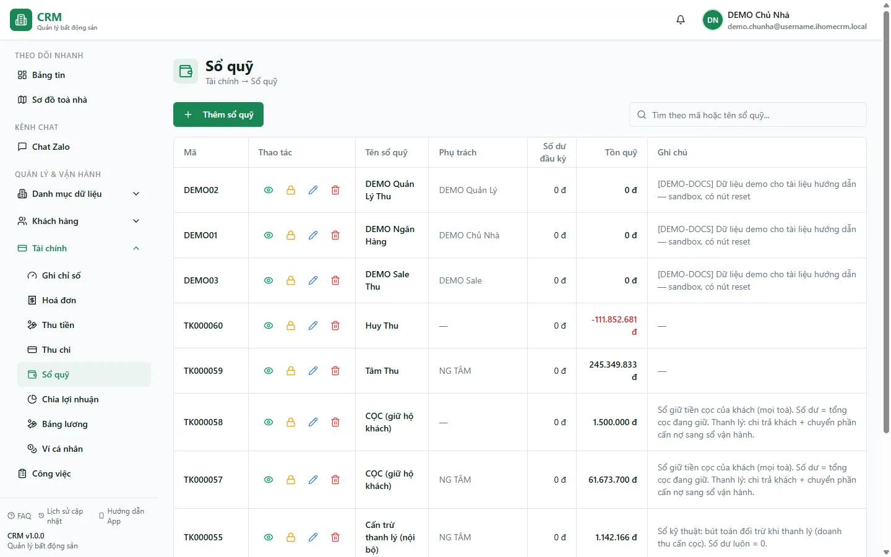
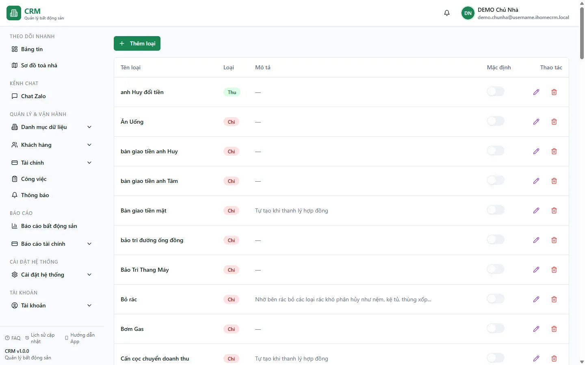

# Bước 5: Sổ quỹ, tài khoản & loại thu chi

**Sổ quỹ** là nơi ghi số dư và dòng tiền thực tế; **loại thu chi** là danh mục phân loại từng khoản. Hai trang chuẩn là `/finance/cashbooks` và `/settings/income-expense-types`.

::: info Điều kiện tiên quyết
- Mở/tạo sổ cần `cashbooks.view` / `cashbooks.create`. Mở/tạo loại thu chi cần `categories.view` / `categories.create`.
- Capability không thay thế quyền sở hữu/giữ sổ. Các thao tác ghi sổ, bàn giao và chốt kỳ còn chịu kiểm tra possession ở server.
- Chuẩn bị số dư đầu kỳ, ngày chốt đầu kỳ, người phụ trách và danh sách toà dùng cho phiếu nhanh.
:::

## Tạo sổ quỹ

**Bước 1**: Vào **Quản lý & Vận hành** => **Sổ quỹ** (`/finance/cashbooks`).

Snapshot production ngày 13/08/2026 của `demo.chunha` có một sổ: **DEMO-CASH — DEMO Quỹ tiền mặt**.

**Bước 2**: Ấn **Thêm**, điền **Tên sổ**, **Số dư đầu kỳ**, **Ngày chốt số dư đầu kỳ**, mô tả và **Người phụ trách** (quản trị mới chọn được người khác).

**Bước 3**: Nếu cần, chọn **Toà nhà mặc định khi tạo phiếu nhanh**. Khi phiếu nhanh chọn toà này, sổ được gợi ý nhưng người dùng vẫn có thể đổi.

**Bước 4**: Ấn **Lưu**. Sổ mới tự cấp vai trò **Người giữ sổ (CUSTODIAN)** cho người phụ trách. Muốn giao thêm quyền, mở lại sổ sau khi tạo.

### Quyền truy cập sổ hiện hành

- **CUSTODIAN — Người giữ sổ**: được Thu/Chi, nhưng vẫn cần capability thao tác như `cashbooks.post` khi server yêu cầu.
- **KNOWER — Người biết sổ**: được xem sổ và số dư, không được ghi tiền.
- Sửa danh sách người giữ/biết sổ cần `cashbooks.share` và điều kiện chủ sổ/quản trị. Người dùng không thể tự đổi vai trò của chính mình trong form.
- `cashbooks.close` chỉ mở đề nghị chốt/bàn giao; `cashbooks.close_confirm` là bước người khác xác nhận và khoá kỳ vĩnh viễn.

::: warning Capability và possession phải đồng thời đúng
Có `cashbooks.post` nhưng không đang giữ sổ thì vẫn không ghi sổ được. Ngược lại, đang là CUSTODIAN nhưng thiếu capability tương ứng cũng không mở được thao tác.
:::

## Tạo loại thu chi

**Bước 5**: Mở **Cài đặt hệ thống** => **Loại thu chi** (`/settings/income-expense-types`).

**Bước 6**: Ấn **Thêm**, nhập **Tên hạng mục**, chọn **Thu/Chi**, chọn hoặc tạo **Nhóm**, điền mô tả. Người có `income_expenses.restricted_view` có thể bật **Hạng mục hạn chế**.

**Bước 7**: Bật **Hạng mục đặc biệt** khi muốn báo cáo Phân bổ lợi nhuận có thể ẩn/hiện các dòng thuộc hạng mục đó. Form hiện tại không có cờ “Cọc”; không dùng tên hạng mục để suy ra cách hạch toán cọc.

## Các tính năng và trạng thái

| Thành phần | Ý nghĩa |
|---|---|
| Số dư / ngày đầu kỳ | Mốc tính số dư trước các phiếu đã ghi sổ. |
| Toà mặc định | Gợi ý sổ khi tạo phiếu nhanh cho toà; không phải quyền truy cập toà. |
| CUSTODIAN / KNOWER | Vai trò giữ tiền hoặc chỉ biết/xem sổ trong access mode hiện hành. |
| Hạng mục hạn chế | Chỉ người có quyền dữ liệu hạn chế mới thấy hạng mục và phiếu liên quan. |
| Hạng mục đặc biệt | Cho phép ẩn/hiện hạng mục trong báo cáo Phân bổ lợi nhuận. |
| Kỳ đã xác nhận chốt | Phiếu có ngày trong kỳ bị khoá vĩnh viễn; không ai mở lại được. |

## Tình huống & lỗi thường gặp

| Tình huống | Cách xử lý |
|---|---|
| Không thấy một sổ dù có `cashbooks.view` | Bạn chưa là CUSTODIAN/KNOWER hoặc chưa có phạm vi sổ phù hợp. |
| Có nút ghi sổ nhưng server từ chối | Kiểm tra đồng thời capability và người đang giữ sổ. |
| Muốn giao quyền ngay khi vừa tạo sổ | Lưu sổ trước, mở lại rồi gán CUSTODIAN/KNOWER. |
| Không thấy tuỳ chọn **Hạng mục hạn chế** | Tài khoản thiếu `income_expenses.restricted_view`. |
| Muốn đánh dấu “Cọc” | Form loại thu chi hiện không cung cấp cờ này; dùng quy trình cọc/hợp đồng chuyên biệt. |
| Số dư không khớp | Kiểm tra số dư/ngày đầu kỳ và trạng thái phiếu đã thực sự được ghi vào sổ. |

## Thử trực tiếp trên sandbox

<SandboxTry account="demo.ketoan" app-path="/finance/cashbooks" app-label="Mở màn Sổ quỹ" view-only>

1. Xem các sổ mà `demo.ketoan` có quyền và possession trong tổ chức DEMO.
2. Mở chi tiết một sổ để quan sát người phụ trách, số dư đầu kỳ và toà mặc định.
3. Chuyển sang `/settings/income-expense-types` để phân biệt loại **Thu**, **Chi**, nhóm, hạng mục hạn chế và hạng mục đặc biệt.

</SandboxTry>

## Quy trình liên quan

- [Khởi tạo dữ liệu](/01-bat-dau/khoi-tao-du-lieu/)
- [Tạo khu vực & toà nhà](/01-bat-dau/tao-toa-nha/)
- [Thêm nhân viên & phân quyền](/01-bat-dau/them-nhan-vien/)
