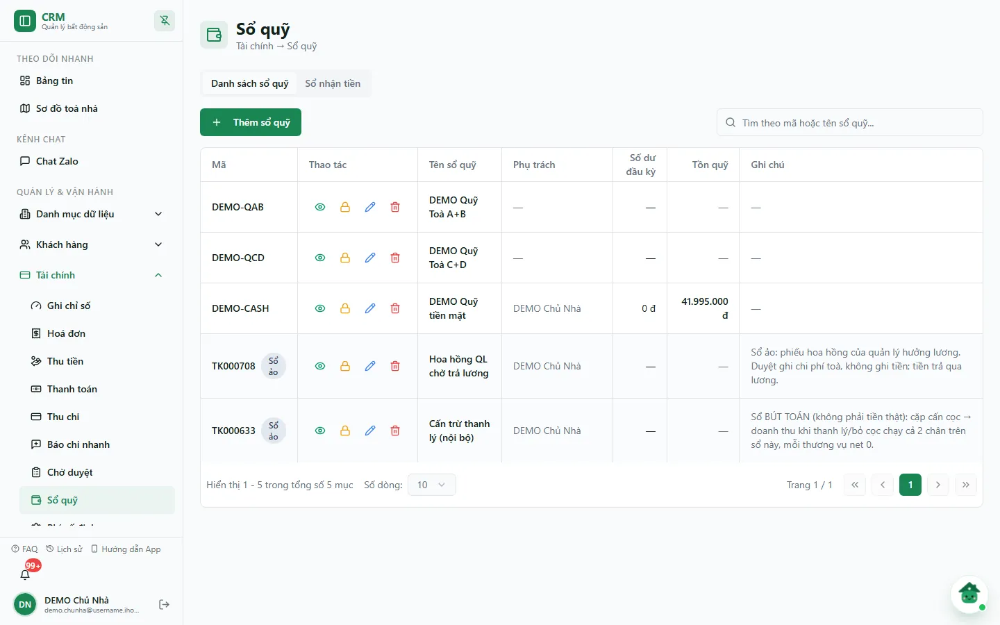
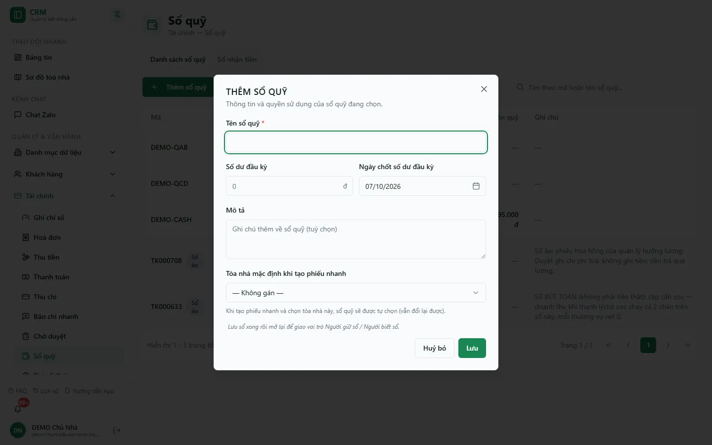
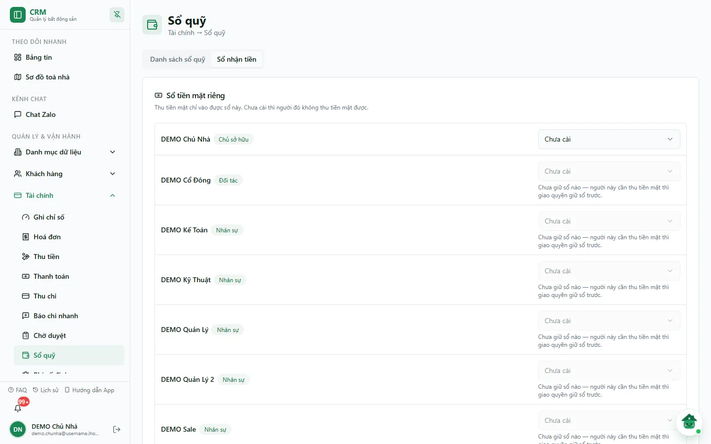
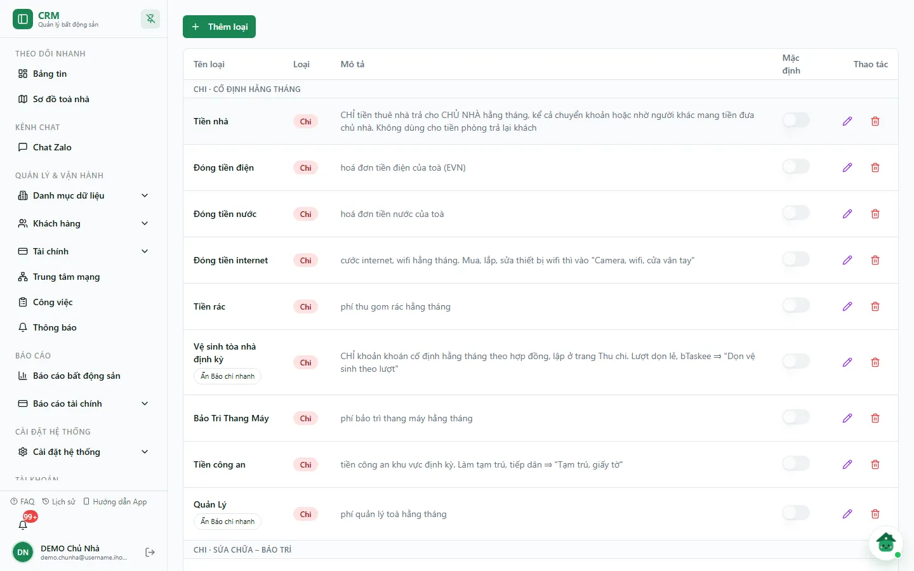

# Bước 5: Sổ quỹ, tài khoản & loại thu chi

**Sổ quỹ** là nơi ghi số dư và dòng tiền thực tế (két tiền mặt, tài khoản ngân hàng, ví); **sổ nhận tiền** quyết định tiền thu được ghi vào sổ nào; **loại thu chi** là danh mục phân loại từng khoản. Ba việc này phải xong trước khi bắt đầu thu tiền và lập phiếu chi.

::: info Điều kiện tiên quyết
- Mở/tạo sổ cần `cashbooks.view` / `cashbooks.create`. Mở trang loại thu chi cần `categories.view`.
- Thêm/sửa loại thu chi và cài **Sổ nhận tiền** chỉ dành cho **chủ công ty** (và quản trị hệ thống).
- Capability không thay thế quyền giữ sổ. Các thao tác ghi sổ, bàn giao và chốt kỳ còn chịu kiểm tra người đang giữ sổ ở máy chủ.
- Chuẩn bị số dư đầu kỳ, ngày chốt đầu kỳ và danh sách toà dùng cho phiếu nhanh.
:::

::: warning "Đã duyệt" chưa phải là tiền đã vào/ra sổ
Phiếu thu chi đi qua bước duyệt (workflow) rồi mới được **ghi sổ**. Chỉ phiếu ở trạng thái **Đã Thu / Đã Chi** (đã ghi sổ — `posting_status = POSTED`) mới làm thay đổi **Tồn quỹ**. Phiếu *đã duyệt* nhưng chưa ghi sổ không cộng/trừ vào số dư.
:::

## Tạo sổ quỹ

**Bước 1**: Vào **Quản lý & Vận hành** => **Tài chính** => **Sổ quỹ** (`/finance/cashbooks`). Với chủ công ty, trang có hai tab **Danh sách sổ quỹ** và **Sổ nhận tiền**; người khác chỉ thấy danh sách. Bảng gồm các cột **Mã**, **Thao tác**, **Tên sổ quỹ**, **Phụ trách**, **Số dư đầu kỳ**, **Tồn quỹ**, **Ghi chú**.

Sổ gắn nhãn **Sổ ảo** là sổ bút toán/kỹ thuật — không phải tiền thật trong két (ví dụ sổ hoa hồng chờ trả lương, sổ cấn trừ khi thanh lý). Không dùng sổ ảo để thu chi tiền mặt.

**Bước 2**: Ấn **Thêm sổ quỹ**. Hộp thoại **THÊM SỔ QUỸ** mở ra: điền **Tên sổ quỹ** (bắt buộc), **Số dư đầu kỳ**, **Ngày chốt số dư đầu kỳ** và **Mô tả** nếu cần. Ô **Người phụ trách** chỉ hiện với quản trị hệ thống; người khác tạo sổ thì chính họ là người phụ trách.

**Bước 3**: Nếu cần, chọn **Tòa nhà mặc định khi tạo phiếu nhanh**. Khi tạo phiếu nhanh và chọn toà này, sổ được tự chọn (vẫn đổi lại được). Đây chỉ là gợi ý, không phải quyền truy cập toà.

**Bước 4**: Ấn **Lưu**. Sổ mới tự cấp vai trò **Người giữ sổ** cho người phụ trách. Muốn giao thêm người, lưu xong rồi **Chỉnh sửa** (bút chì) sổ đó: hộp thoại có thêm hai danh sách **Người giữ sổ** và **Người được xem sổ**.

### Quyền truy cập sổ

- **Người giữ sổ** (CUSTODIAN): trực tiếp giữ tiền — được Thu/Chi (ghi sổ) trên sổ, nhưng vẫn cần capability thao tác như `cashbooks.post`.
- **Người được xem sổ** (KNOWER): xem sổ quỹ và số dư, không được Thu/Chi.
- Sửa hai danh sách này cần `cashbooks.share` và là chủ sổ hoặc quản trị. Vai trò của chính bạn bị khoá — không tự đổi được.
- `cashbooks.close` cho phép **đề nghị chốt & bàn giao quỹ**; `cashbooks.close_confirm` là bước người nhận xác nhận, sau đó kỳ bị **khoá vĩnh viễn**.

::: warning Capability và quyền giữ sổ phải đồng thời đúng
Có `cashbooks.post` nhưng không đang giữ sổ thì vẫn không ghi sổ được. Ngược lại, đang là Người giữ sổ nhưng thiếu capability tương ứng cũng không mở được thao tác.
:::

## Cài sổ nhận tiền (chủ công ty)

**Bước 5**: Chuyển sang tab **Sổ nhận tiền** (`/finance/cashbooks?tab=so-nhan-tien`). Màn có hai khối:

- **Sổ tiền mặt riêng**: mỗi thành viên một sổ. Thu tiền mặt chỉ vào được sổ này; **Chưa cài** thì người đó không thu tiền mặt được. Chỉ chọn được sổ mà người đó đang giữ — chưa giữ sổ nào thì phải giao quyền giữ sổ trước.
- **Chuyển khoản / Thanh toán theo toà**: mỗi toà có hai ô **Chuyển khoản** và **Thanh toán**, mỗi ô gồm **Sổ mặc định** (chọn sẵn khi thu) và **Sổ phụ**. Người thu chỉ thấy các sổ trong danh sách mà họ đang giữ hoặc được xem.

::: tip Thay cho sổ mặc định TT/TK trong form toà
Trước đây sổ nhận tiền mặc định đặt trong form Toà nhà. Nay form toà chỉ còn ghi chú trỏ về tab **Sổ nhận tiền** này.
:::

## Tạo loại thu chi

**Bước 6**: Mở **Cài đặt hệ thống** => **Danh mục khác** => **Loại thu chi** (`/settings/income-expense-types`; địa chỉ cũ `/settings/categories/income-expense-types` tự chuyển về đây). Bảng nhóm theo **Thu/Chi · Nhóm**, với các cột **Tên loại**, **Loại**, **Mô tả**, **Mặc định**, **Thao tác**. Nhãn nhỏ dưới tên cho biết mục **Hệ thống**, **Ẩn khi lập tay** hoặc **Ẩn Báo chi nhanh**.

::: warning Chỉ chủ công ty thêm/sửa hạng mục
Từ 03/10/2026 công ty dùng **danh mục chi chuẩn**: chỉ **chủ công ty** (và quản trị hệ thống) thấy nút **Thêm loại** và các nút sửa/xoá. Người khác xem danh sách ở chế độ chỉ đọc với dòng "Cần hạng mục mới? Báo chủ công ty thêm."
:::

**Bước 7**: Ấn **Thêm loại**. Trong hộp **Thêm loại thu chi**, nhập **Tên loại**, chọn **Loại Thu/Chi**, chọn **Nhóm (Loại)** (gõ tên mới để tạo nhóm mới), điền **Mô tả** — mô tả rõ "dùng cho việc gì" để Báo chi nhanh phân biệt với mục gần giống.

**Bước 8**: Bật **Mặc định** nếu muốn mục được gợi ý sẵn. Bật **Hạng mục đặc biệt** khi muốn báo cáo Phân bổ lợi nhuận có thể ẩn các dòng thuộc hạng mục đó (ví dụ "Tiền nhà"). Form không có cờ "Cọc"; không dùng tên hạng mục để suy ra cách hạch toán cọc.

**Bước 9** (khối **Danh mục chuẩn**): điền **Cụm từ hay nói** (cách nhau bằng dấu phẩy, vd `bơm gas, xả giàn, thợ điện lạnh`) để ô tìm và [Báo chi nhanh](/03-quan-ly-van-hanh/bao-chi-nhanh/) nhận ra hạng mục; **Thứ tự trong ô chọn** (để trống = xếp cuối theo tên); bật **Ẩn khỏi Báo chi nhanh** cho mục chỉ lập ở màn Thu chi. Ấn **Lưu**.

**Khi sửa mục cũ trùng nghĩa**: khối **Lưu trữ / gộp vào** chỉ hiện khi sửa — bật **Lưu trữ hạng mục** và chọn **Gộp vào** mục chuẩn. Phiếu cũ giữ nguyên, báo cáo cộng mục cũ vào mục chuẩn.

::: info Hạng mục hạn chế
Cờ **Hạng mục hạn chế** không nằm trên trang này mà ở hộp thêm/sửa hạng mục nhanh ngay trong ô chọn hạng mục của phiếu thu chi, và chỉ hiện với người có `income_expenses.restricted_view`.
:::

::: tip Cam kết chi
Nếu công ty bật duyệt chi theo cam kết, chủ công ty cấu hình ở **Tài chính** => **Cam kết chi** (`/settings/finance/cam-ket-chi`). Màn này chỉ chủ công ty đọc/sửa được.
:::

## Các tính năng và trạng thái

| Thành phần | Ý nghĩa |
|---|---|
| Số dư / ngày đầu kỳ | Mốc tính số dư trước các phiếu đã ghi sổ. |
| **Tồn quỹ** | Số dư theo sổ, chỉ tính phiếu đã ghi sổ (**Đã Thu / Đã Chi**). |
| **Sổ ảo** | Sổ bút toán/kỹ thuật, không phải tiền thật trong két. |
| Thao tác trên dòng sổ | **Xem chi tiết** (mắt), **Chốt sổ & bàn giao quỹ** (ổ khoá), **Chỉnh sửa** (bút chì), **Xoá** (thùng rác). |
| Toà mặc định | Gợi ý sổ khi tạo phiếu nhanh cho toà; không phải quyền truy cập toà. |
| Người giữ sổ / Người được xem sổ | Vai trò giữ tiền hoặc chỉ xem sổ. |
| Sổ tiền mặt riêng / Sổ nhận theo toà | Quyết định tiền thu vào sổ nào; chưa cài thì không thu được bằng hình thức đó. |
| Hạng mục đặc biệt | Cho phép ẩn/hiện hạng mục trong báo cáo Phân bổ lợi nhuận. |
| Đã lưu trữ → gộp vào … | Mục cũ không còn trong ô chọn; phiếu cũ giữ nguyên, báo cáo cộng vào mục được gộp vào. |
| Ẩn khỏi Báo chi nhanh | Mục vẫn chọn được ở màn Thu chi nhưng không có ở Báo chi nhanh. |
| Kỳ đã xác nhận chốt | Phiếu có ngày trong kỳ bị khoá vĩnh viễn; không ai mở lại được. Biên bản xem tại `/finance/cashbooks/closure/:id` (**BIÊN BẢN CHỐT SỔ & BÀN GIAO QUỸ**). |

::: warning Chốt sổ & bàn giao là không hoàn tác
Hộp **Chốt sổ & bàn giao quỹ** đi qua 3 bước: dọn các việc còn chặn, chọn **Người nhận bàn giao (sẽ ký xác nhận)**, gõ `CHOT SO` để gửi đề nghị. Khi người nhận xác nhận, mọi phiếu có ngày phát sinh ≤ ngày chốt không sửa, huỷ hay xoá được nữa — kể cả chủ tổ chức; sai sót phát hiện sau phải xử lý bằng phiếu điều chỉnh ở kỳ hiện tại. Xem [Sổ quỹ](/03-quan-ly-van-hanh/so-quy/).
:::

## Tình huống & lỗi thường gặp

| Tình huống | Cách xử lý |
|---|---|
| Không thấy một sổ dù có `cashbooks.view` | Bạn chưa là Người giữ sổ / Người được xem sổ hoặc chưa có phạm vi sổ phù hợp. |
| Có nút ghi sổ nhưng máy chủ từ chối | Kiểm tra đồng thời capability và người đang giữ sổ. |
| Muốn giao quyền ngay khi vừa tạo sổ | Lưu sổ trước, mở lại bằng **Chỉnh sửa** rồi chọn Người giữ sổ / Người được xem sổ. |
| Không thấy tab **Sổ nhận tiền** | Chỉ chủ công ty hoặc quản trị hệ thống thấy tab này (trên máy tính). |
| Nhân viên không thu được tiền mặt | Chưa cài **Sổ tiền mặt riêng** cho người đó; nếu ô bị mờ, giao quyền giữ sổ cho họ trước. |
| Không thấy nút **Thêm loại** | Tài khoản không phải chủ công ty — báo chủ công ty thêm hạng mục. |
| Không thấy tuỳ chọn **Hạng mục hạn chế** | Cờ này chỉ có ở hộp thêm hạng mục nhanh trong phiếu và cần `income_expenses.restricted_view`. |
| Phiếu đã duyệt nhưng **Tồn quỹ** không đổi | Phiếu chưa được ghi sổ (chưa ở trạng thái **Đã Thu / Đã Chi**). |
| Số dư không khớp | Kiểm tra số dư/ngày đầu kỳ và trạng thái ghi sổ của các phiếu. |

## Thử trực tiếp trên sandbox

<SandboxTry account="demo.ketoan" app-path="/finance/cashbooks" app-label="Mở màn Sổ quỹ" view-only>

Snapshot 07/10/2026 (nhìn bằng `demo.chunha`): năm sổ **DEMO-QAB** (Quỹ Toà A+B), **DEMO-QCD** (Quỹ Toà C+D), **DEMO-CASH** (Quỹ tiền mặt) và hai sổ ảo. `demo.ketoan` có thể thấy ít hơn tuỳ quyền giữ/xem sổ.

1. Xem các sổ mà `demo.ketoan` có quyền trong tổ chức DEMO; đối chiếu cột **Số dư đầu kỳ** và **Tồn quỹ**.
2. Mở **Xem chi tiết** một sổ để quan sát người phụ trách, số dư đầu kỳ và toà mặc định.
3. Chuyển sang `/settings/income-expense-types` để phân biệt loại **Thu**, **Chi**, nhóm, các nhãn **Ẩn Báo chi nhanh** / **Hệ thống**.

</SandboxTry>

## Quy trình liên quan

- [Khởi tạo dữ liệu](/01-bat-dau/khoi-tao-du-lieu/)
- [Sổ quỹ (vận hành)](/03-quan-ly-van-hanh/so-quy/) — chốt sổ, bàn giao và đối chiếu hằng ngày.
- [Thu chi](/03-quan-ly-van-hanh/thu-chi/) — lập, duyệt và ghi sổ phiếu thu chi.
- [Báo chi nhanh](/03-quan-ly-van-hanh/bao-chi-nhanh/) — báo chi bằng giọng nói/ảnh, dùng danh mục chi chuẩn.
- [Tạo khu vực & toà nhà](/01-bat-dau/tao-toa-nha/)
- [Thêm nhân viên & phân quyền](/01-bat-dau/them-nhan-vien/)
