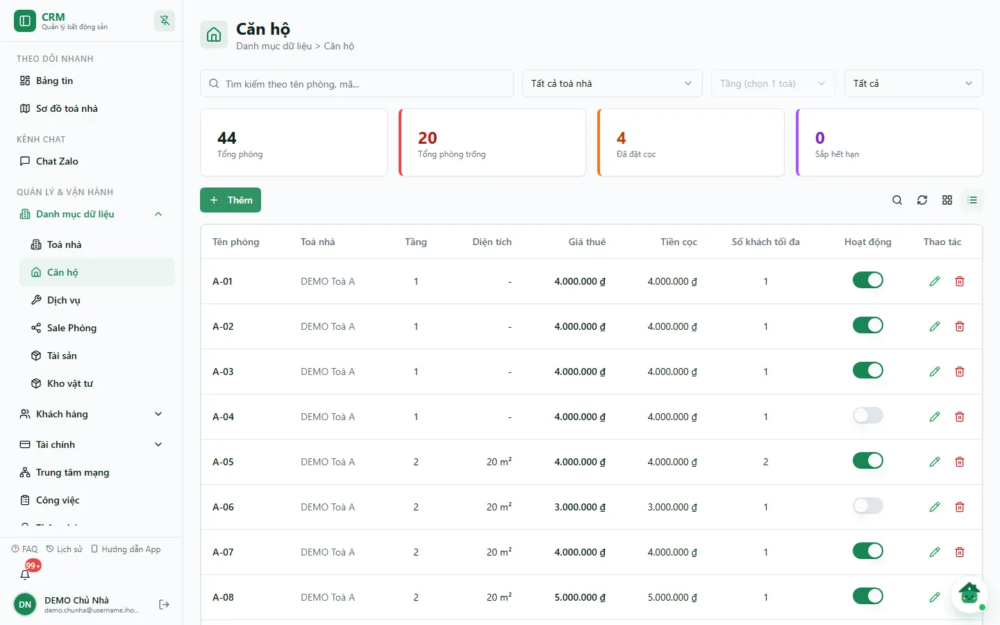
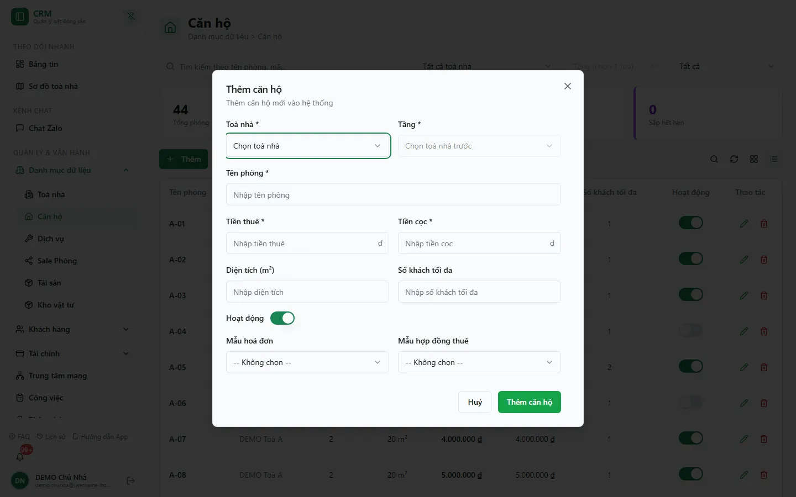

# Bước 2: Tạo tầng & phòng

Sau khi có toà nhà, bạn khai báo từng **phòng** (căn hộ) bên trong — đây là đơn vị cho thuê thực tế mà mọi hợp đồng, hoá đơn, công tơ điện nước và phiếu thu chi sẽ neo vào. Trang này hướng dẫn bạn thêm căn hộ, điền tiền thuê và tiền cọc, tạo tầng khi cần, và hiểu vì sao trạng thái phòng lại tự đổi mà không cần bạn sửa tay.

::: info Điều kiện tiên quyết

- `rooms.view` để mở trang và `rooms.create` để thêm phòng; toà/phòng chỉ hiện trong phạm vi được giao.
- Đã tạo ít nhất **1 toà nhà đang hoạt động** ở [Bước 1](/01-bat-dau/tao-toa-nha/) — ô chọn toà trong form chỉ liệt kê toà có trạng thái **Đang hoạt động**.
- Nắm sẵn tiền thuê và tiền cọc dự kiến của từng phòng (cả hai đều bắt buộc).

:::

## Hướng dẫn từng bước

**Bước 1**: Ở menu bên trái, mở **Quản lý & Vận hành** => **Danh mục dữ liệu** => **Căn hộ** (`/apartments`). Màn hình có hàng bộ lọc, bốn thẻ thống kê (**Tổng phòng**, **Tổng phòng trống**, **Đã đặt cọc**, **Sắp hết hạn**) và bảng căn hộ với các cột **Tên phòng**, **Toà nhà**, **Tầng**, **Diện tích**, **Giá thuê**, **Tiền cọc**, **Số khách tối đa**, **Hoạt động**, **Thao tác**.

**Bước 2**: Nếu danh sách dài, dùng ô **Tìm kiếm theo tên phòng, mã...**, ô chọn toà (chọn được nhiều toà, hoặc bấm tên khu vực để chọn cả nhóm) để thu hẹp. Ô **Tầng** chỉ bật khi bộ lọc còn đúng một toà (lúc chưa đủ điều kiện hiện chữ *Tầng (chọn 1 toà)*).

**Bước 3**: Ấn **Thêm** (phía trên bảng). Hộp thoại **Thêm căn hộ** mở ra.

**Bước 4**: Chọn **Toà nhà**. Danh sách chỉ hiện toà **Đang hoạt động** trong phạm vi của bạn. Dòng **+ Thêm toà nhà** cuối danh sách mở hộp **Thêm toà nhà nhanh** chỉ hỏi tên và mã; vì form toà chuẩn đòi đủ địa chỉ, đường chuẩn vẫn là tạo toà tại `/buildings` trước.

**Bước 5**: Chọn **Tầng**. Ô tầng chỉ mở sau khi đã chọn toà (trước đó hiện *Chọn toà nhà trước*) và lọc theo đúng toà đó. Nếu tầng chưa có, chọn **+ Thêm tầng** ngay trong ô — hộp **Thêm tầng nhanh** hỏi **Số tầng** (bắt buộc) và **Tên tầng**, rồi tự gắn vào toà đang chọn.

::: tip Về danh mục Tầng
Bạn có thể xem lại các tầng đã tạo ở **Cài đặt hệ thống** => **Danh mục khác** => **Danh sách tầng** ([hướng dẫn](/05-cai-dat/danh-sach-tang/)). Danh mục này chỉ dùng để **đặt tên và lọc** phòng theo tầng — số tầng của phòng nằm ngay trong từng phòng. Form ở trang danh mục không có ô chọn toà, nên hãy tạo tầng qua **+ Thêm tầng** trong form căn hộ để tầng gắn đúng toà.
:::

**Bước 6**: Điền **Tên phòng** (ví dụ `A-01`). Tên phòng phải **duy nhất trong cùng một toà** — trùng tên sẽ bị chặn với thông báo "Tên căn hộ đã có trong tòa nhà này." Hai toà khác nhau thì được phép trùng tên phòng.

**Bước 7**: Điền **Tiền thuê** và **Tiền cọc** (bắt buộc; chấp nhận `0`, không chấp nhận số âm). Đây là giá niêm yết hệ thống gợi ý khi lập hợp đồng; giá thực tế của khách đang ở nằm trong hợp đồng.

**Bước 8**: (Tuỳ chọn) Điền **Diện tích (m²)**, **Số khách tối đa**; để công tắc **Hoạt động** bật nếu phòng sẵn sàng cho thuê; chọn **Mẫu hoá đơn** và **Mẫu hợp đồng thuê** riêng cho phòng nếu khác mẫu của toà.

**Bước 9**: Ấn **Thêm căn hộ**. Phòng mới xuất hiện trong danh sách với trạng thái nền **Trống** (AVAILABLE) nếu công tắc Hoạt động bật, và số căn hộ của toà tự tăng lên.

## Hiểu trạng thái phòng

Trạng thái phòng được lưu ở từng phòng và hiển thị trên **Sơ đồ toà nhà**, chi tiết phòng và các thẻ thống kê. Có 5 giá trị lưu:

| Trạng thái (nhãn) | Ý nghĩa | Ai đặt |
| --- | --- | --- |
| **Trống** (AVAILABLE) | Chưa có khách, sẵn sàng cho thuê | Mặc định khi tạo phòng (công tắc Hoạt động bật) |
| **Đang thuê** (OCCUPIED) | Đang có hợp đồng còn hiệu lực | Tự động theo hợp đồng |
| **Đã đặt cọc** (RESERVED) | Có phiếu cọc giữ chỗ nhưng chưa ký hợp đồng | Tự động theo phiếu cọc |
| **Bảo trì** (MAINTENANCE) | Đang sửa chữa, tạm không cho thuê | Đặt tay khi cần |
| **Ngừng hoạt động** (UNAVAILABLE) | Không đưa vào khai thác | Tắt công tắc **Hoạt động** |

::: warning Phân biệt trạng thái lưu và trạng thái hiển thị
Bảng căn hộ trên máy tính **không có cột trạng thái** — chỉ có công tắc **Hoạt động**, và công tắc này chỉ đổi trạng thái nền **Trống ⇄ Ngừng hoạt động**. Các trạng thái **Đang thuê**, **Sắp hết hạn**, **Đã đặt cọc** được tính từ hợp đồng và cọc; xem chúng ở [Sơ đồ toà nhà](/02-theo-doi-nhanh/so-do-toa-nha/) hoặc thẻ thống kê. Công tắc không thay thế thao tác hợp đồng hoặc cọc.
:::

## Các tính năng khác trên màn hình

| Nút / Bộ lọc | Công dụng |
| --- | --- |
| Ô **Tìm kiếm** | Tìm phòng theo tên hoặc mã. |
| Ô chọn **toà nhà / khu vực** | Chọn nhiều toà; bấm tên khu vực là chọn cả nhóm toà. |
| **Tầng** | Lọc theo tầng — chỉ bật khi đã chọn đúng 1 toà. |
| **Trạng thái hoạt động** | **Tất cả** / **Đang hoạt động** / **Đã đặt cọc** / **Ngừng hoạt động**. |
| Thẻ thống kê | **Tổng phòng**, **Tổng phòng trống**, **Đã đặt cọc**, **Sắp hết hạn** — tính theo danh sách đang lọc. |
| Khối **Dọn/sửa cần cập nhật** | Chỉ hiện khi có phòng sau trả phòng đang chờ dọn/sửa; người có quyền ấn **Cập nhật dọn/sửa** để hẹn ngày xong, phân công hoặc ghi nhận phòng đã sẵn sàng. |
| Biểu tượng **Sửa** | Mở lại hộp thoại **Sửa căn hộ** để chỉnh thông tin; khi sửa có thêm phần lịch sử giá thuê/cọc. |
| Công tắc **Hoạt động** | Bật/tắt nhanh Trống ⇄ Ngừng hoạt động (xem cảnh báo phía trên). |
| Biểu tượng **Xoá** | Xoá mềm phòng (ẩn khỏi danh sách, số căn hộ của toà giảm theo). |
| **Dạng lưới / Dạng danh sách**, **Làm mới** | Đổi cách hiển thị và tải lại dữ liệu. |

Các bộ lọc trên được **giữ nguyên khi bạn tải lại trang (F5)**.

## Tình huống & lỗi thường gặp

| Tình huống | Cách xử lý |
| --- | --- |
| Không thấy toà nhà trong ô chọn khi thêm phòng | Toà phải **Đang hoạt động** và nằm trong phạm vi tài khoản. Tạo/sửa toà ở `/buildings`. |
| Báo "Tên căn hộ đã có trong tòa nhà này." | Trong một toà, tên phòng phải là duy nhất. Đổi tên khác, hoặc kiểm tra phòng cũ đã bị xoá mềm hay chưa. |
| Ô **Tầng** trên bộ lọc bị mờ | Chỉ bật khi lọc đúng 1 toà. Chọn 1 toà trước. |
| Ô **Tầng** trong form bị mờ | Chưa chọn **Toà nhà**. Chọn toà trước, danh sách tầng hiện theo. |
| Không lưu được vì thiếu tiền thuê / tiền cọc | **Tiền thuê** và **Tiền cọc** đều bắt buộc và không được âm. Nhập `0` nếu thực sự bằng 0. |
| Form báo chưa tải đủ toà nhà, tầng hoặc mẫu tài liệu | Ấn **Tải lại nguồn** rồi mới lưu. |
| Phòng tự đổi sang **Đã đặt cọc** / **Đang thuê** dù bạn không sửa | Đây là hành vi đúng: trạng thái theo phiếu cọc và hợp đồng tự cập nhật. Không cần chỉnh tay. |

## Thử trực tiếp trên sandbox

<SandboxTry account="demo.quanly" app-path="/apartments" app-label="Mở màn Căn hộ" fixtures="DEMO Toà A và DEMO Toà B" view-only>

Tài khoản `demo.quanly` hiện được giao **DEMO Toà A + B**; `demo.quanly2` dùng phạm vi **DEMO Toà C + D**. Toàn tổ chức DEMO có 44 phòng (snapshot 07/10/2026).

1. Xem danh sách phòng, quan sát các cột giá thuê, tiền cọc, số khách tối đa và công tắc **Hoạt động**.
2. Chọn **DEMO Toà A** ở ô toà nhà để chỉ còn phòng của toà đó; ô **Tầng** lúc này mới bật.
3. Ấn **Thêm** để xem các trường của form **Thêm căn hộ**, rồi đóng bằng **Huỷ**.
4. Mở **Sơ đồ toà nhà** để đối chiếu các phòng **Trống**, **Đang thuê**, **Đã đặt cọc**.

**Kết quả mong đợi:** bạn phân biệt được trạng thái nền (công tắc Hoạt động) với trạng thái tính từ hợp đồng/cọc, và biết phòng nào đang trống, đang thuê hay đang giữ chỗ.

</SandboxTry>

## Quy trình liên quan

- [Bước 1: Tạo khu vực & toà nhà](/01-bat-dau/tao-toa-nha/) — tạo toà nhà trước khi thêm phòng.
- [Bước 3: Dịch vụ & định mức](/01-bat-dau/dich-vu-dinh-muc/) — khai báo điện, nước, phí dịch vụ cho phòng.
- [Sơ đồ toà nhà](/02-theo-doi-nhanh/so-do-toa-nha/) — xem trực quan tình trạng phòng theo tầng.
- [Căn hộ / Phòng](/03-quan-ly-van-hanh/can-ho-phong/) — quản lý phòng trong vận hành hằng ngày.
