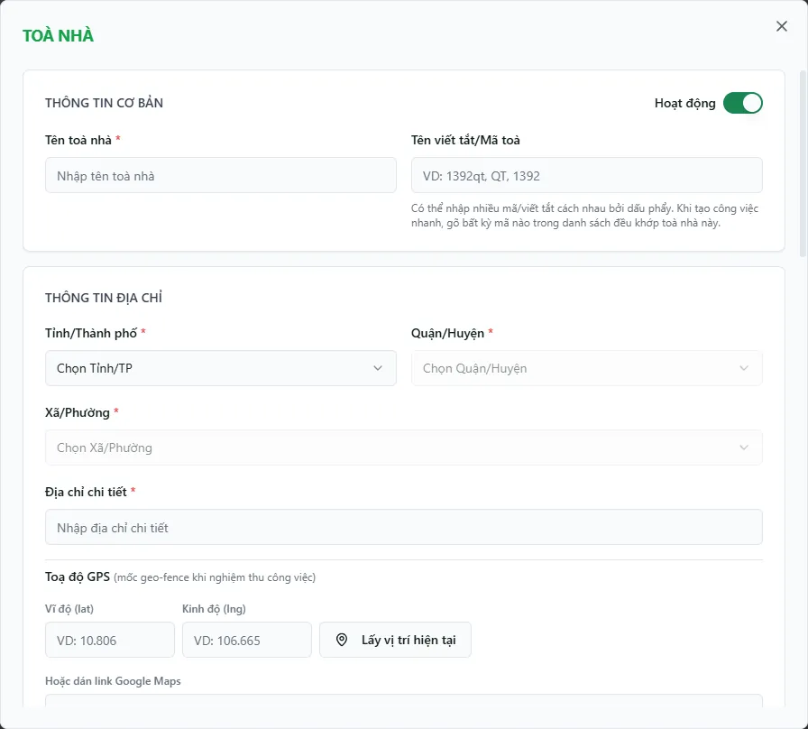

# Bước 1: Tạo khu vực & toà nhà

Toà nhà là đơn vị trung tâm của cả hệ thống: mọi hợp đồng, hoá đơn, công tơ, sổ quỹ và báo cáo sau này đều gắn với một toà. Đây là việc đầu tiên bạn làm khi khởi tạo dữ liệu — tạo **khu vực** (nhãn nhóm các toà theo địa bàn) rồi **thêm từng toà nhà**. Bạn quay lại màn hình này mỗi khi tiếp nhận thêm một toà mới để vận hành.

::: info Điều kiện tiên quyết
- Tài khoản có `buildings.view` để mở trang và `buildings.create` để thêm toà. Tạo khu vực cần thêm `areas.create`.
- Capability và phạm vi là hai lớp độc lập: role name không tự cấp quyền; dữ liệu chỉ hiện trong phạm vi hiệu lực. Với thao tác tạo dữ liệu cấp tổ chức, nên dùng phạm vi **Toàn tổ chức**.
- Chưa cần dữ liệu nào khác: đây là bước khởi tạo đầu tiên, tầng/phòng và dịch vụ sẽ thêm ở các bước sau.
:::

## Hướng dẫn từng bước

**Bước 1**: Tại thanh menu bên trái, mở **Quản lý & Vận hành** => **Toà nhà** (`/buildings`). Bạn thấy các thẻ thống kê, ô tìm kiếm và danh sách những toà nằm trong phạm vi được giao.

**Bước 2**: Ấn nút **Quản lý khu vực** trên thanh công cụ. Trong hộp thoại vừa mở, điền tên vào ô **Tên khu vực mới** (ví dụ "Khu Trung Tâm") rồi ấn **Thêm**. Khu vực mới hiện thành một thẻ trong danh sách; mỗi khu chỉ cần một cái tên, không có ô mã hay mô tả.

::: tip Khu vực là nhãn nhóm, không bắt buộc
Một toà có thể thuộc **nhiều khu vực** cùng lúc (ví dụ vừa "Nhà cũ" vừa "Thang bộ"). Khu vực chỉ dùng để nhóm và lọc cho gọn — bạn có thể tạo toà trước, gán vào khu sau. Việc gán/bỏ toà khỏi khu cũng làm ngay trong hộp thoại **Quản lý khu vực** này.
:::

**Bước 3**: Đóng hộp thoại khu vực, quay lại danh sách và ấn nút **Thêm** để mở form tạo toà. Hộp thoại **Toà nhà** hiện ra với các khối: thông tin cơ bản và địa chỉ, **Dịch vụ toà nhà**, **Cấu hình**, và **Hoa hồng môi giới**.

**Bước 4**: Điền thông tin toà. Các trường bắt buộc gồm **tên toà**, **tỉnh/thành**, **quận/huyện**, **phường/xã** và **địa chỉ chi tiết**. **Mã toà** là nhãn/alias tuỳ chọn để tìm kiếm và nhận diện nhanh. Cơ sở dữ liệu hiện không chặn mã trùng, nhưng bạn nên chủ động đặt mã khác nhau để tránh chọn nhầm toà trong bộ lọc và các form nghiệp vụ. Ô **Tổng số phòng** hệ thống tự đếm — không nhập tay.

**Bước 5**: (Tuỳ chọn) Mở khối **Dịch vụ toà nhà** để bật các dịch vụ áp cho toà; khối **Cấu hình** để chọn mẫu hoá đơn / hợp đồng và **sổ quỹ mặc định**; khối **Hoa hồng môi giới** để đặt bậc hoa hồng theo số tháng hợp đồng. Xong thì ấn **Lưu**. Toà mới xuất hiện ngay đầu bảng danh sách.

::: tip Sổ quỹ mặc định (TT / TK) — chỉ chủ nhà thấy
Hai ô sổ quỹ mặc định trong khối **Cấu hình** quyết định tiền sẽ vào sổ nào khi khách thanh toán hoá đơn phòng bằng tiền mặt/thanh toán (**TT**) hay chuyển khoản (**TK**). Chọn đúng ngay từ đầu để các phiếu thu sau này ghi vào đúng sổ. Hai ô này chỉ chủ nhà nhìn thấy và sửa được; nếu bạn để trống lúc này, có thể bổ sung sau bằng nút **Sửa**.
:::

## Các tính năng khác trên màn hình

| Nút / Bộ lọc | Công dụng |
|---|---|
| **Sửa** (biểu tượng bút chì trên dòng toà) | Mở lại form **Toà nhà** để chỉnh tên, địa chỉ, dịch vụ, cấu hình sổ quỹ, hoa hồng. |
| **Xoá** (biểu tượng thùng rác) | Xoá mềm toà, nhưng hệ thống chặn nếu toà còn phòng chưa xoá. |
| **In** | In danh sách toà nhà đang hiển thị. |
| Chuyển **Dạng lưới / Dạng danh sách** | Đổi cách hiển thị giữa lưới thẻ và bảng danh sách cho dễ nhìn. |
| Ô tìm kiếm | Tìm nhanh theo **tên**, **mã** hoặc **địa chỉ** toà. |
| Bộ lọc **trạng thái** | Lọc theo Đang hoạt động / Ngừng (gõ để tìm trong danh sách chọn). |
| Bộ lọc **toà nhà** | Chọn xem đúng **1 toà** hoặc **Tất cả toà nhà**; danh sách xếp phẳng A→Z. |
| Cột **sổ quỹ mặc định (TT / TK)** | Hiển thị sổ quỹ gắn cho từng toà — chỉ chủ nhà thấy cột này. |
| Toggle trạng thái trên dòng | Bật/tắt nhanh Đang hoạt động ↔ Ngừng ngay tại bảng, không cần mở form. |

::: warning Xoá toà là hành động khó hoàn tác
Nút **Xoá** ẩn toà khỏi danh sách. Chỉ xoá khi chắc chắn toà không còn được dùng. Nếu toà đang là phạm vi làm việc của nhân viên hoặc còn phòng/hợp đồng hoạt động, hãy xử lý các dữ liệu đó trước.
:::

## Tình huống & lỗi thường gặp

| Tình huống | Cách xử lý |
|---|---|
| Không thấy nút **Thêm** hoặc **Quản lý khu vực** | Tài khoản của bạn có phạm vi theo-toà nên không được tạo mới. Cần chủ nhà (phạm vi toàn hệ thống) tạo toà, sau đó gán bạn vào toà đó. |
| Bấm **Lưu** báo "Mã tòa nhà đã tồn tại" | Đây là thông báo chung khi thao tác gặp lỗi trùng dữ liệu (`23505`), không chứng minh mã toà đang có ràng buộc duy nhất. Kiểm tra các dữ liệu liên quan, thử lại; bạn vẫn nên đổi mã khác hoặc để trống để tránh nhầm lẫn khi tra cứu. |
| Không lưu được, báo thiếu địa chỉ | Điền đủ **tỉnh/thành, quận/huyện, phường/xã và địa chỉ chi tiết**. |
| Bấm **Xoá** nhưng bị chặn | Toà còn phòng chưa xoá. Chuyển/xử lý phòng trước rồi thử lại. |
| Danh sách trống dù đã tạo toà | Kiểm tra bộ lọc **toà nhà** hoặc **trạng thái** còn đang lọc; hoặc tài khoản không có quyền xem toà đó (màn hình hiện "Chưa có dữ liệu" thay vì báo lỗi quyền). |
| **Tổng số phòng** hiển thị 0 | Bình thường với toà mới — số này tự tăng khi bạn thêm phòng ở bước sau, không nhập tay. |

## Thử trực tiếp trên sandbox

<SandboxTry account="demo.chunha" app-path="/buildings" app-label="Mở màn hình Toà nhà" fixtures="DEMO Toà A, DEMO Toà B, DEMO Toà C, DEMO Toà D" view-only>

**Bài tập thực hành**

1. Quan sát bốn toà **DEMO Toà A/B/C/D** trong phạm vi toàn tổ chức của tài khoản chủ.
2. Ấn nút **Thêm** để mở form tạo toà. Xem qua các trường: tên, mã, tỉnh/quận/phường và địa chỉ chi tiết (không cần lưu).

**Kết quả mong đợi**

- Bạn thấy bốn toà của snapshot DEMO hiện hành.
- Bạn nắm được các trường **bắt buộc**: tên toà, bộ ba địa giới và địa chỉ chi tiết.

::: tip Bài tập chỉ quan sát
Không bấm **Lưu** nếu không được bài thực hành yêu cầu; sandbox dùng chung và thao tác mới sẽ ảnh hưởng người đang học cùng.
:::

</SandboxTry>

## Quy trình liên quan

- [Tạo tầng & phòng](/01-bat-dau/tao-tang-phong/) — bước tiếp theo: thêm phòng cho toà vừa tạo.
- [Dịch vụ & định mức](/01-bat-dau/dich-vu-dinh-muc/) — thiết lập dịch vụ để bật cho từng toà trong khối **Dịch vụ toà nhà**.
- [Sổ quỹ & loại thu chi](/01-bat-dau/so-quy-loai-thu-chi/) — tạo sổ quỹ trước để gán làm sổ mặc định (TT/TK) cho toà.
- [Toà nhà](/03-quan-ly-van-hanh/toa-nha/) — quản lý và tra cứu toà trong vận hành hằng ngày.
